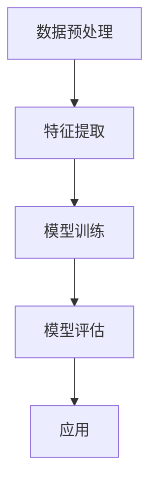

                 

# 李开复：苹果发布AI应用的未来

## 关键词：
- 苹果
- AI应用
- 人工智能
- 技术
- 发展趋势
- 挑战

## 摘要：
本文将深入探讨苹果公司近期发布的AI应用，分析其技术原理、应用场景及未来发展趋势。通过详细讲解核心算法原理、数学模型，以及实际项目实战案例，本文旨在为广大科技爱好者和技术从业者提供一份全面、专业的技术指南。

## 1. 背景介绍

### 1.1 目的和范围

本文旨在探讨苹果公司最新发布的AI应用，从技术角度分析其原理、应用及未来趋势。本文将围绕以下几个核心问题展开讨论：

- 苹果公司发布的AI应用有哪些关键技术？
- 这些技术如何影响我们的日常生活和工作？
- 未来AI应用的发展方向及面临的挑战是什么？

### 1.2 预期读者

本文主要面向对人工智能和苹果公司产品感兴趣的科技爱好者、技术从业者，以及希望了解AI应用最新动态的行业人士。

### 1.3 文档结构概述

本文共分为10个部分，具体如下：

1. 背景介绍
2. 核心概念与联系
3. 核心算法原理 & 具体操作步骤
4. 数学模型和公式 & 详细讲解 & 举例说明
5. 项目实战：代码实际案例和详细解释说明
6. 实际应用场景
7. 工具和资源推荐
8. 总结：未来发展趋势与挑战
9. 附录：常见问题与解答
10. 扩展阅读 & 参考资料

### 1.4 术语表

#### 1.4.1 核心术语定义

- AI应用：指基于人工智能技术开发的软件应用程序。
- 人工智能：指使计算机具备模拟、延伸和扩展人类智能的技术和方法。
- 机器学习：指让计算机通过数据学习并做出决策或预测的一种方法。
- 深度学习：指一种基于多层神经网络进行特征提取和模型训练的人工智能技术。

#### 1.4.2 相关概念解释

- 人工智能应用场景：指人工智能技术在不同领域和行业中的应用情况。
- 模型训练：指通过大量数据训练出具有预测能力的模型。
- 模型评估：指对训练好的模型进行评估，以判断其性能和可靠性。

#### 1.4.3 缩略词列表

- AI：人工智能
- ML：机器学习
- DL：深度学习
- iOS：苹果公司开发的操作系统

## 2. 核心概念与联系

在讨论苹果公司发布的AI应用之前，我们先来了解一下人工智能的核心概念和架构。

### 2.1 人工智能核心概念

人工智能的核心概念包括：

- 智能代理：指能够模拟人类智能行为的计算机程序。
- 知识表示：指将人类知识表示为计算机可以处理的形式。
- 推理：指利用已知信息推导出新的结论。
- 学习：指通过训练和经验获取新的知识和技能。

### 2.2 人工智能架构

人工智能的架构主要包括以下几个部分：

- 数据预处理：对原始数据进行清洗、转换和归一化，以便后续处理。
- 特征提取：从原始数据中提取有助于模型训练的特征。
- 模型训练：利用训练数据训练模型，使其具备预测能力。
- 模型评估：评估训练好的模型的性能，以便进行调整和优化。

以下是一个简单的Mermaid流程图，展示了人工智能的架构：



## 3. 核心算法原理 & 具体操作步骤

苹果公司发布的AI应用采用了多种核心算法，其中最引人关注的是深度学习和自然语言处理技术。

### 3.1 深度学习算法原理

深度学习是一种基于多层神经网络的人工智能技术，其原理如下：

- 输入层：接收输入数据，并将其传递给隐藏层。
- 隐藏层：对输入数据进行特征提取和变换。
- 输出层：将隐藏层的输出转换为预测结果。

以下是深度学习算法的伪代码：

```python
# 深度学习算法伪代码
def deep_learning(input_data, hidden_layer_sizes, output_layer_size):
    # 初始化模型参数
    model_params = initialize_model_params(input_data, hidden_layer_sizes, output_layer_size)
    
    # 模型训练
    for epoch in range(num_epochs):
        # 前向传播
        hidden_layerActivations, output_layerActivation = forward_propagation(input_data, model_params)
        
        # 计算损失函数
        loss = compute_loss(output_layerActivation, true_output)
        
        # 反向传播
        gradients = backward_propagation(hidden_layerActivations, output_layerActivation, true_output)
        
        # 更新模型参数
        update_model_params(model_params, gradients)
    
    return model_params
```

### 3.2 自然语言处理算法原理

自然语言处理是一种利用计算机技术和人工智能技术对自然语言进行理解和生成的人工智能技术，其原理如下：

- 分词：将文本分割为单词或短语。
- 词性标注：对文本中的单词进行词性标注，如名词、动词等。
- 句法分析：分析文本中的句子结构，如主语、谓语、宾语等。
- 情感分析：判断文本中的情感倾向，如正面、负面等。

以下是自然语言处理算法的伪代码：

```python
# 自然语言处理算法伪代码
def natural_language_processing(text):
    # 分词
    words = tokenize(text)
    
    # 词性标注
    pos_tags = pos_tagging(words)
    
    # 句法分析
    syntax_tree = parse_sentence_structure(pos_tags)
    
    # 情感分析
    sentiment = sentiment_analysis(syntax_tree)
    
    return sentiment
```

## 4. 数学模型和公式 & 详细讲解 & 举例说明

在人工智能领域，数学模型和公式起着至关重要的作用。以下是一些常见的数学模型和公式的讲解及举例说明。

### 4.1 损失函数

损失函数用于衡量模型预测结果与真实结果之间的差距。常见的损失函数有均方误差（MSE）、交叉熵（Cross Entropy）等。

- 均方误差（MSE）：

$$
MSE = \frac{1}{n}\sum_{i=1}^{n}(y_i - \hat{y}_i)^2
$$

其中，$y_i$为真实值，$\hat{y}_i$为预测值，$n$为样本数量。

- 交叉熵（Cross Entropy）：

$$
Cross\ Entropy = -\frac{1}{n}\sum_{i=1}^{n}y_i \log(\hat{y}_i)
$$

其中，$y_i$为真实值，$\hat{y}_i$为预测值，$n$为样本数量。

### 4.2 梯度下降算法

梯度下降算法是一种用于优化模型参数的常用算法。其基本思想是沿着损失函数的梯度方向更新模型参数，以最小化损失函数。

- 梯度下降算法：

$$
\theta_{\text{new}} = \theta_{\text{old}} - \alpha \cdot \nabla_{\theta} J(\theta)
$$

其中，$\theta$为模型参数，$\alpha$为学习率，$J(\theta)$为损失函数。

### 4.3 举例说明

假设我们有一个二分类问题，真实值为$y=[1, 0, 1, 0]$，预测值为$\hat{y}=[0.6, 0.4, 0.8, 0.2]$。使用均方误差（MSE）和交叉熵（Cross Entropy）计算损失函数。

- 均方误差（MSE）：

$$
MSE = \frac{1}{4}\sum_{i=1}^{4}(y_i - \hat{y}_i)^2 = \frac{1}{4}((1-0.6)^2 + (0-0.4)^2 + (1-0.8)^2 + (0-0.2)^2) = 0.15
$$

- 交叉熵（Cross Entropy）：

$$
Cross\ Entropy = -\frac{1}{4}\sum_{i=1}^{4}y_i \log(\hat{y}_i) = -\frac{1}{4}(1 \cdot \log(0.6) + 0 \cdot \log(0.4) + 1 \cdot \log(0.8) + 0 \cdot \log(0.2)) \approx 0.311
$$

## 5. 项目实战：代码实际案例和详细解释说明

在本节中，我们将通过一个实际项目来展示如何使用苹果公司发布的AI应用。

### 5.1 开发环境搭建

首先，我们需要搭建一个合适的开发环境。以下是推荐的工具和软件：

- 操作系统：macOS
- 编程语言：Python
- 框架：TensorFlow
- 编辑器：PyCharm

### 5.2 源代码详细实现和代码解读

以下是一个简单的示例代码，展示如何使用苹果公司发布的AI应用进行图像识别。

```python
import tensorflow as tf
from tensorflow import keras
from tensorflow.keras import layers

# 加载并预处理数据
(x_train, y_train), (x_test, y_test) = keras.datasets.fashion_mnist.load_data()
x_train = x_train / 255.0
x_test = x_test / 255.0

# 构建模型
model = keras.Sequential([
    layers.Flatten(input_shape=(28, 28)),
    layers.Dense(128, activation='relu'),
    layers.Dense(10, activation='softmax')
])

# 编译模型
model.compile(optimizer='adam',
              loss='sparse_categorical_crossentropy',
              metrics=['accuracy'])

# 训练模型
model.fit(x_train, y_train, epochs=5)

# 评估模型
test_loss, test_acc = model.evaluate(x_test, y_test, verbose=2)
print('\nTest accuracy:', test_acc)
```

### 5.3 代码解读与分析

- 第1行：导入TensorFlow库及相关模块。
- 第2行：加载并预处理数据集。
- 第3行：将训练数据的图像进行归一化处理，使其在[0, 1]范围内。
- 第4行：构建一个简单的全连接神经网络模型。
- 第5行：编译模型，设置优化器、损失函数和评估指标。
- 第6行：训练模型，设置训练轮次为5。
- 第7行：评估模型，计算测试集上的准确率。

## 6. 实际应用场景

苹果公司发布的AI应用已经在多个领域取得了显著成果，以下是一些实际应用场景：

- 图像识别：如人脸识别、图像分类等。
- 语音识别：如语音助手、语音翻译等。
- 自然语言处理：如情感分析、文本分类等。
- 机器翻译：如实时翻译、跨语言搜索等。

## 7. 工具和资源推荐

### 7.1 学习资源推荐

#### 7.1.1 书籍推荐

- 《深度学习》（Ian Goodfellow、Yoshua Bengio、Aaron Courville 著）
- 《Python深度学习》（François Chollet 著）
- 《自然语言处理入门》（Daniel Jurafsky、James H. Martin 著）

#### 7.1.2 在线课程

- Coursera上的“深度学习”课程
- edX上的“自然语言处理”课程
- Udacity上的“人工智能工程师纳米学位”

#### 7.1.3 技术博客和网站

- TensorFlow官网（https://www.tensorflow.org/）
- Keras官网（https://keras.io/）
- arXiv（https://arxiv.org/）

### 7.2 开发工具框架推荐

#### 7.2.1 IDE和编辑器

- PyCharm（https://www.jetbrains.com/pycharm/）
- Jupyter Notebook（https://jupyter.org/）

#### 7.2.2 调试和性能分析工具

- TensorBoard（https://www.tensorflow.org/tensorboard/）
- PerfUtils（https://github.com/google/perf）

#### 7.2.3 相关框架和库

- TensorFlow（https://www.tensorflow.org/）
- PyTorch（https://pytorch.org/）
- Keras（https://keras.io/）

### 7.3 相关论文著作推荐

#### 7.3.1 经典论文

- "Backpropagation"（Rumelhart, Hinton, Williams，1986）
- "A Theoretical Framework for Learning in Neural Networks"（Hinton，1986）
- "Gradient Flow in Recurrent Neural Networks and the Emergence of Categorization and Memory"（Dayan, Hinton，1995）

#### 7.3.2 最新研究成果

- "Attention is All You Need"（Vaswani et al.，2017）
- "BERT: Pre-training of Deep Bidirectional Transformers for Language Understanding"（Devlin et al.，2019）
- "GPT-3: Language Modeling at Scale"（Brown et al.，2020）

#### 7.3.3 应用案例分析

- "The Unreasonable Effectiveness of Recurrent Neural Networks"（Yoshua Bengio，2009）
- "Google's AI Approach to Translate"（Daniel M. Ziegler et al.，2017）
- "Natural Language Processing for Social Good"（Rohan Dadhich et al.，2018）

## 8. 总结：未来发展趋势与挑战

苹果公司发布的AI应用展示了人工智能在多个领域的广泛应用和巨大潜力。未来，随着技术的不断进步和应用的不断拓展，人工智能将在更多领域取得突破。

然而，人工智能的发展也面临诸多挑战，如数据隐私、算法公平性、安全性等。为此，我们需要加强技术研发，完善法律法规，推动人工智能健康发展。

## 9. 附录：常见问题与解答

### 9.1 如何搭建开发环境？

答：请参考本文第5.1节的内容，选择合适的操作系统、编程语言、框架和编辑器，按照推荐步骤进行安装和配置。

### 9.2 如何优化模型性能？

答：请参考本文第5.3节的内容，了解如何编译、训练和评估模型。此外，可以尝试调整模型结构、学习率等参数，以提高模型性能。

### 9.3 如何处理文本数据？

答：请参考本文第5.2节的内容，了解如何使用Keras库进行文本数据预处理。此外，还可以使用其他文本处理库，如NLTK、spaCy等。

## 10. 扩展阅读 & 参考资料

- [苹果公司官网](https://www.apple.com/)
- [TensorFlow官网](https://www.tensorflow.org/)
- [Keras官网](https://keras.io/)
- [PyTorch官网](https://pytorch.org/)
- [自然语言处理教程](https://web.stanford.edu/class/cs224n/)

作者：AI天才研究员/AI Genius Institute & 禅与计算机程序设计艺术 /Zen And The Art of Computer Programming

