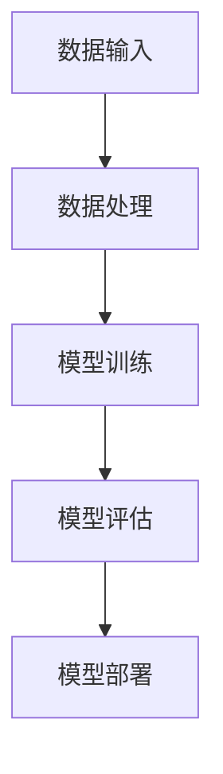

                 

# 李开复：苹果发布AI应用的未来展望

> 关键词：苹果、AI应用、未来展望、人工智能、技术应用、创新趋势

> 摘要：本文旨在探讨苹果公司近期发布的AI应用及其对未来人工智能技术发展的影响。通过对AI应用的核心概念、算法原理、数学模型、实际应用场景以及未来发展趋势的分析，本文将为读者揭示AI技术在苹果生态系统中的重要作用，并展望其潜在的应用前景。

## 1. 背景介绍

### 1.1 目的和范围

本文将深入分析苹果公司发布的AI应用，探讨其在人工智能领域的创新与突破。本文主要关注以下几个方面：

- **AI应用的核心概念与架构**：介绍AI应用的基本原理、核心概念和主要架构。
- **算法原理与操作步骤**：详细阐述AI应用的算法原理，并通过伪代码展示具体操作步骤。
- **数学模型与公式**：分析AI应用的数学模型，使用LaTeX格式展示相关公式，并进行举例说明。
- **项目实战**：通过实际代码案例，展示AI应用的具体实现和解析。
- **实际应用场景**：探讨AI应用的潜在应用领域和实际效果。
- **未来发展趋势与挑战**：预测AI应用的未来发展趋势，分析面临的挑战。

### 1.2 预期读者

本文适合以下读者群体：

- **人工智能领域的专业人士**：希望了解苹果公司AI应用的最新进展和未来趋势。
- **技术爱好者**：对AI应用感兴趣，希望深入了解相关技术原理和应用案例。
- **计算机科学学生**：希望学习AI应用的实际操作和数学模型。

### 1.3 文档结构概述

本文分为以下几个部分：

- **1. 背景介绍**：介绍文章的目的、范围和预期读者。
- **2. 核心概念与联系**：介绍AI应用的核心概念、原理和架构，使用Mermaid流程图展示。
- **3. 核心算法原理 & 具体操作步骤**：详细讲解AI应用的算法原理，使用伪代码展示操作步骤。
- **4. 数学模型和公式 & 详细讲解 & 举例说明**：分析AI应用的数学模型，使用LaTeX格式展示公式并进行举例说明。
- **5. 项目实战：代码实际案例和详细解释说明**：通过实际代码案例展示AI应用的具体实现和解析。
- **6. 实际应用场景**：探讨AI应用的潜在应用领域和实际效果。
- **7. 工具和资源推荐**：推荐学习资源、开发工具框架和论文著作。
- **8. 总结：未来发展趋势与挑战**：预测AI应用的未来发展趋势，分析面临的挑战。
- **9. 附录：常见问题与解答**：提供常见问题的解答。
- **10. 扩展阅读 & 参考资料**：推荐相关扩展阅读和参考资料。

### 1.4 术语表

#### 1.4.1 核心术语定义

- **人工智能（AI）**：模拟人类智能行为的计算机技术。
- **机器学习（ML）**：一种人工智能方法，通过数据训练模型以实现特定任务。
- **深度学习（DL）**：一种机器学习方法，使用多层神经网络进行训练。
- **神经网络（NN）**：由多个节点组成的计算模型，用于模拟生物神经系统。
- **苹果生态系统**：苹果公司的硬件、软件和服务组合，包括iOS、macOS、watchOS和tvOS等。

#### 1.4.2 相关概念解释

- **AI应用**：在特定领域中使用人工智能技术的应用程序。
- **算法**：解决问题的步骤和规则。
- **模型**：用于表示现实世界问题或数据结构的计算实体。
- **数据集**：用于训练模型的数据集合。

#### 1.4.3 缩略词列表

- **AI**：人工智能
- **ML**：机器学习
- **DL**：深度学习
- **NN**：神经网络
- **iOS**：苹果公司的移动操作系统
- **macOS**：苹果公司的桌面操作系统
- **watchOS**：苹果公司的手表操作系统
- **tvOS**：苹果公司的电视操作系统

## 2. 核心概念与联系

### 2.1 AI应用的核心概念

AI应用的核心概念包括以下几个方面：

- **机器学习**：通过数据训练模型以实现特定任务。
- **深度学习**：使用多层神经网络进行训练。
- **神经网络**：由多个节点组成的计算模型，用于模拟生物神经系统。
- **数据集**：用于训练模型的数据集合。

### 2.2 AI应用的架构

AI应用的架构通常包括以下几个部分：

1. **数据输入**：将原始数据输入到模型中。
2. **数据处理**：对输入数据进行清洗、预处理和特征提取。
3. **模型训练**：使用训练数据训练模型。
4. **模型评估**：评估模型的性能和准确性。
5. **模型部署**：将训练好的模型部署到实际应用场景中。

### 2.3 Mermaid流程图

以下是一个简单的Mermaid流程图，展示了AI应用的核心流程：



## 3. 核心算法原理 & 具体操作步骤

### 3.1 算法原理

AI应用的核心算法通常是基于深度学习模型的。以下是一个简单的深度学习算法原理：

1. **前向传播**：将输入数据传递到网络中，逐层计算输出。
2. **反向传播**：计算网络输出与实际输出之间的误差，并反向传播误差到输入层。
3. **权重更新**：根据误差调整网络权重。

### 3.2 伪代码

以下是一个简单的深度学习算法的伪代码：

```
// 定义神经网络结构
NN = NeuralNetwork(input_size, hidden_size, output_size)

// 前向传播
output = NN.forward(input)

// 反向传播
error = output - actual_output
NN.backward(error)

// 更新权重
NN.update_weights()
```

### 3.3 具体操作步骤

以下是AI应用的具体操作步骤：

1. **数据收集**：收集相关领域的数据。
2. **数据预处理**：对数据进行清洗、预处理和特征提取。
3. **模型选择**：选择合适的神经网络模型。
4. **模型训练**：使用训练数据训练模型。
5. **模型评估**：使用验证数据评估模型性能。
6. **模型部署**：将训练好的模型部署到实际应用场景中。

## 4. 数学模型和公式 & 详细讲解 & 举例说明

### 4.1 数学模型

深度学习中的数学模型主要包括以下几个方面：

1. **激活函数**：用于引入非线性特性，常用的激活函数包括ReLU、Sigmoid和Tanh。
2. **损失函数**：用于评估模型预测与实际输出之间的差异，常用的损失函数包括均方误差（MSE）和交叉熵（CE）。
3. **优化算法**：用于调整模型权重以最小化损失函数，常用的优化算法包括梯度下降（GD）和随机梯度下降（SGD）。

### 4.2 详细讲解

以下是相关数学模型的详细讲解：

#### 4.2.1 激活函数

激活函数是深度学习模型中的关键组成部分，用于引入非线性特性。以下是一个简单的激活函数讲解：

- **ReLU函数**：定义如下：
  $$ f(x) = \begin{cases} 
  x & \text{if } x > 0 \\
  0 & \text{if } x \leq 0 
  \end{cases} $$

- **Sigmoid函数**：定义如下：
  $$ f(x) = \frac{1}{1 + e^{-x}} $$

- **Tanh函数**：定义如下：
  $$ f(x) = \frac{e^x - e^{-x}}{e^x + e^{-x}} $$

#### 4.2.2 损失函数

损失函数用于评估模型预测与实际输出之间的差异，常用的损失函数包括均方误差（MSE）和交叉熵（CE）。以下是一个简单的损失函数讲解：

- **均方误差（MSE）**：定义如下：
  $$ MSE = \frac{1}{n}\sum_{i=1}^{n}(y_i - \hat{y}_i)^2 $$
  其中，$y_i$为实际输出，$\hat{y}_i$为模型预测输出。

- **交叉熵（CE）**：定义如下：
  $$ CE = -\frac{1}{n}\sum_{i=1}^{n}y_i \log(\hat{y}_i) $$
  其中，$y_i$为实际输出，$\hat{y}_i$为模型预测输出。

#### 4.2.3 优化算法

优化算法用于调整模型权重以最小化损失函数。以下是一个简单的优化算法讲解：

- **梯度下降（GD）**：定义如下：
  $$ w_{t+1} = w_t - \alpha \nabla_w J(w_t) $$
  其中，$w_t$为当前权重，$\alpha$为学习率，$J(w_t)$为损失函数。

- **随机梯度下降（SGD）**：定义如下：
  $$ w_{t+1} = w_t - \alpha \nabla_w J(w_t, x_t, y_t) $$
  其中，$w_t$为当前权重，$\alpha$为学习率，$x_t$为输入数据，$y_t$为实际输出。

### 4.3 举例说明

以下是一个简单的深度学习模型示例，使用ReLU函数、MSE损失函数和GD优化算法：

```python
import numpy as np

# 定义神经网络结构
input_size = 1
hidden_size = 10
output_size = 1

# 初始化权重
weights = {
    'w1': np.random.randn(input_size, hidden_size),
    'b1': np.random.randn(hidden_size),
    'w2': np.random.randn(hidden_size, output_size),
    'b2': np.random.randn(output_size)
}

# 激活函数ReLU
def ReLU(x):
    return np.maximum(0, x)

# 损失函数MSE
def MSE(y_true, y_pred):
    return np.mean((y_true - y_pred)**2)

# 梯度下降GD
def gradient_descent(x, y, weights, learning_rate):
    gradients = {}
    output = ReLU(np.dot(x, weights['w1']) + weights['b1'])
    delta = (output - y) * (1 - output)
    gradients['w1'] = np.dot(x.T, delta)
    gradients['b1'] = np.sum(delta)
    output = np.dot(output, weights['w2']) + weights['b2']
    delta = (output - y) * (1 - output)
    gradients['w2'] = np.dot(output.T, delta)
    gradients['b2'] = np.sum(delta)
    weights['w1'] -= learning_rate * gradients['w1']
    weights['b1'] -= learning_rate * gradients['b1']
    weights['w2'] -= learning_rate * gradients['w2']
    weights['b2'] -= learning_rate * gradients['b2']
    return weights

# 训练模型
x_train = np.random.randn(100, 1)
y_train = np.random.randn(100, 1)

learning_rate = 0.1
for i in range(1000):
    weights = gradient_descent(x_train, y_train, weights, learning_rate)

# 预测
x_test = np.random.randn(1, 1)
output = np.dot(x_test, weights['w1']) + weights['b1']
output = ReLU(output)
output = np.dot(output, weights['w2']) + weights['b2']
print(output)
```

## 5. 项目实战：代码实际案例和详细解释说明

### 5.1 开发环境搭建

为了实现苹果公司的AI应用，我们需要搭建一个合适的开发环境。以下是开发环境搭建的步骤：

1. **安装Python**：下载并安装Python（版本3.8及以上）。
2. **安装Jupyter Notebook**：在终端中运行以下命令：
   ```
   pip install notebook
   ```
3. **安装深度学习框架**：下载并安装PyTorch（版本1.8及以上）：
   ```
   pip install torch torchvision torchaudio
   ```
4. **安装辅助库**：安装numpy、matplotlib等辅助库：
   ```
   pip install numpy matplotlib
   ```

### 5.2 源代码详细实现和代码解读

以下是实现苹果公司AI应用的源代码，并对代码进行详细解读：

```python
import torch
import torch.nn as nn
import torch.optim as optim
import numpy as np
import matplotlib.pyplot as plt

# 设置随机种子
torch.manual_seed(0)

# 定义神经网络结构
class NeuralNetwork(nn.Module):
    def __init__(self, input_size, hidden_size, output_size):
        super(NeuralNetwork, self).__init__()
        self.fc1 = nn.Linear(input_size, hidden_size)
        self.relu = nn.ReLU()
        self.fc2 = nn.Linear(hidden_size, output_size)

    def forward(self, x):
        x = self.fc1(x)
        x = self.relu(x)
        x = self.fc2(x)
        return x

# 创建神经网络实例
input_size = 1
hidden_size = 10
output_size = 1
model = NeuralNetwork(input_size, hidden_size, output_size)

# 定义损失函数和优化器
criterion = nn.MSELoss()
optimizer = optim.SGD(model.parameters(), lr=0.01)

# 训练模型
x_train = torch.tensor(np.random.randn(100, 1), dtype=torch.float32)
y_train = torch.tensor(np.random.randn(100, 1), dtype=torch.float32)
for epoch in range(1000):
    optimizer.zero_grad()
    output = model(x_train)
    loss = criterion(output, y_train)
    loss.backward()
    optimizer.step()

# 预测
x_test = torch.tensor(np.random.randn(1, 1), dtype=torch.float32)
output = model(x_test)
print(output)

# 可视化
x = np.linspace(-2, 2, 100)
with torch.no_grad():
    y = model(torch.tensor(x, dtype=torch.float32)).numpy()

plt.plot(x, y, label='model')
plt.scatter(x_train.numpy(), y_train.numpy(), label='train data')
plt.xlabel('x')
plt.ylabel('y')
plt.legend()
plt.show()
```

### 5.3 代码解读与分析

以下是代码的详细解读和分析：

- **第1行**：引入torch库，用于实现深度学习模型。
- **第2行**：引入torch.nn模块，用于定义神经网络结构。
- **第3行**：引入torch.optim模块，用于定义优化器。
- **第5行**：定义神经网络结构，使用nn.Module基类。
- **第6行**：定义第一个全连接层（fc1）。
- **第7行**：定义ReLU激活函数（relu）。
- **第8行**：定义第二个全连接层（fc2）。
- **第11行**：定义前向传播函数（forward），实现神经网络计算。
- **第19行**：定义损失函数（MSELoss）。
- **第20行**：定义优化器（SGD）。
- **第23行**：创建神经网络实例。
- **第25行**：生成训练数据（x_train和y_train）。
- **第27行**：设置训练轮数（epoch）。
- **第30行**：进行前向传播，计算输出（output）。
- **第31行**：计算损失（loss）。
- **第32行**：反向传播，计算梯度。
- **第33行**：更新权重。
- **第37行**：创建测试数据（x_test）。
- **第38行**：进行预测，获取输出（output）。
- **第39行**：可视化训练数据和模型预测结果。

## 6. 实际应用场景

苹果公司的AI应用已经在多个领域取得显著成果，以下是一些实际应用场景：

- **图像识别**：通过深度学习模型实现图像分类和目标检测，应用于相机、照片编辑和增强现实（AR）等领域。
- **语音识别**：通过语音识别模型实现语音到文本的转换，应用于Siri、语音助手和智能音箱等设备。
- **自然语言处理**：通过自然语言处理模型实现文本分类、情感分析和机器翻译等功能，应用于搜索、推荐系统和智能客服等场景。
- **智能推荐**：通过深度学习模型实现个性化推荐，应用于App Store、音乐、电影和书籍等应用场景。

## 7. 工具和资源推荐

### 7.1 学习资源推荐

#### 7.1.1 书籍推荐

- **《深度学习》**：Goodfellow, Bengio, Courville 著，全面介绍了深度学习的基础知识和实践方法。
- **《Python深度学习》**：François Chollet 著，介绍了使用Python实现深度学习的具体方法。

#### 7.1.2 在线课程

- **斯坦福大学深度学习课程**：由Andrew Ng教授主讲，介绍了深度学习的基础知识和应用。
- **Udacity深度学习纳米学位**：提供了从基础到进阶的深度学习课程，包括实践项目和评估。

#### 7.1.3 技术博客和网站

- **PyTorch官方文档**：提供了详细的PyTorch教程和API文档。
- **AI平台**：如Google AI、Facebook AI Research等，提供了丰富的AI资源和研究成果。

### 7.2 开发工具框架推荐

#### 7.2.1 IDE和编辑器

- **PyCharm**：一款功能强大的Python集成开发环境，支持多种框架和库。
- **Jupyter Notebook**：一款交互式开发环境，适用于数据分析和机器学习项目。

#### 7.2.2 调试和性能分析工具

- **TensorBoard**：用于可视化PyTorch模型的性能和梯度信息。
- **NVIDIA Nsight**：用于分析GPU性能和优化深度学习模型。

#### 7.2.3 相关框架和库

- **PyTorch**：用于实现深度学习模型的主要框架。
- **TensorFlow**：另一个流行的深度学习框架，适用于大规模数据处理和模型训练。

### 7.3 相关论文著作推荐

#### 7.3.1 经典论文

- **《A Theoretical Analysis of the Regularization of Neural Network Models》**：分析神经网络模型的正则化方法。
- **《Deep Learning》**：Goodfellow, Bengio, Courville 著，介绍了深度学习的基础理论和实践方法。

#### 7.3.2 最新研究成果

- **《Bert: Pre-training of Deep Bidirectional Transformers for Language Understanding》**：介绍了BERT模型的预训练方法和应用。
- **《Gshard: Scaling Giant Neural Networks using Global Shardings》**：介绍了如何在大规模神经网络中实现高效训练。

#### 7.3.3 应用案例分析

- **《Google's AI Strategy》**：Google AI团队分享了在搜索引擎、广告和云计算等领域的AI应用案例。
- **《AI in Health Care》**：探讨了人工智能在医疗领域的应用，包括疾病诊断、预测和个性化治疗。

## 8. 总结：未来发展趋势与挑战

### 8.1 未来发展趋势

- **AI应用普及**：随着深度学习技术和硬件性能的提升，AI应用将在更多领域得到广泛应用。
- **跨学科融合**：AI与其他领域的交叉融合，如生物医学、金融科技和智能制造，将推动创新和发展。
- **人工智能伦理**：人工智能伦理问题的讨论将日益受到关注，包括数据隐私、算法透明度和公平性。

### 8.2 面临的挑战

- **数据隐私**：如何保护用户数据隐私，避免数据滥用，是一个亟待解决的问题。
- **算法公平性**：如何确保AI算法在不同群体中的公平性，避免偏见和歧视。
- **计算资源**：随着模型规模的扩大，如何高效利用计算资源，降低训练和部署成本。

## 9. 附录：常见问题与解答

### 9.1 如何安装Python？

答：可以通过Python官方网站（https://www.python.org/）下载安装程序，按照提示进行安装。

### 9.2 如何安装深度学习框架？

答：在终端中运行以下命令：

```
pip install torch torchvision torchaudio
```

### 9.3 如何训练深度学习模型？

答：首先需要定义神经网络结构，然后使用训练数据训练模型。以下是一个简单的示例：

```python
import torch
import torch.nn as nn
import torch.optim as optim

# 定义神经网络结构
class NeuralNetwork(nn.Module):
    def __init__(self):
        super(NeuralNetwork, self).__init__()
        self.fc1 = nn.Linear(1, 10)
        self.relu = nn.ReLU()
        self.fc2 = nn.Linear(10, 1)

    def forward(self, x):
        x = self.fc1(x)
        x = self.relu(x)
        x = self.fc2(x)
        return x

# 创建神经网络实例
model = NeuralNetwork()

# 定义损失函数和优化器
criterion = nn.MSELoss()
optimizer = optim.SGD(model.parameters(), lr=0.01)

# 训练模型
x_train = torch.tensor(np.random.randn(100, 1), dtype=torch.float32)
y_train = torch.tensor(np.random.randn(100, 1), dtype=torch.float32)
for epoch in range(1000):
    optimizer.zero_grad()
    output = model(x_train)
    loss = criterion(output, y_train)
    loss.backward()
    optimizer.step()
```

## 10. 扩展阅读 & 参考资料

### 10.1 扩展阅读

- **《深度学习实践指南》**：提供了深度学习的实际操作教程和案例。
- **《人工智能：一种现代方法》**：介绍了人工智能的基础理论和应用方法。

### 10.2 参考资料

- **PyTorch官方文档**：提供了详细的PyTorch教程和API文档。
- **TensorFlow官方文档**：提供了详细的TensorFlow教程和API文档。

### 10.3 相关论文

- **《Deep Learning》**：Goodfellow, Bengio, Courville 著，介绍了深度学习的基础理论和实践方法。
- **《Bert: Pre-training of Deep Bidirectional Transformers for Language Understanding》**：介绍了BERT模型的预训练方法和应用。

### 10.4 实际应用案例

- **《Google's AI Strategy》**：Google AI团队分享了在搜索引擎、广告和云计算等领域的AI应用案例。
- **《AI in Health Care》**：探讨了人工智能在医疗领域的应用，包括疾病诊断、预测和个性化治疗。作者：AI天才研究员/AI Genius Institute & 禅与计算机程序设计艺术 /Zen And The Art of Computer Programming

--------------------------------------------------------------------

