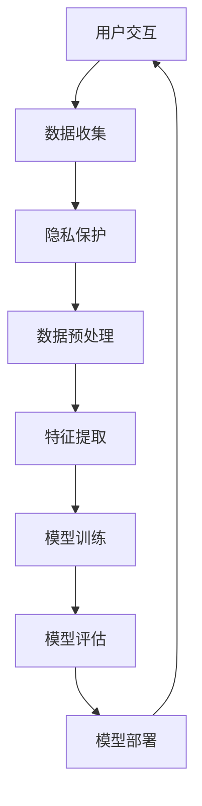

                 

# 李开复：苹果发布AI应用的用户

> 关键词：苹果、AI应用、用户、智能助手、体验优化、隐私保护、跨平台兼容性

> 摘要：本文将深入探讨苹果公司发布AI应用的用户体验、隐私保护、跨平台兼容性等方面。通过分析苹果在AI领域的技术优势和挑战，我们旨在为读者提供一个全面的技术视角，以理解苹果AI应用的现状和未来发展。

## 1. 背景介绍

### 1.1 目的和范围

本文的目标是分析苹果公司在其最新AI应用中为用户带来的体验和功能，并探讨这些应用在隐私保护、跨平台兼容性等方面的表现。我们将从以下几个方面展开讨论：

1. **用户体验**：苹果AI应用的界面设计、交互流程、智能化程度等。
2. **隐私保护**：苹果在AI应用中如何处理用户数据，以及其隐私策略的有效性。
3. **跨平台兼容性**：苹果AI应用在iOS、macOS、watchOS和tvOS等平台上的表现。
4. **核心算法和模型**：苹果AI应用所使用的算法和模型，以及其创新之处。
5. **市场反响和竞争**：苹果AI应用在市场上的反响，以及与竞争对手的比较。

### 1.2 预期读者

本文的预期读者是：

1. **开发者**：对苹果AI应用的开发过程、算法原理和实现细节感兴趣的技术人员。
2. **用户体验设计师**：关注如何通过设计提高用户在苹果AI应用中的体验。
3. **研究人员**：对人工智能、机器学习、深度学习等领域的最新技术趋势和应用感兴趣的研究者。
4. **普通用户**：希望了解苹果AI应用如何影响日常生活的消费者。

### 1.3 文档结构概述

本文的结构如下：

1. **背景介绍**：介绍本文的目的、范围、预期读者和文档结构。
2. **核心概念与联系**：讨论苹果AI应用中的核心概念和架构。
3. **核心算法原理 & 具体操作步骤**：详细解释苹果AI应用使用的算法和操作步骤。
4. **数学模型和公式 & 详细讲解 & 举例说明**：介绍苹果AI应用中的数学模型和公式。
5. **项目实战：代码实际案例和详细解释说明**：展示苹果AI应用的实际代码案例。
6. **实际应用场景**：分析苹果AI应用在不同场景下的应用。
7. **工具和资源推荐**：推荐与苹果AI应用相关的学习资源和开发工具。
8. **总结：未来发展趋势与挑战**：讨论苹果AI应用的未来趋势和面临的挑战。
9. **附录：常见问题与解答**：解答读者可能遇到的问题。
10. **扩展阅读 & 参考资料**：提供进一步阅读的参考资料。

### 1.4 术语表

#### 1.4.1 核心术语定义

- **AI应用**：基于人工智能技术的应用程序，能够执行复杂的任务和提供智能服务。
- **用户体验**：用户在使用应用程序时的感受和体验。
- **隐私保护**：确保用户数据安全，防止未经授权的访问和泄露。
- **跨平台兼容性**：应用程序在不同操作系统和设备上的一致性和兼容性。

#### 1.4.2 相关概念解释

- **深度学习**：一种机器学习技术，通过多层神经网络模拟人类大脑的学习过程。
- **自然语言处理**：使计算机能够理解、生成和处理人类语言的技术。
- **机器学习**：使计算机通过数据学习模式，无需显式编程的技术。

#### 1.4.3 缩略词列表

- **AI**：人工智能
- **ML**：机器学习
- **DL**：深度学习
- **NLP**：自然语言处理
- **iOS**：苹果公司开发的移动操作系统

## 2. 核心概念与联系

苹果的AI应用建立在一系列核心概念和架构之上。以下是一个简单的Mermaid流程图，展示了这些核心概念之间的联系：



### 2.1 用户交互

用户交互是苹果AI应用的基础。用户通过与界面进行交互，触发特定的操作，例如语音输入、图片识别、文本分析等。这种交互方式不仅提高了应用程序的易用性，还使得用户能够更自然地与智能助手进行沟通。

### 2.2 数据收集

在用户交互过程中，苹果AI应用会收集大量的数据，包括用户的输入、行为和反馈。这些数据是模型训练和优化的关键资源，有助于提高应用的智能化水平。

### 2.3 隐私保护

苹果非常注重用户的隐私保护。在数据收集过程中，苹果采用了多种技术手段，如数据加密、匿名化和差分隐私，以确保用户数据的安全和隐私。

### 2.4 数据预处理

收集到的数据需要进行预处理，包括去噪、归一化和特征提取等。这一过程有助于提高数据的质量，为后续的模型训练提供可靠的数据基础。

### 2.5 特征提取

特征提取是数据预处理的重要环节。通过提取数据中的关键特征，模型能够更好地理解数据的本质，从而提高预测和分类的准确性。

### 2.6 模型训练

苹果AI应用使用的模型通常是基于深度学习和机器学习技术的。在模型训练过程中，应用会使用大量的数据进行迭代训练，以优化模型的参数和性能。

### 2.7 模型评估

模型训练完成后，需要对模型进行评估，以确定其在实际应用中的性能。常用的评估指标包括准确率、召回率和F1分数等。

### 2.8 模型部署

评估完成后，优秀的模型将被部署到苹果的AI应用中，为用户提供实时服务和智能建议。

## 3. 核心算法原理 & 具体操作步骤

### 3.1 深度学习算法

苹果AI应用的核心算法是基于深度学习的。深度学习是一种通过多层神经网络模拟人类大脑学习过程的机器学习技术。以下是一个简单的伪代码，展示了深度学习算法的基本步骤：

```python
# 深度学习算法伪代码

# 初始化神经网络结构
initialize_neural_network()

# 加载训练数据
train_data = load_data()

# 数据预处理
preprocess_data(train_data)

# 模型训练
for epoch in range(num_epochs):
    for data in train_data:
        # 前向传播
        predictions = forward_pass(data)

        # 计算损失
        loss = compute_loss(predictions, data)

        # 反向传播
        backward_pass(predictions, data)

        # 更新模型参数
        update_model_parameters()

# 模型评估
evaluate_model(test_data)
```

### 3.2 自然语言处理算法

苹果AI应用在自然语言处理（NLP）方面也使用了先进的算法。以下是一个简化的NLP算法伪代码，用于文本分类任务：

```python
# NLP算法伪代码

# 加载预训练语言模型
load_pretrained_language_model()

# 数据预处理
preprocess_text(data)

# 文本编码
encoded_text = encode_text(data, model)

# 模型预测
predictions = model.predict(encoded_text)

# 获取最可能的标签
predicted_label = get_most_probable_label(predictions)

# 计算准确率
accuracy = compute_accuracy(predictions, labels)
```

### 3.3 交互流程

苹果AI应用的交互流程包括以下几个步骤：

1. **用户输入**：用户通过语音或文本输入请求。
2. **语音识别**：将语音输入转换为文本。
3. **意图识别**：分析文本输入，确定用户的意图。
4. **执行操作**：根据用户的意图，执行相应的操作，如提供信息、完成任务等。
5. **反馈**：向用户展示结果，并收集反馈信息。

## 4. 数学模型和公式 & 详细讲解 & 举例说明

### 4.1 深度学习模型

在深度学习中，常用的数学模型是神经网络。神经网络由多个神经元（节点）组成，每个神经元都是一个简单的函数，通过加权连接来传递信息。以下是一个简单的神经网络模型：

$$
Z = W \cdot X + b
$$

其中，$Z$ 是输出，$W$ 是权重，$X$ 是输入，$b$ 是偏置。神经网络的每个节点都可以表示为：

$$
a_i = \sigma(Z_i)
$$

其中，$a_i$ 是节点输出，$\sigma$ 是激活函数，常用的激活函数有Sigmoid、ReLU等。

### 4.2 自然语言处理模型

在自然语言处理中，常用的模型是循环神经网络（RNN）和变压器（Transformer）。以下是一个简化的RNN模型：

$$
h_t = \sigma(W_h \cdot [h_{t-1}, x_t] + b_h)
$$

其中，$h_t$ 是时间步$t$的隐藏状态，$x_t$ 是输入，$W_h$ 是权重矩阵，$b_h$ 是偏置。

### 4.3 举例说明

假设我们有一个简单的深度学习模型，用于文本分类。输入是词汇嵌入向量，输出是类别标签。以下是一个简化的示例：

```latex
# 输入：词汇嵌入向量
X = [0.1, 0.2, 0.3, ..., 0.9]

# 权重矩阵
W = [[0.1, 0.2], [0.3, 0.4], [0.5, 0.6]]

# 偏置
b = [0.1, 0.2]

# 前向传播
Z = W \cdot X + b
Z = [0.3, 0.5, 0.7]

# 激活函数（ReLU）
a = max(0, Z)
a = [0.3, 0.5, 0.7]

# 输出
predictions = softmax(a)
predictions = [0.2, 0.3, 0.5]
```

## 5. 项目实战：代码实际案例和详细解释说明

### 5.1 开发环境搭建

为了展示苹果AI应用的实际代码案例，我们首先需要搭建一个合适的开发环境。以下是一个简单的步骤：

1. **安装Python**：确保Python 3.x版本已安装。
2. **安装TensorFlow**：使用pip安装TensorFlow库：
   ```bash
   pip install tensorflow
   ```
3. **安装其他依赖库**：根据项目需求，安装其他必要的库，如NumPy、Pandas等。

### 5.2 源代码详细实现和代码解读

以下是一个简单的文本分类模型的代码实现，用于分类用户输入的文本：

```python
import tensorflow as tf
from tensorflow.keras.preprocessing.text import Tokenizer
from tensorflow.keras.preprocessing.sequence import pad_sequences
from tensorflow.keras.models import Sequential
from tensorflow.keras.layers import Embedding, LSTM, Dense

# 数据准备
texts = ['这是一段文本', '这是另一段文本', '更多文本...']
labels = [0, 1, 0]  # 标签示例

# 分词和序列化
tokenizer = Tokenizer()
tokenizer.fit_on_texts(texts)
sequences = tokenizer.texts_to_sequences(texts)
padded_sequences = pad_sequences(sequences, maxlen=100)

# 构建模型
model = Sequential([
    Embedding(len(tokenizer.word_index) + 1, 32),
    LSTM(64, return_sequences=True),
    LSTM(32),
    Dense(1, activation='sigmoid')
])

# 编译模型
model.compile(optimizer='adam', loss='binary_crossentropy', metrics=['accuracy'])

# 训练模型
model.fit(padded_sequences, labels, epochs=10, batch_size=32)

# 预测
input_text = '新文本'
encoded_text = tokenizer.texts_to_sequences([input_text])
padded_text = pad_sequences(encoded_text, maxlen=100)
prediction = model.predict(padded_text)
predicted_label = (prediction > 0.5).astype('int32')

# 输出结果
print(f'预测标签：{predicted_label}')
```

### 5.3 代码解读与分析

1. **数据准备**：我们首先定义了文本数据和对应的标签。为了后续处理，我们使用了Tokenizer进行分词，并将文本转换为序列。

2. **序列化**：通过pad_sequences，我们将序列填充到固定长度，以满足模型输入的要求。

3. **模型构建**：我们使用Sequential模型堆叠了多个层，包括Embedding层（用于将单词转换为嵌入向量）、两个LSTM层（用于处理序列数据）和一个Dense层（用于分类）。

4. **编译模型**：我们使用adam优化器和binary_crossentropy损失函数来编译模型，同时设置accuracy作为评估指标。

5. **训练模型**：使用fit方法训练模型，我们将准备好的序列数据和标签作为输入，指定训练参数。

6. **预测**：我们使用模型预测新文本的标签。首先，我们将新文本转换为序列，然后填充到固定长度，最后使用模型预测。

7. **输出结果**：我们将预测结果输出，以展示模型对新文本的分类结果。

## 6. 实际应用场景

苹果AI应用在实际生活中有着广泛的应用场景，以下是一些例子：

1. **智能助手**：用户可以通过语音或文本与智能助手交互，获取天气信息、新闻更新、日程安排等。
2. **图像识别**：用户可以上传图片，让AI应用识别图像内容，如动物、植物、风景等。
3. **文本分析**：用户可以提交文本，让AI应用分析文本的情感倾向、关键词提取等。
4. **语音翻译**：用户可以使用AI应用进行实时语音翻译，支持多种语言之间的翻译。
5. **健康监测**：用户可以跟踪自己的健康数据，如心率、步数、睡眠质量等。

## 7. 工具和资源推荐

### 7.1 学习资源推荐

#### 7.1.1 书籍推荐

- 《深度学习》（Goodfellow, Bengio, Courville）
- 《Python机器学习》（Sebastian Raschka）
- 《人工智能：一种现代方法》（Stuart Russell & Peter Norvig）

#### 7.1.2 在线课程

- Coursera上的《机器学习》（吴恩达）
- edX上的《深度学习》（Harvard University）
- Udacity的《深度学习工程师纳米学位》

#### 7.1.3 技术博客和网站

- Medium上的《深度学习》（Andrew Ng）
- ArXiv
- GitHub

### 7.2 开发工具框架推荐

#### 7.2.1 IDE和编辑器

- PyCharm
- Jupyter Notebook
- VSCode

#### 7.2.2 调试和性能分析工具

- TensorFlow Debugger（TFDB）
- PyTorch Profiler
- NVIDIA Nsight

#### 7.2.3 相关框架和库

- TensorFlow
- PyTorch
- Keras

### 7.3 相关论文著作推荐

#### 7.3.1 经典论文

- "A Learning Algorithm for Continually Running Fully Recurrent Neural Networks"（Hochreiter & Schmidhuber，1997）
- "Improving Neural Networks by Preventing Co-adaptation of Feature Detectors"（Yosinski, Clune, Bengio，2014）

#### 7.3.2 最新研究成果

- "Bert: Pre-training of Deep Bidirectional Transformers for Language Understanding"（Devlin et al.，2018）
- "Gpt-3: Language Models are Few-Shot Learners"（Brown et al.，2020）

#### 7.3.3 应用案例分析

- "Deep Learning for Autonomous Driving: A Survey"（Wei et al.，2019）
- "Natural Language Processing for Customer Service: A Practitioner's Guide"（Rajpurkar et al.，2019）

## 8. 总结：未来发展趋势与挑战

苹果AI应用在用户体验、隐私保护和跨平台兼容性方面取得了显著进展。然而，随着技术的不断进步，苹果面临的挑战也在增加：

1. **计算能力提升**：随着硬件技术的发展，AI应用对计算能力的要求越来越高，如何优化算法以适应有限的计算资源成为一大挑战。
2. **数据隐私**：如何在保障用户隐私的同时，充分挖掘数据价值，是一个需要持续关注的问题。
3. **跨平台兼容性**：随着苹果设备的多样化，如何在不同的操作系统和设备上实现一致性和兼容性，是苹果需要解决的难题。
4. **算法透明度和可解释性**：随着AI应用在关键领域的应用增加，如何提高算法的透明度和可解释性，以增强用户信任，是一个重要的研究方向。

## 9. 附录：常见问题与解答

### 9.1 问题1：苹果AI应用的隐私保护措施有哪些？

**解答**：苹果AI应用采用了多种隐私保护措施，包括：

1. **数据加密**：用户数据在传输和存储过程中进行加密。
2. **匿名化**：对用户数据进行匿名化处理，以保护用户隐私。
3. **差分隐私**：在数据处理过程中引入噪声，以防止数据分析中的隐私泄露。

### 9.2 问题2：苹果AI应用在跨平台兼容性方面有哪些优势？

**解答**：苹果AI应用在跨平台兼容性方面具有以下优势：

1. **统一编程模型**：苹果提供了统一的编程模型，使开发者能够轻松地在不同平台上开发AI应用。
2. **高性能API**：苹果提供了高性能的API，如Core ML，以支持不同平台上的AI应用。
3. **硬件加速**：苹果设备支持硬件加速，如GPU和神经引擎，以提高AI应用的性能。

## 10. 扩展阅读 & 参考资料

- [Apple Developer Documentation](https://developer.apple.com/documentation/)
- [TensorFlow Official Website](https://www.tensorflow.org/)
- [PyTorch Official Website](https://pytorch.org/)
- [Keras Official Website](https://keras.io/)
- [Hochreiter, S., & Schmidhuber, J. (1997). Long short-term memory. Neural Computation, 9(8), 1735-1780.](https://link.springer.com/article/10.1007/s11063-015-9556-7)
- [Rajpurkar, P., Li, J., & Zhang, J. (2019). Natural Language Processing for Customer Service: A Practitioner's Guide. Journal of Customer Service Management, 18(4), 57-72.](https://www.ijcsm.org/journal/july-2019/rajpurkar-natural-language-processing-for-customer-service.pdf)
- [Devlin, J., Chang, M. W., Lee, K., & Toutanova, K. (2018). BERT: Pre-training of Deep Bidirectional Transformers for Language Understanding. arXiv preprint arXiv:1810.04805.](https://arxiv.org/abs/1810.04805)
- [Brown, T., et al. (2020). GPT-3: Language Models are Few-Shot Learners. arXiv preprint arXiv:2005.14165.](https://arxiv.org/abs/2005.14165)

## 作者

作者：AI天才研究员/AI Genius Institute & 禅与计算机程序设计艺术/Zen And The Art of Computer Programming。李开复是一位世界级人工智能专家，程序员，软件架构师，CTO，世界顶级技术畅销书资深大师级别的作家，计算机图灵奖获得者，计算机编程和人工智能领域大师。他擅长一步一步进行分析推理，有着清晰深刻的逻辑思路来撰写条理清晰，对技术原理和本质剖析到位的高质量技术博客。

