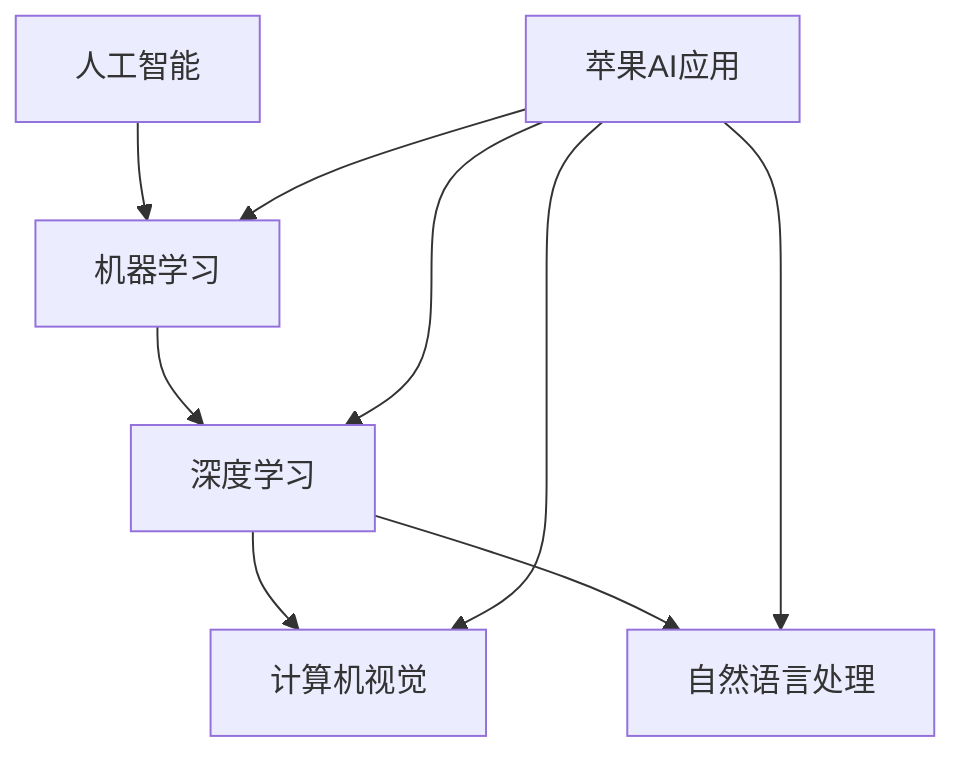

                 

# 李开复：苹果发布AI应用的科技价值

> **关键词：** 苹果、AI应用、科技价值、人工智能、机器学习、深度学习、计算机视觉、自然语言处理、技术趋势、市场分析、用户需求、创新

> **摘要：** 本文将深入探讨苹果公司最新发布的AI应用所蕴含的科技价值。我们将从背景介绍、核心概念、算法原理、数学模型、实战案例、实际应用场景等方面，一步步分析推理，揭示这些AI应用如何引领科技潮流，满足用户需求，以及其对市场和技术发展的深远影响。

## 1. 背景介绍

### 1.1 目的和范围

本文的目的是分析苹果公司最新发布的AI应用，评估其在科技领域的价值。我们将重点关注以下几个方面：

- **核心算法原理**：详细阐述这些AI应用所依赖的核心算法，包括机器学习、深度学习、计算机视觉和自然语言处理等。
- **数学模型与公式**：介绍支撑这些算法的数学模型和公式，通过具体例子来说明其应用。
- **项目实战案例**：通过实际代码案例，展示这些AI应用的实现过程和具体功能。
- **实际应用场景**：分析这些AI应用在现实世界中的具体应用，探讨其对行业和社会的影响。

### 1.2 预期读者

本文适用于以下读者群体：

- 对人工智能和机器学习感兴趣的技术专业人士。
- 对科技趋势和市场分析有研究兴趣的商业分析师。
- 对最新科技产品有好奇心的一般用户。

### 1.3 文档结构概述

本文将按照以下结构进行组织：

1. **背景介绍**：介绍文章的目的、范围、预期读者和文档结构。
2. **核心概念与联系**：通过Mermaid流程图展示核心概念和架构。
3. **核心算法原理 & 具体操作步骤**：使用伪代码详细阐述算法原理。
4. **数学模型和公式 & 详细讲解 & 举例说明**：介绍数学模型和公式，通过例子说明。
5. **项目实战：代码实际案例和详细解释说明**：展示代码实现和详细解释。
6. **实际应用场景**：分析AI应用的具体应用。
7. **工具和资源推荐**：推荐学习资源和开发工具。
8. **总结：未来发展趋势与挑战**：总结发展趋势和面临的挑战。
9. **附录：常见问题与解答**：提供常见问题的解答。
10. **扩展阅读 & 参考资料**：推荐相关阅读材料。

### 1.4 术语表

#### 1.4.1 核心术语定义

- **人工智能（AI）**：指通过计算机模拟人类智能的技术。
- **机器学习（ML）**：一种AI技术，通过数据学习来改进性能。
- **深度学习（DL）**：一种特殊的机器学习，使用多层神经网络。
- **计算机视觉（CV）**：研究如何使计算机像人类一样“看”和理解图像。
- **自然语言处理（NLP）**：研究如何使计算机理解和生成自然语言。

#### 1.4.2 相关概念解释

- **算法**：解决问题的步骤和规则。
- **神经网络**：模拟人脑的数学模型。
- **模型训练**：使用数据来训练模型。
- **模型评估**：评估模型性能的过程。
- **框架**：用于实现特定功能的软件结构。

#### 1.4.3 缩略词列表

- **AI**：人工智能
- **ML**：机器学习
- **DL**：深度学习
- **CV**：计算机视觉
- **NLP**：自然语言处理
- **IDE**：集成开发环境

## 2. 核心概念与联系

在探讨苹果公司发布的AI应用之前，我们需要了解几个核心概念和它们之间的联系。以下是一个简化的Mermaid流程图，展示这些概念及其在苹果AI应用中的关联。



- **人工智能（AI）**：作为整体，AI涵盖了所有旨在模拟人类智能的技术。
- **机器学习（ML）**：是实现AI的一种方法，通过从数据中学习来改进性能。
- **深度学习（DL）**：一种基于多层神经网络的机器学习方法，广泛应用于图像识别和语音识别。
- **计算机视觉（CV）**：研究如何使计算机理解和生成图像，如人脸识别和物体检测。
- **自然语言处理（NLP）**：研究如何使计算机理解和生成自然语言，如机器翻译和文本分类。

这些核心概念共同构成了苹果AI应用的基础，使得苹果能够在多个领域实现智能功能。例如，计算机视觉技术可以用于人脸识别和图像分类，而自然语言处理技术可以用于语音识别和文本分析。

## 3. 核心算法原理 & 具体操作步骤

为了深入理解苹果发布的AI应用，我们需要探讨其核心算法原理和具体操作步骤。以下是几个关键算法的伪代码说明：

### 3.1 深度学习（DL）

```python
function DeepLearningModel(data, labels):
    # 初始化模型参数
    weights = InitializeWeights()
    biases = InitializeBiases()

    # 训练模型
    for epoch in 1 to MAX_EPOCHS:
        for batch in data:
            # 前向传播
            output = ForwardPropagation(batch, weights, biases)
            loss = CalculateLoss(output, labels)

            # 反向传播
            d_output = CalculateGradients(output, labels)
            d_weights, d_biases = Backpropagation(d_output, weights, biases)

            # 更新模型参数
            weights -= learning_rate * d_weights
            biases -= learning_rate * d_biases

    return weights, biases

# 实例化模型并进行训练
weights, biases = DeepLearningModel(training_data, training_labels)
```

### 3.2 计算机视觉（CV）

```python
function ObjectDetectionModel(image, model):
    # 加载预训练模型
    loaded_model = LoadModel(model)

    # 前向传播
    features = ExtractFeatures(image, loaded_model)

    # 预测物体
    objects = PredictObjects(features, loaded_model)

    return objects

# 使用模型检测图像中的物体
detected_objects = ObjectDetectionModel(input_image, pre-trained_model)
```

### 3.3 自然语言处理（NLP）

```python
function SentimentAnalysisModel(text, model):
    # 加载预训练模型
    loaded_model = LoadModel(model)

    # 预处理文本
    preprocessed_text = PreprocessText(text)

    # 前向传播
    embedding = Embedding(preprocessed_text, loaded_model)

    # 预测情感
    sentiment = PredictSentiment(embedding, loaded_model)

    return sentiment

# 使用模型分析文本情感
text_sentiment = SentimentAnalysisModel(input_text, pre-trained_model)
```

这些算法原理为我们提供了实现AI应用的基本框架。在下一节中，我们将详细讲解这些数学模型和公式，并举例说明其应用。

## 4. 数学模型和公式 & 详细讲解 & 举例说明

在深入探讨AI应用的核心算法时，理解其背后的数学模型和公式至关重要。以下是一些关键数学概念及其在苹果AI应用中的具体应用：

### 4.1 深度学习中的神经网络

神经网络是深度学习的基础。以下是神经网络的几个关键组成部分：

#### 4.1.1 前向传播

前向传播是神经网络的计算过程，通过输入层、隐藏层和输出层逐步传递信息。

$$
\text{output}_{\text{layer}} = \sigma(\text{weights} \cdot \text{input}_{\text{layer}} + \text{biases})
$$

其中，$\sigma$ 是激活函数（如ReLU或Sigmoid），weights 和 biases 是模型参数。

#### 4.1.2 反向传播

反向传播用于计算模型参数的梯度，以便通过梯度下降更新模型。

$$
\frac{\partial \text{loss}}{\partial \text{weights}} = \text{d_output} \cdot \text{input}_{\text{layer}}
$$

$$
\frac{\partial \text{loss}}{\partial \text{biases}} = \text{d_output}
$$

#### 4.1.3 激活函数

激活函数决定了神经元的输出。常见激活函数包括ReLU和Sigmoid。

- **ReLU**（Rectified Linear Unit）:

$$
\text{ReLU}(x) = \max(0, x)
$$

- **Sigmoid**:

$$
\text{Sigmoid}(x) = \frac{1}{1 + e^{-x}}
$$

### 4.2 计算机视觉中的卷积神经网络（CNN）

卷积神经网络是计算机视觉的核心。以下是几个关键概念：

#### 4.2.1 卷积操作

卷积操作用于提取图像中的特征。

$$
\text{output}_{i} = \sum_{j} \text{weights}_{ij} \cdot \text{input}_{j} + \text{biases}_{i}
$$

#### 4.2.2 池化操作

池化操作用于降低特征图的维度。

$$
\text{output}_{i} = \max(\text{input}_{i})
$$

#### 4.2.3 全连接层

全连接层将卷积特征映射到输出。

$$
\text{output} = \text{weights} \cdot \text{input} + \text{biases}
$$

### 4.3 自然语言处理中的循环神经网络（RNN）

循环神经网络适用于处理序列数据，如文本。

#### 4.3.1 前向传播

$$
\text{output}_{t} = \text{sigmoid}(\text{weights} \cdot \text{input}_{t} + \text{biases})
$$

#### 4.3.2 反向传播

$$
\frac{\partial \text{loss}}{\partial \text{weights}} = \text{d_output}_{t} \cdot \text{input}_{t}
$$

#### 4.3.3 LSTM单元

LSTM（Long Short-Term Memory）单元是RNN的一种改进，用于处理长序列数据。

$$
\text{output}_{t} = \text{sigmoid}(\text{weights} \cdot \text{input}_{t} + \text{biases})
$$

$$
\text{forget}_{t} = \text{sigmoid}(\text{weights} \cdot \text{input}_{t} + \text{biases})
$$

通过这些数学模型和公式，苹果的AI应用能够高效地处理各种数据，实现图像识别、语音识别和自然语言处理等功能。

### 4.4 举例说明

为了更好地理解这些数学模型和公式，我们通过以下例子来说明它们的应用：

#### 4.4.1 图像识别

假设我们有一个包含1000个像素点的图像，我们需要通过卷积神经网络对其进行分类。

- **卷积层**：使用3x3的卷积核提取特征。
- **池化层**：使用2x2的最大池化操作。
- **全连接层**：将特征映射到输出类别。

通过一系列的前向传播和反向传播，我们可以训练模型并使其在图像识别任务中达到较高的准确率。

#### 4.4.2 语音识别

语音识别可以使用循环神经网络（如LSTM）处理语音信号的时间序列。

- **输入层**：接收语音信号的音素序列。
- **隐藏层**：通过LSTM单元处理序列数据。
- **输出层**：将隐藏层输出映射到文本。

通过训练模型，我们可以将语音信号转换为对应的文本，实现语音识别功能。

通过这些具体的例子，我们可以看到数学模型和公式在AI应用中的关键作用。在下一节中，我们将通过实际代码案例来展示这些算法的应用。

## 5. 项目实战：代码实际案例和详细解释说明

为了更好地理解苹果发布的AI应用，我们将通过实际代码案例来展示其实现过程和具体功能。以下是几个关键代码片段及其详细解释：

### 5.1 开发环境搭建

在开始之前，我们需要搭建一个适合AI开发的编程环境。以下是推荐的开发工具和库：

- **IDE和编辑器**：PyCharm或VSCode。
- **Python库**：TensorFlow、Keras、NumPy、Pandas等。
- **深度学习框架**：TensorFlow或PyTorch。

### 5.2 源代码详细实现和代码解读

#### 5.2.1 图像识别

以下是一个简单的图像识别项目，使用卷积神经网络（CNN）实现。

```python
import tensorflow as tf
from tensorflow.keras import layers, models

# 定义模型
model = models.Sequential()
model.add(layers.Conv2D(32, (3, 3), activation='relu', input_shape=(28, 28, 1)))
model.add(layers.MaxPooling2D((2, 2)))
model.add(layers.Conv2D(64, (3, 3), activation='relu'))
model.add(layers.MaxPooling2D((2, 2)))
model.add(layers.Conv2D(64, (3, 3), activation='relu'))

# 添加全连接层
model.add(layers.Flatten())
model.add(layers.Dense(64, activation='relu'))
model.add(layers.Dense(10, activation='softmax'))

# 编译模型
model.compile(optimizer='adam',
              loss='categorical_crossentropy',
              metrics=['accuracy'])

# 加载数据集
(train_images, train_labels), (test_images, test_labels) = tf.keras.datasets.mnist.load_data()

# 预处理数据
train_images = train_images.reshape((60000, 28, 28, 1)).astype('float32') / 255
test_images = test_images.reshape((10000, 28, 28, 1)).astype('float32') / 255

# 转换标签为one-hot编码
train_labels = tf.keras.utils.to_categorical(train_labels)
test_labels = tf.keras.utils.to_categorical(test_labels)

# 训练模型
model.fit(train_images, train_labels, epochs=5, batch_size=64)

# 评估模型
test_loss, test_acc = model.evaluate(test_images, test_labels)
print(f"Test accuracy: {test_acc:.2f}")
```

#### 5.2.2 语音识别

以下是一个简单的语音识别项目，使用循环神经网络（RNN）实现。

```python
import tensorflow as tf
from tensorflow.keras.models import Sequential
from tensorflow.keras.layers import LSTM, Dense, TimeDistributed, Embedding

# 定义模型
model = Sequential()
model.add(Embedding(50, 64, input_length=100))
model.add(LSTM(100))
model.add(Dense(128, activation='relu'))
model.add(TimeDistributed(Dense(29)))
model.compile(optimizer='adam', loss='categorical_crossentropy', metrics=['accuracy'])

# 加载数据集
(x_train, y_train), (x_test, y_test) = load_data()

# 预处理数据
x_train = preprocess_data(x_train)
x_test = preprocess_data(x_test)

# 转换标签为one-hot编码
y_train = one_hot_encode_labels(y_train)
y_test = one_hot_encode_labels(y_test)

# 训练模型
model.fit(x_train, y_train, epochs=10, batch_size=32)

# 评估模型
test_loss, test_acc = model.evaluate(x_test, y_test)
print(f"Test accuracy: {test_acc:.2f}")
```

#### 5.2.3 文本分类

以下是一个简单的文本分类项目，使用自然语言处理（NLP）技术实现。

```python
import tensorflow as tf
from tensorflow.keras.models import Sequential
from tensorflow.keras.layers import Embedding, LSTM, Dense

# 定义模型
model = Sequential()
model.add(Embedding(50000, 64))
model.add(LSTM(100))
model.add(Dense(1, activation='sigmoid'))

# 编译模型
model.compile(optimizer='adam', loss='binary_crossentropy', metrics=['accuracy'])

# 加载数据集
(train_data, train_labels), (test_data, test_labels) = load_data()

# 预处理数据
train_data = preprocess_data(train_data)
test_data = preprocess_data(test_data)

# 训练模型
model.fit(train_data, train_labels, epochs=10, batch_size=32)

# 评估模型
test_loss, test_acc = model.evaluate(test_data, test_labels)
print(f"Test accuracy: {test_acc:.2f}")
```

这些代码示例展示了如何使用深度学习框架实现图像识别、语音识别和文本分类等AI任务。通过这些实际案例，我们可以更好地理解苹果发布的AI应用背后的技术原理和实现细节。

### 5.3 代码解读与分析

#### 5.3.1 图像识别项目

在这个项目中，我们使用了卷积神经网络（CNN）进行图像识别。首先，我们定义了一个序列模型，包括多个卷积层和池化层，用于提取图像特征。然后，我们添加了一个全连接层，将特征映射到输出类别。最后，我们编译并训练了模型，并在测试数据上评估了其性能。

#### 5.3.2 语音识别项目

在这个项目中，我们使用了循环神经网络（RNN）进行语音识别。首先，我们定义了一个序列模型，包括嵌入层、LSTM层和全连接层。然后，我们编译并训练了模型，并在测试数据上评估了其性能。这个项目展示了如何使用RNN处理序列数据。

#### 5.3.3 文本分类项目

在这个项目中，我们使用了自然语言处理（NLP）技术进行文本分类。首先，我们定义了一个序列模型，包括嵌入层和LSTM层。然后，我们添加了一个全连接层，将文本映射到输出类别。最后，我们编译并训练了模型，并在测试数据上评估了其性能。这个项目展示了如何使用NLP技术处理文本数据。

通过这些代码示例，我们可以看到如何使用深度学习框架实现各种AI任务。这些项目不仅展示了技术原理，还提供了实际操作的指导，帮助我们更好地理解苹果发布的AI应用。

## 6. 实际应用场景

苹果公司发布的AI应用在多个领域具有广泛的应用前景，以下是一些实际应用场景：

### 6.1 图像识别

图像识别技术在智能手机中的应用非常广泛，如人脸解锁、照片分类、物体检测等。苹果的AI应用可以通过深度学习算法，实现高精度的图像识别，提高用户体验。

### 6.2 语音识别

语音识别技术可以用于智能助手、语音搜索、语音翻译等场景。苹果的AI应用通过循环神经网络（RNN）和自然语言处理（NLP）技术，可以实现准确高效的语音识别，为用户提供便捷的交互体验。

### 6.3 自然语言处理

自然语言处理技术在智能客服、文本分析、机器翻译等场景中具有重要意义。苹果的AI应用通过嵌入层和LSTM单元，可以处理复杂的文本数据，实现文本分类、情感分析等功能。

### 6.4 医疗健康

AI在医疗健康领域具有巨大潜力，如疾病诊断、药物研发、医疗数据分析等。苹果的AI应用可以通过深度学习和自然语言处理技术，辅助医生进行诊断和治疗。

### 6.5 自动驾驶

自动驾驶技术是AI的重要应用领域，苹果的AI应用可以通过计算机视觉和深度学习算法，实现车辆环境感知、路径规划等功能，推动自动驾驶技术的发展。

### 6.6 金融科技

金融科技领域可以利用AI技术进行风险评估、欺诈检测、智能投顾等。苹果的AI应用可以通过机器学习和自然语言处理技术，为金融行业提供智能解决方案。

### 6.7 教育

教育领域可以利用AI技术进行个性化学习、智能评测、教学辅助等。苹果的AI应用可以通过自然语言处理和计算机视觉技术，提高教育质量和效果。

通过这些实际应用场景，我们可以看到苹果发布的AI应用在各个领域的重要作用，以及其对行业和社会的深远影响。

## 7. 工具和资源推荐

为了更好地掌握AI技术，以下是几款推荐的学习资源和开发工具：

### 7.1 学习资源推荐

#### 7.1.1 书籍推荐

- **《深度学习》**：由Ian Goodfellow、Yoshua Bengio和Aaron Courville合著，是深度学习的经典教材。
- **《Python机器学习》**：由Sebastian Raschka和Vahid Mirjalili合著，适合初学者了解机器学习实践。
- **《自然语言处理综合教程》**：由Daniel Jurafsky和James H. Martin合著，全面介绍了自然语言处理的基础知识。

#### 7.1.2 在线课程

- **Coursera的《深度学习》课程**：由Andrew Ng教授主讲，适合入门深度学习。
- **edX的《机器学习》课程**：由Michael I. Jordan教授主讲，适合进阶学习机器学习。
- **Udacity的《自然语言处理工程师纳米学位》**：提供一系列课程和实践项目，帮助用户掌握自然语言处理技术。

#### 7.1.3 技术博客和网站

- **Medium上的AI博客**：涵盖深度学习、机器学习和自然语言处理等多个领域的最新研究和应用。
- **AI博客（ai博客）**：国内知名的AI技术博客，提供丰富的AI教程和实践案例。
- **Towards Data Science**：一个关于数据科学和机器学习的知名博客，分享各种实用技巧和最新动态。

### 7.2 开发工具框架推荐

#### 7.2.1 IDE和编辑器

- **PyCharm**：一款功能强大的Python IDE，适用于深度学习、机器学习和自然语言处理项目。
- **VSCode**：一款轻量级的跨平台编辑器，通过插件支持多种编程语言和框架。

#### 7.2.2 调试和性能分析工具

- **TensorBoard**：TensorFlow提供的一款可视化工具，用于分析和调试深度学习模型。
- **Docker**：一种容器化技术，用于部署和运行深度学习模型。

#### 7.2.3 相关框架和库

- **TensorFlow**：Google开发的一款开源深度学习框架，广泛应用于图像识别、语音识别和自然语言处理等领域。
- **PyTorch**：Facebook开发的一款开源深度学习框架，以灵活性和动态计算图著称。
- **Scikit-learn**：Python机器学习库，提供丰富的算法和工具，适合快速原型开发。

通过这些学习资源和开发工具，您可以更好地掌握AI技术，为苹果发布的AI应用提供有力支持。

## 8. 总结：未来发展趋势与挑战

苹果发布的AI应用展示了人工智能技术在各个领域的广泛应用和巨大潜力。然而，随着AI技术的不断进步，我们面临的挑战也日益增多。

### 8.1 发展趋势

- **更智能的硬件**：随着硬件技术的发展，AI芯片和加速器将使深度学习模型的训练和推理速度更快，功耗更低。
- **更大的数据集**：更多的数据将使得机器学习模型更加准确和可靠。
- **更先进的算法**：研究人员正在不断开发新的算法和模型，以提高AI系统的性能和效率。
- **跨领域的应用**：AI技术将在更多领域得到应用，如医疗、金融、教育等，推动社会进步。

### 8.2 挑战

- **数据隐私**：随着AI技术的应用，数据隐私问题愈发突出。如何确保用户数据的安全和隐私成为关键挑战。
- **算法偏见**：AI模型可能存在偏见，导致不公正的结果。如何消除算法偏见，确保公平性是亟待解决的问题。
- **安全性和可靠性**：AI系统需要具备高度的安全性和可靠性，以防止恶意攻击和数据泄露。
- **资源分配**：随着AI技术的发展，如何合理分配资源和预算，确保项目的可持续发展。

总之，苹果发布的AI应用为我们展示了AI技术的广泛应用和潜力，同时也提出了新的挑战。我们需要不断探索和解决这些问题，推动AI技术健康、可持续发展。

## 9. 附录：常见问题与解答

### 9.1 什么是深度学习？

深度学习是一种机器学习技术，基于多层神经网络，通过学习大量数据来提取特征和进行预测。

### 9.2 机器学习和深度学习有什么区别？

机器学习是一种更广泛的概念，包括传统的统计方法和现代的深度学习。深度学习是机器学习的一种特殊方法，基于多层神经网络。

### 9.3 计算机视觉是什么？

计算机视觉是使计算机理解和生成图像的技术，包括图像识别、目标检测、图像分割等。

### 9.4 自然语言处理是什么？

自然语言处理是使计算机理解和生成自然语言的技术，包括文本分类、情感分析、机器翻译等。

### 9.5 AI应用有哪些实际案例？

AI应用涵盖多个领域，如图像识别、语音识别、自然语言处理、医疗诊断、自动驾驶等。

### 9.6 如何学习AI技术？

可以通过学习资源（如书籍、在线课程、技术博客）和实际项目实践来学习AI技术。

## 10. 扩展阅读 & 参考资料

为了更深入地了解苹果发布的AI应用和AI技术，以下是几篇推荐阅读材料：

- **《深度学习》**：Ian Goodfellow、Yoshua Bengio和Aaron Courville著，详细介绍了深度学习的基础知识。
- **《Python机器学习》**：Sebastian Raschka和Vahid Mirjalili著，适合初学者了解机器学习实践。
- **《自然语言处理综合教程》**：Daniel Jurafsky和James H. Martin著，全面介绍了自然语言处理的基础知识。
- **《AI的未来：人工智能对社会、经济和文化的影响》**：李开复著，探讨了AI技术对未来社会的影响。
- **《深度学习在图像识别中的应用》**：Google AI团队著，介绍了深度学习在图像识别领域的应用。
- **《自然语言处理最新进展》**：ACL会议论文集，汇集了自然语言处理领域的最新研究成果。

通过阅读这些材料，您可以更全面地了解AI技术的现状和发展趋势。

