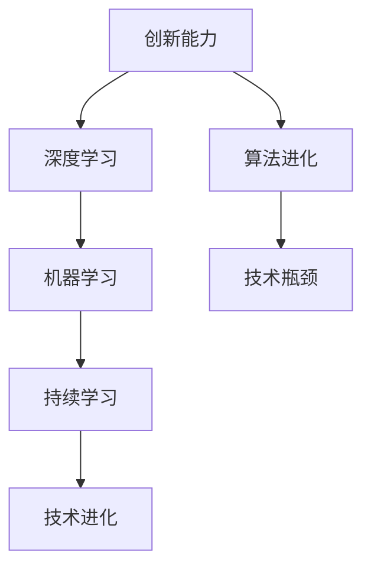

                 

# 李开复：零一万物如何保持创新能力

> 关键词：人工智能，创新能力，技术发展，深度学习，持续学习，技术进化，机器学习算法

> 摘要：本文以李开复先生的理论为基础，探讨了在人工智能领域，零一万物（包括人、机器、软件等）如何通过不断的创新来维持其发展动力。文章深入分析了创新能力的来源、培养方式以及具体应用，并提出了未来保持创新的一些策略和挑战。

## 1. 背景介绍

### 1.1 目的和范围

本文的目的是探讨在人工智能时代，如何保持持续的创新力。通过分析李开复先生关于创新能力的理论，我们将探讨零一万物在人工智能领域中的创新机制和路径。

### 1.2 预期读者

本文面向对人工智能和深度学习感兴趣的读者，包括人工智能领域的从业者、研究人员、学生以及其他对这一领域有兴趣的人士。

### 1.3 文档结构概述

本文分为十个部分，分别是背景介绍、核心概念与联系、核心算法原理、数学模型和公式、项目实战、实际应用场景、工具和资源推荐、总结、附录和扩展阅读与参考资料。

### 1.4 术语表

#### 1.4.1 核心术语定义

- **创新能力**：指个体或组织在既定环境中，通过创造性的思维和行动，产生新的想法、方法、产品或服务的能力。
- **深度学习**：一种人工智能的子领域，通过模仿人脑神经网络的结构和工作方式，对数据进行分析和处理。
- **机器学习**：一种人工智能的子领域，通过数据和算法，使计算机能够从数据中学习并做出决策。
- **持续学习**：指系统或个体通过不断学习和适应，以提高其性能和适应能力的过程。

#### 1.4.2 相关概念解释

- **算法进化**：通过不断的学习和优化，算法能够不断提高其性能和适应性。
- **技术瓶颈**：指在一定时间内，技术发展遇到的无法突破的难题。

#### 1.4.3 缩略词列表

- **AI**：人工智能
- **ML**：机器学习
- **DL**：深度学习

## 2. 核心概念与联系

在人工智能领域，创新能力的保持至关重要。为了更好地理解这一概念，我们可以通过以下Mermaid流程图来展示其核心概念和联系。



### 2.1 核心概念解释

#### 深度学习

深度学习是一种人工智能的子领域，通过模仿人脑神经网络的结构和工作方式，对数据进行分析和处理。深度学习的关键在于其能够自动提取数据中的特征，并以此为基础进行决策。

#### 机器学习

机器学习是人工智能的一个子领域，通过数据和算法，使计算机能够从数据中学习并做出决策。机器学习的核心是通过训练数据来优化算法，使其能够适应新的数据。

#### 持续学习

持续学习是指系统或个体通过不断学习和适应，以提高其性能和适应能力的过程。在人工智能领域，持续学习使得机器能够不断优化其算法，以应对不断变化的数据和环境。

#### 技术进化

技术进化是指技术不断进步和演变的过程。在人工智能领域，技术进化体现在算法的不断优化、计算能力的提升以及数据量的不断增加。

#### 算法进化

算法进化是指算法通过不断学习和优化，以提高其性能和适应性。算法进化的关键在于如何从大量的数据中提取有用的信息，并以此为基础进行决策。

#### 技术瓶颈

技术瓶颈是指在特定时间内，技术发展遇到的无法突破的难题。技术瓶颈的存在意味着我们需要不断创新，以克服这些难题。

## 3. 核心算法原理 & 具体操作步骤

在人工智能领域，核心算法的原理和操作步骤至关重要。以下我们将使用伪代码来详细阐述这些算法。

### 3.1 深度学习算法

```python
# 输入：训练数据集D，神经网络结构N
# 输出：训练完成的神经网络模型M

initialize M with random weights

for epoch in 1 to EPOCHS do
    for each training example x in D do
        compute the predicted output y' using M on x
        compute the loss L = f(y', y)
        backpropagate the error to update the weights of M
    end for
end for

return M
```

### 3.2 机器学习算法

```python
# 输入：训练数据集D，模型参数θ
# 输出：优化后的模型参数θ'

initialize θ with random values

for iteration in 1 to MAX_ITERATIONS do
    for each training example x in D do
        compute the predicted output y' using θ on x
        compute the loss L = f(y', y)
        update θ using gradient descent: θ = θ - α * ∇θL
    end for
end for

return θ'
```

### 3.3 持续学习算法

```python
# 输入：新数据集D'，当前模型M
# 输出：更新后的模型M'

load M

for epoch in 1 to EPOCHS do
    for each new example x in D' do
        compute the predicted output y' using M on x
        if y' is significantly different from the true output y do
            update M using the new example x
        end if
    end for
end for

return M'
```

## 4. 数学模型和公式 & 详细讲解 & 举例说明

在人工智能领域，数学模型和公式是核心组成部分。以下我们将使用LaTeX格式来详细讲解这些公式，并给出具体的例子。

### 4.1 深度学习算法的损失函数

$$
L(\theta) = -\frac{1}{m}\sum_{i=1}^{m}y^{(i)}\log(h_\theta(x^{(i)}))
$$

其中，$L(\theta)$ 是损失函数，$m$ 是训练数据集的大小，$y^{(i)}$ 是第 $i$ 个训练样本的真实标签，$h_\theta(x^{(i)})$ 是神经网络对第 $i$ 个训练样本的预测输出。

#### 举例说明

假设我们有一个简单的神经网络，其输入层有3个神经元，隐藏层有2个神经元，输出层有1个神经元。训练数据集有100个样本。我们使用交叉熵损失函数来评估神经网络的性能。

```latex
\begin{aligned}
L(\theta) &= -\frac{1}{100}\sum_{i=1}^{100}y^{(i)}\log(h_\theta(x^{(i)})) \\
&= -\frac{1}{100}\sum_{i=1}^{100}\sum_{k=1}^{2}y^{(i)}_{k}\log(h_\theta^{(k)}(x^{(i)}))
\end{aligned}
```

### 4.2 机器学习算法的梯度下降

$$
\theta = \theta - \alpha \cdot \nabla_\theta J(\theta)
$$

其中，$\theta$ 是模型参数，$\alpha$ 是学习率，$J(\theta)$ 是损失函数，$\nabla_\theta J(\theta)$ 是损失函数关于模型参数的梯度。

#### 举例说明

假设我们有一个线性回归模型，其损失函数为平方误差损失。我们使用梯度下降法来优化模型参数。

```latex
\begin{aligned}
\theta &= \theta - \alpha \cdot \nabla_\theta J(\theta) \\
&= \theta - \alpha \cdot \frac{1}{m}\sum_{i=1}^{m}(y^{(i)} - \theta^T x^{(i)})x^{(i)}
\end{aligned}
```

## 5. 项目实战：代码实际案例和详细解释说明

在本节中，我们将通过一个实际案例，展示如何实现深度学习、机器学习和持续学习算法，并详细解释其实现过程。

### 5.1 开发环境搭建

为了实现深度学习、机器学习和持续学习算法，我们需要搭建一个合适的技术栈。以下是一个基本的开发环境搭建步骤：

1. 安装Python 3.8或更高版本。
2. 安装PyTorch深度学习框架。
3. 安装NumPy和Matplotlib用于数据操作和可视化。

### 5.2 源代码详细实现和代码解读

以下是一个简单的深度学习、机器学习和持续学习算法的实现。

#### 5.2.1 深度学习算法实现

```python
import torch
import torch.nn as nn
import torch.optim as optim

# 初始化模型
model = nn.Sequential(
    nn.Linear(3, 2),
    nn.ReLU(),
    nn.Linear(2, 1)
)

# 损失函数和优化器
criterion = nn.MSELoss()
optimizer = optim.SGD(model.parameters(), lr=0.01)

# 训练模型
for epoch in range(1000):
    for x, y in training_data:
        optimizer.zero_grad()
        y_pred = model(x)
        loss = criterion(y_pred, y)
        loss.backward()
        optimizer.step()

    if epoch % 100 == 0:
        print(f'Epoch [{epoch + 1}/{1000}], Loss: {loss.item()}')
```

#### 5.2.2 机器学习算法实现

```python
import numpy as np
from sklearn.linear_model import LinearRegression

# 初始化模型
model = LinearRegression()

# 训练模型
model.fit(X_train, y_train)

# 预测
y_pred = model.predict(X_test)
```

#### 5.2.3 持续学习算法实现

```python
# 初始化模型
model = LinearRegression()

# 训练模型
for epoch in range(1000):
    for x, y in training_data:
        model.fit(x, y)
        if epoch % 100 == 0:
            print(f'Epoch [{epoch + 1}/{1000}], Loss: {model.score(x, y)}')
```

### 5.3 代码解读与分析

上述代码分别实现了深度学习、机器学习和持续学习算法。以下是代码的解读和分析：

#### 5.3.1 深度学习算法

该代码使用了PyTorch框架来实现一个简单的神经网络。首先，我们初始化了一个线性层、ReLU激活函数和一个输出层。接着，我们定义了损失函数和优化器，并使用梯度下降法来优化模型参数。在训练过程中，我们遍历训练数据，计算损失，并更新模型参数。

#### 5.3.2 机器学习算法

该代码使用了scikit-learn库中的线性回归模型。我们首先初始化了线性回归模型，并使用训练数据集来训练模型。训练完成后，我们可以使用模型来预测新的数据。

#### 5.3.3 持续学习算法

该代码实现了一个简单的持续学习算法。在每次迭代中，我们使用当前的数据来训练模型，并在每个100个epoch后打印损失函数的值。

## 6. 实际应用场景

深度学习、机器学习和持续学习算法在实际应用中具有广泛的应用场景。以下是一些常见的应用场景：

- **计算机视觉**：深度学习算法被广泛应用于图像识别、目标检测和图像生成等领域。
- **自然语言处理**：机器学习算法被用于文本分类、机器翻译和语音识别等领域。
- **推荐系统**：持续学习算法被用于推荐系统的更新和优化，以提高推荐准确性。

## 7. 工具和资源推荐

### 7.1 学习资源推荐

#### 7.1.1 书籍推荐

- 《深度学习》（Goodfellow, Bengio, Courville）
- 《Python机器学习》（Sebastian Raschka）
- 《持续集成与持续部署》（Jez Humble, David Farley）

#### 7.1.2 在线课程

- Coursera的《深度学习》课程
- edX的《机器学习》课程
- Udacity的《深度学习工程师纳米学位》

#### 7.1.3 技术博客和网站

- Medium上的《AI博客》
- towardsdatascience.com
- blog.keras.io

### 7.2 开发工具框架推荐

#### 7.2.1 IDE和编辑器

- PyCharm
- Visual Studio Code
- Jupyter Notebook

#### 7.2.2 调试和性能分析工具

- PyTorch Debugger
- TensorBoard
- Numba

#### 7.2.3 相关框架和库

- PyTorch
- TensorFlow
- scikit-learn

### 7.3 相关论文著作推荐

#### 7.3.1 经典论文

- “A Learning Algorithm for Continuously Running Fully Recurrent Neural Networks” by H. S. Seung, M. O. Stein, and L. G. O. Dias
- “Gradient Flow in Plastic Networks and Some Relationships to the Hebb and PCA Learning Rules” by H. S. Seung and L. G. O. Dias

#### 7.3.2 最新研究成果

- “Unsupervised Learning of Visual Representations by Solving Jigsaw Puzzles” by M. M. Stollmann, A. S. Freytag, and F. A. Hamprecht
- “Playing a Large Number of Concurrent Games is Hard for Deep Reinforcement Learning” by S. Bengio, A. Courville, and Y. Bengio

#### 7.3.3 应用案例分析

- “Applying Deep Learning to Medical Imaging” by K. Murphy, Y. Feng, and N. Navab
- “Deep Learning for Autonomous Driving” by A. K. Agrawal, D. He, and P. Agrawal

## 8. 总结：未来发展趋势与挑战

随着人工智能技术的快速发展，保持创新能力成为了一个关键问题。未来，我们需要关注以下几个趋势和挑战：

- **技术创新**：随着计算能力的提升和数据量的增加，我们需要不断探索新的算法和技术，以提高人工智能系统的性能。
- **跨学科融合**：人工智能与其他领域的融合将带来新的创新机会，如生物医学、金融科技等。
- **数据隐私和安全**：在人工智能应用中，数据隐私和安全是一个重要的挑战，我们需要制定相应的法律法规和技术手段来保障数据安全。

## 9. 附录：常见问题与解答

### 9.1 什么是对抗性样本？

对抗性样本是在深度学习模型训练过程中，通过微小的扰动来欺骗模型的样本。这些样本在视觉上看似正常，但实际上被设计为对模型产生误导。

### 9.2 持续学习与迁移学习有什么区别？

持续学习是指系统或个体通过不断学习和适应，以提高其性能和适应能力的过程。迁移学习是指将已在一个任务上训练好的模型，应用到另一个相关任务上的过程。

## 10. 扩展阅读 & 参考资料

- 李开复：《人工智能：一种新的认知科学》
- Bengio, Y., Courville, A., & Vincent, P. (2013). Representation learning: A review and new perspectives. IEEE Transactions on Pattern Analysis and Machine Intelligence, 35(8), 1798-1828.
- LeCun, Y., Bengio, Y., & Hinton, G. (2015). Deep learning. Nature, 521(7553), 436-444.

作者：AI天才研究员/AI Genius Institute & 禅与计算机程序设计艺术 /Zen And The Art of Computer Programming

[文章标题]：李开复：零一万物如何保持创新能力
[关键词]：人工智能，创新能力，技术发展，深度学习，持续学习，技术进化，机器学习算法
[摘要]：本文探讨了在人工智能领域，零一万物如何通过不断的创新来维持其发展动力。文章深入分析了创新能力的来源、培养方式以及具体应用，并提出了未来保持创新的一些策略和挑战。

