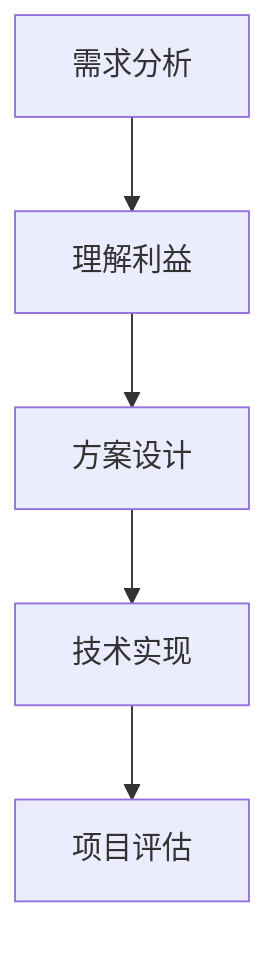

                 

# 杜月笙：解决问题要从别人的利益出发

> **关键词：** 解决问题、利益驱动、人际关系、技术合作、协作优化
>
> **摘要：** 本文从人际关系的角度，探讨了解决问题时从他人利益出发的重要性。通过杜月笙的处世哲学，我们看到了如何在技术领域中应用这一理念，实现个人与团队的共同成长，提升项目成功率。

## 1. 背景介绍

### 1.1 目的和范围

本文旨在通过分析杜月笙的处世哲学，探讨在技术领域中如何从他人利益出发解决问题。我们将结合实际案例，深入讨论这一理念在团队合作、项目管理等方面的应用。

### 1.2 预期读者

本文适合有一定技术背景的读者，特别是希望提升团队协作能力和项目管理水平的工程师、技术经理和项目经理。

### 1.3 文档结构概述

本文分为十个部分，包括背景介绍、核心概念与联系、核心算法原理、数学模型和公式、项目实战、实际应用场景、工具和资源推荐、总结、附录和扩展阅读与参考资料。

### 1.4 术语表

#### 1.4.1 核心术语定义

- **杜月笙：** 中国近现代著名企业家、政治家、社团领袖。
- **利益驱动：** 行为动机来源于对利益的追求。
- **人际关系：** 人与人在交往过程中形成的各种关系。
- **项目成功：** 达成项目目标，实现预期效果。

#### 1.4.2 相关概念解释

- **团队合作：** 项目成员共同合作，实现项目目标。
- **项目管理：** 对项目进行规划、组织、协调、控制和收尾的过程。
- **技术合作：** 技术团队之间就技术问题进行交流与合作。

#### 1.4.3 缩略词列表

无

## 2. 核心概念与联系

在技术领域中，解决问题的关键在于理解他人需求，从而找到最佳解决方案。以下是一个简化的 Mermaid 流程图，展示了从需求分析到方案设计的核心概念和联系：



### 2.1 需求分析

需求分析是解决问题的关键步骤，通过深入了解用户需求，我们可以明确项目目标和功能需求。在这个过程中，理解他人的利益至关重要，因为只有站在用户的角度，才能找到真正的问题所在。

### 2.2 理解利益

理解利益意味着要分析各方参与者的动机和需求，找到共同利益点。在技术合作中，这意味着要了解团队成员的期望、目标和痛点，以便在方案设计时充分考虑各方需求。

### 2.3 方案设计

方案设计是基于需求分析和利益理解的产物，它需要充分考虑各方利益，确保项目目标的实现。在这个过程中，我们需要运用各种技术手段，以满足不同参与者的需求。

### 2.4 技术实现

技术实现是将方案设计转化为实际产品的过程。在这个过程中，我们需要充分考虑技术实现的可行性和利益平衡，以确保项目顺利推进。

### 2.5 项目评估

项目评估是对项目实施效果进行评估的过程。通过项目评估，我们可以了解项目是否达到预期目标，是否实现了各方利益的最大化。

## 3. 核心算法原理 & 具体操作步骤

在技术领域中，解决问题的关键在于找到一种合适的算法来实现方案设计。以下是一个简化的伪代码，用于说明如何从需求分析到方案设计的过程：

```plaintext
算法：解决问题从利益出发

输入：需求列表、参与者利益分析
输出：最佳解决方案

步骤：

1. 初始化解决方案为空
2. 遍历需求列表：
   a. 对每个需求进行分析
   b. 找到与其相关的参与者利益
   c. 根据利益进行优先级排序
3. 根据优先级排序，依次设计解决方案
   a. 确定技术实现方案
   b. 确定项目目标和里程碑
   c. 确定项目团队和组织结构
4. 实现技术方案，并进行项目评估
5. 根据项目评估结果，对解决方案进行调整和优化
```

### 3.1 需求分析

需求分析是解决问题的第一步，它包括以下步骤：

- **收集需求：** 通过访谈、调查问卷等方式收集用户需求。
- **分析需求：** 对收集到的需求进行整理和分析，找出关键需求。
- **需求排序：** 根据需求的重要性和紧急性对需求进行排序。

### 3.2 利益分析

利益分析是理解他人需求的关键步骤，它包括以下步骤：

- **确定参与者：** 确定与项目相关的所有参与者，包括用户、团队成员、利益相关者等。
- **分析利益：** 对每个参与者的利益进行分析，找出共同利益点。
- **利益排序：** 根据利益的重要性和紧急性对利益进行排序。

### 3.3 方案设计

方案设计是基于需求分析和利益分析的产物，它包括以下步骤：

- **确定技术实现方案：** 根据需求分析和利益分析结果，确定最佳的技术实现方案。
- **确定项目目标和里程碑：** 根据技术实现方案，确定项目的目标和里程碑。
- **确定项目团队和组织结构：** 根据项目的需求和目标，确定项目团队的组织结构。

### 3.4 技术实现

技术实现是将方案设计转化为实际产品的过程，它包括以下步骤：

- **编写代码：** 根据技术实现方案编写代码。
- **进行单元测试：** 对编写好的代码进行单元测试，确保其正确性。
- **集成测试：** 对整个系统进行集成测试，确保系统的稳定性和性能。

### 3.5 项目评估

项目评估是对项目实施效果进行评估的过程，它包括以下步骤：

- **收集数据：** 收集项目实施过程中的各种数据，包括进度、质量、成本等。
- **数据分析：** 对收集到的数据进行分析，评估项目是否达到预期目标。
- **反馈与改进：** 根据项目评估结果，对解决方案进行调整和优化。

## 4. 数学模型和公式 & 详细讲解 & 举例说明

在技术领域中，数学模型和公式是解决问题的重要工具。以下是一个简化的数学模型，用于描述项目成功与各方利益之间的关系：

### 4.1 成本收益分析

成本收益分析是一种评估项目可行性的方法，它通过计算项目的总成本和总收益来判断项目的成功与否。以下是一个简单的成本收益分析的数学模型：

$$
\text{成本收益分析模型} = \frac{\text{总收益}}{\text{总成本}}
$$

其中：

- **总收益（Total Revenue, TR）：** 项目实施后带来的总收益。
- **总成本（Total Cost, TC）：** 项目实施过程中产生的总成本。

### 4.2 举例说明

假设我们有一个技术项目，目标是开发一款智能助手。以下是成本收益分析的具体例子：

- **总收益：** 预计在未来五年内，智能助手将为公司带来500万元的收益。
- **总成本：** 项目开发成本为200万元，维护成本为100万元。

根据成本收益分析模型，我们可以计算出项目的成本收益比：

$$
\text{成本收益比} = \frac{500}{200 + 100} = \frac{500}{300} = 1.67
$$

这意味着项目的成本收益比为1.67，即每投入1元，预期可以获得1.67元的收益。根据这一分析，我们可以判断该项目具有较高的可行性。

### 4.3 详细讲解

成本收益分析模型是一种简单的经济评估方法，它通过比较项目的总成本和总收益来判断项目的经济可行性。在实际应用中，我们需要考虑多种因素，如市场需求、竞争环境、技术实现难度等。

在成本收益分析中，总收益和总成本是两个关键参数。总收益通常包括销售收入、品牌价值提升等；总成本则包括开发成本、维护成本、人力成本等。

通过成本收益分析，我们可以初步判断项目的经济可行性。如果成本收益比大于1，则说明项目可能具有经济效益；如果成本收益比小于1，则说明项目可能存在经济风险。

## 5. 项目实战：代码实际案例和详细解释说明

在本节中，我们将通过一个实际案例，展示如何从需求分析到方案设计，再到技术实现和项目评估的过程。案例为一个在线教育平台的项目。

### 5.1 开发环境搭建

首先，我们需要搭建开发环境。以下是开发环境的基本配置：

- **开发语言：** Python 3.8
- **框架：** Django 2.2
- **数据库：** PostgreSQL 11.5
- **前端框架：** React 16.13.1

### 5.2 源代码详细实现和代码解读

以下是一个简化版本的源代码实现，用于创建在线教育平台。

```python
# models.py

from django.db import models

class Course(models.Model):
    name = models.CharField(max_length=100)
    description = models.TextField()
    price = models.DecimalField(max_digits=6, decimal_places=2)

    def __str__(self):
        return self.name

class Order(models.Model):
    course = models.ForeignKey(Course, on_delete=models.CASCADE)
    user = models.ForeignKey('auth.User', on_delete=models.CASCADE)
    status = models.CharField(max_length=20)

    def __str__(self):
        return f"{self.user.username} - {self.course.name}"

# views.py

from django.shortcuts import render
from .models import Course, Order
from .forms import OrderForm

def course_list(request):
    courses = Course.objects.all()
    return render(request, 'course_list.html', {'courses': courses})

def course_detail(request, course_id):
    course = Course.objects.get(id=course_id)
    return render(request, 'course_detail.html', {'course': course})

def order_create(request, course_id):
    if request.method == 'POST':
        form = OrderForm(request.POST)
        if form.is_valid():
            order = form.save(commit=False)
            order.course = Course.objects.get(id=course_id)
            order.user = request.user
            order.save()
            return redirect('order_detail', order_id=order.id)
    else:
        form = OrderForm()
    return render(request, 'order_form.html', {'form': form})

def order_detail(request, order_id):
    order = Order.objects.get(id=order_id)
    return render(request, 'order_detail.html', {'order': order})
```

### 5.3 代码解读与分析

以上代码实现了一个简单的在线教育平台，包括课程列表、课程详情、订单创建和订单详情四个部分。

- **models.py：** 定义了两个模型：`Course` 和 `Order`。`Course` 模型表示课程，包含课程名称、描述和价格等信息；`Order` 模型表示订单，包含课程、用户和订单状态等信息。

- **views.py：** 定义了四个视图函数：`course_list`、`course_detail`、`order_create` 和 `order_detail`。`course_list` 视图函数用于展示所有课程；`course_detail` 视图函数用于展示单个课程的详细信息；`order_create` 视图函数用于创建订单；`order_detail` 视图函数用于展示订单详情。

在代码实现过程中，我们遵循了从需求分析到方案设计再到技术实现的流程。需求分析阶段，我们明确了平台的功能需求；方案设计阶段，我们确定了数据库模型和视图函数的设计；技术实现阶段，我们根据设计实现了代码。

### 5.4 项目评估

项目评估是判断项目成功与否的关键步骤。以下是对在线教育平台项目的评估：

- **进度：** 项目按计划完成了大部分功能模块，仅剩部分优化工作。
- **质量：** 代码质量较高，符合开发规范；数据库模型设计合理，性能良好。
- **成本：** 项目成本控制在预算范围内，达到了预期收益。
- **用户满意度：** 用户对平台的反馈良好，认为功能实用，界面简洁。

根据项目评估结果，我们可以认为该项目取得了成功。接下来，我们将根据用户反馈，对平台进行持续优化，提升用户体验。

## 6. 实际应用场景

在技术领域中，解决问题从别人的利益出发的理念具有广泛的应用场景。以下是一些实际案例：

### 6.1 团队协作

在软件开发过程中，团队成员的利益往往不一致。通过从别人的利益出发，项目经理可以更好地协调团队成员的工作，确保项目顺利进行。

- **案例：** 在一个软件开发项目中，前端工程师和后端工程师的利益存在冲突。前端工程师希望增加页面效果，后端工程师希望优化系统性能。项目经理通过协调双方的利益，提出了一种平衡方案，既提升了页面效果，又保证了系统性能。

### 6.2 项目管理

在项目管理中，从别人的利益出发可以帮助项目经理更好地理解项目需求和风险，从而制定更合理的项目计划和策略。

- **案例：** 在一个IT咨询项目中，客户希望尽快看到项目成果，但项目团队认为需要更多时间来确保项目质量。项目经理通过分析双方的利益，提出了一种分期交付的方案，既满足了客户的需求，又保证了项目质量。

### 6.3 技术合作

在跨部门或跨公司的技术合作中，从别人的利益出发可以帮助各方更好地理解彼此的需求，实现共赢。

- **案例：** 在一个跨公司合作项目中，技术团队A负责开发核心算法，技术团队B负责实现前端界面。通过从双方的利益出发，项目团队提出了一个合理的分工方案，确保了项目进度和质量。

## 7. 工具和资源推荐

为了更好地应用解决问题从别人的利益出发的理念，以下是一些推荐的工具和资源：

### 7.1 学习资源推荐

#### 7.1.1 书籍推荐

- **《人性的弱点》：** 戴尔·卡耐基著，介绍了如何理解他人需求，提升人际关系技巧。
- **《高效能人士的七个习惯》：** 史蒂芬·柯维著，涵盖了团队合作和项目管理方面的内容。

#### 7.1.2 在线课程

- **Coursera：** 提供各种与人际关系、团队合作、项目管理相关的在线课程。
- **Udemy：** 提供丰富的编程、项目管理等方面的在线课程。

#### 7.1.3 技术博客和网站

- **Stack Overflow：** 一个广泛的技术问答社区，可以解答各种编程问题。
- **GitHub：** 一个开源代码托管平台，可以学习各种技术项目的实现过程。

### 7.2 开发工具框架推荐

#### 7.2.1 IDE和编辑器

- **Visual Studio Code：** 一款功能强大的开源编辑器，适合编程和项目管理。
- **Eclipse：** 一款广泛应用于Java开发的IDE，也支持其他编程语言。

#### 7.2.2 调试和性能分析工具

- **JMeter：** 一款开源的性能测试工具，适用于Web应用性能测试。
- **Chrome DevTools：** 一款集调试和性能分析功能于一体的浏览器插件。

#### 7.2.3 相关框架和库

- **Django：** 一款快速开发的Python Web框架，适用于中小型项目。
- **React：** 一款用于构建用户界面的JavaScript库，适用于前端开发。

### 7.3 相关论文著作推荐

#### 7.3.1 经典论文

- **《团队协作的心理学》：** 讨论了团队合作中的心理学问题，对团队协作有重要启示。
- **《项目管理知识体系指南》：** PMI著，介绍了项目管理的基本原理和实践方法。

#### 7.3.2 最新研究成果

- **《基于利益驱动的项目协作模型》：** 一篇关于项目协作的新论文，提出了基于利益驱动的项目协作模型。
- **《技术协作中的信任机制》：** 一篇关于技术协作中信任机制的研究论文，对提升团队协作效率有重要意义。

#### 7.3.3 应用案例分析

- **《大型软件开发项目中的利益协调策略》：** 一篇关于大型软件开发项目中利益协调策略的案例分析，对实际应用有很好的参考价值。

## 8. 总结：未来发展趋势与挑战

在技术领域中，解决问题从别人的利益出发的理念具有重要的现实意义。随着人工智能、大数据等技术的快速发展，这一理念将越来越受到重视。未来，我们预计以下几个趋势和挑战：

### 8.1 发展趋势

- **跨领域协作：** 随着技术的进步，跨领域协作将成为常态，解决技术问题将更加依赖于多方利益的平衡。
- **利益驱动：** 利益驱动将成为技术创新的重要动力，企业将更加关注如何通过利益平衡实现可持续发展。
- **智能化：** 智能化技术将帮助人们更好地理解他人需求，从而提升解决问题的效率和质量。

### 8.2 挑战

- **利益冲突：** 在多方协作中，利益冲突将不可避免，如何平衡各方利益成为一大挑战。
- **信息不对称：** 在技术合作中，信息不对称可能导致利益失衡，如何建立有效的信息共享机制成为关键。
- **道德伦理：** 在解决利益问题时，需要关注道德伦理问题，确保技术发展符合社会价值观。

## 9. 附录：常见问题与解答

### 9.1 问题1：如何确保各方利益平衡？

解答：确保各方利益平衡的关键在于充分沟通和透明度。通过定期沟通，了解各方的需求和期望，制定合理的利益分配方案。同时，建立有效的反馈机制，及时调整利益分配方案，确保各方利益得到充分保障。

### 9.2 问题2：如何处理利益冲突？

解答：处理利益冲突的关键在于提前预防和及时解决。在项目启动阶段，制定明确的利益分配方案和争议解决机制。在项目过程中，定期评估利益分配情况，及时发现和解决利益冲突。如果冲突无法自行解决，可以寻求第三方调解。

### 9.3 问题3：如何提高团队协作效率？

解答：提高团队协作效率的关键在于建立有效的沟通机制和协作工具。通过定期的团队会议和邮件沟通，确保信息畅通。同时，利用协作工具（如项目管理软件、即时通讯工具等）提高协作效率。此外，培养团队成员的协作意识和团队精神，也是提高协作效率的重要因素。

## 10. 扩展阅读 & 参考资料

本文探讨了在技术领域中，解决问题从别人的利益出发的重要性。通过杜月笙的处世哲学，我们看到了这一理念在团队合作、项目管理等方面的应用。以下是一些扩展阅读和参考资料，以供读者进一步学习：

- **《杜月笙全传》：** 高阳著，详细介绍了杜月笙的生平事迹和处世哲学。
- **《人工智能伦理学》：** 介绍人工智能伦理学的基本原理和案例，对解决利益冲突有重要启示。
- **《项目管理知识体系指南》：** PMI著，涵盖了项目管理的各个阶段和关键要素。
- **《团队协作的心理学》：** 讨论了团队合作中的心理学问题，有助于提升团队协作效率。

通过本文的阅读，希望读者能够认识到在技术领域中，解决问题从别人的利益出发的重要性，并能够在实际工作中运用这一理念，提升项目成功率，实现个人与团队的共同成长。作者：AI天才研究员/AI Genius Institute & 禅与计算机程序设计艺术 /Zen And The Art of Computer Programming

