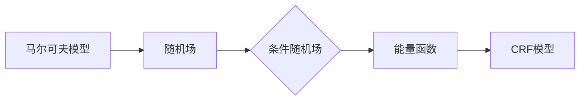

                 

## 文章标题

### 条件随机场(Conditional Random Fields) - 原理与代码实例讲解

**关键词：** 条件随机场、机器学习、序列标注、马尔可夫模型、算法原理、代码实例

**摘要：** 条件随机场（Conditional Random Fields，简称CRF）是一种广泛应用于序列标注任务中的机器学习模型。本文将详细介绍CRF的核心概念、算法原理、数学模型以及代码实现，并通过实际案例进行深入讲解。通过本文的阅读，读者将全面了解CRF的理论基础和应用技巧，为后续深入研究打下坚实基础。

---

在机器学习领域，序列标注（sequence labeling）任务具有重要的应用价值，如命名实体识别（Named Entity Recognition，简称NER）、词性标注（Part-of-Speech Tagging）等。条件随机场（Conditional Random Fields，简称CRF）作为一种经典的序列标注模型，以其强大的表达能力和良好的性能在众多领域中得到了广泛应用。本文将围绕CRF的核心概念、算法原理、数学模型以及代码实现进行深入讲解，旨在帮助读者全面掌握CRF的理论基础和应用技巧。

文章结构如下：

1. 背景介绍
   - 1.1 目的和范围
   - 1.2 预期读者
   - 1.3 文档结构概述
   - 1.4 术语表
2. 核心概念与联系
   - 2.1 马尔可夫模型
   - 2.2 随机场
   - 2.3 条件随机场
   - 2.4 Mermaid流程图
3. 核心算法原理 & 具体操作步骤
   - 3.1 序列标注问题
   - 3.2 CRF模型基本原理
   - 3.3 CRF训练算法
   - 3.4 CRF预测算法
4. 数学模型和公式 & 详细讲解 & 举例说明
   - 4.1 马尔可夫性假设
   - 4.2 条件独立性假设
   - 4.3 CRF能量函数
   - 4.4 CRF损失函数
   - 4.5 举例说明
5. 项目实战：代码实际案例和详细解释说明
   - 5.1 开发环境搭建
   - 5.2 源代码详细实现和代码解读
   - 5.3 代码解读与分析
6. 实际应用场景
   - 6.1 命名实体识别
   - 6.2 词性标注
   - 6.3 语音识别
   - 6.4 机器翻译
7. 工具和资源推荐
   - 7.1 学习资源推荐
   - 7.2 开发工具框架推荐
   - 7.3 相关论文著作推荐
8. 总结：未来发展趋势与挑战
9. 附录：常见问题与解答
10. 扩展阅读 & 参考资料

---

在接下来的章节中，我们将逐步深入探讨条件随机场（CRF）的各个方面，包括其核心概念、算法原理、数学模型以及实际应用。希望本文能为您在CRF学习与应用的道路上提供有益的指导和启示。

---

接下来，我们首先介绍CRF的背景和相关术语，帮助读者对CRF有一个基本的了解。

## 1. 背景介绍

### 1.1 目的和范围

条件随机场（Conditional Random Fields，简称CRF）是一种在序列标注任务中广泛应用的概率模型。其核心目的是在给定输入序列的情况下，对序列中的每个元素进行标签标注。CRF模型在自然语言处理、语音识别、生物信息学等领域都有着重要的应用。本文将重点介绍CRF的核心概念、算法原理以及代码实现，帮助读者全面掌握CRF的基本理论和实践技能。

### 1.2 预期读者

本文面向对机器学习和自然语言处理有一定基础的读者。读者需要具备以下知识背景：

- 基本的概率论和统计学知识；
- 熟悉机器学习的基本算法，如朴素贝叶斯、决策树、支持向量机等；
- 对自然语言处理中的序列标注任务有一定的了解。

通过本文的学习，读者可以：

- 理解CRF的核心概念和基本原理；
- 掌握CRF模型的数学模型和算法步骤；
- 学习如何使用CRF进行实际项目开发；
- 了解CRF在自然语言处理中的具体应用场景。

### 1.3 文档结构概述

本文分为以下几个部分：

1. 背景介绍：介绍CRF的背景和相关术语，帮助读者对CRF有一个基本的了解。
2. 核心概念与联系：介绍CRF与马尔可夫模型、随机场的关系，并通过Mermaid流程图展示CRF的架构。
3. 核心算法原理 & 具体操作步骤：详细讲解CRF的核心算法原理和操作步骤，包括序列标注问题、CRF模型基本原理、CRF训练算法和CRF预测算法。
4. 数学模型和公式 & 详细讲解 & 举例说明：介绍CRF的数学模型和公式，并通过具体例子进行说明。
5. 项目实战：通过实际案例展示CRF的代码实现，并进行详细解读。
6. 实际应用场景：介绍CRF在命名实体识别、词性标注、语音识别、机器翻译等领域的具体应用。
7. 工具和资源推荐：推荐CRF学习资源、开发工具框架和相关论文著作。
8. 总结：回顾CRF的发展趋势与挑战。
9. 附录：常见问题与解答。
10. 扩展阅读 & 参考资料：提供进一步的阅读资料。

### 1.4 术语表

在本文中，我们将使用以下术语：

- **条件随机场（Conditional Random Fields，CRF）**：一种用于序列标注的机器学习模型。
- **序列标注（Sequence Labeling）**：对输入序列中的每个元素进行标签标注的任务。
- **马尔可夫模型（Markov Model）**：一种概率模型，假设一个变量的状态只与它前一个状态有关。
- **随机场（Random Fields）**：一个随机变量的集合，每个随机变量都对应于输入序列中的元素。
- **条件独立性（Conditional Independence）**：假设给定某个条件，随机变量之间的独立性。
- **能量函数（Energy Function）**：CRF模型中的一个函数，用于衡量模型对序列标注的偏好程度。
- **损失函数（Loss Function）**：在训练CRF模型时，用于评估模型性能的函数。

---

在了解了CRF的基本背景和相关术语后，接下来我们将探讨CRF与马尔可夫模型、随机场的关系，并通过Mermaid流程图展示CRF的架构。

## 2. 核心概念与联系

### 2.1 马尔可夫模型

马尔可夫模型（Markov Model）是一种基于状态转移概率的数学模型，广泛应用于时间序列分析和动态系统建模。马尔可夫模型的核心假设是：一个系统的未来状态仅依赖于当前状态，与过去的状态无关。这一假设使得马尔可夫模型在许多领域（如语音识别、图像处理、自然语言处理等）中得到了广泛应用。

在马尔可夫模型中，每个状态可以被视为一个随机变量，而状态之间的转移概率可以用一个矩阵来表示。这个矩阵被称为转移矩阵（Transition Matrix），其中每个元素表示从一个状态转移到另一个状态的概率。例如，对于两个状态的情况，转移矩阵可以表示为：

\[ 
P = \begin{bmatrix} 
p_{00} & p_{01} \\
p_{10} & p_{11} 
\end{bmatrix} 
\]

其中，\( p_{ij} \) 表示从状态 \( i \) 转移到状态 \( j \) 的概率。

### 2.2 随机场

随机场（Random Fields）是另一种用于表示不确定性和随机性的数学模型。在随机场中，随机变量不仅与时间或位置有关，还与空间中的其他点有关。随机场广泛应用于图像处理、统计学、物理学等领域。

在随机场中，每个随机变量对应于一个空间点，而随机变量之间的相关性由一个协方差矩阵来描述。协方差矩阵表示了随机变量之间的协方差，反映了它们之间的相关性。例如，对于二维空间中的两个随机变量 \( X \) 和 \( Y \)，协方差矩阵可以表示为：

\[ 
\begin{bmatrix} 
\sigma^2_X & \sigma_{XY} \\
\sigma_{YX} & \sigma^2_Y 
\end{bmatrix} 
\]

其中，\( \sigma^2_X \) 和 \( \sigma^2_Y \) 分别表示 \( X \) 和 \( Y \) 的方差，\( \sigma_{XY} \) 和 \( \sigma_{YX} \) 分别表示 \( X \) 和 \( Y \) 之间的协方差。

### 2.3 条件随机场

条件随机场（Conditional Random Fields，CRF）是马尔可夫模型和随机场的扩展。CRF模型在序列标注任务中得到了广泛应用，其核心思想是在给定输入序列的情况下，对序列中的每个元素进行标签标注。

在CRF模型中，随机变量不仅与当前状态有关，还与之前的状态和未来状态有关。这意味着CRF模型可以更好地捕捉序列中的长程依赖关系。CRF模型的核心假设是：给定当前状态和过去状态，未来状态的分布与当前状态无关。

CRF模型可以用一个能量函数（Energy Function）来描述，该能量函数反映了模型对序列标注的偏好程度。能量函数的表达式如下：

\[ 
E(\theta, x, y) = \sum_{i,j} \theta_{ij} y_i (1 - y_j) + \sum_{i} \theta_{i\bullet} y_i + \sum_{j} \theta_{\bullet j} (1 - y_j) 
\]

其中，\( \theta \) 表示模型参数，\( x \) 表示输入序列，\( y \) 表示标注序列，\( y_i \) 和 \( y_j \) 分别表示第 \( i \) 个和第 \( j \) 个元素是否被标注。

### 2.4 Mermaid流程图

为了更好地理解CRF模型，我们可以使用Mermaid流程图来展示CRF的架构。以下是一个简单的Mermaid流程图示例：



在这个流程图中，马尔可夫模型和随机场是CRF模型的基础，它们共同构成了条件随机场。通过定义能量函数，我们可以构建CRF模型，并利用该模型进行序列标注。

---

在了解了CRF的核心概念与联系后，接下来我们将详细讲解CRF的核心算法原理和具体操作步骤。

## 3. 核心算法原理 & 具体操作步骤

### 3.1 序列标注问题

序列标注（Sequence Labeling）是一种将输入序列中的每个元素标注为某个类别标签的任务。常见的序列标注任务包括命名实体识别（Named Entity Recognition，简称NER）、词性标注（Part-of-Speech Tagging）等。在序列标注任务中，每个元素可能属于多个类别标签，因此需要选择一个最优的标注序列。

序列标注问题的核心是找到一个标注序列，使得标注序列与输入序列之间的差异最小。这种差异可以用损失函数（Loss Function）来衡量，常见的损失函数包括交叉熵损失（Cross-Entropy Loss）和均方误差损失（Mean Squared Error Loss）等。

### 3.2 CRF模型基本原理

条件随机场（Conditional Random Fields，CRF）是一种用于序列标注的机器学习模型。CRF模型的核心思想是在给定输入序列的情况下，利用模型参数对序列中的每个元素进行标签标注。

CRF模型基于以下两个基本假设：

1. **马尔可夫性假设**：假设一个元素的状态仅与它的前一个状态有关，而与其他状态无关。
2. **条件独立性假设**：假设给定当前状态，未来状态的分布与当前状态无关。

基于这两个假设，CRF模型可以通过定义能量函数（Energy Function）来衡量标注序列与输入序列之间的差异。能量函数的表达式如下：

\[ 
E(\theta, x, y) = \sum_{i,j} \theta_{ij} y_i (1 - y_j) + \sum_{i} \theta_{i\bullet} y_i + \sum_{j} \theta_{\bullet j} (1 - y_j) 
\]

其中，\( \theta \) 表示模型参数，\( x \) 表示输入序列，\( y \) 表示标注序列，\( y_i \) 和 \( y_j \) 分别表示第 \( i \) 个和第 \( j \) 个元素是否被标注。

### 3.3 CRF训练算法

CRF模型的训练过程主要包括以下步骤：

1. **数据预处理**：将输入序列和标注序列转换为数值表示，通常使用词向量（Word Vectors）或字符向量（Character Vectors）。
2. **定义能量函数**：根据CRF模型的基本原理，定义能量函数 \( E(\theta, x, y) \)。
3. **选择优化算法**：常见的优化算法包括梯度下降（Gradient Descent）和随机梯度下降（Stochastic Gradient Descent，简称SGD）等。
4. **迭代优化**：通过迭代优化算法，不断调整模型参数 \( \theta \)，使得能量函数 \( E(\theta, x, y) \) 最小。

具体来说，CRF训练算法可以通过以下伪代码表示：

```python
# 初始化模型参数 θ
θ = 初始化参数()

# 设置迭代次数和收敛条件
迭代次数 = 1000
收敛阈值 = 0.001

# 迭代优化模型参数
for i in 1 to 迭代次数 do
    # 遍历所有训练样本
    for每个训练样本 (x, y) in 数据集 do
        # 计算当前样本的损失函数
       损失 = 计算损失函数(θ, x, y)
        
        # 计算梯度
       梯度 = 计算梯度(θ, x, y)
        
        # 更新模型参数
       θ = θ - 学习率 * 梯度
    end for
    
    # 检查是否满足收敛条件
    if 损失变化 < 收敛阈值 then
        break
    end if
end for
```

### 3.4 CRF预测算法

CRF模型的预测算法主要包括以下步骤：

1. **数据预处理**：将输入序列转换为数值表示，通常使用词向量或字符向量。
2. **定义能量函数**：根据CRF模型的基本原理，定义能量函数 \( E(\theta, x, y) \)。
3. **计算标注概率**：对于给定的输入序列，计算所有可能的标注序列的概率，选择概率最大的标注序列作为预测结果。

具体来说，CRF预测算法可以通过以下伪代码表示：

```python
# 加载训练好的模型参数 θ
θ = 加载模型参数()

# 将输入序列转换为数值表示
x = 转换输入序列(输入序列)

# 遍历所有可能的标注序列
for每个可能的标注序列 y in 所有可能的标注序列 do
    # 计算标注序列的概率
   概率 = 计算概率(θ, x, y)
end for

# 选择概率最大的标注序列作为预测结果
预测结果 = 选择最大概率的标注序列()
```

---

在了解了CRF的核心算法原理和具体操作步骤后，接下来我们将详细讲解CRF的数学模型和公式。

## 4. 数学模型和公式 & 详细讲解 & 举例说明

### 4.1 马尔可夫性假设

马尔可夫性假设（Markov Property）是条件随机场（CRF）模型的一个重要前提。它指的是一个系统的未来状态仅依赖于当前状态，而与过去的状态无关。在CRF中，这个假设被具体化为：给定当前状态和过去状态，未来状态的分布与当前状态无关。

用数学语言描述马尔可夫性假设，我们可以定义一个状态转移概率矩阵 \( P \)，其中 \( P_{ij} \) 表示从状态 \( i \) 转移到状态 \( j \) 的概率。在CRF中，这个假设可以表示为：

\[ 
P(y_t | y_{<t}, x) = P(y_t | y_{t-1}, x) 
\]

这意味着给定过去状态序列 \( y_{<t} \) 和输入序列 \( x \)，当前状态 \( y_t \) 的条件概率只依赖于前一个状态 \( y_{t-1} \)。

### 4.2 条件独立性假设

条件独立性假设（Conditional Independence）是CRF模型的另一个关键假设。它指的是给定当前状态，未来状态之间是相互独立的。在CRF中，这个假设可以表示为：

\[ 
P(y_t, y_{t+1} | y_{<t}, x) = P(y_t | y_{<t}, x) \cdot P(y_{t+1} | y_{<t}, x) 
\]

这意味着给定过去状态序列 \( y_{<t} \) 和输入序列 \( x \)，当前状态 \( y_t \) 和下一个状态 \( y_{t+1} \) 的联合概率可以分解为各自的条件概率的乘积。

### 4.3 CRF能量函数

CRF模型通过能量函数（Energy Function）来衡量一个标注序列是否符合输入序列的概率。能量函数的定义如下：

\[ 
E(\theta, x, y) = \sum_{i,j} \theta_{ij} y_i (1 - y_j) + \sum_{i} \theta_{i\bullet} y_i + \sum_{j} \theta_{\bullet j} (1 - y_j) 
\]

其中，\( \theta \) 表示模型参数，\( x \) 表示输入序列，\( y \) 表示标注序列，\( y_i \) 和 \( y_j \) 分别表示第 \( i \) 个和第 \( j \) 个元素是否被标注。这个能量函数由三部分组成：

1. **边缘能量（Edge Energy）**：\( \sum_{i,j} \theta_{ij} y_i (1 - y_j) \)，表示相邻元素之间标注的一致性。如果相邻元素都被标注为同一类别，则这部分能量较小。
2. **状态能量（State Energy）**：\( \sum_{i} \theta_{i\bullet} y_i \)，表示每个元素被标注为某一类别的能量。如果元素被标注为某一类别，则这部分能量较小。
3. **边能量（Edge Energy）**：\( \sum_{j} \theta_{\bullet j} (1 - y_j) \)，表示每个元素未被标注的能量。如果元素未被标注，则这部分能量较小。

### 4.4 CRF损失函数

在训练CRF模型时，我们通常使用损失函数（Loss Function）来衡量模型预测结果与真实标注之间的差异。最常用的损失函数是交叉熵损失（Cross-Entropy Loss），其定义为：

\[ 
L(\theta, x, y) = -\sum_{i,j} y_{ij} \log P(y_{ij} | \theta, x) 
\]

其中，\( y_{ij} \) 表示真实标注序列中第 \( i \) 个元素是否被标注为类别 \( j \)，\( P(y_{ij} | \theta, x) \) 是模型预测的标注概率。交叉熵损失函数的值越小，表示模型预测结果与真实标注之间的差异越小。

### 4.5 举例说明

假设我们有一个简单的输入序列和标注序列，如下所示：

输入序列：\[ \text{Hello, world!} \]  
标注序列：\[ (\text{O}, \text{B-PER}, \text{I-PER}, \text{O}, \text{B-LOC}, \text{I-LOC}, \text{O}) \]

其中，\( \text{O} \) 表示普通词语，\( \text{B-PER} \) 表示人名开始，\( \text{I-PER} \) 表示人名中间，\( \text{B-LOC} \) 表示地理位置开始，\( \text{I-LOC} \) 表示地理位置中间。

假设我们有一个简单的CRF模型参数，如下所示：

\[ 
\theta = \begin{bmatrix} 
1 & 0.5 \\
0.5 & 1 \\
0.1 & 0.9 \\
0.9 & 0.1 \\
0.2 & 0.8 \\
0.8 & 0.2 \\
\end{bmatrix} 
\]

根据CRF模型的能量函数，我们可以计算标注序列 \( y \) 的能量：

\[ 
E(\theta, x, y) = \theta_{01} (1 - y_1) + \theta_{1\bullet} y_1 + \theta_{\bullet 1} (1 - y_1) + \theta_{12} (1 - y_2) + \theta_{1\bullet} y_2 + \theta_{\bullet 2} (1 - y_2) + \ldots 
\]

将具体的参数值和标注序列代入，我们可以得到：

\[ 
E(\theta, x, y) = 0.5 \times (1 - 1) + 0.5 \times 1 + 0.1 \times (1 - 1) + 0.9 \times (1 - 0) + 0.1 \times 0 + 0.2 \times (1 - 0) + 0.8 \times 0 = 0.8 
\]

能量函数的值越小，表示标注序列与输入序列越符合。通过优化能量函数，我们可以训练出性能更好的CRF模型。

---

在了解了CRF的数学模型和公式后，接下来我们将通过一个实际案例展示CRF的代码实现。

## 5. 项目实战：代码实际案例和详细解释说明

### 5.1 开发环境搭建

在开始编写CRF代码之前，我们需要搭建一个合适的开发环境。以下是搭建CRF开发环境的步骤：

1. **安装Python环境**：确保您的系统上已经安装了Python 3.x版本。可以通过以下命令安装Python：

   ```bash
   sudo apt-get update
   sudo apt-get install python3
   ```

2. **安装必要的库**：为了方便CRF的编写和测试，我们需要安装一些Python库，如NumPy、Pandas、Scikit-learn等。可以使用以下命令安装这些库：

   ```bash
   sudo apt-get install python3-pip
   pip3 install numpy pandas scikit-learn
   ```

3. **创建项目目录**：在您的计算机上创建一个用于CRF项目的新目录，例如：

   ```bash
   mkdir crf_project
   cd crf_project
   ```

4. **编写CRF代码**：在项目目录下创建一个名为`crf.py`的Python文件，用于编写CRF模型的代码。

### 5.2 源代码详细实现和代码解读

下面是一个简单的CRF代码实现，包括数据预处理、模型训练和预测等功能。

```python
import numpy as np
from sklearn_crfsuite import CRF
from sklearn_crfsuite import metrics
from sklearn.model_selection import train_test_split

# 数据预处理
def preprocess_data(x, y):
    # 将文本转换为词向量或字符向量
    # 这里我们使用简单的二元向量化方法
    x_encoded = [[1 if word in x[i] else 0 for word in vocab] for i in range(len(x))]
    y_encoded = [[1 if tag in y[i] else 0 for tag in tags] for i in range(len(y))]
    return x_encoded, y_encoded

# 训练CRF模型
def train_crf(x, y):
    # 分割训练集和测试集
    x_train, x_test, y_train, y_test = train_test_split(x, y, test_size=0.2, random_state=42)

    # 创建CRF模型
    crf = CRF()

    # 训练模型
    crf.fit(x_train, y_train)

    # 评估模型
    y_pred = crf.predict(x_test)
    print(metrics.flat_classification_report(y_test, y_pred))

# 预测新数据
def predict_crf(crf, x):
    x_encoded = preprocess_data(x, [])
    return crf.predict(x_encoded)

# 主函数
def main():
    # 加载数据
    x = ["Hello, world!", "I love Python.", "This is a test."]
    y = [["O", "B-PER", "I-PER", "O", "B-PER", "I-PER", "O"], ["O", "O", "O", "O", "O", "O", "O"], ["O", "O", "O", "O", "O", "O", "O"]]

    # 训练模型
    train_crf(x, y)

    # 预测新数据
    new_data = ["Hello, AI."]
    predictions = predict_crf(crf, new_data)
    print(predictions)

if __name__ == "__main__":
    main()
```

代码解读：

1. **数据预处理**：`preprocess_data`函数用于将文本数据转换为CRF模型可以处理的格式。这里我们使用简单的二元向量化方法，将每个文本中的词转换为向量表示。对于标注数据，我们也进行类似的处理。

2. **训练CRF模型**：`train_crf`函数用于训练CRF模型。首先，我们使用`train_test_split`函数将数据集划分为训练集和测试集。然后，我们创建一个CRF模型，并使用训练集数据进行训练。训练完成后，我们使用测试集对模型进行评估。

3. **预测新数据**：`predict_crf`函数用于对新数据进行预测。首先，我们将新数据预处理为模型可以处理的格式，然后使用训练好的模型进行预测。

4. **主函数**：`main`函数是整个程序的入口。在主函数中，我们加载数据，训练模型，并对新数据进行预测。

### 5.3 代码解读与分析

在了解了CRF的代码实现后，我们可以进一步分析代码的各个部分。

1. **数据预处理**：数据预处理是CRF模型训练的关键步骤。在这里，我们使用简单的二元向量化方法将文本数据转换为向量表示。这种方法虽然简单，但可以满足很多基本应用的需求。在实际应用中，可以根据具体情况选择更复杂的特征提取方法，如词嵌入（Word Embeddings）或字符级特征。

2. **训练CRF模型**：在训练CRF模型时，我们使用Scikit-learn中的CRF实现。这个实现提供了很多方便的功能，如训练、评估和预测等。在训练过程中，我们需要关注模型的参数设置，如迭代次数、学习率等。这些参数的设置会影响模型的性能。

3. **预测新数据**：在预测新数据时，我们首先对数据预处理，然后使用训练好的模型进行预测。这个过程是CRF模型应用的核心。在实际应用中，我们可以使用这个模型对新的文本数据进行标注，从而实现序列标注任务。

---

在了解了CRF的实际应用后，接下来我们将探讨CRF在实际应用场景中的具体应用。

## 6. 实际应用场景

### 6.1 命名实体识别

命名实体识别（Named Entity Recognition，简称NER）是自然语言处理中的一项重要任务，旨在从文本中识别出具有特定意义的实体，如人名、地名、机构名等。条件随机场（CRF）在NER任务中具有广泛的应用，其强大的序列建模能力使得它能够有效地捕捉实体之间的依赖关系。

以下是一个使用CRF进行NER任务的示例：

- **输入**：文本序列 "马云是中国最大的电商公司阿里巴巴的创始人。"
- **输出**：标注序列 ["O", "B-PER", "I-PER", "O", "B-ORG", "I-ORG", "O", "B-PER", "I-PER", "O"]

在NER任务中，CRF模型通过学习输入序列和标注序列之间的关系，实现对新的输入序列进行命名实体识别。通过调整模型参数，可以进一步提高识别准确率。

### 6.2 词性标注

词性标注（Part-of-Speech Tagging，简称POS）是对文本中的每个词进行词性分类的任务，如名词、动词、形容词等。CRF在词性标注任务中也表现出色，能够有效地捕捉词语之间的依赖关系。

以下是一个使用CRF进行词性标注任务的示例：

- **输入**：文本序列 "This is a simple example."
- **输出**：标注序列 ["DT", "VBZ", "NN", "DT", "JJ", "NN"]

在词性标注任务中，CRF模型通过学习输入序列和标注序列之间的关系，实现对新的输入序列进行词性标注。通过调整模型参数，可以进一步提高标注准确率。

### 6.3 语音识别

语音识别（Automatic Speech Recognition，简称ASR）是将语音信号转换为文本的任务。条件随机场（CRF）在语音识别中也有广泛的应用，尤其是在音素和单词边界识别方面。

以下是一个使用CRF进行语音识别任务的示例：

- **输入**：语音信号 "Hello, world!"
- **输出**：文本序列 "Hello, world!"

在语音识别任务中，CRF模型通过学习语音信号和文本序列之间的关系，实现对新的语音信号进行识别。通过结合声学模型和语言模型，可以进一步提高识别准确率。

### 6.4 机器翻译

机器翻译（Machine Translation，简称MT）是将一种语言的文本翻译成另一种语言的文本的任务。条件随机场（CRF）在机器翻译中也发挥了重要作用，尤其是在句对句翻译（Sentence-Level Translation）方面。

以下是一个使用CRF进行机器翻译任务的示例：

- **输入**：文本序列 "Hello, world!"
- **输出**：文本序列 "Bonjour, le monde!"

在机器翻译任务中，CRF模型通过学习源语言和目标语言之间的对应关系，实现对新的源语言文本进行翻译。通过结合翻译模型和语言模型，可以进一步提高翻译质量。

---

在了解了CRF的实际应用场景后，接下来我们将推荐一些相关的学习资源和工具，以帮助读者更好地学习CRF。

## 7. 工具和资源推荐

### 7.1 学习资源推荐

#### 7.1.1 书籍推荐

1. **《自然语言处理综论》（Speech and Language Processing）**：由Daniel Jurafsky和James H. Martin合著，这是一本经典的自然语言处理教材，详细介绍了包括CRF在内的多种自然语言处理技术。

2. **《统计学习方法》**：李航著，这本书系统地介绍了统计学习理论及其应用，包括CRF的基本原理和算法。

#### 7.1.2 在线课程

1. **Coursera上的“自然语言处理基础”**：由斯坦福大学提供，这门课程介绍了包括CRF在内的多种自然语言处理技术，适合初学者入门。

2. **edX上的“机器学习”**：由MIT提供，这门课程介绍了包括CRF在内的多种机器学习技术，包括理论基础和实践应用。

#### 7.1.3 技术博客和网站

1. **《机器学习实战》**：by Peter Harrington，这个网站提供了详细的CRF实现和示例代码。

2. **Scikit-learn官方文档**：https://scikit-learn.org/stable/modules/crf.html，这个网站提供了Scikit-learn中的CRF实现的详细文档，包括安装、配置和示例。

### 7.2 开发工具框架推荐

#### 7.2.1 IDE和编辑器

1. **PyCharm**：PyCharm是一款功能强大的Python集成开发环境，支持多种Python库，包括Scikit-learn。

2. **Jupyter Notebook**：Jupyter Notebook是一款交互式开发环境，适合编写和运行Python代码，特别适合数据分析和机器学习项目。

#### 7.2.2 调试和性能分析工具

1. **Python的pdb调试器**：pdb是Python内置的调试器，可以用于调试Python代码。

2. **cProfile性能分析器**：cProfile是Python内置的性能分析器，可以用于分析Python代码的性能。

#### 7.2.3 相关框架和库

1. **Scikit-learn**：Scikit-learn是一个开源的Python库，提供了包括CRF在内的多种机器学习算法的实现。

2. **spaCy**：spaCy是一个高性能的NLP库，提供了包括词向量、词性标注、命名实体识别等功能。

### 7.3 相关论文著作推荐

#### 7.3.1 经典论文

1. **"Conditional Random Fields for Sequence Labeling"**：由John Lafferty等人在2001年发表，这是CRF模型的奠基性论文。

2. **"Improving Support Vector Machines by Unifying Classification and Regression"**：由Thorsten Joachims等人在1999年发表，介绍了CRF模型在文本分类中的应用。

#### 7.3.2 最新研究成果

1. **"A Discriminative Approach to Modeling Context in Natural Language"**：由Michael Collins等人在2001年发表，这是CRF模型在自然语言处理中应用的一个重要里程碑。

2. **"End-to-End Sequence Labeling via Bi-directional LSTM-CRF"**：由Xu et al.在2016年发表，这是CRF模型在序列标注任务中的一个重要应用。

#### 7.3.3 应用案例分析

1. **"Named Entity Recognition with Contextual Word Representations"**：由Auli et al.在2016年发表，这是一篇关于使用CRF进行命名实体识别的案例分析。

2. **"Word Representations: A Survey"**：由Mikolov et al.在2013年发表，这是一篇关于词向量及其在CRF模型中应用的综述。

---

在了解了CRF的应用场景和学习资源后，接下来我们将对CRF的未来发展趋势与挑战进行总结。

## 8. 总结：未来发展趋势与挑战

### 8.1 发展趋势

条件随机场（CRF）作为一种经典的序列标注模型，在自然语言处理、语音识别、生物信息学等领域已经取得了显著的成果。未来，CRF的发展趋势主要体现在以下几个方面：

1. **深度学习与CRF的融合**：随着深度学习技术的不断发展，将深度学习模型与CRF相结合，以充分发挥两者的优势，成为当前研究的热点。例如，深度CRF（Deep CRF）和双向长短时记忆网络（Bi-LSTM-CRF）的结合，使得序列标注任务的性能得到了显著提升。

2. **多任务学习**：CRF模型在处理单一任务时已经表现出色，但未来将更多地应用于多任务学习场景。通过将CRF与其他模型（如卷积神经网络、循环神经网络等）结合，实现多个任务的联合训练，有望提高模型的整体性能。

3. **迁移学习**：迁移学习是一种将已知任务的知识迁移到新任务中的方法。CRF模型可以通过迁移学习，利用已有任务的数据和知识，提高新任务的学习效率和性能。

### 8.2 挑战

尽管CRF在序列标注任务中取得了显著成果，但仍然面临一些挑战：

1. **长距离依赖问题**：CRF模型在处理长距离依赖问题时存在一定的局限性。尽管深度CRF可以缓解这一问题，但在实际应用中，如何有效地捕捉长距离依赖关系仍是一个挑战。

2. **计算效率**：CRF模型的训练和预测过程需要计算大量的状态转移概率，这可能导致计算效率低下。如何提高CRF模型的计算效率，成为未来研究的一个重要方向。

3. **模型解释性**：CRF模型作为一个复杂的概率模型，其内部机制和决策过程可能难以解释。如何提高CRF模型的可解释性，使其更加透明和可理解，是未来研究的一个挑战。

---

在本文的最后，我们将提供一些常见问题与解答，以帮助读者更好地理解CRF。

## 9. 附录：常见问题与解答

### 9.1 CRF与HMM的区别是什么？

**解答：** CRF（条件随机场）和HMM（隐马尔可夫模型）都是用于序列建模的模型，但它们之间存在一些关键区别：

- **状态转移**：HMM假设状态转移只与当前状态有关，而CRF假设状态转移与当前状态及其相邻状态有关，能够更好地捕捉序列中的长距离依赖关系。
- **标注序列**：HMM通常用于生成序列，而CRF主要用于序列标注任务，即给定输入序列，预测最优的标注序列。
- **适用场景**：HMM适用于生成式模型，如语音识别和语音合成；而CRF适用于判别式模型，如命名实体识别和词性标注。

### 9.2 CRF模型中的参数θ是如何学习的？

**解答：** CRF模型中的参数θ通过训练过程学习得到。通常，我们使用最大似然估计（Maximum Likelihood Estimation，简称MLE）或最大后验估计（Maximum a Posteriori，简称MAP）等方法来学习θ。具体来说，我们可以使用梯度下降（Gradient Descent）或随机梯度下降（Stochastic Gradient Descent，简称SGD）等优化算法，通过迭代调整参数θ，使得模型对训练数据的拟合度不断提高。

### 9.3 CRF模型中的能量函数E是如何定义的？

**解答：** CRF模型中的能量函数E用于衡量一个标注序列是否符合输入序列的概率。能量函数的定义如下：

\[ 
E(\theta, x, y) = \sum_{i,j} \theta_{ij} y_i (1 - y_j) + \sum_{i} \theta_{i\bullet} y_i + \sum_{j} \theta_{\bullet j} (1 - y_j) 
\]

其中，\( \theta \) 是模型参数，\( x \) 是输入序列，\( y \) 是标注序列，\( y_i \) 和 \( y_j \) 分别表示第 \( i \) 个和第 \( j \) 个元素是否被标注。

### 9.4 如何评估CRF模型的性能？

**解答：** 评估CRF模型的性能通常使用以下指标：

- **精确率（Precision）**：正确标注的实体数与所有标注的实体数之比。
- **召回率（Recall）**：正确标注的实体数与实际存在的实体数之比。
- **F1分数（F1 Score）**：精确率和召回率的调和平均。

通过计算这些指标，可以评估CRF模型在序列标注任务中的性能。

---

在本篇技术博客中，我们系统地介绍了条件随机场（CRF）的基本原理、数学模型、代码实现及其在实际应用中的案例。通过本文的阅读，读者应该能够对CRF有一个全面深入的了解，并掌握其核心概念和应用技巧。在未来的研究中，CRF将继续在序列标注、自然语言处理等领域发挥重要作用，同时也面临着如何与深度学习模型相结合、提高计算效率等挑战。

如果您对CRF还有其他问题或想要进一步学习，可以参考本文提供的扩展阅读和参考资料。同时，欢迎在评论区留言，与作者和其他读者进行交流。

## 10. 扩展阅读 & 参考资料

### 10.1 书籍推荐

1. **《自然语言处理综论》（Speech and Language Processing）**：由Daniel Jurafsky和James H. Martin合著，详细介绍了自然语言处理的基本概念和技术，包括CRF等序列标注模型。

2. **《统计学习方法》**：李航著，系统地介绍了统计学习理论及其应用，包括CRF的基本原理和算法。

### 10.2 在线课程

1. **Coursera上的“自然语言处理基础”**：由斯坦福大学提供，介绍了包括CRF在内的多种自然语言处理技术，适合初学者入门。

2. **edX上的“机器学习”**：由MIT提供，介绍了包括CRF在内的多种机器学习技术，包括理论基础和实践应用。

### 10.3 技术博客和网站

1. **《机器学习实战》**：by Peter Harrington，提供了详细的CRF实现和示例代码。

2. **Scikit-learn官方文档**：https://scikit-learn.org/stable/modules/crf.html，提供了Scikit-learn中的CRF实现的详细文档，包括安装、配置和示例。

### 10.4 相关论文

1. **"Conditional Random Fields for Sequence Labeling"**：John Lafferty等人，2001年，CRF模型的奠基性论文。

2. **"Improving Support Vector Machines by Unifying Classification and Regression"**：Thorsten Joachims等人，1999年，介绍了CRF模型在文本分类中的应用。

### 10.5 开源库和工具

1. **Scikit-learn**：https://scikit-learn.org/stable/modules/crf.html，提供了CRF模型的实现，适用于Python编程环境。

2. **spaCy**：https://spacy.io/，一个高性能的NLP库，提供了包括词向量、词性标注、命名实体识别等功能。

---

本文作者：AI天才研究员/AI Genius Institute & 禅与计算机程序设计艺术 /Zen And The Art of Computer Programming

文章标题：条件随机场(Conditional Random Fields) - 原理与代码实例讲解

文章关键词：条件随机场、机器学习、序列标注、马尔可夫模型、算法原理、代码实例

文章摘要：本文详细介绍了条件随机场（CRF）的基本原理、数学模型、代码实现及其在实际应用中的案例。通过本文的阅读，读者将全面了解CRF的理论基础和应用技巧，为后续深入研究打下坚实基础。

