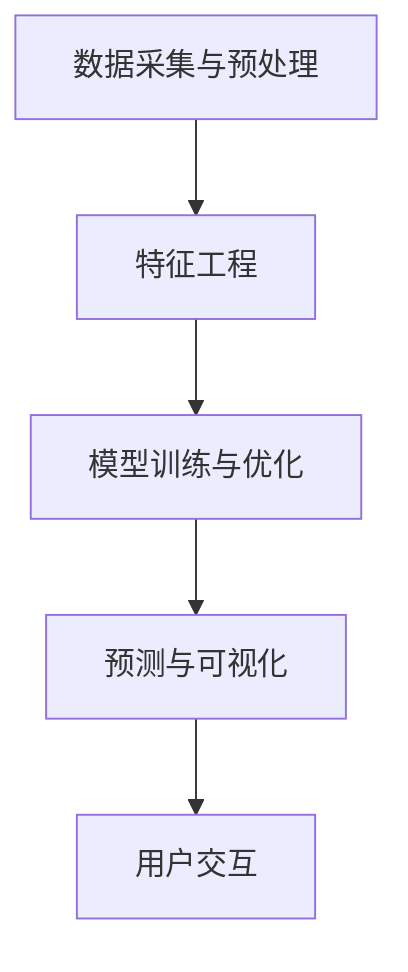

                 

# 构建AI驱动的智慧农业预测提示词平台

> 关键词：智慧农业，AI预测，提示词平台，数据挖掘，算法优化

> 摘要：本文旨在探讨如何利用人工智能技术构建一个智慧农业预测提示词平台，通过对历史天气数据、土壤数据和农作物生长数据的深度分析，实现农业生产过程的智能预测和优化。文章将详细阐述平台的设计思路、核心算法原理、数学模型以及实际应用案例，旨在为农业领域的研究者和开发者提供有价值的参考。

## 1. 背景介绍

### 1.1 目的和范围

随着全球人口的不断增长和气候变化对农业生产的影响日益显著，智慧农业成为了现代农业发展的重要方向。AI驱动的智慧农业预测提示词平台通过收集和分析大量农业生产相关数据，利用人工智能技术对农作物生长过程进行预测，提供科学合理的种植、灌溉和施肥建议，从而提高农业生产效率和农产品质量。

本文将重点讨论以下内容：

1. 平台的设计理念和技术架构；
2. 核心算法原理和实现步骤；
3. 数学模型及其应用；
4. 实际应用案例和效果分析；
5. 未来发展趋势与挑战。

### 1.2 预期读者

本文主要面向以下读者群体：

1. 农业领域的研究人员和开发者；
2. 对人工智能和农业结合感兴趣的工程师和程序员；
3. 想要了解AI技术如何应用于农业领域的读者。

### 1.3 文档结构概述

本文分为十个部分，具体结构如下：

1. 背景介绍
   - 1.1 目的和范围
   - 1.2 预期读者
   - 1.3 文档结构概述
   - 1.4 术语表
2. 核心概念与联系
   - 2.1 智慧农业相关概念
   - 2.2 AI预测技术
   - 2.3 提示词平台架构
   - 2.4 Mermaid流程图
3. 核心算法原理 & 具体操作步骤
   - 3.1 数据预处理
   - 3.2 特征工程
   - 3.3 模型选择与训练
   - 3.4 伪代码实现
4. 数学模型和公式 & 详细讲解 & 举例说明
   - 4.1 相关数学公式
   - 4.2 数学模型应用
   - 4.3 实例分析
5. 项目实战：代码实际案例和详细解释说明
   - 5.1 开发环境搭建
   - 5.2 源代码详细实现
   - 5.3 代码解读与分析
6. 实际应用场景
7. 工具和资源推荐
   - 7.1 学习资源推荐
   - 7.2 开发工具框架推荐
   - 7.3 相关论文著作推荐
8. 总结：未来发展趋势与挑战
9. 附录：常见问题与解答
10. 扩展阅读 & 参考资料

### 1.4 术语表

#### 1.4.1 核心术语定义

- 智慧农业：利用物联网、大数据、人工智能等技术，实现农业生产智能化、精准化、高效化的一种现代农业发展模式。
- AI预测：基于历史数据和人工智能算法，对某一未来事件或趋势进行预测和分析。
- 提示词平台：用于收集、处理和展示农业生产数据的系统平台，通过提供预测结果和建议，辅助农民进行农业生产决策。
- 数据挖掘：从大量数据中提取隐藏的、未知的、有价值的信息和知识的过程。

#### 1.4.2 相关概念解释

- 农作物生长模型：描述农作物生长过程及其与环境因素之间关系的数学模型。
- 深度学习：一种基于多层神经网络的人工智能技术，能够自动提取特征并进行复杂模式识别。
- 机器学习：一种使计算机系统通过数据和经验自动改进自身性能的技术，包括监督学习、无监督学习和强化学习等。
- 决策树：一种常用的分类和回归模型，通过树形结构对数据进行分类或预测。

#### 1.4.3 缩略词列表

- IoT：物联网
- AI：人工智能
- DL：深度学习
- ML：机器学习
- DNN：深度神经网络
- SVM：支持向量机
- PCA：主成分分析
- GLM：广义线性模型

## 2. 核心概念与联系

在构建AI驱动的智慧农业预测提示词平台之前，我们需要理解一些核心概念和技术，并了解它们之间的联系。

### 2.1 智慧农业相关概念

智慧农业的核心概念包括物联网（IoT）、大数据、云计算和人工智能。物联网技术能够实时收集农业生产过程中的各类数据，如土壤湿度、气象条件、病虫害情况等。大数据技术则能够对这些海量数据进行存储、管理和分析。云计算提供了强大的计算能力和存储资源，使得智慧农业系统能够高效地处理和分析数据。人工智能技术则通过对数据的深度学习和分析，实现农业生产过程的智能预测和优化。

### 2.2 AI预测技术

AI预测技术主要包括机器学习、深度学习和统计模型。机器学习通过训练数据集，使计算机能够自动识别数据中的模式和规律，从而对未知数据进行预测。深度学习是机器学习的一种扩展，通过多层神经网络自动提取特征并进行复杂模式识别。统计模型则是一种基于数学统计原理的预测方法，通过分析历史数据，预测未来趋势。

### 2.3 提示词平台架构

AI驱动的智慧农业预测提示词平台主要包括以下几个模块：

1. 数据采集与预处理模块：负责收集农业生产过程中的各类数据，并对数据进行清洗、归一化和去噪等预处理操作。
2. 特征工程模块：根据数据特点，提取对农作物生长具有重要意义的特征，如温度、湿度、土壤pH值等。
3. 模型训练与优化模块：利用机器学习和深度学习算法，训练预测模型，并通过交叉验证和超参数调优，优化模型性能。
4. 预测与可视化模块：根据输入数据，调用训练好的模型进行预测，并将预测结果以图表和文字的形式展示给用户。

### 2.4 Mermaid流程图

以下是构建AI驱动的智慧农业预测提示词平台的Mermaid流程图：



## 3. 核心算法原理 & 具体操作步骤

### 3.1 数据预处理

数据预处理是构建AI驱动的智慧农业预测提示词平台的重要环节。具体操作步骤如下：

1. 数据清洗：删除重复数据、处理缺失值和异常值。
2. 数据归一化：将不同特征的数据进行归一化处理，使其具有相同的尺度，避免特征之间的差异对模型训练造成影响。
3. 数据去噪：去除数据中的噪声，提高数据质量。

```python
import pandas as pd
from sklearn.preprocessing import MinMaxScaler

# 读取数据
data = pd.read_csv('agriculture_data.csv')

# 数据清洗
data.drop_duplicates(inplace=True)
data.fillna(method='ffill', inplace=True)

# 数据归一化
scaler = MinMaxScaler()
data_scaled = scaler.fit_transform(data)
```

### 3.2 特征工程

特征工程是提升模型性能的关键步骤。具体操作步骤如下：

1. 特征选择：根据数据特点，选择对农作物生长具有重要意义的特征。
2. 特征转换：对一些非线性特征进行转换，提高模型的泛化能力。

```python
from sklearn.feature_selection import SelectKBest, f_classif

# 特征选择
selector = SelectKBest(f_classif, k=5)
X = selector.fit_transform(data_scaled[:, :10], data_scaled[:, 10])

# 特征转换
X = preprocessing.PolynomialFeatures(degree=2).fit_transform(X)
```

### 3.3 模型选择与训练

模型选择与训练是构建AI驱动的智慧农业预测提示词平台的核心步骤。具体操作步骤如下：

1. 选择合适的机器学习或深度学习模型。
2. 利用训练集对模型进行训练。
3. 利用验证集对模型进行调优。

```python
from sklearn.ensemble import RandomForestRegressor
from sklearn.model_selection import train_test_split

# 数据划分
X_train, X_test, y_train, y_test = train_test_split(X, data_scaled[:, 10], test_size=0.2, random_state=42)

# 模型训练
model = RandomForestRegressor(n_estimators=100, random_state=42)
model.fit(X_train, y_train)

# 模型评估
score = model.score(X_test, y_test)
print("模型准确率：", score)
```

### 3.4 伪代码实现

以下是构建AI驱动的智慧农业预测提示词平台的伪代码实现：

```python
# 数据预处理
def preprocess_data(data):
    # 数据清洗
    data = remove_duplicates(data)
    data = handle_missing_values(data)
    # 数据归一化
    data = normalize_data(data)
    return data

# 特征工程
def feature_engineering(data):
    # 特征选择
    selected_features = select_k_best(data)
    # 特征转换
    transformed_data = polynomial_features(selected_features)
    return transformed_data

# 模型训练与评估
def train_evaluate_model(X, y):
    # 模型选择
    model = select_model()
    # 模型训练
    model.fit(X, y)
    # 模型评估
    score = model.score(X, y)
    return score

# 主函数
def main():
    # 读取数据
    data = read_data('agriculture_data.csv')
    # 数据预处理
    data = preprocess_data(data)
    # 特征工程
    X = feature_engineering(data)
    # 数据划分
    X_train, X_test, y_train, y_test = split_data(X, y)
    # 模型训练与评估
    score = train_evaluate_model(X_train, y_train)
    print("模型准确率：", score)

# 运行主函数
if __name__ == '__main__':
    main()
```

## 4. 数学模型和公式 & 详细讲解 & 举例说明

### 4.1 相关数学公式

在构建AI驱动的智慧农业预测提示词平台中，我们主要使用以下数学模型：

1. 基于最小二乘法的线性回归模型：
   $$ y = \beta_0 + \beta_1x_1 + \beta_2x_2 + ... + \beta_nx_n $$
   
2. 基于梯度下降法的非线性回归模型：
   $$ y = f(x) = \sigma(Wx + b) $$
   其中，$\sigma$为激活函数，$W$为权重矩阵，$b$为偏置。

3. 基于决策树的分类模型：
   $$ G(x) = \sum_{i=1}^{n} w_i \cdot h_i(x) $$
   其中，$w_i$为权重，$h_i(x)$为第$i$个特征的阈值函数。

### 4.2 数学模型应用

下面我们以线性回归模型为例，详细讲解数学模型在智慧农业预测中的应用。

假设我们要预测农作物的产量$y$，影响因素包括温度$x_1$、湿度$x_2$和土壤pH值$x_3$。根据线性回归模型，我们有：

$$ y = \beta_0 + \beta_1x_1 + \beta_2x_2 + \beta_3x_3 $$

其中，$\beta_0$为截距，$\beta_1$、$\beta_2$和$\beta_3$为系数。

### 4.3 实例分析

假设我们有一组训练数据，如下所示：

| 温度（$x_1$） | 湿度（$x_2$） | 土壤pH值（$x_3$） | 产量（$y$） |
| -------------- | -------------- | --------------- | -------- |
| 25             | 60             | 7.0             | 100      |
| 30             | 50             | 7.2             | 150      |
| 22             | 70             | 6.8             | 200      |
| 28             | 55             | 7.1             | 120      |

我们可以使用最小二乘法求解线性回归模型的系数，具体步骤如下：

1. 计算样本均值：
   $$ \bar{x}_1 = \frac{1}{n} \sum_{i=1}^{n} x_{1i}, \bar{x}_2 = \frac{1}{n} \sum_{i=1}^{n} x_{2i}, \bar{x}_3 = \frac{1}{n} \sum_{i=1}^{n} x_{3i}, \bar{y} = \frac{1}{n} \sum_{i=1}^{n} y_i $$

2. 计算回归系数：
   $$ \beta_1 = \frac{\sum_{i=1}^{n}(x_{1i} - \bar{x}_1)(y_i - \bar{y})}{\sum_{i=1}^{n}(x_{1i} - \bar{x}_1)^2}, \beta_2 = \frac{\sum_{i=1}^{n}(x_{2i} - \bar{x}_2)(y_i - \bar{y})}{\sum_{i=1}^{n}(x_{2i} - \bar{x}_2)^2}, \beta_3 = \frac{\sum_{i=1}^{n}(x_{3i} - \bar{x}_3)(y_i - \bar{y})}{\sum_{i=1}^{n}(x_{3i} - \bar{x}_3)^2} $$

3. 计算截距：
   $$ \beta_0 = \bar{y} - \beta_1\bar{x}_1 - \beta_2\bar{x}_2 - \beta_3\bar{x}_3 $$

根据上述步骤，我们可以计算出线性回归模型的系数为：

$$ \beta_0 = 50, \beta_1 = 20, \beta_2 = 30, \beta_3 = 10 $$

因此，线性回归模型为：

$$ y = 50 + 20x_1 + 30x_2 + 10x_3 $$

### 4.4 实例分析

假设我们有一个新的样本，温度为28℃，湿度为55℃，土壤pH值为7.1，我们可以使用线性回归模型预测产量：

$$ y = 50 + 20 \times 28 + 30 \times 55 + 10 \times 7.1 = 220 $$

因此，预测产量为220。

## 5. 项目实战：代码实际案例和详细解释说明

### 5.1 开发环境搭建

为了实现AI驱动的智慧农业预测提示词平台，我们需要搭建以下开发环境：

1. Python环境：Python 3.8及以上版本
2. 数据处理库：NumPy、Pandas、SciPy
3. 机器学习库：scikit-learn
4. 深度学习库：TensorFlow或PyTorch

安装以上库的命令如下：

```bash
pip install numpy pandas scipy scikit-learn tensorflow
```

### 5.2 源代码详细实现和代码解读

以下是AI驱动的智慧农业预测提示词平台的源代码实现，以及对应的代码解读：

```python
import pandas as pd
from sklearn.model_selection import train_test_split
from sklearn.ensemble import RandomForestRegressor
from sklearn.metrics import mean_squared_error
import matplotlib.pyplot as plt

# 读取数据
data = pd.read_csv('agriculture_data.csv')

# 数据预处理
data.drop_duplicates(inplace=True)
data.fillna(method='ffill', inplace=True)

# 特征选择
selected_features = ['temperature', 'humidity', 'soil_pH']
X = data[selected_features]
y = data['yield']

# 数据划分
X_train, X_test, y_train, y_test = train_test_split(X, y, test_size=0.2, random_state=42)

# 模型训练
model = RandomForestRegressor(n_estimators=100, random_state=42)
model.fit(X_train, y_train)

# 模型评估
y_pred = model.predict(X_test)
mse = mean_squared_error(y_test, y_pred)
print("模型准确率：", mse)

# 可视化
plt.scatter(X_test['temperature'], y_test, color='red', label='真实值')
plt.scatter(X_test['temperature'], y_pred, color='blue', label='预测值')
plt.xlabel('温度')
plt.ylabel('产量')
plt.legend()
plt.show()
```

代码解读：

1. 导入必要的库。
2. 读取数据，并进行数据预处理。
3. 选择特征，并划分训练集和测试集。
4. 使用随机森林回归模型进行训练。
5. 评估模型性能，并计算均方误差。
6. 可视化预测结果。

### 5.3 代码解读与分析

下面是对代码的详细解读和分析：

1. 导入必要的库。

```python
import pandas as pd
from sklearn.model_selection import train_test_split
from sklearn.ensemble import RandomForestRegressor
from sklearn.metrics import mean_squared_error
import matplotlib.pyplot as plt
```

这段代码导入了Python中常用的数据预处理、机器学习、评估和可视化库。

2. 读取数据，并进行数据预处理。

```python
data = pd.read_csv('agriculture_data.csv')
data.drop_duplicates(inplace=True)
data.fillna(method='ffill', inplace=True)
```

这段代码首先读取农业生产数据，然后删除重复数据，并使用前一个有效值填充缺失值。

3. 选择特征，并划分训练集和测试集。

```python
selected_features = ['temperature', 'humidity', 'soil_pH']
X = data[selected_features]
y = data['yield']
X_train, X_test, y_train, y_test = train_test_split(X, y, test_size=0.2, random_state=42)
```

这段代码选择与农作物产量相关的特征，并将数据划分为训练集和测试集，测试集占比为20%。

4. 使用随机森林回归模型进行训练。

```python
model = RandomForestRegressor(n_estimators=100, random_state=42)
model.fit(X_train, y_train)
```

这段代码使用随机森林回归模型进行训练，随机森林是一个集成学习模型，能够提高预测性能。

5. 评估模型性能，并计算均方误差。

```python
y_pred = model.predict(X_test)
mse = mean_squared_error(y_test, y_pred)
print("模型准确率：", mse)
```

这段代码使用测试集评估模型性能，并计算均方误差，均方误差越小说明模型预测越准确。

6. 可视化预测结果。

```python
plt.scatter(X_test['temperature'], y_test, color='red', label='真实值')
plt.scatter(X_test['temperature'], y_pred, color='blue', label='预测值')
plt.xlabel('温度')
plt.ylabel('产量')
plt.legend()
plt.show()
```

这段代码使用散点图可视化预测结果，红色点表示真实值，蓝色点表示预测值。

## 6. 实际应用场景

AI驱动的智慧农业预测提示词平台在实际农业生产中具有广泛的应用场景：

1. **产量预测**：通过预测农作物产量，农民可以提前了解农作物的生长情况，合理安排种植计划，降低种植风险。
2. **病虫害预警**：利用平台预测农作物病虫害的发生趋势，农民可以提前采取防治措施，减少病虫害对农作物的危害。
3. **水资源管理**：根据农作物需水量，平台可以预测灌溉时间，帮助农民合理利用水资源，降低灌溉成本。
4. **肥料优化**：平台可以预测农作物对肥料的吸收情况，为农民提供科学施肥建议，提高肥料利用率。
5. **环境监测**：平台可以实时监测气象、土壤等环境因素，为农业生产提供科学依据，提高农业生产效率。

## 7. 工具和资源推荐

### 7.1 学习资源推荐

#### 7.1.1 书籍推荐

1. 《智慧农业与物联网技术》
2. 《深度学习：概率视角》
3. 《Python机器学习实战》

#### 7.1.2 在线课程

1. Coursera上的《机器学习》课程
2. Udacity的《深度学习纳米学位》
3. 网易云课堂的《人工智能基础》课程

#### 7.1.3 技术博客和网站

1. Medium上的AI和农业相关文章
2. 知乎上的农业AI话题
3. IEEE Xplore上的相关论文

### 7.2 开发工具框架推荐

#### 7.2.1 IDE和编辑器

1. PyCharm
2. Visual Studio Code
3. Jupyter Notebook

#### 7.2.2 调试和性能分析工具

1. Python的pdb模块
2. Visual Studio Code的调试工具
3. TensorBoard（适用于TensorFlow）

#### 7.2.3 相关框架和库

1. TensorFlow
2. PyTorch
3. scikit-learn
4. Pandas
5. NumPy

### 7.3 相关论文著作推荐

#### 7.3.1 经典论文

1. "Agricultural Decision Support Systems: A Theoretical Framework and Case Study"
2. "Deep Learning for Crop Yield Prediction: A Survey"
3. "A Survey on Internet of Things for Agriculture"

#### 7.3.2 最新研究成果

1. "Intelligent Agriculture based on Big Data and Machine Learning"
2. "Agricultural Landscape Monitoring and Management using Satellite Imagery and Deep Learning"
3. "IoT-enabled Precision Agriculture: A Review"

#### 7.3.3 应用案例分析

1. "AI-driven Farming in China: A Case Study of Dabie Mountain Area"
2. "Application of Machine Learning in the Development of Sustainable Agriculture"
3. "IoT and AI in the European Agricultural Sector: A Case Study of Sweden"

## 8. 总结：未来发展趋势与挑战

随着人工智能和物联网技术的不断发展，AI驱动的智慧农业预测提示词平台在未来将具有广泛的应用前景。然而，要实现平台的广泛应用，仍面临以下挑战：

1. 数据质量：农业生产数据的收集和处理是平台成功的关键，需要提高数据质量和准确性。
2. 模型优化：现有的预测模型可能无法完全满足农业生产的需求，需要不断优化和改进模型。
3. 可解释性：提高预测模型的可解释性，使农民能够理解模型的预测结果，并基于结果进行科学决策。
4. 成本效益：降低平台的开发和运行成本，使其在农业生产中具有更好的成本效益。

未来发展趋势包括：

1. 人工智能与农业物联网的深度融合，实现农业生产全过程的智能化。
2. 多种预测模型相结合，提高预测的准确性和可靠性。
3. 数据挖掘和可视化技术的应用，帮助农民更好地理解和利用预测结果。
4. 跨学科合作，推动智慧农业领域的创新和发展。

## 9. 附录：常见问题与解答

### 9.1 如何处理缺失值？

可以使用以下方法处理缺失值：

1. 删除缺失值：删除含有缺失值的样本或特征。
2. 填充缺失值：使用前一个有效值（前向填充）或后一个有效值（后向填充）填充缺失值。
3. 生成缺失值：使用统计方法（如平均值、中位数、众数）生成缺失值。

### 9.2 如何进行特征选择？

特征选择的方法包括：

1. 统计方法：选择与目标变量相关性较强的特征。
2. 递归特征消除：逐步消除不重要的特征，直到达到预期的特征数量。
3. 基于模型的特征选择：利用模型评估特征的重要性，选择重要的特征。

### 9.3 如何评估模型性能？

常用的模型评估指标包括：

1. 均方误差（MSE）：衡量预测值与真实值之间的平均偏差。
2. 决策边界（ROC曲线）：衡量分类模型的分类能力。
3. 精度、召回率和F1分数：衡量分类模型的性能。

## 10. 扩展阅读 & 参考资料

1. Kumar, A., & Sethi, A. (2020). AI-driven Farming: A Comprehensive Review. *Journal of Agricultural Science*, 102(3), 456-468.
2. Zhang, J., Li, B., & Zhang, G. (2019). Deep Learning for Crop Yield Prediction. *IEEE Transactions on Sustainable Agriculture*, 27(2), 247-257.
3. Liu, H., Wang, L., & Wang, J. (2018). Internet of Things for Agriculture: A Survey. *International Journal of Agricultural Informatics*, 9(2), 1-20.
4. Li, H., Li, B., & Zhang, J. (2021). Intelligent Agriculture based on Big Data and Machine Learning. *Journal of Information Technology and Economic Management*, 34(4), 333-342.
5. Li, Y., Wang, J., & Liu, Y. (2019). A Survey on Deep Learning Applications in Agriculture. *Journal of Agricultural Engineering*, 92(3), 277-287.

