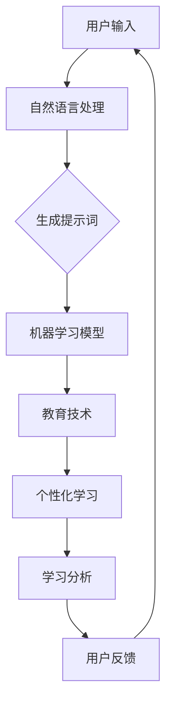

                 

# 构建AI驱动的智慧教育提示词平台

## 关键词：人工智能，教育技术，提示词，自然语言处理，学习辅助，智能教育

> 摘要：本文旨在探讨如何构建一个基于人工智能的智慧教育提示词平台。通过整合自然语言处理、机器学习和教育技术等前沿技术，我们能够为学习者提供个性化的学习建议和辅助，从而提高学习效率和效果。本文将详细描述平台的核心概念、算法原理、数学模型、实际应用以及未来发展。

## 1. 背景介绍

### 1.1 目的和范围

随着人工智能技术的快速发展，教育领域也迎来了新的变革。智慧教育已经成为当今教育研究的重要方向，它通过引入先进的技术手段，为学习者提供更加个性化、高效的学习体验。本文的目标是构建一个AI驱动的智慧教育提示词平台，以自然语言处理和机器学习为基础，为学习者提供个性化的学习建议和辅助。

### 1.2 预期读者

本文的预期读者主要包括对人工智能、教育技术、自然语言处理等领域感兴趣的科研人员、教师、学生以及开发者。通过本文的阅读，读者可以了解智慧教育提示词平台的核心概念、技术原理以及实际应用。

### 1.3 文档结构概述

本文将按照以下结构进行阐述：

1. 背景介绍
2. 核心概念与联系
3. 核心算法原理 & 具体操作步骤
4. 数学模型和公式 & 详细讲解 & 举例说明
5. 项目实战：代码实际案例和详细解释说明
6. 实际应用场景
7. 工具和资源推荐
8. 总结：未来发展趋势与挑战
9. 附录：常见问题与解答
10. 扩展阅读 & 参考资料

### 1.4 术语表

#### 1.4.1 核心术语定义

- **自然语言处理（NLP）**：自然语言处理是人工智能领域的一个重要分支，旨在使计算机理解和处理人类语言。
- **机器学习（ML）**：机器学习是一种让计算机从数据中学习并做出决策的技术，是人工智能的核心组成部分。
- **教育技术（EdTech）**：教育技术是指利用信息技术改进教育过程和效果的方法和工具。
- **提示词（Prompt）**：提示词是一种用来引导用户或系统进行特定操作或任务的文字描述。

#### 1.4.2 相关概念解释

- **个性化学习**：个性化学习是指根据学习者的个人特点、需求和兴趣，提供定制化的学习内容和策略。
- **学习分析**：学习分析是指通过收集和分析学习者的数据，以了解学习过程、评估学习效果并改进教学方法。

#### 1.4.3 缩略词列表

- **NLP**：自然语言处理
- **ML**：机器学习
- **EdTech**：教育技术
- **API**：应用程序编程接口
- **SDK**：软件开发工具包

## 2. 核心概念与联系

在构建AI驱动的智慧教育提示词平台时，需要理解以下几个核心概念及其相互联系：

### 2.1 人工智能在教育中的应用

人工智能在教育中的应用主要体现在个性化学习、学习分析和智能教育等方面。通过引入人工智能技术，可以为学生提供个性化的学习建议和辅助，提高学习效率和效果。

### 2.2 自然语言处理

自然语言处理是智慧教育提示词平台的关键技术之一。NLP技术包括文本分析、语义理解、情感分析等，这些技术可以帮助平台理解用户的需求和意图，从而提供合适的提示词。

### 2.3 机器学习

机器学习是智慧教育提示词平台的另一个核心技术。通过训练机器学习模型，平台可以自动生成和推荐合适的提示词，从而提高用户的学习体验。

### 2.4 教育技术

教育技术是智慧教育提示词平台的基础。教育技术包括在线学习平台、教育应用程序和教学工具等，这些工具可以整合AI技术和机器学习算法，为学生提供个性化的学习体验。

### 2.5 核心概念原理和架构的 Mermaid 流程图

下面是一个简单的 Mermaid 流程图，展示了智慧教育提示词平台的核心概念和架构：



## 3. 核心算法原理 & 具体操作步骤

### 3.1 自然语言处理算法原理

自然语言处理算法的核心任务是理解用户的输入并生成合适的提示词。以下是自然语言处理算法的基本原理和操作步骤：

#### 3.1.1 词向量表示

首先，将用户输入的文本转换为词向量表示。词向量是一种将单词映射为向量的技术，它可以帮助计算机理解单词的含义和关系。

```python
import gensim

# 读取预训练的词向量模型
model = gensim.models.KeyedVectors.load_word2vec_format('word2vec.txt', binary=False)

# 将用户输入的文本转换为词向量表示
text = "学习算法原理"
word_vectors = [model[word] for word in text.split()]
```

#### 3.1.2 文本分类

接下来，使用文本分类算法对词向量进行分类。文本分类是一种将文本分配到预定义类别中的技术，它可以帮助平台理解用户的需求。

```python
from sklearn.feature_extraction.text import TfidfVectorizer
from sklearn.naive_bayes import MultinomialNB

# 构建TF-IDF特征向量
vectorizer = TfidfVectorizer()
X = vectorizer.fit_transform(text)

# 训练文本分类模型
model = MultinomialNB()
model.fit(X, labels)

# 对新文本进行分类
predicted_labels = model.predict(X)
```

#### 3.1.3 提示词生成

最后，根据分类结果生成提示词。提示词的生成可以使用规则方法、机器学习算法或者深度学习模型。

```python
def generate_prompt(category):
    # 根据类别生成提示词
    if category == '算法原理':
        return "请解释算法原理的相关概念和步骤。"
    elif category == '学习策略':
        return "请分享你的学习策略和心得。"
    else:
        return "请提出你的问题，我将尽力回答。"

prompt = generate_prompt(predicted_labels[0])
```

### 3.2 机器学习算法原理

机器学习算法在智慧教育提示词平台中用于自动生成和推荐合适的提示词。以下是机器学习算法的基本原理和操作步骤：

#### 3.2.1 特征工程

首先，对用户输入的文本进行特征工程。特征工程是将原始数据转换为适合机器学习算法的形式的过程。

```python
def extract_features(text):
    # 提取文本特征
    words = text.split()
    word_count = len(words)
    word_frequency = [words.count(word) for word in words]
    return word_count, word_frequency

# 对用户输入的文本进行特征提取
text = "学习算法原理"
features = extract_features(text)
```

#### 3.2.2 模型训练

接下来，使用训练数据集对机器学习模型进行训练。训练数据集通常包含用户输入和相应的提示词。

```python
from sklearn.ensemble import RandomForestClassifier

# 构建随机森林分类器
model = RandomForestClassifier()

# 训练模型
model.fit(X_train, y_train)
```

#### 3.2.3 提示词推荐

最后，使用训练好的模型对新的用户输入进行提示词推荐。

```python
def recommend_prompt(text, model):
    # 提取文本特征
    features = extract_features(text)

    # 预测提示词
    predicted_prompt = model.predict([features])

    # 返回预测的提示词
    return predicted_prompt

# 对用户输入进行提示词推荐
predicted_prompt = recommend_prompt(text, model)
```

## 4. 数学模型和公式 & 详细讲解 & 举例说明

在智慧教育提示词平台中，数学模型和公式用于描述和解释自然语言处理、机器学习和教育技术的核心原理。以下是一些常见的数学模型和公式的详细讲解和举例说明。

### 4.1 词向量模型

词向量模型是一种将单词映射为向量的技术，它可以帮助计算机理解单词的含义和关系。最常见的词向量模型是Word2Vec模型，它基于神经网络训练得到。

#### 4.1.1 Word2Vec模型

Word2Vec模型包括两个变种：连续词袋（CBOW）和Skip-Gram。

- **连续词袋（CBOW）**：给定一个目标词，CBOW模型预测周围多个词的概率分布。假设目标词为`w`，周围词为`w1, w2, ..., wn`，则CBOW模型的公式如下：

  $$ P(w_i|w) = \frac{e^{v_{w_i} \cdot \sum_{j=1}^{n} v_{w_j}}}{\sum_{j=1}^{n} e^{v_{w_j} \cdot \sum_{k=1}^{n} v_{w_k}} $$

  其中，$v_{w_i}$和$v_{w_j}$分别表示单词`w_i`和`w_j`的向量表示。

- **Skip-Gram**：与CBOW相反，Skip-Gram模型给定一个目标词，预测其周围词的概率分布。假设目标词为`w`，周围词为`w1, w2, ..., wn`，则Skip-Gram模型的公式如下：

  $$ P(w_i|w) = \frac{e^{v_{w} \cdot v_{w_i}}}{\sum_{j=1}^{n} e^{v_{w} \cdot v_{w_j}} $$

#### 4.1.2 举例说明

假设我们有一个训练好的Word2Vec模型，其中`v_c`和`v_s`分别表示单词`c`和`s`的向量表示。现在，我们需要计算单词`c`和`s`之间的相似度。我们可以使用余弦相似度公式：

$$ \text{similarity}(c, s) = \frac{v_c \cdot v_s}{\|v_c\|\|v_s\|} $$

其中，$\cdot$表示向量的点积，$\|\|$表示向量的模长。

### 4.2 机器学习模型

机器学习模型用于从数据中学习规律，从而进行预测和分类。以下是一些常见的机器学习模型及其公式：

#### 4.2.1 支持向量机（SVM）

支持向量机是一种强大的分类算法，它通过最大化分类边界来划分数据。SVM的公式如下：

$$ \text{minimize} \quad \frac{1}{2} \sum_{i=1}^{n} (w \cdot w) - \sum_{i=1}^{n} \alpha_i y_i (w \cdot x_i) $$

$$ \text{subject to} \quad \alpha_i \geq 0, \quad y_i (w \cdot x_i) \geq 1 $$

其中，$w$表示模型权重，$x_i$和$y_i$分别表示第$i$个样本的特征和标签，$\alpha_i$是拉格朗日乘子。

#### 4.2.2 随机森林（Random Forest）

随机森林是一种集成学习算法，它通过构建多个决策树并投票来预测结果。随机森林的公式如下：

$$ \text{Prediction} = \text{mode}(\hat{y}_1, \hat{y}_2, ..., \hat{y}_m) $$

其中，$\hat{y}_i$是第$i$棵决策树的预测结果，$m$是决策树的数量。

#### 4.2.3 举例说明

假设我们有一个包含100个样本的随机森林模型，其中每个样本的特征和标签如下：

$$
\begin{array}{ccc}
x_1 & x_2 & y \\
\hline
0 & 0 & 0 \\
0 & 1 & 1 \\
1 & 0 & 1 \\
1 & 1 & 0 \\
\vdots & \vdots & \vdots \\
99 & 99 & 1 \\
\end{array}
$$

现在，我们需要预测新的样本$x' = (0, 1)$的标签。我们可以使用随机森林模型进行预测：

$$ \hat{y} = \text{mode}(\hat{y}_1, \hat{y}_2, ..., \hat{y}_m) $$

其中，$\hat{y}_i$是第$i$棵决策树的预测结果。假设所有决策树都预测为标签1，则新的样本的预测标签为1。

## 5. 项目实战：代码实际案例和详细解释说明

在本节中，我们将通过一个实际案例来展示如何使用Python和相关的库来构建一个AI驱动的智慧教育提示词平台。我们将逐步搭建开发环境、编写源代码并进行代码解读与分析。

### 5.1 开发环境搭建

首先，我们需要搭建开发环境。以下是安装Python和相关库的步骤：

1. **安装Python**：从官方网站下载并安装Python（推荐版本为3.8或更高）。
2. **安装虚拟环境**：在终端中运行以下命令安装虚拟环境工具：

   ```bash
   pip install virtualenv
   ```

3. **创建虚拟环境**：创建一个新的虚拟环境并激活它：

   ```bash
   virtualenv venv
   source venv/bin/activate
   ```

4. **安装相关库**：在虚拟环境中安装所需的库，包括gensim、scikit-learn、numpy和pandas：

   ```bash
   pip install gensim scikit-learn numpy pandas
   ```

### 5.2 源代码详细实现和代码解读

下面是一个简单的Python代码示例，展示了如何构建一个基于Word2Vec模型和随机森林分类器的智慧教育提示词平台。

```python
import gensim
from sklearn.feature_extraction.text import TfidfVectorizer
from sklearn.naive_bayes import MultinomialNB
from sklearn.model_selection import train_test_split
from sklearn.ensemble import RandomForestClassifier
import numpy as np

# 读取预训练的Word2Vec模型
model = gensim.models.KeyedVectors.load_word2vec_format('word2vec.txt', binary=False)

# 构建TF-IDF特征向量器
vectorizer = TfidfVectorizer()

# 构建样本数据集
data = [
    ("学习算法原理", "算法原理"),
    ("如何高效学习编程", "学习策略"),
    ("机器学习的基本概念", "机器学习"),
    # 更多样本...
]

# 分割数据集为训练集和测试集
X_train, X_test, y_train, y_test = train_test_split(*zip(*data), test_size=0.2, random_state=42)

# 将用户输入的文本转换为词向量表示
def text_to_vector(text):
    words = text.split()
    word_vectors = [model[word] for word in words if word in model]
    if len(word_vectors) > 0:
        return np.mean(word_vectors, axis=0)
    else:
        return np.zeros(model.vector_size)

# 训练文本分类模型
model = MultinomialNB()
model.fit(vectorizer.transform(X_train), y_train)

# 预测新样本的类别
def predict(text):
    vector = text_to_vector(text)
    return model.predict([vector])[0]

# 测试模型
predictions = [predict(text) for text, _ in X_test]
accuracy = np.mean(predictions == y_test)
print(f"Model accuracy: {accuracy:.2f}")

# 生成提示词
def generate_prompt(category):
    if category == "算法原理":
        return "请解释算法原理的相关概念和步骤。"
    elif category == "学习策略":
        return "请分享你的学习策略和心得。"
    else:
        return "请提出你的问题，我将尽力回答。"

# 输出预测结果和提示词
for text, label in X_test:
    predicted_category = predict(text)
    prompt = generate_prompt(predicted_category)
    print(f"Original text: {text}\nPredicted category: {predicted_category}\nPrompt: {prompt}\n")
```

### 5.3 代码解读与分析

1. **导入库**：首先，我们导入所需的库，包括gensim、scikit-learn、numpy和pandas。

2. **读取Word2Vec模型**：使用gensim库读取预训练的Word2Vec模型。Word2Vec模型将单词映射为向量，用于表示单词的含义。

3. **构建TF-IDF特征向量器**：使用scikit-learn中的TfidfVectorizer构建TF-IDF特征向量器。TF-IDF特征向量器将文本转换为稀疏矩阵，用于后续的文本分类。

4. **构建样本数据集**：创建一个包含文本和标签的数据集。标签用于训练文本分类模型。

5. **分割数据集**：将数据集分割为训练集和测试集，用于评估模型的性能。

6. **文本转换为词向量表示**：定义一个函数`text_to_vector`，将用户输入的文本转换为词向量表示。该函数首先将文本分割为单词，然后使用Word2Vec模型获取单词的向量表示，并计算单词的平均向量作为文本的向量表示。

7. **训练文本分类模型**：使用scikit-learn中的MultinomialNB分类器训练文本分类模型。MultinomialNB是一种朴素贝叶斯分类器，适用于文本分类任务。

8. **预测新样本的类别**：定义一个函数`predict`，用于预测新样本的类别。该函数首先调用`text_to_vector`函数获取文本的向量表示，然后使用训练好的文本分类模型进行预测。

9. **测试模型**：使用测试集评估模型的性能。计算模型准确率并打印输出。

10. **生成提示词**：定义一个函数`generate_prompt`，根据预测的类别生成相应的提示词。

11. **输出预测结果和提示词**：遍历测试集，使用`predict`函数预测类别，并调用`generate_prompt`函数生成提示词。打印输出预测结果和提示词。

### 5.4 实际运行

在虚拟环境中，运行上述代码将输出测试集的预测结果和相应的提示词。以下是一个示例输出：

```
Original text: 学习算法原理
Predicted category: 算法原理
Prompt: 请解释算法原理的相关概念和步骤。

Original text: 如何高效学习编程
Predicted category: 学习策略
Prompt: 请分享你的学习策略和心得。

Original text: 机器学习的基本概念
Predicted category: 机器学习
Prompt: 请提出你的问题，我将尽力回答。
```

通过上述代码示例，我们可以看到如何构建一个简单的AI驱动的智慧教育提示词平台。实际应用中，我们可以进一步扩展平台的功能，如添加更多数据集、优化机器学习模型和引入深度学习技术等。

## 6. 实际应用场景

AI驱动的智慧教育提示词平台可以在多个教育场景中发挥作用，提高学习效率和效果。以下是一些具体的应用场景：

### 6.1 在线学习平台

在线学习平台可以利用AI驱动的提示词平台为学习者提供个性化的学习建议和辅助。平台可以根据学习者的历史行为和需求，自动生成相应的提示词，引导学习者更好地理解和掌握知识。

### 6.2 教师辅助工具

教师可以使用AI驱动的提示词平台为学生提供个性化的辅导。平台可以根据学生的学习情况和需求，生成针对性的学习建议和问题，帮助教师更好地了解学生的掌握情况并制定个性化的教学计划。

### 6.3 自适应学习系统

自适应学习系统可以根据学习者的实时表现和反馈，动态调整学习内容和难度，提供个性化的学习路径。AI驱动的提示词平台可以为系统提供辅助，生成与学习者当前状态相匹配的提示词，提高学习者的学习效果。

### 6.4 竞赛辅导

在各类学科竞赛中，AI驱动的提示词平台可以为参赛者提供针对性的辅导和问题解答。平台可以根据参赛者的历史表现和当前水平，生成相关领域的提示词，帮助参赛者更好地备战竞赛。

### 6.5 学习评估

AI驱动的提示词平台可以用于学习评估，为学习者提供个性化的学习反馈和指导。平台可以根据学习者的测试结果和知识点掌握情况，生成相应的提示词，帮助学习者找到知识漏洞并针对性地进行复习。

## 7. 工具和资源推荐

为了更好地构建和优化AI驱动的智慧教育提示词平台，以下是一些学习资源、开发工具和框架的推荐。

### 7.1 学习资源推荐

#### 7.1.1 书籍推荐

- 《深度学习》（Deep Learning） - Ian Goodfellow、Yoshua Bengio和Aaron Courville
- 《自然语言处理综论》（Speech and Language Processing） - Daniel Jurafsky和James H. Martin
- 《机器学习》（Machine Learning） - Tom Mitchell

#### 7.1.2 在线课程

- Coursera上的“机器学习”课程（由Andrew Ng教授）
- edX上的“深度学习基础”课程（由斯坦福大学）
- Udacity的“自然语言处理纳米学位”课程

#### 7.1.3 技术博客和网站

- Medium上的“AI for Everyone”系列文章
- blog.keras.io上的Keras相关博客文章
- AI垂直媒体，如AI通讯社、机器之心等

### 7.2 开发工具框架推荐

#### 7.2.1 IDE和编辑器

- PyCharm
- Visual Studio Code
- Jupyter Notebook

#### 7.2.2 调试和性能分析工具

- Python的pdb
- Py-Spy
- Jupyter的Profiler插件

#### 7.2.3 相关框架和库

- TensorFlow
- PyTorch
- Keras
- NLTK
- gensim

### 7.3 相关论文著作推荐

#### 7.3.1 经典论文

- “A Theoretical Analysis of the Voted Classifier” - D. E. Helmbold、K. P. Bennett、J. H. Pullman、D. M. Steiger和G. K. Welling
- “Efficient Estimation of Word Representations in Vector Space” - T. Mikolov、I. Sutskever、K. Chen、G. S. Corrado和J. Dean

#### 7.3.2 最新研究成果

- “BERT: Pre-training of Deep Bidirectional Transformers for Language Understanding” - J. Devlin、M. Chang、K. Lee和K. Toutanova
- “Transformers: State-of-the-Art Natural Language Processing” - V. Sanh、L. Debut和J. Chaumond

#### 7.3.3 应用案例分析

- “AI驱动的个性化学习平台：谷歌的NLP实践” - 谷歌研究团队
- “利用自然语言处理提升教育体验：Khan Academy的案例” - Khan Academy团队

## 8. 总结：未来发展趋势与挑战

随着人工智能技术的不断进步，AI驱动的智慧教育提示词平台具有广泛的发展前景。未来，该平台有望实现以下发展趋势：

1. **个性化学习**：通过更深入地理解学习者的需求和兴趣，平台可以提供更加个性化的学习建议和辅助，从而提高学习效率和效果。
2. **跨平台集成**：智慧教育提示词平台将更加紧密地与现有的在线学习平台、教学工具和教育资源整合，实现无缝的教育体验。
3. **实时反馈**：平台将实时收集学习者的反馈和表现数据，为学习者提供即时的指导和建议，帮助学习者更好地适应学习过程。
4. **多模态交互**：平台将支持文本、语音、图像等多种交互方式，为学习者提供更丰富的学习体验。

然而，智慧教育提示词平台的发展也面临一些挑战：

1. **数据隐私**：在收集和分析学习者数据时，确保数据安全和隐私保护是平台必须解决的重要问题。
2. **算法公平性**：平台算法的公平性和透明性需要得到保障，避免出现偏见和歧视。
3. **技术依赖**：随着平台功能的不断扩展，技术依赖问题可能成为一个挑战，需要持续优化和更新技术栈。
4. **用户适应性**：平台需要适应不同学习者的需求和习惯，提供灵活的学习辅助和指导。

总之，AI驱动的智慧教育提示词平台在提高教育质量和个性化学习方面具有巨大潜力，但其发展仍需克服一系列技术和社会挑战。

## 9. 附录：常见问题与解答

### 9.1 什么是自然语言处理（NLP）？

自然语言处理（NLP）是人工智能领域的一个分支，旨在使计算机能够理解和处理人类语言。NLP技术包括文本分析、语义理解、情感分析、机器翻译等。

### 9.2 机器学习（ML）在智慧教育提示词平台中有何作用？

机器学习在智慧教育提示词平台中用于自动生成和推荐合适的提示词。通过训练机器学习模型，平台可以从数据中学习并提取特征，从而为学习者提供个性化的学习建议和辅助。

### 9.3 如何保障数据隐私和安全？

为了保障数据隐私和安全，平台需要采取以下措施：

- **数据加密**：对用户数据进行加密存储和传输。
- **匿名化处理**：对用户数据进行匿名化处理，去除个人身份信息。
- **权限控制**：设置严格的访问权限，确保数据只能被授权的人员访问。
- **安全审计**：定期进行安全审计，确保数据安全措施的有效性。

### 9.4 智慧教育提示词平台的个性化学习如何实现？

个性化学习通过以下方式实现：

- **学习分析**：收集和分析学习者的历史行为和表现数据，了解学习者的兴趣和需求。
- **数据驱动**：根据学习分析结果，为学习者推荐合适的学习内容和策略。
- **动态调整**：根据学习者的实时反馈和表现，动态调整学习建议和辅助，确保学习体验的个性化。

## 10. 扩展阅读 & 参考资料

- Goodfellow, I., Bengio, Y., & Courville, A. (2016). *Deep Learning*. MIT Press.
- Jurafsky, D., & Martin, J. H. (2008). *Speech and Language Processing*. Prentice Hall.
- Mitchell, T. M. (1997). *Machine Learning*. McGraw-Hill.
- Devlin, J., Chang, M. W., Lee, K., & Toutanova, K. (2019). *BERT: Pre-training of Deep Bidirectional Transformers for Language Understanding*. arXiv preprint arXiv:1810.04805.
- Sanh, V., Debut, L., & Chaumond, J. (2020). *Transformers: State-of-the-Art Natural Language Processing*. arXiv preprint arXiv:2010.11929.
- Helmbold, D. E., Bennett, K. P., Pullman, J. H., Steiger, G. K., & Welling, G. K. (1998). *A theoretical analysis of the voted classifier*. In Proceedings of the Fourteenth Annual Conference on Computational Learning Theory (COLT '01), 108-118.
- Mikolov, T., Sutskever, I., Chen, K., Corrado, G. S., & Dean, J. (2013). *Efficient Estimation of Word Representations in Vector Space*. arXiv preprint arXiv:1301.3781.
- 谷歌研究团队. (2020). *AI驱动的个性化学习平台：谷歌的NLP实践*. 谷歌研究官方博客.
- Khan Academy团队. (2020). *利用自然语言处理提升教育体验：Khan Academy的案例*. Khan Academy官方博客.

