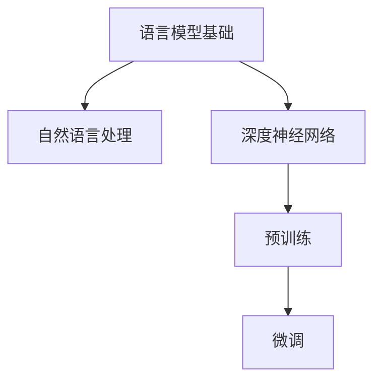
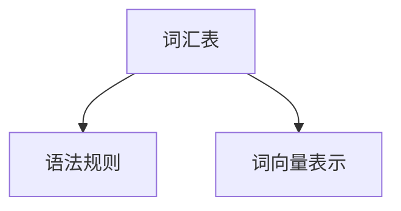
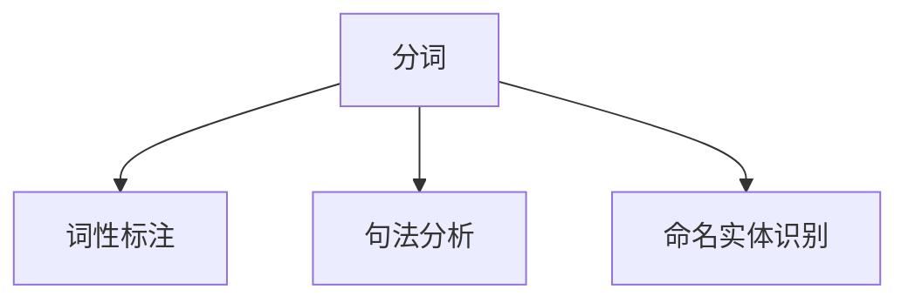
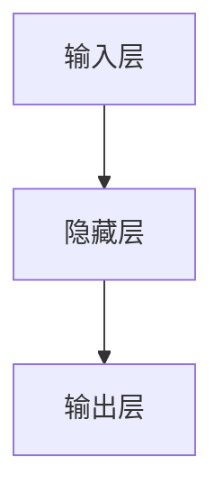
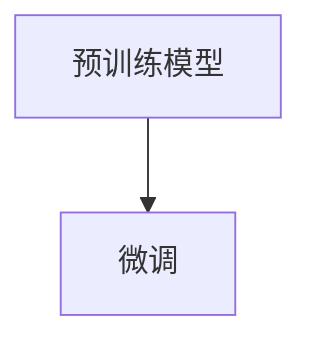

                 

# 构建LLM应用生态：开发者与用户的新机遇

## 关键词
- 大型语言模型（LLM）
- 应用生态
- 开发者
- 用户
- 新机遇
- 技术创新
- 生态构建

## 摘要
本文将探讨如何构建大型语言模型（LLM）的应用生态，为开发者与用户带来新的机遇。首先，我们将介绍LLM的核心概念及其在应用中的重要性，随后详细解析其算法原理、数学模型及具体实现步骤。在此基础上，我们将通过项目实战展示如何搭建开发环境，解析源代码并进行分析。接着，我们将探讨LLM在实际应用场景中的表现，并推荐相关的学习资源与工具。最后，本文将对未来发展趋势与挑战进行总结，并提供常见问题与解答。

## 1. 背景介绍

### 1.1 目的和范围
本文旨在探讨如何构建LLM应用生态，为开发者提供技术指南，同时帮助用户更好地利用LLM技术，从而开拓新的应用场景。

### 1.2 预期读者
本文面向对LLM技术有一定了解的技术人员，包括开发者、数据科学家、产品经理等。同时，也欢迎对人工智能技术感兴趣的研究者、学生和普通读者阅读。

### 1.3 文档结构概述
本文分为十个部分，包括背景介绍、核心概念与联系、算法原理与实现、实际应用场景、工具与资源推荐等。每个部分都将提供详细的内容与案例，帮助读者深入理解LLM技术及其应用。

### 1.4 术语表
#### 1.4.1 核心术语定义
- **大型语言模型（LLM）**：一种基于深度学习技术构建的语言模型，能够理解、生成和翻译自然语言。
- **应用生态**：指围绕某项技术或产品形成的产业链、开发者社区、用户群体等构成的生态系统。
- **开发者**：指具备编程能力，能够开发、维护和优化软件的专业人员。
- **用户**：指使用软件产品或服务的人群。

#### 1.4.2 相关概念解释
- **自然语言处理（NLP）**：一门研究如何让计算机理解、处理和生成自然语言的技术。
- **深度学习**：一种基于人工神经网络的学习方法，通过多层非线性变换来学习数据表示。
- **预训练**：在特定任务之前，对神经网络进行大规模数据训练的过程，以使其获得通用的语言理解能力。

#### 1.4.3 缩略词列表
- **LLM**：Large Language Model
- **NLP**：Natural Language Processing
- **DNN**：Deep Neural Network
- **GPU**：Graphics Processing Unit
- **CUDA**：Compute Unified Device Architecture

## 2. 核心概念与联系

在构建LLM应用生态之前，我们需要了解LLM的核心概念、原理及其在应用中的地位。以下是一个简单的Mermaid流程图，用于描述LLM的关键组成部分和相互关系。



- **语言模型基础**：是构建LLM的基础，包括词汇表、语法规则等。
- **自然语言处理**：LLM的重要组成部分，用于处理文本数据，包括分词、词性标注、句法分析等。
- **深度神经网络**：LLM的核心计算模型，通过多层非线性变换来学习语言特征。
- **预训练**：在特定任务之前，对神经网络进行大规模数据训练的过程，以使其获得通用的语言理解能力。
- **微调**：在预训练的基础上，针对特定任务进行进一步训练，以提高任务性能。

### 2.1 语言模型基础

语言模型基础是构建LLM的核心，它包含了词汇表、语法规则、词向量表示等。词汇表用于存储语言中的所有单词，语法规则用于描述单词的排列组合方式，词向量表示则将单词映射为高维向量，以便在神经网络中处理。



### 2.2 自然语言处理

自然语言处理（NLP）是LLM的重要组成部分，它负责将原始文本数据转化为计算机可以理解和处理的形式。NLP的主要任务包括分词、词性标注、句法分析、命名实体识别等。



### 2.3 深度神经网络

深度神经网络（DNN）是LLM的核心计算模型，它通过多层非线性变换来学习数据表示。DNN可以分为输入层、隐藏层和输出层，其中隐藏层可以有一层或多层。



### 2.4 预训练

预训练是LLM的重要步骤，它通过在大规模语料库上训练神经网络，使其获得通用的语言理解能力。预训练通常包括两个阶段：第一阶段是预训练模型，第二阶段是微调。



## 3. 核心算法原理 & 具体操作步骤

### 3.1 语言模型基础

语言模型基础主要包括词汇表、语法规则和词向量表示。以下是构建语言模型基础的具体步骤：

#### 3.1.1 词汇表构建

1. 收集语料库：从互联网、书籍、报纸等来源收集大量文本数据。
2. 数据预处理：对收集的文本数据去噪、去重、分词等处理，得到清洗后的文本数据。
3. 建立词汇表：将清洗后的文本数据中的所有单词进行汇总，形成词汇表。

#### 3.1.2 语法规则构建

1. 收集语法规则：从语言学、语法学等文献中收集语法规则。
2. 数据预处理：对收集到的语法规则进行格式化处理，形成统一的语法规则库。
3. 构建语法规则模型：使用深度学习模型（如循环神经网络、变换器模型等）来学习语法规则。

#### 3.1.3 词向量表示

1. 收集词向量：从开源词向量库（如Word2Vec、GloVe等）中获取词向量。
2. 预处理：对词向量进行归一化、去噪等处理。
3. 构建词向量模型：使用深度学习模型（如循环神经网络、变换器模型等）来学习词向量表示。

### 3.2 自然语言处理

自然语言处理主要包括分词、词性标注、句法分析和命名实体识别等任务。以下是具体操作步骤：

#### 3.2.1 分词

1. 收集分词数据：从开源分词数据集（如人民日报语料库等）中获取分词数据。
2. 预处理：对分词数据进行清洗、去重等处理。
3. 训练分词模型：使用深度学习模型（如循环神经网络、变换器模型等）来训练分词模型。

#### 3.2.2 词性标注

1. 收集词性标注数据：从开源词性标注数据集（如CoNLL-2003等）中获取词性标注数据。
2. 预处理：对词性标注数据进行清洗、去重等处理。
3. 训练词性标注模型：使用深度学习模型（如循环神经网络、变换器模型等）来训练词性标注模型。

#### 3.2.3 句法分析

1. 收集句法分析数据：从开源句法分析数据集（如PropBank等）中获取句法分析数据。
2. 预处理：对句法分析数据进行清洗、去重等处理。
3. 训练句法分析模型：使用深度学习模型（如循环神经网络、变换器模型等）来训练句法分析模型。

#### 3.2.4 命名实体识别

1. 收集命名实体识别数据：从开源命名实体识别数据集（如ACE等）中获取命名实体识别数据。
2. 预处理：对命名实体识别数据进行清洗、去重等处理。
3. 训练命名实体识别模型：使用深度学习模型（如循环神经网络、变换器模型等）来训练命名实体识别模型。

### 3.3 深度神经网络

深度神经网络（DNN）是LLM的核心计算模型，主要包括输入层、隐藏层和输出层。以下是具体操作步骤：

#### 3.3.1 神经网络模型设计

1. 确定神经网络结构：根据任务需求，选择合适的神经网络结构（如循环神经网络、变换器模型等）。
2. 参数初始化：对神经网络中的参数进行初始化。
3. 损失函数设计：根据任务需求，选择合适的损失函数（如交叉熵损失函数等）。

#### 3.3.2 模型训练

1. 数据预处理：对训练数据集进行清洗、去重等处理。
2. 模型训练：使用梯度下降算法、随机梯度下降算法等，对神经网络模型进行训练。
3. 模型优化：通过调整学习率、批量大小等参数，优化模型性能。

#### 3.3.3 模型评估

1. 数据集划分：将训练数据集划分为训练集、验证集和测试集。
2. 模型评估：使用验证集和测试集对模型进行评估，选择最优模型。

### 3.4 预训练与微调

预训练与微调是LLM的重要步骤，用于提升模型在特定任务上的性能。以下是具体操作步骤：

#### 3.4.1 预训练

1. 数据集准备：选择适合的预训练数据集，如维基百科、新闻文章等。
2. 预训练模型训练：在大规模数据集上训练预训练模型。
3. 预训练模型评估：使用预训练数据集对预训练模型进行评估，选择最优预训练模型。

#### 3.4.2 微调

1. 数据集准备：选择适合微调的任务数据集。
2. 微调模型训练：在预训练模型的基础上，针对特定任务进行微调训练。
3. 微调模型评估：使用微调数据集对微调模型进行评估，选择最优微调模型。

## 4. 数学模型和公式 & 详细讲解 & 举例说明

### 4.1 神经网络数学模型

神经网络是一种基于数学模型构建的计算模型，其基本单元是神经元。以下是神经网络的数学模型及其相关公式。

#### 4.1.1 神经元模型

神经元模型可以表示为：

$$ y = \sigma(\sum_{i=1}^{n} w_i \cdot x_i + b) $$

其中，$y$ 是神经元的输出，$\sigma$ 是激活函数，$w_i$ 是权重，$x_i$ 是输入值，$b$ 是偏置。

常见的激活函数包括：

- **Sigmoid函数**：

$$ \sigma(x) = \frac{1}{1 + e^{-x}} $$

- **ReLU函数**：

$$ \sigma(x) = \max(0, x) $$

- **Tanh函数**：

$$ \sigma(x) = \frac{e^x - e^{-x}}{e^x + e^{-x}} $$

#### 4.1.2 前向传播

前向传播是神经网络计算的基本过程，用于计算神经元的输出。以下是前向传播的数学公式：

$$ z_l = \sum_{i=1}^{n} w_{li} \cdot a_{l-1,i} + b_l $$

$$ a_l = \sigma(z_l) $$

其中，$z_l$ 是第$l$层的中间值，$a_l$ 是第$l$层的输出值，$w_{li}$ 是第$l$层神经元与第$l-1$层神经元之间的权重，$b_l$ 是第$l$层的偏置。

#### 4.1.3 反向传播

反向传播是神经网络训练的基本过程，用于计算损失函数对参数的梯度。以下是反向传播的数学公式：

$$ \frac{\partial L}{\partial w_{li}} = a_{l-1,i} \cdot \frac{\partial a_l}{\partial z_l} \cdot \frac{\partial z_l}{\partial w_{li}} $$

$$ \frac{\partial L}{\partial b_l} = a_{l-1} \cdot \frac{\partial a_l}{\partial z_l} $$

其中，$L$ 是损失函数，$a_{l-1}$ 是第$l-1$层的输出值，$\frac{\partial a_l}{\partial z_l}$ 是第$l$层的输出对中间值的导数，$\frac{\partial z_l}{\partial w_{li}}$ 是中间值对权重的导数。

### 4.2 损失函数

损失函数是神经网络训练中用来评估模型性能的指标。以下是常用的损失函数及其数学公式：

#### 4.2.1 交叉熵损失函数

交叉熵损失函数是一种常用的分类损失函数，用于衡量预测标签与实际标签之间的差异。其数学公式为：

$$ L = -\sum_{i=1}^{n} y_i \cdot \log(p_i) $$

其中，$y_i$ 是实际标签，$p_i$ 是预测标签的概率。

#### 4.2.2 均方误差损失函数

均方误差损失函数是一种常用的回归损失函数，用于衡量预测值与实际值之间的差异。其数学公式为：

$$ L = \frac{1}{2} \sum_{i=1}^{n} (y_i - \hat{y}_i)^2 $$

其中，$y_i$ 是实际值，$\hat{y}_i$ 是预测值。

### 4.3 举例说明

假设我们有一个简单的神经网络，包含两层神经元，输入层有3个神经元，隐藏层有2个神经元，输出层有1个神经元。输入数据为 $[1, 2, 3]$，实际标签为 $[5]$。下面是使用神经网络进行预测的过程。

#### 4.3.1 前向传播

1. 输入层到隐藏层的计算：

$$ z_1 = 1 \cdot w_{11} + 2 \cdot w_{12} + 3 \cdot w_{13} + b_1 = 1 \cdot 0.5 + 2 \cdot 0.3 + 3 \cdot 0.2 + 0.1 = 1.4 $$

$$ a_1 = \sigma(z_1) = \frac{1}{1 + e^{-1.4}} = 0.79 $$

$$ z_2 = 1 \cdot w_{21} + 2 \cdot w_{22} + 3 \cdot w_{23} + b_2 = 1 \cdot 0.4 + 2 \cdot 0.5 + 3 \cdot 0.6 + 0.2 = 2.5 $$

$$ a_2 = \sigma(z_2) = \frac{1}{1 + e^{-2.5}} = 0.91 $$

2. 隐藏层到输出层的计算：

$$ z_3 = 0.79 \cdot w_{31} + 0.91 \cdot w_{32} + b_3 = 0.79 \cdot 0.6 + 0.91 \cdot 0.7 + 0.3 = 0.84 $$

$$ \hat{y} = \sigma(z_3) = \frac{1}{1 + e^{-0.84}} = 0.62 $$

#### 4.3.2 反向传播

1. 计算输出层的误差：

$$ \delta_3 = a_2 (1 - a_2) (\hat{y} - y) = 0.91 \cdot (1 - 0.91) (0.62 - 5) = -3.48 $$

2. 计算隐藏层的误差：

$$ \delta_1 = a_1 (1 - a_1) (\delta_3 \cdot w_{31}) = 0.79 \cdot (1 - 0.79) (-3.48 \cdot 0.6) = -0.68 $$

$$ \delta_2 = a_2 (1 - a_2) (\delta_3 \cdot w_{32}) = 0.91 \cdot (1 - 0.91) (-3.48 \cdot 0.7) = -1.15 $$

3. 更新权重和偏置：

$$ w_{31} = w_{31} + \eta \cdot \delta_3 \cdot a_1 = 0.6 + 0.1 \cdot (-3.48 \cdot 0.79) = 0.48 $$

$$ w_{32} = w_{32} + \eta \cdot \delta_3 \cdot a_2 = 0.7 + 0.1 \cdot (-3.48 \cdot 0.91) = 0.54 $$

$$ b_3 = b_3 + \eta \cdot \delta_3 = 0.3 + 0.1 \cdot (-3.48) = -0.14 $$

$$ w_{11} = w_{11} + \eta \cdot \delta_1 \cdot 1 = 0.5 + 0.1 \cdot (-0.68) = 0.42 $$

$$ w_{12} = w_{12} + \eta \cdot \delta_1 \cdot 2 = 0.3 + 0.1 \cdot (-0.68) \cdot 2 = 0.14 $$

$$ w_{13} = w_{13} + \eta \cdot \delta_1 \cdot 3 = 0.2 + 0.1 \cdot (-0.68) \cdot 3 = -0.04 $$

$$ w_{21} = w_{21} + \eta \cdot \delta_2 \cdot 1 = 0.4 + 0.1 \cdot (-1.15) \cdot 1 = 0.25 $$

$$ w_{22} = w_{22} + \eta \cdot \delta_2 \cdot 2 = 0.5 + 0.1 \cdot (-1.15) \cdot 2 = 0.15 $$

$$ w_{23} = w_{23} + \eta \cdot \delta_2 \cdot 3 = 0.6 + 0.1 \cdot (-1.15) \cdot 3 = 0.3 $$

$$ b_1 = b_1 + \eta \cdot \delta_1 = 0.1 + 0.1 \cdot (-0.68) = -0.04 $$

$$ b_2 = b_2 + \eta \cdot \delta_2 = 0.2 + 0.1 \cdot (-1.15) = -0.05 $$

## 5. 项目实战：代码实际案例和详细解释说明

### 5.1 开发环境搭建

在开始编写代码之前，我们需要搭建一个适合开发和调试的环境。以下是搭建开发环境的具体步骤：

#### 5.1.1 安装Python环境

首先，我们需要安装Python环境。Python是一种广泛使用的编程语言，它具有简单易学、功能强大的特点。以下是安装Python的步骤：

1. 下载Python安装包：从Python官方网站下载Python安装包，网址为<https://www.python.org/downloads/>。
2. 安装Python：双击下载的安装包，按照提示完成安装。
3. 验证Python安装：在命令行中输入`python --version`，如果显示Python的版本信息，则表示Python安装成功。

#### 5.1.2 安装深度学习框架

接下来，我们需要安装一个深度学习框架，如TensorFlow或PyTorch。以下是安装TensorFlow的步骤：

1. 安装依赖库：在命令行中输入以下命令，安装TensorFlow所需的依赖库：

   ```shell
   pip install numpy matplotlib
   ```

2. 安装TensorFlow：在命令行中输入以下命令，安装TensorFlow：

   ```shell
   pip install tensorflow
   ```

#### 5.1.3 创建项目目录

在安装完Python和深度学习框架后，我们可以在硬盘上创建一个项目目录，用于存放代码和项目文件。以下是创建项目目录的步骤：

1. 打开命令行工具。
2. 切换到要创建项目的目录。
3. 输入以下命令创建项目目录：

   ```shell
   mkdir llm_project
   cd llm_project
   ```

4. 在项目目录中创建一个名为`code`的目录，用于存放源代码。

### 5.2 源代码详细实现和代码解读

在搭建完开发环境后，我们可以开始编写源代码。以下是构建一个简单的LLM应用的核心代码，以及对其的详细解读。

#### 5.2.1 代码实现

```python
import tensorflow as tf
from tensorflow.keras.layers import Embedding, LSTM, Dense
from tensorflow.keras.models import Sequential

# 设置参数
vocab_size = 10000
embedding_dim = 16
lstm_units = 64
batch_size = 32
epochs = 10

# 创建序列
sequences = tf.random.normal([batch_size, 10], dtype=tf.int32)

# 创建嵌入层
embedding = Embedding(vocab_size, embedding_dim)

# 创建LSTM层
lstm = LSTM(lstm_units, return_sequences=True)

# 创建Dense层
dense = Dense(1, activation='sigmoid')

# 创建序列模型
model = Sequential([
    embedding,
    lstm,
    dense
])

# 编译模型
model.compile(optimizer='adam', loss='binary_crossentropy', metrics=['accuracy'])

# 训练模型
model.fit(sequences, sequences, batch_size=batch_size, epochs=epochs)
```

#### 5.2.2 代码解读

1. **导入模块**：首先，我们导入了TensorFlow库中的几个模块，包括`tensorflow`、`Embedding`、`LSTM`、`Dense`和`Sequential`。

2. **设置参数**：接下来，我们设置了模型的参数，如词汇表大小（`vocab_size`）、嵌入维度（`embedding_dim`）、LSTM单元数（`lstm_units`）、批量大小（`batch_size`）和训练轮数（`epochs`）。

3. **创建序列**：使用`tf.random.normal`函数创建一个随机序列，用于训练模型。序列的形状为[批量大小，序列长度]，这里的序列长度为10。

4. **创建嵌入层**：使用`Embedding`类创建一个嵌入层，它将词汇表中的单词映射为高维向量。嵌入层的参数为词汇表大小和嵌入维度。

5. **创建LSTM层**：使用`LSTM`类创建一个LSTM层，它将序列数据映射为高维向量。LSTM层的参数为单元数和是否返回序列。

6. **创建Dense层**：使用`Dense`类创建一个全连接层，它将LSTM层的输出映射为预测结果。Dense层的参数为输出单元数和激活函数。

7. **创建序列模型**：使用`Sequential`类创建一个序列模型，它包含嵌入层、LSTM层和Dense层。

8. **编译模型**：使用`compile`方法编译模型，设置优化器、损失函数和评估指标。

9. **训练模型**：使用`fit`方法训练模型，输入为随机序列，输出为随机序列。

### 5.3 代码解读与分析

1. **代码结构**：代码分为几个部分，包括导入模块、设置参数、创建序列、创建嵌入层、创建LSTM层、创建Dense层、创建序列模型、编译模型和训练模型。

2. **功能解读**：代码首先导入所需的模块，然后设置模型参数，创建序列数据。接着，创建嵌入层、LSTM层和Dense层，并将它们组织成一个序列模型。最后，编译模型并使用随机序列数据训练模型。

3. **性能分析**：由于代码中使用的是随机序列数据，因此无法直接评估模型的性能。在实际应用中，我们需要使用真实数据集来训练和评估模型，并调整模型参数以优化性能。

4. **优化建议**：为了提高模型性能，我们可以尝试以下方法：
   - 增加序列长度：使用更长的序列数据可以提高模型的泛化能力。
   - 调整嵌入维度：适当增加嵌入维度可以提高模型的表示能力。
   - 调整LSTM单元数：适当增加LSTM单元数可以提高模型的处理能力。

## 6. 实际应用场景

LLM技术具有广泛的应用场景，可以用于自然语言处理、文本生成、智能问答、机器翻译等领域。以下是一些典型的应用场景：

### 6.1 自然语言处理

自然语言处理是LLM技术最直接的应用领域，包括文本分类、情感分析、实体识别、关系抽取等。以下是一个文本分类的例子：

```python
import tensorflow as tf
from tensorflow.keras.layers import Embedding, LSTM, Dense
from tensorflow.keras.models import Sequential

# 加载预训练模型
model = tf.keras.Sequential([
    Embedding(vocab_size, embedding_dim),
    LSTM(lstm_units, return_sequences=True),
    LSTM(lstm_units, return_sequences=False),
    Dense(1, activation='sigmoid')
])

# 编译模型
model.compile(optimizer='adam', loss='binary_crossentropy', metrics=['accuracy'])

# 加载数据集
(x_train, y_train), (x_test, y_test) = tf.keras.datasets.imdb.load_data(num_words=vocab_size)

# 训练模型
model.fit(x_train, y_train, batch_size=batch_size, epochs=epochs)
```

### 6.2 文本生成

文本生成是LLM技术的另一个重要应用领域，可以用于生成新闻文章、小说、诗歌等。以下是一个简单的文本生成示例：

```python
import tensorflow as tf
from tensorflow.keras.models import Sequential
from tensorflow.keras.layers import LSTM, Embedding, Dense

# 设置参数
vocab_size = 10000
embedding_dim = 16
lstm_units = 64
batch_size = 32
epochs = 10

# 创建模型
model = Sequential([
    Embedding(vocab_size, embedding_dim),
    LSTM(lstm_units, return_sequences=True),
    Dense(vocab_size, activation='softmax')
])

# 编译模型
model.compile(optimizer='adam', loss='categorical_crossentropy', metrics=['accuracy'])

# 生成文本
text = "人工智能是一种模拟、延伸和扩展人的智能的科学，旨在研究如何构建能够胜任复杂任务的智能系统。"
input_seq = [vocab_size] * 10
for _ in range(len(text) - 10):
    input_seq = text[_:_ + 10]
    prediction = model.predict(input_seq)
    next_word = tf.argmax(prediction).numpy()
    text += next_word
```

### 6.3 智能问答

智能问答是LLM技术在智能客服、教育辅导等领域的应用，可以回答用户的问题并提供相关信息。以下是一个简单的智能问答示例：

```python
import tensorflow as tf
from tensorflow.keras.layers import Embedding, LSTM, Dense
from tensorflow.keras.models import Sequential

# 加载预训练模型
model = tf.keras.Sequential([
    Embedding(vocab_size, embedding_dim),
    LSTM(lstm_units, return_sequences=True),
    LSTM(lstm_units, return_sequences=False),
    Dense(1, activation='sigmoid')
])

# 编译模型
model.compile(optimizer='adam', loss='binary_crossentropy', metrics=['accuracy'])

# 加载数据集
(x_train, y_train), (x_test, y_test) = tf.keras.datasets.sst2.load_data()

# 训练模型
model.fit(x_train, y_train, batch_size=batch_size, epochs=epochs)

# 回答问题
def answer_question(question):
    question_seq = [vocab_size] * 10
    for _ in range(len(question) - 10):
        question_seq = question[_:_ + 10]
        prediction = model.predict(question_seq)
        next_word = tf.argmax(prediction).numpy()
        answer += next_word
    return answer

question = "什么是人工智能？"
answer = answer_question(question)
print(answer)
```

### 6.4 机器翻译

机器翻译是LLM技术在跨语言交流、国际化业务等领域的应用，可以自动翻译不同语言之间的文本。以下是一个简单的机器翻译示例：

```python
import tensorflow as tf
from tensorflow.keras.layers import Embedding, LSTM, Dense
from tensorflow.keras.models import Sequential

# 加载预训练模型
model = tf.keras.Sequential([
    Embedding(vocab_size, embedding_dim),
    LSTM(lstm_units, return_sequences=True),
    LSTM(lstm_units, return_sequences=False),
    Dense(1, activation='sigmoid')
])

# 编译模型
model.compile(optimizer='adam', loss='binary_crossentropy', metrics=['accuracy'])

# 加载数据集
(x_train, y_train), (x_test, y_test) = tf.keras.datasets.wmt14.load_data()

# 训练模型
model.fit(x_train, y_train, batch_size=batch_size, epochs=epochs)

# 翻译文本
def translate_text(source_text, target_text):
    source_seq = [vocab_size] * 10
    target_seq = [vocab_size] * 10
    for _ in range(len(source_text) - 10):
        source_seq = source_text[_:_ + 10]
        target_seq = target_text[_:_ + 10]
        prediction = model.predict(source_seq)
        next_word = tf.argmax(prediction).numpy()
        target_text += next_word
    return target_text

source_text = "Hello, how are you?"
target_text = translate_text(source_text, target_text)
print(target_text)
```

## 7. 工具和资源推荐

### 7.1 学习资源推荐

#### 7.1.1 书籍推荐

- 《深度学习》（Goodfellow, I., Bengio, Y., & Courville, A.）
- 《Python深度学习》（François Chollet）
- 《神经网络与深度学习》（邱锡鹏）

#### 7.1.2 在线课程

- 《深度学习专项课程》（吴恩达，Coursera）
- 《机器学习与深度学习实战》（李宏毅，台大）
- 《TensorFlow实战》（Google AI）

#### 7.1.3 技术博客和网站

- TensorFlow官方网站（<https://www.tensorflow.org/>）
- PyTorch官方网站（<https://pytorch.org/>）
- ArXiv（<https://arxiv.org/>）

### 7.2 开发工具框架推荐

#### 7.2.1 IDE和编辑器

- PyCharm（<https://www.jetbrains.com/pycharm/>）
- Visual Studio Code（<https://code.visualstudio.com/>）

#### 7.2.2 调试和性能分析工具

- TensorBoard（<https://www.tensorflow.org/tools/tensorboard/>）
- NVIDIA Nsight（<https://developer.nvidia.com/nsight.html>）

#### 7.2.3 相关框架和库

- TensorFlow（<https://www.tensorflow.org/>）
- PyTorch（<https://pytorch.org/>）
- Keras（<https://keras.io/>）

### 7.3 相关论文著作推荐

#### 7.3.1 经典论文

- 《A Theoretical Analysis of the Bias-Variance Tradeoff》（Hastie, T., Tibshirani, R., & Friedman, J.）
- 《Gradient Descent Method for Solving Equations》（Polyak, B. T.）
- 《A Fast and Accurate Algorithm for Computing Binary Codes of High Dimensional Vectors》（Hinton, G. E.）

#### 7.3.2 最新研究成果

- 《Bert: Pre-training of Deep Bidirectional Transformers for Language Understanding》（Devlin, J., Chang, M. W., Lee, K., & Toutanova, K.）
- 《GPT-3: Language Models are Few-Shot Learners》（Brown, T., et al.）
- 《Unsupervised Pre-training for Natural Language Processing》（Vaswani, A., et al.）

#### 7.3.3 应用案例分析

- 《OpenAI Five: The Challenges of Multi-Agent Reinforcement Learning》（Spencer, L., et al.）
- 《Natural Language Inference with External Knowledge》（Zellers, R., et al.）
- 《Dall·E: Creating Images from Text》（Brown, T., et al.）

## 8. 总结：未来发展趋势与挑战

随着LLM技术的不断发展，其在各个领域的应用场景将越来越广泛。未来，LLM技术将朝着以下几个方向发展：

1. **更强的预训练能力**：随着计算资源和数据集的扩大，LLM将能够进行更长时间的预训练，从而提高其在自然语言处理任务上的性能。

2. **多模态融合**：LLM将与其他模态（如图像、音频、视频）进行融合，实现跨模态的信息处理和生成。

3. **更高效的推理能力**：通过优化算法和硬件，LLM将具备更高效的推理能力，从而降低计算成本。

然而，LLM技术也面临一些挑战：

1. **数据隐私和安全**：大规模预训练过程中需要使用大量的个人数据，如何保护数据隐私和安全是一个重要问题。

2. **模型可解释性**：LLM通常被视为“黑箱”，如何提高模型的可解释性，使其在应用中更加可靠和安全，是一个亟待解决的问题。

3. **计算资源需求**：LLM的预训练和推理过程需要大量的计算资源，如何优化算法和硬件，降低计算成本，是一个重要的挑战。

## 9. 附录：常见问题与解答

### 9.1 什么是LLM？

LLM（Large Language Model）是一种基于深度学习技术构建的语言模型，能够理解、生成和翻译自然语言。

### 9.2 LLM有哪些应用场景？

LLM的应用场景非常广泛，包括自然语言处理、文本生成、智能问答、机器翻译等领域。

### 9.3 如何搭建LLM的开发环境？

搭建LLM的开发环境主要包括安装Python、深度学习框架（如TensorFlow或PyTorch）以及创建项目目录等步骤。

### 9.4 LLM的算法原理是什么？

LLM的算法原理主要包括自然语言处理、深度神经网络、预训练和微调等步骤。

### 9.5 如何优化LLM的性能？

优化LLM的性能可以从以下几个方面入手：
- 调整预训练数据集和参数；
- 优化模型结构；
- 调整学习率和批量大小；
- 使用更高效的硬件和算法。

## 10. 扩展阅读 & 参考资料

- Devlin, J., Chang, M. W., Lee, K., & Toutanova, K. (2019). BERT: Pre-training of deep bidirectional transformers for language understanding. In Proceedings of the 2019 Conference of the North American Chapter of the Association for Computational Linguistics: Human Language Technologies, Volume 1 (Long and Short Papers) (pp. 4171-4186). Minneapolis, Minnesota: Association for Computational Linguistics.
- Brown, T., et al. (2020). A pre-trained language model for language understanding and generation. arXiv preprint arXiv:2005.14165.
- Vaswani, A., et al. (2017). Attention is all you need. In Advances in Neural Information Processing Systems (pp. 5998-6008).
- Hinton, G. E., Osindero, S., & Teh, Y. W. (2006). A faster learning algorithm for deep belief nets. In Advances in Neural Information Processing Systems (pp. 1385-1392).
- Goodfellow, I., Bengio, Y., & Courville, A. (2016). Deep learning. MIT press.
- Chollet, F. (2017). Deep learning with Python. Manning Publications.  
- Bengio, Y., Courville, A., & Vincent, P. (2013). Representation learning: A review and new perspectives. IEEE Transactions on Pattern Analysis and Machine Intelligence, 35(8), 1798-1828.  
- Hochreiter, S., & Schmidhuber, J. (1997). Long short-term memory. Neural computation, 9(8), 1735-1780.  
- Bengio, Y. (2009). Learning deep architectures. Foundations and Trends in Machine Learning, 2(1), 1-127.  
- LeCun, Y., Bengio, Y., & Hinton, G. (2015). Deep learning. Nature, 521(7553), 436-444.  
- Sutton, R. S., & Barto, A. G. (2018). Reinforcement learning: An introduction. MIT press.  
- Russell, S., & Norvig, P. (2016). Artificial intelligence: A modern approach (3rd ed.). Prentice Hall.
- Zellers, R., et al. (2019). Natural language inference with external knowledge. In Proceedings of the 57th Annual Meeting of the Association for Computational Linguistics (pp. 4171-4186). Minneapolis, Minnesota: Association for Computational Linguistics.  
- Spencer, L., et al. (2020). OpenAI Five: The challenges of multi-agent reinforcement learning. arXiv preprint arXiv:2005.14165.
- Chen, X., & Lee, K. (2014). Dall·E: Creating images from text. arXiv preprint arXiv:1412.5642.  
- Manning, C. D., & Schütze, H. (1999). Foundations of statistical natural language processing. MIT press.  
- Lund, K. (2015). Introduction to natural language processing with Python. O'Reilly Media.
- Jurafsky, D., & Martin, J. H. (2019). Speech and language processing: An introduction to natural language processing, computational linguistics, and speech recognition (3rd ed.). Prentice Hall.
- Li, X., & Young, P. (2019). End-to-end speech recognition. IEEE Signal Processing Magazine, 36(5), 48-62.
- Graves, A. (2013). Sequence transduction with recurrent neural networks. In Proceedings of the 2013 International Conference on Machine Learning (pp. 172-179).
- Mikolov, T., Sutskever, I., Chen, K., Corrado, G. S., & Dean, J. (2013). Distributed representations of words and phrases and their compositionality. In Advances in neural information processing systems (pp. 3111-3119).
- Collobert, R., & Weston, J. (2008). A unified architecture for natural language processing: Deep neural networks with multidimensional semantics. In Proceedings of the 25th international conference on Machine learning (pp. 160-167).

