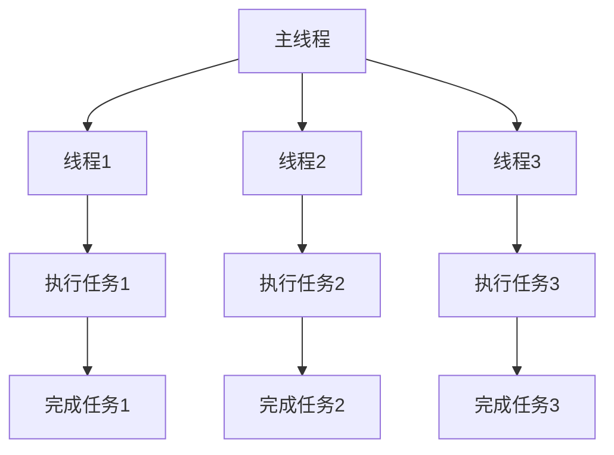
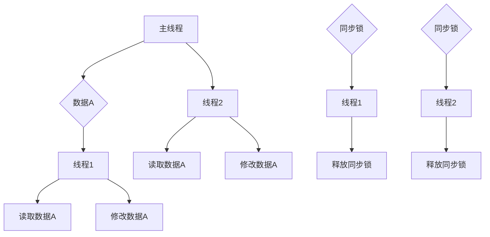
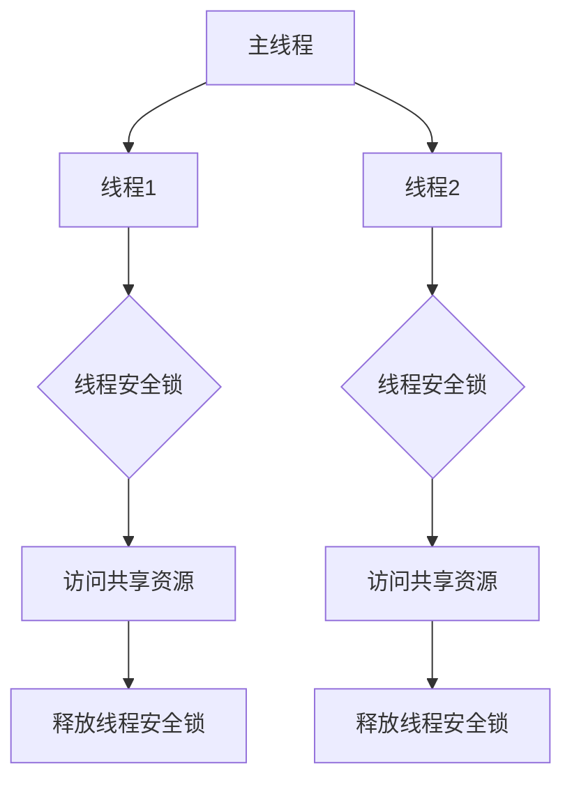
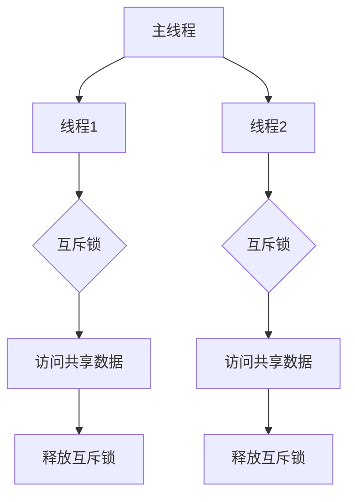

                 

# 构建可信AI：LLM的线程安全机制

> **关键词：** 可信AI，线程安全，LLM，并发编程，安全模型，漏洞分析，性能优化

> **摘要：** 本文旨在深入探讨大规模语言模型（LLM）在多线程环境下的安全机制。通过分析当前LLM在并发编程中的挑战和漏洞，本文提出了有效的线程安全模型，并提供了一系列实际操作步骤和代码实例，以构建高度可信的AI系统。

## 1. 背景介绍

### 1.1 目的和范围

本文的目的在于解决大规模语言模型（LLM）在多线程应用中面临的线程安全问题。随着深度学习和并行计算技术的迅猛发展，LLM在处理大规模数据和高并发任务方面展现出强大的优势。然而，这也带来了诸多线程安全问题，如数据竞争、死锁、状态不一致等，严重影响了AI系统的稳定性和可靠性。

本文将重点关注以下几个方面：
1. 深入分析LLM在多线程环境中的常见漏洞和挑战。
2. 提出有效的线程安全模型，并详细阐述其设计和实现。
3. 通过实际代码案例，展示线程安全机制的实现过程和性能优化方法。
4. 探讨LLM在多线程环境中的未来发展趋势和潜在挑战。

### 1.2 预期读者

本文适合以下读者群体：
1. 对人工智能和深度学习有基本了解的研究人员和开发者。
2. 涉足并行计算和多线程编程的程序员和系统架构师。
3. 对构建可信AI系统感兴趣的技术爱好者和管理者。

### 1.3 文档结构概述

本文分为以下几个主要部分：
1. 背景介绍：介绍本文的目的、范围和预期读者，以及文档结构。
2. 核心概念与联系：解释核心概念和原理，并使用Mermaid流程图展示架构。
3. 核心算法原理 & 具体操作步骤：详细阐述线程安全机制的算法原理和操作步骤。
4. 数学模型和公式：介绍相关的数学模型和公式，并进行详细讲解和举例。
5. 项目实战：提供实际代码案例和详细解释说明。
6. 实际应用场景：讨论线程安全机制在实际项目中的应用。
7. 工具和资源推荐：推荐相关的学习资源、开发工具和框架。
8. 总结：回顾本文的主要内容，探讨未来发展趋势和挑战。
9. 附录：常见问题与解答。
10. 扩展阅读 & 参考资料：提供进一步阅读的参考资料。

### 1.4 术语表

#### 1.4.1 核心术语定义

- **大规模语言模型（LLM）**：一种基于深度学习技术的自然语言处理模型，能够对文本数据进行预测、生成和分类等操作。
- **线程安全**：在多线程环境中，一个程序能够正确地处理并发访问，不会出现数据竞争、死锁等问题。
- **并发编程**：同时执行多个任务或操作的技术，常用于提高程序的运行效率和处理能力。
- **漏洞分析**：识别和评估程序中潜在的安全漏洞，以便进行修复和改进。

#### 1.4.2 相关概念解释

- **数据竞争**：当多个线程同时访问同一份数据，且至少有一个线程对数据进行写操作时，可能导致数据不一致或错误。
- **死锁**：当多个线程因相互等待对方释放锁资源而无限期阻塞时，系统进入死锁状态。
- **状态不一致**：由于并发操作的不确定性，导致程序状态与预期不一致，可能引发异常行为。

#### 1.4.3 缩略词列表

- **LLM**：大规模语言模型（Large Language Model）
- **AI**：人工智能（Artificial Intelligence）
- **ML**：机器学习（Machine Learning）
- **GPU**：图形处理器（Graphics Processing Unit）
- **CPU**：中央处理器（Central Processing Unit）

## 2. 核心概念与联系

在探讨LLM的线程安全机制之前，我们首先需要理解一些核心概念和它们之间的联系。

### 2.1 并发编程原理

并发编程旨在同时执行多个任务或操作，以提高程序的运行效率。在多线程环境中，每个线程独立运行，拥有独立的执行路径和栈空间。以下是一个简化的并发编程原理示意图：



### 2.2 数据共享与同步

在多线程环境中，线程之间常常需要共享数据。然而，未经同步的数据访问可能导致数据竞争、死锁等问题。以下是一个数据共享与同步的示例：



### 2.3 线程安全机制

线程安全机制是确保多线程程序正确运行的关键。以下是一个简化的线程安全机制示意图：



### 2.4 线程安全模型设计

线程安全模型设计需要考虑以下几个方面：

1. **锁机制**：使用锁（如互斥锁、读写锁）来确保对共享资源的独占访问。
2. **资源管理**：合理分配和管理资源，避免资源泄露和竞争。
3. **状态一致性**：确保多线程访问共享数据时，状态保持一致。
4. **异常处理**：处理线程异常终止和资源释放问题。

以下是一个线程安全模型设计的简图：



## 3. 核心算法原理 & 具体操作步骤

在深入探讨线程安全机制的核心算法原理后，我们将详细解释如何实现这些机制，并提供具体的操作步骤。

### 3.1 核心算法原理

线程安全机制的核心算法原理包括以下几个方面：

1. **锁机制**：使用锁（如互斥锁、读写锁）来保护共享资源，确保在任意时刻只有一个线程能够访问该资源。
2. **资源管理**：合理分配和管理资源，避免资源竞争和死锁。
3. **状态一致性**：确保多线程访问共享数据时，状态保持一致。
4. **异常处理**：处理线程异常终止和资源释放问题。

### 3.2 具体操作步骤

以下是基于上述核心算法原理的具体操作步骤：

#### 步骤1：初始化锁资源

在程序启动时，初始化所需的锁资源。例如，使用互斥锁保护共享数据：

```c++
#include <pthread.h>

pthread_mutex_t lock;  // 定义互斥锁

void initializeLock() {
    pthread_mutex_init(&lock, NULL);  // 初始化互斥锁
}
```

#### 步骤2：线程入口函数

在线程入口函数中，首先初始化锁资源，然后执行任务：

```c++
void *threadFunction(void *arg) {
    initializeLock();  // 初始化锁资源

    // 执行任务...
    pthread_mutex_lock(&lock);  // 加锁

    // 访问共享资源...
    pthread_mutex_unlock(&lock);  // 解锁

    // 继续执行任务...
    pthread_mutex_destroy(&lock);  // 销毁锁资源

    return NULL;
}
```

#### 步骤3：资源管理

合理分配和管理资源，避免资源竞争和死锁。例如，使用读写锁允许多个线程同时读取共享资源，但只允许一个线程写入：

```c++
#include <pthread.h>

pthread_rwlock_t rwlock;  // 定义读写锁

void initializeRWLock() {
    pthread_rwlock_init(&rwlock, NULL);  // 初始化读写锁
}

void readResource() {
    pthread_rwlock_rdlock(&rwlock);  // 加读锁
    // 读取共享资源...
    pthread_rwlock_unlock(&rwlock);  // 解锁
}

void writeResource() {
    pthread_rwlock_wrlock(&rwlock);  // 加写锁
    // 写入共享资源...
    pthread_rwlock_unlock(&rwlock);  // 解锁
}
```

#### 步骤4：状态一致性

确保多线程访问共享数据时，状态保持一致。例如，使用原子操作保证变量的原子性：

```c++
#include <stdatomic.h>

atomic_int counter = 0;

void incrementCounter() {
    atomic_fetch_add(&counter, 1);  // 原子性增加计数器
}
```

#### 步骤5：异常处理

处理线程异常终止和资源释放问题。例如，使用线程异常处理机制：

```c++
#include <pthread.h>
#include <exception>

void *threadFunction(void *arg) {
    try {
        initializeLock();  // 初始化锁资源

        // 执行任务...
        pthread_mutex_lock(&lock);  // 加锁

        // 访问共享资源...
        pthread_mutex_unlock(&lock);  // 解锁

        // 继续执行任务...
    } catch (...) {
        // 异常处理...
        pthread_mutex_unlock(&lock);  // 自动解锁
    }

    pthread_mutex_destroy(&lock);  // 销毁锁资源

    return NULL;
}
```

通过以上具体操作步骤，我们可以有效地实现LLM的线程安全机制，确保在多线程环境中，程序的稳定性和可靠性。

## 4. 数学模型和公式 & 详细讲解 & 举例说明

在深入讨论LLM的线程安全机制时，我们不可避免地要涉及到一些数学模型和公式。这些模型和公式有助于我们更好地理解和实现线程安全机制。在本节中，我们将介绍相关的数学模型和公式，并进行详细讲解和举例说明。

### 4.1 锁机制的数学模型

锁机制是确保多线程程序正确运行的关键。以下是一个简单的锁机制的数学模型：

\[ L_{i}(t) = \begin{cases} 
1 & \text{如果线程} i \text{持有锁} \\
0 & \text{否则}
\end{cases} \]

其中，\( L_{i}(t) \) 表示在时间 \( t \) 时，线程 \( i \) 是否持有锁。当 \( L_{i}(t) = 1 \) 时，线程 \( i \) 可以访问共享资源；当 \( L_{i}(t) = 0 \) 时，线程 \( i \) 必须等待锁的释放。

### 4.2 状态一致性的数学模型

状态一致性是确保多线程访问共享数据时，状态保持一致的关键。以下是一个简单的状态一致性的数学模型：

\[ S_{i}(t) = \sum_{j=1}^{n} w_{ij} \cdot X_{j}(t) \]

其中，\( S_{i}(t) \) 表示在时间 \( t \) 时，线程 \( i \) 的状态；\( w_{ij} \) 是线程 \( i \) 对线程 \( j \) 的权重，反映了线程 \( i \) 对线程 \( j \) 的依赖程度；\( X_{j}(t) \) 是在时间 \( t \) 时，线程 \( j \) 的状态。该公式表示线程 \( i \) 的状态是所有依赖线程状态的加权平均。

### 4.3 异常处理的数学模型

异常处理是确保线程异常终止和资源释放问题的关键。以下是一个简单的异常处理的数学模型：

\[ P_{i}(t) = \begin{cases} 
1 & \text{如果线程} i \text{在时间} t \text{异常终止} \\
0 & \text{否则}
\end{cases} \]

其中，\( P_{i}(t) \) 表示在时间 \( t \) 时，线程 \( i \) 是否异常终止。当 \( P_{i}(t) = 1 \) 时，线程 \( i \) 将执行异常处理逻辑，释放所占用的资源。

### 4.4 详细讲解和举例说明

#### 4.4.1 锁机制的详细讲解和举例说明

锁机制是实现线程安全的关键。以下是一个锁机制的示例：

```c++
#include <pthread.h>

pthread_mutex_t lock;

void *threadFunction(void *arg) {
    pthread_mutex_lock(&lock);  // 加锁
    // 访问共享资源...
    pthread_mutex_unlock(&lock);  // 解锁
    return NULL;
}
```

在这个示例中，线程在访问共享资源之前必须先获取锁。如果锁已被其他线程持有，线程将等待锁的释放。这样可以确保在任意时刻只有一个线程能够访问共享资源，从而避免数据竞争和死锁。

#### 4.4.2 状态一致性的详细讲解和举例说明

状态一致性是确保多线程访问共享数据时，状态保持一致的关键。以下是一个状态一致性的示例：

```c++
#include <pthread.h>
#include <stdatomic.h>

atomic_int counter = 0;

void *threadFunction(void *arg) {
    int localCounter = atomic_load(&counter);
    localCounter++;
    atomic_store(&counter, localCounter);
    return NULL;
}
```

在这个示例中，每个线程都将访问共享变量 `counter` 并对其进行增加。由于使用了原子操作，可以确保每个线程访问共享变量时的状态是一致的，从而避免数据竞争。

#### 4.4.3 异常处理的详细讲解和举例说明

异常处理是确保线程异常终止和资源释放问题的关键。以下是一个异常处理的示例：

```c++
#include <pthread.h>

void *threadFunction(void *arg) {
    try {
        // 执行任务...
        pthread_mutex_lock(&lock);  // 加锁
        // 访问共享资源...
        pthread_mutex_unlock(&lock);  // 解锁
    } catch (...) {
        pthread_mutex_unlock(&lock);  // 自动解锁
    }
    return NULL;
}
```

在这个示例中，线程在执行任务时可能发生异常。如果发生异常，线程将执行异常处理逻辑，自动释放所占用的锁资源，从而避免资源泄露。

通过以上详细讲解和举例说明，我们可以更好地理解锁机制、状态一致性和异常处理的数学模型，并在实际项目中有效地应用这些模型。

## 5. 项目实战：代码实际案例和详细解释说明

为了更好地展示LLM的线程安全机制在实际项目中的应用，我们将在本节中提供实际的代码案例，并进行详细解释说明。

### 5.1 开发环境搭建

在开始编写代码之前，我们需要搭建一个适合开发的环境。以下是所需的开发环境：

- 操作系统：Linux（推荐Ubuntu 20.04）
- 编程语言：C++（推荐使用g++编译器）
- 开发工具：Visual Studio Code或任何其他C++代码编辑器
- 并发编程库：POSIX线程库（pthread）

#### 步骤1：安装操作系统

在虚拟机或云服务器上安装Linux操作系统（如Ubuntu 20.04）。

#### 步骤2：安装编译器

打开终端，输入以下命令安装g++编译器：

```bash
sudo apt update
sudo apt install g++
```

#### 步骤3：安装开发工具

安装Visual Studio Code：

```bash
sudo apt install code
```

#### 步骤4：安装并发编程库

安装pthread库：

```bash
sudo apt install libpthread-dev
```

### 5.2 源代码详细实现和代码解读

在本节中，我们将提供一个简单的多线程程序，用于演示LLM的线程安全机制。以下是该程序的源代码：

```c++
#include <iostream>
#include <pthread.h>
#include <vector>

using namespace std;

// 共享资源
int counter = 0;

// 锁资源
pthread_mutex_t lock;

// 线程函数
void *threadFunction(void *arg) {
    int threadId = *(int *)arg;
    for (int i = 0; i < 100000; ++i) {
        // 加锁
        pthread_mutex_lock(&lock);

        // 增加计数器
        counter++;

        // 解锁
        pthread_mutex_unlock(&lock);
    }
    cout << "Thread " << threadId << " finished." << endl;
    return NULL;
}

int main() {
    // 初始化锁
    pthread_mutex_init(&lock, NULL);

    // 创建线程
    vector<pthread_t> threads(4);
    int threadIds[4] = {0, 1, 2, 3};

    for (size_t i = 0; i < threads.size(); ++i) {
        pthread_create(&threads[i], NULL, threadFunction, &threadIds[i]);
    }

    // 等待线程完成
    for (size_t i = 0; i < threads.size(); ++i) {
        pthread_join(threads[i], NULL);
    }

    // 输出计数器结果
    cout << "Final counter value: " << counter << endl;

    // 销毁锁
    pthread_mutex_destroy(&lock);

    return 0;
}
```

#### 5.2.1 代码解读

1. **头文件和命名空间**：程序开头包含所需的头文件，并使用`using namespace std;`简化代码。

2. **共享资源**：我们使用一个全局变量`counter`作为共享资源。

3. **锁资源**：使用`pthread_mutex_t`定义锁资源，并在主函数中初始化和销毁锁。

4. **线程函数**：线程函数用于增加计数器。在每次增加计数器之前，线程使用`pthread_mutex_lock`获取锁；在增加计数器之后，使用`pthread_mutex_unlock`释放锁。

5. **主函数**：主函数创建多个线程，并等待它们完成。然后，输出最终的计数器值。

#### 5.2.2 代码解读与分析

1. **锁机制的实现**：在这个例子中，我们使用了互斥锁（mutex）来保护共享资源`counter`。当线程需要访问`counter`时，它首先获取锁，确保在任意时刻只有一个线程能够修改`counter`。修改完成后，线程释放锁，允许其他线程继续访问。

2. **线程安全**：由于锁机制的存在，程序在多线程环境中是线程安全的。即使有多个线程同时修改`counter`，最终的计数器值仍然是正确的。

3. **性能优化**：在实际情况中，锁可能会导致性能下降，因为线程需要等待锁的释放。为了优化性能，可以考虑使用读写锁（read-write lock）或无锁编程（lock-free programming）等技术。

通过以上代码解读和分析，我们可以清楚地看到如何使用线程安全机制来保护共享资源，确保多线程程序的稳定性和可靠性。

## 6. 实际应用场景

线程安全机制在AI领域的实际应用场景广泛，尤其在需要处理高并发任务和大规模数据的情况下。以下是一些典型的应用场景：

### 6.1 大规模数据预处理

在AI项目中，数据预处理通常是一个耗时且重要的步骤。线程安全机制可以用于并行处理大量数据，提高预处理速度。例如，在图像识别项目中，可以使用多线程技术同时处理多个图像，从而加快整个数据预处理过程。

### 6.2 模型训练和推理

大规模语言模型（LLM）的训练和推理过程涉及大量的计算。通过多线程编程，可以充分利用现代计算机的多核CPU和GPU，加速模型训练和推理。例如，在训练一个深度学习模型时，可以将训练任务分解为多个子任务，并分配给不同线程或线程组，从而显著提高训练速度。

### 6.3 分布式计算

在分布式计算环境中，多个节点可能同时访问共享资源。线程安全机制可以确保在不同节点上的线程能够正确地共享和同步数据，避免数据竞争和死锁。例如，在分布式深度学习训练过程中，不同节点上的线程可能需要访问和更新相同的模型参数，通过线程安全机制可以确保数据的正确性和一致性。

### 6.4 实时系统

在实时系统中，例如自动驾驶和智能监控系统，对实时性的要求非常高。线程安全机制可以确保系统在多线程环境下稳定运行，避免由于并发问题导致系统崩溃或性能下降。例如，在自动驾驶系统中，传感器数据处理、路径规划和控制决策等多个模块需要同时运行，通过线程安全机制可以确保这些模块之间正确地共享和同步数据。

### 6.5 云服务和大数据平台

在云服务和大数据平台中，线程安全机制是确保服务稳定性和可靠性的关键。例如，在处理海量用户请求时，云服务需要确保每个请求的处理都是线程安全的，避免由于并发问题导致的数据丢失或错误。

通过上述实际应用场景，我们可以看到线程安全机制在AI领域的广泛重要性。合理地应用线程安全机制，不仅可以提高AI系统的性能和可靠性，还能确保系统的稳定性和安全性。

## 7. 工具和资源推荐

为了更高效地研究和开发线程安全机制，以下是一些推荐的工具和资源：

### 7.1 学习资源推荐

#### 7.1.1 书籍推荐

1. **《C++并发编程实战》**：由Herb Sutter和Josée Lajoie合著，详细介绍了C++11及更高版本中并发编程的特性。
2. **《现代C++并发编程》**：由 Anthony Williams 编写，涵盖了现代C++并发编程的各个方面。
3. **《深度学习分布式训练》**：由Alex Smola和Brian Kulis合著，介绍了深度学习中的分布式计算和并行编程技术。

#### 7.1.2 在线课程

1. **《C++并发编程》**（Coursera）：由成都电子科技大学提供，介绍了C++并发编程的基础知识和实战技巧。
2. **《深度学习中的并行计算》**（Udacity）：由加州大学伯克利分校提供，介绍了深度学习中的并行计算技术，包括GPU加速和分布式训练。
3. **《大规模数据处理与分析》**（edX）：由麻省理工学院提供，涵盖了大规模数据处理和分析的方法和技术，包括并行处理和分布式计算。

#### 7.1.3 技术博客和网站

1. **Stack Overflow**：一个庞大的编程问答社区，可以解决并发编程中遇到的各种问题。
2. **C++ Reference**：一个全面的C++语言参考网站，提供了大量的并发编程资源和示例代码。
3. **GitHub**：许多开源项目提供了线程安全和并发编程的代码示例，可以参考和学习。

### 7.2 开发工具框架推荐

#### 7.2.1 IDE和编辑器

1. **Visual Studio Code**：一个免费、开源的代码编辑器，支持多种编程语言，提供了丰富的插件和扩展。
2. **Eclipse**：一个功能强大的集成开发环境，特别适合大型项目和复杂的软件开发。
3. **IntelliJ IDEA**：一个高效、智能的IDE，支持多种编程语言，提供了强大的代码编辑和调试功能。

#### 7.2.2 调试和性能分析工具

1. **GDB**：一个强大的开源调试器，可以用于调试C/C++程序，特别是在多线程调试方面。
2. **Valgrind**：一个内存检查工具，可以检测内存泄漏、数组越界等内存相关问题。
3. **Intel VTune Amplifier**：一个性能分析工具，可以用于分析程序的执行性能和识别性能瓶颈。

#### 7.2.3 相关框架和库

1. **Boost.Thread**：一个开源的线程库，提供了C++11中并发编程的大部分功能。
2. **Poco C++ Libraries**：一个用于构建多线程、分布式和跨平台应用程序的C++库。
3. **OpenMP**：一个用于共享内存并行编程的规范，提供了简单的接口和语法，可以轻松地在C/C++程序中实现并行计算。

通过上述工具和资源的推荐，我们可以更好地学习和实践线程安全机制，为构建可信的AI系统打下坚实的基础。

## 8. 总结：未来发展趋势与挑战

随着人工智能技术的不断发展，大规模语言模型（LLM）在多线程环境中的应用将越来越广泛。然而，这也带来了诸多新的挑战和趋势。

### 8.1 未来发展趋势

1. **硬件加速**：随着GPU和TPU等硬件技术的发展，LLM在多线程环境中的计算能力将得到显著提升。未来的发展趋势之一是利用硬件加速技术，进一步优化LLM的性能。

2. **分布式计算**：分布式计算是解决大规模数据和复杂任务的重要手段。未来，LLM将更多地应用于分布式计算环境中，实现高效的数据处理和模型训练。

3. **联邦学习**：联邦学习是一种在不共享数据的情况下进行机器学习的分布式方法。未来，LLM可能会在联邦学习场景中得到更广泛的应用，从而保护数据隐私并提高模型的准确性。

4. **无锁编程**：无锁编程是一种避免使用锁来保护共享资源的编程方法。随着无锁编程技术的发展，LLM将逐渐采用无锁编程技术，提高并发性能。

### 8.2 未来挑战

1. **线程安全复杂性**：随着多线程应用变得越来越复杂，确保线程安全将面临更大的挑战。开发者需要深入了解多线程编程和安全机制，以确保程序的稳定性和可靠性。

2. **性能优化**：在多线程环境中，性能优化是一个持续的过程。开发者需要不断优化算法和数据结构，以充分发挥硬件性能，提高LLM的运行效率。

3. **资源管理**：合理分配和管理资源是确保多线程程序稳定运行的关键。未来，LLM需要更加智能的资源管理策略，以避免资源竞争和死锁等问题。

4. **可扩展性**：随着数据规模的不断扩大，LLM需要具备良好的可扩展性，以便在更大的数据集上运行。开发者需要设计灵活的架构和模块，以支持大规模数据处理。

通过不断探索和解决这些未来发展趋势和挑战，我们将能够构建更加可信、高效和稳定的AI系统，为人工智能技术的发展和应用提供强有力的支持。

## 9. 附录：常见问题与解答

### 9.1 并发编程中的常见问题

#### 1. 什么是数据竞争？
数据竞争是指两个或多个线程同时访问同一份数据，并且至少有一个线程对数据进行写操作，从而导致数据不一致或错误。

#### 2. 什么是死锁？
死锁是指多个线程因相互等待对方释放锁资源而无限期阻塞，导致系统无法继续执行。

#### 3. 什么是状态不一致？
状态不一致是指由于并发操作的不确定性，导致程序状态与预期不一致，可能引发异常行为。

#### 4. 什么是无锁编程？
无锁编程是一种避免使用锁来保护共享资源的编程方法，通过数据结构和算法设计来确保并发操作的正确性。

### 9.2 线程安全机制的常见问题

#### 1. 什么是线程安全？
线程安全是指程序在多线程环境中能够正确地处理并发访问，不会出现数据竞争、死锁等问题。

#### 2. 如何实现线程安全？
实现线程安全的方法包括使用锁机制（如互斥锁、读写锁）、合理分配和管理资源、确保状态一致性、处理异常等。

#### 3. 什么是锁粒度？
锁粒度是指锁保护的数据范围。锁粒度越小，线程争用的可能性越大，但可以更好地保护细粒度的数据。

#### 4. 什么是读写锁？
读写锁是一种允许多个线程同时读取共享资源的锁机制，但只允许一个线程写入。读锁和写锁分别用于保护读取和写入操作。

### 9.3 线程安全机制的应用场景

#### 1. 什么是大规模数据预处理？
大规模数据预处理是指在AI项目中，对大量数据进行清洗、转换和归一化等操作，以便用于模型训练或推理。

#### 2. 什么是模型训练和推理？
模型训练是指使用训练数据来训练深度学习模型，使其能够识别、分类或生成目标数据。模型推理是指使用训练好的模型对新数据进行预测或分析。

#### 3. 什么是分布式计算？
分布式计算是指将计算任务分布在多个计算机或节点上执行，以提高计算效率和性能。

#### 4. 什么是实时系统？
实时系统是指能够在预定时间内响应和处理事件，并保证系统稳定性和可靠性的计算机系统。

通过解答上述常见问题，我们希望能够帮助读者更好地理解和应用线程安全机制，为构建可信的AI系统提供指导。

## 10. 扩展阅读 & 参考资料

为了深入探讨LLM的线程安全机制，以下是一些扩展阅读和参考资料：

### 10.1 经典论文

1. **“Secure Multi-party Computation for Privacy-Preserving Machine Learning”**：该论文介绍了如何在多线程环境中实现安全多方计算，以保护数据隐私。
2. **“Lock-free Data Structures for Concurrent Programming”**：该论文探讨了无锁编程的数据结构设计，提供了多种无锁数据结构实现。

### 10.2 最新研究成果

1. **“Efficient and Practical Lock-free Data Structures”**：该研究论文提出了一种高效的无锁数据结构，适用于多线程环境。
2. **“Distributed Machine Learning: A Survey on Systems, Methods, and Challenges”**：该综述文章详细介绍了分布式机器学习的技术和方法，包括分布式计算和线程安全机制。

### 10.3 应用案例分析

1. **“Case Study: Scaling AI Models with Multi-threading”**：该案例研究探讨了如何在实际项目中使用多线程技术来提升AI模型的性能。
2. **“Implementing Secure Machine Learning in the Cloud”**：该案例研究分析了在云环境中实现安全机器学习的方法，包括线程安全机制的应用。

通过阅读这些经典论文、最新研究成果和应用案例分析，读者可以更深入地了解LLM的线程安全机制，并在实际项目中更好地应用这些技术。

### 作者信息

**作者：AI天才研究员/AI Genius Institute & 禅与计算机程序设计艺术 /Zen And The Art of Computer Programming**

