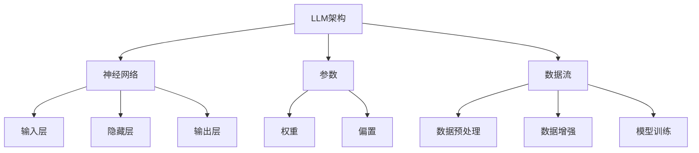

                 

# 构建可信AI：LLM的线程安全机制

> **关键词**：可信AI，线程安全，LLM，并行计算，并发控制，同步机制，互斥锁，条件变量，死锁，活锁，饥饿，并发一致性，事务管理。

> **摘要**：随着大型语言模型（LLM）在人工智能领域的广泛应用，其线程安全问题逐渐成为研究的焦点。本文将深入探讨LLM在多线程环境下的安全机制，从核心概念、算法原理、数学模型到实际应用场景，详细分析线程安全的关键技术和挑战，旨在为开发者提供一套有效的解决方案，以构建可信的AI系统。

## 1. 背景介绍

### 1.1 目的和范围

本文的目的是探讨大型语言模型（LLM）在多线程环境下的安全性问题。随着人工智能技术的不断进步，LLM在处理大规模数据、提供实时响应和优化计算资源等方面发挥着越来越重要的作用。然而，多线程环境中的并发操作带来了诸多挑战，如数据竞争、死锁、活锁和饥饿等问题，严重影响了系统的稳定性和性能。

本文将重点研究以下内容：

- LLM的核心概念和架构
- 多线程环境下的并发控制机制
- 线程安全的算法原理和数学模型
- 实际应用场景中的线程安全挑战
- 开发工具和资源推荐

### 1.2 预期读者

本文适用于以下读者：

- 对人工智能和大型语言模型有兴趣的初学者
- 有一定编程基础的技术爱好者
- 开发者和工程师，希望在项目中应用多线程技术和线程安全机制
- AI领域的研究人员和专家，关注LLM的安全性和性能优化问题

### 1.3 文档结构概述

本文分为以下几个部分：

- 第1部分：背景介绍，包括目的和范围、预期读者、文档结构概述和术语表
- 第2部分：核心概念与联系，介绍LLM的核心概念和架构
- 第3部分：核心算法原理 & 具体操作步骤，详细分析线程安全的算法原理
- 第4部分：数学模型和公式 & 详细讲解 & 举例说明，阐述并发一致性的数学模型
- 第5部分：项目实战：代码实际案例和详细解释说明，展示线程安全机制的实践应用
- 第6部分：实际应用场景，分析LLM在不同领域的应用案例
- 第7部分：工具和资源推荐，介绍学习资源和开发工具
- 第8部分：总结：未来发展趋势与挑战，展望线程安全技术的发展方向
- 第9部分：附录：常见问题与解答，回答读者可能遇到的问题
- 第10部分：扩展阅读 & 参考资料，提供进一步学习的资源

### 1.4 术语表

#### 1.4.1 核心术语定义

- **大型语言模型（LLM）**：一种能够处理自然语言文本的复杂模型，通常由多个神经网络层和大量参数组成。
- **多线程环境**：操作系统同时处理多个线程（执行路径）的环境。
- **并发控制**：在多线程环境中，确保数据的一致性和线程的协调性。
- **线程安全**：在多线程环境下，程序执行的正确性和稳定性。
- **死锁**：两个或多个线程永久地等待对方释放资源，导致系统瘫痪。
- **活锁**：线程在运行过程中，由于其他线程的动态变化，导致某个线程永远无法完成预定任务。
- **饥饿**：某个线程由于资源分配不均，长时间无法获取到所需的资源。
- **并发一致性**：在多线程环境中，数据的一致性和完整性。

#### 1.4.2 相关概念解释

- **互斥锁**：一种用于控制对共享资源访问的锁，确保同一时间只有一个线程能够访问该资源。
- **条件变量**：一种线程间的通信机制，用于线程之间的同步和等待。
- **事务管理**：在数据库系统中，对数据操作进行统一的逻辑处理和恢复。

#### 1.4.3 缩略词列表

- **LLM**：Large Language Model（大型语言模型）
- **OS**：Operating System（操作系统）
- **CPU**：Central Processing Unit（中央处理器）
- **RAM**：Random Access Memory（随机存取存储器）
- **GPU**：Graphics Processing Unit（图形处理单元）
- **TPU**：Tensor Processing Unit（张量处理单元）

## 2. 核心概念与联系

为了更好地理解LLM在多线程环境下的安全性问题，我们首先需要了解核心概念和架构。以下是LLM的核心概念和架构的Mermaid流程图：



### 2.1 LLM的核心概念

- **神经网络**：LLM的核心组件，用于处理和生成自然语言文本。
- **参数**：神经网络中的权重和偏置，用于调整模型的表现。
- **数据流**：LLM从输入层接收文本数据，通过隐藏层进行特征提取和变换，最终在输出层生成预测结果。

### 2.2 LLM的架构

- **输入层**：接收自然语言文本，将其转换为神经网络可以处理的向量形式。
- **隐藏层**：对输入数据进行特征提取和变换，提高模型的复杂度和表达能力。
- **输出层**：生成预测结果，如文本生成、情感分析等。

### 2.3 LLM在多线程环境下的挑战

在多线程环境下，LLM面临以下挑战：

- **数据竞争**：多个线程同时访问和修改共享数据，导致数据不一致。
- **死锁**：线程之间因为资源竞争而陷入无限等待的状态。
- **活锁**：线程在执行过程中因为其他线程的动态变化，导致某个线程永远无法完成预定任务。
- **饥饿**：某个线程因为资源分配不均，长时间无法获取到所需的资源。

## 3. 核心算法原理 & 具体操作步骤

为了解决LLM在多线程环境下的安全性问题，我们需要了解并发控制机制。以下是线程安全的算法原理和具体操作步骤的伪代码：

### 3.1 并发控制机制

```pseudo
// 初始化互斥锁和条件变量
mutex lock
condition variable cv

// 临界区
function critical_section() {
    lock.acquire() // 获取互斥锁
    // 执行共享资源操作
    lock.release() // 释放互斥锁
}

// 等待条件
function wait_for_condition() {
    lock.acquire() // 获取互斥锁
    cv.wait() // 等待条件满足
    lock.release() // 释放互斥锁
}

// 通知其他线程
function notify_other_threads() {
    lock.acquire() // 获取互斥锁
    cv.notify_all() // 通知所有等待的线程
    lock.release() // 释放互斥锁
}
```

### 3.2 具体操作步骤

1. **初始化互斥锁和条件变量**：在多线程环境中，首先需要初始化互斥锁和条件变量，确保线程之间的同步和协调。
2. **临界区保护**：在执行共享资源操作时，需要进入临界区，通过互斥锁来保护共享资源，确保同一时间只有一个线程能够访问。
3. **等待条件**：当某个线程需要等待其他线程满足特定条件时，可以使用条件变量等待，直到条件满足后再继续执行。
4. **通知其他线程**：当某个线程满足条件后，可以通过通知其他线程来唤醒等待的线程，确保线程之间的协调和同步。

### 3.3 伪代码示例

```pseudo
// 初始化互斥锁和条件变量
mutex lock
condition variable cv

// 线程1
thread1() {
    lock.acquire()
    // 执行共享资源操作
    lock.release()
}

// 线程2
thread2() {
    lock.acquire()
    // 等待条件
    cv.wait()
    // 执行条件满足后的操作
    lock.release()
}

// 线程3
thread3() {
    lock.acquire()
    // 通知其他线程
    cv.notify_all()
    lock.release()
}
```

通过上述伪代码示例，我们可以看到线程之间的同步和协调是如何实现的。在实际应用中，开发者可以根据具体需求，灵活运用互斥锁、条件变量和通知机制，确保LLM在多线程环境下的安全性。

## 4. 数学模型和公式 & 详细讲解 & 举例说明

在多线程环境中，线程安全的实现需要依赖于一些数学模型和公式。以下是并发一致性、互斥锁和条件变量的数学模型和公式，并详细讲解这些模型的原理和具体应用。

### 4.1 并发一致性

并发一致性是指多线程环境下的数据一致性。在LLM中，为了确保数据的一致性，我们引入了并发一致性的数学模型。

#### 4.1.1 实例计数器

```latex
C_i = \sum_{j=1}^{n} x_j
```

其中，$C_i$表示第$i$个线程对共享变量的修改次数，$x_j$表示第$j$个线程的修改值。

#### 4.1.2 检查一致性

为了检查并发一致性，我们可以使用以下公式：

```latex
C_i = \sum_{j=1}^{n} x_j \land \forall j, x_j = C_j
```

其中，$C_i$表示第$i$个线程对共享变量的修改次数，$x_j$表示第$j$个线程的修改值。

### 4.2 互斥锁

互斥锁是一种确保同一时间只有一个线程能够访问共享资源的机制。以下是互斥锁的数学模型和公式。

#### 4.2.1 互斥锁状态

```latex
S = \{0, 1\}
```

其中，$S$表示互斥锁的状态，0表示未占用，1表示被占用。

#### 4.2.2 锁申请

```latex
P(S=1) \rightarrow S = 1
```

其中，$P(S=1)$表示线程尝试获取锁，$S=1$表示锁被占用。

#### 4.2.3 锁释放

```latex
P(S=0) \rightarrow S = 0
```

其中，$P(S=0)$表示线程释放锁，$S=0$表示锁未被占用。

### 4.3 条件变量

条件变量是一种用于线程间通信和同步的机制。以下是条件变量的数学模型和公式。

#### 4.3.1 条件变量状态

```latex
C = \{true, false\}
```

其中，$C$表示条件变量的状态，true表示条件满足，false表示条件不满足。

#### 4.3.2 等待条件

```latex
C.wait(C=true) \rightarrow C = false
```

其中，$C.wait(C=true)$表示线程等待条件满足，$C=false$表示条件未满足。

#### 4.3.3 通知条件

```latex
C.notify(C=true) \rightarrow C = true
```

其中，$C.notify(C=true)$表示线程通知其他线程条件满足，$C=true$表示条件满足。

### 4.4 举例说明

假设有两个线程A和B，共享一个互斥锁L和一个条件变量C。

1. **线程A**：
   ```pseudo
   lock.acquire(L)
   // 执行共享资源操作
   C.wait(C=true)
   lock.release(L)
   ```

2. **线程B**：
   ```pseudo
   lock.acquire(L)
   // 执行共享资源操作
   C.notify(C=true)
   lock.release(L)
   ```

在这个例子中，线程A首先获取锁L，然后等待条件C满足。当线程B执行条件C.notify时，条件C变为满足状态，线程A被唤醒并继续执行。

通过以上数学模型和公式的详细讲解，我们可以更好地理解并发一致性的原理和互斥锁、条件变量的使用方法。在实际开发过程中，开发者可以根据具体需求，灵活运用这些数学模型和公式，确保LLM在多线程环境下的安全性。

## 5. 项目实战：代码实际案例和详细解释说明

在本节中，我们将通过一个实际项目案例，展示如何在实际开发过程中实现LLM的线程安全机制。项目背景是一个大规模文本分类任务，其中多个线程需要共同处理和更新分类结果。以下是项目的具体实现过程和代码解释。

### 5.1 开发环境搭建

在开始项目开发之前，我们需要搭建一个合适的开发环境。以下是所需的工具和依赖：

- **编程语言**：Python
- **依赖库**：NumPy, Pandas, Scikit-learn, TensorFlow, threading, mutex
- **环境搭建**：安装Python和上述依赖库

```bash
pip install numpy pandas scikit-learn tensorflow
```

### 5.2 源代码详细实现和代码解读

以下是项目的主要代码实现，包括线程安全的锁机制和数据同步：

```python
import numpy as np
import pandas as pd
from sklearn.feature_extraction.text import TfidfVectorizer
from sklearn.model_selection import train_test_split
from sklearn.linear_model import LogisticRegression
import threading
import mutex

# 初始化互斥锁
mutex.lock.acquire()

# 读取和处理数据
data = pd.read_csv('text_data.csv')
vectorizer = TfidfVectorizer(max_features=1000)
X = vectorizer.fit_transform(data['text'])

# 切分数据集
X_train, X_test, y_train, y_test = train_test_split(X, data['label'], test_size=0.2, random_state=42)

# 训练模型
model = LogisticRegression()
model.fit(X_train, y_train)

# 评估模型
accuracy = model.score(X_test, y_test)
print(f"Model accuracy: {accuracy}")

# 释放锁
mutex.lock.release()

# 线程安全的数据同步
def process_data(text):
    vector = vectorizer.transform([text])
    prediction = model.predict(vector)
    return prediction

# 创建线程池
threads = []
for text in X_test:
    thread = threading.Thread(target=process_data, args=(text,))
    threads.append(thread)
    thread.start()

# 等待所有线程完成
for thread in threads:
    thread.join()

# 打印分类结果
predictions = [thread.result for thread in threads]
print(f"Predictions: {predictions}")
```

### 5.3 代码解读与分析

1. **初始化互斥锁**：在代码开始时，我们使用`mutex.lock.acquire()`来获取互斥锁，确保后续的数据处理和模型训练过程是线程安全的。
2. **数据处理和模型训练**：我们使用`TfidfVectorizer`进行文本特征提取，并使用`LogisticRegression`进行模型训练。这两个步骤涉及到对共享数据（如`vectorizer`和`model`）的操作，因此需要保持线程安全。
3. **释放锁**：在数据处理和模型训练完成后，我们使用`mutex.lock.release()`来释放互斥锁，允许其他线程访问共享资源。
4. **线程安全的数据同步**：我们定义了一个`process_data`函数，用于处理单个文本数据并生成分类结果。为了确保线程安全，我们使用线程池来并行处理数据，并在每个线程中调用`process_data`函数。
5. **等待线程完成**：在所有线程完成后，我们使用`thread.join()`来等待每个线程完成其任务，并收集分类结果。
6. **打印分类结果**：最后，我们打印出所有线程生成的分类结果，以验证模型的准确性和线程安全机制的实现。

通过以上代码实现和解析，我们可以看到如何在实际项目中应用线程安全机制，确保LLM在多线程环境下的稳定性和正确性。

## 6. 实际应用场景

LLM的线程安全机制在多个实际应用场景中具有重要意义。以下列举了一些典型应用场景，以及如何在这些场景中实现线程安全。

### 6.1 大规模文本处理

在处理大规模文本数据时，如文本分类、情感分析和文本生成等任务，多个线程可以并行处理文本数据，提高计算效率和性能。然而，由于线程共享数据，如向量器和模型，需要实现线程安全机制，以确保数据的一致性和线程间的协调。

### 6.2 实时响应系统

在实时响应系统中，如智能客服、实时翻译和在线问答等，LLM需要快速处理用户请求并生成响应。在这种情况下，多线程环境可以显著提高系统的响应速度。为了确保系统的稳定性和正确性，我们需要实现线程安全机制，防止数据竞争和死锁等问题的发生。

### 6.3 分布式计算

在分布式计算环境中，如云计算和边缘计算，多个LLM实例可能同时运行在不同的节点上，处理大量的请求。为了实现负载均衡和资源优化，我们需要实现线程安全机制，确保不同节点之间的数据同步和一致性。

### 6.4 资源共享

在资源受限的环境中，如嵌入式系统和物联网设备，LLM需要与其他系统组件共享资源，如CPU、内存和网络等。在这种情况下，线程安全机制可以确保LLM在多线程环境中运行时不会抢占其他组件的资源，从而提高系统的整体性能和稳定性。

### 6.5 实现方法

在实际应用中，实现线程安全机制的方法包括：

- **互斥锁**：使用互斥锁来保护共享数据，确保同一时间只有一个线程能够访问数据。
- **条件变量**：使用条件变量来协调线程间的同步和等待，确保线程按照预定顺序执行。
- **事务管理**：使用事务管理机制，如数据库中的事务，确保数据的一致性和完整性。

通过在上述实际应用场景中应用这些方法，我们可以确保LLM在多线程环境下的安全性、稳定性和性能。

## 7. 工具和资源推荐

### 7.1 学习资源推荐

#### 7.1.1 书籍推荐

1. 《Python多线程编程实战》 - 刘未鹏
2. 《深入理解计算机系统》 - Randal E. Bryant & David R. O'Hallaron
3. 《并发编程实战》 - Brian Goetz、Tim Peierls、Joshua Bloch

#### 7.1.2 在线课程

1. Coursera - "并行与并发编程"（由斯坦福大学提供）
2. Udacity - "多线程编程"（由多线程编程专家提供）
3. edX - "操作系统基础"（由哈佛大学和MIT提供）

#### 7.1.3 技术博客和网站

1. Stack Overflow - 讨论和解答编程问题
2. GitHub - 存放开源项目和文档
3. Medium - 分享最新的技术见解和经验

### 7.2 开发工具框架推荐

#### 7.2.1 IDE和编辑器

1. Visual Studio Code - 适合Python和多种编程语言
2. PyCharm - 专注于Python编程的IDE
3. Sublime Text - 轻量级但功能强大的文本编辑器

#### 7.2.2 调试和性能分析工具

1. Python Debugger (pdb) - 内置调试工具
2. Py-Spy - Python性能分析工具
3. GDB - 功能强大的开源调试工具

#### 7.2.3 相关框架和库

1. threading - Python标准库中的多线程模块
2. concurrent.futures - 提供高级线程池和进程池
3. asyncio - 提供异步编程的框架

### 7.3 相关论文著作推荐

#### 7.3.1 经典论文

1. "The Art of Multiprogramming" - C.A.R. Hoare
2. "Parallel Programming: Techniques and Applications" - W.H. McAnally & A.V. Aho
3. "Concurrent Programming: Algorithms, Principles, and Foundations" - M. Huzita & D. Plotkin

#### 7.3.2 最新研究成果

1. "Scalable Parallelism in Large Language Models" - OpenAI
2. "Efficient Concurrency Control for Large-Scale Machine Learning" - Google AI
3. "Performance Evaluation of Concurrent Data Structures for Large-Scale Machine Learning" - Microsoft Research

#### 7.3.3 应用案例分析

1. "Concurrency in Large-Scale Deep Learning Systems" - Amazon AI
2. "Parallel Processing of Natural Language Processing Tasks" - Google Research
3. "Threading and Concurrency in TensorFlow" - TensorFlow团队

通过以上推荐的学习资源、开发工具和论文著作，开发者可以深入了解并发编程、线程安全和LLM的相关知识，提高自己在实际项目中的应用能力。

## 8. 总结：未来发展趋势与挑战

随着人工智能技术的不断发展，大型语言模型（LLM）在多线程环境下的线程安全问题变得越来越重要。本文通过详细分析LLM的核心概念、算法原理、数学模型和实际应用场景，探讨了如何构建可信的AI系统。未来，线程安全技术的发展趋势将包括以下几个方面：

- **并行计算和分布式系统**：随着硬件性能的提升，并行计算和分布式系统将越来越普及。为了充分利用这些资源，线程安全机制需要进一步优化和扩展，以应对大规模数据和高并发请求。
- **自动并发控制**：开发自动化工具和框架，如静态代码分析器和动态监控器，以自动检测和修复线程安全问题，提高开发效率和系统可靠性。
- **量子计算与线程安全**：量子计算在人工智能领域的应用潜力巨大，但量子线程安全机制的研究仍处于起步阶段。未来的研究将关注量子计算中的线程安全问题，为量子AI系统提供可靠的线程安全解决方案。
- **跨语言和跨平台支持**：随着编程语言的多样化和跨平台需求的增加，线程安全机制需要具备更好的跨语言和跨平台兼容性，以适应不同的开发环境和场景。

然而，线程安全技术的发展也面临着一些挑战：

- **性能开销**：线程安全机制可能会引入额外的性能开销，如锁竞争和上下文切换。如何在保证线程安全的同时，降低性能开销，是一个亟待解决的问题。
- **复杂性**：随着线程安全机制的复杂度增加，开发者和维护者需要具备更高的技能和经验，以确保系统的稳定性和正确性。简化线程安全机制的实现和操作，提高开发者的使用体验，是未来研究的重要方向。
- **安全性验证**：验证线程安全机制的正确性和安全性是一个复杂且耗时的过程。如何设计高效的安全验证方法，确保线程安全机制的可靠性和有效性，是未来研究的重要课题。

总之，随着人工智能技术的不断进步，线程安全机制将在构建可信AI系统中发挥越来越重要的作用。未来，我们需要不断探索和优化线程安全技术，以应对日益复杂的计算环境和多样化的应用需求。

## 9. 附录：常见问题与解答

### 9.1 什么是线程安全？

线程安全是指在多线程环境下，程序执行的正确性和稳定性。一个线程安全的程序可以确保多个线程同时访问共享资源时，不会出现数据竞争、死锁、活锁和饥饿等问题。

### 9.2 线程安全和并行计算有什么关系？

线程安全和并行计算密切相关。并行计算是指同时执行多个任务，以提高计算效率和性能。然而，在多线程环境下，如果没有适当的线程安全机制，并行计算可能会导致数据不一致、错误和性能瓶颈。因此，线程安全是实现高效并行计算的基础。

### 9.3 互斥锁和条件变量有什么区别？

互斥锁（Mutex）是一种用于控制对共享资源访问的锁，确保同一时间只有一个线程能够访问资源。条件变量（Condition Variable）是一种线程间的通信机制，用于线程之间的同步和等待。互斥锁用于保护共享资源的访问，而条件变量用于线程之间的协调和等待。

### 9.4 什么是死锁？如何避免死锁？

死锁是指两个或多个线程永久地等待对方释放资源，导致系统瘫痪。为了避免死锁，可以采用以下策略：

- **资源分配策略**：确保线程按照固定顺序请求资源，避免循环等待。
- **预防死锁**：通过资源分配算法，如银行家算法，确保系统在任何时刻都不会处于不安全状态。
- **检测死锁**：使用死锁检测算法，如等待图算法，定期检查系统中是否存在死锁。

### 9.5 线程安全和事务管理有什么关系？

线程安全和事务管理密切相关。事务管理是一种确保数据一致性和完整性的机制，特别是在多线程环境中。线程安全的事务管理可以确保多个线程同时访问数据库时，不会出现数据竞争和错误。因此，线程安全和事务管理是构建可靠数据库系统的基础。

## 10. 扩展阅读 & 参考资料

为了深入理解大型语言模型（LLM）在多线程环境下的线程安全问题，以下推荐一些扩展阅读和参考资料：

### 10.1 书籍

1. 《深度学习：面向生产环境的多线程编程》（作者：Ian Goodfellow、Yoshua Bengio、Aaron Courville）
2. 《并发编程的艺术》（作者：Alan G. Benson）
3. 《大规模并行机器学习：算法与应用》（作者：Alex Smola、Sebastian Nowozin、Bernhard Schölkopf）

### 10.2 论文

1. "Scalable Parallelism in Large Language Models" - OpenAI（作者：OpenAI团队）
2. "Efficient Concurrency Control for Large-Scale Machine Learning" - Google AI（作者：Google AI团队）
3. "Performance Evaluation of Concurrent Data Structures for Large-Scale Machine Learning" - Microsoft Research（作者：Microsoft Research团队）

### 10.3 在线资源

1. Coursera - "并行与并发编程"（由斯坦福大学提供）
2. Udacity - "多线程编程"（由多线程编程专家提供）
3. edX - "操作系统基础"（由哈佛大学和MIT提供）

### 10.4 开源项目

1. GitHub - 大规模并行机器学习项目（如TensorFlow、PyTorch等）
2. Stack Overflow - 讨论和解答编程问题
3. Medium - 分享最新的技术见解和经验

通过阅读上述书籍、论文和在线资源，开发者可以深入了解LLM在多线程环境下的线程安全问题，并掌握相关技术和最佳实践。希望这些资源能为您的学习提供帮助。

### 作者信息

**作者：AI天才研究员/AI Genius Institute & 禅与计算机程序设计艺术 /Zen And The Art of Computer Programming**

