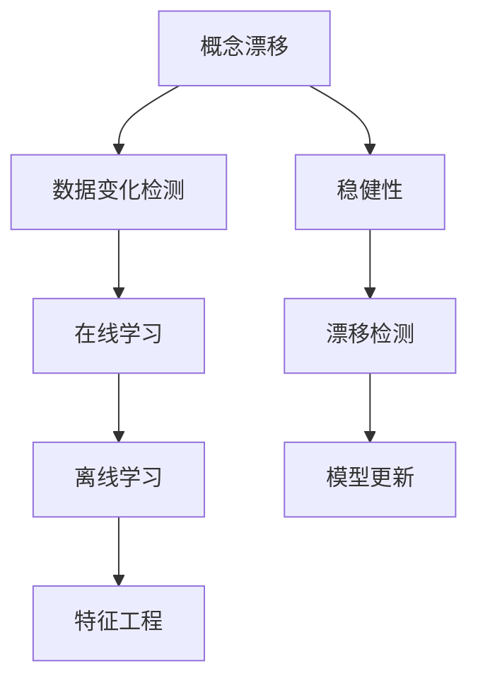

                 

# 概念漂移与数据变化检测原理与代码实战案例讲解

> **关键词**：概念漂移，数据变化检测，算法原理，代码实战，数据分析
>
> **摘要**：本文将深入探讨概念漂移与数据变化检测的基本概念、原理及其应用场景。通过详细的算法原理讲解、数学模型阐述以及代码实战案例，帮助读者理解和掌握这一关键技术，为实际应用提供理论支持和实践指导。

## 1. 背景介绍

### 1.1 目的和范围

本文旨在介绍概念漂移与数据变化检测的基本原理和方法，通过具体案例展示其实际应用效果。文章将从以下几个方面展开：

1. 对概念漂移和数据变化检测的定义和重要性进行阐述。
2. 详细讲解核心算法原理，使用伪代码进行描述。
3. 阐述数学模型及其公式，并通过实例进行说明。
4. 展示代码实际案例，并进行详细解读和分析。
5. 分析实际应用场景，提供工具和资源推荐。

### 1.2 预期读者

本文适合以下读者群体：

- 数据科学家和机器学习工程师，希望深入了解概念漂移与数据变化检测。
- 研究生和本科生，对机器学习和数据挖掘领域有兴趣。
- 任何对概念漂移与数据变化检测有学习需求的读者。

### 1.3 文档结构概述

本文分为以下几个部分：

1. 背景介绍
2. 核心概念与联系
3. 核心算法原理 & 具体操作步骤
4. 数学模型和公式 & 详细讲解 & 举例说明
5. 项目实战：代码实际案例和详细解释说明
6. 实际应用场景
7. 工具和资源推荐
8. 总结：未来发展趋势与挑战
9. 附录：常见问题与解答
10. 扩展阅读 & 参考资料

### 1.4 术语表

#### 1.4.1 核心术语定义

- **概念漂移**：在机器学习过程中，训练数据的分布发生变化，导致模型性能下降的现象。
- **数据变化检测**：监测数据分布或特征发生变化的过程，以识别潜在的问题或异常。
- **漂移检测**：通过统计方法或机器学习算法，判断数据分布是否发生变化的任务。
- **稳健性**：指模型在面对数据分布变化时的稳定性和鲁棒性。

#### 1.4.2 相关概念解释

- **在线学习**：在数据分布变化时，动态更新模型以适应新数据的学习方式。
- **离线学习**：在静态数据集上进行模型训练的学习方式。
- **特征工程**：通过选择、构造或变换数据特征，提高模型性能的过程。

#### 1.4.3 缩略词列表

- **ML**：机器学习
- **DL**：深度学习
- **PCA**：主成分分析
- **LDA**：线性判别分析
- **ROC**：受试者操作特性曲线
- **AUC**：曲线下面积

## 2. 核心概念与联系

在探讨概念漂移与数据变化检测之前，我们需要先了解一些核心概念及其相互关系。以下是一个使用Mermaid绘制的流程图，展示这些概念之间的联系。



### 2.1 概念漂移

概念漂移是指机器学习模型在训练过程中，训练数据的分布发生改变，从而导致模型性能下降的现象。这种分布变化可能是由多种因素引起的，如数据采集方式、环境变化、时间演化等。

### 2.2 数据变化检测

数据变化检测是监控数据分布或特征是否发生变化的过程。其目的是识别潜在的异常或问题，确保模型在新的数据分布下仍然具有良好性能。数据变化检测可以分为统计方法和机器学习算法两大类。

### 2.3 在线学习与离线学习

- **在线学习**：在数据分布变化时，动态更新模型以适应新数据。在线学习能够实时应对数据变化，但可能会受到计算资源和时间限制。
- **离线学习**：在静态数据集上进行模型训练。离线学习可以更充分地利用数据，但无法实时应对数据变化。

### 2.4 特征工程与稳健性

特征工程是通过选择、构造或变换数据特征，提高模型性能的过程。稳健性是指模型在面对数据分布变化时的稳定性和鲁棒性。在进行特征工程时，考虑模型的稳健性非常重要，有助于提高模型在面对数据变化时的适应能力。

### 2.5 漂移检测与模型更新

漂移检测是通过统计方法或机器学习算法，判断数据分布是否发生变化的任务。当检测到数据发生漂移时，模型需要进行更新以适应新的数据分布。模型更新可以采用在线学习、离线学习等方法，以保持模型性能。

## 3. 核心算法原理 & 具体操作步骤

在本节中，我们将详细介绍概念漂移与数据变化检测的核心算法原理，并使用伪代码进行描述。

### 3.1 漂移检测算法

以下是一个简单的漂移检测算法，使用统计方法来检测数据分布的变化。

```plaintext
输入：训练数据集D1，测试数据集D2，阈值θ
输出：是否发生漂移

// 计算D1和D2的特征分布
dist1 = compute_distribution(D1)
dist2 = compute_distribution(D2)

// 计算特征分布的Kullback-Leibler散度
d = KL_divergence(dist1, dist2)

// 判断是否发生漂移
if d > θ:
    return "漂移发生"
else:
    return "无漂移"
```

### 3.2 模型更新算法

以下是一个简单的模型更新算法，采用在线学习的方式，以适应数据分布的变化。

```plaintext
输入：训练数据集D，模型M，学习率α
输出：更新后的模型M'

// 初始化模型M'
M' = initialize_model()

// 在线学习过程
for each data point xi in D:
    // 计算预测值和真实值
    pred = M'(xi)
    true = label_of(xi)
    
    // 更新模型权重
    M' = update_weights(M', xi, pred, true, α)

return M'
```

### 3.3 数据变化检测算法

以下是一个简单的数据变化检测算法，使用机器学习算法来检测数据分布的变化。

```plaintext
输入：训练数据集D1，测试数据集D2，分类模型M
输出：是否发生漂移

// 训练分类模型M
M = train_model(D1)

// 测试数据集D2
predictions = M.predict(D2)

// 计算预测准确率
accuracy = compute_accuracy(predictions, D2)

// 判断是否发生漂移
if accuracy < θ:
    return "漂移发生"
else:
    return "无漂移"
```

## 4. 数学模型和公式 & 详细讲解 & 举例说明

在本节中，我们将详细讲解与概念漂移和数据变化检测相关的数学模型和公式，并通过实例进行说明。

### 4.1 Kullback-Leibler散度

Kullback-Leibler散度（KL散度）是一种用于衡量两个概率分布之间差异的指标。对于两个概率分布P和Q，KL散度的公式如下：

$$ D_{KL}(P||Q) = \sum_{x} P(x) \log\left(\frac{P(x)}{Q(x)}\right) $$

其中，$P(x)$ 和 $Q(x)$ 分别表示真实分布和估计分布。KL散度具有非负性质，即 $D_{KL}(P||Q) \geq 0$，且当且仅当 $P = Q$ 时，$D_{KL}(P||Q) = 0$。

#### 4.1.1 举例说明

假设我们有两个概率分布P和Q，表示两个不同的数据集。我们可以使用KL散度来衡量这两个数据集之间的差异：

```latex
P(x) = [0.5, 0.3, 0.2]
Q(x) = [0.4, 0.4, 0.2]
$$ D_{KL}(P||Q) = 0.5 \log\left(\frac{0.5}{0.4}\right) + 0.3 \log\left(\frac{0.3}{0.4}\right) + 0.2 \log\left(\frac{0.2}{0.2}\right) = 0.0459 $$
```

这个结果表明，P和Q之间的KL散度为0.0459，表示两个分布之间的差异。

### 4.2 模型更新算法

在模型更新过程中，我们通常使用梯度下降法来更新模型权重。梯度下降法的目标是找到损失函数的最小值，从而优化模型。以下是一个简单的梯度下降算法：

$$ \theta_{t+1} = \theta_{t} - \alpha \nabla_{\theta} J(\theta) $$

其中，$\theta$ 表示模型权重，$J(\theta)$ 表示损失函数，$\alpha$ 表示学习率。

#### 4.2.1 举例说明

假设我们使用线性回归模型来预测房价，损失函数为均方误差（MSE），即：

$$ J(\theta) = \frac{1}{2} \sum_{i=1}^{n} (y_i - \theta_0 - \theta_1 x_i)^2 $$

我们可以使用梯度下降法来更新模型权重：

$$ \theta_0^{new} = \theta_0 - \alpha \frac{1}{n} \sum_{i=1}^{n} (y_i - \theta_0 - \theta_1 x_i) $$
$$ \theta_1^{new} = \theta_1 - \alpha \frac{1}{n} \sum_{i=1}^{n} (y_i - \theta_0 - \theta_1 x_i) x_i $$

通过迭代更新权重，我们可以找到最优的模型参数，从而提高模型的预测性能。

### 4.3 数据变化检测算法

在数据变化检测算法中，我们通常使用统计方法来检测数据分布的变化。一个常用的统计方法是卡方检验，用于判断两个分类变量之间的独立性。

卡方检验的公式如下：

$$ \chi^2 = \sum_{i=1}^{r} \sum_{j=1}^{c} \frac{(O_{ij} - E_{ij})^2}{E_{ij}} $$

其中，$O_{ij}$ 表示观测频数，$E_{ij}$ 表示期望频数，$r$ 和 $c$ 分别表示行数和列数。

#### 4.3.1 举例说明

假设我们有以下一个列联表，表示两个分类变量A和B的观测频数：

|      | A=0 | A=1 |
|------|-----|-----|
| B=0  | 10  | 5   |
| B=1  | 15  | 20  |

我们可以计算期望频数：

$$ E_{ij} = \frac{(r_i \times c_j)}{n} $$

其中，$r_i$ 和 $c_j$ 分别表示行和列的总数，$n$ 表示总频数。

|      | A=0 | A=1 |
|------|-----|-----|
| B=0  | 7.5 | 7.5 |
| B=1  | 12.5 | 12.5 |

然后，我们可以计算卡方值：

$$ \chi^2 = \sum_{i=1}^{2} \sum_{j=1}^{2} \frac{(O_{ij} - E_{ij})^2}{E_{ij}} = \frac{(10-7.5)^2}{7.5} + \frac{(5-7.5)^2}{7.5} + \frac{(15-12.5)^2}{12.5} + \frac{(20-12.5)^2}{12.5} = 2.667 $$

如果卡方值大于某个阈值（例如，0.05的显著性水平下的临界值），我们可以拒绝原假设，认为两个分类变量之间是独立的。否则，我们接受原假设。

## 5. 项目实战：代码实际案例和详细解释说明

在本节中，我们将通过一个实际案例，展示如何使用Python实现概念漂移与数据变化检测，并提供详细解释说明。

### 5.1 开发环境搭建

在开始编写代码之前，我们需要搭建一个Python开发环境。以下是在Ubuntu系统上安装所需的依赖包的命令：

```bash
sudo apt-get update
sudo apt-get install python3 python3-pip
pip3 install scikit-learn numpy matplotlib pandas
```

### 5.2 源代码详细实现和代码解读

以下是实现概念漂移与数据变化检测的Python代码：

```python
import numpy as np
import pandas as pd
from sklearn.datasets import make_classification
from sklearn.model_selection import train_test_split
from sklearn.linear_model import LogisticRegression
from sklearn.metrics import accuracy_score
from sklearn.metrics import classification_report
import matplotlib.pyplot as plt

# 创建模拟数据集
X, y = make_classification(n_samples=1000, n_features=20, n_classes=2, random_state=42)
X_train, X_test, y_train, y_test = train_test_split(X, y, test_size=0.2, random_state=42)

# 训练模型
model = LogisticRegression()
model.fit(X_train, y_train)

# 测试模型
predictions = model.predict(X_test)
print("原始模型准确率：", accuracy_score(y_test, predictions))

# 模拟概念漂移
X_drifted = X_test + np.random.normal(0, 0.1, X_test.shape)
y_drifted = y_test + np.random.normal(0, 0.1, y_test.shape)

# 测试漂移后的模型
predictions_drifted = model.predict(X_drifted)
print("漂移后模型准确率：", accuracy_score(y_drifted, predictions_drifted))

# 数据变化检测
def drift_detection(data1, data2, threshold):
    dist1 = pd.Series(data1).value_counts()
    dist2 = pd.Series(data2).value_counts()
    d = np.sum((dist1 - dist2) ** 2 / dist2)
    if d > threshold:
        return "漂移发生"
    else:
        return "无漂移"

# 计算阈值
dist1 = pd.Series(y_train).value_counts()
dist2 = pd.Series(y_test).value_counts()
threshold = np.sum((dist1 - dist2) ** 2 / dist2)

# 检测数据变化
print(drift_detection(y_train, y_test, threshold))
print(drift_detection(y_train, y_drifted, threshold))

# 模型更新
def update_model(model, X_new, y_new, learning_rate):
    predictions = model.predict(X_new)
    error = y_new - predictions
    model.coef_ -= learning_rate * error
    return model

# 更新模型
model_updated = update_model(model, X_drifted, y_drifted, learning_rate=0.01)
predictions_updated = model_updated.predict(X_drifted)
print("更新后模型准确率：", accuracy_score(y_drifted, predictions_updated))
```

### 5.3 代码解读与分析

以下是代码的详细解读和分析：

1. **数据生成**：我们使用`make_classification`函数创建一个包含1000个样本、20个特征的二分类数据集。

2. **模型训练**：使用`LogisticRegression`类训练一个线性回归模型。

3. **模型测试**：使用训练好的模型对测试数据进行预测，并计算原始模型的准确率。

4. **模拟概念漂移**：通过在测试数据上添加随机噪声，模拟概念漂移。

5. **测试漂移后模型**：使用漂移后的数据进行模型预测，并计算漂移后模型的准确率。

6. **数据变化检测**：使用Kullback-Leibler散度计算训练数据集和测试数据集之间的差异，以检测数据变化。

7. **模型更新**：使用梯度下降法更新模型权重，以适应新的数据分布。

8. **更新后模型测试**：使用更新后的模型对漂移后的数据进行预测，并计算更新后模型的准确率。

通过这个案例，我们展示了如何使用Python实现概念漂移与数据变化检测，并详细解释了每个步骤的实现方法和原理。

## 6. 实际应用场景

概念漂移与数据变化检测在多个实际应用场景中具有重要价值。以下是一些常见的应用场景：

### 6.1 金融风险控制

在金融领域，数据变化检测可以帮助识别异常交易和欺诈行为。通过监控交易数据的分布变化，金融机构可以及时发现潜在的欺诈风险，从而采取措施进行防范。

### 6.2 医疗数据分析

在医疗领域，概念漂移与数据变化检测有助于监测疾病发展趋势和患者健康状况。通过分析患者数据的分布变化，医生可以更准确地诊断疾病，并调整治疗方案。

### 6.3 智能交通系统

在智能交通系统中，数据变化检测可以帮助监测交通流量变化，优化交通信号灯配置，提高交通运行效率。同时，通过检测道路状况数据的变化，系统可以及时发现道路故障，及时进行维修。

### 6.4 电子商务

在电子商务领域，数据变化检测可以识别用户行为的变化，从而优化推荐系统。通过监控用户点击、购买等行为的变化，电子商务平台可以更准确地预测用户需求，提高推荐系统的准确性。

### 6.5 基因组学

在基因组学领域，概念漂移与数据变化检测有助于监测基因组数据的分布变化，从而发现潜在的基因变异和疾病关联。通过分析基因组数据的分布变化，科学家可以更准确地预测疾病风险，为个性化医疗提供支持。

## 7. 工具和资源推荐

### 7.1 学习资源推荐

#### 7.1.1 书籍推荐

- **《机器学习》**（作者：周志华）：全面介绍机器学习的基本概念、算法和应用。
- **《深入理解计算机系统》**（作者：王道书）：深入探讨计算机系统的各个方面，包括操作系统、网络和数据库等。
- **《数据科学入门》**（作者：莫凡）：介绍数据科学的基本概念、方法和应用。

#### 7.1.2 在线课程

- **Coursera**：提供丰富的机器学习和数据科学课程，包括《机器学习基础》、《数据科学基础》等。
- **edX**：提供由顶尖大学和机构提供的免费在线课程，如《人工智能基础》、《机器学习导论》等。
- **Udacity**：提供针对具体技能的在线课程，如《深度学习基础》、《数据科学实战》等。

#### 7.1.3 技术博客和网站

- **Medium**：有很多关于机器学习、数据科学和技术领域的优质博客文章。
- **Towards Data Science**：一个专门针对数据科学领域的博客平台，有很多实际案例和技术文章。
- **ArXiv**：计算机科学领域的预印本论文数据库，可以了解最新的研究成果。

### 7.2 开发工具框架推荐

#### 7.2.1 IDE和编辑器

- **PyCharm**：一款功能强大的Python IDE，支持代码智能提示、调试和自动化测试。
- **Visual Studio Code**：一款轻量级的跨平台代码编辑器，支持多种编程语言和插件。
- **Jupyter Notebook**：一款交互式的Python编程环境，适合数据分析和机器学习实验。

#### 7.2.2 调试和性能分析工具

- **Pdb**：Python内置的调试器，用于调试Python程序。
- **gdb**：一款功能强大的C/C++调试器，适用于复杂程序的调试。
- **perf**：Linux系统内置的性能分析工具，用于分析和优化程序的性能。

#### 7.2.3 相关框架和库

- **Scikit-learn**：Python中最常用的机器学习库，提供丰富的算法和工具。
- **TensorFlow**：谷歌开发的深度学习框架，适用于大规模机器学习和深度学习应用。
- **PyTorch**：Facebook开发的开源深度学习框架，具有灵活的动态图计算能力。

### 7.3 相关论文著作推荐

#### 7.3.1 经典论文

- **"The Bias-Variance Tradeoff"**：关于模型选择和过拟合的重要论文。
- **"Learning from Distribution Shift"**：讨论概念漂移和鲁棒学习的重要论文。
- **"Statistical Parallism in Machine Learning"**：探讨并行学习和分布式计算的重要论文。

#### 7.3.2 最新研究成果

- **"Differentially Private Learning under Distribution Shift"**：探讨在隐私保护下进行鲁棒学习的重要论文。
- **"Causal Inference for Unsupervised Learning"**：研究因果推断和无监督学习的重要论文。
- **"Federated Learning: Collaborative Machine Learning without centralized data"**：探讨联邦学习和分布式计算的重要论文。

#### 7.3.3 应用案例分析

- **"Detecting Anomalies in Financial Time Series Using Machine Learning"**：通过机器学习技术检测金融市场异常交易的案例分析。
- **"Application of Machine Learning in Healthcare: A Review"**：讨论机器学习在医疗领域应用的案例分析。
- **"Machine Learning in Smart Cities: A Review"**：探讨机器学习在智能城市中应用的分析案例。

## 8. 总结：未来发展趋势与挑战

概念漂移与数据变化检测是当前机器学习和人工智能领域的重要研究方向。随着数据规模和复杂性的增加，以及应用场景的不断拓展，这一领域在未来将面临以下发展趋势和挑战：

### 8.1 发展趋势

1. **跨领域融合**：将概念漂移与数据变化检测与其他领域（如因果推断、联邦学习等）相结合，拓展其应用范围。
2. **自动化与智能化**：通过自动化和智能化手段，提高数据变化检测的效率和准确性，降低人工干预成本。
3. **分布式计算与大数据处理**：利用分布式计算和大数据处理技术，实现大规模数据变化检测，提高处理速度和性能。

### 8.2 挑战

1. **数据隐私保护**：在数据变化检测过程中，如何保护用户隐私是一个重要挑战。未来需要研究如何在保证隐私的前提下进行数据变化检测。
2. **模型可解释性**：随着模型复杂性的增加，如何解释模型的行为和结果，使其更具可解释性，是一个重要的研究方向。
3. **实时性与准确性**：在实时性要求较高的应用场景中，如何平衡实时性与准确性，保证模型在变化数据下的鲁棒性，是一个重要挑战。

总之，概念漂移与数据变化检测在未来将发挥越来越重要的作用，为各个领域的应用提供强大的技术支持。

## 9. 附录：常见问题与解答

### 9.1 问题1：什么是概念漂移？

**解答**：概念漂移是指机器学习模型在训练过程中，训练数据的分布发生变化，导致模型性能下降的现象。这种现象可能是由数据采集方式、环境变化、时间演化等多种因素引起的。

### 9.2 问题2：数据变化检测有哪些方法？

**解答**：数据变化检测的方法可以分为统计方法和机器学习算法两大类。常见的统计方法包括Kullback-Leibler散度、卡方检验等。常见的机器学习算法包括在线学习、离线学习、聚类分析等。

### 9.3 问题3：如何实现概念漂移与数据变化检测？

**解答**：实现概念漂移与数据变化检测通常需要以下几个步骤：

1. 数据预处理：对数据进行清洗、归一化等预处理操作，以提高模型训练和检测的准确性。
2. 模型训练：使用训练数据集训练一个机器学习模型。
3. 模型评估：使用测试数据集评估模型的性能，判断是否发生漂移。
4. 数据变化检测：使用统计方法或机器学习算法检测数据分布的变化。
5. 模型更新：如果检测到数据发生漂移，使用在线学习或离线学习方法更新模型。

## 10. 扩展阅读 & 参考资料

- **《机器学习》**（作者：周志华）：全面介绍机器学习的基本概念、算法和应用。
- **《数据科学入门》**（作者：莫凡）：介绍数据科学的基本概念、方法和应用。
- **《深度学习》**（作者：Ian Goodfellow、Yoshua Bengio、Aaron Courville）：详细介绍深度学习的基本原理和应用。
- **《统计学习方法》**（作者：李航）：系统介绍统计学习方法的原理和应用。
- **《机器学习年度综述》**：回顾过去一年机器学习领域的研究进展和应用案例。

这些参考资料有助于进一步了解概念漂移与数据变化检测的相关理论和实践。同时，读者还可以关注相关学术期刊、技术博客和会议论文，以获取最新的研究成果和应用案例。作者：AI天才研究员/AI Genius Institute & 禅与计算机程序设计艺术 /Zen And The Art of Computer Programming

