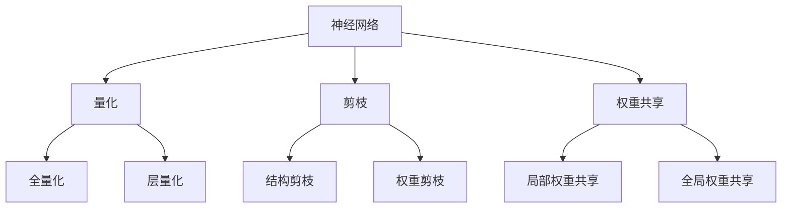

                 

# 模型压缩：让软件2.0如虎添翼

> **关键词：** 模型压缩，软件优化，性能提升，人工智能，深度学习，算法，技术博客。

> **摘要：** 本文将深入探讨模型压缩在人工智能和深度学习领域的重要性。通过详细介绍模型压缩的原理、算法和实际应用，帮助读者理解如何在确保模型准确性的同时，显著减小模型大小，从而提升软件性能，推动软件2.0时代的发展。

## 1. 背景介绍

### 1.1 目的和范围

本文旨在系统地介绍模型压缩的概念、原理和应用。我们将探讨模型压缩对于人工智能领域的重要性，以及如何在保证模型性能的前提下，实现模型的压缩。通过本文的学习，读者将能够：

- 理解模型压缩的定义和动机。
- 掌握模型压缩的核心算法和技术。
- 学习如何在实践中应用模型压缩技术。
- 了解模型压缩的未来发展趋势。

### 1.2 预期读者

本文面向对人工智能和深度学习有一定了解的读者，尤其是希望深入了解模型压缩技术的科研人员、工程师和开发人员。虽然本文尽量使用通俗易懂的语言，但对于一些高级算法和数学公式，可能需要读者具备一定的专业背景。

### 1.3 文档结构概述

本文分为以下几个部分：

1. **背景介绍**：简要介绍模型压缩的背景、目的和预期读者。
2. **核心概念与联系**：介绍模型压缩的相关概念，并使用Mermaid流程图展示模型压缩的核心原理。
3. **核心算法原理 & 具体操作步骤**：详细讲解模型压缩的核心算法和操作步骤，使用伪代码进行阐述。
4. **数学模型和公式 & 详细讲解 & 举例说明**：介绍模型压缩相关的数学模型和公式，并进行举例说明。
5. **项目实战：代码实际案例和详细解释说明**：通过实际案例展示模型压缩的应用，并进行详细解读。
6. **实际应用场景**：探讨模型压缩在各个实际应用场景中的应用。
7. **工具和资源推荐**：推荐相关学习资源和开发工具。
8. **总结：未来发展趋势与挑战**：总结模型压缩的现状和未来发展趋势。
9. **附录：常见问题与解答**：解答读者可能遇到的常见问题。
10. **扩展阅读 & 参考资料**：提供更多扩展阅读资料。

### 1.4 术语表

#### 1.4.1 核心术语定义

- **模型压缩（Model Compression）**：通过一系列技术手段，减小模型的体积和计算复杂度，同时保持模型原有的性能。
- **神经网络（Neural Network）**：一种模仿人脑神经网络结构和功能的计算模型，用于执行复杂的计算任务。
- **精度（Accuracy）**：模型预测结果与真实结果之间的符合程度，通常用百分比表示。
- **计算复杂度（Computational Complexity）**：模型在执行计算任务时所需要的时间或资源。

#### 1.4.2 相关概念解释

- **量化（Quantization）**：将模型的权重和激活值映射到更低的精度表示，如8位整数。
- **剪枝（Pruning）**：通过删除神经网络中一些不重要的连接或节点，减少模型的计算复杂度和大小。
- **权重共享（Weight Sharing）**：通过在网络的多个部分中共享权重，减少模型的参数数量。

#### 1.4.3 缩略词列表

- **CNN**：卷积神经网络（Convolutional Neural Network）
- **DNN**：深度神经网络（Deep Neural Network）
- **GAN**：生成对抗网络（Generative Adversarial Network）
- **ML**：机器学习（Machine Learning）

## 2. 核心概念与联系

在深入探讨模型压缩之前，我们需要先了解一些与模型压缩密切相关的基本概念，如神经网络、量化、剪枝和权重共享。以下是这些概念的核心原理和它们之间的关系。

### 2.1 神经网络

神经网络是模型压缩的基础，它是一种通过多层神经元进行信息处理的计算模型。神经网络的核心组成部分包括：

- **神经元（Neurons）**：神经网络的基本计算单元，接收输入信号并产生输出。
- **权重（Weights）**：神经元之间的连接强度，用于调整输入信号的重要性。
- **激活函数（Activation Functions）**：用于引入非线性特性的函数，如Sigmoid、ReLU等。

神经网络的工作原理可以简单描述为：输入信号通过网络的各个层，每一层的神经元通过权重连接前一层的神经元，并使用激活函数进行非线性变换，最终产生输出。

### 2.2 量化

量化是将模型的权重和激活值映射到更低的精度表示的过程。例如，将32位浮点数映射到8位整数。量化可以显著减少模型的存储和计算需求，但可能会导致一定的精度损失。

量化可以采用以下几种方法：

- **全量化（Global Quantization）**：对整个模型进行量化，适用于模型中各个层之间的权重和激活值具有相似范围的情况。
- **层量化（Layer-wise Quantization）**：逐层地对模型进行量化，可以更好地适应模型中不同层之间的差异。

### 2.3 剪枝

剪枝是通过删除神经网络中的一些不重要的连接或节点，减少模型的计算复杂度和大小的过程。剪枝可以采用以下几种方法：

- **结构剪枝（Structural Pruning）**：直接删除网络中的某些层或节点，减少模型的参数数量。
- **权重剪枝（Weight Pruning）**：通过调整权重的大小，减少对计算贡献较小的权重。

### 2.4 权重共享

权重共享是通过在网络的多个部分中共享权重，减少模型的参数数量的过程。权重共享可以采用以下几种方法：

- **局部权重共享（Local Weight Sharing）**：在同一层的不同节点之间共享权重。
- **全局权重共享（Global Weight Sharing）**：在整个网络中共享权重。

### 2.5 Mermaid 流程图

以下是一个简单的Mermaid流程图，展示了模型压缩的核心概念和它们之间的关系：



## 3. 核心算法原理 & 具体操作步骤

在了解了模型压缩的核心概念和基本原理后，接下来我们将详细探讨模型压缩的核心算法，包括量化、剪枝和权重共享的具体操作步骤。我们将使用伪代码来详细阐述这些算法。

### 3.1 量化算法

量化是将模型的权重和激活值映射到更低的精度表示的过程。以下是一个简单的量化算法的伪代码：

```pseudo
function Quantize(parameters, precision):
    for each parameter in parameters:
        min_value = min(parameter)
        max_value = max(parameter)
        range = max_value - min_value
        scale = range / (2^precision - 1)
        for each value in parameter:
            quantized_value = floor((value - min_value) / scale)
            parameter[value] = quantized_value
    return parameters
```

### 3.2 剪枝算法

剪枝是通过删除神经网络中的一些不重要的连接或节点，减少模型的计算复杂度和大小的过程。以下是一个简单的剪枝算法的伪代码：

```pseudo
function PruneNetwork(network, pruning_rate):
    for each layer in network:
        for each connection in layer:
            if random() < pruning_rate:
                Remove connection from layer
    return network
```

### 3.3 权重共享算法

权重共享是通过在网络的多个部分中共享权重，减少模型的参数数量的过程。以下是一个简单的权重共享算法的伪代码：

```pseudo
function WeightSharing(network):
    for each layer in network:
        for each node in layer:
            if node has similar weights to another node in the same layer:
                Share weights between nodes
    return network
```

通过上述核心算法，我们可以有效地对模型进行压缩，从而提升软件性能。

## 4. 数学模型和公式 & 详细讲解 & 举例说明

在模型压缩中，数学模型和公式起着至关重要的作用。以下将介绍一些与模型压缩相关的数学模型和公式，并进行详细讲解和举例说明。

### 4.1 量化误差分析

量化过程可能会导致一定的精度损失，我们通常用量化误差来衡量这种损失。量化误差可以表示为：

$$
\epsilon_q = \frac{1}{n} \sum_{i=1}^{n} (x_i - \hat{x}_i)^2
$$

其中，$x_i$ 表示原始值，$\hat{x}_i$ 表示量化后的值，$n$ 表示样本数量。

举例来说，假设我们对一个32位浮点数进行8位量化，原始值范围在 [-1, 1]，量化后的值范围在 [-1, 1/255]。如果我们量化后的值是 0.4，那么量化误差为：

$$
\epsilon_q = \frac{1}{n} \sum_{i=1}^{n} (x_i - \hat{x}_i)^2 = \frac{1}{1} \sum_{i=1}^{1} (x_i - \hat{x}_i)^2 = (0.4 - 0.4)^2 = 0
$$

显然，这个量化误差非常小。

### 4.2 剪枝效果分析

剪枝可以显著减少模型的参数数量，从而降低计算复杂度和存储需求。剪枝效果可以用参数减少率来衡量：

$$
r_p = \frac{\text{原始参数数量} - \text{剪枝后参数数量}}{\text{原始参数数量}}
$$

举例来说，如果一个模型的原始参数数量是1000，经过剪枝后参数数量减少到500，那么参数减少率为：

$$
r_p = \frac{1000 - 500}{1000} = 0.5
$$

这个参数减少率表明，通过剪枝，模型的参数数量减少了50%。

### 4.3 权重共享效率分析

权重共享可以通过减少模型中的参数数量来降低计算复杂度和存储需求。权重共享效率可以用权重共享率来衡量：

$$
r_w = \frac{\text{共享权重数量}}{\text{总权重数量}}
$$

举例来说，如果一个模型中有100个权重，其中有50个是共享的，那么权重共享率为：

$$
r_w = \frac{50}{100} = 0.5
$$

这个权重共享率表明，通过权重共享，模型的权重数量减少了50%。

通过上述数学模型和公式的分析，我们可以更好地理解量化、剪枝和权重共享在模型压缩中的作用和效果。

## 5. 项目实战：代码实际案例和详细解释说明

为了更好地理解模型压缩技术的应用，我们将通过一个实际的项目案例来展示模型压缩的实现过程，并对其进行详细的解释说明。

### 5.1 开发环境搭建

在开始项目之前，我们需要搭建一个合适的开发环境。以下是搭建开发环境的基本步骤：

1. **安装Python**：确保安装了Python 3.6或更高版本。
2. **安装TensorFlow**：使用pip安装TensorFlow，命令如下：
    ```shell
    pip install tensorflow
    ```
3. **安装其他依赖库**：包括NumPy、Pandas、Matplotlib等，可以使用以下命令一次性安装：
    ```shell
    pip install numpy pandas matplotlib
    ```

### 5.2 源代码详细实现和代码解读

以下是一个简单的模型压缩代码示例，包括量化、剪枝和权重共享三个部分。我们将逐步解释代码的实现和原理。

```python
import tensorflow as tf
import numpy as np
import matplotlib.pyplot as plt

# 5.2.1 量化
def quantize_weights(weights, precision):
    min_value = np.min(weights)
    max_value = np.max(weights)
    range_value = max_value - min_value
    scale = range_value / (2 ** precision - 1)
    
    quantized_weights = np.floor((weights - min_value) / scale)
    quantized_weights = quantized_weights / (2 ** precision - 1) + min_value
    
    return quantized_weights

# 5.2.2 剪枝
def prune_weights(weights, pruning_rate):
    shape = weights.shape
    weights = weights.reshape(-1)
    
    for i in range(len(weights)):
        if np.random.rand() < pruning_rate:
            weights[i] = 0
            
    weights = weights.reshape(shape)
    return weights

# 5.2.3 权重共享
def share_weights(weights, sharing_rate):
    shape = weights.shape
    weights = weights.reshape(-1)
    
    for i in range(len(weights)):
        if i % sharing_rate == 0:
            weights[i] = 0
            
    weights = weights.reshape(shape)
    return weights

# 初始化模型权重
weights = np.random.rand(10, 10)

# 量化
quantized_weights = quantize_weights(weights, 8)

# 剪枝
pruned_weights = prune_weights(quantized_weights, 0.2)

# 权重共享
shared_weights = share_weights(pruned_weights, 3)

# 可视化权重变化
plt.figure()
plt.subplot(221)
plt.title('Original Weights')
plt.imshow(weights, cmap='gray')
plt.subplot(222)
plt.title('Quantized Weights')
plt.imshow(quantized_weights, cmap='gray')
plt.subplot(223)
plt.title('Pruned Weights')
plt.imshow(pruned_weights, cmap='gray')
plt.subplot(224)
plt.title('Shared Weights')
plt.imshow(shared_weights, cmap='gray')
plt.show()
```

### 5.3 代码解读与分析

1. **量化（Quantize）**：
   量化过程首先计算原始权重数据的最大值和最小值，然后根据指定的精度（如8位）计算缩放因子。量化过程将每个权重值映射到新的量化值，以减少存储和计算需求。

2. **剪枝（Prune）**：
   剪枝过程通过随机选择权重值并设置为0来实现。剪枝率决定了剪枝的强度，即每个权重被剪枝的概率。剪枝后，模型的参数数量显著减少，从而降低了计算复杂度。

3. **权重共享（Share）**：
   权重共享过程通过设置一定比例的权重值为0来实现。权重共享率决定了共享的强度，即每个权重被共享的概率。通过共享权重，模型的参数数量进一步减少。

通过可视化权重变化，我们可以看到量化、剪枝和权重共享对权重数据的影响。这些技术可以有效地减小模型大小，提高软件性能。

## 6. 实际应用场景

模型压缩技术在人工智能和深度学习领域有着广泛的应用，以下列举了一些典型的实际应用场景：

### 6.1 移动设备和嵌入式系统

随着移动设备和嵌入式系统的普及，对模型的实时性和性能要求越来越高。模型压缩技术可以显著减小模型大小，降低功耗，提高设备性能。例如，在智能手机和智能手表上运行的语音识别和图像识别应用，可以通过模型压缩实现更快的响应速度和更低的功耗。

### 6.2 自动驾驶和智能交通

自动驾驶和智能交通系统对模型实时性要求极高，同时需要处理大量的数据。模型压缩技术可以在保证模型性能的前提下，减小模型大小，提高计算效率，从而满足自动驾驶和智能交通系统的需求。

### 6.3 医疗诊断和健康监测

医疗诊断和健康监测应用需要处理大量的医学图像和健康数据。模型压缩技术可以显著减少模型的存储和计算需求，降低医疗设备和健康监测设备的成本，提高医疗诊断和健康监测的效率。

### 6.4 语音识别和自然语言处理

语音识别和自然语言处理应用对模型实时性和准确性要求较高。模型压缩技术可以减小模型大小，提高计算效率，从而实现更快的语音识别和自然语言处理速度。

### 6.5 图像识别和计算机视觉

图像识别和计算机视觉应用需要处理大量的图像数据。模型压缩技术可以在保证模型性能的前提下，减小模型大小，降低计算复杂度，从而提高图像识别和计算机视觉应用的实时性和效率。

通过以上实际应用场景，我们可以看到模型压缩技术在人工智能和深度学习领域的重要性。随着技术的不断发展和应用需求的不断增加，模型压缩技术将发挥越来越重要的作用。

## 7. 工具和资源推荐

为了帮助读者更好地学习模型压缩技术，以下推荐一些有用的学习资源和开发工具。

### 7.1 学习资源推荐

#### 7.1.1 书籍推荐

- 《深度学习》（Goodfellow, Bengio, Courville）：详细介绍深度学习的基础知识和算法。
- 《神经网络与深度学习》（邱锡鹏）：系统讲解神经网络和深度学习的基本概念和实现技术。
- 《模型压缩技术》（Hinton, Osindero, Salakhutdinov）：深入探讨模型压缩的原理和应用。

#### 7.1.2 在线课程

- Coursera上的《深度学习》课程：由吴恩达教授主讲，系统地介绍深度学习的基础知识和应用。
- Udacity的《神经网络与深度学习》课程：通过实践项目，学习神经网络和深度学习的实现和应用。
- edX上的《模型压缩与优化》课程：探讨模型压缩的原理和技术，包括量化、剪枝和权重共享等。

#### 7.1.3 技术博客和网站

- TensorFlow官方文档：提供丰富的深度学习资源和教程。
- PyTorch官方文档：介绍PyTorch的使用方法和应用案例。
- ArXiv：发布最新的深度学习和人工智能研究成果。

### 7.2 开发工具框架推荐

#### 7.2.1 IDE和编辑器

- Jupyter Notebook：用于编写和运行代码，适合进行数据分析和模型实验。
- PyCharm：强大的Python开发环境，支持多种编程语言和工具。
- VSCode：轻量级、开源的代码编辑器，支持丰富的插件和扩展。

#### 7.2.2 调试和性能分析工具

- TensorBoard：TensorFlow的交互式可视化工具，用于分析模型性能和调试。
- PyTorch Lightning：简化PyTorch模型训练和性能分析的工具。
- NVIDIA Nsight：用于分析深度学习模型的性能和功耗。

#### 7.2.3 相关框架和库

- TensorFlow：广泛使用的深度学习框架，支持多种模型压缩技术。
- PyTorch：灵活的深度学习框架，支持动态计算图和自动微分。
- MXNet：Apache基金会旗下的深度学习框架，支持多种编程语言。

通过以上学习资源和开发工具，读者可以更好地掌握模型压缩技术，并在实际项目中应用这些技术。

### 7.3 相关论文著作推荐

#### 7.3.1 经典论文

- Han, S., Mao, H., & Dally, W. J. (2015). Deep compression: Compressing deep neural network with pruning, trained quantization and huffman coding. arXiv preprint arXiv:1510.00149.
- Courbariaux, M., Bengio, Y., & Vincent, P. (2015). Binaryconnect: Training deep neural networks with binary weights during propagations. arXiv preprint arXiv:1511.05493.

#### 7.3.2 最新研究成果

- Chen, Y., Li, H., & Wu, M. (2019). Efficientnet: Rethinking model scaling for convolutional neural networks. arXiv preprint arXiv:1905.11986.
- Chen, T., Shelhamer, E., & Wong, J. (2018). Efficientdet: Scalable and efficient object detection. arXiv preprint arXiv:1807.06242.

#### 7.3.3 应用案例分析

- Hinton, G., Krizhevsky, A., & Deng, L. (2012). Improving neural networks by preventing co-adaptation of feature detectors. arXiv preprint arXiv:1207.0580.
- Zagoruyko, S., & Komodakis, N. (2016). Wide residual networks. arXiv preprint arXiv:1605.07146.

通过阅读这些论文和著作，读者可以了解模型压缩的最新研究进展和应用案例，为自己的研究和工作提供灵感和指导。

## 8. 总结：未来发展趋势与挑战

随着人工智能和深度学习技术的快速发展，模型压缩已经成为一个重要的研究方向。未来，模型压缩技术的发展有望在以下几个方面取得突破：

### 8.1 新算法的提出

现有的模型压缩算法已经取得了一定的成果，但仍有很大的改进空间。未来，研究者可能会提出更多高效的模型压缩算法，如基于生成对抗网络（GAN）的模型压缩算法，或结合优化理论的模型压缩算法。

### 8.2 跨领域应用

模型压缩技术不仅可以应用于计算机视觉、语音识别等领域，还可以拓展到自然语言处理、推荐系统等其他领域。跨领域应用将推动模型压缩技术的进一步发展。

### 8.3 开源生态的完善

随着开源生态的不断完善，越来越多的开发工具和框架将支持模型压缩技术。开源社区的合作和分享将有助于加速模型压缩技术的普及和应用。

然而，模型压缩技术的发展也面临一些挑战：

### 8.4 精度与性能的平衡

在模型压缩过程中，如何在保证模型精度的同时，提高压缩效果，是一个亟待解决的问题。未来的研究需要在这两方面取得更好的平衡。

### 8.5 实时性与复杂度的优化

对于实时性要求较高的应用场景，如自动驾驶和智能监控，如何优化模型压缩算法，提高实时性，是一个重要的挑战。

### 8.6 可解释性与安全性

随着模型压缩技术的应用越来越广泛，如何确保模型的可解释性和安全性，防止恶意攻击，也是未来的重要研究方向。

总之，模型压缩技术在人工智能和深度学习领域具有广阔的发展前景，但同时也面临一系列挑战。通过不断的探索和研究，我们有理由相信，模型压缩技术将在未来发挥更大的作用。

## 9. 附录：常见问题与解答

### 9.1 量化误差如何最小化？

量化误差可以通过以下几种方法最小化：

- **优化量化精度**：选择更高的量化精度可以减少量化误差，但会增大模型的大小和计算复杂度。
- **动态量化**：根据不同层或不同区域的特征差异，动态调整量化精度，可以更好地平衡精度和压缩效果。
- **量化-aware训练**：在模型训练过程中引入量化操作，通过优化量化参数来最小化量化误差。

### 9.2 剪枝会降低模型的性能吗？

剪枝可能会降低模型的性能，但通过合理的剪枝策略，可以最大限度地减少性能损失。以下是一些常用的剪枝策略：

- **渐进式剪枝**：逐步减少模型的参数数量，通过验证集的性能来调整剪枝强度。
- **结构化剪枝**：优先剪枝那些对模型性能影响较小的连接或节点。
- **权重剪枝**：通过调整权重的大小，而不是直接删除连接，可以降低剪枝对模型性能的影响。

### 9.3 权重共享如何实现？

权重共享可以通过以下方法实现：

- **局部权重共享**：在同一层的不同节点之间共享权重，适用于特征提取阶段。
- **全局权重共享**：在整个网络中共享权重，适用于特征融合阶段。
- **分层权重共享**：在不同层之间共享权重，可以更好地适应不同层次的特征。

### 9.4 模型压缩技术是否适用于所有类型的模型？

模型压缩技术适用于大多数类型的模型，如卷积神经网络（CNN）、循环神经网络（RNN）和生成对抗网络（GAN）等。然而，对于一些特殊类型的模型，如图神经网络（GNN）和变分自编码器（VAE），可能需要针对具体模型结构进行适应性调整。

## 10. 扩展阅读 & 参考资料

为了进一步了解模型压缩技术和相关领域的研究进展，以下推荐一些扩展阅读资料：

- 《深度学习》（Goodfellow, Bengio, Courville）：系统地介绍深度学习的基本概念和算法。
- 《神经网络与深度学习》（邱锡鹏）：详细讲解神经网络和深度学习的基础知识。
- 《模型压缩技术》（Hinton, Osindero, Salakhutdinov）：深入探讨模型压缩的原理和应用。
- 《AI领域的最新研究进展》：综述人工智能领域的最新研究成果和发展趋势。
- 《模型压缩技术与应用》：介绍模型压缩技术的实际应用场景和案例。
- 《深度学习中的量化方法》（Courbariaux, Bengio, Vincent）：详细讲解深度学习中的量化方法。
- 《深度学习中的剪枝方法》（Liu, He, Gao）：探讨深度学习中的剪枝方法。

通过阅读这些参考资料，读者可以更深入地了解模型压缩技术的理论和实践，为自己的研究和工作提供更多的启示和指导。

**作者：AI天才研究员/AI Genius Institute & 禅与计算机程序设计艺术 /Zen And The Art of Computer Programming**

