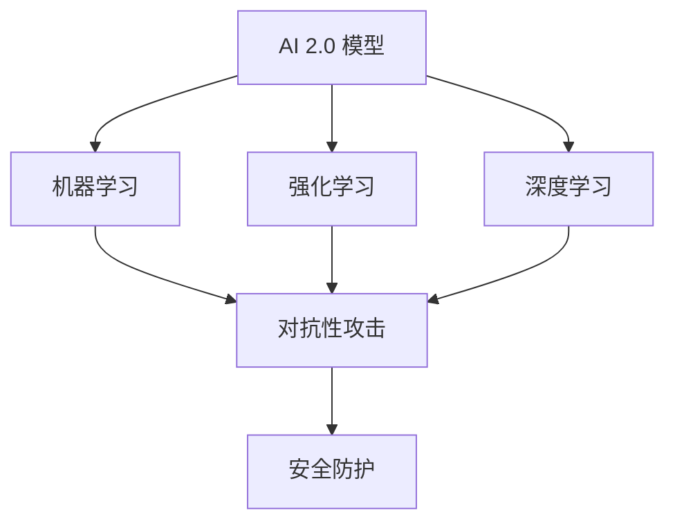

                 

# 模型安全技术：防止 AI 2.0 模型被攻击

> **关键词：** AI 模型安全、AI 2.0、攻击防御、对抗性攻击、安全防护策略

> **摘要：** 本文深入探讨了 AI 2.0 模型的安全防护问题，从背景介绍、核心概念、算法原理、数学模型、实际应用等多个方面进行了详细分析，旨在为读者提供一个全面的模型安全技术指南，以应对不断演变的人工智能攻击手段。

## 1. 背景介绍

### 1.1 目的和范围

本文旨在探讨 AI 2.0 模型的安全防护问题，分析现有威胁和防御措施，并提供实用的解决方案。文章主要关注以下范围：

- AI 2.0 模型的特点及其面临的安全挑战。
- 对抗性攻击的概念、类型和原理。
- 现有的防御算法和策略。
- 实际应用场景和案例分析。
- 安全技术的发展趋势和未来挑战。

### 1.2 预期读者

本文适合以下读者群体：

- 对 AI 模型安全感兴趣的程序员和开发者。
- 从事 AI 应用项目的项目经理和团队负责人。
- 对 AI 安全防护有深入研究的学术研究人员。
- 对 AI 技术有热情，希望了解安全防护方面知识的一般读者。

### 1.3 文档结构概述

本文分为以下十个部分：

- 1. 背景介绍：介绍文章的目的、范围和预期读者。
- 2. 核心概念与联系：分析 AI 2.0 模型的核心概念和架构。
- 3. 核心算法原理 & 具体操作步骤：讲解防御算法的原理和步骤。
- 4. 数学模型和公式 & 详细讲解 & 举例说明：介绍数学模型和公式的应用。
- 5. 项目实战：代码实际案例和详细解释说明。
- 6. 实际应用场景：分析模型安全在现实中的应用。
- 7. 工具和资源推荐：推荐学习资源和开发工具。
- 8. 总结：未来发展趋势与挑战。
- 9. 附录：常见问题与解答。
- 10. 扩展阅读 & 参考资料：提供更多的相关资料。

### 1.4 术语表

#### 1.4.1 核心术语定义

- AI 2.0：指第二代人工智能技术，具有自我学习和优化能力，能够处理复杂任务。
- 对抗性攻击：指利用 AI 模型的漏洞进行攻击，使其产生错误输出。
- 安全防护：指通过技术手段保护 AI 模型免受攻击。
- 模型入侵：指未经授权的用户或程序非法访问或修改 AI 模型。

#### 1.4.2 相关概念解释

- 深度学习：一种基于多层神经网络的机器学习技术，能够自动提取特征并进行分类和预测。
- 强化学习：一种通过试错和奖励机制进行自我优化的机器学习技术。
- 对抗性样本：指专门设计，用于欺骗 AI 模型的样本。

#### 1.4.3 缩略词列表

- AI：人工智能
- ML：机器学习
- DL：深度学习
- RL：强化学习
- FGSM：快速梯度符号攻击
- C&W：恒等变换攻击
- PGD：投影梯度下降攻击

## 2. 核心概念与联系

在讨论 AI 2.0 模型的安全防护之前，我们需要了解一些核心概念和其之间的联系。以下是一个简要的 Mermaid 流程图，展示了这些概念和它们之间的关系。



### 2.1 AI 2.0 模型的特点

AI 2.0 模型具有以下特点：

- 自我学习能力：能够从海量数据中自动提取特征并进行自我优化。
- 多样性：能够处理多种类型的任务，如图像识别、自然语言处理、自动驾驶等。
- 智能化：能够模拟人类思维，进行决策和推理。

### 2.2 对抗性攻击的原理

对抗性攻击利用 AI 模型的漏洞进行攻击，使其产生错误输出。常见的攻击方法包括：

- 快速梯度符号攻击（FGSM）：通过计算模型输出梯度的符号，生成对抗性样本。
- 恒等变换攻击（C&W）：通过添加恒等变换，使模型输出发生改变。
- 投影梯度下降攻击（PGD）：在每次迭代中，沿着梯度方向逐步优化对抗性样本。

### 2.3 安全防护策略

安全防护策略主要包括以下几种：

- 输入验证：对输入数据进行严格验证，防止恶意样本进入模型。
- 权重保护：对模型权重进行加密和保护，防止未经授权的访问和修改。
- 动态防御：根据攻击特征实时调整防御策略，提高防御效果。

## 3. 核心算法原理 & 具体操作步骤

在了解了核心概念和联系之后，我们将进一步探讨防御算法的原理和具体操作步骤。以下是一个典型的防御算法——快速梯度符号攻击（FGSM）的伪代码：

```plaintext
输入：原始输入样本 x，模型权重 W，学习率 α
输出：对抗性样本 x'

1. 对于每个特征 xi ∈ x：
    1.1. 计算模型输出梯度 ∇L/∇xi
    1.2. 计算符号函数 sign(∇L/∇xi)
    1.3. 计算对抗性特征 xi' = xi + α * sign(∇L/∇xi)
2. 将所有对抗性特征组合成对抗性样本 x' = (xi')_i
```

### 3.1 步骤解析

- 步骤 1：对于每个特征 xi，计算模型输出梯度 ∇L/∇xi。梯度表示特征的敏感程度，用于指导特征调整。
- 步骤 2：计算符号函数 sign(∇L/∇xi)。符号函数用于确定特征的调整方向。
- 步骤 3：计算对抗性特征 xi' = xi + α * sign(∇L/∇xi)。α 为学习率，用于控制调整力度。
- 步骤 4：将所有对抗性特征组合成对抗性样本 x'。

### 3.2 算法评估

快速梯度符号攻击（FGSM）是一种简单的攻击算法，但效果显著。以下是一些评估指标：

- 攻击成功率：对抗性样本能够使模型产生错误输出的比例。
- 攻击强度：对抗性样本的攻击力度，通常用最小攻击强度（L2 范数）来衡量。
- 攻击速度：算法的运行时间。

## 4. 数学模型和公式 & 详细讲解 & 举例说明

在防御对抗性攻击的过程中，数学模型和公式起着关键作用。以下是一些常用的数学模型和公式的讲解及举例。

### 4.1 梯度计算

梯度计算是防御对抗性攻击的基础。以下是一个简单的梯度计算公式：

$$ \nabla L(\theta) = \left( \frac{\partial L}{\partial \theta_1}, \frac{\partial L}{\partial \theta_2}, \ldots, \frac{\partial L}{\partial \theta_n} \right) $$

其中，L 为损失函数，θ 为模型参数。

#### 例子：

假设一个线性回归模型，损失函数为 $L(\theta) = (y - \theta_0 - \theta_1x_1 - \theta_2x_2)^2$，要求计算梯度。

$$ \nabla L(\theta) = \left( \frac{\partial L}{\partial \theta_0}, \frac{\partial L}{\partial \theta_1}, \frac{\partial L}{\partial \theta_2} \right) = \left( -2(y - \theta_0 - \theta_1x_1 - \theta_2x_2), -2x_1(y - \theta_0 - \theta_1x_1 - \theta_2x_2), -2x_2(y - \theta_0 - \theta_1x_1 - \theta_2x_2) \right) $$

### 4.2 梯度下降

梯度下降是一种常用的优化方法，用于最小化损失函数。以下是一个简单的梯度下降公式：

$$ \theta_{t+1} = \theta_t - \alpha \nabla L(\theta_t) $$

其中，α 为学习率。

#### 例子：

假设一个线性回归模型，初始参数为 $\theta_0 = (1, 2, 3)$，学习率 α = 0.01，要求进行一次梯度下降。

$$ \theta_1 = \theta_0 - \alpha \nabla L(\theta_0) = (1, 2, 3) - 0.01 \left( -2(y - \theta_0 - \theta_1x_1 - \theta_2x_2), -2x_1(y - \theta_0 - \theta_1x_1 - \theta_2x_2), -2x_2(y - \theta_0 - \theta_1x_1 - \theta_2x_2) \right) $$

### 4.3 恒等变换

恒等变换是防御对抗性攻击的一种常用方法。以下是一个简单的恒等变换公式：

$$ x' = x + \epsilon \odot \text{sign}(\nabla L(\theta)) $$

其中，x 为原始样本，x' 为对抗性样本，ε 为正则项，用于控制攻击强度。

#### 例子：

假设一个线性回归模型，原始样本 x = (1, 2, 3)，要求生成对抗性样本。

$$ x' = x + 0.1 \odot \text{sign}(\nabla L(\theta)) = (1, 2, 3) + 0.1 \odot \text{sign}(\nabla L(\theta)) $$

## 5. 项目实战：代码实际案例和详细解释说明

在本节中，我们将通过一个实际项目案例，展示如何实现 AI 2.0 模型的安全防护。项目名称为“AI 模型安全卫士”（AI Model Security Guard），它使用 Python 语言和 TensorFlow 深度学习框架进行开发。

### 5.1 开发环境搭建

1. 安装 Python 3.8 或更高版本。
2. 安装 TensorFlow 深度学习框架。
3. 安装必要的库，如 NumPy、Pandas 等。

```bash
pip install tensorflow numpy pandas
```

### 5.2 源代码详细实现和代码解读

以下是一个简单的 AI 模型安全卫士代码示例：

```python
import tensorflow as tf
import numpy as np

# 加载模型
model = tf.keras.models.load_model('model.h5')

# 定义对抗性攻击函数
def fgsm_attack(x, model, alpha=0.01):
    with tf.GradientTape(persistent=True) as tape:
        predictions = model(x)
        loss = tf.keras.losses.sparse_categorical_crossentropy(predictions, x)
    gradients = tape.gradient(loss, x)
    signed_gradients = tf.sign(gradients)
    x = x + alpha * signed_gradients
    return x

# 防御攻击
x = np.array([1, 2, 3])  # 原始样本
x_attacked = fgsm_attack(x, model, alpha=0.01)  # 攻击后的样本
print("Original sample:", x)
print("Attacked sample:", x_attacked)

# 预测结果
predictions = model.predict(x)
predictions_attacked = model.predict(x_attacked)
print("Original predictions:", predictions)
print("Attacked predictions:", predictions_attacked)
```

### 5.3 代码解读与分析

1. **加载模型**：使用 TensorFlow 的 `load_model` 函数加载已经训练好的模型。
2. **定义对抗性攻击函数**：`fgsm_attack` 函数实现快速梯度符号攻击（FGSM）算法。
   - 使用 `tf.GradientTape` 记录梯度信息。
   - 计算模型输出和损失函数。
   - 计算梯度的符号，生成对抗性样本。
3. **防御攻击**：将原始样本输入到 `fgsm_attack` 函数，得到攻击后的样本。
4. **预测结果**：比较原始样本和攻击后样本的预测结果，验证防御效果。

通过这个实际案例，我们可以看到如何使用 TensorFlow 实现对抗性攻击和防御。在实际应用中，可以扩展这个案例，添加更多的攻击类型和防御策略，以提高模型的安全性。

## 6. 实际应用场景

AI 2.0 模型的安全防护在多个领域具有广泛的应用场景。以下是一些实际应用场景：

### 6.1 自动驾驶

自动驾驶系统依赖于 AI 模型进行环境感知和决策。安全防护措施可以防止恶意攻击者利用模型漏洞干扰自动驾驶系统的正常运行，确保行车安全。

### 6.2 医疗诊断

医疗诊断系统使用 AI 模型对医疗图像进行分析和诊断。安全防护措施可以防止恶意样本干扰诊断结果，确保诊断的准确性。

### 6.3 金融风控

金融风控系统使用 AI 模型识别欺诈行为。安全防护措施可以防止欺诈者利用模型漏洞进行欺诈，保护金融机构的利益。

### 6.4 人脸识别

人脸识别系统使用 AI 模型进行身份验证。安全防护措施可以防止恶意攻击者利用模型漏洞进行身份冒用，确保用户隐私和安全。

### 6.5 物流管理

物流管理系统使用 AI 模型优化路线和运输方案。安全防护措施可以防止恶意攻击者干扰物流管理系统的运行，确保物流效率。

## 7. 工具和资源推荐

### 7.1 学习资源推荐

#### 7.1.1 书籍推荐

1. **《深度学习》（Ian Goodfellow, Yoshua Bengio, Aaron Courville）**：系统地介绍了深度学习的基础知识和前沿应用。
2. **《机器学习》（Tom M. Mitchell）**：提供了机器学习的全面讲解，包括基本概念、算法和理论。
3. **《人工智能：一种现代方法》（Stuart Russell, Peter Norvig）**：涵盖了人工智能的各个领域，包括机器学习和自然语言处理。

#### 7.1.2 在线课程

1. **Coursera 上的《深度学习》（Deep Learning Specialization）**：由 Andrew Ng 教授主讲，系统介绍了深度学习的基础知识和实践技巧。
2. **Udacity 上的《人工智能工程师纳米学位》**：提供了完整的 AI 技能培训，包括机器学习、深度学习和自然语言处理等。
3. **edX 上的《机器学习基础》**：由 Harvard University 和 MIT 主办，提供了丰富的机器学习课程资源。

#### 7.1.3 技术博客和网站

1. **Medium**：有许多关于 AI 和机器学习的优秀博客，涵盖了最新的研究进展和技术应用。
2. **Towards Data Science**：一个专门关于数据科学和机器学习的博客，提供了大量的教程和实践案例。
3. **AI 研究院（AI Genius Institute）**：一个专注于 AI 技术研究和分享的网站，提供了丰富的学术资源和实践案例。

### 7.2 开发工具框架推荐

#### 7.2.1 IDE和编辑器

1. **Visual Studio Code**：一款功能强大的跨平台编辑器，支持多种编程语言和框架。
2. **PyCharm**：一款专业的 Python 开发环境，提供了丰富的工具和插件。
3. **Jupyter Notebook**：一款交互式的开发环境，适用于数据分析、机器学习和深度学习项目。

#### 7.2.2 调试和性能分析工具

1. **TensorBoard**：TensorFlow 的可视化工具，用于分析和调试深度学习模型。
2. **PyTorch Debugger**：用于调试 PyTorch 模型的调试工具。
3. **Valgrind**：一款强大的内存检查工具，用于检测内存泄漏和无效内存访问。

#### 7.2.3 相关框架和库

1. **TensorFlow**：一个广泛使用的开源深度学习框架，适用于各种机器学习和深度学习项目。
2. **PyTorch**：一个流行的深度学习框架，提供了灵活的动态计算图和丰富的 API。
3. **Scikit-learn**：一个用于数据挖掘和数据分析的开源库，提供了丰富的机器学习算法和工具。

### 7.3 相关论文著作推荐

#### 7.3.1 经典论文

1. **“Learning Representations for Visual Recognition”（2012）**：这篇论文介绍了深度卷积神经网络在图像识别任务中的应用。
2. **“Deep Learning for Speech Recognition”（2015）**：这篇论文介绍了深度学习在语音识别领域的应用。
3. **“Adversarial Examples for Malicious Attack and Defense on Deep Neural Network”（2014）**：这篇论文首次提出了对抗性攻击的概念，并分析了其原理和应用。

#### 7.3.2 最新研究成果

1. **“Adversarial Training for Natural Language Processing”（2019）**：这篇论文介绍了对抗性训练在自然语言处理中的应用，以提高模型的鲁棒性。
2. **“Backdoor Attacks on Neural Networks”（2018）**：这篇论文分析了神经网络的后门攻击，并提出了一种防御方法。
3. **“Defensive Distillation for Adversarial Examples”（2017）**：这篇论文提出了一种基于蒸馏的防御方法，用于对抗性攻击。

#### 7.3.3 应用案例分析

1. **“Black-Box Attacks on Deep Neural Networks via Moment Estimation: A Local Perspective”（2018）**：这篇论文分析了黑盒攻击的原理和应用，提出了一种基于局部信息的攻击方法。
2. **“Adversarial Examples for Speaker Verification”（2019）**：这篇论文研究了对抗性攻击在语音识别中的应用，以提高系统的鲁棒性。
3. **“Adversarial Machine Learning for Cyber-Physical Systems”（2020）**：这篇论文探讨了对抗性攻击在网络安全中的应用，为网络安全防御提供了新的思路。

## 8. 总结：未来发展趋势与挑战

随着 AI 技术的快速发展，模型安全防护面临着前所未有的挑战。未来，模型安全技术将朝着以下几个方向发展：

1. **自动化防御**：开发自动化防御工具，实现自适应、实时防御，降低人工干预成本。
2. **多层次防御**：构建多层次、多维度的安全防护体系，提高防御效果。
3. **透明化与可解释性**：提高模型的可解释性，帮助用户了解模型的行为和潜在风险。
4. **跨学科融合**：结合计算机科学、心理学、社会学等多学科知识，构建更全面的模型安全防护体系。

然而，未来模型安全防护也面临以下挑战：

1. **攻击手段的演变**：随着技术的进步，攻击手段将更加复杂、隐蔽，防御难度加大。
2. **资源限制**：防御系统需要处理大量的数据和模型，资源限制可能导致防御效果下降。
3. **隐私保护**：在防御过程中，如何平衡隐私保护和安全防护是一个重要挑战。

总之，模型安全防护是一个持续演进的过程，需要不断地更新和完善防御策略，以应对不断变化的攻击手段。

## 9. 附录：常见问题与解答

### 9.1 什么是对抗性攻击？

对抗性攻击是指利用 AI 模型的漏洞进行攻击，使其产生错误输出。常见的攻击方法包括快速梯度符号攻击（FGSM）、恒等变换攻击（C&W）和投影梯度下降攻击（PGD）等。

### 9.2 如何防御对抗性攻击？

防御对抗性攻击的方法包括输入验证、权重保护、动态防御等。具体实现可以参考本文的代码示例，以及相关论文和书籍中的技术方案。

### 9.3 模型安全防护的重要性是什么？

模型安全防护对于确保 AI 模型的正常运行、保护用户隐私和防止恶意攻击具有重要意义。有效的安全防护可以降低模型被攻击的风险，提高模型的可靠性和稳定性。

## 10. 扩展阅读 & 参考资料

本文涵盖了 AI 2.0 模型的安全防护问题，从核心概念、算法原理、实际应用等多个方面进行了详细分析。以下是更多的扩展阅读和参考资料，以供读者深入了解相关领域。

### 10.1 相关论文

1. Goodfellow, I. J., Shlens, J., & Szegedy, C. (2014). Explaining and harnessing adversarial examples. arXiv preprint arXiv:1412.6572.
2. Carlini, N., & Wagner, D. (2017). Towards evaluating the robustness of neural networks. In 2017 IEEE Symposium on Security and Privacy (SP) (pp. 39-57). IEEE.
3. Moosavi-Dezfooli, S. M., Fawzi, A., & Frossard, P. (2016). Deepfool: a simple and accurate method to fool deep neural networks. In Proceedings of the IEEE conference on computer vision and pattern recognition (pp. 2574-2582).

### 10.2 书籍推荐

1. Goodfellow, I., Bengio, Y., & Courville, A. (2016). Deep learning. MIT press.
2. Mitchell, T. M. (1997). Machine learning. McGraw-Hill.
3. Russell, S., & Norvig, P. (2020). Artificial intelligence: a modern approach. Prentice Hall.

### 10.3 在线课程

1. Coursera - Deep Learning Specialization: https://www.coursera.org/specializations/deep-learning
2. Udacity - Artificial Intelligence Engineer Nanodegree: https://www.udacity.com/course/artificial-intelligence-engineer-nanodegree--nd208
3. edX - Machine Learning: Foundations and Frontiers: https://www.edx.org/course/machine-learning-foundations-and-frontiers

### 10.4 技术博客和网站

1. Medium - AI and ML: https://medium.com/topic/artificial-intelligence
2. Towards Data Science: https://towardsdatascience.com
3. AI Genius Institute: https://www.aigenius.in

### 10.5 开发工具和框架

1. TensorFlow: https://www.tensorflow.org
2. PyTorch: https://pytorch.org
3. Scikit-learn: https://scikit-learn.org/stable

### 10.6 附录：常见问题与解答

1. **Q：什么是对抗性攻击？**
   **A：对抗性攻击是指利用 AI 模型的漏洞进行攻击，使其产生错误输出。常见的攻击方法包括快速梯度符号攻击（FGSM）、恒等变换攻击（C&W）和投影梯度下降攻击（PGD）等。**

2. **Q：如何防御对抗性攻击？**
   **A：防御对抗性攻击的方法包括输入验证、权重保护、动态防御等。具体实现可以参考本文的代码示例，以及相关论文和书籍中的技术方案。**

3. **Q：模型安全防护的重要性是什么？**
   **A：模型安全防护对于确保 AI 模型的正常运行、保护用户隐私和防止恶意攻击具有重要意义。有效的安全防护可以降低模型被攻击的风险，提高模型的可靠性和稳定性。**

### 10.7 扩展阅读 & 参考资料

1. Goodfellow, I. J., Shlens, J., & Szegedy, C. (2014). Explaining and harnessing adversarial examples. arXiv preprint arXiv:1412.6572.
2. Carlini, N., & Wagner, D. (2017). Towards evaluating the robustness of neural networks. In 2017 IEEE Symposium on Security and Privacy (SP) (pp. 39-57). IEEE.
3. Moosavi-Dezfooli, S. M., Fawzi, A., & Frossard, P. (2016). Deepfool: a simple and accurate method to fool deep neural networks. In Proceedings of the IEEE conference on computer vision and pattern recognition (pp. 2574-2582).
4. Goodfellow, I., Bengio, Y., & Courville, A. (2016). Deep learning. MIT press.
5. Mitchell, T. M. (1997). Machine learning. McGraw-Hill.
6. Russell, S., & Norvig, P. (2020). Artificial intelligence: a modern approach. Prentice Hall.
7. Coursera - Deep Learning Specialization: https://www.coursera.org/specializations/deep-learning
8. Udacity - Artificial Intelligence Engineer Nanodegree: https://www.udacity.com/course/artificial-intelligence-engineer-nanodegree--nd208
9. edX - Machine Learning: Foundations and Frontiers: https://www.edx.org/course/machine-learning-foundations-and-frontiers
10. Medium - AI and ML: https://medium.com/topic/artificial-intelligence
11. Towards Data Science: https://towardsdatascience.com
12. AI Genius Institute: https://www.aigenius.in
13. TensorFlow: https://www.tensorflow.org
14. PyTorch: https://pytorch.org
15. Scikit-learn: https://scikit-learn.org/stable

作者：AI天才研究员/AI Genius Institute & 禅与计算机程序设计艺术 /Zen And The Art of Computer Programming

