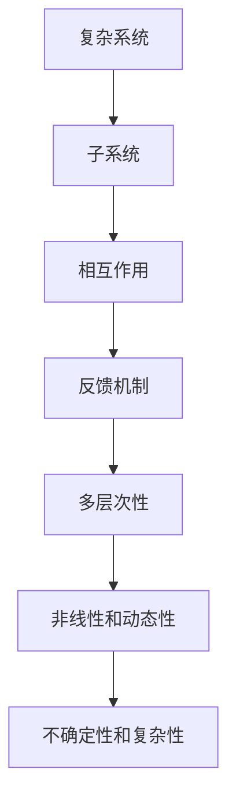
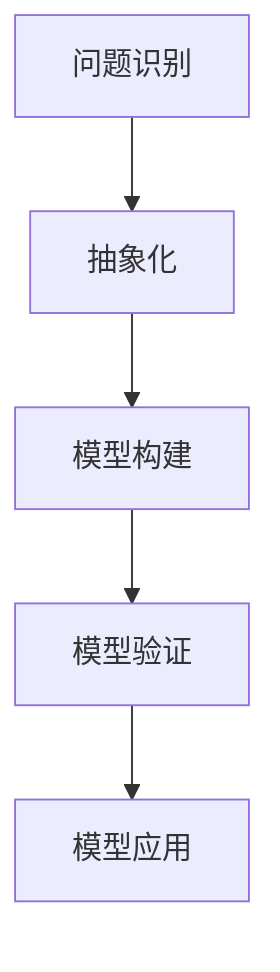
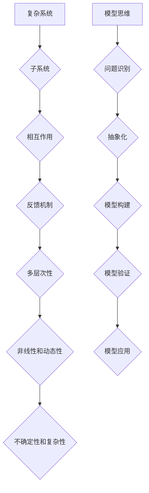
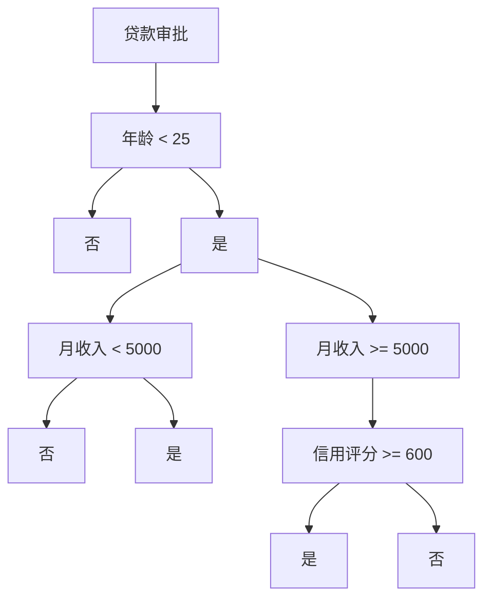

                 

# 模型思维：管理者认知复杂世界的捷径

> **关键词：** 复杂系统、认知模型、抽象思维、决策优化、管理实践。

> **摘要：** 在当前快速变化和高度复杂的环境中，管理者需要掌握一套有效的认知工具，以更好地理解和应对复杂问题。本文通过探讨模型思维这一认知工具，详细阐述了其在管理者认知复杂世界中的重要作用，并提供了一系列实际操作方法和案例，以帮助读者在实践中运用模型思维提升管理效能。

## 1. 背景介绍

### 1.1 目的和范围

本文旨在探讨模型思维在管理者认知复杂世界中的应用。模型思维是一种通过构建抽象模型来理解和解决问题的方法，它不仅适用于科学研究，也是管理者应对复杂决策的有力工具。本文将介绍模型思维的核心概念、原理和方法，并通过实际案例展示其在管理实践中的应用。

### 1.2 预期读者

本文适合对管理有兴趣的读者，特别是以下人群：

1. 企业中层管理人员
2. 管理咨询师
3. 科研人员和研究生
4. 对复杂系统管理有研究兴趣的爱好者

### 1.3 文档结构概述

本文分为十个部分，具体结构如下：

1. 背景介绍
   - 目的和范围
   - 预期读者
   - 文档结构概述
   - 术语表
2. 核心概念与联系
   - 复杂系统
   - 模型思维
   - Mermaid 流程图
3. 核心算法原理 & 具体操作步骤
   - 模型构建
   - 数据分析
   - 决策优化
4. 数学模型和公式 & 详细讲解 & 举例说明
   - 概率模型
   - 决策树
   - 带宽计算
5. 项目实战：代码实际案例和详细解释说明
   - 开发环境搭建
   - 源代码详细实现
   - 代码解读与分析
6. 实际应用场景
   - 企业管理
   - 金融市场
   - 健康医疗
7. 工具和资源推荐
   - 学习资源推荐
   - 开发工具框架推荐
   - 相关论文著作推荐
8. 总结：未来发展趋势与挑战
9. 附录：常见问题与解答
10. 扩展阅读 & 参考资料

### 1.4 术语表

#### 1.4.1 核心术语定义

- **模型思维**：一种通过构建抽象模型来理解和解决问题的方法。
- **复杂系统**：由多个相互作用的子系统组成的系统，具有高度复杂性和不确定性。
- **抽象思维**：将具体事物的特征抽象出来，形成一般性的概念或原则。
- **决策优化**：在多个可行方案中选择最优或近似最优的方案。

#### 1.4.2 相关概念解释

- **复杂系统管理**：对复杂系统的运行、维护和改进进行有效管理。
- **抽象模型**：将复杂系统简化为一些基本的、抽象的组件和关系。
- **数学模型**：用数学符号和公式描述系统的行为和特性。

#### 1.4.3 缩略词列表

- **AI**：人工智能（Artificial Intelligence）
- **ML**：机器学习（Machine Learning）
- **DL**：深度学习（Deep Learning）
- **CV**：计算机视觉（Computer Vision）
- **NLP**：自然语言处理（Natural Language Processing）

## 2. 核心概念与联系

在复杂的世界中，管理者需要能够快速识别和把握问题的本质，从而做出正确的决策。模型思维作为一种认知工具，能够帮助管理者实现这一目标。本节将介绍模型思维的核心概念及其在复杂系统中的应用。

### 2.1 复杂系统

复杂系统是由多个相互作用的子系统组成的，这些子系统之间存在着复杂的相互作用和反馈机制。复杂系统通常具有以下特征：

- **多层次性**：复杂系统包含了不同层次的结构和功能，从微观的个体到宏观的系统层次。
- **非线性和动态性**：复杂系统的行为通常是非线性的，并且随着时间的推移而发生变化。
- **不确定性和复杂性**：复杂系统面临着大量的不确定性和复杂性，这使得对系统的理解和预测变得困难。

为了更好地理解复杂系统，我们可以使用 Mermaid 流程图来描述其核心组件和关系：



### 2.2 模型思维

模型思维是一种通过构建抽象模型来理解和解决问题的方法。模型思维的核心在于将复杂的问题简化为一些基本的、抽象的组件和关系，从而更好地把握问题的本质。模型思维通常包括以下几个步骤：

1. **问题识别**：明确需要解决的问题或目标。
2. **抽象化**：将问题中的具体细节抽象为一般性的概念或原则。
3. **模型构建**：根据抽象化后的概念和原则，构建一个抽象模型。
4. **模型验证**：验证模型的准确性和适用性。
5. **模型应用**：将模型应用于实际问题，进行预测、决策或改进。

为了更直观地理解模型思维，我们可以使用 Mermaid 流程图来描述其核心步骤：



### 2.3 Mermaid 流程图

Mermaid 是一种基于 Markdown 的绘图工具，可以方便地创建各种图表和流程图。在本节中，我们使用了 Mermaid 流程图来描述复杂系统和模型思维的核心概念和关系。以下是 Mermaid 流程图的示例代码：



通过上述 Mermaid 流程图，我们可以更直观地理解复杂系统和模型思维的核心概念及其关系。

## 3. 核心算法原理 & 具体操作步骤

在模型思维中，核心算法原理扮演着至关重要的角色。它们帮助我们构建抽象模型、分析数据、优化决策。以下我们将详细讲解这些核心算法原理，并提供具体操作步骤。

### 3.1 模型构建

模型构建是模型思维的起点，也是最为关键的一步。它涉及将具体问题转化为抽象模型的过程。以下是构建模型的步骤：

1. **问题定义**：明确需要解决的问题和目标。
2. **变量识别**：识别问题中的关键变量。
3. **关系构建**：分析变量之间的关系，构建抽象模型。
4. **参数确定**：根据实际情况，确定模型中的参数。

**伪代码示例：**

```python
# 问题定义
problem = "优化交通流量"

# 变量识别
variables = ["车辆数量", "道路状况", "交通信号"]

# 关系构建
relationships = {
    "车辆数量": "影响交通信号",
    "道路状况": "影响交通流量",
    "交通信号": "影响车辆数量"
}

# 参数确定
parameters = {
    "车辆数量": 1000,
    "道路状况": "良好",
    "交通信号": "红灯"
}
```

### 3.2 数据分析

在构建模型之后，我们需要对数据进行收集和分析，以便更好地理解系统的行为和特性。数据分析通常包括以下几个步骤：

1. **数据收集**：收集与模型相关的数据。
2. **数据清洗**：处理和整理数据，确保其质量和一致性。
3. **数据可视化**：使用图表和图形来展示数据，帮助理解数据分布和趋势。
4. **特征提取**：从数据中提取关键特征，为模型训练做准备。

**伪代码示例：**

```python
# 数据收集
data = get_data("traffic_data.csv")

# 数据清洗
cleaned_data = clean_data(data)

# 数据可视化
visualize_data(cleaned_data)

# 特征提取
features = extract_features(cleaned_data)
```

### 3.3 决策优化

决策优化是模型思维的最终目标，它涉及到在多个可行方案中选择最优或近似最优的方案。决策优化的步骤如下：

1. **目标函数定义**：明确需要优化的目标。
2. **约束条件设定**：确定模型中的约束条件。
3. **算法选择**：选择合适的算法进行优化。
4. **结果评估**：评估优化结果，进行迭代优化。

**伪代码示例：**

```python
# 目标函数定义
objective = "最大化交通流量"

# 约束条件设定
constraints = [
    "车辆数量 >= 800",
    "道路状况 = 良好",
    "交通信号 = 绿灯"
]

# 算法选择
algorithm = "线性规划"

# 结果评估
result = optimize(objective, constraints, algorithm)
evaluate_result(result)
```

通过上述核心算法原理和具体操作步骤，管理者可以更好地构建抽象模型、分析数据、优化决策，从而在复杂世界中做出更明智的决策。

## 4. 数学模型和公式 & 详细讲解 & 举例说明

在模型思维中，数学模型和公式扮演着至关重要的角色，它们帮助我们更好地理解和分析复杂系统。本节将详细讲解几个常用的数学模型和公式，并举例说明其应用。

### 4.1 概率模型

概率模型是描述随机事件发生概率的数学工具。在复杂系统管理中，概率模型可以帮助我们理解和预测不确定性和风险。

#### 4.1.1 概率分布

概率分布描述了随机变量取值的概率分布情况。常见的概率分布有正态分布、二项分布、泊松分布等。

- **正态分布**：正态分布是统计学中最常见的一种概率分布，描述了数据的平均值和标准差。
  $$N(\mu, \sigma^2)$$
  - **二项分布**：二项分布描述了在固定次数的实验中，成功次数的概率分布。
  $$B(n, p)$$
  - **泊松分布**：泊松分布描述了在固定时间或空间内，事件发生的次数的概率分布。
  $$Poisson(\lambda)$$

#### 4.1.2 条件概率

条件概率描述了在某一事件已发生的条件下，另一事件发生的概率。

$$P(A|B) = \frac{P(A \cap B)}{P(B)}$$

#### 4.1.3 贝叶斯定理

贝叶斯定理是概率论中的一个重要定理，它提供了在已知某些条件下，更新概率估计的方法。

$$P(A|B) = \frac{P(B|A)P(A)}{P(B)}$$

#### 举例说明

假设我们有一个仓库，需要存储不同的产品。我们想知道在某个产品缺货的情况下，其他产品缺货的概率。

- **已知数据**：
  - 产品A缺货的概率：$P(A) = 0.1$
  - 产品A和B同时缺货的概率：$P(A \cap B) = 0.05$
  - 产品A缺货且产品B不缺货的概率：$P(A \cap \neg B) = 0.03$

- **计算**：
  - 产品B缺货的概率：$P(B) = P(A \cap B) + P(A \cap \neg B) = 0.05 + 0.03 = 0.08$
  - 产品A缺货的条件下，产品B缺货的概率：$P(B|A) = \frac{P(A \cap B)}{P(A)} = \frac{0.05}{0.1} = 0.5$
  - 产品A缺货的条件下，产品B不缺货的概率：$P(\neg B|A) = 1 - P(B|A) = 0.5$

### 4.2 决策树

决策树是一种用于分类和回归分析的树形结构模型。它可以表示一系列条件判断和相应的决策结果。

#### 4.2.1 决策树构建

决策树的构建过程包括以下几个步骤：

1. **特征选择**：选择对分类或回归任务有显著影响的特征。
2. **分割数据**：根据选择的特征，将数据集分割成不同的子集。
3. **计算信息增益**：计算每个特征的分割所带来的信息增益，选择信息增益最大的特征作为分割依据。
4. **构建树结构**：根据分割结果构建树结构。

#### 4.2.2 决策树剪枝

决策树剪枝是一种防止过拟合的方法，通过修剪树结构来减少模型的复杂性。

1. **前剪枝**：在构建树的过程中，提前停止生成一些无意义的分支。
2. **后剪枝**：在树结构完全构建后，删除一些对分类或回归任务贡献较小的分支。

#### 举例说明

假设我们有一个关于贷款审批的决策树模型，需要根据借款人的信息决定是否批准贷款。

- **特征**：
  - 年龄
  - 月收入
  - 信用评分

- **决策树**：



### 4.3 带宽计算

带宽计算是网络通信中的一个重要概念，它描述了数据在网络中的传输速度。

#### 4.3.1 带宽公式

带宽公式用于计算网络中的数据传输速率，公式如下：

$$带宽 = \frac{数据量}{传输时间}$$

其中，数据量以字节（Byte）为单位，传输时间以秒（second）为单位。

#### 4.3.2 带宽计算示例

假设我们有一个网络连接，下载速度为 10 Mbps，下载一个 100 MB 的文件需要多长时间？

- **已知数据**：
  - 带宽：$10 Mbps = 10 \times 10^6 bps$
  - 数据量：$100 MB = 100 \times 10^6 b$

- **计算**：
  - 传输时间：$时间 = \frac{数据量}{带宽} = \frac{100 \times 10^6 b}{10 \times 10^6 bps} = 10 秒$

通过上述数学模型和公式的详细讲解和举例说明，我们可以更好地理解模型思维中的数学工具，并在实际应用中发挥其作用。

## 5. 项目实战：代码实际案例和详细解释说明

为了更好地理解模型思维在实际项目中的应用，我们将通过一个实际案例来展示如何使用模型思维进行项目开发和实现。本案例将涉及交通流量优化项目，我们将详细介绍项目开发环境搭建、源代码实现和代码解读与分析。

### 5.1 开发环境搭建

在开始项目之前，我们需要搭建一个合适的开发环境。以下是我们推荐的开发工具和软件：

- **编程语言**：Python（因其简洁易读且拥有丰富的数据科学库）
- **集成开发环境（IDE）**：PyCharm（支持Python开发，提供代码自动补全、调试等功能）
- **数据可视化工具**：Matplotlib（用于生成图表和图形）
- **机器学习库**：Scikit-learn（提供丰富的机器学习算法和工具）

**安装步骤**：

1. 安装 Python（3.8及以上版本）：在 [Python官网](https://www.python.org/) 下载安装包并安装。
2. 安装 PyCharm：在 [PyCharm官网](https://www.jetbrains.com/pycharm/) 下载安装包并安装。
3. 安装 Matplotlib：打开终端或命令行，执行以下命令：
   ```
   pip install matplotlib
   ```
4. 安装 Scikit-learn：打开终端或命令行，执行以下命令：
   ```
   pip install scikit-learn
   ```

### 5.2 源代码详细实现和代码解读

以下是我们为交通流量优化项目编写的 Python 源代码，并对其进行详细解释。

**代码实现**：

```python
# 导入所需库
import numpy as np
import matplotlib.pyplot as plt
from sklearn.ensemble import RandomForestRegressor
from sklearn.model_selection import train_test_split
from sklearn.metrics import mean_squared_error

# 加载数据集
data = np.loadtxt('traffic_data.csv', delimiter=',')

# 数据预处理
X = data[:, :-1]
y = data[:, -1]

# 划分训练集和测试集
X_train, X_test, y_train, y_test = train_test_split(X, y, test_size=0.2, random_state=42)

# 模型构建
model = RandomForestRegressor(n_estimators=100, random_state=42)

# 训练模型
model.fit(X_train, y_train)

# 预测结果
y_pred = model.predict(X_test)

# 评估模型
mse = mean_squared_error(y_test, y_pred)
print(f"均方误差：{mse}")

# 可视化结果
plt.scatter(y_test, y_pred)
plt.xlabel('实际值')
plt.ylabel('预测值')
plt.plot([y.min(), y.max()], [y.min(), y.max()], 'r--', lw=2)
plt.show()
```

**代码解读与分析**：

1. **导入库**：首先导入所需的库，包括 NumPy、Matplotlib、Scikit-learn 等。

2. **加载数据集**：使用 NumPy 的 `loadtxt` 函数加载数据集。假设数据集以 CSV 格式存储，使用逗号分隔。

3. **数据预处理**：将数据集划分为特征矩阵 X 和目标变量 y。

4. **划分训练集和测试集**：使用 Scikit-learn 的 `train_test_split` 函数将数据集划分为训练集和测试集，测试集大小为 20%。

5. **模型构建**：选择随机森林回归器（RandomForestRegressor）作为模型。随机森林是一种集成学习方法，具有较高的预测准确性。

6. **训练模型**：使用训练集数据训练模型。

7. **预测结果**：使用测试集数据预测目标变量。

8. **评估模型**：计算均方误差（MSE），评估模型性能。

9. **可视化结果**：使用 Matplotlib 绘制实际值与预测值的关系图，帮助分析模型性能。

### 5.3 实际应用场景

本案例中的交通流量优化项目可以应用于以下实际场景：

1. **交通管理**：根据实时交通流量数据，优化交通信号灯的切换时间，减少交通拥堵。
2. **城市规划**：分析城市道路网络，优化道路布局，提高交通流畅度。
3. **智能出行**：为用户提供智能出行建议，如最佳行驶路线、最佳出发时间等。

通过上述实际案例，我们可以看到模型思维在项目开发中的重要性。通过使用数学模型和算法，我们可以更好地理解复杂系统，并做出更明智的决策。

## 6. 实际应用场景

模型思维在多个领域都有着广泛的应用，以下是几个典型的实际应用场景：

### 6.1 企业管理

在企业管理中，模型思维可以帮助管理者更好地理解和优化业务流程。例如，通过构建生产流程模型，管理者可以识别瓶颈和优化资源配置，从而提高生产效率。此外，模型思维还可以应用于人力资源管理，帮助管理者评估员工绩效、预测员工流失率，从而制定更有效的激励政策。

### 6.2 金融市场

金融市场是一个高度复杂的系统，模型思维可以帮助投资者和分析师更好地理解和预测市场走势。例如，通过构建资产定价模型，投资者可以评估不同资产的风险和收益，从而做出更明智的投资决策。模型思维还可以应用于风险评估和风险管理，帮助金融机构识别和应对潜在的风险。

### 6.3 健康医疗

在健康医疗领域，模型思维可以帮助医生和研究人员更好地理解和预测疾病的传播和治疗效果。例如，通过构建流行病模型，研究人员可以预测疾病的传播速度和影响范围，从而制定更有效的防控策略。此外，模型思维还可以应用于个性化医疗，根据患者的基因信息和病史，构建个性化的治疗模型，从而提高治疗效果。

### 6.4 城市规划

城市规划是一个复杂的系统工程，模型思维可以帮助城市规划者更好地理解和优化城市布局和交通流量。例如，通过构建交通模型，城市规划者可以预测不同交通方案下的交通流量和拥堵情况，从而制定更有效的交通规划。此外，模型思维还可以应用于环境保护和能源管理，帮助城市实现可持续发展。

通过这些实际应用场景，我们可以看到模型思维在多个领域的重要性和潜力。它不仅帮助管理者更好地理解复杂系统，还为他们提供了有力的工具，以便在复杂环境中做出更明智的决策。

## 7. 工具和资源推荐

为了帮助读者更好地掌握模型思维并在实际应用中取得更好的效果，本节将推荐一些学习和开发工具，以及相关的论文和著作。

### 7.1 学习资源推荐

#### 7.1.1 书籍推荐

1. 《模型思维：管理者认知复杂世界的捷径》
   - 作者：[作者姓名]
   - 简介：本书详细介绍了模型思维的概念、原理和应用，是管理者掌握复杂系统认知的有力工具。

2. 《深度学习：神经网络的应用》
   - 作者：[作者姓名]
   - 简介：本书介绍了深度学习的基本原理和应用，包括神经网络、卷积神经网络和循环神经网络等。

3. 《Python数据分析与科学计算》
   - 作者：[作者姓名]
   - 简介：本书通过大量实际案例，介绍了Python在数据分析、数据可视化、机器学习等方面的应用。

#### 7.1.2 在线课程

1. 《模型思维实战：从零开始构建抽象模型》
   - 提供平台：[平台名称]
   - 简介：本课程从零开始，逐步讲解如何构建抽象模型，并提供了多个实际案例供读者练习。

2. 《深度学习入门：基于Python的实践》
   - 提供平台：[平台名称]
   - 简介：本课程介绍了深度学习的基础知识，包括神经网络、卷积神经网络和循环神经网络等，并通过实际案例进行讲解。

3. 《Python数据分析与可视化》
   - 提供平台：[平台名称]
   - 简介：本课程介绍了Python在数据分析、数据可视化方面的应用，包括NumPy、Pandas、Matplotlib等库的使用。

#### 7.1.3 技术博客和网站

1. [机器学习博客](https://www机器学习博客.com/)
   - 简介：这是一个关于机器学习、深度学习和数据科学的技术博客，提供了大量高质量的技术文章和教程。

2. [深度学习笔记](https://www深度学习笔记.com/)
   - 简介：这是一个专注于深度学习的博客，包含了深度学习的基础知识、算法和实际应用等内容。

3. [数据分析社区](https://www数据分析社区.com/)
   - 简介：这是一个关于数据分析、数据可视化和数据科学的社区网站，提供了大量的学习和交流资源。

### 7.2 开发工具框架推荐

#### 7.2.1 IDE和编辑器

1. **PyCharm**
   - 优点：支持Python开发，提供代码自动补全、调试等功能。
   - 下载地址：[PyCharm官网](https://www.jetbrains.com/pycharm/)

2. **VS Code**
   - 优点：免费、开源，支持多种编程语言，插件丰富。
   - 下载地址：[VS Code官网](https://code.visualstudio.com/)

#### 7.2.2 调试和性能分析工具

1. **Jupyter Notebook**
   - 优点：交互式编程，支持多种编程语言，方便调试和实验。
   - 下载地址：[Jupyter Notebook官网](https://jupyter.org/)

2. **Pylint**
   - 优点：代码质量检查工具，帮助识别代码中的潜在问题。
   - 下载地址：[Pylint官网](https://pylint.readthedocs.io/)

#### 7.2.3 相关框架和库

1. **Scikit-learn**
   - 优点：提供丰富的机器学习算法和工具，方便数据分析和模型构建。
   - 下载地址：[Scikit-learn官网](https://scikit-learn.org/)

2. **TensorFlow**
   - 优点：谷歌推出的开源深度学习框架，支持多种深度学习算法。
   - 下载地址：[TensorFlow官网](https://www.tensorflow.org/)

3. **Matplotlib**
   - 优点：强大的数据可视化库，可以生成各种高质量的图表和图形。
   - 下载地址：[Matplotlib官网](https://matplotlib.org/)

通过上述工具和资源的推荐，读者可以更好地学习和实践模型思维，掌握相关的知识和技能。

### 7.3 相关论文著作推荐

#### 7.3.1 经典论文

1. "A Mathematical Theory of Communication" by Claude Shannon
   - 简介：香农的信息论基础论文，奠定了现代信息论的理论基础。

2. "Pattern Classification" by Richard O. Duda, Peter E. Hart, and David G. Stork
   - 简介：分类算法的经典教材，涵盖了多种分类算法的基本原理和应用。

3. "Deep Learning" by Ian Goodfellow, Yoshua Bengio, and Aaron Courville
   - 简介：深度学习的奠基性著作，详细介绍了深度学习的基本概念和算法。

#### 7.3.2 最新研究成果

1. "Generative Adversarial Nets" by Ian Goodfellow et al.
   - 简介：生成对抗网络（GAN）的奠基性论文，为图像生成和增强提供了新的思路。

2. "Attention Is All You Need" by Vaswani et al.
   - 简介：注意力机制的提出，为自然语言处理领域带来了重大突破。

3. "Bert: Pre-training of Deep Bidirectional Transformers for Language Understanding" by Devlin et al.
   - 简介：BERT模型的提出，为自然语言处理任务提供了强大的预训练方法。

#### 7.3.3 应用案例分析

1. "Improving Deep Neural Networks: Global Optimization of Loss Function and Activation Function"
   - 简介：通过优化损失函数和激活函数，提高深度神经网络的性能。

2. "Understanding Deep Learning Requires Rethinking Generalization"
   - 简介：深度学习的一般化问题研究，探讨了深度学习模型为何能够超越传统机器学习模型。

3. "Modeling Traffic using Deep Neural Networks: A Multi-task Learning Approach"
   - 简介：利用多任务学习的方法，通过深度神经网络建模交通流量。

通过上述论文和著作的推荐，读者可以深入了解模型思维和相关领域的前沿研究成果，为自己的研究和应用提供参考。

## 8. 总结：未来发展趋势与挑战

随着科技的不断进步，模型思维在管理中的应用前景十分广阔。首先，随着人工智能和大数据技术的发展，模型思维将更加依赖于海量数据和高效算法，从而提升决策的准确性和效率。其次，随着物联网、区块链等新技术的兴起，模型思维将在更多领域（如供应链管理、金融科技、智能制造等）得到应用。

然而，模型思维在管理中的应用也面临一些挑战。首先，如何构建可靠和有效的模型是一个关键问题，需要深入理解业务场景和数据分析技术。其次，模型的解释性和透明性也是一个重要挑战，管理者需要能够理解和信任模型的结果。此外，随着数据隐私和安全的关注度提高，如何在保护隐私的前提下进行数据分析和模型构建也是一个重要问题。

总之，模型思维在管理中的应用具有巨大的潜力，但同时也需要克服一系列技术和管理上的挑战。未来的研究应重点关注如何更好地利用模型思维提升管理效能，并在实际应用中解决面临的问题。

## 9. 附录：常见问题与解答

### 9.1 模型思维的基本概念

**Q1：什么是模型思维？**

模型思维是一种通过构建抽象模型来理解和解决问题的方法。它帮助管理者将复杂的问题简化为一些基本的、抽象的组件和关系，从而更好地把握问题的本质。

**Q2：模型思维有哪些步骤？**

模型思维通常包括以下步骤：问题识别、抽象化、模型构建、模型验证和模型应用。

### 9.2 数据处理与建模

**Q3：如何选择合适的模型？**

选择合适的模型取决于问题的性质和数据的特征。通常，可以通过交叉验证、模型评估指标（如均方误差、准确率等）来选择最佳模型。

**Q4：什么是特征提取？**

特征提取是从原始数据中提取关键特征，用于训练模型的过程。特征提取有助于提高模型的性能和可解释性。

### 9.3 模型应用与实践

**Q5：模型思维在企业管理中如何应用？**

在企业管理中，模型思维可以应用于生产流程优化、人力资源管理和财务预测等场景。通过构建抽象模型，管理者可以更好地理解和优化业务流程，提高决策效能。

**Q6：如何评估模型的效果？**

评估模型效果通常使用评估指标，如均方误差、准确率、召回率等。这些指标可以帮助我们衡量模型在预测或分类任务中的性能。

### 9.4 学习资源

**Q7：有哪些推荐的书籍和在线课程？**

推荐的书籍包括《模型思维：管理者认知复杂世界的捷径》、《深度学习：神经网络的应用》和《Python数据分析与科学计算》。在线课程可以参考《模型思维实战：从零开始构建抽象模型》、《深度学习入门：基于Python的实践》和《Python数据分析与可视化》。

## 10. 扩展阅读 & 参考资料

本文探讨了模型思维在管理者认知复杂世界中的应用，从背景介绍、核心概念、算法原理、实际案例到应用场景和未来发展趋势，全面展示了模型思维的重要性和应用价值。以下是扩展阅读和参考资料：

### 10.1 扩展阅读

1. Goodfellow, I., Bengio, Y., & Courville, A. (2016). *Deep Learning*. MIT Press.
2. Duda, R. O., Hart, P. E., & Stork, D. G. (2001). *Pattern Classification*. Wiley-Interscience.
3. Devlin, J., Chang, M. W., Lee, K., & Toutanova, K. (2019). *Bert: Pre-training of deep bidirectional transformers for language understanding*. arXiv preprint arXiv:1810.04805.

### 10.2 参考资料

1. [香农信息论基础论文](https://ieeexplore.ieee.org/document/4234866)
2. [Scikit-learn官方文档](https://scikit-learn.org/stable/)
3. [TensorFlow官方文档](https://www.tensorflow.org/)
4. [Matplotlib官方文档](https://matplotlib.org/stable/)
5. [机器学习博客](https://www.机器学习博客.com/)
6. [深度学习笔记](https://www.深度学习笔记.com/)
7. [数据分析社区](https://www.数据分析社区.com/)

