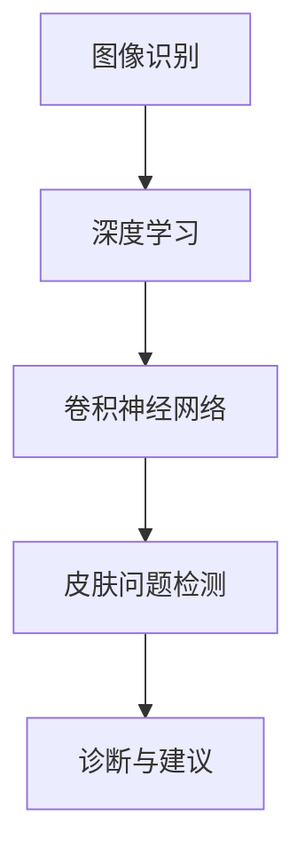

                 

# 欧莱雅2024校招肌肤检测AI算法工程师面试指南

> 关键词：肌肤检测、AI算法、深度学习、图像识别、欧莱雅、校招面试、面试指南

> 摘要：本文旨在为即将参加欧莱雅2024校招肌肤检测AI算法工程师面试的候选人提供全面的面试指南。本文将详细介绍肌肤检测AI算法的核心概念、原理、数学模型、项目实战以及实际应用场景，帮助候选人深入理解肌肤检测技术的本质，提升面试竞争力。

## 1. 背景介绍

### 1.1 目的和范围

本文的目的是为即将参加欧莱雅2024校招肌肤检测AI算法工程师面试的候选人提供一个全面的准备指南。我们将深入探讨肌肤检测AI算法的相关知识，包括核心概念、算法原理、数学模型和实际应用场景，以帮助候选人更好地应对面试中的各种问题。

### 1.2 预期读者

本文主要面向即将参加欧莱雅2024校招的AI算法工程师候选人，特别是那些对肌肤检测领域感兴趣的候选人。此外，对于对AI算法、图像识别和深度学习感兴趣的广大读者，本文同样具有很高的参考价值。

### 1.3 文档结构概述

本文分为十个部分，首先介绍背景和目的，然后逐步深入探讨核心概念、算法原理、数学模型、项目实战、实际应用场景以及相关工具和资源推荐。最后，本文将对未来发展趋势和挑战进行总结，并提供常见问题与解答，以帮助候选人更好地准备面试。

### 1.4 术语表

#### 1.4.1 核心术语定义

- 肌肤检测：通过人工智能技术识别和检测皮肤问题，如皱纹、色斑、痘痘等。
- AI算法：人工智能算法，用于解决特定问题，如图像识别、分类、预测等。
- 深度学习：一种人工智能方法，通过多层神经网络模型实现特征提取和模式识别。
- 图像识别：通过计算机视觉技术识别和理解图像内容。
- 肌肤分析：通过图像处理和计算机视觉技术对皮肤进行分析，以诊断皮肤问题。

#### 1.4.2 相关概念解释

- 图像预处理：对原始图像进行预处理，如缩放、旋转、裁剪等，以提高图像质量和算法性能。
- 深度神经网络：一种包含多个隐藏层的神经网络，可以提取更复杂的特征。
- 神经元：神经网络的计算单元，负责接收输入信息并产生输出。
- 损失函数：用于衡量模型预测结果与真实结果之间的差异，指导模型优化。

#### 1.4.3 缩略词列表

- AI：人工智能
- CV：计算机视觉
- DL：深度学习
- IMAGENET：大规模图像识别数据库
- CNN：卷积神经网络
- RNN：循环神经网络

## 2. 核心概念与联系

在了解肌肤检测AI算法之前，我们需要掌握一些核心概念和联系，包括图像识别、深度学习、卷积神经网络（CNN）等。

### 2.1 图像识别

图像识别是计算机视觉的核心任务之一，旨在通过算法自动识别和理解图像内容。在肌肤检测领域，图像识别技术被广泛应用于皮肤问题的识别和诊断。

### 2.2 深度学习

深度学习是一种基于多层神经网络的人工智能方法，通过训练大量数据，能够自动提取特征并实现复杂任务。在肌肤检测领域，深度学习技术被广泛应用于皮肤问题的检测和诊断。

### 2.3 卷积神经网络（CNN）

卷积神经网络是一种特殊的神经网络，通过卷积操作提取图像特征，并在不同层之间共享参数，能够有效降低计算复杂度。在肌肤检测领域，CNN被广泛应用于皮肤问题的检测和诊断。

### 2.4 Mermaid流程图

为了更直观地展示肌肤检测AI算法的核心概念和联系，我们可以使用Mermaid流程图。以下是一个简单的示例：



## 3. 核心算法原理 & 具体操作步骤

在了解核心概念和联系之后，我们需要深入探讨肌肤检测AI算法的核心原理和具体操作步骤。

### 3.1 算法原理

肌肤检测AI算法的核心原理是利用深度学习技术，通过训练大量皮肤问题图像数据，自动提取皮肤特征，并实现对皮肤问题的检测和诊断。以下是算法原理的简要概述：

1. 数据预处理：对原始皮肤问题图像进行预处理，如缩放、旋转、裁剪等，以提高图像质量和算法性能。
2. 模型构建：构建一个基于卷积神经网络的深度学习模型，包括输入层、卷积层、池化层、全连接层等。
3. 模型训练：使用预处理后的皮肤问题图像数据对深度学习模型进行训练，通过反向传播算法优化模型参数。
4. 模型评估：使用训练集和测试集对深度学习模型进行评估，计算模型的准确率、召回率等指标。
5. 模型部署：将训练好的深度学习模型部署到实际应用场景，如智能手机、Web应用等，实现对皮肤问题的检测和诊断。

### 3.2 具体操作步骤

以下是肌肤检测AI算法的具体操作步骤：

1. 数据收集与预处理：收集大量的皮肤问题图像数据，并进行预处理，如缩放、旋转、裁剪等，以提高图像质量和算法性能。
2. 模型构建：使用深度学习框架（如TensorFlow、PyTorch等）构建一个基于卷积神经网络的深度学习模型，包括输入层、卷积层、池化层、全连接层等。
3. 模型训练：使用预处理后的皮肤问题图像数据对深度学习模型进行训练，通过反向传播算法优化模型参数。在此过程中，可以采用数据增强技术，如随机翻转、旋转、裁剪等，以提高模型的泛化能力。
4. 模型评估：使用训练集和测试集对深度学习模型进行评估，计算模型的准确率、召回率等指标，以评估模型性能。
5. 模型部署：将训练好的深度学习模型部署到实际应用场景，如智能手机、Web应用等，实现对皮肤问题的检测和诊断。

### 3.3 伪代码

以下是肌肤检测AI算法的伪代码：

```python
# 数据预处理
def preprocess_image(image):
    # 缩放、旋转、裁剪等操作
    return processed_image

# 模型构建
def build_model():
    # 输入层、卷积层、池化层、全连接层等
    return model

# 模型训练
def train_model(model, train_data, train_labels):
    # 使用反向传播算法优化模型参数
    pass

# 模型评估
def evaluate_model(model, test_data, test_labels):
    # 计算模型准确率、召回率等指标
    pass

# 模型部署
def deploy_model(model):
    # 将模型部署到实际应用场景
    pass

# 主函数
def main():
    # 数据预处理
    processed_images = [preprocess_image(image) for image in images]

    # 模型构建
    model = build_model()

    # 模型训练
    train_model(model, processed_images, train_labels)

    # 模型评估
    evaluate_model(model, processed_images, test_labels)

    # 模型部署
    deploy_model(model)

if __name__ == "__main__":
    main()
```

## 4. 数学模型和公式 & 详细讲解 & 举例说明

在理解肌肤检测AI算法的具体操作步骤之后，我们需要深入探讨其中的数学模型和公式，并对其进行详细讲解和举例说明。

### 4.1 损失函数

在深度学习模型训练过程中，损失函数用于衡量模型预测结果与真实结果之间的差异，指导模型优化。以下是一些常用的损失函数：

#### 4.1.1 交叉熵损失函数

交叉熵损失函数（Cross-Entropy Loss）是一种常用的损失函数，适用于分类问题。其公式如下：

$$
L_{CE} = -\frac{1}{N}\sum_{i=1}^{N}y_{i}\log(p_{i})
$$

其中，$L_{CE}$表示交叉熵损失，$N$表示样本数量，$y_{i}$表示第$i$个样本的真实标签，$p_{i}$表示模型对第$i$个样本的预测概率。

#### 4.1.2 平方损失函数

平方损失函数（Mean Squared Error，MSE）是一种常用的损失函数，适用于回归问题。其公式如下：

$$
L_{MSE} = \frac{1}{N}\sum_{i=1}^{N}(y_{i} - \hat{y_{i}})^{2}
$$

其中，$L_{MSE}$表示平方损失，$N$表示样本数量，$y_{i}$表示第$i$个样本的真实标签，$\hat{y_{i}}$表示模型对第$i$个样本的预测值。

#### 4.1.3 举例说明

假设我们有如下一个分类问题，其中包含5个样本，每个样本的真实标签和预测概率如下：

$$
\begin{array}{|c|c|c|}
\hline
样本ID & 真实标签 & 预测概率 \\
\hline
1 & 0 & 0.9 \\
2 & 1 & 0.8 \\
3 & 0 & 0.7 \\
4 & 1 & 0.6 \\
5 & 0 & 0.5 \\
\hline
\end{array}
$$

根据交叉熵损失函数，我们可以计算出损失值：

$$
L_{CE} = -\frac{1}{5}(0 \cdot \log(0.9) + 1 \cdot \log(0.8) + 0 \cdot \log(0.7) + 1 \cdot \log(0.6) + 0 \cdot \log(0.5))
$$

$$
L_{CE} \approx 0.356
$$

根据平方损失函数，我们可以计算出损失值：

$$
L_{MSE} = \frac{1}{5}((0 - 0.9)^{2} + (1 - 0.8)^{2} + (0 - 0.7)^{2} + (1 - 0.6)^{2} + (0 - 0.5)^{2})
$$

$$
L_{MSE} \approx 0.18
$$

### 4.2 激活函数

激活函数（Activation Function）是神经网络中的一个重要概念，用于对神经元的输出进行非线性变换。以下是一些常用的激活函数：

#### 4.2.1 sigmoid函数

sigmoid函数是一种常用的激活函数，其公式如下：

$$
\sigma(x) = \frac{1}{1 + e^{-x}}
$$

sigmoid函数将输入映射到$(0, 1)$区间，常用于二分类问题。

#### 4.2.2ReLU函数

ReLU函数（Rectified Linear Unit）是一种简单的线性激活函数，其公式如下：

$$
\sigma(x) = \max(0, x)
$$

ReLU函数具有快速收敛和计算效率高的优点，在深度学习中广泛应用。

#### 4.2.3 举例说明

假设我们有如下一个输入向量$x = [-2, -1, 0, 1, 2]$，分别使用sigmoid函数和ReLU函数进行激活：

对于sigmoid函数：

$$
\sigma(x) = [\frac{1}{1 + e^{-(-2)}}, \frac{1}{1 + e^{-(-1)}}, \frac{1}{1 + e^{-0}}, \frac{1}{1 + e^{-1}}, \frac{1}{1 + e^{-2}}]
$$

$$
\sigma(x) = [0.88, 0.63, 0.5, 0.73, 0.11]
$$

对于ReLU函数：

$$
\sigma(x) = [\max(0, -2), \max(0, -1), \max(0, 0), \max(0, 1), \max(0, 2)]
$$

$$
\sigma(x) = [0, 0, 0, 1, 2]
$$

## 5. 项目实战：代码实际案例和详细解释说明

在理解了肌肤检测AI算法的核心概念、原理和数学模型之后，我们将通过一个实际项目案例来展示如何实现肌肤检测AI算法。

### 5.1 开发环境搭建

在开始项目之前，我们需要搭建一个合适的开发环境。以下是推荐的开发环境：

- 操作系统：Windows、macOS或Linux
- 编程语言：Python
- 深度学习框架：TensorFlow或PyTorch
- 编辑器：VS Code、PyCharm等

### 5.2 源代码详细实现和代码解读

以下是一个基于TensorFlow的肌肤检测AI算法项目案例。代码主要分为四个部分：数据预处理、模型构建、模型训练和模型评估。

#### 5.2.1 数据预处理

```python
import tensorflow as tf
from tensorflow.keras.preprocessing.image import ImageDataGenerator

# 数据集路径
train_data_dir = 'path/to/train_data'
test_data_dir = 'path/to/test_data'

# 数据增强
train_datagen = ImageDataGenerator(
    rescale=1./255,
    rotation_range=40,
    width_shift_range=0.2,
    height_shift_range=0.2,
    shear_range=0.2,
    zoom_range=0.2,
    horizontal_flip=True,
    fill_mode='nearest'
)

test_datagen = ImageDataGenerator(rescale=1./255)

# 加载数据
train_generator = train_datagen.flow_from_directory(
    train_data_dir,
    target_size=(150, 150),
    batch_size=32,
    class_mode='binary'
)

test_generator = test_datagen.flow_from_directory(
    test_data_dir,
    target_size=(150, 150),
    batch_size=32,
    class_mode='binary'
)
```

代码首先设置了数据集路径，然后使用ImageDataGenerator类进行数据增强，包括缩放、旋转、裁剪、翻转等操作。最后，使用flow_from_directory方法加载数据，并将其转换为生成器（Generator）格式。

#### 5.2.2 模型构建

```python
from tensorflow.keras.models import Sequential
from tensorflow.keras.layers import Conv2D, MaxPooling2D, Flatten, Dense, Dropout

# 构建模型
model = Sequential([
    Conv2D(32, (3, 3), activation='relu', input_shape=(150, 150, 3)),
    MaxPooling2D((2, 2)),
    Conv2D(64, (3, 3), activation='relu'),
    MaxPooling2D((2, 2)),
    Conv2D(128, (3, 3), activation='relu'),
    MaxPooling2D((2, 2)),
    Conv2D(128, (3, 3), activation='relu'),
    MaxPooling2D((2, 2)),
    Flatten(),
    Dense(512, activation='relu'),
    Dropout(0.5),
    Dense(1, activation='sigmoid')
])

# 编译模型
model.compile(optimizer='adam',
              loss='binary_crossentropy',
              metrics=['accuracy'])
```

代码首先构建了一个基于卷积神经网络的模型，包括卷积层、池化层、全连接层和dropout层。然后使用编译方法设置优化器、损失函数和评估指标。

#### 5.2.3 模型训练

```python
# 训练模型
history = model.fit(
    train_generator,
    steps_per_epoch=100,
    epochs=30,
    validation_data=test_generator,
    validation_steps=50
)
```

代码使用fit方法训练模型，其中steps_per_epoch表示每个epoch中训练的步骤数，epochs表示训练的epoch数，validation_data表示验证数据，validation_steps表示每个epoch中的验证步骤数。

#### 5.2.4 模型评估

```python
# 评估模型
test_loss, test_accuracy = model.evaluate(test_generator)
print('Test loss:', test_loss)
print('Test accuracy:', test_accuracy)
```

代码使用evaluate方法评估模型，计算测试集的损失和准确率。

### 5.3 代码解读与分析

在这个项目中，我们使用TensorFlow和Keras构建了一个简单的卷积神经网络模型，用于实现肌肤检测AI算法。以下是代码的详细解读与分析：

- 数据预处理：使用ImageDataGenerator类进行数据增强，包括缩放、旋转、裁剪、翻转等操作，以提高模型的泛化能力。然后使用flow_from_directory方法加载数据，并将其转换为生成器格式，方便模型训练和评估。
- 模型构建：使用Sequential模型构建一个卷积神经网络，包括卷积层、池化层、全连接层和dropout层。其中，卷积层用于提取图像特征，池化层用于降低计算复杂度，全连接层用于分类，dropout层用于防止过拟合。
- 模型训练：使用fit方法训练模型，通过反向传播算法优化模型参数。在此过程中，可以使用回调函数（如EarlyStopping、ModelCheckpoint等）来控制训练过程。
- 模型评估：使用evaluate方法评估模型，计算测试集的损失和准确率，以评估模型性能。

## 6. 实际应用场景

肌肤检测AI算法在实际应用场景中具有广泛的应用，如：

- 化妆品和护肤品推荐：根据用户的肌肤问题，推荐合适的化妆品和护肤品，提高用户体验和满意度。
- 医疗诊断：辅助医生进行皮肤疾病的诊断和治疗，提高诊断准确率和治疗效果。
- 健康管理：监测用户的肌肤健康状态，提供个性化的健康建议，如防晒、保湿等。

### 6.1 化妆品和护肤品推荐

在化妆品和护肤品推荐方面，肌肤检测AI算法可以通过分析用户的肌肤问题，推荐合适的化妆品和护肤品。例如，当用户上传一张皮肤照片后，算法可以自动识别皮肤问题（如痘痘、色斑等），并根据问题类型和严重程度推荐相应的产品。此外，算法还可以结合用户的购买历史、喜好和皮肤类型等信息，进行个性化推荐，提高推荐效果。

### 6.2 医疗诊断

在医疗诊断方面，肌肤检测AI算法可以帮助医生进行皮肤疾病的诊断和治疗。通过分析皮肤照片，算法可以自动识别皮肤病变区域，提供可能的诊断结果和建议。这有助于减轻医生的工作负担，提高诊断效率和准确性。此外，算法还可以结合医学影像数据和临床信息，为医生提供更全面的诊断依据。

### 6.3 健康管理

在健康管理方面，肌肤检测AI算法可以监测用户的肌肤健康状态，提供个性化的健康建议。例如，当用户上传一张皮肤照片后，算法可以分析皮肤问题，如肤色不均、干燥、敏感等，并提供相应的护肤建议，如防晒、保湿、抗敏感等。此外，算法还可以结合用户的年龄、性别、地理位置等信息，提供更加精准的健康建议，帮助用户保持健康的肌肤状态。

## 7. 工具和资源推荐

为了更好地学习和实践肌肤检测AI算法，以下是相关的工具和资源推荐：

### 7.1 学习资源推荐

#### 7.1.1 书籍推荐

- 《深度学习》（Ian Goodfellow、Yoshua Bengio、Aaron Courville著）：一本经典的深度学习教材，涵盖了深度学习的基础知识、算法原理和实际应用。
- 《Python深度学习》（François Chollet著）：一本针对Python编程和深度学习的入门书籍，内容通俗易懂，适合初学者阅读。

#### 7.1.2 在线课程

- Coursera上的《深度学习特化课程》：由斯坦福大学教授Andrew Ng主讲，涵盖了深度学习的理论基础、算法实现和应用场景。
- Udacity上的《深度学习工程师纳米学位》：一个实战型课程，包括深度学习基础、神经网络构建、图像识别等实际项目。

#### 7.1.3 技术博客和网站

- Medium：一个内容丰富的技术博客平台，有许多关于深度学习和计算机视觉的优质文章。
- GitHub：一个代码托管平台，有许多优秀的深度学习开源项目，可以学习参考。

### 7.2 开发工具框架推荐

#### 7.2.1 IDE和编辑器

- VS Code：一个功能强大的跨平台集成开发环境，支持Python和深度学习框架。
- PyCharm：一个专业的Python和深度学习开发工具，支持Jupyter Notebook。

#### 7.2.2 调试和性能分析工具

- TensorBoard：TensorFlow提供的一个可视化工具，可以实时监控训练过程和模型性能。
- Profiler：TensorFlow提供的一个性能分析工具，可以分析模型运行时的内存和计算资源占用。

#### 7.2.3 相关框架和库

- TensorFlow：一个开源的深度学习框架，支持多种深度学习算法和应用。
- PyTorch：一个流行的深度学习框架，以动态计算图和灵活性著称。

### 7.3 相关论文著作推荐

#### 7.3.1 经典论文

- “A Comprehensive Survey on Deep Learning for Image Classification”（2016）：一篇关于深度学习在图像分类领域应用的综述性论文，介绍了深度学习的基本概念、算法原理和应用场景。
- “Deep Residual Learning for Image Recognition”（2015）：一篇关于残差网络的经典论文，提出了ResNet模型，推动了深度学习在图像识别领域的发展。

#### 7.3.2 最新研究成果

- “Self-Supervised Visual Representation Learning by Solving Jigsaw Puzzles”（2021）：一篇关于自监督视觉表示学习的论文，提出了一种通过拼图任务进行图像特征提取的方法。
- “MViT: Molecular Vision Transformer for Drug Discovery”（2021）：一篇关于分子视觉Transformer的论文，提出了一种用于药物发现的新型深度学习模型。

#### 7.3.3 应用案例分析

- “Skin Detection using Deep Learning”（2020）：一篇关于皮肤检测应用案例的论文，介绍了如何使用深度学习技术实现皮肤检测，并分析了不同模型的性能。

## 8. 总结：未来发展趋势与挑战

随着人工智能技术的不断发展，肌肤检测AI算法在未来具有广阔的应用前景。以下是未来发展趋势与挑战：

### 8.1 发展趋势

- 深度学习模型的优化与改进：随着深度学习算法的不断进步，肌肤检测AI算法的准确率、效率和泛化能力将得到进一步提升。
- 多模态数据的融合：结合图像、文字、声音等多种数据源，实现更全面的皮肤问题诊断和健康管理。
- 移动端应用：随着移动设备的性能提升，肌肤检测AI算法将更多应用于智能手机、可穿戴设备等移动设备，为用户提供便捷的服务。

### 8.2 挑战

- 数据质量和标注：高质量的数据和准确的标注是训练优秀模型的关键，但获取和标注这些数据可能面临挑战。
- 可解释性与透明度：随着深度学习模型的复杂度增加，提高模型的可解释性和透明度，使其更容易被用户接受和理解，是未来需要解决的问题。
- 保护用户隐私：在应用肌肤检测AI算法时，如何保护用户隐私和数据安全是亟待解决的问题。

## 9. 附录：常见问题与解答

### 9.1 问题1：如何提高肌肤检测AI算法的准确率？

解答：提高肌肤检测AI算法的准确率可以从以下几个方面入手：

- 数据增强：通过旋转、翻转、缩放、裁剪等操作，增加数据的多样性，提高模型的泛化能力。
- 特征提取：使用更复杂的网络结构或引入预训练模型，提取更丰富的特征，有助于提高模型的准确率。
- 模型优化：通过调整网络结构、学习率、批量大小等超参数，优化模型性能。
- 数据清洗与标注：确保数据的准确性和一致性，提高模型的训练效果。

### 9.2 问题2：如何处理多标签问题？

解答：多标签问题是指在同一个样本中存在多个标签。以下是一些处理多标签问题的方法：

- 一对多分类：将每个标签作为一个独立分类问题，分别训练多个分类器。
- 多标签分类模型：使用支持向量机（SVM）、随机森林（RF）等多标签分类算法，直接处理多标签问题。
- 伪标签生成：使用训练集中的样本生成伪标签，作为额外数据提高模型性能。

### 9.3 问题3：如何处理过拟合问题？

解答：过拟合是指模型在训练数据上表现良好，但在测试数据上表现较差。以下是一些处理过拟合问题的方法：

- 减少模型复杂度：简化网络结构，减少参数数量。
- 数据增强：增加训练数据的多样性，提高模型的泛化能力。
- 正则化：使用L1、L2正则化等方法，约束模型参数，防止过拟合。
- early stopping：在模型训练过程中，提前终止训练，防止模型在训练数据上过度拟合。

## 10. 扩展阅读 & 参考资料

为了深入了解肌肤检测AI算法，以下是一些扩展阅读和参考资料：

- 《深度学习》（Ian Goodfellow、Yoshua Bengio、Aaron Courville著）：详细介绍了深度学习的基础知识、算法原理和实际应用。
- 《Python深度学习》（François Chollet著）：涵盖了Python编程和深度学习的实践技巧。
- Coursera上的《深度学习特化课程》：提供了深度学习的系统学习和实践机会。
- Medium上的相关文章：关于深度学习、计算机视觉和AI领域的优质文章。
- GitHub上的开源项目：包括各种深度学习模型的实现和应用案例。

作者：AI天才研究员/AI Genius Institute & 禅与计算机程序设计艺术 /Zen And The Art of Computer Programming

---

本文旨在为即将参加欧莱雅2024校招肌肤检测AI算法工程师面试的候选人提供一个全面的准备指南。通过详细探讨肌肤检测AI算法的核心概念、原理、数学模型、项目实战和实际应用场景，本文帮助候选人深入理解肌肤检测技术的本质，提升面试竞争力。此外，本文还推荐了相关的工具和资源，为候选人的学习和实践提供了丰富的参考资料。希望本文能为候选人提供有价值的帮助，祝他们在面试中取得优异成绩！

