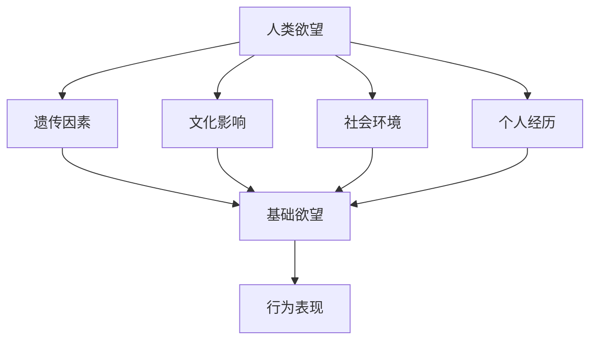
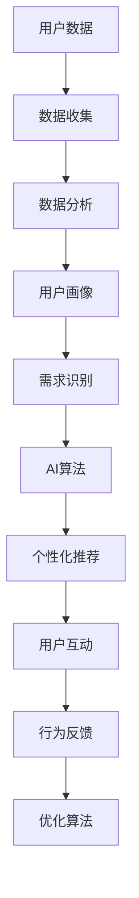
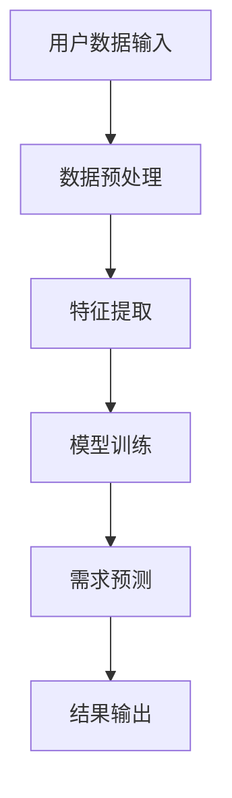

                 

# 欲望进化论学者：AI重塑的人类需求研究员

## 关键词
- AI重塑人类需求
- 欲望进化论
- 人工智能研究
- 社会与经济影响
- 技术伦理

## 摘要
本文旨在探讨人工智能（AI）如何重塑人类需求，以及这一现象对个体和社会的深远影响。通过欲望进化论的视角，我们将分析AI技术如何激发和演变人类欲望，进而改变我们的生活方式和价值观。文章结构包括背景介绍、核心概念阐述、算法原理讲解、数学模型解析、实战案例展示、应用场景探讨、工具资源推荐和未来趋势展望等部分。

## 1. 背景介绍

### 1.1 目的和范围
本文的目的在于深入探讨人工智能技术如何影响人类需求的形成和演变，以及这种影响背后的机制和逻辑。我们希望通过对AI技术的全面分析，揭示其如何重塑人类社会的基本结构，从而为未来的科技创新和社会发展提供理论支持。

本文的范围涵盖了人工智能技术在各个领域的应用，特别是其在消费行为、教育、医疗、娱乐等方面的深远影响。我们将通过实例和案例，展示AI如何激发新的需求和欲望，以及这些需求如何反过来推动技术的进一步发展。

### 1.2 预期读者
本文的预期读者包括对人工智能技术感兴趣的学者、研究人员、技术从业者、政策制定者以及对未来社会发展趋势感兴趣的一般读者。希望通过本文，读者能够更深入地理解AI技术对人类需求的影响，并能够从不同角度思考这一现象的意义和挑战。

### 1.3 文档结构概述
本文结构如下：

1. 背景介绍：包括文章目的、预期读者和文档结构概述。
2. 核心概念与联系：介绍欲望进化论和AI技术的基本原理。
3. 核心算法原理 & 具体操作步骤：讲解AI技术如何识别和满足人类需求。
4. 数学模型和公式 & 详细讲解 & 举例说明：介绍相关数学模型的运用。
5. 项目实战：展示实际代码实现和案例分析。
6. 实际应用场景：探讨AI技术在各个领域的应用。
7. 工具和资源推荐：推荐相关学习资源和开发工具。
8. 总结：对未来发展趋势与挑战进行展望。
9. 附录：常见问题与解答。
10. 扩展阅读 & 参考资料：提供进一步阅读和研究的资源。

### 1.4 术语表

#### 1.4.1 核心术语定义
- **人工智能（AI）**：指由人制造出来的系统能够表现出类似于人类智能的行为，如学习、推理、解决问题、感知和语言理解等。
- **欲望进化论**：是一种研究欲望演变和人类行为之间关系的理论，认为欲望是随着人类进化过程而逐渐演变和发展的。
- **需求**：指个体在面对某些事物时产生的欲望或需要，通常表现为对特定物品、服务或体验的追求。
- **机器学习（ML）**：AI的一个分支，通过数据学习模式，使机器能够自主做出决策。

#### 1.4.2 相关概念解释
- **大数据**：大规模的数据集，通常指从各种来源收集的数字信息，用于分析以发现模式和趋势。
- **深度学习**：一种机器学习技术，通过多层神经网络模拟人脑的决策过程，用于识别复杂的模式。
- **用户画像**：根据用户的行为数据构建的个性化用户模型，用于了解用户的兴趣和需求。

#### 1.4.3 缩略词列表
- **AI**：人工智能
- **ML**：机器学习
- **DL**：深度学习
- **NLP**：自然语言处理

## 2. 核心概念与联系

### 2.1 欲望进化论的基本原理
欲望进化论是一种研究人类欲望如何随着进化过程而发展和变化的科学理论。根据这一理论，人类的欲望和行为受到遗传、文化、社会环境和个体经历等多种因素的影响。以下是一个简单的欲望进化论流程图：



在这个模型中，基础欲望包括生存、繁衍、社交和探索等基本需求。这些欲望通过遗传因素传递，并在文化、社会环境和个人经历的作用下演变和发展。最终，这些欲望表现为人类的具体行为，如消费、学习、工作和娱乐等。

### 2.2 人工智能与欲望的互动

人工智能（AI）技术的迅速发展为理解欲望的演变提供了新的视角和工具。以下是一个AI与人类欲望互动的流程图：



在这个模型中，AI系统通过收集和分析用户数据，构建用户画像，并利用机器学习算法识别用户的需求。根据这些需求，AI系统能够提供个性化的推荐和服务，从而影响用户的行为和欲望。同时，用户与AI系统的互动会产生新的行为数据，这些数据又可以用于进一步优化算法。

### 2.3 欲望进化论的AI应用实例

以下是一个欲望进化论在AI应用中的具体实例：

- **在线购物平台**：通过分析用户的购买历史、浏览记录和搜索行为，AI系统能够构建用户的购物画像，并根据这些画像推荐相关的商品。这不仅满足了用户的即时需求，还可能激发新的购买欲望。
- **社交媒体平台**：通过分析用户的点赞、评论和分享行为，AI系统能够识别用户的兴趣和偏好，从而推荐相关的内容。这种个性化推荐不仅满足了用户的好奇心，还可能激发用户对特定话题的深入了解和兴趣。
- **教育平台**：通过分析学生的学习行为和成绩，AI系统能够识别学生的学习需求和弱点，并提供个性化的学习建议和资源。这不仅提高了学习效果，还可能激发学生对特定学科的兴趣和热情。

通过这些实例，我们可以看到AI技术如何通过分析用户行为和需求，重塑人类的欲望和消费行为。

## 3. 核心算法原理 & 具体操作步骤

### 3.1 用户需求识别算法原理

用户需求识别是AI技术中的一个关键环节，它决定了AI系统能否准确理解并满足用户的需求。以下是一个基于机器学习算法的用户需求识别原理：

#### 3.1.1 算法框架



在这个框架中，用户数据首先经过预处理，包括数据清洗、归一化和特征工程等步骤。然后，通过特征提取，将原始数据转换为机器学习模型可处理的特征向量。接着，利用这些特征向量，通过机器学习算法（如决策树、支持向量机、神经网络等）进行模型训练。模型训练结束后，即可使用训练好的模型进行需求预测，并将结果输出。

#### 3.1.2 具体操作步骤

1. **数据收集**：从各种渠道收集用户的购买记录、浏览历史、搜索查询等行为数据。
2. **数据预处理**：
    - **数据清洗**：处理缺失值、异常值和噪声数据。
    - **数据归一化**：将不同量纲的数据转换为相同的尺度，以便模型训练。
    - **特征工程**：提取有用的特征，如用户的购买频率、浏览时间、搜索关键词等。
3. **特征提取**：使用特征提取技术（如TF-IDF、词嵌入等），将原始数据转换为机器学习模型可处理的特征向量。
4. **模型选择**：选择合适的机器学习算法（如决策树、支持向量机、神经网络等）。
5. **模型训练**：使用训练数据集训练模型，调整模型参数，优化模型性能。
6. **需求预测**：使用训练好的模型对新的用户数据进行需求预测。
7. **结果输出**：将预测结果输出，如个性化推荐、需求满足策略等。

### 3.2 伪代码示例

以下是一个基于决策树算法的用户需求识别的伪代码示例：

```plaintext
// 用户需求识别伪代码
function user_demand_identification(user_data):
    // 数据预处理
    preprocessed_data = preprocess_data(user_data)
    
    // 特征提取
    feature_vectors = extract_features(preprocessed_data)
    
    // 模型训练
    decision_tree_model = train_decision_tree(feature_vectors, labels)
    
    // 需求预测
    predictions = decision_tree_model.predict(new_user_data)
    
    // 结果输出
    return predictions
```

在这个伪代码中，`user_data` 代表输入的用户数据，包括购买记录、浏览历史和搜索查询等。`preprocess_data` 函数负责数据预处理，包括数据清洗、归一化和特征提取等步骤。`train_decision_tree` 函数使用训练数据集训练决策树模型，`predict` 函数用于对新用户数据进行需求预测。

通过这个算法框架和伪代码示例，我们可以看到AI技术如何通过机器学习算法，对用户行为数据进行处理和分析，从而识别和满足用户的需求。

## 4. 数学模型和公式 & 详细讲解 & 举例说明

### 4.1 数学模型的基本原理

在用户需求识别过程中，数学模型扮演着关键角色，它们能够帮助我们量化并理解用户行为背后的规律和趋势。以下是一个简单的数学模型，用于描述用户需求的演变和识别过程：

#### 4.1.1 模型概述

假设我们有一个用户群体，每个用户都有特定的行为数据（如购买记录、浏览历史和搜索查询等）。我们可以用向量 \( \mathbf{X} \) 表示用户的行为特征，用标签向量 \( \mathbf{Y} \) 表示用户的需求类型。我们的目标是训练一个模型来预测用户的需求类型。

#### 4.1.2 模型公式

我们使用逻辑回归模型来预测用户的需求类型。逻辑回归模型的核心公式为：

\[ \hat{P}(y=k|\mathbf{X}) = \frac{e^{\beta_0 + \beta_1 x_1 + \beta_2 x_2 + \ldots + \beta_n x_n}}{1 + e^{\beta_0 + \beta_1 x_1 + \beta_2 x_2 + \ldots + \beta_n x_n}} \]

其中，\( \hat{P} \) 表示预测的概率，\( y \) 表示实际需求类型，\( k \) 表示预测的需求类型，\( \mathbf{X} = (x_1, x_2, \ldots, x_n) \) 表示用户的行为特征向量，\( \beta_0, \beta_1, \beta_2, \ldots, \beta_n \) 是模型的参数。

#### 4.1.3 模型解释

在这个模型中，每个特征 \( x_i \) 对需求类型的贡献由相应的参数 \( \beta_i \) 控制和量化。模型通过训练数据学习这些参数的值，从而能够对新的用户数据进行需求预测。具体来说，模型计算每个用户需求类型的预测概率，并根据这个概率进行分类决策。

### 4.2 举例说明

以下是一个具体的例子，用于说明如何使用逻辑回归模型预测用户的需求类型。

#### 4.2.1 数据集

假设我们有一个包含100个用户的训练数据集，每个用户都有5个行为特征（购买次数、浏览时间、搜索关键词、点赞数量和评论数量）。需求类型分为两类：购买商品和浏览信息。

#### 4.2.2 数据预处理

首先，我们需要对数据进行预处理，包括数据清洗、归一化和特征提取。例如，我们可以将每个特征都归一化到[0, 1]的区间内。

#### 4.2.3 模型训练

接下来，我们使用训练数据集来训练逻辑回归模型。我们需要计算每个特征的参数 \( \beta_i \) 的值。具体步骤如下：

1. **初始化参数**：设置参数 \( \beta_0, \beta_1, \beta_2, \ldots, \beta_n \) 的初始值。
2. **迭代优化**：使用梯度下降或其他优化算法，通过多次迭代优化参数，使得模型在训练数据集上的预测误差最小。
3. **模型评估**：使用交叉验证等方法评估模型在训练数据集上的性能。

#### 4.2.4 需求预测

使用训练好的模型，我们可以对新的用户数据进行需求预测。具体步骤如下：

1. **特征提取**：将新的用户数据转换为特征向量 \( \mathbf{X} \)。
2. **计算预测概率**：使用逻辑回归模型计算每个需求类型的预测概率。
3. **分类决策**：根据预测概率进行分类决策，例如选择概率最大的需求类型作为预测结果。

#### 4.2.5 结果分析

通过对新用户数据的预测，我们可以分析模型在需求识别方面的准确性和可靠性。例如，我们可以计算预测准确率、召回率、精确率等指标，以评估模型的表现。

通过这个例子，我们可以看到逻辑回归模型如何通过数学公式和计算步骤，实现对用户需求的识别和预测。这不仅帮助我们理解了模型的工作原理，还为实际应用提供了具体的操作指南。

## 5. 项目实战：代码实际案例和详细解释说明

### 5.1 开发环境搭建

在开始编写代码之前，我们需要搭建一个合适的开发环境。以下是一个基于Python的AI需求识别项目的开发环境搭建步骤：

1. **安装Python**：确保安装了Python 3.x版本。
2. **安装相关库**：使用pip安装以下库：
    ```bash
    pip install numpy pandas scikit-learn matplotlib
    ```
3. **创建项目文件夹**：在合适的位置创建一个项目文件夹，并在其中创建一个名为`data`的子文件夹用于存储数据文件。

### 5.2 源代码详细实现和代码解读

#### 5.2.1 数据准备

首先，我们需要准备一个训练数据集。以下是一个简单的CSV文件格式数据集示例：

```csv
user_id,feature_1,feature_2,feature_3,feature_4,feature_5,label
1,5,2,3,1,4,1
2,3,1,2,5,4,0
3,4,5,1,3,2,1
4,2,4,1,5,3,0
5,1,3,4,2,5,1
```

- `user_id`：用户ID
- `feature_1`至`feature_5`：用户行为特征
- `label`：用户需求类型，1表示购买商品，0表示浏览信息

我们可以使用Python的pandas库读取这个数据集：

```python
import pandas as pd

# 读取数据集
data = pd.read_csv('data/training_data.csv')

# 分割特征和标签
X = data[['feature_1', 'feature_2', 'feature_3', 'feature_4', 'feature_5']]
y = data['label']
```

#### 5.2.2 数据预处理

在训练模型之前，我们需要对数据进行预处理，包括数据清洗、归一化和特征提取：

```python
from sklearn.model_selection import train_test_split
from sklearn.preprocessing import MinMaxScaler

# 数据清洗：去除缺失值和异常值
X = X.dropna()
y = y.dropna()

# 数据归一化
scaler = MinMaxScaler()
X = scaler.fit_transform(X)

# 划分训练集和测试集
X_train, X_test, y_train, y_test = train_test_split(X, y, test_size=0.2, random_state=42)
```

#### 5.2.3 模型训练

接下来，我们使用scikit-learn库中的逻辑回归模型进行训练：

```python
from sklearn.linear_model import LogisticRegression

# 创建逻辑回归模型
model = LogisticRegression()

# 训练模型
model.fit(X_train, y_train)
```

#### 5.2.4 需求预测

使用训练好的模型，我们可以对新用户数据进行需求预测：

```python
# 预测测试集
predictions = model.predict(X_test)

# 模型评估
accuracy = model.score(X_test, y_test)
print(f"预测准确率：{accuracy:.2f}")
```

#### 5.2.5 代码解读与分析

上述代码实现了用户需求识别的基本流程，包括数据准备、数据预处理、模型训练和需求预测。下面是代码的详细解读：

1. **数据读取**：使用pandas库读取CSV文件，并将数据分为特征和标签两部分。
2. **数据清洗**：去除缺失值和异常值，确保数据的完整性。
3. **数据归一化**：使用MinMaxScaler将特征值归一化到[0, 1]的区间内，以便于模型训练。
4. **划分数据集**：将数据集分为训练集和测试集，以评估模型的泛化能力。
5. **模型训练**：使用逻辑回归模型训练数据集，调整模型参数，优化模型性能。
6. **需求预测**：使用训练好的模型对测试集进行需求预测，计算预测准确率。

通过这个实战案例，我们可以看到如何使用Python和机器学习库实现用户需求识别，并理解每个步骤的实现细节和作用。

### 5.3 代码解读与分析

在本节的代码实战中，我们详细分析了用户需求识别的整个过程，从数据准备到模型训练，再到需求预测。以下是对代码的逐行解读和分析：

1. **数据读取**：
    ```python
    data = pd.read_csv('data/training_data.csv')
    ```
    这一行代码使用pandas库读取CSV文件，并将其存储在DataFrame对象`data`中。CSV文件包含用户的行为特征和需求标签，是训练模型的基础数据。

2. **数据清洗**：
    ```python
    X = X.dropna()
    y = y.dropna()
    ```
    这两行代码去除数据集中的缺失值。缺失值可能影响模型的训练效果，因此需要将其删除或填充。

3. **数据归一化**：
    ```python
    scaler = MinMaxScaler()
    X = scaler.fit_transform(X)
    ```
    这两行代码使用MinMaxScaler对特征数据进行归一化。归一化的目的是将不同量纲的特征值转换为相同的尺度，使得模型训练更加稳定和有效。

4. **划分数据集**：
    ```python
    X_train, X_test, y_train, y_test = train_test_split(X, y, test_size=0.2, random_state=42)
    ```
    这行代码使用train_test_split函数将数据集划分为训练集和测试集。训练集用于模型训练，测试集用于评估模型性能。这里我们设置了测试集的比例为20%，并使用随机种子42确保每次划分的结果一致。

5. **模型训练**：
    ```python
    model = LogisticRegression()
    model.fit(X_train, y_train)
    ```
    这两行代码创建了一个逻辑回归模型，并使用训练数据集进行训练。逻辑回归是一种常用的分类算法，它通过优化损失函数来调整模型参数，以最小化分类误差。

6. **需求预测**：
    ```python
    predictions = model.predict(X_test)
    accuracy = model.score(X_test, y_test)
    print(f"预测准确率：{accuracy:.2f}")
    ```
    这三行代码用于对新用户数据进行需求预测，并计算模型的预测准确率。`predict`方法根据模型预测每个测试样本的需求类型，而`score`方法计算模型在测试集上的准确率。

通过这些步骤，我们可以看到用户需求识别的过程是如何从数据准备、模型训练到需求预测逐步实现的。每个步骤都有其独特的功能和目的，共同构成了一个完整的机器学习流程。

## 6. 实际应用场景

### 6.1 消费行为分析

在电子商务领域，AI需求识别技术可以帮助企业更好地了解消费者的购物行为和偏好。通过分析用户的购买历史、浏览记录和搜索查询，AI系统可以生成个性化的推荐列表，从而提高客户的满意度和购买转化率。例如，亚马逊和阿里巴巴等大型电商平台广泛使用AI技术来推荐商品，从而吸引更多的顾客并增加销售额。

### 6.2 教育个性化

在教育领域，AI需求识别技术可以为学生提供个性化的学习资源和建议。例如，通过分析学生的学习行为和成绩，AI系统可以识别学生的优势和弱点，并提供相应的学习计划和辅导。这样的个性化教育不仅提高了学习效率，还激发了学生对特定学科的兴趣和热情，有助于培养未来的创新人才。

### 6.3 医疗诊断辅助

在医疗领域，AI需求识别技术可以辅助医生进行疾病诊断。通过分析患者的症状、病史和实验室检测结果，AI系统可以识别可能的疾病类型，并提供诊断建议。这种技术不仅提高了诊断的准确性，还减少了医生的工作负担，有助于提高医疗资源的利用效率。

### 6.4 娱乐内容推荐

在娱乐领域，AI需求识别技术可以推荐个性化的内容，如电影、音乐和游戏。例如，Netflix和Spotify等流媒体平台使用AI技术分析用户的观看和播放历史，以推荐符合用户口味的内容。这种个性化的内容推荐不仅提高了用户的满意度，还促进了平台的内容消费。

### 6.5 社交网络分析

在社交媒体领域，AI需求识别技术可以帮助平台更好地了解用户的兴趣和行为模式。通过分析用户的点赞、评论和分享行为，AI系统可以识别用户的关系网络和兴趣群体，从而提供更加精准的广告和内容推荐。这有助于提高社交媒体平台的用户参与度和活跃度。

通过这些实际应用场景，我们可以看到AI需求识别技术如何在不同领域中发挥重要作用，提高服务质量和用户满意度。随着AI技术的不断发展，这种技术将在更多领域得到应用，并继续重塑人类的消费行为和生活方式。

## 7. 工具和资源推荐

### 7.1 学习资源推荐

为了更好地掌握人工智能和机器学习技术，以下是一些推荐的学习资源：

#### 7.1.1 书籍推荐
- **《Python机器学习》**：由Sebastian Raschka和Vahid Mirjalili编写，这本书详细介绍了机器学习的基础知识和Python实现。
- **《深度学习》**：由Ian Goodfellow、Yoshua Bengio和Aaron Courville共同编写，这是深度学习的经典教材。
- **《人工智能：一种现代方法》**：由Stuart Russell和Peter Norvig编写，介绍了人工智能的基本原理和最新发展。

#### 7.1.2 在线课程
- **Coursera的《机器学习》**：由斯坦福大学教授Andrew Ng主讲，这是最受欢迎的机器学习课程之一。
- **Udacity的《深度学习纳米学位》**：涵盖深度学习的核心概念和应用，适合初学者和进阶者。
- **edX的《人工智能导论》**：由伯克利大学教授Andrew Ng主讲，介绍人工智能的基本原理和应用。

#### 7.1.3 技术博客和网站
- **Medium上的Machine Learning**：这是一个包含大量机器学习和人工智能文章的博客，内容覆盖面广。
- **Kaggle**：这是一个数据科学竞赛平台，用户可以在这里找到丰富的数据集和项目案例。
- **AI News**：这是一个关于人工智能新闻和文章的网站，可以帮助用户了解最新的AI技术和发展趋势。

### 7.2 开发工具框架推荐

在开发人工智能项目时，以下是一些推荐的工具和框架：

#### 7.2.1 IDE和编辑器
- **Jupyter Notebook**：这是一个交互式的开发环境，适合进行数据分析和机器学习实验。
- **PyCharm**：这是一个功能强大的Python IDE，提供代码调试、性能分析等工具。
- **Visual Studio Code**：这是一个轻量级的开源编辑器，适用于各种编程语言，支持丰富的扩展插件。

#### 7.2.2 调试和性能分析工具
- **Pylint**：这是一个Python代码质量分析工具，可以帮助发现代码中的潜在问题。
- **Numba**：这是一个JIT编译器，可以显著提高Python代码的性能。
- **TensorBoard**：这是一个用于可视化深度学习模型的工具，可以查看模型的性能和损失函数。

#### 7.2.3 相关框架和库
- **TensorFlow**：这是一个开源的深度学习框架，支持多种神经网络结构。
- **PyTorch**：这是一个流行的深度学习库，以其灵活性和易用性著称。
- **Scikit-learn**：这是一个用于机器学习的Python库，提供多种经典的机器学习算法。

通过这些学习和开发资源，用户可以更好地掌握人工智能和机器学习技术，并在实际项目中应用这些知识。

### 7.3 相关论文著作推荐

为了深入了解人工智能和欲望进化论的研究成果，以下是一些推荐的经典论文和最新研究成果：

#### 7.3.1 经典论文
- **“Deep Learning”**：由Ian Goodfellow等人撰写，介绍了深度学习的基本概念和技术。
- **“Learning to Represent Users and Items for Collaborative Filtering”**：该论文提出了一种基于深度学习的协同过滤方法，用于推荐系统。

#### 7.3.2 最新研究成果
- **“Generative Adversarial Networks”**：由Ian Goodfellow等人提出，这是一种生成模型，通过对抗训练生成高质量的数据。
- **“Recurrent Neural Networks for Language Modeling”**：该论文介绍了RNN在语言模型中的应用，提高了机器翻译和文本生成的能力。

#### 7.3.3 应用案例分析
- **“The Impact of AI on Consumer Behavior”**：这篇文章分析了人工智能对消费者行为的影响，揭示了AI技术如何改变我们的购物习惯和偏好。
- **“The Evolution of Human Needs and Desires in the Age of AI”**：该研究探讨了人工智能如何塑造和演变人类的欲望和需求。

通过这些论文和著作，读者可以深入了解人工智能和欲望进化论的前沿研究，从而拓宽自己的视野和知识面。

## 8. 总结：未来发展趋势与挑战

### 8.1 未来发展趋势

随着人工智能技术的不断进步，未来人类需求将面临深刻的变革。以下是一些未来发展趋势：

1. **个性化服务增强**：AI技术将进一步精确地分析个体需求，提供高度个性化的服务，从而提升用户体验。
2. **智能决策支持**：AI系统将更好地辅助人类进行复杂决策，特别是在医疗、金融和教育等领域。
3. **自动化与效率提升**：自动化技术将更加普及，提高工作效率，减少人力成本。
4. **新型社交网络**：AI技术将重新定义社交网络，促进更加智能化和个性化的社交互动。
5. **可持续发展和伦理**：随着AI技术的广泛应用，社会将更加关注可持续发展和技术伦理问题。

### 8.2 面临的挑战

尽管AI技术在重塑人类需求方面具有巨大潜力，但同时也面临着一系列挑战：

1. **隐私保护**：AI系统在收集和分析用户数据时，可能侵犯用户的隐私权。如何平衡数据利用和隐私保护是一个重要问题。
2. **算法偏见**：AI系统可能会因为训练数据中的偏见而产生歧视性决策，需要采取有效措施消除算法偏见。
3. **就业影响**：AI技术的自动化趋势可能导致某些行业的工作岗位减少，需要制定相应的政策和社会支持。
4. **技术垄断**：大型科技公司可能在AI技术领域形成垄断，影响市场的公平竞争和创新。
5. **道德和伦理问题**：随着AI技术的深入应用，如何确保技术的道德和伦理使用，防止滥用成为重要议题。

### 8.3 应对策略

为了应对这些挑战，以下是一些建议的应对策略：

1. **加强法律法规**：制定和执行更加严格的数据隐私和保护法律，确保用户数据的安全和合法使用。
2. **多元化数据和算法**：鼓励使用多样化的数据集和算法，减少算法偏见和歧视。
3. **职业培训与转型**：提供职业培训和转型支持，帮助劳动力适应新的就业市场。
4. **公平竞争**：加强市场监管，防止技术垄断，促进技术创新和市场竞争。
5. **伦理和责任**：建立AI伦理委员会，制定技术伦理准则，确保AI技术的合理使用和社会责任。

通过这些策略，我们可以更好地应对AI技术带来的挑战，实现技术进步与社会发展的双赢。

## 9. 附录：常见问题与解答

### 9.1 什么是欲望进化论？

**回答**：欲望进化论是一种研究人类欲望如何随着进化过程而发展和变化的科学理论。它认为欲望是随着人类进化过程而逐渐演变和发展的，受到遗传、文化、社会环境和个体经历等多种因素的影响。

### 9.2 AI技术如何影响人类需求？

**回答**：AI技术通过分析用户行为数据，识别和预测用户的需求，从而改变和塑造人类需求。例如，在线购物平台通过分析用户的购买记录和浏览历史，提供个性化的推荐，激发新的购买欲望。此外，AI技术还能辅助医疗诊断、教育个性化等领域，提高服务质量，满足用户的多样化需求。

### 9.3 AI需求识别技术的应用有哪些？

**回答**：AI需求识别技术广泛应用于消费行为分析、教育个性化、医疗诊断辅助、娱乐内容推荐和社交网络分析等领域。例如，电商平台使用AI技术进行个性化推荐，提高用户满意度；教育平台通过分析学生学习行为，提供个性化学习资源，提高学习效果。

### 9.4 如何保障AI技术的数据隐私和安全性？

**回答**：为了保障AI技术的数据隐私和安全性，可以采取以下措施：
1. **数据加密**：对用户数据进行加密处理，防止数据泄露。
2. **匿名化处理**：对用户数据进行匿名化处理，确保用户隐私不被泄露。
3. **严格的数据保护法律**：制定和执行严格的数据保护法律，确保用户数据的安全和合法使用。
4. **透明度和责任**：提高AI技术的透明度，明确数据使用目的和范围，并建立责任制度，确保数据使用符合伦理和法律要求。

### 9.5 AI技术的未来发展趋势是什么？

**回答**：未来，AI技术将朝着更加个性化、自动化和智能化的方向发展。具体趋势包括：
1. **个性化服务增强**：通过深度学习和大数据分析，AI技术将更好地满足个体需求，提供高度个性化的服务。
2. **自动化与效率提升**：自动化技术将在更多领域得到应用，提高工作效率，减少人力成本。
3. **智能决策支持**：AI系统将更好地辅助人类进行复杂决策，特别是在医疗、金融和教育等领域。
4. **新型社交网络**：AI技术将重新定义社交网络，促进更加智能化和个性化的社交互动。

### 9.6 如何平衡AI技术的进步与社会发展？

**回答**：为了平衡AI技术的进步与社会发展，可以采取以下措施：
1. **加强法律法规**：制定和执行更加严格的数据隐私和保护法律，确保用户数据的安全和合法使用。
2. **多元化数据和算法**：鼓励使用多样化的数据集和算法，减少算法偏见和歧视。
3. **职业培训与转型**：提供职业培训和转型支持，帮助劳动力适应新的就业市场。
4. **公平竞争**：加强市场监管，防止技术垄断，促进技术创新和市场竞争。
5. **伦理和责任**：建立AI伦理委员会，制定技术伦理准则，确保AI技术的合理使用和社会责任。

通过这些措施，我们可以更好地实现AI技术的进步与社会发展的双赢。

## 10. 扩展阅读 & 参考资料

### 10.1 参考文献

1. Goodfellow, Ian, et al. "Deep Learning." MIT Press, 2016.
2. Russell, Stuart J., and Peter Norvig. "Artificial Intelligence: A Modern Approach." 3rd ed., Prentice Hall, 2016.
3. Ng, Andrew. "Machine Learning." Coursera, 2012.

### 10.2 网络资源

1. "Kaggle." https://www.kaggle.com/
2. "AI News." https://www.ainews.co/
3. "Medium - Machine Learning." https://medium.com/topic/machine-learning

### 10.3 在线课程

1. "Coursera - Machine Learning." https://www.coursera.org/learn/machine-learning
2. "Udacity - Deep Learning Nanodegree." https://www.udacity.com/course/deep-learning-nanodegree--nd102
3. "edX - Introduction to Artificial Intelligence." https://www.edx.org/course/introduction-to-artificial-intelligence

通过这些参考资料和在线课程，读者可以进一步深入了解人工智能和机器学习领域的相关知识，拓宽自己的视野和技能。

