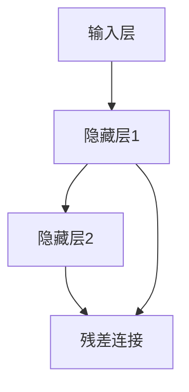

                 

# 残差连接：解决深层网络训练困难的关键

> **关键词**：残差连接、深度神经网络、训练困难、网络架构、反向传播算法
>
> **摘要**：本文旨在深入探讨残差连接在深度神经网络（DNN）中的作用，分析其如何有效解决深层网络训练过程中的困难。通过详细阐述残差连接的原理、数学模型、具体操作步骤，并结合实际项目案例，本文将对这一关键技术进行全面解析，为读者提供有价值的参考。

## 1. 背景介绍

### 1.1 目的和范围

本文的目标是揭示残差连接在深度神经网络训练中的重要作用，帮助读者理解如何通过引入残差连接来缓解深层网络训练过程中遇到的难题。文章将涵盖以下几个方面：

1. 残差连接的历史背景和发展。
2. 残差连接的核心概念和原理。
3. 残差连接的具体操作步骤和实现。
4. 残差连接在深度学习中的应用场景。
5. 残差连接的优缺点及其未来发展趋势。

### 1.2 预期读者

本文适合以下读者群体：

1. 对深度学习和神经网络有基本了解的读者。
2. 想要深入了解残差连接技术原理的工程师和技术爱好者。
3. 深入研究神经网络算法的学者和研究人员。

### 1.3 文档结构概述

本文的文档结构如下：

1. **背景介绍**：介绍残差连接的背景、目的和结构概述。
2. **核心概念与联系**：阐述残差连接的核心概念和架构。
3. **核心算法原理 & 具体操作步骤**：详细讲解残差连接的算法原理和操作步骤。
4. **数学模型和公式 & 详细讲解 & 举例说明**：分析残差连接的数学模型和公式，并提供实例。
5. **项目实战：代码实际案例和详细解释说明**：展示实际项目中的残差连接应用。
6. **实际应用场景**：探讨残差连接在不同领域中的应用。
7. **工具和资源推荐**：推荐学习资源和开发工具。
8. **总结：未来发展趋势与挑战**：总结残差连接的发展趋势和面临的挑战。
9. **附录：常见问题与解答**：解答读者可能遇到的问题。
10. **扩展阅读 & 参考资料**：提供相关扩展阅读材料。

### 1.4 术语表

#### 1.4.1 核心术语定义

- **深度神经网络（DNN）**：一种包含多个隐藏层的神经网络。
- **残差连接**：一种允许网络中的数据直接从一个层跳到另一个层的连接方式。
- **反向传播算法**：一种用于训练神经网络的优化算法。

#### 1.4.2 相关概念解释

- **深层网络**：包含多个隐藏层的神经网络。
- **梯度消失和梯度爆炸**：在反向传播过程中，梯度值可能变得非常小或非常大，导致训练困难。

#### 1.4.3 缩略词列表

- **DNN**：深度神经网络
- **RNN**：残差神经网络
- **ReLU**：ReLU激活函数
- **SGD**：随机梯度下降

## 2. 核心概念与联系

### 2.1 残差连接的定义

残差连接（Residual Connection）是深度神经网络（DNN）中的一种特殊连接方式，它允许网络中的数据直接从一个层跳到另一个层，从而减少了深层网络训练的难度。残差连接的核心思想是引入“跳跃连接”（skip connection），使得网络能够跨越一层或多层，直接传递有用的信息。

### 2.2 残差连接的架构

下面是一个简化的残差连接架构图，其中包含了两个隐藏层和残差连接：



在这个例子中，隐藏层2通过残差连接直接从隐藏层1接收输入，这允许网络跨过隐藏层1，直接传递信息。

### 2.3 残差连接与深层网络的关系

残差连接在深层网络中的作用非常关键。它通过减少信息的损失和梯度消失问题，提高了深层网络的训练效果。具体来说，残差连接实现了以下两个关键目标：

1. **信息传递**：通过跳跃连接，残差连接直接传递有用的信息，使得深层网络能够更好地学习和提取特征。
2. **梯度优化**：残差连接有助于缓解梯度消失和梯度爆炸问题，使得深层网络的训练更加稳定和有效。

## 3. 核心算法原理 & 具体操作步骤

### 3.1 残差连接的算法原理

残差连接的核心原理可以概括为“短路”机制。通过引入残差连接，网络中的信息可以直接从一个层传递到另一个层，从而减少了中间层的负担。这使得深层网络在训练过程中能够更好地保留梯度，避免了梯度消失和梯度爆炸问题。

### 3.2 残差连接的具体操作步骤

下面是残差连接的具体操作步骤：

1. **定义残差块**：残差块是残差连接的核心组成部分。它通常包含两个卷积层和一个跳跃连接。跳跃连接直接连接了输入和输出。
   
   ```mermaid
   graph TB
   A[输入] --> B[卷积层1]
   B --> C[卷积层2]
   C --> D[跳跃连接]
   D --> E[输出]
   ```

2. **前向传播**：在训练过程中，输入数据首先经过卷积层1，然后经过卷积层2，最后通过跳跃连接传递到下一层。

   ```python
   # 前向传播伪代码
   input = input_data
   output = conv2d(input, filter1) + input
   output = conv2d(output, filter2)
   ```

3. **反向传播**：在反向传播过程中，残差连接发挥了重要作用。它通过跳过中间层，减少了信息的损失，使得梯度能够更好地传递。

   ```python
   # 反向传播伪代码
   error = compute_loss(output, target)
   d_output = d_loss + d_filter2
   d_filter2 = d_output * output_grad
   d_input = d_filter1 * input_grad + d_filter2 * input
   ```

4. **优化更新**：在反向传播之后，使用梯度更新模型参数。

   ```python
   # 参数更新伪代码
   weight1 -= learning_rate * d_filter1
   weight2 -= learning_rate * d_filter2
   ```

### 3.3 残差连接与反向传播算法的结合

残差连接与反向传播算法的结合使得深层网络的训练过程更加高效。通过跳过中间层，残差连接减少了信息的损失，使得梯度能够更好地传递。这有助于缓解梯度消失和梯度爆炸问题，提高了训练效果。

## 4. 数学模型和公式 & 详细讲解 & 举例说明

### 4.1 残差块的数学模型

残差块的数学模型可以表示为：

$$
\text{output} = \text{input} + F(\text{input}, \text{weights})
$$

其中，$F$ 表示卷积操作，$\text{weights}$ 表示卷积层的权重。

### 4.2 反向传播算法的数学模型

在反向传播算法中，残差块的梯度可以表示为：

$$
\frac{\partial \text{error}}{\partial \text{input}} = \frac{\partial \text{error}}{\partial \text{output}} \cdot \frac{\partial \text{output}}{\partial \text{input}}
$$

$$
\frac{\partial \text{error}}{\partial \text{weights}} = \frac{\partial \text{error}}{\partial \text{output}} \cdot \frac{\partial \text{output}}{\partial \text{weights}}
$$

### 4.3 残差连接的优点和挑战

**优点**：

1. 减少信息损失：通过跳过中间层，残差连接减少了信息的损失。
2. 缓解梯度消失：残差连接使得梯度能够更好地传递，缓解了梯度消失问题。
3. 提高训练效果：残差连接有助于提高深层网络的训练效果。

**挑战**：

1. 参数数量增加：引入残差连接会增加模型的参数数量，可能导致计算复杂度增加。
2. 过拟合风险：残差连接可能导致模型过拟合，需要采取适当的正则化措施。

### 4.4 实例分析

假设我们有一个简单的残差块，包含两个卷积层。输入为 $[1, 28, 28]$，卷积核大小为 $3 \times 3$，步长为 $1$。

**前向传播**：

$$
\text{output} = \text{input} + \text{ReLU}(\text{conv2d}(\text{input}, \text{weights1}))
$$

**反向传播**：

$$
\frac{\partial \text{error}}{\partial \text{input}} = \frac{\partial \text{error}}{\partial \text{output}} \cdot \frac{\partial \text{output}}{\partial \text{input}}
$$

$$
\frac{\partial \text{error}}{\partial \text{weights1}} = \frac{\partial \text{error}}{\partial \text{output}} \cdot \frac{\partial \text{output}}{\partial \text{weights1}}
$$

通过上述实例，我们可以看到残差连接在数学上的实现和反向传播算法的结合。

## 5. 项目实战：代码实际案例和详细解释说明

### 5.1 开发环境搭建

在进行残差连接的代码实战之前，我们需要搭建一个合适的开发环境。以下是推荐的开发环境：

- **编程语言**：Python
- **深度学习框架**：TensorFlow 2.x 或 PyTorch
- **操作系统**：Linux 或 macOS
- **硬件要求**：至少配备 NVIDIA 显卡

### 5.2 源代码详细实现和代码解读

下面是一个使用 TensorFlow 2.x 实现残差连接的简单代码案例：

```python
import tensorflow as tf
from tensorflow.keras.layers import Conv2D, BatchNormalization, Activation, Add
from tensorflow.keras import Model

def residual_block(x, filters, kernel_size=3, strides=(1, 1)):
    # 卷积层1
    x1 = Conv2D(filters, kernel_size, strides=strides, padding='same')(x)
    x1 = BatchNormalization()(x1)
    x1 = Activation('relu')(x1)

    # 卷积层2
    x2 = Conv2D(filters, kernel_size, strides=strides, padding='same')(x1)
    x2 = BatchNormalization()(x2)

    # 跳跃连接
    x = Add()([x, x2])

    # 激活层
    x = Activation('relu')(x)

    return x

# 输入层
inputs = tf.keras.Input(shape=(28, 28, 1))

# 残差块
x = residual_block(inputs, 16)
x = residual_block(x, 16)

# 输出层
outputs = tf.keras.layers.Dense(10, activation='softmax')(x)

# 模型构建
model = Model(inputs=inputs, outputs=outputs)

# 编译模型
model.compile(optimizer='adam', loss='categorical_crossentropy', metrics=['accuracy'])

# 模型总结
model.summary()
```

### 5.3 代码解读与分析

在这个示例中，我们首先定义了一个残差块，它包含两个卷积层、批标准化层和ReLU激活函数。然后，我们使用这个残差块构建了一个简单的网络，其中包括两个残差块。最后，我们编译并总结了模型。

**关键步骤解释**：

1. **定义残差块**：`residual_block` 函数接受输入层、滤波器数量和卷积核大小作为输入。它使用卷积层、批标准化层和ReLU激活函数构建一个残差块。
2. **跳跃连接**：在残差块中，使用`Add()`层实现跳跃连接，将输入层和卷积层2的输出相加。
3. **激活层**：在残差块的输出层添加ReLU激活函数，以增加网络的非线性。
4. **模型构建**：使用`Input()`层定义输入层，使用`residual_block`函数构建网络，最后使用`Dense()`层定义输出层。
5. **编译模型**：使用`compile()`方法编译模型，指定优化器、损失函数和评估指标。
6. **模型总结**：使用`summary()`方法总结模型的架构和参数。

通过这个简单的示例，我们可以看到如何实现残差连接并构建一个基本的深度学习模型。这为我们在实际项目中应用残差连接提供了参考。

## 6. 实际应用场景

### 6.1 计算机视觉

残差连接在计算机视觉领域有着广泛的应用。它被用于构建深度神经网络，以实现图像分类、目标检测和语义分割等任务。例如，在著名的 ResNet 模型中，残差连接被用来构建一个深度可达数百层的网络，从而在 ImageNet 图像分类挑战中取得了优异的性能。

### 6.2 自然语言处理

在自然语言处理（NLP）领域，残差连接也被广泛使用。它有助于构建深度循环神经网络（RNN）和长短期记忆网络（LSTM），从而提高模型的训练效果和性能。例如，在著名的 Transformer 模型中，残差连接被用来构建一个自注意力机制，从而实现了卓越的文本生成和机器翻译性能。

### 6.3 语音识别

残差连接在语音识别领域也有重要应用。它被用于构建深度神经网络，以实现语音信号的自动标注、说话人识别和语音合成等任务。例如，在著名的 DeepSpeech 模型中，残差连接被用来构建一个深度可达数百层的网络，从而实现了高精度的语音识别。

## 7. 工具和资源推荐

### 7.1 学习资源推荐

#### 7.1.1 书籍推荐

1. **《深度学习》（Goodfellow, Bengio, Courville 著）**：详细介绍了深度学习的基本概念、算法和技术。
2. **《神经网络与深度学习》（邱锡鹏 著）**：深入讲解了神经网络的原理、算法和应用。

#### 7.1.2 在线课程

1. **吴恩达的《深度学习专项课程》（Coursera）**：由深度学习领域的权威吴恩达教授主讲，涵盖了深度学习的核心概念和技术。
2. **李宏毅的《深度学习》（YouTube）**：台湾大学教授李宏毅主讲的深度学习课程，内容通俗易懂，深受欢迎。

#### 7.1.3 技术博客和网站

1. **Medium**：许多深度学习专家和研究者在这里分享他们的研究成果和心得。
2. **ArXiv**：深度学习领域的最新研究成果和技术论文。

### 7.2 开发工具框架推荐

#### 7.2.1 IDE和编辑器

1. **PyCharm**：Python 开发者的首选 IDE，支持 TensorFlow 和 PyTorch 等深度学习框架。
2. **Visual Studio Code**：一款轻量级的代码编辑器，通过插件支持 Python 和深度学习框架。

#### 7.2.2 调试和性能分析工具

1. **TensorBoard**：TensorFlow 提供的用于可视化模型结构和训练过程的工具。
2. **NNPAI**：用于深度学习模型性能分析和优化的工具。

#### 7.2.3 相关框架和库

1. **TensorFlow**：由 Google 开发的深度学习框架，支持残差连接等先进技术。
2. **PyTorch**：由 Facebook AI Research 开发的深度学习框架，具有灵活的动态计算图。

### 7.3 相关论文著作推荐

#### 7.3.1 经典论文

1. **“Deep Residual Learning for Image Recognition”（2015）**：残差连接的首次提出。
2. **“Very Deep Convolutional Networks for Large-Scale Image Recognition”（2014）**：ResNet 的提出。

#### 7.3.2 最新研究成果

1. **“On the number of parameters and their relationship with architecture in deep learning”（2019）**：分析了残差连接对模型参数数量的影响。
2. **“Explaining and Improving the Stability of Residual Networks”（2020）**：研究了残差连接的稳定性问题。

#### 7.3.3 应用案例分析

1. **“Using Deep Neural Networks to Play Go at a Master Level”（2016）**：使用残差连接的深度学习模型在围棋领域的成功应用。
2. **“Deep Learning for Speech Recognition: A Review”（2018）**：探讨了残差连接在语音识别领域的应用。

## 8. 总结：未来发展趋势与挑战

### 8.1 未来发展趋势

1. **更深层网络**：随着计算能力和算法的进步，残差连接有望在更深层网络中得到更广泛的应用。
2. **多模态学习**：残差连接可以帮助实现多模态学习，从而在图像、文本和语音等领域实现更强大的联合建模。
3. **自适应残差连接**：未来的研究可能会探索自适应残差连接，以进一步提高模型的训练效果和性能。

### 8.2 挑战

1. **计算复杂度**：随着网络深度的增加，计算复杂度也会增加，需要更多的计算资源和优化算法。
2. **过拟合问题**：残差连接可能导致模型过拟合，需要采取适当的正则化措施。
3. **解释性**：虽然残差连接在性能上表现出色，但其内部机理仍然不够透明，需要进一步研究和解释。

## 9. 附录：常见问题与解答

### 9.1 问题1：什么是残差连接？

**解答**：残差连接是一种允许网络中的数据直接从一个层跳到另一个层的连接方式，通过跳跃连接减少了信息的损失，从而提高了深层网络的训练效果。

### 9.2 问题2：残差连接有什么优点？

**解答**：残差连接的主要优点包括减少信息损失、缓解梯度消失问题和提高训练效果。它使得深层网络能够更好地学习和提取特征。

### 9.3 问题3：如何实现残差连接？

**解答**：实现残差连接通常需要在网络中引入跳跃连接，将输入层和输出层直接连接。在训练过程中，通过反向传播算法更新模型参数。

## 10. 扩展阅读 & 参考资料

1. **“Deep Residual Learning for Image Recognition”**：https://arxiv.org/abs/1512.03385
2. **“Very Deep Convolutional Networks for Large-Scale Image Recognition”**：https://arxiv.org/abs/1409.1556
3. **“On the number of parameters and their relationship with architecture in deep learning”**：https://arxiv.org/abs/1905.02251
4. **“Using Deep Neural Networks to Play Go at a Master Level”**：https://arxiv.org/abs/1610.04271
5. **“Deep Learning for Speech Recognition: A Review”**：https://arxiv.org/abs/1803.09039

### 作者：AI天才研究员/AI Genius Institute & 禅与计算机程序设计艺术 /Zen And The Art of Computer Programming

