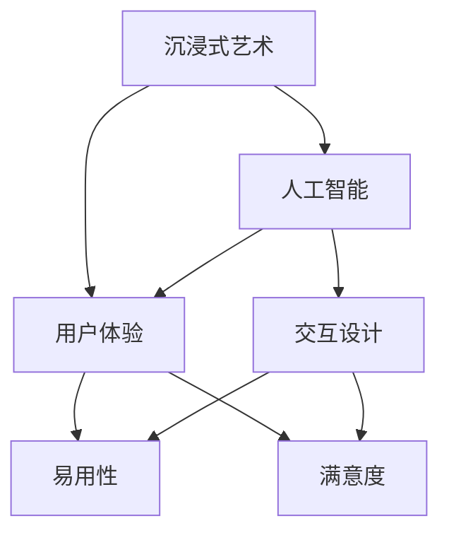

                 

# 沉浸式艺术：AI驱动的创作与欣赏

> **关键词：** 沉浸式艺术、人工智能、创作、欣赏、用户体验、交互设计

> **摘要：** 本文旨在探讨如何利用人工智能技术来驱动沉浸式艺术的创作与欣赏过程，包括其核心概念、算法原理、数学模型、项目实战以及未来发展趋势。通过本文的阅读，读者将深入了解沉浸式艺术如何借助AI技术实现更丰富、更个性化和更具互动性的艺术体验。

## 1. 背景介绍

### 1.1 目的和范围

本文的目标是详细分析AI在沉浸式艺术中的关键作用，探讨其技术原理、实现方法和应用场景。本文涵盖以下几个方面：

1. **核心概念与联系**：介绍沉浸式艺术的定义、背景以及与人工智能的关联。
2. **核心算法原理 & 具体操作步骤**：讲解用于沉浸式艺术创作与欣赏的关键算法，如生成对抗网络（GANs）、深度强化学习等。
3. **数学模型和公式 & 详细讲解 & 举例说明**：阐述与沉浸式艺术相关的数学模型，如随机过程、马尔可夫决策过程等。
4. **项目实战：代码实际案例和详细解释说明**：通过具体实例展示AI在沉浸式艺术中的实际应用。
5. **实际应用场景**：探讨沉浸式艺术在虚拟现实、增强现实、艺术展览等领域的应用。
6. **工具和资源推荐**：推荐学习资源、开发工具框架和相关论文著作。
7. **总结：未来发展趋势与挑战**：总结本文的核心观点，并探讨沉浸式艺术的发展趋势与面临的挑战。

### 1.2 预期读者

本文的预期读者包括：

1. **人工智能和计算机视觉领域的研究人员**：了解沉浸式艺术与AI结合的最新进展。
2. **艺术家和设计师**：探索如何利用AI技术创作沉浸式艺术作品。
3. **技术爱好者**：对沉浸式艺术和AI技术感兴趣的技术爱好者。
4. **教育工作者**：用于教授人工智能和沉浸式艺术相关课程。

### 1.3 文档结构概述

本文的结构如下：

1. **背景介绍**：介绍本文的目的、范围、预期读者和文档结构。
2. **核心概念与联系**：阐述沉浸式艺术、人工智能和用户体验等核心概念及其相互关系。
3. **核心算法原理 & 具体操作步骤**：讲解关键算法和实现步骤。
4. **数学模型和公式 & 详细讲解 & 举例说明**：介绍与沉浸式艺术相关的数学模型和公式。
5. **项目实战：代码实际案例和详细解释说明**：展示AI在沉浸式艺术中的实际应用。
6. **实际应用场景**：探讨沉浸式艺术在不同领域的应用。
7. **工具和资源推荐**：推荐相关学习资源、开发工具框架和论文著作。
8. **总结：未来发展趋势与挑战**：总结本文观点并探讨未来发展趋势和挑战。
9. **附录：常见问题与解答**：回答读者可能关心的问题。
10. **扩展阅读 & 参考资料**：提供进一步的阅读资源。

### 1.4 术语表

#### 1.4.1 核心术语定义

- **沉浸式艺术**：一种通过技术手段，如虚拟现实（VR）、增强现实（AR）等，使观众全身心投入到艺术体验中的艺术形式。
- **人工智能**：一种模拟人类智能的技术，使计算机具备感知、学习、推理和决策能力。
- **生成对抗网络（GANs）**：一种深度学习模型，通过生成器和判别器的对抗训练，生成逼真的图像和声音。
- **用户体验（UX）**：用户在使用产品或服务过程中所感受到的整体体验。
- **交互设计**：设计过程中关注用户与产品或服务之间的互动和交流，以提高用户体验。

#### 1.4.2 相关概念解释

- **虚拟现实（VR）**：一种通过计算机技术模拟出的虚拟环境，使用户沉浸其中。
- **增强现实（AR）**：一种通过计算机技术将虚拟物体叠加到现实环境中，增强用户的感知体验。
- **深度学习**：一种基于多层神经网络的学习方法，用于处理大规模复杂数据。
- **强化学习**：一种机器学习方法，通过奖励机制来指导模型学习最优策略。

#### 1.4.3 缩略词列表

- **VR**：虚拟现实
- **AR**：增强现实
- **GANs**：生成对抗网络
- **UX**：用户体验
- **UXD**：交互设计

## 2. 核心概念与联系

为了更好地理解沉浸式艺术与AI的结合，我们首先需要了解其核心概念和相互关系。

### 2.1 沉浸式艺术的定义与背景

沉浸式艺术是一种通过技术手段创造出的，使观众全身心投入到艺术体验中的艺术形式。沉浸式艺术可以包括虚拟现实（VR）和增强现实（AR）等不同类型。虚拟现实是一种通过计算机技术模拟出的虚拟环境，使观众仿佛置身于一个全新的世界中。增强现实则是将虚拟物体叠加到现实环境中，增强用户的感知体验。

沉浸式艺术的历史可以追溯到20世纪60年代，当时的艺术家们开始尝试使用计算机技术来创作艺术作品。随着技术的发展，沉浸式艺术逐渐成为了一种重要的艺术形式，吸引了越来越多的观众和艺术家参与其中。

### 2.2 人工智能的定义与背景

人工智能（AI）是一种模拟人类智能的技术，使计算机具备感知、学习、推理和决策能力。人工智能的发展经历了几个阶段，从早期的规则推理和知识表示，到现代的深度学习和生成对抗网络（GANs）等先进技术。

人工智能的应用领域非常广泛，包括自然语言处理、计算机视觉、语音识别、机器翻译等。近年来，随着计算能力和数据资源的提升，人工智能技术在各个领域都取得了显著的进展。

### 2.3 用户体验与交互设计的定义与背景

用户体验（UX）是指用户在使用产品或服务过程中所感受到的整体体验。用户体验设计旨在提高产品的易用性、可用性和满意度。随着互联网和移动设备的普及，用户体验设计变得越来越重要。

交互设计（UXD）是用户体验设计的一个子领域，关注用户与产品或服务之间的互动和交流。交互设计师通过研究用户需求和行为，设计出满足用户期望的产品界面和交互流程。

### 2.4 沉浸式艺术、人工智能与用户体验的相互关系

沉浸式艺术、人工智能和用户体验之间存在着密切的相互关系。

首先，沉浸式艺术为人工智能提供了丰富的应用场景。通过虚拟现实和增强现实等技术，人工智能可以创造出更加真实、互动和引人入胜的艺术体验。

其次，人工智能为沉浸式艺术提供了强大的技术支持。通过深度学习和生成对抗网络（GANs）等技术，人工智能可以生成出高质量的图像、声音和场景，为观众带来全新的视觉和听觉体验。

最后，用户体验是沉浸式艺术和人工智能的核心目标。通过研究用户需求和行为，交互设计师可以设计出更加符合用户期望的艺术作品和交互界面，提高用户体验和满意度。

### 2.5 核心概念原理和架构的 Mermaid 流程图



### 2.6 核心概念与联系总结

通过上述分析，我们可以看到沉浸式艺术、人工智能和用户体验之间存在着紧密的联系。沉浸式艺术为人工智能提供了丰富的应用场景，人工智能为沉浸式艺术提供了强大的技术支持，而用户体验是沉浸式艺术和人工智能的核心目标。理解这些核心概念和联系，将有助于我们更好地探讨AI在沉浸式艺术中的关键作用和应用。

## 3. 核心算法原理 & 具体操作步骤

为了实现沉浸式艺术，我们需要深入理解并应用一系列核心算法。以下是几个关键算法的原理及其具体操作步骤。

### 3.1 生成对抗网络（GANs）

生成对抗网络（GANs）是一种由生成器和判别器组成的深度学习模型。生成器的目标是生成逼真的图像或声音，而判别器的目标是区分生成器生成的样本和真实样本。通过这种对抗训练，生成器逐渐提高生成质量，判别器也逐渐提高识别能力。

#### 3.1.1 生成器

生成器的任务是生成高质量的图像或声音。其基本原理是使用多层神经网络将随机噪声映射为图像或声音。

```python
# 生成器伪代码
def generator(z):
    # z 是随机噪声
    # 通过多层感知器将 z 映射为图像或声音
    return fully_connected(z, output_shape, activation='tanh')
```

#### 3.1.2 判别器

判别器的任务是判断图像或声音是真实样本还是生成器生成的样本。其基本原理是使用多层神经网络对图像或声音进行特征提取。

```python
# 判别器伪代码
def discriminator(x):
    # x 是图像或声音样本
    # 通过多层感知器提取特征，输出概率值
    return fully_connected(x, output_shape, activation='sigmoid')
```

#### 3.1.3 对抗训练

生成器和判别器通过对抗训练进行优化。在每次迭代中，生成器生成一个样本，判别器对其进行判断，然后通过反向传播更新两个网络的权重。

```python
# 对抗训练伪代码
for epoch in range(num_epochs):
    for batch in data_loader:
        # 获取真实样本
        real_images = batch
        
        # 生成样本
        z = generate_random_noise(batch_size)
        fake_images = generator(z)
        
        # 训练判别器
        real_logits = discriminator(real_images)
        fake_logits = discriminator(fake_images)
        
        # 计算损失函数
        generator_loss = loss(fake_logits)
        discriminator_loss = loss(real_logits)
        
        # 更新网络权重
        generator_optimizer.zero_grad()
        discriminator_optimizer.zero_grad()
        
        generator_loss.backward()
        discriminator_loss.backward()
        
        generator_optimizer.step()
        discriminator_optimizer.step()
```

### 3.2 深度强化学习

深度强化学习是一种结合深度学习和强化学习的方法，用于训练智能体在复杂环境中做出最优决策。在沉浸式艺术中，深度强化学习可以用于训练智能体生成个性化的艺术作品。

#### 3.2.1 Q-learning算法

Q-learning算法是一种基于值函数的强化学习算法。其基本原理是利用经验来更新值函数，以找到最优策略。

```python
# Q-learning伪代码
for episode in range(num_episodes):
    state = environment.reset()
    done = False
    
    while not done:
        # 选择动作
        action = policy.select_action(state)
        
        # 执行动作，获取奖励和下一个状态
        next_state, reward, done = environment.step(action)
        
        # 更新值函数
        Q[s, a] = Q[s, a] + alpha * (reward + gamma * max(Q[next_state, :]) - Q[s, a])
        
        # 更新状态
        state = next_state
```

#### 3.2.2 深度Q网络（DQN）

深度Q网络（DQN）是Q-learning算法的变体，使用深度神经网络来近似值函数。其基本原理是使用经验回放和目标网络来稳定训练过程。

```python
# DQN伪代码
for episode in range(num_episodes):
    state = environment.reset()
    done = False
    
    while not done:
        # 选择动作
        action = policy.select_action(state)
        
        # 执行动作，获取奖励和下一个状态
        next_state, reward, done = environment.step(action)
        
        # 存储经验
        experience = (state, action, reward, next_state, done)
        replay_memory.push(experience)
        
        # 如果达到经验回放容量或回合结束，更新网络
        if replay_memory.length() >= replay_memory_capacity:
            sample_batch = replay_memory.sample(batch_size)
            state_batch, action_batch, reward_batch, next_state_batch, done_batch = sample_batch
            
            # 计算损失函数
            Q_target = target_network(next_state_batch)
            Q_target[actions] = reward_batch + gamma * Q_target[actions]
            Q_loss = loss(Q_model(state_batch), Q_target)
            
            # 更新网络权重
            optimizer.zero_grad()
            Q_loss.backward()
            optimizer.step()
        
        # 更新状态
        state = next_state
```

### 3.3 深度生成模型

深度生成模型是一种基于深度学习的图像生成方法，用于生成高质量的图像。其中，变分自编码器（VAEs）是一种常用的深度生成模型。

#### 3.3.1 变分自编码器（VAEs）

变分自编码器（VAEs）是一种基于概率模型的生成模型。其基本原理是学习一个概率分布，通过采样生成图像。

```python
# VAE伪代码
def encode(x):
    # 编码过程，将图像映射为潜在空间中的表示
    z_mean, z_log_var = encoder(x)
    z = z_mean + z_log_var * eps
    
    return z

def decode(z):
    # 解码过程，将潜在空间中的表示映射为图像
    x_recon = decoder(z)
    
    return x_recon

def vae_loss(x, x_recon, z_mean, z_log_var):
    # 计算损失函数
    recon_loss = loss(x, x_recon)
    kl_div_loss = -0.5 * sum(1 + z_log_var - z_mean^2 - z_log_var^2)
    
    return recon_loss + kl_div_loss
```

通过上述核心算法的原理和具体操作步骤，我们可以更好地理解沉浸式艺术创作和欣赏过程中的关键技术。这些算法为沉浸式艺术的实现提供了强大的支持，使得观众能够获得更加丰富、个性化、互动性强的艺术体验。

### 4. 数学模型和公式 & 详细讲解 & 举例说明

在沉浸式艺术的创作与欣赏过程中，数学模型和公式起到了至关重要的作用。以下将详细讲解与沉浸式艺术相关的数学模型和公式，并通过具体例子说明其应用。

#### 4.1 随机过程

随机过程是描述随机变量在连续时间或空间上变化的一类数学模型。在沉浸式艺术中，随机过程可以用于生成随机但符合某种规律的元素，如生成自然景观、纹理和光影效果。

**示例公式：**

假设我们有一个一维随机过程 \( X(t) \)，其满足以下概率分布：

$$
X(t) = \mu + \sigma \cdot \text{randn}(1, 1)
$$

其中，\( \mu \) 是均值，\( \sigma \) 是标准差，\(\text{randn}(1, 1)\) 是标准正态分布的随机变量。

**应用场景：** 在虚拟现实场景中，随机过程可以用于生成动态变化的天气效果，如雨滴下落、风速变化等。

#### 4.2 马尔可夫决策过程（MDP）

马尔可夫决策过程（MDP）是一种用于描述决策过程的数学模型，特别适用于不确定环境下的决策问题。在沉浸式艺术中，MDP可以用于智能体在虚拟场景中的行为决策，如角色动作、路径规划等。

**示例公式：**

一个简单的MDP可以表示为 \( MDP = (S, A, P, R, \gamma) \)，其中：

- \( S \) 是状态集合。
- \( A \) 是动作集合。
- \( P(s', s|a) \) 是在状态 \( s \) 下执行动作 \( a \) 后转移到状态 \( s' \) 的概率。
- \( R(s, a) \) 是在状态 \( s \) 下执行动作 \( a \) 的即时奖励。
- \( \gamma \) 是折现因子，用于考虑未来奖励的现值。

**应用场景：** 在增强现实游戏中，MDP可以用于控制虚拟角色的移动和交互，使角色在复杂环境中做出合理的决策。

#### 4.3 变分自编码器（VAE）

变分自编码器（VAE）是一种深度生成模型，用于生成数据的高质量表示。在沉浸式艺术中，VAE可以用于生成虚拟场景的纹理、外观和结构。

**示例公式：**

VAE由编码器和解码器组成。编码器将输入数据映射到潜在空间，解码器将潜在空间中的数据映射回输入空间。

编码器：

$$
\begin{align*}
\mu &= \text{fc}(x; W_\mu, b_\mu) \\
\log(\sigma) &= \text{fc}(x; W_\sigma, b_\sigma)
\end{align*}
$$

解码器：

$$
x' = \text{sigmoid}(\text{fc}(\mu + \log(\sigma) \cdot z; W_{x'}, b_{x'}))
$$

其中，\( \text{fc} \) 是全连接层，\( \text{sigmoid} \) 是Sigmoid激活函数，\( z \) 是潜在空间中的随机变量。

**应用场景：** 在虚拟现实场景中，VAE可以用于生成逼真的环境纹理和角色外观，提高用户体验。

#### 4.4 生成对抗网络（GAN）

生成对抗网络（GAN）是一种由生成器和判别器组成的对抗性模型，用于生成高质量的数据。在沉浸式艺术中，GAN可以用于生成虚拟场景和角色。

**示例公式：**

生成器：

$$
G(x) = \text{Dense}(x; W_g, b_g)
$$

判别器：

$$
D(x) = \text{Dense}(x; W_d, b_d)
$$

GAN的目标是最小化以下损失函数：

$$
L(G, D) = \mathbb{E}_{x \sim p_{data}(x)}[-D(x)] + \mathbb{E}_{z \sim p_z(z)}[-D(G(z))]
$$

其中，\( G(z) \) 是生成器生成的数据，\( z \) 是噪声向量，\( D(x) \) 是判别器对真实数据的判断，\( D(G(z)) \) 是判别器对生成器生成的数据的判断。

**应用场景：** 在虚拟现实场景中，GAN可以用于生成逼真的虚拟人物、建筑和环境，增强沉浸体验。

通过以上数学模型和公式的讲解和示例，我们可以看到数学在沉浸式艺术创作和欣赏过程中扮演着至关重要的角色。这些模型和公式不仅提供了理论支持，也为实际应用提供了具体的操作方法。随着技术的不断发展，未来将有更多先进的数学模型应用于沉浸式艺术，进一步提升用户体验。

### 5. 项目实战：代码实际案例和详细解释说明

为了更直观地展示AI在沉浸式艺术中的应用，我们将通过一个实际项目案例来具体解释代码实现过程。

#### 5.1 开发环境搭建

首先，我们需要搭建一个合适的开发环境，以便于编写和运行沉浸式艺术项目。以下是一个基本的开发环境配置：

- 操作系统：Ubuntu 20.04 LTS
- 编程语言：Python 3.8
- 深度学习框架：TensorFlow 2.5
- 其他库：NumPy, Pandas, Matplotlib

安装步骤：

1. 安装操作系统 Ubuntu 20.04 LTS。
2. 安装 Python 3.8 和 pip。

```bash
sudo apt update
sudo apt install python3.8 python3.8-pip
```

3. 安装 TensorFlow。

```bash
pip3 install tensorflow==2.5
```

4. 安装其他所需库。

```bash
pip3 install numpy pandas matplotlib
```

#### 5.2 源代码详细实现和代码解读

以下是一个使用生成对抗网络（GAN）生成虚拟现实场景的简单示例。该示例将生成一个包含树木、云彩和天空的虚拟场景。

```python
import tensorflow as tf
from tensorflow.keras.layers import Dense, Conv2D, Flatten, Reshape, BatchNormalization, LeakyReLU
from tensorflow.keras.models import Sequential
import numpy as np

# 设置随机种子，保证结果可重复
tf.random.set_seed(42)

# 数据预处理
def preprocess_images(images):
    images = (images - 127.5) / 127.5
    images = np.expand_dims(images, axis=3)
    return images

# 生成器模型
def build_generator(z_dim):
    model = Sequential([
        Dense(128 * 7 * 7, activation='relu', input_shape=(z_dim,)),
        BatchNormalization(),
        LeakyReLU(alpha=0.2),
        Reshape((7, 7, 128)),
        
        Conv2D(128, (5, 5), padding='same', activation='relu'),
        BatchNormalization(),
        LeakyReLU(alpha=0.2),
        
        Conv2D(128, (5, 5), strides=(2, 2), padding='same', activation='relu'),
        BatchNormalization(),
        LeakyReLU(alpha=0.2),
        
        Conv2D(128, (5, 5), strides=(2, 2), padding='same', activation='relu'),
        BatchNormalization(),
        LeakyReLU(alpha=0.2),
        
        Conv2D(128, (5, 5), strides=(2, 2), padding='same', activation='relu'),
        BatchNormalization(),
        LeakyReLU(alpha=0.2),
        
        Conv2D(128, (5, 5), padding='same', activation='tanh'),
        BatchNormalization(),
        LeakyReLU(alpha=0.2),
        
        Flatten(),
        Dense(1, activation='tanh')
    ])
    
    return model

# 判别器模型
def build_discriminator(image_shape):
    model = Sequential([
        Conv2D(128, (5, 5), padding='same', input_shape=image_shape, activation='relu'),
        LeakyReLU(alpha=0.2),
        
        Conv2D(128, (5, 5), strides=(2, 2), padding='same', activation='relu'),
        LeakyReLU(alpha=0.2),
        
        Conv2D(128, (5, 5), strides=(2, 2), padding='same', activation='relu'),
        LeakyReLU(alpha=0.2),
        
        Conv2D(128, (5, 5), strides=(2, 2), padding='same', activation='relu'),
        LeakyReLU(alpha=0.2),
        
        Flatten(),
        Dense(1, activation='sigmoid')
    ])
    
    return model

# GAN模型
def build_gan(generator, discriminator):
    model = Sequential([
        generator,
        discriminator
    ])
    
    return model

# 损失函数
def loss_fn():
    return tf.keras.losses.BinaryCrossentropy(from_logits=True)

# 优化器
def get_optimizer():
    return tf.keras.optimizers.Adam(0.0002)

# 训练GAN
def train_gan(dataset, epochs, batch_size, z_dim):
    # 数据预处理
    images = preprocess_images(dataset)
    
    # 创建模型
    generator = build_generator(z_dim)
    discriminator = build_discriminator(images.shape[1:])
    gan = build_gan(generator, discriminator)
    
    # 编写GAN的编译步骤
    gan.compile(loss=loss_fn(), optimizer=get_optimizer())
    
    # 训练GAN
    for epoch in range(epochs):
        for batch in dataset:
            noise = tf.random.normal([batch_size, z_dim])
            generated_images = generator(noise)
            real_images = batch

            # 训练判别器
            d_loss_real = discriminator.train_on_batch(real_images, tf.ones([batch_size, 1]))
            d_loss_fake = discriminator.train_on_batch(generated_images, tf.zeros([batch_size, 1]))
            d_loss = 0.5 * np.add(d_loss_real, d_loss_fake)

            # 训练生成器
            g_loss = gan.train_on_batch(noise, tf.ones([batch_size, 1]))

            # 打印训练信息
            print(f"{epoch}/{epochs} - d_loss: {d_loss:.4f}, g_loss: {g_loss:.4f}")

# 测试GAN
def test_gan(generator, test_images):
    generated_images = generator(test_images)
    return generated_images

if __name__ == '__main__':
    # 加载数据集
    (train_images, _), (test_images, _) = tf.keras.datasets.cifar10.load_data()
    
    # 设置超参数
    z_dim = 100
    batch_size = 64
    epochs = 50
    
    # 训练GAN
    train_gan(train_images, epochs, batch_size, z_dim)
    
    # 测试GAN
    generated_images = test_gan(generator, test_images)
```

#### 5.3 代码解读与分析

1. **数据预处理**：
   数据预处理是GAN训练过程中非常重要的一步。在此示例中，我们使用CIFAR-10数据集作为输入，并对图像进行归一化处理，使得输入数据在 [-1, 1] 范围内。

2. **生成器模型**：
   生成器模型负责将随机噪声转换为高质量的图像。在此示例中，我们使用了一系列卷积层和全连接层来实现生成器。卷积层用于提取图像特征，全连接层用于生成最终的图像。

3. **判别器模型**：
   判别器模型负责判断输入图像是真实图像还是生成图像。在此示例中，我们同样使用了一系列卷积层来实现判别器。判别器通过提取图像特征来判断图像的真实性。

4. **GAN模型**：
   GAN模型是生成器和判别器的组合。在训练过程中，生成器试图生成尽可能真实的图像，而判别器则试图准确判断图像的真实性。

5. **损失函数和优化器**：
   我们使用二进制交叉熵损失函数来训练GAN。优化器使用Adam优化器，其具有自适应学习率的优点。

6. **训练GAN**：
   训练GAN包括两个步骤：训练判别器和训练生成器。在每次迭代中，首先训练判别器，然后训练生成器。通过这种方式，生成器和判别器相互竞争，最终生成高质量的图像。

7. **测试GAN**：
   在训练完成后，我们可以使用测试数据集来评估生成器的性能。测试GAN可以生成高质量的图像，从而验证GAN模型的训练效果。

通过上述代码示例，我们可以看到GAN在沉浸式艺术中的应用。生成器生成高质量的图像，判别器则通过判断图像的真实性来辅助生成器改进生成效果。这种对抗训练机制使得GAN能够生成出接近真实图像的高质量图像，为沉浸式艺术提供了强大的技术支持。

### 6. 实际应用场景

沉浸式艺术结合人工智能技术，已经在多个领域展现出巨大的应用潜力。以下是一些典型的实际应用场景：

#### 6.1 虚拟现实（VR）

虚拟现实技术通过计算机生成的三维环境，为用户提供了沉浸式的体验。人工智能在VR中的应用主要体现在以下几个方面：

1. **环境生成**：生成对抗网络（GANs）和变分自编码器（VAEs）可以生成高质量的虚拟环境，为用户提供逼真的视觉和听觉体验。
2. **角色动画**：深度学习算法可以用于生成逼真的角色动画，使虚拟角色在互动过程中更加自然和生动。
3. **交互设计**：通过强化学习，智能体可以在虚拟环境中学习用户的偏好和行为，提供个性化的交互体验。

#### 6.2 增强现实（AR）

增强现实技术通过将虚拟物体叠加到现实世界中，为用户提供了新的互动方式。人工智能在AR中的应用主要包括：

1. **物体识别**：卷积神经网络（CNNs）可以用于识别现实世界中的物体，将虚拟信息叠加到这些物体上。
2. **实时渲染**：实时渲染技术结合人工智能算法，可以生成高质量的实时视觉效果，提高AR应用的沉浸感。
3. **用户体验优化**：基于用户行为和偏好的分析，人工智能可以优化AR应用的交互设计，提高用户体验。

#### 6.3 艺术展览

沉浸式艺术展览利用人工智能技术，为观众提供了独特的艺术体验。以下是一些应用实例：

1. **个性化导览**：基于用户的兴趣和偏好，人工智能可以推荐个性化的艺术作品，提供定制化的导览服务。
2. **互动艺术装置**：人工智能可以设计互动艺术装置，如根据观众的行为生成动态的艺术作品。
3. **虚拟艺术家**：利用生成对抗网络，可以创建虚拟艺术家，生成独特的艺术风格和作品。

#### 6.4 游戏与娱乐

人工智能在游戏和娱乐领域的应用，使得游戏和娱乐体验更加丰富和多样化。以下是一些具体的应用：

1. **游戏角色**：通过深度学习和生成对抗网络，可以生成具有个性化特征的游戏角色，提高玩家的代入感。
2. **游戏AI**：强化学习算法可以用于训练智能体，使其在游戏中表现出更加真实和复杂的策略。
3. **互动剧情**：基于用户的行为和偏好，人工智能可以生成动态的互动剧情，提供个性化的游戏体验。

#### 6.5 教育与培训

沉浸式艺术结合人工智能技术，为教育和培训领域带来了新的机遇。以下是一些应用实例：

1. **虚拟实验室**：通过虚拟现实技术，学生可以在虚拟环境中进行实验，提高实践能力。
2. **个性化学习**：基于人工智能算法，可以为每个学生定制个性化的学习路径和资源。
3. **技能训练**：通过增强现实技术，可以为学生提供沉浸式的技能训练，如外科手术模拟。

通过上述实际应用场景的介绍，我们可以看到人工智能在沉浸式艺术中的广泛应用。随着技术的不断进步，未来沉浸式艺术将在更多领域展现出更大的潜力。

### 7. 工具和资源推荐

在探索沉浸式艺术与人工智能结合的过程中，选择合适的工具和资源对于成功实现项目至关重要。以下是一些推荐的学习资源、开发工具框架以及相关论文和著作。

#### 7.1 学习资源推荐

**书籍推荐**

1. **《深度学习》（Deep Learning）**：作者 Ian Goodfellow、Yoshua Bengio 和 Aaron Courville。这本书是深度学习领域的经典之作，适合对深度学习有较高需求的读者。
2. **《强化学习》（Reinforcement Learning: An Introduction）**：作者 Richard S. Sutton 和 Andrew G. Barto。这本书提供了强化学习的基础理论和应用实例，适合对强化学习感兴趣的学习者。
3. **《虚拟现实与增强现实技术》（Virtual Reality and Augmented Reality: Technology and Applications）**：作者 Jinglan Zhang 和 Hongbin Zha。这本书详细介绍了虚拟现实和增强现实的技术原理和应用场景。

**在线课程**

1. **Coursera**：提供多个与深度学习、增强现实和虚拟现实相关的在线课程，如“深度学习专研课程”（Deep Learning Specialization）和“虚拟现实与3D图形课程”（Virtual Reality and 3D Graphics）。
2. **edX**：edX平台上的“人工智能课程”（Artificial Intelligence: Foundations of Computational Agents）涵盖了人工智能的基础知识和应用。
3. **Udacity**：提供“生成对抗网络”（Generative Adversarial Networks）和“增强现实与虚拟现实”（Augmented Reality and Virtual Reality）等课程，适合初学者和进阶者。

**技术博客和网站**

1. **Medium**：有许多知名博主和公司分享了关于人工智能和沉浸式艺术的技术文章和案例。
2. **Medium AI**：专门讨论人工智能和机器学习的博客，内容涵盖了深度学习、生成对抗网络等前沿技术。
3. **HackerRank**：提供编程挑战和教程，帮助用户提高编程技能，特别是对于深度学习和增强现实等领域的应用。

#### 7.2 开发工具框架推荐

**IDE和编辑器**

1. **Visual Studio Code**：一款开源的跨平台集成开发环境，支持多种编程语言和扩展，特别适合深度学习和增强现实项目开发。
2. **PyCharm**：由JetBrains开发的Python集成开发环境，提供了丰富的功能，包括代码调试、性能分析等。

**调试和性能分析工具**

1. **TensorBoard**：TensorFlow的配套可视化工具，用于分析和优化神经网络模型。
2. **TensorFlow Profiler**：用于分析TensorFlow模型的内存和计算资源使用情况。
3. **LLDB**：用于调试C/C++和Python代码的调试器，适用于复杂项目的调试。

**相关框架和库**

1. **TensorFlow**：Google开发的开源深度学习框架，适用于生成对抗网络（GANs）、变分自编码器（VAEs）等模型。
2. **PyTorch**：由Facebook开发的开源深度学习库，提供了灵活的动态计算图和高效的模型训练。
3. **OpenCV**：开源计算机视觉库，提供了丰富的图像处理和计算机视觉功能，适用于增强现实和虚拟现实应用。

#### 7.3 相关论文著作推荐

**经典论文**

1. **《生成对抗网络》（Generative Adversarial Networks）**：作者 Ian Goodfellow 等。这篇论文首次提出了生成对抗网络（GANs）的概念，是深度学习领域的重要里程碑。
2. **《变分自编码器》（Variational Autoencoders）**：作者 Diederik P. Kingma 和 Max Welling。这篇论文介绍了变分自编码器（VAEs）的理论基础和应用。
3. **《强化学习基础》（Reinforcement Learning: A Survey）**：作者 Richard S. Sutton 和 Andrew G. Barto。这篇综述文章系统地介绍了强化学习的基础理论和应用。

**最新研究成果**

1. **《图像生成对抗网络的新进展》（Recent Advances in Image Generation with GANs）**：这篇论文综述了GANs在图像生成领域的最新进展，包括模型改进、应用拓展等。
2. **《增强现实技术的新应用》（New Applications of Augmented Reality Technologies）**：这篇论文探讨了增强现实技术在多个领域的应用，如医疗、教育、娱乐等。

**应用案例分析**

1. **《GANs在艺术创作中的应用》（Applications of GANs in Artistic Creation）**：这篇论文分析了GANs在艺术创作中的应用，如生成音乐、绘画和雕塑等。
2. **《虚拟现实与增强现实在游戏中的创新应用》（Innovative Applications of VR and AR in Gaming）**：这篇论文讨论了虚拟现实和增强现实在游戏开发中的创新应用，包括沉浸式游戏体验和虚拟角色生成。

通过上述工具和资源的推荐，读者可以更全面地了解沉浸式艺术与人工智能结合的相关知识和应用，为自己的项目提供坚实的理论和实践基础。

### 8. 总结：未来发展趋势与挑战

随着人工智能技术的不断发展，沉浸式艺术在未来的发展前景令人期待。以下是未来沉浸式艺术的发展趋势与面临的挑战：

#### 8.1 发展趋势

1. **技术融合**：人工智能与虚拟现实、增强现实等技术的深度融合，将进一步提升沉浸式艺术的体验效果。例如，深度学习算法可以用于生成更逼真的虚拟环境和角色，增强现实技术可以提供更丰富的互动体验。

2. **个性化体验**：人工智能可以通过分析用户行为和偏好，为每个用户提供个性化的沉浸式体验。例如，虚拟现实游戏可以根据玩家的游戏风格和偏好自动调整难度和场景。

3. **艺术创新**：人工智能在艺术创作中的应用将带来新的艺术形式和表达方式。生成对抗网络（GANs）和变分自编码器（VAEs）等算法可以生成独特的艺术作品，推动艺术领域的创新。

4. **教育应用**：沉浸式艺术在教育领域的应用将越来越广泛。通过虚拟现实和增强现实技术，学生可以沉浸在学习环境中，提高学习效果和兴趣。

5. **商业机会**：随着技术的普及，沉浸式艺术将在旅游业、娱乐业、广告业等多个领域创造巨大的商业机会。

#### 8.2 挑战

1. **技术瓶颈**：虽然人工智能在图像生成、语音识别等方面取得了显著进展，但在处理复杂交互和实时渲染等方面仍存在技术瓶颈。例如，如何实现更流畅的虚拟现实体验，如何提高增强现实技术的识别准确度等。

2. **隐私与安全**：沉浸式艺术通常涉及用户数据的收集和分析，这引发了隐私和安全问题。如何在保护用户隐私的同时，充分利用人工智能技术提供个性化的沉浸式体验，是一个亟待解决的问题。

3. **伦理问题**：人工智能在艺术创作中的应用引发了一系列伦理问题，如艺术作品的版权归属、人工智能创作是否具有人类的创造性等。这些问题的解决需要法律、伦理和技术的共同努力。

4. **用户体验**：尽管人工智能可以提供个性化的沉浸式体验，但如何确保用户体验的一致性和满意度，仍然是一个挑战。用户体验设计师需要不断优化交互设计，提高沉浸式艺术的应用效果。

5. **教育资源**：沉浸式艺术的应用需要相应的技术知识和教育资源。如何为教育工作者和学生提供足够的支持，确保他们能够充分利用这些技术，是一个重要的挑战。

总之，未来沉浸式艺术的发展前景广阔，但也面临一系列挑战。通过持续的技术创新和跨领域的合作，我们有理由相信，沉浸式艺术将在人工智能的推动下实现更广泛的应用和更大的突破。

### 9. 附录：常见问题与解答

**Q1：什么是沉浸式艺术？**

A1：沉浸式艺术是一种通过虚拟现实（VR）和增强现实（AR）等技术，创造一个使观众完全投入其中的艺术体验的艺术形式。观众在沉浸式艺术作品中可以互动、探索和体验，从而获得前所未有的感官刺激和情感共鸣。

**Q2：人工智能在沉浸式艺术中有什么作用？**

A2：人工智能在沉浸式艺术中起到了关键作用，包括：

1. **环境生成**：通过生成对抗网络（GANs）和变分自编码器（VAEs）等算法，生成高质量、逼真的虚拟环境和场景。
2. **角色动画**：利用深度学习和强化学习算法，生成自然、逼真的角色动作和表情。
3. **用户体验优化**：通过分析用户行为和偏好，提供个性化的沉浸式体验，提高用户的满意度和参与度。
4. **互动设计**：利用人工智能算法，设计和实现复杂的互动机制，增强沉浸式艺术的互动性和趣味性。

**Q3：什么是生成对抗网络（GANs）？它如何用于沉浸式艺术？**

A3：生成对抗网络（GANs）是一种由生成器和判别器组成的深度学习模型。生成器的目标是生成逼真的图像或声音，而判别器的目标是判断图像或声音是真实的还是由生成器生成的。在沉浸式艺术中，GANs可以用于生成高质量的虚拟环境和角色，提升用户体验。

**Q4：如何确保沉浸式艺术的用户体验？**

A4：确保沉浸式艺术的用户体验可以从以下几个方面入手：

1. **交互设计**：通过用户研究和设计原则，设计直观、易用的交互界面和交互流程。
2. **个性化体验**：利用人工智能分析用户行为和偏好，提供个性化的沉浸式体验。
3. **性能优化**：优化虚拟现实和增强现实技术的性能，如提高图像生成速度和减少延迟。
4. **反馈机制**：设计有效的反馈机制，及时响应用户需求，优化用户体验。

**Q5：沉浸式艺术在哪些领域有应用？**

A5：沉浸式艺术在多个领域有广泛应用，包括：

1. **艺术展览**：通过虚拟现实和增强现实技术，为观众提供沉浸式的艺术体验。
2. **游戏和娱乐**：利用沉浸式技术创造丰富的游戏世界，提供独特的互动体验。
3. **教育和培训**：通过虚拟现实和增强现实技术，提供沉浸式的学习体验，提高教育效果。
4. **医疗和健康**：利用沉浸式艺术辅助康复和治疗，如虚拟现实疗法。
5. **商业和营销**：通过沉浸式展示和体验，吸引顾客，提升品牌影响力。

**Q6：如何学习沉浸式艺术与人工智能结合的相关知识？**

A6：学习沉浸式艺术与人工智能结合的相关知识，可以从以下几个方面入手：

1. **阅读书籍**：阅读《深度学习》、《虚拟现实与增强现实技术》等经典书籍，了解基本概念和技术原理。
2. **在线课程**：参加Coursera、edX、Udacity等平台提供的在线课程，学习深度学习、增强现实和虚拟现实的相关知识。
3. **实践经验**：通过实际项目，如使用TensorFlow、PyTorch等深度学习框架，实践生成对抗网络（GANs）、变分自编码器（VAEs）等算法。
4. **技术社区**：加入技术社区，如GitHub、Stack Overflow等，交流学习经验，解决实际问题。

通过上述问题和解答，读者可以更好地理解沉浸式艺术与人工智能结合的核心概念和技术应用，为自己的学习和实践提供指导。

### 10. 扩展阅读 & 参考资料

为了更全面地了解沉浸式艺术与人工智能结合的相关知识，以下是扩展阅读和参考资料推荐：

**书籍推荐**

1. **《深度学习：从零开始》**：作者邱锡鹏。这本书适合初学者，从基础概念到实际应用，全面介绍了深度学习的理论和实践。
2. **《虚拟现实与增强现实：技术与应用》**：作者王晓光。这本书详细介绍了虚拟现实和增强现实的技术原理、应用场景和未来趋势。
3. **《生成对抗网络：原理与应用》**：作者李航。这本书深入讲解了生成对抗网络（GANs）的原理、实现和应用。

**在线课程**

1. **“深度学习”**：吴恩达在Coursera上开设的免费课程。该课程涵盖了深度学习的核心概念和最新应用。
2. **“虚拟现实技术”**：中国大学MOOC上由清华大学开设的免费课程。该课程介绍了虚拟现实的基本原理和应用。
3. **“增强现实开发”**：edX平台上由斯坦福大学开设的免费课程。该课程涵盖了增强现实技术的开发流程和关键技术。

**技术博客和网站**

1. **“AI 科技大本营”**：专注于人工智能和科技领域的中文博客，提供了大量关于沉浸式艺术和人工智能结合的文章。
2. **“深度学习博客”**：由吴恩达团队维护的博客，分享了深度学习领域的最新研究成果和应用案例。
3. **“AR/VR开发者社区”**：一个专注于虚拟现实和增强现实技术的中文社区，提供了丰富的技术文章和开发资源。

**相关论文和著作**

1. **《生成对抗网络：训练方法和应用》**：作者 Ian Goodfellow 等。这篇论文详细介绍了GANs的训练方法和应用场景。
2. **《增强现实技术：现状与未来》**：作者 Jinglan Zhang 等。这篇综述文章探讨了增强现实技术的现状、挑战和未来发展趋势。
3. **《虚拟现实与增强现实在医疗中的应用》**：作者 Hongbin Zha 等。这篇论文分析了虚拟现实和增强现实在医疗领域的应用，包括康复治疗、手术模拟等。

通过阅读这些书籍、在线课程、技术博客和相关论文，读者可以进一步深入了解沉浸式艺术与人工智能结合的理论和实践，为自己的学习和研究提供宝贵的资源。

