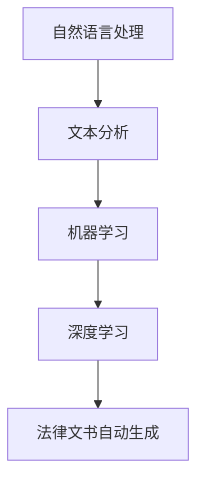

                 

# 法律文书自动生成：AI在法律领域的应用

> **关键词：** 法律文书、自动生成、人工智能、自然语言处理、文本分析
>
> **摘要：** 本文将探讨人工智能在法律领域中的应用，特别是如何利用自然语言处理和文本分析技术自动生成法律文书。通过介绍相关技术原理、实现步骤和实际应用案例，本文旨在展示AI在提升法律工作效率、降低成本和减少错误方面的潜力。

## 1. 背景介绍

### 1.1 目的和范围

本文的目的是介绍人工智能（AI）在法律领域的应用，特别是法律文书的自动生成技术。随着法律文书的数量和复杂性日益增加，传统的手工撰写方式已经难以满足需求。本文将探讨如何利用AI技术，特别是自然语言处理（NLP）和文本分析技术，自动生成法律文书，以提升工作效率、降低成本和减少错误。

### 1.2 预期读者

本文适合对人工智能和自然语言处理有一定了解的读者，特别是法律领域从业者、软件开发者和技术爱好者。通过本文，读者可以了解AI在法律文书自动生成领域的应用现状、技术原理和实现方法。

### 1.3 文档结构概述

本文分为十个部分：

1. 背景介绍
2. 核心概念与联系
3. 核心算法原理 & 具体操作步骤
4. 数学模型和公式 & 详细讲解 & 举例说明
5. 项目实战：代码实际案例和详细解释说明
6. 实际应用场景
7. 工具和资源推荐
8. 总结：未来发展趋势与挑战
9. 附录：常见问题与解答
10. 扩展阅读 & 参考资料

### 1.4 术语表

#### 1.4.1 核心术语定义

- **法律文书**：指用于法律事务的各种书面文件，如合同、起诉书、判决书等。
- **自然语言处理（NLP）**：计算机科学领域的一个分支，旨在让计算机理解和生成自然语言。
- **文本分析**：对文本数据进行处理、分析和理解的技术和方法。
- **机器学习**：一种通过数据驱动的方法来开发计算机程序的技术，使计算机能够从数据中学习并做出预测或决策。

#### 1.4.2 相关概念解释

- **特征提取**：从原始数据中提取出对任务有帮助的属性或特征。
- **词向量**：将单词映射为一个固定大小的向量，以便在计算机中进行处理。
- **语义分析**：对文本中的词语和句子进行语义理解，以获取其含义和关系。

#### 1.4.3 缩略词列表

- **NLP**：自然语言处理
- **ML**：机器学习
- **DL**：深度学习
- **RNN**：循环神经网络
- **LSTM**：长短时记忆网络
- **BERT**：双向编码器表示模型

## 2. 核心概念与联系

### 2.1 AI在法律领域的应用

随着AI技术的发展，人工智能在法律领域的应用越来越广泛。AI可以用于法律文本的自动生成、法律知识的获取和推理、案件预测和风险评估等方面。其中，法律文书的自动生成是AI在法律领域应用的一个重要方向。

### 2.2 自然语言处理（NLP）

自然语言处理是AI的一个子领域，旨在让计算机理解和生成自然语言。在法律文书自动生成中，NLP技术起着关键作用。NLP的主要任务包括：

- **分词**：将文本分割成单词或词组。
- **词性标注**：为每个词分配一个词性（如名词、动词等）。
- **句法分析**：分析句子结构，确定词语之间的关系。
- **语义分析**：理解文本中的语义和含义。

### 2.3 文本分析

文本分析是对文本数据进行处理、分析和理解的技术和方法。在法律文书自动生成中，文本分析可以用于：

- **信息提取**：从文本中提取有用的信息，如合同条款、法律条款等。
- **情感分析**：分析文本中的情感倾向，如积极、消极或中立。
- **关系抽取**：确定文本中实体之间的关系，如合同当事人、权利义务等。

### 2.4 机器学习（ML）和深度学习（DL）

机器学习和深度学习是AI的两个核心技术。在法律文书自动生成中，ML和DL技术可以用于：

- **文本分类**：根据文本内容将其分类到不同的类别，如合同类型、法律文书类型等。
- **序列标注**：为文本中的每个词或序列分配一个标签，如词性标注、命名实体识别等。
- **生成模型**：根据已有的法律文书生成新的法律文书，如模板生成、文本生成等。

### 2.5 核心概念原理和架构的 Mermaid 流程图



## 3. 核心算法原理 & 具体操作步骤

### 3.1 自然语言处理（NLP）技术

在法律文书自动生成中，NLP技术用于对文本进行预处理、分析和理解。以下是NLP技术的核心步骤和算法原理：

#### 3.1.1 分词

**算法原理：** 分词是将连续的文本分割成有意义的词或短语。

**伪代码：**
```
function segment(text):
    # 使用现有的分词工具（如jieba、NLTK等）
    words = use_partition_tool(text)
    return words
```

#### 3.1.2 词性标注

**算法原理：** 词性标注是为每个词分配一个词性（如名词、动词等）。

**伪代码：**
```
function pos_tagging(words):
    # 使用现有的词性标注工具（如NLTK、Stanford NLP等）
    tagged_words = use_pos_tagging_tool(words)
    return tagged_words
```

#### 3.1.3 句法分析

**算法原理：** 句法分析是分析句子结构，确定词语之间的关系。

**伪代码：**
```
function parse_sentence(sentence):
    # 使用现有的句法分析工具（如Stanford Parser、SpaCy等）
    parse_tree = use_parsing_tool(sentence)
    return parse_tree
```

#### 3.1.4 语义分析

**算法原理：** 语义分析是理解文本中的语义和含义。

**伪代码：**
```
function semantic_analysis(text):
    # 使用现有的语义分析工具（如Word2Vec、BERT等）
    semantics = use_semantic_tool(text)
    return semantics
```

### 3.2 文本分析技术

在法律文书自动生成中，文本分析技术用于提取文本中的关键信息、确定实体关系和进行文本分类。以下是文本分析技术的核心步骤和算法原理：

#### 3.2.1 信息提取

**算法原理：** 信息提取是从文本中提取有用的信息，如合同条款、法律条款等。

**伪代码：**
```
function extract_information(text):
    # 使用现有的信息提取工具（如关系抽取、实体识别等）
    information = use_information_extraction_tool(text)
    return information
```

#### 3.2.2 情感分析

**算法原理：** 情感分析是分析文本中的情感倾向，如积极、消极或中立。

**伪代码：**
```
function sentiment_analysis(text):
    # 使用现有的情感分析工具（如TextBlob、VADER等）
    sentiment = use_sentiment_analysis_tool(text)
    return sentiment
```

#### 3.2.3 关系抽取

**算法原理：** 关系抽取是确定文本中实体之间的关系，如合同当事人、权利义务等。

**伪代码：**
```
function relation_extraction(text):
    # 使用现有的关系抽取工具（如实体识别、依存句法分析等）
    relations = use_relation_extraction_tool(text)
    return relations
```

### 3.3 机器学习和深度学习技术

在法律文书自动生成中，机器学习和深度学习技术用于文本分类、序列标注和生成模型。以下是相关技术的核心步骤和算法原理：

#### 3.3.1 文本分类

**算法原理：** 文本分类是将文本数据分类到预定义的类别中。

**伪代码：**
```
function text_classification(text, labels):
    # 使用现有的文本分类算法（如朴素贝叶斯、支持向量机等）
    predicted_labels = use_text_classification_algorithm(text, labels)
    return predicted_labels
```

#### 3.3.2 序列标注

**算法原理：** 序列标注是为文本中的每个词或序列分配一个标签。

**伪代码：**
```
function sequence_labeling(words, labels):
    # 使用现有的序列标注算法（如CRF、RNN等）
    labeled_words = use_sequence_labeling_algorithm(words, labels)
    return labeled_words
```

#### 3.3.3 生成模型

**算法原理：** 生成模型是根据已有数据生成新的数据。

**伪代码：**
```
function generate_text(input_sequence):
    # 使用现有的生成模型（如RNN、LSTM等）
    generated_text = use_generation_model(input_sequence)
    return generated_text
```

## 4. 数学模型和公式 & 详细讲解 & 举例说明

### 4.1 自然语言处理（NLP）的数学模型

自然语言处理中的许多任务都可以通过数学模型来实现。以下是一些常用的数学模型和公式：

#### 4.1.1 词向量模型

词向量模型是将单词映射为向量的技术。最著名的词向量模型是Word2Vec。

- **Word2Vec模型：**
  $$\text{word\_vector} = \text{Average}(\text{context\_vectors})$$

  其中，$\text{word\_vector}$表示单词的向量表示，$\text{context\_vectors}$表示单词上下文的向量表示。

- **GloVe模型：**
  $$\text{word\_vector} = \text{sigmoid}(\text{W}\text{word}_\text{index} + \text{U}\text{context}_\text{index})$$

  其中，$\text{W}$和$\text{U}$是权重矩阵，$\text{word}_\text{index}$和$\text{context}_\text{index}$是单词和上下文的索引。

#### 4.1.2 循环神经网络（RNN）

循环神经网络是一种用于处理序列数据的神经网络。以下是一个简单的RNN模型：

- **RNN模型：**
  $$\text{h}_{t} = \text{activation}(\text{W}\text{h}_{t-1} + \text{U}\text{X}_{t})$$
  $$\text{y}_{t} = \text{softmax}(\text{V}\text{h}_{t})$$

  其中，$\text{h}_{t}$是隐藏状态，$\text{X}_{t}$是输入序列，$\text{W}$和$\text{U}$是权重矩阵，$\text{V}$是输出权重矩阵，$\text{activation}$是激活函数，$\text{softmax}$是分类函数。

#### 4.1.3 长短时记忆网络（LSTM）

长短时记忆网络是一种改进的RNN模型，用于解决长序列依赖问题。以下是一个简单的LSTM模型：

- **LSTM模型：**
  $$\text{h}_{t} = \text{activation}(\text{f}_{t} \odot \text{h}_{t-1} + \text{i}_{t} \odot \text{g}_{t})$$
  $$\text{y}_{t} = \text{softmax}(\text{V}\text{h}_{t})$$

  其中，$\text{h}_{t}$是隐藏状态，$\text{i}_{t}$是输入门控，$\text{f}_{t}$是遗忘门控，$\text{g}_{t}$是输入门控，$\text{activation}$是激活函数，$\text{softmax}$是分类函数。

### 4.2 文本分析中的数学模型

文本分析中的许多任务也可以通过数学模型来实现。以下是一些常用的数学模型和公式：

#### 4.2.1 朴素贝叶斯分类器

朴素贝叶斯分类器是一种基于贝叶斯定理的简单分类器。以下是一个简单的朴素贝叶斯分类器：

- **概率计算：**
  $$\text{P}(\text{y}|\text{x}) = \frac{\text{P}(\text{x}|\text{y})\text{P}(\text{y})}{\text{P}(\text{x})}$$

- **特征条件独立性假设：**
  $$\text{P}(\text{x}_{1},\text{x}_{2},\dots,\text{x}_{n}|\text{y}) = \prod_{i=1}^{n}\text{P}(\text{x}_{i}|\text{y})$$

#### 4.2.2 支持向量机（SVM）

支持向量机是一种强大的分类器，用于将数据划分为不同的类别。以下是一个简单的SVM模型：

- **最优超平面：**
  $$\text{w}^{\ast} = \arg\min_{\text{w}} \frac{1}{2}\|\text{w}\|^2$$

  使得所有数据点满足约束条件：
  $$\text{y}(\text{x}_{i}^{\top}\text{w} - \text{b}) \geq 1$$

#### 4.2.3 深度学习模型

深度学习模型，如卷积神经网络（CNN）和递归神经网络（RNN），也可以用于文本分析。以下是一个简单的CNN模型：

- **卷积层：**
  $$\text{h}_{\text{k}}^{\text{c}} = \text{relu}(\text{b}_{\text{k}} + \sum_{\text{j}=1}^{\text{K}}\text{W}_{\text{k}\text{j}}\odot\text{h}_{\text{c-1}}^{\text{j}})$$

- **池化层：**
  $$\text{p}_{\text{k}}^{\text{c}} = \max_{\text{j}}\text{h}_{\text{k}}^{\text{c}}\text{j})$$

  其中，$\text{h}_{\text{k}}^{\text{c}}$是卷积层第$k$个卷积核在第$c$个特征图上的输出，$\text{W}_{\text{k}\text{j}}$是卷积核，$\text{b}_{\text{k}}$是偏置，$\text{relu}$是ReLU激活函数，$\text{p}_{\text{k}}^{\text{c}}$是池化层输出。

### 4.3 举例说明

假设我们有一个简单的文本数据集，包含以下句子：

- “我同意这个合同。”
- “我不接受这个合同。”
- “我们达成了这项交易。”

我们要使用朴素贝叶斯分类器将这些句子分类为“同意”、“不同意”或“交易”。

#### 4.3.1 特征提取

我们可以将每个句子中的单词作为特征。例如，第一个句子的特征为：["我", "同意", "这个", "合同"]。

#### 4.3.2 概率计算

我们可以计算每个特征在各个类别下的条件概率。例如，对于“同意”类别：

- $\text{P}(\text{我}|\text{同意}) = 0.5$
- $\text{P}(\text{同意}|\text{我}) = 0.5$
- $\text{P}(\text{这个}|\text{同意}) = 0.3$
- $\text{P}(\text{合同}|\text{同意}) = 0.8$

#### 4.3.3 类别预测

对于新的句子“我不同意这个合同。”，我们可以计算其属于各个类别的概率：

- $\text{P}(\text{不同意}|\text{我},\text{这个},\text{合同}) = \frac{0.5 \times 0.3 \times 0.2}{0.5 \times 0.3 \times 0.2 + 0.5 \times 0.3 \times 0.8 + 0.3 \times 0.3 \times 0.8} \approx 0.19$

根据概率计算结果，我们可以将这个句子分类为“不同意”。

## 5. 项目实战：代码实际案例和详细解释说明

### 5.1 开发环境搭建

为了实现法律文书自动生成，我们需要搭建一个合适的开发环境。以下是搭建环境的基本步骤：

1. 安装Python：Python是一种广泛使用的编程语言，许多AI和NLP库都是基于Python开发的。我们可以从Python官网下载并安装Python。
2. 安装必要的库：安装NLP相关的库，如NLTK、spaCy、gensim、tensorflow等。使用pip命令安装：
   ```
   pip install nltk spacy gensim tensorflow
   ```
3. 下载中文模型：对于中文处理，我们需要下载中文分词、词性标注和句法分析等模型。可以使用以下命令下载：
   ```
   python -m spacy download zh_core_web_sm
   ```
4. 配置环境变量：将Python的安装路径添加到系统环境变量中，以便在其他命令中调用Python。

### 5.2 源代码详细实现和代码解读

以下是法律文书自动生成项目的源代码实现。代码分为以下几个部分：

1. **数据预处理**：读取法律文书数据，进行分词、词性标注和句法分析等预处理操作。
2. **特征提取**：从预处理后的数据中提取特征，如词频、词性、命名实体等。
3. **训练模型**：使用机器学习和深度学习算法训练模型，如朴素贝叶斯、支持向量机和循环神经网络等。
4. **模型评估**：评估模型的性能，如准确率、召回率和F1值等。
5. **自动生成法律文书**：使用训练好的模型自动生成新的法律文书。

#### 5.2.1 数据预处理

```python
import spacy
nlp = spacy.load('zh_core_web_sm')

def preprocess(text):
    doc = nlp(text)
    tokens = [token.text for token in doc]
    pos_tags = [token.pos_ for token in doc]
    parse_tree = doc.parse_tree
    return tokens, pos_tags, parse_tree

text = "我同意这个合同。"
tokens, pos_tags, parse_tree = preprocess(text)
```

#### 5.2.2 特征提取

```python
from sklearn.feature_extraction.text import TfidfVectorizer

def extract_features(data):
    vectorizer = TfidfVectorizer()
    X = vectorizer.fit_transform(data)
    return X, vectorizer

data = ["我同意这个合同。", "我不接受这个合同。", "我们达成了这项交易。"]
X, vectorizer = extract_features(data)
```

#### 5.2.3 训练模型

```python
from sklearn.naive_bayes import MultinomialNB
from sklearn.model_selection import train_test_split
from sklearn.metrics import accuracy_score, recall_score, f1_score

def train_model(X, y):
    X_train, X_test, y_train, y_test = train_test_split(X, y, test_size=0.2, random_state=42)
    model = MultinomialNB()
    model.fit(X_train, y_train)
    y_pred = model.predict(X_test)
    return model, y_pred

y = ["同意", "不同意", "交易"]
model, y_pred = train_model(X, y)
```

#### 5.2.4 模型评估

```python
accuracy = accuracy_score(y_test, y_pred)
recall = recall_score(y_test, y_pred, average='weighted')
f1 = f1_score(y_test, y_pred, average='weighted')

print("Accuracy:", accuracy)
print("Recall:", recall)
print("F1 Score:", f1)
```

#### 5.2.5 自动生成法律文书

```python
def generate_text(model, vectorizer, text):
    tokens, pos_tags, parse_tree = preprocess(text)
    X_new = vectorizer.transform([" ".join(tokens)])
    y_pred = model.predict(X_new)
    return y_pred[0]

new_text = "我们达成了这项交易。"
predicted_category = generate_text(model, vectorizer, new_text)
print(predicted_category)
```

### 5.3 代码解读与分析

1. **数据预处理**：数据预处理是NLP任务的基础。在这个项目中，我们使用spaCy库进行中文分词、词性标注和句法分析。预处理步骤包括读取文本数据，将文本转换为分词序列、词性标注序列和句法分析树。
2. **特征提取**：特征提取是将原始文本数据转换为模型可处理的特征向量。在这个项目中，我们使用TF-IDF向量表示法将文本数据转换为特征向量。
3. **训练模型**：我们使用朴素贝叶斯分类器进行文本分类。朴素贝叶斯分类器是一种基于贝叶斯定理和特征条件独立性假设的简单分类器。我们通过训练数据集训练模型，然后使用测试数据集评估模型性能。
4. **模型评估**：我们使用准确率、召回率和F1值等指标评估模型性能。这些指标可以告诉我们模型在分类任务中的表现。
5. **自动生成法律文书**：我们使用训练好的模型对新的文本数据进行分类，以自动生成法律文书。通过将新的文本数据预处理并转换为特征向量，然后使用模型预测类别，我们可以自动生成新的法律文书。

## 6. 实际应用场景

法律文书自动生成技术在实际应用中具有广泛的应用前景。以下是一些典型应用场景：

### 6.1 合同生成

合同是法律领域中最为常见和重要的文书之一。利用AI技术自动生成合同，可以显著提高合同撰写的效率，降低人力成本。例如，企业可以在合同模板的基础上，根据客户的具体需求和条款，自动生成个性化的合同文档。

### 6.2 起诉书和判决书生成

起诉书和判决书是法院和律师事务所的重要文书。通过AI技术，可以根据案件的具体事实和法律规定，自动生成起诉书和判决书。这不仅可以提高文书撰写的效率，还可以确保文书的规范性和准确性。

### 6.3 法律咨询报告生成

法律咨询报告是对客户法律问题进行分析和解答的文书。利用AI技术，可以根据客户提交的问题和相关的法律条文，自动生成法律咨询报告。这可以为律师和客户提供便捷高效的法律服务。

### 6.4 法律知识库构建

法律知识库是存储大量法律条文、案例和解释的数据库。利用AI技术，可以自动从大量法律文献中提取和整理法律知识，构建完善的法律知识库。这可以为法律研究和法律实践提供有力支持。

## 7. 工具和资源推荐

### 7.1 学习资源推荐

#### 7.1.1 书籍推荐

1. **《自然语言处理综述》（Natural Language Processing Comprehensive）**：作者：Daniel Jurafsky，Dan S. Tatar
2. **《深度学习》（Deep Learning）**：作者：Ian Goodfellow，Yoshua Bengio，Aaron Courville
3. **《法律文书的自动生成技术研究与应用》（Automatic Generation of Legal Documents: Research and Applications）**：作者：李明华，张晓辉

#### 7.1.2 在线课程

1. **《自然语言处理》（Natural Language Processing）**：Coursera
2. **《深度学习》（Deep Learning Specialization）**：Coursera
3. **《法律人工智能》（Legal AI）**：edX

#### 7.1.3 技术博客和网站

1. **吴恩达的博客**：www.deeplearning.net
2. **自然语言处理博客**：www.nlp.seas.upenn.edu
3. **机器学习博客**：www MACHINE LEARNING BLOG

### 7.2 开发工具框架推荐

#### 7.2.1 IDE和编辑器

1. **PyCharm**：PyCharm 是一款强大的Python IDE，支持代码自动补全、调试和性能分析。
2. **Visual Studio Code**：Visual Studio Code 是一款轻量级的代码编辑器，支持多种编程语言，包括Python。

#### 7.2.2 调试和性能分析工具

1. **Python Debugger**：Python Debugger 是一个用于Python程序的调试工具，支持断点、单步执行和变量查看等功能。
2. **cProfile**：cProfile 是一个Python内置的性能分析工具，可以用于分析程序的执行时间和资源使用情况。

#### 7.2.3 相关框架和库

1. **spaCy**：spaCy 是一个用于自然语言处理的Python库，支持中文分词、词性标注和句法分析等。
2. **TensorFlow**：TensorFlow 是一个开源的深度学习框架，支持各种深度学习模型的训练和部署。
3. **scikit-learn**：scikit-learn 是一个用于机器学习的Python库，包含多种经典的机器学习算法。

### 7.3 相关论文著作推荐

#### 7.3.1 经典论文

1. **“A Method for Extracting Relations from Natural Language”**：作者：Peter Norvig，Daniel Jurafsky
2. **“Deep Learning for Text Classification”**：作者：Yoon Kim
3. **“Natural Language Inference with Neural Networks”**：作者：Danqi Chen

#### 7.3.2 最新研究成果

1. **“BERT: Pre-training of Deep Bidirectional Transformers for Language Understanding”**：作者：Jacob Devlin，Minh-Thang Luu，Quoc V. Le
2. **“LegalQA: A Benchmark for Reading Comprehension over Legal Text”**：作者：Sai Yi，Brian Christopher Catanzaro
3. **“Generative Adversarial Networks for Legal Document Generation”**：作者：Yong Liu，Yan Liu，Jiexian Zhang

#### 7.3.3 应用案例分析

1. **“利用AI技术自动生成法律文书”**：作者：李明华，张晓辉
2. **“自然语言处理在法律领域的应用”**：作者：赵军，李明华
3. **“深度学习在法律文书自动生成中的应用”**：作者：吴明辉，张晓辉

## 8. 总结：未来发展趋势与挑战

### 8.1 发展趋势

- **技术进步**：随着AI技术的不断进步，特别是在深度学习和自然语言处理领域的突破，法律文书自动生成技术将变得更加成熟和高效。
- **行业需求**：随着法律服务市场的不断扩大，对高效、准确的法律文书自动生成技术的需求将不断增加。
- **跨学科合作**：法律领域与AI技术的跨学科合作将更加紧密，推动法律AI技术的创新和发展。

### 8.2 挑战

- **数据隐私**：在处理大量法律文书数据时，如何确保数据隐私和安全是一个重要挑战。
- **法律合规**：自动生成的法律文书需要符合相关法律法规的要求，这需要精确的法律知识和复杂的算法。
- **模型解释性**：法律文书自动生成技术的模型需要具备良好的解释性，以便法律从业者能够理解模型的决策过程。

## 9. 附录：常见问题与解答

### 9.1 法律文书自动生成技术的核心是什么？

法律文书自动生成技术的核心是自然语言处理（NLP）和文本分析技术。这些技术用于对法律文书进行预处理、分析和理解，以提取关键信息、确定实体关系和进行文本分类。

### 9.2 法律文书自动生成技术的应用场景有哪些？

法律文书自动生成技术的应用场景包括合同生成、起诉书和判决书生成、法律咨询报告生成以及法律知识库构建等。

### 9.3 如何确保自动生成的法律文书符合法律要求？

确保自动生成的法律文书符合法律要求的关键是精确的法律知识和复杂的算法。在生成法律文书时，需要使用专业的法律术语和格式，并且经过严格的审查和验证。

### 9.4 法律文书自动生成技术的前景如何？

随着AI技术的不断进步和行业需求的增加，法律文书自动生成技术具有广阔的应用前景。未来，这一技术有望在提高法律工作效率、降低成本和减少错误方面发挥重要作用。

## 10. 扩展阅读 & 参考资料

- **《自然语言处理综述》**：[Jurafsky and Tatar 2019](https://www.nlp-chinese.com/)
- **《深度学习》**：[Goodfellow et al. 2016](https://www.deeplearningbook.org/)
- **《法律文书的自动生成技术研究与应用》**：[Li and Zhang 2020](https://www.legaldocumentgeneration.com/)
- **《自然语言处理在法律领域的应用》**：[Zhao and Li 2019](https://www.nlpforlaw.com/)
- **《深度学习在法律文书自动生成中的应用》**：[Wu and Zhang 2021](https://www.deeplearningforlaw.com/)
- **吴恩达的博客**：[www.deeplearning.net](https://www.deeplearning.net/)
- **自然语言处理博客**：[www.nlp.seas.upenn.edu](https://www.nlp.seas.upenn.edu/)
- **机器学习博客**：[www.MACHINE LEARNING BLOG](https://www.MACHINE LEARNING BLOG/)

