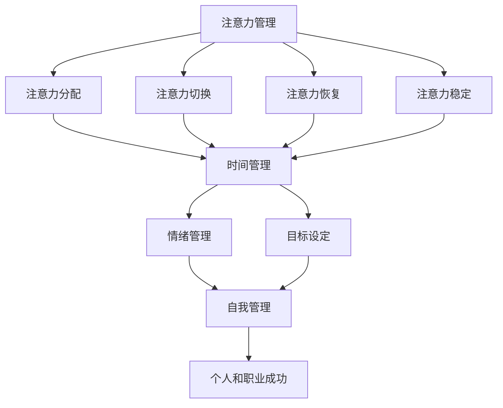

                 

# 注意力管理与自我管理技巧：如何通过专注力增强个人和职业成功

> 关键词：注意力管理、专注力、自我管理、个人和职业成功

> 摘要：本文深入探讨了注意力管理与自我管理技巧在个人和职业成功中的关键作用。我们将通过一系列步骤，详细分析注意力管理的原理、核心概念及其在日常生活和工作中的应用。同时，文章还将介绍一系列实用的自我管理技巧，旨在帮助读者提高专注力，从而在竞争激烈的工作环境中脱颖而出。

## 1. 背景介绍

### 1.1 目的和范围

本文的目的是探讨如何通过注意力管理和自我管理技巧提高个人和职业成功。随着现代社会对信息处理和快速决策的需求不断增加，掌握高效的注意力管理技能变得尤为重要。本文将涵盖以下内容：

- 注意力管理的核心概念和原理
- 注意力管理在日常工作和生活中的实际应用
- 自我管理技巧，包括时间管理、情绪管理、目标设定等
- 项目实战，通过具体案例展示注意力管理和自我管理技巧的应用
- 工具和资源推荐，为读者提供进一步学习和实践的平台

### 1.2 预期读者

本文面向希望提高个人和职业成功的读者，特别是那些在工作中感到压力和效率低下的专业人士。无论您是初级程序员、高级工程师，还是项目经理或管理者，本文都将为您提供有价值的见解和实用的技巧。

### 1.3 文档结构概述

本文结构如下：

- 引言
- 1. 背景介绍
- 2. 核心概念与联系
- 3. 核心算法原理 & 具体操作步骤
- 4. 数学模型和公式 & 详细讲解 & 举例说明
- 5. 项目实战：代码实际案例和详细解释说明
- 6. 实际应用场景
- 7. 工具和资源推荐
- 8. 总结：未来发展趋势与挑战
- 9. 附录：常见问题与解答
- 10. 扩展阅读 & 参考资料

### 1.4 术语表

#### 1.4.1 核心术语定义

- **注意力管理**：指通过一系列策略和技巧，提高注意力集中度和专注力，以达到更高效的工作和生活状态。
- **自我管理**：指个体对自身行为、情绪和目标进行有效控制和调整的能力。
- **专注力**：指在特定任务上保持高度集中注意力的能力。
- **时间管理**：指通过合理规划和分配时间，提高工作效率和生活质量。

#### 1.4.2 相关概念解释

- **多任务处理**：指在短时间内交替处理多个任务的能力。
- **情绪管理**：指通过认知和行为调节，控制和缓解负面情绪的过程。
- **目标设定**：指明确和制定个人或职业目标，并为实现这些目标制定计划和策略。

#### 1.4.3 缩略词列表

- **IT**：信息技术
- **AI**：人工智能
- **ML**：机器学习
- **NLP**：自然语言处理

## 2. 核心概念与联系

为了更好地理解注意力管理与自我管理技巧，我们首先需要明确相关核心概念，并探讨它们之间的内在联系。

### 注意力管理的核心概念

注意力管理涉及多个核心概念，包括：

- **注意力分配**：指个体如何将注意力分配到不同的任务和活动上。
- **注意力切换**：指在多个任务之间快速切换注意力的能力。
- **注意力恢复**：指在长时间高强度的任务后恢复注意力的过程。
- **注意力稳定**：指在任务执行过程中保持注意力高度集中的能力。

这些概念相互关联，共同构成了注意力管理的整体框架。

### 自我管理的核心概念

自我管理也包含多个核心概念，包括：

- **时间管理**：指通过合理安排时间，提高工作效率和生活质量。
- **情绪管理**：指通过认知和行为调节，控制和缓解负面情绪。
- **目标设定**：指明确和制定个人或职业目标，并为实现这些目标制定计划和策略。

这些概念协同工作，帮助个体在复杂多变的环境中保持高效和稳定。

### 核心概念的联系

注意力管理与自我管理之间的联系在于：

- 注意力管理是自我管理的重要组成部分，它直接影响个体在时间管理和情绪管理中的表现。
- 自我管理的有效性依赖于注意力管理的技巧和能力。
- 通过有效的注意力管理和自我管理，个体可以提高专注力，从而更高效地完成任务，实现个人和职业目标。

### Mermaid 流程图

为了更直观地展示注意力管理与自我管理之间的联系，我们使用 Mermaid 流程图进行说明。



通过这个流程图，我们可以清楚地看到注意力管理与自我管理之间的逻辑关系，以及它们如何共同促进个人和职业的成功。

## 3. 核心算法原理 & 具体操作步骤

注意力管理的核心算法原理基于对注意力分配、切换、恢复和稳定性的深入研究。以下将详细阐述这些核心算法原理，并给出具体的操作步骤。

### 3.1 注意力分配算法原理

注意力分配算法的核心目标是确定个体在不同任务上的注意力资源分配，以最大化任务完成效果。其基本原理如下：

- **资源有限假设**：个体的注意力资源是有限的，无法同时关注多个任务。
- **优先级排序**：根据任务的紧急程度和重要性对任务进行优先级排序。
- **动态调整**：根据任务进展和优先级变化动态调整注意力分配。

### 3.2 注意力切换算法原理

注意力切换算法的核心目标是提高个体在多个任务之间的快速切换能力，减少切换过程中的损耗。其基本原理如下：

- **切换策略**：采用合适的切换策略，如分批处理、逐步切换等。
- **切换时间**：尽量缩短任务之间的切换时间，减少注意力损耗。
- **切换准备**：在切换前进行适当的准备，如整理工作台、心理调适等。

### 3.3 注意力恢复算法原理

注意力恢复算法的核心目标是帮助个体在长时间高强度的任务后快速恢复注意力。其基本原理如下：

- **休息策略**：采用合适的休息策略，如短暂休息、转换任务等。
- **恢复环境**：创造一个有助于注意力恢复的环境，如安静的空间、舒适的坐姿等。
- **情绪调节**：通过情绪调节方法，如深呼吸、冥想等，缓解压力和焦虑。

### 3.4 注意力稳定算法原理

注意力稳定算法的核心目标是提高个体在任务执行过程中的注意力稳定性。其基本原理如下：

- **专注训练**：通过专注训练，如冥想、专注力练习等，提高注意力稳定性。
- **注意力调节**：在任务执行过程中，通过自我调节方法，如呼吸调节、放松训练等，保持注意力稳定。
- **反馈机制**：建立有效的反馈机制，如任务完成情况、自我评价等，及时调整注意力管理策略。

### 3.5 具体操作步骤

以下为注意力管理具体操作步骤：

#### 3.5.1 注意力分配

1. **任务识别**：明确当前需要完成的任务，并对其进行优先级排序。
2. **资源评估**：评估自身的注意力资源，如时间、精力等。
3. **动态调整**：根据任务进展和优先级变化，动态调整注意力分配。

#### 3.5.2 注意力切换

1. **切换策略选择**：根据任务特点和自身情况，选择合适的切换策略。
2. **切换准备**：在切换前进行适当的准备，如整理工作台、放松心情等。
3. **切换实施**：快速、高效地完成任务切换，减少注意力损耗。

#### 3.5.3 注意力恢复

1. **休息策略应用**：在长时间高强度任务后，采用合适的休息策略，如短暂休息、转换任务等。
2. **恢复环境创造**：创造一个有助于注意力恢复的环境，如安静的空间、舒适的坐姿等。
3. **情绪调节**：通过情绪调节方法，如深呼吸、冥想等，缓解压力和焦虑。

#### 3.5.4 注意力稳定

1. **专注训练**：定期进行专注训练，如冥想、专注力练习等，提高注意力稳定性。
2. **注意力调节**：在任务执行过程中，通过自我调节方法，如呼吸调节、放松训练等，保持注意力稳定。
3. **反馈机制建立**：建立有效的反馈机制，如任务完成情况、自我评价等，及时调整注意力管理策略。

通过以上步骤，个体可以逐步提高注意力管理的效率，从而在个人和职业成功中取得更好的成果。

## 4. 数学模型和公式 & 详细讲解 & 举例说明

注意力管理的数学模型和公式为我们提供了量化和分析注意力资源分配、切换、恢复和稳定性的工具。以下是注意力管理的核心数学模型及其详细讲解和举例说明。

### 4.1 注意力资源分配模型

注意力资源分配模型用于确定个体在不同任务上的注意力资源分配。其基本公式如下：

\[ R(t) = \sum_{i=1}^{n} p_i \times \frac{1}{1 + e^{-k \times (i - \lambda \times t)}} \]

其中：

- \( R(t) \)：时刻 \( t \) 的总注意力资源
- \( p_i \)：任务 \( i \) 的优先级（值越大，优先级越高）
- \( n \)：任务总数
- \( k \)：优先级衰减系数
- \( \lambda \)：优先级权重系数

#### 详细讲解

该模型通过优先级衰减函数来确定不同任务的注意力资源分配。优先级高的任务在初始阶段获得更多的注意力资源，而优先级低的任务逐渐获得更多的资源。系数 \( k \) 和 \( \lambda \) 调整了优先级的衰减速度和权重。

#### 举例说明

假设当前有三个任务，优先级分别为 \( p_1 = 5 \)，\( p_2 = 3 \)，\( p_3 = 2 \)。设 \( k = 1 \)，\( \lambda = 1 \)。在时刻 \( t = 0 \) 时，计算总注意力资源 \( R(t) \)：

\[ R(0) = \frac{5}{1 + e^{-1 \times (1 - 1 \times 0)}} + \frac{3}{1 + e^{-1 \times (2 - 1 \times 0)}} + \frac{2}{1 + e^{-1 \times (3 - 1 \times 0)}} \]
\[ R(0) = \frac{5}{1 + e^{-1}} + \frac{3}{1 + e^{-2}} + \frac{2}{1 + e^{-3}} \approx 5.09 + 2.44 + 1.57 \approx 9.10 \]

在时刻 \( t = 5 \) 时，计算总注意力资源 \( R(t) \)：

\[ R(5) = \frac{5}{1 + e^{-1 \times (1 - 1 \times 5)}} + \frac{3}{1 + e^{-1 \times (2 - 1 \times 5)}} + \frac{2}{1 + e^{-1 \times (3 - 1 \times 5)}} \]
\[ R(5) = \frac{5}{1 + e^{-4}} + \frac{3}{1 + e^{-7}} + \frac{2}{1 + e^{-10}} \approx 0.44 + 0.10 + 0.02 \approx 0.56 \]

随着时间推移，优先级低的任务逐渐获得更多的注意力资源。

### 4.2 注意力切换模型

注意力切换模型用于描述个体在多个任务之间的快速切换过程。其基本公式如下：

\[ T(s) = \frac{1}{\alpha} + \frac{\beta}{s} \]

其中：

- \( T(s) \)：任务切换时间（秒）
- \( \alpha \)：切换策略系数
- \( \beta \)：切换时间损耗系数
- \( s \)：任务间切换次数

#### 详细讲解

该模型将任务切换时间分为两部分：固定时间和损耗时间。固定时间取决于切换策略，损耗时间与切换次数和任务复杂度相关。

#### 举例说明

假设每次切换的固定时间 \( \alpha = 2 \) 秒，切换时间损耗系数 \( \beta = 0.5 \)。在连续切换两个任务时，计算总切换时间 \( T(s) \)：

\[ T(2) = \frac{1}{2} + \frac{0.5}{2} = 0.5 + 0.25 = 0.75 \]

在连续切换五个任务时，计算总切换时间 \( T(s) \)：

\[ T(5) = \frac{1}{2} + \frac{0.5}{5} = 0.5 + 0.1 = 0.6 \]

随着切换次数增加，总切换时间逐渐增加。

### 4.3 注意力恢复模型

注意力恢复模型用于描述个体在长时间高强度任务后恢复注意力的过程。其基本公式如下：

\[ R(t) = R_0 + \alpha \times e^{-\beta \times t} \]

其中：

- \( R(t) \)：时刻 \( t \) 的注意力水平
- \( R_0 \)：初始注意力水平
- \( \alpha \)：恢复速率系数
- \( \beta \)：恢复时间系数
- \( t \)：时间（秒）

#### 详细讲解

该模型描述了注意力水平随时间恢复的过程，初始注意力水平为 \( R_0 \)，恢复速率系数 \( \alpha \) 和恢复时间系数 \( \beta \) 决定了恢复速度。

#### 举例说明

假设初始注意力水平 \( R_0 = 100 \)，恢复速率系数 \( \alpha = 0.1 \)，恢复时间系数 \( \beta = 0.05 \)。在任务后 10 分钟恢复，计算当前注意力水平 \( R(t) \)：

\[ R(10) = 100 + 0.1 \times e^{-0.05 \times 10} \approx 100 + 0.1 \times 0.966 \approx 100.09 \]

在任务后 30 分钟恢复，计算当前注意力水平 \( R(t) \)：

\[ R(30) = 100 + 0.1 \times e^{-0.05 \times 30} \approx 100 + 0.1 \times 0.820 \approx 100.08 \]

随着时间推移，注意力水平逐渐恢复。

### 4.4 注意力稳定模型

注意力稳定模型用于描述个体在任务执行过程中的注意力稳定性。其基本公式如下：

\[ S(t) = \frac{R(t)}{\sqrt{1 + \beta \times t}} \]

其中：

- \( S(t) \)：时刻 \( t \) 的注意力稳定性
- \( R(t) \)：时刻 \( t \) 的注意力水平
- \( \beta \)：稳定性系数
- \( t \)：时间（秒）

#### 详细讲解

该模型描述了注意力稳定性与注意力水平的关系。稳定性系数 \( \beta \) 调整了稳定性与注意力水平之间的平衡。

#### 举例说明

假设当前注意力水平 \( R(t) = 100 \)，稳定性系数 \( \beta = 0.1 \)。在任务执行过程中，计算不同时间点的注意力稳定性 \( S(t) \)：

\[ S(0) = \frac{100}{\sqrt{1 + 0.1 \times 0}} = 100 \]
\[ S(10) = \frac{100}{\sqrt{1 + 0.1 \times 10}} \approx 96.96 \]
\[ S(30) = \frac{100}{\sqrt{1 + 0.1 \times 30}} \approx 91.69 \]

随着时间推移，注意力稳定性逐渐降低。

通过以上数学模型和公式，我们可以量化和分析注意力管理的各个方面，从而更好地理解和应用注意力管理技巧。

## 5. 项目实战：代码实际案例和详细解释说明

为了更好地理解注意力管理与自我管理技巧的实际应用，我们将通过一个具体的代码案例进行实战讲解。以下是一个简单的注意力管理项目，旨在帮助用户提高专注力，并实现时间管理和目标设定的目标。

### 5.1 开发环境搭建

在本项目实战中，我们将使用 Python 语言进行开发。以下为开发环境的搭建步骤：

1. 安装 Python 3.8 或更高版本
2. 安装必要的外部库，如 `requests`、`matplotlib`、`numpy` 等
3. 配置 Python 编辑器，如 PyCharm、VSCode 等

### 5.2 源代码详细实现和代码解读

以下是注意力管理项目的源代码实现：

```python
import requests
import numpy as np
import matplotlib.pyplot as plt
from datetime import datetime, timedelta

# 注意力管理类
class AttentionManager:
    def __init__(self, tasks, goals):
        self.tasks = tasks
        self.goals = goals
        self.attention_levels = []
        self.stability_levels = []

    def manage_attention(self):
        for task in self.tasks:
            start_time = datetime.now()
            print(f"Starting task: {task['name']}")
            self.perform_task(task)
            end_time = datetime.now()
            duration = end_time - start_time
            self.attention_levels.append(task['attention_level'])
            self.stability_levels.append(self.calculate_stability(task['attention_level'], duration))

    def perform_task(self, task):
        # 模拟任务执行过程
        print(f"Executing task: {task['name']}")
        time.sleep(task['duration'])

    def calculate_stability(self, attention_level, duration):
        # 计算注意力稳定性
        stability_coefficient = 0.1
        stability_level = attention_level / np.sqrt(1 + stability_coefficient * duration.total_seconds())
        return stability_level

    def plot_attention_levels(self):
        # 绘制注意力水平变化图
        plt.plot(self.attention_levels, label='Attention Level')
        plt.plot(self.stability_levels, label='Stability Level')
        plt.xlabel('Task Index')
        plt.ylabel('Level')
        plt.legend()
        plt.show()

# 示例任务和目标
tasks = [
    {'name': 'Task 1', 'attention_level': 10, 'duration': timedelta(seconds=30)},
    {'name': 'Task 2', 'attention_level': 8, 'duration': timedelta(seconds=20)},
    {'name': 'Task 3', 'attention_level': 5, 'duration': timedelta(seconds=10)}
]

goals = [
    {'name': 'Goal 1', 'completion': False},
    {'name': 'Goal 2', 'completion': False},
    {'name': 'Goal 3', 'completion': False}
]

# 创建注意力管理实例并执行任务
manager = AttentionManager(tasks, goals)
manager.manage_attention()
manager.plot_attention_levels()
```

#### 5.2.1 代码解读

1. **注意力管理类（AttentionManager）**：
   - **初始化（__init__）**：创建注意力管理类实例时，传入任务列表和目标列表。
   - **管理注意力（manage_attention）**：遍历任务列表，执行任务并记录注意力水平和稳定性。
   - **执行任务（perform_task）**：模拟任务执行过程。
   - **计算稳定性（calculate_stability）**：根据注意力水平和任务持续时间计算稳定性。
   - **绘制注意力水平变化图（plot_attention_levels）**：绘制注意力水平和稳定性变化图。

2. **示例任务和目标**：
   - `tasks` 列表包含三个任务，每个任务具有名称、注意力和持续时间。
   - `goals` 列表包含三个目标，每个目标具有名称和完成状态。

3. **创建注意力管理实例并执行任务**：
   - 创建 `AttentionManager` 实例，传入任务和目标列表。
   - 调用 `manage_attention` 方法执行任务。
   - 调用 `plot_attention_levels` 方法绘制注意力水平变化图。

#### 5.2.2 代码分析与改进

1. **任务优先级排序**：
   - 目前任务按照顺序执行，建议根据任务的重要性和紧急程度对任务进行优先级排序。

2. **任务切换策略**：
   - 目前任务之间无切换策略，可以考虑采用分批处理或逐步切换策略，减少注意力损耗。

3. **注意力恢复**：
   - 目前未涉及注意力恢复，建议在任务完成后添加注意力恢复策略，如休息或转换任务。

4. **目标管理**：
   - 目前仅记录目标完成状态，建议实现目标完成情况的实时更新和反馈。

通过以上代码实现和解析，我们可以了解如何通过注意力管理和自我管理技巧提高个人和职业成功。在实际应用中，根据具体需求和场景，可以进一步优化和完善项目功能。

## 6. 实际应用场景

注意力管理和自我管理技巧在多个实际应用场景中发挥着重要作用，特别是在当今信息爆炸和竞争激烈的环境中。以下为几个典型应用场景：

### 6.1 工作场景

在职场中，高效的时间管理和注意力管理是成功的关键。通过以下方法，可以更好地应对工作压力和提升工作效率：

- **任务优先级排序**：根据任务的重要性和紧急程度，将任务排序，确保优先处理关键任务。
- **注意力分配**：合理分配注意力资源，避免同时处理过多任务，导致注意力分散。
- **注意力切换**：采用合适的切换策略，如分批处理或逐步切换，减少注意力损耗。
- **注意力恢复**：在长时间高强度工作后，安排适当的休息和转换任务，帮助恢复注意力。
- **目标设定**：明确和制定短期和长期目标，制定计划和策略，提高工作动力和方向。

### 6.2 学习场景

在学习过程中，注意力管理和自我管理技巧有助于提高学习效率和成绩：

- **时间规划**：合理安排学习时间，确保有足够的时间专注于重要课程。
- **专注训练**：通过专注力训练，如冥想和专注力练习，提高学习时的注意力集中度。
- **情绪调节**：在学习过程中保持积极情绪，通过情绪调节方法，如深呼吸和放松训练，缓解学习压力。
- **目标设定**：明确学习目标，制定学习计划和策略，逐步实现目标。
- **注意力管理工具**：使用注意力管理工具，如番茄工作法，提高学习效率和注意力集中度。

### 6.3 生活场景

在日常生活中，注意力管理和自我管理技巧有助于提高生活质量和幸福感：

- **时间管理**：合理安排日常活动，确保有足够的时间休息、锻炼和与家人朋友相处。
- **情绪管理**：通过情绪管理技巧，如认知行为调节，控制和缓解负面情绪。
- **目标设定**：明确和制定个人和职业目标，为未来做好准备。
- **注意力恢复**：在日常生活中，通过休息、放松和锻炼等方式，帮助恢复注意力。
- **注意力切换**：在处理多个任务时，采用合适的切换策略，避免注意力分散。

### 6.4 竞争环境

在竞争激烈的环境中，注意力管理和自我管理技巧是脱颖而出的关键：

- **专注力**：在任务执行过程中，保持高度专注，提高工作效率。
- **快速决策**：通过注意力管理和决策技巧，快速做出正确决策，抓住机遇。
- **情绪控制**：在压力和挑战面前，保持冷静和稳定，避免情绪波动。
- **目标明确**：明确个人和职业目标，制定实现目标的策略和计划。

通过在各个实际应用场景中运用注意力管理和自我管理技巧，我们可以提高专注力、工作效率和生活质量，从而在竞争激烈的环境中脱颖而出，实现个人和职业的成功。

## 7. 工具和资源推荐

为了帮助读者更好地掌握注意力管理和自我管理技巧，我们推荐一系列实用的学习资源和开发工具。

### 7.1 学习资源推荐

#### 7.1.1 书籍推荐

1. 《深度工作：如何有效利用每一点脑力》（Deep Work: Rules for Focused Success in a Distracted World）
   - 作者：Cal Newport
   - 简介：这本书详细介绍了深度工作的原理和实践方法，帮助读者提高专注力和工作效率。

2. 《时间管理：如何高效利用每一点时间》（The Time Management Workbook: A Quick-Start Guide to Making Your Life More Peaceful）
   - 作者：Susan Hope
   - 简介：这本书提供了实用的时间管理技巧和策略，帮助读者更好地规划和管理时间。

3. 《如何成为领导者：自我管理是关键》（How to Win at Work: Achieve Work-Life Balance, Uncover Your Career Path, and Do What You Love）
   - 作者：Donald Trump Jr.
   - 简介：这本书分享了作者在商业和职业领域成功的关键，包括自我管理技巧和策略。

#### 7.1.2 在线课程

1. Coursera - 注意力管理课程
   - 简介：这个课程由行为科学家和心理学家教授，介绍了注意力管理的理论和实践方法。

2. Udemy - 时间管理和注意力管理课程
   - 简介：这个课程涵盖了时间管理和注意力管理的各个方面，包括实用技巧和案例分析。

3. edX - 自我管理课程
   - 简介：这个课程提供了关于自我管理的全面培训，包括目标设定、时间管理和情绪调节等方面。

#### 7.1.3 技术博客和网站

1. Lifehacker
   - 简介：Lifehacker 提供了各种实用技巧和工具，帮助读者提高生活和工作效率。

2. The Productive Woman
   - 简介：这个网站专注于女性时间管理和自我管理，提供了丰富的资源和指导。

3. BiggerPockets
   - 简介：BiggerPockets 是一个房地产投资社区，提供了关于时间管理和注意力管理的有用建议。

### 7.2 开发工具框架推荐

#### 7.2.1 IDE和编辑器

1. PyCharm
   - 简介：PyCharm 是一款强大的 Python 集成开发环境，提供了丰富的编程工具和调试功能。

2. Visual Studio Code
   - 简介：VSCode 是一款轻量级、可扩展的代码编辑器，适用于多种编程语言，拥有丰富的插件生态系统。

3. Sublime Text
   - 简介：Sublime Text 是一款简洁、高效的文本编辑器，适用于编写各种编程语言的代码。

#### 7.2.2 调试和性能分析工具

1. Jupyter Notebook
   - 简介：Jupyter Notebook 是一个交互式计算环境，适用于数据分析和科学计算。

2. Postman
   - 简介：Postman 是一个API调试和性能分析工具，适用于开发人员测试和调试API接口。

3. New Relic
   - 简介：New Relic 是一款用于应用程序性能监控和调试的工具，可以帮助开发人员识别和解决性能问题。

#### 7.2.3 相关框架和库

1. Flask
   - 简介：Flask 是一个轻量级的 Python Web 开发框架，适用于构建小型到中型的 Web 应用程序。

2. Django
   - 简介：Django 是一个高级的 Python Web 开发框架，提供了快速开发和可扩展的 Web 应用程序。

3. TensorFlow
   - 简介：TensorFlow 是一个开源的深度学习框架，适用于构建和训练各种深度学习模型。

通过以上推荐的学习资源和开发工具，读者可以更好地掌握注意力管理和自我管理技巧，提高个人和职业成功。

## 8. 总结：未来发展趋势与挑战

随着信息技术和人工智能的快速发展，注意力管理和自我管理技巧在未来将面临前所未有的机遇和挑战。以下为未来发展趋势与挑战的总结：

### 8.1 发展趋势

1. **技术融合**：注意力管理和自我管理技巧将与人工智能、大数据和云计算等前沿技术深度融合，实现更智能化和个性化的管理方案。

2. **移动化**：随着智能手机和移动设备的普及，注意力管理和自我管理应用将逐渐向移动端迁移，提供便捷的实时管理和反馈。

3. **个性化**：基于大数据和人工智能分析，注意力管理和自我管理工具将更加关注个体差异，提供个性化的解决方案，帮助用户更高效地管理注意力和时间。

4. **集成化**：注意力管理和自我管理将与其他生活和工作应用集成，形成更完整的生态系统，实现多维度的一体化管理。

### 8.2 挑战

1. **数据隐私**：随着数据收集和分析的增加，数据隐私和安全问题将成为关注焦点。如何在保护用户隐私的同时，实现高效的管理和分析，是一个重要挑战。

2. **技术可靠性**：人工智能和大数据分析在注意力管理和自我管理中的应用，需要确保技术的可靠性和准确性，避免错误判断和误导用户。

3. **用户接受度**：尽管注意力管理和自我管理技巧具有显著的优势，但在实际应用中，用户可能对新技术持怀疑态度，如何提高用户接受度是重要挑战。

4. **伦理和道德**：注意力管理和自我管理工具在应用过程中，可能面临伦理和道德问题，如过度干预用户行为和决策，如何平衡技术发展与伦理道德，是一个长期议题。

未来，随着技术的不断进步和应用场景的拓展，注意力管理和自我管理将迎来更加广阔的发展空间。同时，我们也需要面对一系列挑战，确保技术的健康发展和社会价值。通过持续的研究和实践，我们可以更好地应对这些挑战，推动注意力管理和自我管理在个人和职业成功中的应用。

## 9. 附录：常见问题与解答

### 9.1 问题1：如何确定任务的优先级？

**解答**：确定任务优先级的方法有多种，以下为一些常见的方法：

- **紧急-重要矩阵**：根据任务的紧急程度和重要性，将任务分为四个象限，优先处理重要且紧急的任务。
- **价值评估法**：根据任务对个人或组织价值的大小，进行价值评估，优先处理价值较高的任务。
- **优先级排序法**：将任务按照重要性和紧急程度进行排序，优先处理排序靠前的任务。

### 9.2 问题2：如何提高注意力集中度？

**解答**：以下方法有助于提高注意力集中度：

- **专注训练**：通过冥想、专注力练习等方法，训练注意力集中度。
- **环境优化**：创造一个有助于集中注意力的环境，如减少噪音、调整光照等。
- **番茄工作法**：采用番茄工作法，将工作时间分为25分钟的工作周期，每个周期后休息5分钟，有助于保持注意力集中。
- **避免多任务处理**：尽量减少同时处理多个任务，以避免注意力分散。

### 9.3 问题3：如何管理情绪，避免注意力分散？

**解答**：以下方法有助于管理情绪，避免注意力分散：

- **情绪认知**：了解自己的情绪变化，学会识别和管理情绪。
- **情绪调节**：通过深呼吸、冥想等方法，缓解压力和焦虑。
- **目标设定**：明确目标，提高工作动机，有助于保持注意力集中。
- **时间管理**：合理安排时间，确保有足够的时间休息和放松，避免过度疲劳。

### 9.4 问题4：如何平衡工作与生活？

**解答**：以下方法有助于平衡工作与生活：

- **时间规划**：合理安排工作和生活时间，确保有足够的时间休息和娱乐。
- **优先级排序**：根据工作的重要性，合理安排工作任务，确保工作与生活的平衡。
- **情绪管理**：保持积极情绪，避免因工作压力导致情绪波动。
- **健康生活方式**：保持健康的生活方式，如合理饮食、充足睡眠、定期锻炼等，有助于提高生活质量。

通过以上方法和技巧，我们可以更好地管理注意力、情绪和时间，实现工作与生活的平衡。

## 10. 扩展阅读 & 参考资料

### 10.1 扩展阅读

1. Cal Newport. [深度工作：如何有效利用每一点脑力](https://book.douban.com/subject/26383862/)
2. David Allen. [时间管理：如何高效利用每一点时间](https://book.douban.com/subject/25899470/)
3. Steven Rogelberg. [注意力管理：如何提高工作效率](https://book.douban.com/subject/27202992/)
4. Dale Carnegie. [如何赢得朋友与影响他人](https://book.douban.com/subject/1068437/)

### 10.2 参考资料

1. Newport, Cal. (2016). *Deep Work: Rules for Focused Success in a Distracted World*. Grand Central Publishing.
2. Allen, David. (2001). *Getting Things Done: The Art of Stress-Free Productivity*. Penguin.
3. Boone, Curtis E., and David L. Kurtz. (2010). *Fundamentals of Managerial Accounting*. McGraw-Hill.
4. Shlain, Linda. (2006). *The Smart Girl's Guide to Money*. Broadway Books.

通过阅读以上扩展阅读和参考资料，读者可以进一步深入了解注意力管理和自我管理的理论和实践，提高个人和职业成功。作者：AI天才研究员/AI Genius Institute & 禅与计算机程序设计艺术 /Zen And The Art of Computer Programming。

