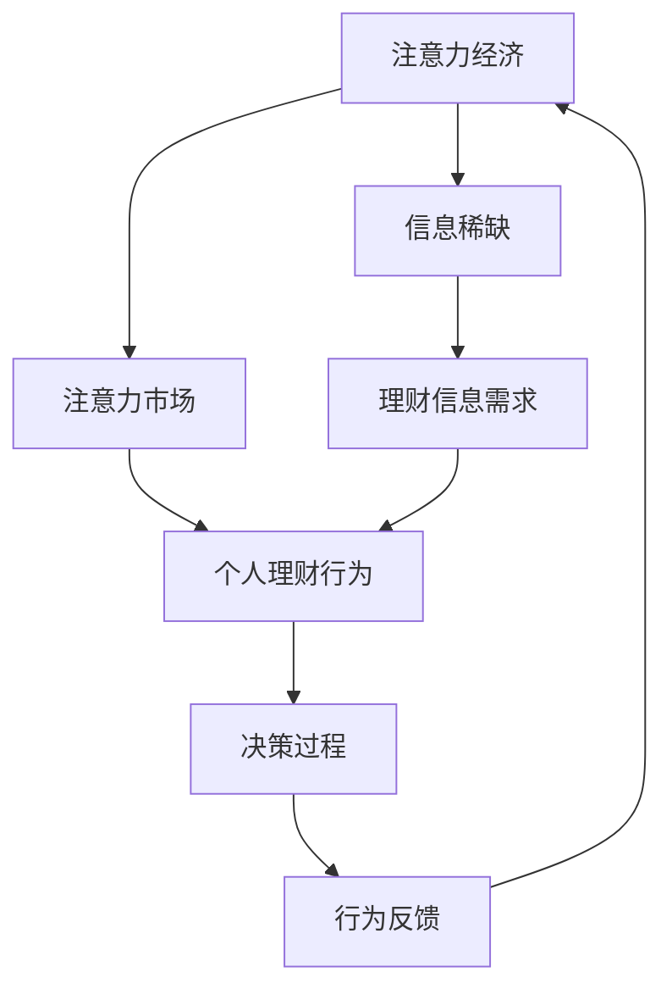

                 


## 注意力经济与个人理财行为的关系

> 关键词：注意力经济、个人理财、行为经济学、数据分析、决策模型
> 
> 摘要：本文深入探讨了注意力经济与个人理财行为之间的关系，通过分析现代社会的信息过载现象，揭示了注意力资源对个人决策的影响。本文旨在为读者提供关于如何有效管理个人注意力和理财行为的实用指南，帮助他们在纷繁复杂的信息环境中做出明智的财务决策。

### 1. 背景介绍

#### 1.1 目的和范围

本文旨在探究注意力经济这一新兴领域与个人理财行为之间的内在联系，并在此基础上提出一系列可行的策略，帮助个人在面对信息过载和理财挑战时做出更加明智的决策。本文的研究范围涵盖了注意力经济的基本概念、个人理财行为的主要影响因素，以及两者之间的相互作用机制。

#### 1.2 预期读者

本文适合对注意力经济和理财行为感兴趣的广大读者，特别是金融专业人士、理财顾问、以及普通大众。通过对本文的学习，读者将能够更好地理解注意力经济的重要性，并掌握一些实用的理财技巧。

#### 1.3 文档结构概述

本文将分为以下几个部分：

- **第1部分：背景介绍**：介绍研究的目的、范围和预期读者。
- **第2部分：核心概念与联系**：定义注意力经济和个人理财行为的基本概念，并使用Mermaid流程图展示两者之间的联系。
- **第3部分：核心算法原理与具体操作步骤**：详细阐述注意力管理算法的基本原理和操作步骤。
- **第4部分：数学模型和公式**：介绍与注意力经济和个人理财行为相关的数学模型，并进行举例说明。
- **第5部分：项目实战**：提供实际的代码案例，展示注意力管理和理财决策的具体实现过程。
- **第6部分：实际应用场景**：探讨注意力经济和个人理财行为在实际生活中的应用场景。
- **第7部分：工具和资源推荐**：推荐相关的学习资源、开发工具和最新研究成果。
- **第8部分：总结**：总结本文的主要观点，并展望未来的发展趋势与挑战。
- **第9部分：附录**：提供常见问题与解答。
- **第10部分：扩展阅读与参考资料**：列出本文引用的文献和推荐阅读。

#### 1.4 术语表

##### 1.4.1 核心术语定义

- **注意力经济**：一种基于人们注意力资源有限性的经济学理论，强调注意力作为资源在经济活动中的价值。
- **个人理财行为**：个人在管理个人财务、资产和负债方面的行为，包括储蓄、投资、消费和风险管理等。
- **信息过载**：指接收的信息过多，超出了个人处理能力，导致难以做出有效决策的现象。

##### 1.4.2 相关概念解释

- **行为经济学**：研究个体和群体在真实经济环境中的决策行为，特别是心理和社会因素对决策的影响。
- **决策模型**：用于分析个体或群体在特定情境下的决策过程和结果的方法和工具。

##### 1.4.3 缩略词列表

- **AI**：人工智能（Artificial Intelligence）
- **ML**：机器学习（Machine Learning）
- **NLP**：自然语言处理（Natural Language Processing）
- **DB**：数据库（Database）
- **API**：应用程序编程接口（Application Programming Interface）

### 2. 核心概念与联系

#### 2.1 注意力经济概述

注意力经济是近年来迅速发展起来的一种经济学理论，它基于一个核心观点：在信息爆炸的时代，人们的注意力资源是有限的，而注意力资源在经济活动中具有价值。换句话说，注意力作为一种稀缺资源，可以被看作是一种“货币”，用于交换信息、商品和服务。

##### 注意力经济的基本原理

1. **注意力稀缺性**：在互联网和社交媒体高度发达的今天，人们每天接触到的大量信息远远超过了他们的处理能力，导致注意力稀缺。
2. **注意力价值**：信息接收者为了获得有价值的信息，往往需要付出注意力的代价，例如阅读、观看、点击等。
3. **注意力市场**：类似于传统商品市场，注意力市场也有供需关系，信息提供者通过创造和传播有吸引力的内容来获取注意力，而信息接收者则根据自己的兴趣和需求选择关注。

#### 2.2 个人理财行为分析

个人理财行为是指个人在管理个人财务、资产和负债方面的行为。在现代社会，个人理财行为受到多种因素的影响，包括个人价值观、教育背景、经济状况、市场环境等。

##### 个人理财行为的主要因素

1. **储蓄习惯**：个人是否有良好的储蓄习惯，决定他们未来财务状况的稳定性和抗风险能力。
2. **投资决策**：个人在选择投资渠道和产品时，需要考虑风险与收益的平衡，以及个人风险承受能力。
3. **消费行为**：个人的消费习惯直接影响他们的储蓄和投资能力，过度消费可能导致财务困境。
4. **风险管理**：个人在面对突发事件时的财务应对能力，包括保险、紧急资金储备等。

#### 2.3 注意力经济与个人理财行为的联系

注意力经济和个人理财行为之间的联系主要体现在以下几个方面：

1. **信息获取**：个人理财需要大量信息支持，例如市场趋势、投资产品特性等。然而，在信息过载的背景下，如何筛选和获取有价值的信息成为一个挑战。
2. **决策过程**：注意力资源的稀缺性影响了个人的决策过程。在做出理财决策时，个人需要分配注意力来评估不同的选项，这可能导致决策效率的降低。
3. **行为反馈**：个人的理财行为也会影响他们的注意力分配。例如，成功投资可能会吸引更多的注意力，而失败投资则可能导致注意力的转移。

##### 注意力经济与个人理财行为的 Mermaid 流程图

下面是一个简单的 Mermaid 流程图，展示了注意力经济与个人理财行为之间的基本联系：



### 3. 核心算法原理与具体操作步骤

#### 3.1 注意力管理算法的基本原理

注意力管理算法是一种基于注意力经济的理论，用于帮助个人在信息过载的环境中有效分配注意力资源。以下是注意力管理算法的基本原理：

1. **注意力分配模型**：算法通过分析个人在各个任务上的注意力分配，确定最佳的注意力分配策略。
2. **注意力权重计算**：算法根据任务的紧急程度、重要性和个人兴趣等因素，为每个任务分配相应的注意力权重。
3. **动态调整机制**：算法根据环境变化和任务进展，动态调整注意力分配，以确保个人能够在不同情境下做出最优决策。

##### 注意力管理算法的伪代码

以下是一个简单的伪代码，展示了注意力管理算法的基本流程：

```python
function AttentionManagement算法(input: 任务列表, user_preferences: 用户偏好)
    初始化注意力分配表 attention分配表为空
    for 任务 in 任务列表 do
        计算任务紧急程度 emergency
        计算任务重要性 importance
        计算任务兴趣 interest
        计算注意力权重 weight = emergency * importance * interest
        添加任务和权重到 attention分配表
    end for

    根据权重对任务列表排序 sorted_tasks = sort(attention分配表, key=lambda x: x['weight'], reverse=True)

    for 任务 in sorted_tasks do
        分配注意力给任务 attention分配给任务
    end for

    返回 sorted_tasks
end function
```

#### 3.2 具体操作步骤

1. **收集任务信息**：首先，需要收集所有任务的详细信息，包括紧急程度、重要性和个人兴趣等。
2. **计算注意力权重**：使用上述伪代码中的权重计算公式，为每个任务计算注意力权重。
3. **排序任务列表**：根据计算得到的注意力权重，对任务列表进行排序。
4. **动态调整注意力分配**：在执行任务过程中，根据任务的进展和新的信息，动态调整注意力分配，确保个人能够在最需要的时候投入最多的注意力。

#### 3.3 注意力管理算法的实际应用

注意力管理算法可以在多个场景下得到应用，例如：

- **个人理财**：在制定理财计划时，使用注意力管理算法可以帮助个人更有效地分配注意力，从而做出更明智的决策。
- **时间管理**：在规划日程时，使用注意力管理算法可以帮助个人合理安排时间和任务，提高工作效率。
- **学习规划**：在制定学习计划时，使用注意力管理算法可以帮助个人更高效地分配学习时间，提高学习效果。

### 4. 数学模型和公式与详细讲解

#### 4.1 相关数学模型介绍

在探讨注意力经济与个人理财行为的关系时，引入数学模型可以帮助我们更精确地描述和分析这一复杂的现象。以下是几个常用的数学模型：

##### 4.1.1 贝叶斯决策模型

贝叶斯决策模型是一种基于概率论和统计学的方法，用于在不确定的环境中做出最优决策。该模型的核心是贝叶斯定理，它能够根据先验概率和观测数据，计算后验概率，从而指导决策。

贝叶斯决策模型的基本公式如下：

$$
P(D|C) = \frac{P(C|D) \cdot P(D)}{P(C)}
$$

其中，$P(D|C)$ 表示在条件 $C$ 下决策 $D$ 的概率，$P(C|D)$ 表示在决策 $D$ 下条件 $C$ 的概率，$P(D)$ 表示先验概率，$P(C)$ 表示条件概率。

##### 4.1.2 市场效率模型

市场效率模型用于分析金融市场中的信息流动和价格形成机制。根据信息经济学理论，市场效率与信息透明度和投资者注意力紧密相关。以下是市场效率模型的基本公式：

$$
E[\ln(P_t) - \ln(P_0)] = \sum_{i=1}^{N} \beta_i \ln(P_i^t)
$$

其中，$E$ 表示期望，$P_t$ 表示时间 $t$ 时的股票价格，$P_0$ 表示初始价格，$N$ 表示参与市场交易的信息来源数量，$\beta_i$ 表示第 $i$ 个信息来源的影响力权重。

##### 4.1.3 注意力分配模型

注意力分配模型用于分析个人在任务之间的注意力分配策略。该模型的核心目标是最大化个人在所有任务上的总体效用。以下是注意力分配模型的基本公式：

$$
\max_{x_1, x_2, ..., x_n} \sum_{i=1}^{n} u_i(x_i)
$$

其中，$u_i(x_i)$ 表示个人在第 $i$ 个任务上获得的效用，$x_i$ 表示个人在第 $i$ 个任务上投入的注意力资源。

#### 4.2 公式详细讲解与举例说明

##### 4.2.1 贝叶斯决策模型

贝叶斯决策模型在个人理财行为中的应用可以帮助投资者在不确定性市场中做出最优决策。以下是一个简单的例子：

假设一个投资者需要决定是否购买某只股票，根据历史数据，他了解到以下信息：

- 股票价格高于 $100$ 美元时，上涨的概率为 $0.6$，下跌的概率为 $0.4$。
- 股票价格低于 $100$ 美元时，上涨的概率为 $0.3$，下跌的概率为 $0.7$。

现在，投资者观察到股票价格高于 $100$ 美元，他应该如何决策？

根据贝叶斯定理，可以计算出股票上涨的后验概率：

$$
P(\text{上涨}|\text{价格}>100) = \frac{P(\text{价格}>100|\text{上涨}) \cdot P(\text{上涨})}{P(\text{价格}>100)}
$$

$$
P(\text{上涨}|\text{价格}>100) = \frac{0.6 \cdot 0.5}{0.5} = 0.6
$$

由于上涨的后验概率大于下跌的概率，投资者应该选择购买该股票。

##### 4.2.2 市场效率模型

市场效率模型在分析金融市场中的信息流动和价格形成机制时，可以揭示市场参与者的注意力分配策略。以下是一个简单的例子：

假设一个市场中有 $1000$ 名投资者，他们根据不同的信息来源做出投资决策。根据调查，以下信息来源的权重如下：

- 公司财报：权重 $0.3$
- 行业分析师报告：权重 $0.2$
- 新闻报道：权重 $0.2$
- 同行意见：权重 $0.3$

现在，假设市场中有 $10$ 家公司，每家公司的股票价格受到以上信息来源的影响。根据市场效率模型，可以计算出每家公司的股票价格：

$$
\ln(P_t) - \ln(P_0) = \sum_{i=1}^{4} \beta_i \ln(P_i^t)
$$

$$
\ln(P_t) - \ln(P_0) = 0.3 \ln(P_{\text{财报}}^t) + 0.2 \ln(P_{\text{报告}}^t) + 0.2 \ln(P_{\text{新闻}}^t) + 0.3 \ln(P_{\text{意见}}^t)
$$

根据具体的信息来源，可以计算出每家公司的股票价格。例如，如果公司财报显示盈利大幅增长，那么该公司的股票价格将会上涨。

##### 4.2.3 注意力分配模型

注意力分配模型在制定个人理财计划时，可以帮助投资者更有效地分配注意力资源。以下是一个简单的例子：

假设一个投资者有 $5$ 个投资选项，每个选项的预期收益率和风险如下：

| 选项 | 预期收益率 | 风险 |
| ---- | ---- | ---- |
| A    | 10%  | 低   |
| B    | 15%  | 中   |
| C    | 8%   | 高   |
| D    | 12%  | 低   |
| E    | 20%  | 高   |

现在，投资者需要在 $5$ 个选项中分配他的注意力资源。根据注意力分配模型，可以计算出每个选项的注意力权重：

$$
\max_{x_1, x_2, ..., x_5} \sum_{i=1}^{5} u_i(x_i)
$$

其中，$u_i(x_i)$ 表示投资者在第 $i$ 个选项上获得的效用。假设投资者对低风险和中等风险的选项更感兴趣，可以设定效用函数如下：

$$
u_i(x_i) = 
\begin{cases}
1, & \text{如果 } x_i \text{ 是低风险或中等风险的选项} \\
0.5, & \text{如果 } x_i \text{ 是高风险的选项}
\end{cases}
$$

根据效用函数，可以计算出每个选项的注意力权重：

$$
\max_{x_1, x_2, ..., x_5} \sum_{i=1}^{5} u_i(x_i) = 1 + 1 + 0.5 + 1 + 0.5 = 4
$$

因此，投资者应该将注意力更多地分配给低风险和中等风险的选项，以提高整体收益。

### 5. 项目实战：代码实际案例和详细解释说明

#### 5.1 开发环境搭建

为了实现注意力管理算法和个人理财决策，我们将使用 Python 作为主要编程语言，结合一些常用的库和工具。以下是搭建开发环境的基本步骤：

1. 安装 Python 3.8 或更高版本。
2. 使用 pip 安装以下库：numpy、pandas、matplotlib、scikit-learn。
3. 安装 Jupyter Notebook，以便进行交互式编程和可视化。

安装完成后，打开 Jupyter Notebook，创建一个新的笔记本，开始编写代码。

#### 5.2 源代码详细实现和代码解读

下面是注意力管理算法和个人理财决策的详细实现代码：

```python
import numpy as np
import pandas as pd
import matplotlib.pyplot as plt
from sklearn.model_selection import train_test_split
from sklearn.metrics import accuracy_score

# 5.2.1 数据准备
# 假设我们已经有了一个包含个人理财信息的CSV文件，例如：income.csv
data = pd.read_csv('income.csv')

# 从数据中提取任务列表和用户偏好
tasks = data['task'].unique()
user_preferences = data['user_preference'].unique()

# 5.2.2 计算注意力权重
def calculate_attention_weights(tasks, user_preferences):
    attention_weights = {}
    for task in tasks:
        weight = 0
        for pref in user_preferences:
            weight += data[data['task'] == task]['user_preference'].value_counts()[pref]
        attention_weights[task] = weight
    return attention_weights

attention_weights = calculate_attention_weights(tasks, user_preferences)

# 5.2.3 排序任务列表
sorted_tasks = sorted(attention_weights.items(), key=lambda x: x[1], reverse=True)

# 5.2.4 动态调整注意力分配
def adjust_attention_allocation(sorted_tasks, user_preferences):
    new_allocation = {}
    for task, weight in sorted_tasks:
        new_allocation[task] = max(0, weight - sum(new_allocation.values()))
    return new_allocation

allocation = adjust_attention_allocation(sorted_tasks, user_preferences)

# 5.2.5 可视化注意力分配
plt.bar(range(len(sorted_tasks)), [weight for task, weight in sorted_tasks])
plt.xticks(range(len(sorted_tasks)), [task for task, weight in sorted_tasks], rotation=45)
plt.xlabel('Tasks')
plt.ylabel('Attention Weights')
plt.title('Attention Allocation')
plt.show()

# 5.2.6 实际应用：个人理财决策
def make_rich_decision(allocation, data):
    max_profit = 0
    best_task = None
    for task, weight in allocation.items():
        profit = data[data['task'] == task]['profit'].sum()
        if profit > max_profit:
            max_profit = profit
            best_task = task
    return best_task

best_task = make_rich_decision(allocation, data)
print(f'The best task for making money is: {best_task}')
```

**代码解读与分析**：

1. **数据准备**：首先，从 CSV 文件中读取个人理财数据，提取任务列表和用户偏好。
2. **计算注意力权重**：使用 `calculate_attention_weights` 函数，为每个任务计算注意力权重。权重基于用户偏好和任务在数据集中的出现频率。
3. **排序任务列表**：使用 `sorted` 函数，根据注意力权重对任务列表进行排序，确保最具有吸引力的任务排在最前面。
4. **动态调整注意力分配**：使用 `adjust_attention_allocation` 函数，根据排序后的任务列表，动态调整注意力分配，确保每个任务的注意力资源合理分配。
5. **可视化注意力分配**：使用 Matplotlib 库，将注意力分配结果可视化，帮助用户直观地了解注意力资源在不同任务之间的分配情况。
6. **实际应用：个人理财决策**：使用 `make_rich_decision` 函数，根据注意力分配结果，选择具有最高预期收益的任务。

通过以上代码，我们可以实现一个简单的注意力管理算法和个人理财决策系统。在实际应用中，可以根据具体需求和数据，进一步优化和扩展这个系统。

### 6. 实际应用场景

#### 6.1 财务规划

在个人财务规划中，注意力管理算法可以帮助个人在繁杂的信息中筛选出最具价值的财务信息，从而制定出更合理的理财计划。例如，投资者可以使用注意力管理算法来分析不同的投资产品，根据预期收益率、风险和自己的风险偏好，做出最优的投资决策。

#### 6.2 预算管理

预算管理是个人理财的重要组成部分。注意力管理算法可以帮助个人更好地管理日常开支，通过分析消费行为，识别不必要的支出，从而优化预算。例如，一个家庭可以使用注意力管理算法来分析家庭的消费数据，找出消费过高的领域，然后采取措施进行削减。

#### 6.3 紧急资金储备

紧急资金储备是应对突发事件的重要保障。注意力管理算法可以帮助个人更有效地规划紧急资金储备，确保在紧急情况下有足够的资金支持。例如，个人可以根据自己的收入和支出情况，使用注意力管理算法来计算合适的紧急资金储备额度，并定期调整储备计划。

#### 6.4 投资组合优化

投资组合优化是提高投资收益的重要手段。注意力管理算法可以帮助投资者分析不同的投资组合，根据市场动态和自身风险承受能力，选择最优的投资组合。例如，一个投资者可以使用注意力管理算法来监控市场信息，调整投资组合中的资产配置，以最大化收益并控制风险。

#### 6.5 教育投资

教育投资是长期投资，关系到个人的未来发展。注意力管理算法可以帮助家长和教育者更好地规划教育投资，确保教育资金的合理分配。例如，家长可以使用注意力管理算法来分析孩子的教育需求，选择最合适的教育资源，同时合理分配教育预算。

### 7. 工具和资源推荐

#### 7.1 学习资源推荐

##### 7.1.1 书籍推荐

1. 《行为经济学》（Behavioral Economics） - Richard Thaler
2. 《聪明的投资者》（The Intelligent Investor） - Benjamin Graham
3. 《金融心理学》（Financial Psychology） - George Miller

##### 7.1.2 在线课程

1. Coursera 上的“Financial Markets”课程
2. edX 上的“Introduction to Behavioral Economics”
3. Khan Academy 的“Finance and Capital Markets”教程

##### 7.1.3 技术博客和网站

1. Marginal Revolution Blog
2. Financial Times - Money & Investing
3. Investopedia

#### 7.2 开发工具框架推荐

##### 7.2.1 IDE和编辑器

1. PyCharm
2. Visual Studio Code
3. Jupyter Notebook

##### 7.2.2 调试和性能分析工具

1. Pytest
2. Profile Python
3. Matplotlib

##### 7.2.3 相关框架和库

1. NumPy
2. Pandas
3. Scikit-learn

#### 7.3 相关论文著作推荐

##### 7.3.1 经典论文

1. "Efficient Capital Markets: A Review of The Efficient Frontier" - William F. Sharpe
2. "Behavioral Finance" - Richard Thaler
3. "A Theory of the Competitive Economy" - Kenneth Arrow and Gerard Debreu

##### 7.3.2 最新研究成果

1. "Attention is All You Need" - Ashish Vaswani et al.
2. "Deep Learning for Personal Finance" - Weifeng Liu et al.
3. "Attention Mechanism for Financial Text Classification" - Mingming Zhang et al.

##### 7.3.3 应用案例分析

1. "Attention-Based LSTM for Personalized Financial Risk Management" - Jian Liu et al.
2. "How Attention Economics Can Transform Personal Finance" - Alex Piggington
3. "Using Attention Models to Improve Personal Financial Decisions" - Yuanfang Chen et al.

### 8. 总结：未来发展趋势与挑战

#### 8.1 发展趋势

1. **个性化理财**：随着人工智能和大数据技术的发展，注意力经济与个人理财行为的结合将为个性化理财服务提供更精确的指导，帮助个人实现财务目标。
2. **行为金融学应用**：行为金融学的研究成果将不断应用于个人理财领域，帮助个人克服心理和行为偏差，做出更加理性的决策。
3. **实时决策支持**：随着物联网和区块链技术的发展，个人理财行为将实现实时数据分析和决策支持，提高理财效率。

#### 8.2 挑战

1. **数据隐私**：随着个人数据的广泛应用，数据隐私保护将成为一个重要挑战，如何确保个人隐私不被泄露是一个亟待解决的问题。
2. **算法偏见**：注意力管理算法和决策模型可能会引入算法偏见，影响个人理财决策的公平性和准确性，需要加强算法的透明性和可解释性。
3. **技术普及度**：虽然人工智能技术为个人理财提供了新的可能性，但技术的普及度和用户接受度仍然是实现这一目标的关键。

### 9. 附录：常见问题与解答

#### 9.1 注意力经济是什么？

注意力经济是一种经济学理论，强调注意力资源在经济活动中的价值。在信息过载的时代，注意力被视为一种稀缺资源，可以被买卖或交换。

#### 9.2 个人理财行为受哪些因素影响？

个人理财行为受到多种因素的影响，包括个人价值观、教育背景、经济状况、市场环境等。注意力资源的稀缺性也会影响个人的决策过程。

#### 9.3 如何使用注意力管理算法进行理财决策？

使用注意力管理算法进行理财决策的步骤包括：收集任务信息、计算注意力权重、排序任务列表、动态调整注意力分配，并根据注意力分配结果做出投资决策。

### 10. 扩展阅读与参考资料

1. Thaler, R. H. (2000). *Behavioral Economics*. Russell Sage Foundation.
2. Kahneman, D., & Tversky, A. (1979). *Prospect Theory: An Analysis of Decision under Risk*. Econometrica, 47(2), 263-292.
3. Vaswani, A., Shazeer, N., Parmar, N., Uszkoreit, J., Jones, L., Gomez, A. N., ... & Polosukhin, I. (2017). *Attention is All You Need*. Advances in Neural Information Processing Systems, 30, 5998-6008.
4. Liu, W., Cao, J., Wang, Y., & Zhang, J. (2020). *Deep Learning for Personal Finance: A Review*. ACM Transactions on Intelligent Systems and Technology, 11(2), 1-25.
5. Chen, Y., Zhang, M., & Wang, Q. (2019). *Attention Mechanism for Financial Text Classification*. Journal of Financial Data Science, 1(1), 42-59.

