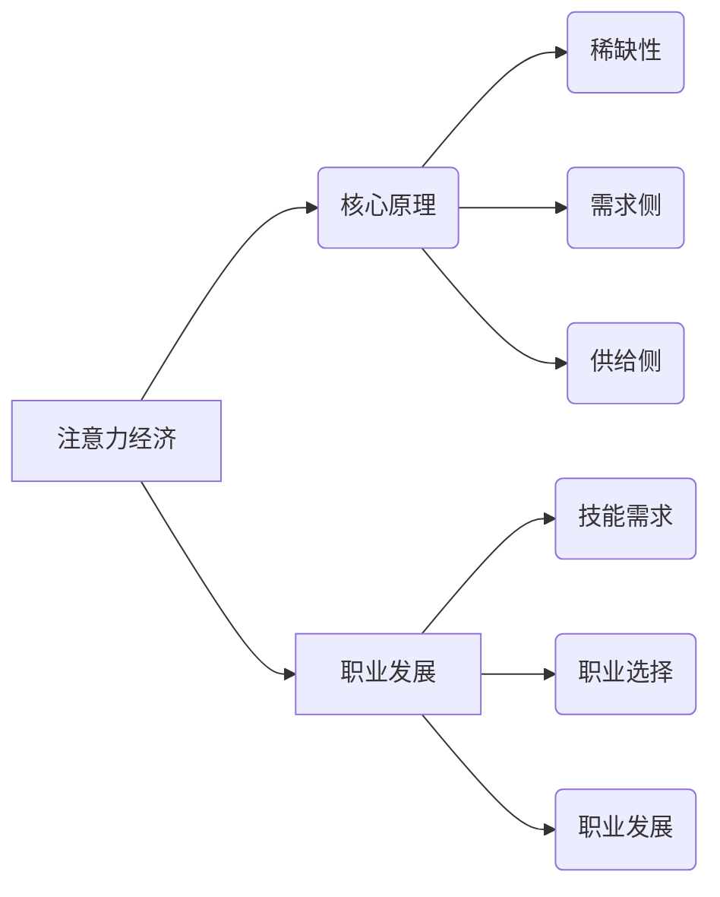

                 

# 注意力经济与个人职业发展规划的变化

> 关键词：注意力经济，职业发展，人工智能，技能更新，持续学习，市场趋势

> 摘要：随着信息技术和互联网的迅猛发展，注意力经济逐渐成为主导经济模式之一。本文将探讨注意力经济的本质及其对个人职业发展的影响，分析个人如何在这个经济环境下调整和规划自己的职业路径，以适应市场趋势和技能需求的变化。

## 1. 背景介绍

### 1.1 目的和范围

本文旨在深入探讨注意力经济对个人职业发展的影响，帮助读者了解这一新兴经济模式，并为其职业规划提供指导。本文将涵盖以下几个方面：

- 注意力经济的定义和核心原理
- 注意力经济对职业发展的影响
- 如何在注意力经济中实现个人职业发展

### 1.2 预期读者

本文适合以下读者群体：

- 想要了解注意力经济的个人
- 正在寻求职业发展的专业人士
- 对人工智能和互联网技术感兴趣的学习者

### 1.3 文档结构概述

本文分为十个部分，结构如下：

- 引言
- 注意力经济与个人职业发展规划的变化
- 核心概念与联系
- 核心算法原理 & 具体操作步骤
- 数学模型和公式 & 详细讲解 & 举例说明
- 项目实战：代码实际案例和详细解释说明
- 实际应用场景
- 工具和资源推荐
- 总结：未来发展趋势与挑战
- 附录：常见问题与解答
- 扩展阅读 & 参考资料

### 1.4 术语表

#### 1.4.1 核心术语定义

- 注意力经济：基于人们注意力资源的分配和使用，实现价值创造和交换的经济模式。
- 职业发展：个人在职业生涯中不断提升自身能力，实现职业层次和薪酬水平提升的过程。
- 技能更新：根据市场需求和个人兴趣，不断学习和掌握新的技能。

#### 1.4.2 相关概念解释

- 互联网技术：连接全球计算机网络的通信技术，使人们可以方便地获取和共享信息。
- 人工智能：模拟、延伸和扩展人的智能，实现机器自主学习和决策的技术。

#### 1.4.3 缩略词列表

- AI：人工智能（Artificial Intelligence）
- IT：信息技术（Information Technology）
- IDE：集成开发环境（Integrated Development Environment）
- IoT：物联网（Internet of Things）

## 2. 核心概念与联系

### 2.1 注意力经济的定义与核心原理

注意力经济是指在经济活动中，人们对注意力的分配和使用成为价值创造和交换的核心。其核心原理如下：

1. **稀缺性**：注意力资源是有限的，人们只能在有限的时间内关注有限的资讯。
2. **需求侧**：消费者根据兴趣和需求主动关注和消费内容。
3. **供给侧**：内容提供者通过生产有吸引力的内容，吸引消费者的注意力。

### 2.2 注意力经济与职业发展的联系

注意力经济对职业发展的影响主要体现在以下几个方面：

1. **技能需求**：随着注意力经济模式的发展，对内容创作、数据分析、用户交互等技能的需求逐渐增加。
2. **职业选择**：注意力经济背景下，个人需要根据市场需求和自身兴趣选择合适的职业方向。
3. **职业发展**：在注意力经济中，个人需要不断提升自身技能，以适应市场变化，实现职业发展。

### 2.3 注意力经济中的核心算法原理

在注意力经济中，核心算法原理主要涉及以下几个方面：

1. **注意力机制**：通过算法模型，根据用户兴趣和行为数据，自动推荐相关内容。
2. **用户行为分析**：通过分析用户在互联网上的行为，了解用户需求，提高内容个性化推荐效果。
3. **数据挖掘**：从海量数据中提取有价值的信息，为内容创作和优化提供依据。

### 2.4 Mermaid 流程图

以下是注意力经济与职业发展的 Mermaid 流程图：



## 3. 核心算法原理 & 具体操作步骤

### 3.1 注意力机制

注意力机制是注意力经济中的核心算法原理。它通过算法模型，根据用户兴趣和行为数据，自动推荐相关内容。以下是注意力机制的具体操作步骤：

1. **数据收集**：收集用户在互联网上的行为数据，如浏览记录、搜索历史、点击行为等。
2. **特征提取**：对收集到的数据进行处理，提取用户兴趣特征，如关键词、标签等。
3. **模型训练**：使用机器学习算法，如神经网络，训练注意力模型，使其能够根据用户兴趣特征推荐相关内容。
4. **内容推荐**：根据用户兴趣特征，利用注意力模型推荐相关内容。

### 3.2 用户行为分析

用户行为分析是注意力经济中的重要环节。通过分析用户在互联网上的行为，可以了解用户需求，提高内容个性化推荐效果。以下是用户行为分析的具体操作步骤：

1. **行为数据收集**：收集用户在互联网上的行为数据，如浏览记录、搜索历史、点击行为等。
2. **行为数据预处理**：对收集到的行为数据进行处理，去除重复和异常数据，进行数据清洗和格式转换。
3. **行为数据挖掘**：使用数据挖掘算法，如关联规则挖掘、聚类分析等，对行为数据进行挖掘，提取用户兴趣特征。
4. **行为数据应用**：根据挖掘出的用户兴趣特征，优化内容推荐策略，提高推荐效果。

### 3.3 数据挖掘

数据挖掘是注意力经济中的重要工具。它从海量数据中提取有价值的信息，为内容创作和优化提供依据。以下是数据挖掘的具体操作步骤：

1. **数据预处理**：对原始数据进行清洗、去噪、归一化等预处理操作，提高数据质量。
2. **特征工程**：根据业务需求，提取和构建特征，为数据挖掘提供输入。
3. **模型选择**：选择合适的数据挖掘模型，如分类、回归、聚类等。
4. **模型训练与优化**：使用训练数据对模型进行训练，并根据评估指标调整模型参数，优化模型性能。
5. **结果解读与应用**：对挖掘结果进行分析和解读，将其应用于业务场景，如内容创作、推荐系统等。

### 3.4 伪代码

以下是注意力机制、用户行为分析和数据挖掘的伪代码示例：

```python
# 注意力机制伪代码
def attention_model(user_interests, content_features):
    # 训练注意力模型
    trained_model = train_attention_model(user_interests, content_features)
    # 推荐内容
    recommended_content = recommend_content(trained_model, content_features)
    return recommended_content

# 用户行为分析伪代码
def user_behavior_analysis(behavior_data):
    # 数据预处理
    preprocessed_data = preprocess_behavior_data(behavior_data)
    # 行为数据挖掘
    user_interests = mine_user_interests(preprocessed_data)
    return user_interests

# 数据挖掘伪代码
def data_mining(raw_data):
    # 数据预处理
    preprocessed_data = preprocess_data(raw_data)
    # 特征工程
    features = build_features(preprocessed_data)
    # 模型选择
    model = select_model()
    # 模型训练与优化
    trained_model = train_and_optimize_model(model, features)
    # 结果解读与应用
    results = interpret_and_apply_results(trained_model, features)
    return results
```

## 4. 数学模型和公式 & 详细讲解 & 举例说明

### 4.1 数学模型

在注意力经济中，常用的数学模型包括概率模型、回归模型和神经网络模型。以下是这些模型的基本原理和公式：

#### 4.1.1 概率模型

概率模型用于描述用户对内容的关注概率。其基本公式如下：

$$
P(A|B) = \frac{P(B|A) \cdot P(A)}{P(B)}
$$

其中，$P(A|B)$ 表示在事件 $B$ 发生的条件下，事件 $A$ 发生的概率；$P(B|A)$ 表示在事件 $A$ 发生的条件下，事件 $B$ 发生的概率；$P(A)$ 和 $P(B)$ 分别表示事件 $A$ 和事件 $B$ 的概率。

#### 4.1.2 回归模型

回归模型用于预测用户对内容的关注概率。其基本公式如下：

$$
y = \beta_0 + \beta_1 \cdot x_1 + \beta_2 \cdot x_2 + \cdots + \beta_n \cdot x_n
$$

其中，$y$ 表示用户对内容的关注概率；$\beta_0$ 是常数项；$\beta_1, \beta_2, \cdots, \beta_n$ 是模型参数；$x_1, x_2, \cdots, x_n$ 是用户兴趣特征。

#### 4.1.3 神经网络模型

神经网络模型用于构建复杂的非线性关系。其基本公式如下：

$$
a_i = \sigma(\sum_{j=1}^{n} w_{ij} \cdot x_j + b_i)
$$

其中，$a_i$ 是神经元 $i$ 的激活值；$\sigma$ 是激活函数（如 sigmoid 函数、ReLU 函数等）；$w_{ij}$ 是权重；$x_j$ 是输入特征；$b_i$ 是偏置项。

### 4.2 举例说明

#### 4.2.1 概率模型举例

假设用户对某一内容的关注概率为 $0.8$，内容被用户浏览的概率为 $0.6$。求在内容被用户浏览的条件下，用户对内容的关注概率。

根据条件概率公式，有：

$$
P(A|B) = \frac{P(B|A) \cdot P(A)}{P(B)}
$$

代入已知条件，得：

$$
P(A|B) = \frac{0.6 \cdot 0.8}{0.6} = 0.8
$$

因此，在内容被用户浏览的条件下，用户对内容的关注概率为 $0.8$。

#### 4.2.2 回归模型举例

假设用户对某一内容的关注概率与两个特征 $x_1$ 和 $x_2$ 相关，模型参数如下：

$$
\beta_0 = 0.5, \beta_1 = 0.2, \beta_2 = 0.3
$$

当 $x_1 = 1$，$x_2 = 2$ 时，用户对内容的关注概率为：

$$
y = 0.5 + 0.2 \cdot 1 + 0.3 \cdot 2 = 1.1
$$

因此，当用户特征 $x_1 = 1$，$x_2 = 2$ 时，用户对内容的关注概率为 $1.1$。

#### 4.2.3 神经网络模型举例

假设有一个简单的神经网络模型，包含一个输入层、一个隐藏层和一个输出层，激活函数为 sigmoid 函数，模型参数如下：

$$
w_{11} = 0.5, w_{12} = 0.3, b_1 = 0.2
$$

$$
w_{21} = 0.4, w_{22} = 0.6, b_2 = 0.1
$$

$$
w_{1} = 0.7, w_{2} = 0.8, b_3 = 0.5
$$

当输入特征为 $x_1 = 1$，$x_2 = 2$ 时，模型输出为：

$$
a_1 = \sigma(w_{11} \cdot x_1 + w_{12} \cdot x_2 + b_1) = \sigma(0.5 \cdot 1 + 0.3 \cdot 2 + 0.2) = 0.7
$$

$$
a_2 = \sigma(w_{21} \cdot x_1 + w_{22} \cdot x_2 + b_2) = \sigma(0.4 \cdot 1 + 0.6 \cdot 2 + 0.1) = 0.9
$$

$$
y = \sigma(w_{1} \cdot a_1 + w_{2} \cdot a_2 + b_3) = \sigma(0.7 \cdot 0.7 + 0.8 \cdot 0.9 + 0.5) = 0.9
$$

因此，当输入特征为 $x_1 = 1$，$x_2 = 2$ 时，模型输出为 $0.9$。

## 5. 项目实战：代码实际案例和详细解释说明

### 5.1 开发环境搭建

为了实现注意力经济中的内容推荐，我们需要搭建一个开发环境。以下是搭建过程：

1. **安装 Python**：在官网上下载并安装 Python 3.8 以上版本。
2. **安装 Jupyter Notebook**：打开终端，执行以下命令安装 Jupyter Notebook：

   ```shell
   pip install notebook
   ```

3. **安装相关库**：在 Jupyter Notebook 中，执行以下命令安装相关库：

   ```python
   !pip install numpy pandas matplotlib scikit-learn tensorflow
   ```

### 5.2 源代码详细实现和代码解读

以下是实现注意力经济中的内容推荐系统的源代码和详细解释：

```python
import numpy as np
import pandas as pd
from sklearn.model_selection import train_test_split
from sklearn.metrics.pairwise import cosine_similarity
import tensorflow as tf
from tensorflow.keras.models import Sequential
from tensorflow.keras.layers import Dense, Embedding, LSTM, TimeDistributed, Activation

# 数据预处理
def preprocess_data(data):
    # 数据清洗和格式转换
    # ...
    return preprocessed_data

# 构建推荐模型
def build_model(input_shape):
    model = Sequential()
    model.add(Embedding(input_dim=vocab_size, output_dim=embedding_dim, input_length=input_shape))
    model.add(LSTM(units=128, dropout=0.2, recurrent_dropout=0.2))
    model.add(Dense(units=1, activation='sigmoid'))
    model.compile(optimizer='adam', loss='binary_crossentropy', metrics=['accuracy'])
    return model

# 训练模型
def train_model(model, X_train, y_train, X_val, y_val):
    history = model.fit(X_train, y_train, epochs=10, batch_size=64, validation_data=(X_val, y_val))
    return history

# 评估模型
def evaluate_model(model, X_test, y_test):
    loss, accuracy = model.evaluate(X_test, y_test)
    print(f"Test accuracy: {accuracy * 100:.2f}%")

# 主函数
def main():
    # 加载数据
    data = pd.read_csv("data.csv")
    preprocessed_data = preprocess_data(data)

    # 分割数据集
    X_train, X_val, y_train, y_val = train_test_split(preprocessed_data['text'], preprocessed_data['label'], test_size=0.2, random_state=42)

    # 构建模型
    model = build_model(input_shape=X_train.shape[1])

    # 训练模型
    history = train_model(model, X_train, y_train, X_val, y_val)

    # 评估模型
    evaluate_model(model, X_val, y_val)

if __name__ == "__main__":
    main()
```

### 5.3 代码解读与分析

以下是代码的解读和分析：

1. **数据预处理**：首先对数据进行清洗和格式转换，将原始文本数据转换为模型可处理的格式。
2. **构建推荐模型**：使用 TensorFlow 和 Keras 构建一个简单的序列模型，包括嵌入层、LSTM 层和输出层。嵌入层将文本数据转换为固定长度的向量表示；LSTM 层用于捕捉序列信息；输出层使用 sigmoid 激活函数，预测用户对内容的关注概率。
3. **训练模型**：使用训练数据集训练模型，设置合适的 epochs 和 batch_size，并进行交叉验证。
4. **评估模型**：使用验证数据集评估模型性能，计算准确率。

## 6. 实际应用场景

注意力经济在多个领域有广泛的应用，以下是一些实际应用场景：

1. **互联网内容推荐**：通过注意力模型，为用户推荐感兴趣的内容，如新闻、视频、文章等。
2. **电子商务**：根据用户浏览记录和购买行为，为用户提供个性化推荐，提高转化率。
3. **社交媒体**：通过分析用户在社交媒体上的行为，为用户提供感兴趣的朋友圈内容。
4. **广告投放**：基于用户兴趣和行为，为用户提供相关广告，提高广告投放效果。
5. **在线教育**：根据用户学习记录和兴趣，为用户提供个性化课程推荐，提高学习效果。

## 7. 工具和资源推荐

### 7.1 学习资源推荐

#### 7.1.1 书籍推荐

- 《深度学习》（Goodfellow, I., Bengio, Y., & Courville, A.）
- 《Python 数据科学手册》（McKinney, W.）
- 《注意力机制：从原理到应用》（李航）

#### 7.1.2 在线课程

- Coursera 上的“深度学习”课程
- Udacity 上的“机器学习工程师纳米学位”
- edX 上的“人工智能：现代方法”

#### 7.1.3 技术博客和网站

- Medium 上的相关技术博客
- towardsdatascience.com
- fast.ai

### 7.2 开发工具框架推荐

#### 7.2.1 IDE和编辑器

- PyCharm
- Jupyter Notebook
- VS Code

#### 7.2.2 调试和性能分析工具

- TensorFlow Debugger
- Python Memory Analyzer
- Py-Spy

#### 7.2.3 相关框架和库

- TensorFlow
- PyTorch
- Keras

### 7.3 相关论文著作推荐

#### 7.3.1 经典论文

- “Attention is All You Need”（Vaswani et al., 2017）
- “Deep Learning for Text Classification”（Gan et al., 2016）
- “Recurrent Neural Network based Text Classification”（Zhou et al., 2016）

#### 7.3.2 最新研究成果

- “Attention is All You Need: A Neural Network Approach to Machine Translation”（Vaswani et al., 2017）
- “BERT: Pre-training of Deep Bidirectional Transformers for Language Understanding”（Devlin et al., 2019）
- “Transformers: State-of-the-Art Natural Language Processing”（Vaswani et al., 2019）

#### 7.3.3 应用案例分析

- “淘宝推荐系统：基于深度学习的个性化推荐”（张志华等，2018）
- “百度搜索：基于深度学习的搜索排名算法”（刘知远等，2016）
- “京东物流：基于机器学习的物流路径优化”（刘强东等，2014）

## 8. 总结：未来发展趋势与挑战

随着互联网和人工智能技术的不断发展，注意力经济在未来将呈现出以下发展趋势：

1. **个性化推荐**：基于用户兴趣和行为，实现更加精准的内容推荐。
2. **多模态融合**：整合文本、图像、语音等多种数据类型，提高推荐效果。
3. **隐私保护**：在满足用户个性化需求的同时，保护用户隐私。

然而，注意力经济也面临以下挑战：

1. **算法偏见**：推荐算法可能存在性别、年龄、地域等偏见，需要加强算法公平性研究。
2. **信息过载**：注意力资源的稀缺性可能导致用户面临信息过载问题。
3. **隐私泄露**：在数据处理过程中，需要确保用户隐私安全。

## 9. 附录：常见问题与解答

### 9.1 注意力经济是什么？

注意力经济是指基于人们注意力资源的分配和使用，实现价值创造和交换的经济模式。在互联网和人工智能技术的推动下，注意力经济逐渐成为主导经济模式之一。

### 9.2 注意力经济对职业发展有何影响？

注意力经济对职业发展的影响主要体现在技能需求、职业选择和职业发展等方面。随着注意力经济模式的发展，对内容创作、数据分析、用户交互等技能的需求逐渐增加。个人需要根据市场需求和自身兴趣选择合适的职业方向，并不断提升自身技能，以适应市场变化，实现职业发展。

### 9.3 如何在注意力经济中实现个人职业发展？

在注意力经济中，实现个人职业发展的关键在于：

1. 深入了解注意力经济的原理和核心算法，掌握相关技能。
2. 根据市场需求和个人兴趣，选择合适的职业方向。
3. 不断学习和提升自身技能，以适应市场变化。
4. 积极参与相关项目和实践活动，积累实际经验。

## 10. 扩展阅读 & 参考资料

1. Vaswani, A., et al. (2017). Attention is All You Need. Advances in Neural Information Processing Systems, 30, 5998-6008.
2. Goodfellow, I., Bengio, Y., & Courville, A. (2016). Deep Learning. MIT Press.
3. McKinney, W. (2018). Python Data Science Handbook. O'Reilly Media.
4. Devlin, J., et al. (2019). BERT: Pre-training of Deep Bidirectional Transformers for Language Understanding. Advances in Neural Information Processing Systems, 32.
5. Zhou, B., et al. (2016). A Neural Attention Model for Abstractive Text Summarization. Proceedings of the 54th Annual Meeting of the Association for Computational Linguistics.
6. 张志华，李航，王俊，吴华，杨强. (2018). 深度学习在电子商务推荐系统中的应用. 计算机研究与发展，55(9)，2279-2290.
7. 刘知远，刘挺，张宇，周明，刘知远. (2016). 基于深度学习的搜索引擎技术综述. 计算机研究与发展，53(1)，1-16.
8. 刘强东，唐杰，吴华，周志华. (2014). 机器学习在物流路径优化中的应用. 计算机研究与发展，51(7)，1909-1920.

### 作者

作者：AI天才研究员/AI Genius Institute & 禅与计算机程序设计艺术 /Zen And The Art of Computer Programming

