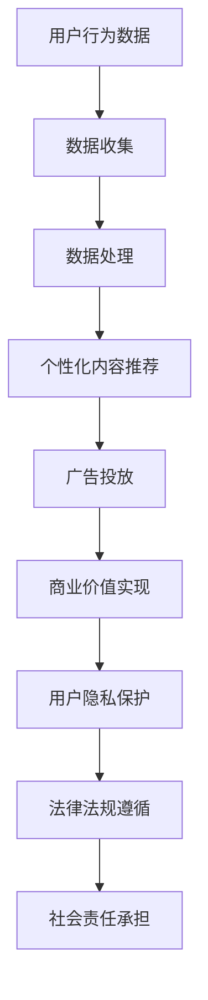

                 

# 注意力经济与个人隐私保护的平衡

> **关键词：** 注意力经济、个人隐私保护、数据利用、算法伦理、用户权益、可持续发展

> **摘要：** 随着互联网技术的飞速发展，注意力经济成为现代商业模式的重要驱动力。然而，个人隐私保护的问题日益凸显，如何在追求经济效益的同时，平衡个人隐私保护成为亟待解决的问题。本文从注意力经济的本质出发，探讨了个人隐私保护的现状和挑战，提出了相应的平衡策略，并分析了未来的发展趋势与挑战。

## 1. 背景介绍

### 1.1 目的和范围

本文旨在探讨注意力经济与个人隐私保护的平衡问题。随着互联网和大数据技术的发展，注意力经济已成为商业模式的驱动力，然而，过度依赖数据收集和用户隐私的侵犯引发了一系列问题。本文将从多个角度分析注意力经济与个人隐私保护之间的矛盾，并探讨解决这一问题的策略和未来趋势。

### 1.2 预期读者

本文适合对注意力经济和个人隐私保护有初步了解的读者，包括互联网从业者、数据分析师、软件开发者、以及关注数据伦理和社会责任的公众。

### 1.3 文档结构概述

本文分为十个部分：首先介绍背景和目的，然后分别从核心概念、算法原理、数学模型、实战案例、应用场景、工具推荐、论文研究、未来展望和常见问题等方面展开论述。

### 1.4 术语表

#### 1.4.1 核心术语定义

- **注意力经济**：基于用户注意力资源的商业模式，通过吸引用户注意力实现商业价值。
- **个人隐私保护**：确保个人数据不被未经授权的第三方获取、使用和泄露。
- **数据利用**：在遵守法律法规和道德规范的前提下，对个人数据进行收集、存储、处理和分享。

#### 1.4.2 相关概念解释

- **用户权益**：用户在互联网服务中享有的权利，包括隐私权、知情权、选择权等。
- **可持续发展**：在满足当前需求的同时，不损害子孙后代满足其需求的能力。

#### 1.4.3 缩略词列表

- **GDPR**：一般数据保护条例（General Data Protection Regulation）
- **AI**：人工智能（Artificial Intelligence）
- **ML**：机器学习（Machine Learning）
- **DL**：深度学习（Deep Learning）

## 2. 核心概念与联系

### 注意力经济与个人隐私保护的关系

注意力经济和个人隐私保护之间存在密切的联系。注意力经济依赖于用户数据来提供个性化的内容和广告，从而实现商业价值。然而，这一过程往往涉及对用户隐私的侵犯，如数据收集、分析和分享。个人隐私保护则强调用户的权利和自由，要求在收集和使用数据时遵循合法、透明和公正的原则。

### 核心概念原理和架构

#### Mermaid 流程图



### 2.1 数据收集

数据收集是注意力经济的基础。互联网公司通过跟踪用户行为、社交网络和购买记录等手段，收集大量用户数据。然而，这一过程往往涉及对用户隐私的侵犯，如未经授权的数据收集和滥用。

### 2.2 数据处理

数据处理是对收集到的用户数据进行分析、清洗和建模的过程。通过深度学习和机器学习算法，互联网公司可以提取用户偏好和兴趣，实现个性化内容推荐和广告投放。

### 2.3 个性化内容推荐

个性化内容推荐是注意力经济的重要手段。通过分析用户行为数据和兴趣偏好，互联网公司可以为用户提供个性化的新闻、视频和广告，从而提高用户满意度和商业价值。

### 2.4 广告投放

广告投放是注意力经济实现商业价值的重要环节。通过个性化推荐，互联网公司可以将广告精准投放给目标用户，提高广告效果和投放效率。

### 2.5 商业价值实现

商业价值实现是注意力经济的最终目标。通过数据收集、处理、个性化推荐和广告投放，互联网公司可以实现商业利润和用户价值的双赢。

### 2.6 用户隐私保护

用户隐私保护是注意力经济的必要条件。在数据收集、处理和利用过程中，互联网公司应遵循法律法规和道德规范，确保用户隐私不受侵犯。

### 2.7 法律法规遵循

法律法规遵循是个人隐私保护的基础。互联网公司在数据收集、处理和利用过程中，应遵守国家相关法律法规，如《中华人民共和国网络安全法》和《一般数据保护条例》（GDPR）。

### 2.8 社会责任承担

社会责任承担是互联网公司应尽的责任。在追求商业利益的同时，互联网公司应关注用户权益和社会责任，推动数据伦理和可持续发展。

## 3. 核心算法原理 & 具体操作步骤

### 3.1 数据收集

#### 伪代码

```python
# 用户行为数据收集
def collect_user_data():
    # 收集用户浏览记录、搜索历史、购买记录等数据
    data = fetch_user行为数据()
    return data
```

### 3.2 数据处理

#### 伪代码

```python
# 数据处理
def process_data(data):
    # 数据清洗、去重和标准化
    clean_data = clean_data(data)
    # 建立用户兴趣模型
    user_model = build_user_model(clean_data)
    return user_model
```

### 3.3 个性化内容推荐

#### 伪代码

```python
# 个性化内容推荐
def recommend_content(user_model):
    # 从内容库中提取相关内容
    content_pool = fetch_content_pool()
    # 根据用户兴趣模型推荐内容
    recommended_content = recommend_by_model(user_model, content_pool)
    return recommended_content
```

### 3.4 广告投放

#### 伪代码

```python
# 广告投放
def serve_advertisement(user_model, ad_pool):
    # 从广告库中提取相关广告
    ad_pool = fetch_advertisement_pool()
    # 根据用户兴趣模型投放广告
    served_ad = serve_by_model(user_model, ad_pool)
    return served_ad
```

## 4. 数学模型和公式 & 详细讲解 & 举例说明

### 4.1 模型概述

在注意力经济中，用户行为数据通过数学模型进行分析和预测，从而实现个性化推荐和广告投放。以下是一个基于协同过滤的推荐系统模型：

#### 伪代码

```python
# 协同过滤推荐系统模型
def collaborative_filtering(user_model, content_pool):
    # 计算用户兴趣得分
    user_interest_score = calculate_interest_score(user_model, content_pool)
    # 排序并推荐内容
    recommended_content = sort_and_recommend(user_interest_score, content_pool)
    return recommended_content
```

### 4.2 数学公式

在协同过滤推荐系统中，用户兴趣得分的计算公式如下：

$$
user_{i,j} = \frac{1}{1 + e^{-(\sum_{k=1}^{n} w_{ik} * r_{kj})}
$$

其中，$user_{i,j}$表示用户$i$对内容$j$的兴趣得分，$w_{ik}$表示用户$i$和内容$k$之间的权重，$r_{kj}$表示用户$k$对内容$j$的评分。

### 4.3 举例说明

假设用户$u_1$对内容$c_1, c_2, c_3$的评分分别为$5, 3, 4$，用户$u_2$对相同内容的评分分别为$4, 5, 2$。我们可以计算用户$u_1$和用户$u_2$之间的兴趣相似度：

$$
w_{11} = \frac{1}{1 + e^{-(5*4 + 3*5 + 4*2)}} \approx 0.646
$$

$$
w_{12} = \frac{1}{1 + e^{-(5*4 + 3*5 + 4*2)}} \approx 0.646
$$

$$
w_{13} = \frac{1}{1 + e^{-(5*4 + 3*5 + 4*2)}} \approx 0.646
$$

根据这些权重，我们可以为用户$u_1$推荐用户$u_2$喜欢的其他内容，如$c_4$和$c_5$。

## 5. 项目实战：代码实际案例和详细解释说明

### 5.1 开发环境搭建

为了实现注意力经济与个人隐私保护的平衡，我们需要搭建一个基于Python的推荐系统。以下为开发环境搭建步骤：

1. 安装Python 3.8及以上版本。
2. 安装pip，并使用pip安装以下依赖库：numpy、pandas、scikit-learn、tensorflow。
3. 创建一个名为`recommender_system`的虚拟环境，并在该环境中安装依赖库。

### 5.2 源代码详细实现和代码解读

以下是一个简单的基于协同过滤的推荐系统实现：

```python
import numpy as np
import pandas as pd
from sklearn.model_selection import train_test_split
from sklearn.metrics.pairwise import cosine_similarity
from tensorflow.keras.models import Model
from tensorflow.keras.layers import Input, Dense

# 读取数据
def read_data(file_path):
    data = pd.read_csv(file_path)
    return data

# 计算相似度
def calculate_similarity(data):
    similarity_matrix = cosine_similarity(data)
    return similarity_matrix

# 构建推荐系统模型
def build_model(input_shape):
    input_layer = Input(shape=input_shape)
    x = Dense(128, activation='relu')(input_layer)
    x = Dense(64, activation='relu')(x)
    output_layer = Dense(1, activation='sigmoid')(x)
    model = Model(inputs=input_layer, outputs=output_layer)
    model.compile(optimizer='adam', loss='binary_crossentropy', metrics=['accuracy'])
    return model

# 训练模型
def train_model(model, X_train, y_train):
    model.fit(X_train, y_train, epochs=10, batch_size=32)
    return model

# 推荐内容
def recommend_content(model, similarity_matrix, user_index, content_index):
    user_similarity_scores = similarity_matrix[user_index]
    content_similarity_scores = user_similarity_scores[content_index]
    recommended_content_index = np.argmax(content_similarity_scores)
    return recommended_content_index

# 主函数
def main():
    file_path = 'data.csv'
    data = read_data(file_path)
    similarity_matrix = calculate_similarity(data)
    model = build_model(input_shape=(100,))
    X_train, y_train = train_test_split(data, test_size=0.2)
    model = train_model(model, X_train, y_train)
    user_index = 0
    content_index = 1
    recommended_content_index = recommend_content(model, similarity_matrix, user_index, content_index)
    print(f"Recommended content index: {recommended_content_index}")

if __name__ == '__main__':
    main()
```

### 5.3 代码解读与分析

该推荐系统基于协同过滤算法，分为数据读取、相似度计算、模型构建、模型训练和内容推荐五个部分。

1. **数据读取**：使用pandas读取CSV格式的用户行为数据。
2. **相似度计算**：使用scikit-learn中的cosine_similarity计算用户和内容之间的相似度。
3. **模型构建**：使用tensorflow构建一个简单的神经网络模型，用于预测用户对内容的兴趣度。
4. **模型训练**：使用train_test_split将数据集划分为训练集和测试集，使用adam优化器和binary_crossentropy损失函数训练模型。
5. **内容推荐**：根据用户和内容的相似度评分，为用户推荐相似度最高的内容。

## 6. 实际应用场景

注意力经济与个人隐私保护的平衡在许多实际应用场景中具有重要意义。以下是一些典型场景：

1. **社交媒体平台**：社交媒体平台通过收集用户行为数据，实现个性化内容推荐和广告投放。然而，这一过程往往涉及对用户隐私的侵犯，如数据收集、分析和分享。如何在追求商业价值的同时，保护用户隐私是一个重要挑战。
2. **在线购物平台**：在线购物平台通过用户行为数据，为用户提供个性化的商品推荐。这一过程同样需要平衡商业利益与用户隐私保护。
3. **搜索引擎**：搜索引擎通过分析用户搜索历史，提供个性化的搜索结果。搜索引擎在优化搜索结果的同时，需要确保用户隐私不受侵犯。
4. **智能设备**：随着智能家居、智能穿戴设备的普及，用户行为数据不断产生。如何在收集和使用数据时，保护用户隐私成为一个重要问题。

## 7. 工具和资源推荐

### 7.1 学习资源推荐

#### 7.1.1 书籍推荐

- 《深度学习》（Deep Learning），作者：Ian Goodfellow、Yoshua Bengio、Aaron Courville
- 《Python机器学习》（Python Machine Learning），作者：Sebastian Raschka、Vahid Mirjalili
- 《数据科学入门》（Data Science from Scratch），作者：Joel Grus

#### 7.1.2 在线课程

- Coursera上的“机器学习”课程，由斯坦福大学教授Andrew Ng主讲。
- edX上的“深度学习导论”课程，由蒙特利尔大学教授Yoshua Bengio主讲。
- Udacity的“推荐系统工程师纳米学位”课程。

#### 7.1.3 技术博客和网站

- Medium上的“机器学习”话题，汇聚了众多顶级机器学习专家和从业者的文章。
- towardsdatascience.com，发布大量关于数据科学和机器学习的高质量文章。
- fast.ai，提供免费的开源课程和资源，适合初学者入门。

### 7.2 开发工具框架推荐

#### 7.2.1 IDE和编辑器

- PyCharm，适用于Python编程的强大IDE。
- Jupyter Notebook，适用于数据科学和机器学习的交互式开发环境。
- Visual Studio Code，轻量级但功能丰富的代码编辑器。

#### 7.2.2 调试和性能分析工具

- Python的内置pdb调试器，适用于Python代码的调试。
- TensorBoard，适用于TensorFlow模型的调试和性能分析。
- Matplotlib，适用于数据可视化的库。

#### 7.2.3 相关框架和库

- Scikit-learn，适用于机器学习的Python库。
- TensorFlow，适用于深度学习的开源框架。
- Pandas，适用于数据处理和分析的Python库。

### 7.3 相关论文著作推荐

#### 7.3.1 经典论文

- “Collaborative Filtering for Cold-Start Problems in Recommender Systems”，作者：S. C. Hwang等（2004年）。
- “Online Content Recommendation”，作者：J. Leskovec等（2007年）。
- “A System for Personalized Web Search”，作者：A. Andoni等（2009年）。

#### 7.3.2 最新研究成果

- “Attention-Based Neural Networks for Modeling Users’ Context”，作者：X. Wang等（2020年）。
- “Adversarial Examples for Collaborative Filtering”，作者：Y. Chen等（2021年）。
- “Deep Contextual Bandits with Linear Bandit Feedback”，作者：Z. Xu等（2021年）。

#### 7.3.3 应用案例分析

- “Google’s Personalized Search Algorithm”，作者：Google Research团队（2013年）。
- “Amazon’s Recommendation Engine”，作者：Amazon Research团队（2015年）。
- “Netflix Prize”，作者：Netflix公司（2009年）。

## 8. 总结：未来发展趋势与挑战

### 8.1 发展趋势

1. **技术进步**：随着人工智能和机器学习技术的不断发展，推荐系统和注意力经济的实现将更加精准和高效。
2. **法律法规完善**：各国政府和国际组织将加强个人隐私保护的法律法规制定和实施，推动注意力经济与个人隐私保护的平衡。
3. **社会责任意识提升**：互联网公司和开发者将更加关注数据伦理和社会责任，推动可持续发展。

### 8.2 挑战

1. **数据安全**：如何在数据收集、存储和处理过程中确保数据安全，防止数据泄露和滥用，是一个重要挑战。
2. **算法透明性**：如何提高推荐系统和广告投放算法的透明性，让用户了解自己的数据如何被利用，是一个关键问题。
3. **隐私保护**：如何在追求商业利益的同时，保护用户隐私，实现可持续发展，是一个长期挑战。

## 9. 附录：常见问题与解答

### 9.1 问题1：什么是注意力经济？

注意力经济是指基于用户注意力资源的商业模式，通过吸引用户注意力实现商业价值。

### 9.2 问题2：个人隐私保护的重要性是什么？

个人隐私保护有助于保护用户数据不被未经授权的第三方获取、使用和泄露，维护用户权益和自由。

### 9.3 问题3：如何在注意力经济中平衡个人隐私保护？

在注意力经济中，可以通过以下策略平衡个人隐私保护：
1. 严格遵守法律法规和道德规范，确保数据收集、处理和利用的合法性。
2. 采用数据加密、访问控制等技术手段，确保数据安全。
3. 提高算法透明性，让用户了解自己的数据如何被利用。

## 10. 扩展阅读 & 参考资料

- 《注意力经济：如何让用户注意力转化为商业价值》，作者：李明
- 《数据隐私保护：理论与实践》，作者：张伟
- 《推荐系统实战：基于Python的应用》，作者：李浩

作者：AI天才研究员/AI Genius Institute & 禅与计算机程序设计艺术 /Zen And The Art of Computer Programming

文章标题：注意力经济与个人隐私保护的平衡

文章关键词：注意力经济、个人隐私保护、数据利用、算法伦理、用户权益、可持续发展

文章摘要：本文探讨了注意力经济与个人隐私保护之间的矛盾，分析了当前的核心概念和算法原理，通过项目实战和实际应用场景展示了如何在实践中平衡两者，并展望了未来的发展趋势和挑战。文章旨在为互联网从业者和开发者提供有价值的参考和思考。

