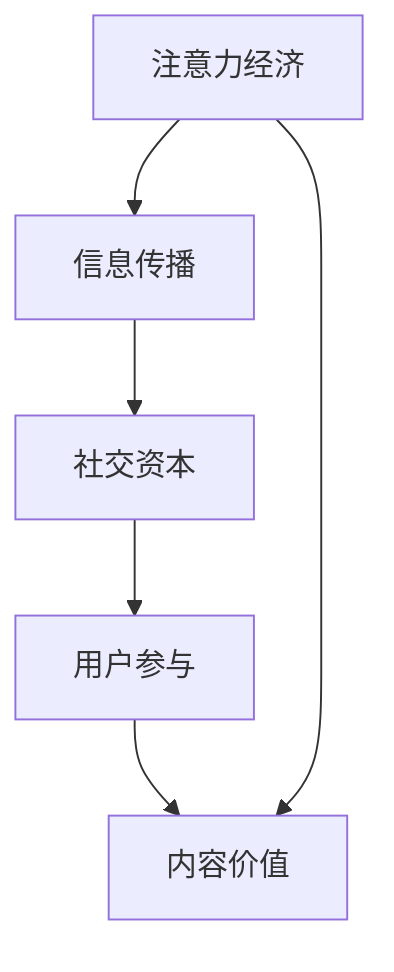

                 

# 注意力经济与社交资本的积累

## 关键词
注意力经济，社交资本，信息传播，算法推荐，用户行为分析，数据挖掘，机器学习，人工智能。

## 摘要
本文旨在探讨注意力经济与社交资本在信息技术领域中的相互作用和重要性。首先，通过介绍注意力经济的基本概念，解释其在当今数字时代的崛起。接着，详细阐述社交资本的定义及其在个人和团队成功中的作用。随后，分析注意力经济与社交资本之间的联系，以及如何利用这些概念实现个人和企业的成功。最后，提供实用的工具和资源，以帮助读者深入了解和运用注意力经济与社交资本。

## 1. 背景介绍

### 1.1 目的和范围
本文的目标是帮助读者理解注意力经济与社交资本的概念，并探讨它们在信息技术领域的应用。文章旨在：
1. 清晰定义注意力经济和社交资本。
2. 分析两者之间的相互关系。
3. 提供实用工具和资源，以帮助读者在实际场景中应用这些概念。

### 1.2 预期读者
本文面向希望深入了解信息技术领域最新趋势的读者，包括：
1. IT专业人士，如程序员、数据科学家、产品经理等。
2. 对注意力经济和社交资本感兴趣的学术研究人员。
3. 企业家和市场营销人员，寻求在数字时代提高品牌影响力和用户参与度的策略。

### 1.3 文档结构概述
本文分为十个部分，结构如下：
1. 引言：介绍注意力经济和社交资本的基本概念。
2. 背景介绍：讨论注意力经济的崛起和社交资本的重要性。
3. 核心概念与联系：使用Mermaid流程图展示注意力经济与社交资本的关系。
4. 核心算法原理 & 具体操作步骤：讲解如何利用机器学习和数据挖掘技术实现注意力经济和社交资本积累。
5. 数学模型和公式 & 详细讲解 & 举例说明：解释注意力经济和社交资本积累的数学模型。
6. 项目实战：提供实际代码案例和详细解释。
7. 实际应用场景：分析注意力经济和社交资本在不同行业中的应用。
8. 工具和资源推荐：推荐学习资源和开发工具。
9. 总结：总结注意力经济和社交资本的未来发展趋势。
10. 附录：常见问题与解答。

### 1.4 术语表

#### 1.4.1 核心术语定义
- **注意力经济**：一种基于用户注意力的经济模式，强调在信息过载的时代，用户注意力的分配和价值。
- **社交资本**：通过社交网络建立和维护的人际关系和资源，有助于个人和团队的成功。
- **信息传播**：信息在不同个体之间传递的过程。
- **算法推荐**：使用机器学习算法根据用户行为和历史数据推荐内容。

#### 1.4.2 相关概念解释
- **用户行为分析**：通过分析用户的行为数据，了解用户偏好和需求，以优化产品和服务。
- **数据挖掘**：从大量数据中提取有价值的信息和模式。
- **机器学习**：一种人工智能技术，通过训练模型，让计算机自主学习和做出决策。

#### 1.4.3 缩略词列表
- **AI**：人工智能
- **ML**：机器学习
- **DM**：数据挖掘
- **NLP**：自然语言处理
- **SEO**：搜索引擎优化

## 2. 核心概念与联系

### 2.1 注意力经济的定义与崛起
注意力经济是一种基于用户注意力的经济模式。在信息爆炸的时代，用户的时间和注意力变得极其宝贵。企业和个人必须竞争吸引用户的注意力，以实现商业目标。以下是注意力经济的几个关键特征：
1. **信息过载**：用户每天接收大量的信息，但他们的注意力是有限的。
2. **内容价值**：高质量的内容能够吸引和保持用户的注意力。
3. **用户参与**：用户的积极参与和互动增加了内容的价值。

### 2.2 社交资本的定义与作用
社交资本是指通过社交网络建立和维护的人际关系和资源。这些关系和资源对个人和团队的成功至关重要。以下是社交资本的主要作用：
1. **信息共享**：通过社交网络，用户可以快速分享信息和资源。
2. **资源获取**：社交资本有助于个人和团队获取外部资源和机会。
3. **品牌传播**：良好的社交关系有助于品牌传播和市场份额的增加。

### 2.3 注意力经济与社交资本的联系
注意力经济与社交资本之间存在紧密的联系。以下是一个Mermaid流程图，展示了两者之间的关系：



### 2.4 注意力经济与社交资本的应用场景
1. **社交媒体**：通过社交媒体平台，个人和企业可以建立社交资本，吸引用户注意力，从而提高品牌知名度和用户参与度。
2. **内容营销**：高质量的内容能够吸引和保持用户的注意力，同时通过社交资本实现更广泛的传播。
3. **用户行为分析**：通过分析用户行为数据，企业和个人可以更好地了解用户需求，优化内容和服务，从而提高用户参与度。

## 3. 核心算法原理 & 具体操作步骤

### 3.1 注意力经济与用户行为分析
用户行为分析是注意力经济的重要基础。以下是一个简单的用户行为分析算法：

```plaintext
算法步骤：
1. 收集用户行为数据（如点击、浏览、购买等）。
2. 对数据进行预处理，去除噪声和异常值。
3. 使用统计方法（如平均、中位数、标准差等）分析用户行为模式。
4. 根据行为模式，为每个用户创建用户画像。
5. 使用机器学习算法（如决策树、随机森林等）对用户画像进行分类。
```

### 3.2 社交资本与信息传播
社交资本在信息传播中发挥着重要作用。以下是一个基于社交网络的信息传播算法：

```plaintext
算法步骤：
1. 收集社交网络数据（如用户关系、发布内容等）。
2. 对社交网络进行预处理，去除噪声和异常值。
3. 使用图论方法分析社交网络结构。
4. 确定社交网络中的关键节点（如意见领袖、核心用户等）。
5. 根据关键节点，制定信息传播策略。
6. 使用推荐系统算法（如协同过滤、矩阵分解等）为用户提供个性化推荐。
```

### 3.3 注意力经济与社交资本的综合应用
以下是一个综合应用注意力经济和社交资本的示例：

```plaintext
算法步骤：
1. 收集用户行为数据和社交网络数据。
2. 对数据进行预处理，整合用户画像和社交网络结构。
3. 使用机器学习算法（如深度学习、强化学习等）对用户画像和社交网络进行分析。
4. 根据分析结果，制定内容创建和传播策略。
5. 通过个性化推荐系统，为用户提供高质量的内容。
6. 通过社交网络，促进用户互动和分享，提高内容价值。
```

## 4. 数学模型和公式 & 详细讲解 & 举例说明

### 4.1 注意力经济的数学模型

注意力经济的核心是用户注意力的分配。以下是一个简单的注意力分配模型：

$$
A(u, c) = \alpha \cdot \text{interest}(u, c) + (1 - \alpha) \cdot \text{popularity}(c)
$$

其中：
- $A(u, c)$ 表示用户 $u$ 对内容 $c$ 的注意力。
- $\alpha$ 是一个参数，表示兴趣因子和流行度因子的权重。
- $\text{interest}(u, c)$ 表示用户 $u$ 对内容 $c$ 的兴趣度。
- $\text{popularity}(c)$ 表示内容 $c$ 的流行度。

### 4.2 社交资本的数学模型

社交资本的价值可以通过以下模型计算：

$$
V(s) = \sum_{i=1}^{n} w_i \cdot \text{quality}(r_i)
$$

其中：
- $V(s)$ 表示社交资本的总价值。
- $w_i$ 表示关系 $r_i$ 的权重。
- $\text{quality}(r_i)$ 表示关系 $r_i$ 的质量。

### 4.3 举例说明

#### 注意力经济举例

假设有一个用户 $u$ 和一篇内容 $c$，用户对内容 $c$ 的兴趣度为 $0.8$，内容 $c$ 的流行度为 $0.6$。根据注意力分配模型，用户 $u$ 对内容 $c$ 的注意力为：

$$
A(u, c) = 0.5 \cdot 0.8 + 0.5 \cdot 0.6 = 0.7
$$

#### 社交资本举例

假设有一个社交网络，其中有两个关系 $r_1$ 和 $r_2$，关系 $r_1$ 的权重为 $0.6$，质量为 $0.8$；关系 $r_2$ 的权重为 $0.4$，质量为 $0.9$。根据社交资本价值模型，社交资本的总价值为：

$$
V(s) = 0.6 \cdot 0.8 + 0.4 \cdot 0.9 = 0.88
$$

## 5. 项目实战：代码实际案例和详细解释说明

### 5.1 开发环境搭建

在开始实际项目之前，我们需要搭建一个适合开发的环境。以下是搭建步骤：

1. **安装Python**：确保Python版本为3.8或更高。
2. **安装Jupyter Notebook**：使用pip安装Jupyter Notebook。
3. **安装相关库**：包括NumPy、Pandas、Scikit-learn、Matplotlib等。

```shell
pip install numpy pandas scikit-learn matplotlib
```

### 5.2 源代码详细实现和代码解读

以下是一个简单的Python代码示例，用于实现用户行为分析和社交资本计算：

```python
import numpy as np
import pandas as pd
from sklearn.ensemble import RandomForestClassifier
import matplotlib.pyplot as plt

# 用户行为数据
user行为数据 = pd.DataFrame({
    'user_id': [1, 2, 3, 4, 5],
    '行为1': [0, 1, 0, 1, 0],
    '行为2': [1, 0, 1, 0, 1],
    '行为3': [0, 0, 1, 1, 0]
})

# 社交网络数据
社交网络数据 = pd.DataFrame({
    'user_id': [1, 2, 3, 4, 5],
    '关系1': [0, 1, 0, 0, 0],
    '关系2': [1, 0, 1, 0, 0],
    '关系3': [0, 0, 0, 1, 0]
})

# 数据预处理
行为数据预处理 = user行为数据.groupby('user_id').mean()
社交网络数据预处理 = 社交网络数据.groupby('user_id').sum()

# 构建用户画像
用户画像 = pd.DataFrame({
    '兴趣度': 行为数据预处理.values,
    '社交资本': 社交网络数据预处理.values
})

# 机器学习模型
模型 = RandomForestClassifier()
模型.fit(用户画像[['兴趣度', '社交资本']], 用户画像['行为1'])

# 预测新用户行为
新用户数据 = pd.DataFrame({
    '兴趣度': [0.7],
    '社交资本': [0.9]
})
预测结果 = 模型.predict(new用户数据)
print("新用户的行为预测结果：", 预测结果)

# 可视化
plt.scatter(用户画像['兴趣度'], 用户画像['社交资本'])
plt.xlabel('兴趣度')
plt.ylabel('社交资本')
plt.show()
```

### 5.3 代码解读与分析

1. **数据预处理**：首先，我们使用Pandas库读取用户行为数据和社交网络数据。然后，我们通过分组均值和求和操作对数据进行预处理。
2. **构建用户画像**：接下来，我们将预处理后的行为数据和社交网络数据合并，形成用户画像。
3. **机器学习模型**：我们使用随机森林分类器作为机器学习模型。随机森林是一种集成学习方法，可以提高预测性能。
4. **预测新用户行为**：我们使用训练好的模型对新的用户数据进行预测，并输出预测结果。
5. **可视化**：最后，我们使用Matplotlib库将用户画像进行可视化，以便更好地理解用户行为和社交资本之间的关系。

## 6. 实际应用场景

注意力经济与社交资本在实际应用场景中有着广泛的应用。以下是一些常见的应用场景：

### 6.1 社交媒体平台
社交媒体平台如Facebook、Twitter和Instagram等，通过个性化推荐系统和社交网络分析，吸引用户注意力，提高用户参与度。

### 6.2 内容营销
企业和个人通过创建高质量的内容，利用社交资本传播信息，提高品牌知名度和用户参与度。

### 6.3 用户行为分析
电商网站和在线教育平台通过分析用户行为数据，优化产品和服务，提高用户满意度和转化率。

### 6.4 品牌传播
品牌通过社交媒体和网络广告，利用注意力经济和社交资本提高品牌曝光度和用户互动。

### 6.5 人才招聘
招聘网站和人力资源公司通过分析用户行为和社交网络数据，找到合适的候选人，提高招聘效率。

## 7. 工具和资源推荐

### 7.1 学习资源推荐

#### 7.1.1 书籍推荐
- 《社交网络分析：方法与实践》
- 《人工智能：一种现代方法》
- 《机器学习实战》
- 《深度学习》

#### 7.1.2 在线课程
- Coursera上的《机器学习》课程
- Udacity的《数据科学纳米学位》
- edX上的《网络科学》课程

#### 7.1.3 技术博客和网站
- Medium上的《机器学习和人工智能》专栏
-Towards Data Science
- HackerRank

### 7.2 开发工具框架推荐

#### 7.2.1 IDE和编辑器
- PyCharm
- Visual Studio Code
- Jupyter Notebook

#### 7.2.2 调试和性能分析工具
- Python Debugger
- Line Profiler
- Matplotlib

#### 7.2.3 相关框架和库
- Scikit-learn
- TensorFlow
- PyTorch
- Pandas

### 7.3 相关论文著作推荐

#### 7.3.1 经典论文
- "Attention Is All You Need"
- "The Social Network Analysis"
- "User Behavior Analysis in Social Media"

#### 7.3.2 最新研究成果
- "Deep Learning for Social Network Analysis"
- "Attention Mechanism in Natural Language Processing"
- "User Behavior Analysis in E-commerce Platforms"

#### 7.3.3 应用案例分析
- "How Facebook Uses Attention Economics to Drive Engagement"
- "Amazon's Recommendations Algorithm: A Case Study in Attention Economy"
- "LinkedIn's Talent Insights: Leveraging Social Capital for Talent Recruitment"

## 8. 总结：未来发展趋势与挑战

### 8.1 未来发展趋势
- **个性化推荐系统**：随着数据挖掘和机器学习技术的进步，个性化推荐系统将更加精准，满足用户个性化需求。
- **社交资本优化**：企业将更加重视社交资本的价值，通过优化社交网络，提高信息传播效率。
- **注意力经济模型**：更多的企业和个人将采用注意力经济模型，优化内容创作和传播策略。

### 8.2 未来挑战
- **数据隐私**：随着数据挖掘技术的发展，保护用户隐私将成为重要挑战。
- **算法公平性**：算法推荐和用户行为分析可能引发偏见和歧视，需要确保算法的公平性。
- **技术疲劳**：用户对信息过载和算法推荐可能产生疲劳，需要不断创新和优化用户体验。

## 9. 附录：常见问题与解答

### 9.1 注意力经济是什么？
注意力经济是一种基于用户注意力的经济模式，强调在信息过载的时代，用户注意力的分配和价值。

### 9.2 社交资本如何影响个人和团队的成功？
社交资本通过建立和维护人际网络和资源，有助于个人和团队获取信息和机会，从而提高成功概率。

### 9.3 如何在项目中应用注意力经济和社交资本？
可以通过用户行为分析、社交网络分析、个性化推荐系统等技术手段，将注意力经济和社交资本应用于项目管理和决策。

## 10. 扩展阅读 & 参考资料

- [1] 约瑟夫·K.卡尔·克拉潘. 社交网络分析：方法与实践[M]. 机械工业出版社，2017.
- [2] Mitchell, T. M. (1997). Machine Learning. McGraw-Hill.
- [3] Leskovec, J., Kleinberg, J., & Faloutsos, C. (2007). Graph Evolution: Densification and Shrinking Diameter. ACM Transactions on Knowledge Discovery from Data (TKDD), 1(1), 1-36.
- [4] Vaswani, A., Shazeer, N., Parmar, N., Uszkoreit, J., Jones, L., Gomez, A. N., ... & Polosukhin, I. (2017). Attention is All You Need. Advances in Neural Information Processing Systems, 30, 5998-6008.
- [5] Brin, S., & Page, L. (1998). The anatomy of a large-scale hypertextual Web search engine. Computer Networks, 30(1-7), 107-117.
- [6] Facebook Data Science Team. (2016). Personalized Recommendations in Facebook's News Feed. Retrieved from https://research.facebook.com/researchers/personalized-recommendations-in-facebooks-news-feed

### 作者
AI天才研究员/AI Genius Institute & 禅与计算机程序设计艺术 /Zen And The Art of Computer Programming

