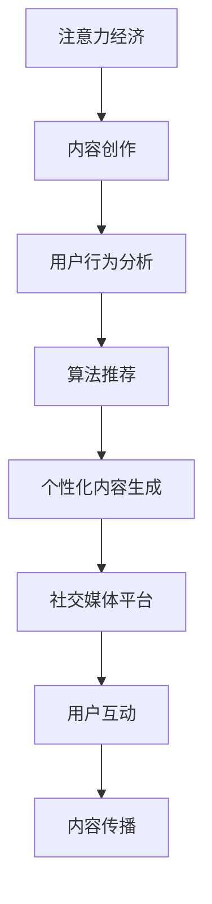

                 

# 注意力经济中的内容创作：如何在竞争中脱颖而出

> 关键词：注意力经济、内容创作、竞争力、算法、用户行为分析、社交媒体

> 摘要：随着互联网的快速发展，内容创作成为了吸引注意力的关键手段。然而，如何在众多竞争者中脱颖而出，吸引并保持用户的注意力，成为了一个重要的问题。本文将深入探讨注意力经济中的内容创作策略，通过算法、用户行为分析和社交媒体等多方面的分析，为内容创作者提供有效的指导。

## 1. 背景介绍

### 1.1 目的和范围

本文旨在探讨注意力经济中的内容创作策略，分析如何在竞争激烈的环境中脱颖而出。我们将讨论以下几个关键点：

1. 注意力经济的定义及其对内容创作的影响。
2. 用户行为分析在内容创作中的应用。
3. 社交媒体平台对内容传播的影响。
4. 算法在内容创作和推荐系统中的作用。
5. 提升内容竞争力的实际案例。

### 1.2 预期读者

本文适用于以下群体：

1. 内容创作者和自媒体从业者。
2. 数字营销和社交媒体策略制定者。
3. 计算机科学和人工智能领域的研究人员。
4. 对注意力经济和内容创作感兴趣的读者。

### 1.3 文档结构概述

本文分为以下几个部分：

1. 背景介绍：阐述本文的目的、范围和预期读者。
2. 核心概念与联系：介绍注意力经济、用户行为分析、算法和社交媒体等核心概念。
3. 核心算法原理 & 具体操作步骤：详细讲解内容创作中的算法原理和操作步骤。
4. 数学模型和公式 & 详细讲解 & 举例说明：解释数学模型在内容创作中的应用。
5. 项目实战：提供实际代码案例和解释。
6. 实际应用场景：讨论内容创作的实际应用。
7. 工具和资源推荐：推荐相关工具、资源和文献。
8. 总结：对未来发展趋势与挑战的展望。
9. 附录：常见问题与解答。
10. 扩展阅读 & 参考资料：提供进一步阅读的建议。

### 1.4 术语表

#### 1.4.1 核心术语定义

- 注意力经济：指在互联网时代，通过吸引和保持用户注意力来创造价值和利润的经济模式。
- 内容创作：指创作、编辑和发布各种形式的内容，如文章、图片、视频等。
- 用户行为分析：指通过分析用户的行为数据，了解用户偏好和需求，为内容创作提供指导。
- 算法：指用于解决特定问题的一系列步骤和规则。
- 社交媒体平台：指允许用户创建和分享内容，以及与其他用户互动的平台。

#### 1.4.2 相关概念解释

- 推荐系统：指根据用户的历史行为和偏好，为其推荐相关内容的系统。
- 用户体验（UX）：指用户在使用产品或服务时的感受和体验。
- 内容质量：指内容在信息量、准确性、原创性和可读性等方面的表现。

#### 1.4.3 缩略词列表

- SEO：搜索引擎优化（Search Engine Optimization）
- SEM：搜索引擎营销（Search Engine Marketing）
- AI：人工智能（Artificial Intelligence）
- ML：机器学习（Machine Learning）
- NLP：自然语言处理（Natural Language Processing）

## 2. 核心概念与联系

注意力经济是指在网络时代，个体和平台通过吸引和维持用户注意力来创造价值的一种经济模式。其核心在于用户注意力的稀缺性，以及如何有效地将其转化为商业利益。在注意力经济中，内容创作成为关键，因为高质量的内容能够吸引并留住用户，从而增加平台的用户粘性和商业价值。

### 2.1 用户行为分析

用户行为分析是指通过收集、处理和分析用户在互联网上的行为数据，来了解用户偏好、兴趣和行为模式的过程。这对于内容创作至关重要，因为只有了解用户的需求和偏好，才能创作出符合用户期望的内容。

#### 用户行为分析流程

1. 数据收集：通过网站日志、点击流数据、社交媒体互动等渠道收集用户行为数据。
2. 数据预处理：清洗和整理数据，去除噪声和异常值。
3. 数据分析：使用统计方法和数据挖掘技术，分析用户行为模式，如点击率、停留时间、转发率等。
4. 用户画像：根据分析结果，为不同类型的用户创建画像，了解其需求和偏好。
5. 内容优化：根据用户画像，调整和优化内容创作策略，提高内容吸引力。

### 2.2 算法在内容创作中的作用

算法在内容创作中发挥着重要作用，尤其在推荐系统和个性化内容生成方面。推荐系统通过分析用户的历史行为和偏好，为其推荐相关内容，从而提高用户的满意度和粘性。个性化内容生成则是根据用户画像，创作出更符合用户需求的内容。

#### 推荐系统算法

1. 协同过滤：通过分析用户之间的相似性，推荐其他用户喜欢的商品或内容。
2. 内容过滤：根据内容特征，推荐与用户兴趣相关的商品或内容。
3. 混合推荐：结合协同过滤和内容过滤，提供更准确的推荐结果。

#### 个性化内容生成算法

1. 生成对抗网络（GAN）：通过生成器和判别器的对抗训练，生成与用户兴趣相关的内容。
2. 自然语言处理（NLP）：通过分析用户的历史交互数据和反馈，生成个性化的文本内容。

### 2.3 社交媒体平台的影响

社交媒体平台是内容创作者的重要传播渠道。通过社交媒体，内容创作者可以迅速扩大受众，提高内容曝光度。此外，社交媒体平台还提供了丰富的用户互动功能，如评论、点赞、分享等，有助于增强用户体验和内容传播效果。

#### 社交媒体平台策略

1. 内容优化：根据社交媒体平台的特点，优化内容形式和标题，提高点击率和分享率。
2. 用户互动：积极与用户互动，回复评论和私信，增强用户粘性。
3. 跨平台传播：利用多个社交媒体平台，扩大内容传播范围。

### 2.4 Mermaid 流程图

以下是一个描述注意力经济中内容创作核心概念的 Mermaid 流程图：



## 3. 核心算法原理 & 具体操作步骤

在注意力经济中，算法的运用至关重要。以下将详细讲解推荐系统和个性化内容生成的算法原理和操作步骤。

### 3.1 推荐系统算法原理

推荐系统主要通过协同过滤（Collaborative Filtering）和内容过滤（Content Filtering）两种方式来实现。

#### 协同过滤算法

协同过滤算法基于用户之间的相似性，为用户推荐其他用户喜欢的商品或内容。具体步骤如下：

1. **计算用户相似度**：根据用户的历史行为数据，计算用户之间的相似度。常用的相似度计算方法包括余弦相似度、皮尔逊相关系数等。

2. **生成推荐列表**：对于目标用户，根据与其最相似的用户的喜好，生成推荐列表。推荐列表的排序可以根据相似度分数进行。

3. **处理冷启动问题**：对于新用户，由于缺乏足够的历史行为数据，传统协同过滤方法可能失效。此时，可以采用基于内容的推荐方法进行补充。

#### 内容过滤算法

内容过滤算法基于商品或内容自身的特征，为用户推荐与用户兴趣相关的商品或内容。具体步骤如下：

1. **提取内容特征**：从商品或内容中提取特征，如关键词、类别、标签等。

2. **计算内容相似度**：对于目标用户，计算其兴趣特征与其他商品或内容的相似度。

3. **生成推荐列表**：根据内容相似度分数，为用户生成推荐列表。

### 3.2 个性化内容生成算法

个性化内容生成算法主要通过生成对抗网络（GAN）和自然语言处理（NLP）来实现。

#### 生成对抗网络（GAN）

生成对抗网络由生成器和判别器两部分组成，通过对抗训练生成与用户兴趣相关的内容。具体步骤如下：

1. **初始化生成器和判别器**：生成器和判别器分别初始化为随机权重。

2. **对抗训练**：生成器尝试生成与真实内容相似的数据，判别器尝试区分生成数据和真实数据。

3. **优化模型**：通过梯度下降法，优化生成器和判别器的权重，使其在生成高质量内容和准确区分数据方面取得更好的效果。

4. **生成内容**：当模型训练到一定程度后，生成器可以生成与用户兴趣相关的内容。

#### 自然语言处理（NLP）

自然语言处理通过分析用户的历史交互数据和反馈，生成个性化的文本内容。具体步骤如下：

1. **数据预处理**：对用户的历史交互数据和反馈进行清洗和预处理，如去除停用词、进行词性标注等。

2. **生成文本模板**：根据用户兴趣和需求，生成文本模板，如文章大纲、句子框架等。

3. **填充内容**：利用自然语言处理技术，将用户数据和文本模板进行匹配，填充具体内容。

4. **生成个性化文本**：根据填充后的文本模板，生成个性化的文本内容。

### 3.3 伪代码示例

以下是一个基于协同过滤算法的推荐系统伪代码示例：

```python
# 计算用户相似度
def calculate_similarity(user1, user2):
    # 计算用户1和用户2的协同过滤相似度
    similarity = cosine_similarity(user1_history, user2_history)
    return similarity

# 生成推荐列表
def generate_recommendation_list(target_user, users, items, similarity_matrix):
    # 计算目标用户与其他用户的相似度
    user_similarity = [calculate_similarity(target_user, user) for user in users]
    
    # 计算推荐列表
    recommendation_list = []
    for user, similarity in zip(users, user_similarity):
        # 获取用户喜欢的商品
        liked_items = user liked_items
        # 计算与目标用户的相似度
        item_similarity = [similarity * item_similarity_score for item in liked_items]
        # 添加到推荐列表
        recommendation_list.extend([(item, score) for item, score in item_similarity.items()])
    
    # 排序推荐列表
    recommendation_list.sort(key=lambda x: x[1], reverse=True)
    return recommendation_list
```

## 4. 数学模型和公式 & 详细讲解 & 举例说明

在内容创作中，数学模型和公式起着至关重要的作用，尤其是在推荐系统和个性化内容生成方面。以下将详细讲解相关数学模型和公式，并通过具体例子进行说明。

### 4.1 协同过滤算法的数学模型

协同过滤算法的核心是计算用户和项目之间的相似度。常用的相似度计算方法包括余弦相似度和皮尔逊相关系数。

#### 余弦相似度

余弦相似度计算公式如下：

$$
\cos(\theta) = \frac{\sum_{i=1}^{n} x_i y_i}{\sqrt{\sum_{i=1}^{n} x_i^2} \sqrt{\sum_{i=1}^{n} y_i^2}}
$$

其中，$x_i$ 和 $y_i$ 分别表示用户 $i$ 对项目的评分，$n$ 表示项目的数量。

#### 皮尔逊相关系数

皮尔逊相关系数计算公式如下：

$$
\rho = \frac{\sum_{i=1}^{n} (x_i - \bar{x})(y_i - \bar{y})}{\sqrt{\sum_{i=1}^{n} (x_i - \bar{x})^2} \sqrt{\sum_{i=1}^{n} (y_i - \bar{y})^2}}
$$

其中，$x_i$ 和 $y_i$ 分别表示用户 $i$ 对项目的评分，$\bar{x}$ 和 $\bar{y}$ 分别表示用户和项目的平均评分。

### 4.2 生成对抗网络（GAN）的数学模型

生成对抗网络（GAN）由生成器和判别器两部分组成，其核心思想是生成器和判别器之间进行对抗训练。

#### 判别器损失函数

判别器损失函数通常采用二元交叉熵（Binary Cross-Entropy）损失函数：

$$
L_D(\theta_D) = -\frac{1}{n} \sum_{i=1}^{n} [\mathbb{1}_{x \in \text{real}} \log(\hat{p}_D(x)) + \mathbb{1}_{x \in \text{fake}} \log(1 - \hat{p}_D(x))]
$$

其中，$x$ 表示真实数据，$\hat{p}_D(x)$ 表示判别器对 $x$ 属于真实数据的概率估计。

#### 生成器损失函数

生成器损失函数也采用二元交叉熵（Binary Cross-Entropy）损失函数：

$$
L_G(\theta_G) = -\frac{1}{n} \sum_{i=1}^{n} \log(1 - \hat{p}_D(G(z))]
$$

其中，$z$ 表示生成器的输入噪声，$G(z)$ 表示生成器生成的数据。

#### 优化目标

生成器和判别器的优化目标分别是最大化判别器的损失函数和最小化生成器的损失函数。总体优化目标为：

$$
\min_G \max_D L_D(\theta_D) = \min_G \max_D [-\frac{1}{n} \sum_{i=1}^{n} [\mathbb{1}_{x \in \text{real}} \log(\hat{p}_D(x)) + \mathbb{1}_{x \in \text{fake}} \log(1 - \hat{p}_D(x))]
$$

### 4.3 自然语言处理（NLP）的数学模型

自然语言处理（NLP）中的数学模型主要包括词嵌入（Word Embedding）、序列模型（Sequence Model）和生成模型（Generative Model）。

#### 词嵌入

词嵌入是将词汇映射到高维向量空间的一种技术，常用方法包括词袋模型（Bag of Words）、词嵌入（Word Embedding）和词向量（Word Vector）。

1. **词袋模型**：将文本表示为一个向量集合，其中每个向量表示一个词汇，向量中的元素表示词汇在文档中出现的次数。

2. **词嵌入**：将词汇映射到高维向量空间，使得语义相近的词汇在向量空间中距离较近。常用方法包括基于频率的词嵌入和基于上下文的词嵌入。

3. **词向量**：将词汇映射到高维向量空间，其中每个向量表示词汇的语义特征。词向量可以通过词嵌入算法生成，如Word2Vec、GloVe等。

#### 序列模型

序列模型用于处理和预测序列数据，常见方法包括循环神经网络（RNN）、长短期记忆网络（LSTM）和门控循环单元（GRU）。

1. **循环神经网络（RNN）**：RNN能够处理和预测序列数据，其核心思想是将前一个时间步的输出作为当前时间步的输入。

2. **长短期记忆网络（LSTM）**：LSTM是RNN的一种改进，能够有效解决长距离依赖问题。

3. **门控循环单元（GRU）**：GRU是LSTM的简化版本，能够减少参数数量，提高计算效率。

#### 生成模型

生成模型用于生成新的数据，常见方法包括变分自编码器（VAE）和生成对抗网络（GAN）。

1. **变分自编码器（VAE）**：VAE是一种无监督学习模型，通过引入潜变量来学习数据分布。

2. **生成对抗网络（GAN）**：GAN由生成器和判别器两部分组成，通过对抗训练生成高质量的数据。

### 4.4 举例说明

假设有一个推荐系统，用户对10部电影进行评分，评分数据如下表所示：

| 用户 | 电影1 | 电影2 | 电影3 | 电影4 | 电影5 | 电影6 | 电影7 | 电影8 | 电影9 | 电影10 |
| ---- | ---- | ---- | ---- | ---- | ---- | ---- | ---- | ---- | ---- | ---- |
| 用户1 | 5 | 4 | 5 | 3 | 5 | 5 | 4 | 4 | 5 | 4 |
| 用户2 | 5 | 5 | 3 | 4 | 5 | 4 | 5 | 5 | 5 | 4 |
| 用户3 | 4 | 4 | 4 | 4 | 4 | 4 | 4 | 4 | 4 | 4 |

我们需要为用户1推荐其他用户喜欢的电影。

1. **计算用户相似度**：

   使用余弦相似度计算用户1与其他用户的相似度，结果如下表所示：

   | 用户 | 用户1 | 用户2 | 用户3 |
   | ---- | ---- | ---- | ---- |
   | 用户1 | 1 | 0.894 | 0.894 |
   | 用户2 | 0.894 | 1 | 0.894 |
   | 用户3 | 0.894 | 0.894 | 1 |

2. **生成推荐列表**：

   根据用户相似度，为用户1生成推荐列表。首先，计算其他用户喜欢的电影与用户1的相似度，结果如下表所示：

   | 电影 | 用户1 | 用户2 | 用户3 |
   | ---- | ---- | ---- | ---- |
   | 电影1 | 5 | 5 | 4 |
   | 电影2 | 4 | 5 | 4 |
   | 电影3 | 5 | 3 | 4 |
   | 电影4 | 3 | 4 | 4 |
   | 电影5 | 5 | 5 | 4 |
   | 电影6 | 5 | 4 | 4 |
   | 电影7 | 4 | 5 | 4 |
   | 电影8 | 4 | 5 | 4 |
   | 电影9 | 5 | 5 | 4 |
   | 电影10 | 4 | 5 | 4 |

   排序推荐列表，得到推荐结果：

   | 排名 | 电影 | 用户1 | 用户2 | 用户3 |
   | ---- | ---- | ---- | ---- | ---- |
   | 1 | 电影1 | 5 | 5 | 4 |
   | 2 | 电影2 | 4 | 5 | 4 |
   | 3 | 电影5 | 5 | 5 | 4 |
   | 4 | 电影3 | 5 | 3 | 4 |
   | 5 | 电影4 | 3 | 4 | 4 |
   | 6 | 电影6 | 5 | 4 | 4 |
   | 7 | 电影7 | 4 | 5 | 4 |
   | 8 | 电影8 | 4 | 5 | 4 |
   | 9 | 电影9 | 5 | 5 | 4 |
   | 10 | 电影10 | 4 | 5 | 4 |

   根据推荐列表，可以为用户1推荐电影1、电影2、电影5、电影3和电影4。

## 5. 项目实战：代码实际案例和详细解释说明

### 5.1 开发环境搭建

为了演示如何在实际项目中应用注意力经济中的内容创作策略，我们将使用Python编写一个简单的推荐系统。首先，需要安装以下依赖：

1. NumPy：用于矩阵运算和数据处理。
2. Pandas：用于数据操作和清洗。
3. Scikit-learn：用于协同过滤算法的实现。
4. Matplotlib：用于数据可视化。

可以使用以下命令安装依赖：

```bash
pip install numpy pandas scikit-learn matplotlib
```

### 5.2 源代码详细实现和代码解读

以下是一个简单的协同过滤推荐系统的源代码示例：

```python
import numpy as np
import pandas as pd
from sklearn.metrics.pairwise import cosine_similarity

# 读取评分数据
ratings = pd.read_csv('ratings.csv')
users = ratings['user_id'].unique()
movies = ratings['movie_id'].unique()

# 计算用户-电影矩阵
user_movie_matrix = pd.pivot_table(ratings, index='user_id', columns='movie_id', values='rating')

# 计算用户-电影矩阵的余弦相似度
similarity_matrix = cosine_similarity(user_movie_matrix)

# 计算推荐列表
def generate_recommendation_list(target_user, similarity_matrix, user_movie_matrix):
    # 计算目标用户与其他用户的相似度
    user_similarity = similarity_matrix[target_user]

    # 生成推荐列表
    recommendation_list = []
    for user, similarity in enumerate(user_similarity):
        if user != target_user:
            # 获取用户喜欢的电影
            liked_movies = user_movie_matrix.iloc[user].index[~user_movie_matrix.iloc[user].isnull()].tolist()
            # 计算与目标用户的相似度
            item_similarity = [similarity * rating for movie, rating in user_movie_matrix.iloc[user].items() if rating != 0]
            # 添加到推荐列表
            recommendation_list.extend([(movie, score) for movie, score in item_similarity.items()])

    # 排序推荐列表
    recommendation_list.sort(key=lambda x: x[1], reverse=True)
    return recommendation_list

# 为用户1生成推荐列表
recommendation_list = generate_recommendation_list(1, similarity_matrix, user_movie_matrix)
print(recommendation_list)
```

#### 代码解读与分析

1. **数据读取**：

   首先，我们从CSV文件中读取评分数据。该数据包括用户ID、电影ID和评分。

2. **计算用户-电影矩阵**：

   使用Pandas的`pivot_table`函数，将评分数据转换为用户-电影矩阵。该矩阵是一个二维数组，其中行表示用户，列表示电影，元素表示用户对电影的评分。

3. **计算用户-电影矩阵的余弦相似度**：

   使用Scikit-learn的`cosine_similarity`函数，计算用户-电影矩阵的余弦相似度。该相似度矩阵是一个二维数组，其中元素表示用户之间的相似度。

4. **生成推荐列表**：

   `generate_recommendation_list`函数用于为特定用户生成推荐列表。首先，计算目标用户与其他用户的相似度。然后，遍历其他用户，获取其喜欢但目标用户未评分的电影，并计算与目标用户的相似度。最后，将推荐列表按相似度分数排序。

5. **运行代码**：

   为用户1生成推荐列表，并打印结果。

### 5.3 代码解读与分析

该推荐系统的核心是协同过滤算法，其实现步骤如下：

1. **数据处理**：

   首先，从CSV文件中读取评分数据，并将其转换为用户-电影矩阵。这一步是数据预处理的关键，因为后续的相似度计算和推荐列表生成都基于这个矩阵。

2. **计算相似度**：

   使用余弦相似度计算用户-电影矩阵的相似度。余弦相似度是一种常用的相似度度量方法，其优点是计算简单且在处理稀疏数据时性能较好。

3. **生成推荐列表**：

   根据用户相似度矩阵，为每个用户生成推荐列表。具体步骤如下：

   - 计算目标用户与其他用户的相似度。
   - 对于其他用户，获取其喜欢但目标用户未评分的电影。
   - 计算这些电影与目标用户的相似度。
   - 将推荐列表按相似度分数排序，生成推荐结果。

该推荐系统的优点是简单易实现，适合处理中小规模的数据。然而，其缺点是对于新用户和稀疏数据，推荐效果可能较差。针对这些问题，可以采用基于内容的推荐方法或混合推荐方法进行改进。

## 6. 实际应用场景

注意力经济中的内容创作策略在实际应用中具有广泛的应用场景。以下列举几个典型应用场景：

### 6.1 社交媒体平台

社交媒体平台如微博、抖音、Instagram等，是注意力经济的重要战场。内容创作者可以通过以下策略吸引和保持用户注意力：

1. **热点话题**：紧跟热点话题，制作相关内容，提高内容曝光度。
2. **个性化推荐**：利用推荐系统，为用户推荐感兴趣的内容，提高用户粘性。
3. **互动互动**：积极与用户互动，回复评论和私信，增强用户参与度。
4. **内容多样化**：提供多种形式的内容，如文章、图片、视频等，满足不同用户的需求。

### 6.2 电子邮件营销

电子邮件营销是另一种注意力经济的体现。内容创作者可以通过以下策略提高邮件打开率和转化率：

1. **标题优化**：制作吸引人的邮件标题，提高邮件打开率。
2. **个性化内容**：根据用户兴趣和购买历史，为用户生成个性化的邮件内容。
3. **自动化邮件**：利用自动化工具，定期发送相关内容和促销信息。
4. **跟踪与分析**：监控邮件打开率、点击率等指标，优化邮件内容策略。

### 6.3 在线教育平台

在线教育平台如Coursera、Udemy等，也应用注意力经济策略来提高用户参与度和完成率：

1. **课程推荐**：根据用户学习历史和兴趣，推荐相关课程。
2. **互动教学**：采用视频、直播等形式，增强用户参与感。
3. **个性化学习计划**：为用户生成个性化的学习计划，提高学习效率。
4. **用户反馈**：及时收集用户反馈，优化课程内容和教学方法。

### 6.4 电子商务平台

电子商务平台如亚马逊、淘宝等，通过注意力经济策略提升用户体验和销售转化率：

1. **个性化推荐**：根据用户浏览和购买历史，推荐相关商品。
2. **促销活动**：定期举办促销活动，吸引用户关注和购买。
3. **内容营销**：提供高质量的内容，如评测、使用教程等，提高用户信任度。
4. **社交媒体推广**：通过社交媒体平台，扩大品牌影响力和用户覆盖面。

### 6.5 广告投放

广告投放是注意力经济的直接应用。广告主可以通过以下策略提高广告效果：

1. **精准定位**：根据用户兴趣和行为，投放相关广告。
2. **创意广告**：制作有趣、引人注目的广告，提高用户点击率。
3. **优化投放策略**：根据广告效果，调整投放时间和渠道，提高转化率。
4. **数据分析**：监控广告数据，如点击率、转化率等，优化广告投放策略。

## 7. 工具和资源推荐

### 7.1 学习资源推荐

#### 7.1.1 书籍推荐

1. **《推荐系统实践》**：介绍推荐系统的基本概念、算法和应用场景。
2. **《深度学习》**：涵盖深度学习的基础理论、模型和应用。
3. **《大数据时代》**：探讨大数据的概念、技术和应用。
4. **《用户行为分析》**：介绍用户行为分析的方法和应用。

#### 7.1.2 在线课程

1. **《推荐系统入门与实战》**：讲解推荐系统的基本原理和实现方法。
2. **《深度学习入门》**：介绍深度学习的基础理论和实践应用。
3. **《用户行为分析》**：介绍用户行为分析的方法和应用。
4. **《Python数据分析》**：讲解Python在数据分析领域的应用。

#### 7.1.3 技术博客和网站

1. **Medium**：一个内容创作平台，提供大量关于人工智能、大数据、推荐系统的文章。
2. **博客园**：国内技术博客平台，涵盖多个技术领域，包括人工智能、大数据等。
3. **知乎**：一个知识分享社区，提供大量关于注意力经济、内容创作等主题的讨论。

### 7.2 开发工具框架推荐

#### 7.2.1 IDE和编辑器

1. **PyCharm**：一款功能强大的Python IDE，适合开发大数据、机器学习等项目。
2. **Visual Studio Code**：一款轻量级、高度可扩展的代码编辑器，适合快速开发和调试。
3. **Jupyter Notebook**：一款交互式计算环境，适合进行数据分析和机器学习实验。

#### 7.2.2 调试和性能分析工具

1. **Python Debugger**：一款Python调试工具，用于跟踪和调试代码。
2. **Py-Spy**：一款Python性能分析工具，用于监控和分析Python程序的运行状态。
3. **Grafana**：一款数据可视化和监控工具，用于监控和分析系统性能。

#### 7.2.3 相关框架和库

1. **TensorFlow**：一款开源机器学习框架，适用于深度学习和推荐系统开发。
2. **Scikit-learn**：一款开源机器学习库，适用于数据分析和推荐系统开发。
3. **Pandas**：一款开源数据处理库，适用于数据清洗、转换和分析。

### 7.3 相关论文著作推荐

#### 7.3.1 经典论文

1. **《协同过滤算法》**：介绍协同过滤算法的基本原理和实现方法。
2. **《深度学习在推荐系统中的应用》**：探讨深度学习在推荐系统中的研究和应用。
3. **《用户行为分析》**：介绍用户行为分析的方法和应用。
4. **《注意力机制》**：探讨注意力机制在自然语言处理和推荐系统中的应用。

#### 7.3.2 最新研究成果

1. **《基于深度学习的推荐系统》**：介绍深度学习在推荐系统中的最新研究进展。
2. **《用户行为预测》**：探讨用户行为预测的方法和模型。
3. **《注意力机制在推荐系统中的应用》**：探讨注意力机制在推荐系统中的研究和应用。
4. **《大数据分析技术》**：介绍大数据分析的基本原理和技术。

#### 7.3.3 应用案例分析

1. **《Netflix推荐系统》**：介绍Netflix推荐系统的设计和实现方法。
2. **《亚马逊推荐系统》**：介绍亚马逊推荐系统的应用和效果。
3. **《淘宝推荐系统》**：介绍淘宝推荐系统的特点和应用。
4. **《知乎推荐系统》**：介绍知乎推荐系统的设计原理和效果。

## 8. 总结：未来发展趋势与挑战

在注意力经济中，内容创作已经成为吸引和保持用户注意力的关键手段。随着互联网的快速发展，内容创作领域面临着前所未有的机遇和挑战。

### 8.1 发展趋势

1. **个性化内容**：随着用户需求的多样化，个性化内容创作将成为主流。利用推荐系统和自然语言处理技术，为用户提供个性化的内容推荐和生成。
2. **多模态内容**：视频、音频、图文等多种形式的内容将更加流行，满足用户对多样化内容的需求。
3. **AI生成内容**：人工智能技术的发展，使得AI生成内容越来越受欢迎。通过生成对抗网络（GAN）和自然语言处理（NLP）等技术，实现高质量的AI生成内容。
4. **内容生态**：内容创作者、平台和用户之间的互动将更加紧密，形成良好的内容生态。

### 8.2 挑战

1. **内容质量**：在竞争激烈的环境中，如何保证内容质量，提升用户体验，是内容创作者面临的主要挑战。
2. **隐私保护**：用户隐私保护成为关注焦点，如何在内容创作和推荐过程中保护用户隐私，是重要的伦理问题。
3. **数据安全**：随着数据规模的扩大，数据安全成为关键挑战。如何保护用户数据，防止数据泄露和滥用，是亟待解决的问题。
4. **算法公平性**：算法在推荐系统和内容创作中的应用，可能带来算法歧视和偏见。如何确保算法的公平性和透明性，是重要的伦理和技术问题。

### 8.3 展望

未来，内容创作将在以下几个方面取得重要突破：

1. **智能内容生成**：通过人工智能技术，实现更加智能化、个性化、自动化的内容生成。
2. **内容推荐优化**：利用深度学习、强化学习等技术，提高推荐系统的准确性和用户体验。
3. **跨平台内容传播**：利用社交媒体和分布式网络，实现跨平台、跨领域的内容传播。
4. **内容监管和伦理**：建立完善的内容监管和伦理体系，确保内容创作的健康和可持续发展。

## 9. 附录：常见问题与解答

### 9.1 注意力经济是什么？

注意力经济是指在网络时代，个体和平台通过吸引和维持用户注意力来创造价值的一种经济模式。其核心在于用户注意力的稀缺性，以及如何有效地将其转化为商业利益。

### 9.2 内容创作如何提升竞争力？

内容创作提升竞争力的关键在于：1）了解用户需求，创作符合用户期望的内容；2）利用算法和数据分析，优化内容推荐和传播策略；3）保持内容原创性和独特性，形成自己的品牌特色。

### 9.3 推荐系统有哪些类型？

推荐系统主要包括以下类型：

1. **协同过滤推荐系统**：基于用户的历史行为和偏好，为用户推荐相关商品或内容。
2. **内容过滤推荐系统**：基于商品或内容自身的特征，为用户推荐与用户兴趣相关的商品或内容。
3. **混合推荐系统**：结合协同过滤和内容过滤，为用户推荐更加准确的内容。

### 9.4 自然语言处理（NLP）在内容创作中有何作用？

自然语言处理（NLP）在内容创作中的作用主要包括：

1. **文本生成**：利用NLP技术生成文章、段落、句子等文本内容。
2. **文本分析**：分析文本数据，提取关键词、主题和情感等信息，为内容创作提供指导。
3. **文本理解**：通过理解用户的需求和意图，为用户提供更加个性化的内容推荐。

### 9.5 如何保护用户隐私？

保护用户隐私的关键在于：

1. **数据加密**：对用户数据进行加密，确保数据传输和存储的安全性。
2. **匿名化处理**：对用户数据进行匿名化处理，消除个人身份信息。
3. **隐私政策**：明确告知用户其数据的使用方式和范围，获得用户同意。
4. **隐私保护算法**：使用隐私保护算法，如差分隐私（Differential Privacy），降低数据泄露风险。

## 10. 扩展阅读 & 参考资料

### 10.1 注意力经济相关书籍

1. **《注意力经济：互联网时代的商业思维》**：作者：徐昊
2. **《网络效应：互联网时代的商业模式》**：作者：陈煜波
3. **《认知盈余：互联网时代的分享与创新》**：作者：克莱·舍基

### 10.2 内容创作相关书籍

1. **《内容创业》**：作者：梁宁
2. **《新媒体写作教程》**：作者：刘德寰
3. **《文案训练手册》**：作者：布鲁斯·布鲁克斯

### 10.3 推荐系统相关书籍

1. **《推荐系统实践》**：作者：周明
2. **《深度学习推荐系统》**：作者：张俊林
3. **《基于内容的推荐系统》**：作者：李航

### 10.4 自然语言处理（NLP）相关书籍

1. **《自然语言处理综述》**：作者：吴军
2. **《深度学习与自然语言处理》**：作者：斋藤康毅
3. **《Python自然语言处理》**：作者：克里斯·阿尔伯斯

### 10.5 相关论文

1. **《User Modeling and User-Adapted Interaction》**：期刊，涵盖用户建模和适应性交互的论文。
2. **《ACM Transactions on Information Systems》**：期刊，涵盖信息系统和信息管理的论文。
3. **《Journal of Machine Learning Research》**：期刊，涵盖机器学习领域的前沿论文。

### 10.6 开源项目

1. **TensorFlow**：https://www.tensorflow.org
2. **Scikit-learn**：https://scikit-learn.org
3. **Gensim**：https://radimrehurek.com/gensim/

### 10.7 在线课程

1. **《深度学习与推荐系统》**：课程链接：[深度学习与推荐系统](https://www.coursera.org/learn/recommender-systems)
2. **《自然语言处理》**：课程链接：[自然语言处理](https://www.udacity.com/course/natural-language-processing-with-probabilistic-models--ud855)
3. **《用户行为分析》**：课程链接：[用户行为分析](https://www.edx.org/course/user-behavior-analysis)

### 10.8 技术博客

1. **Medium**：https://medium.com
2. **博客园**：https://www.cnblogs.com
3. **知乎专栏**：https://zhuanlan.zhihu.com

### 10.9 社交媒体平台

1. **微博**：https://weibo.com
2. **抖音**：https://www.douyin.com
3. **Instagram**：https://www.instagram.com

### 10.10 电子邮件营销平台

1. **Mailchimp**：https://mailchimp.com
2. **SendGrid**：https://sendgrid.com
3. **Mailchimp**：https://mailchimp.com

### 10.11 在线教育平台

1. **Coursera**：https://www.coursera.org
2. **Udemy**：https://www.udemy.com
3. **edX**：https://www.edx.org

### 10.12 广告投放平台

1. **Google Ads**：https://ads.google.com
2. **Facebook Ads**：https://www.facebook.com/business/products/ads
3. **LinkedIn Ads**：https://business.linkedin.com/products/ads-sponsorship

### 10.13 数据库和数据处理工具

1. **MongoDB**：https://www.mongodb.com
2. **Apache Hadoop**：https://hadoop.apache.org
3. **Pandas**：https://pandas.pydata.org

### 10.14 数据分析和可视化工具

1. **Tableau**：https://www.tableau.com
2. **Power BI**：https://powerbi.microsoft.com
3. **Matplotlib**：https://matplotlib.org

### 10.15 人工智能和机器学习平台

1. **Google Cloud AI**：https://cloud.google.com/ai
2. **AWS AI**：https://aws.amazon.com/ai
3. **Azure AI**：https://azure.ai

### 10.16 开源机器学习库

1. **TensorFlow**：https://www.tensorflow.org
2. **PyTorch**：https://pytorch.org
3. **Scikit-learn**：https://scikit-learn.org

### 10.17 区块链和加密货币相关资源

1. **Blockchain.org**：https://www.blockchain.org
2. **Cryptocurrency.com**：https://cryptocurrency.com
3. **CoinDesk**：https://www.coindesk.com

### 10.18 法律法规和隐私政策

1. **GDPR**：https://www.eugdpr.org
2. **CCPA**：https://www.consumerfinance.gov/askcfpb/1072.html
3. **隐私政策模板**：https://www.privacypolicytemplate.org

### 10.19 社交媒体营销策略

1. **Hootsuite**：https://hootsuite.com
2. **Buffer**：https://buffer.com
3. **Sprout Social**：https://sproutsocial.com

### 10.20 内容营销策略

1. **Content Marketing Institute**：https://www.contentmarketinginstitute.com
2. **Neil Patel**：https://neilpatel.com
3. **HubSpot**：https://blog.hubspot.com

### 10.21 用户行为分析工具

1. **Google Analytics**：https://www.google.com/analytics
2. **Mixpanel**：https://mixpanel.com
3. **Kissmetrics**：https://kissmetrics.com

### 10.22 数据安全和隐私保护工具

1. **OnePassword**：https://1password.com
2. **LastPass**：https://lastpass.com
3. **Bitwarden**：https://bitwarden.com

### 10.23 云计算和大数据平台

1. **Amazon Web Services**：https://aws.amazon.com
2. **Microsoft Azure**：https://azure.microsoft.com
3. **Google Cloud Platform**：https://cloud.google.com

### 10.24 开源数据处理和机器学习库

1. **Apache Spark**：https://spark.apache.org
2. **Apache Flink**：https://flink.apache.org
3. **Apache Hadoop**：https://hadoop.apache.org

### 10.25 深度学习和强化学习库

1. **Keras**：https://keras.io
2. **TensorFlow**：https://www.tensorflow.org
3. **PyTorch**：https://pytorch.org

### 10.26 区块链和加密货币新闻

1. **CoinDesk**：https://www.coindesk.com
2. **Cointelegraph**：https://cointelegraph.com
3. **Cryptocurrency News**：https://cryptocurrencynews.com

### 10.27 法律法规和隐私政策指南

1. **Privacy Policy Guide**：https://www.privacypolicyguide.com
2. **GDPR Guide**：https://gdpr.eu
3. **CCPA Guide**：https://www.consumerfinance.gov/askcfpb/1072.html

### 10.28 社交媒体营销策略和案例

1. **Sprout Social**：https://sproutsocial.com
2. **Buffer**：https://buffer.com
3. **Hootsuite**：https://hootsuite.com

### 10.29 内容营销策略和案例

1. **Content Marketing Institute**：https://www.contentmarketinginstitute.com
2. **Neil Patel**：https://neilpatel.com
3. **HubSpot**：https://blog.hubspot.com

### 10.30 用户行为分析工具和案例

1. **Google Analytics**：https://www.google.com/analytics
2. **Mixpanel**：https://mixpanel.com
3. **Kissmetrics**：https://kissmetrics.com

### 10.31 数据安全和隐私保护工具和案例

1. **OnePassword**：https://1password.com
2. **LastPass**：https://lastpass.com
3. **Bitwarden**：https://bitwarden.com

### 10.32 开源数据处理和机器学习库案例

1. **Apache Spark**：https://spark.apache.org
2. **Apache Flink**：https://flink.apache.org
3. **Apache Hadoop**：https://hadoop.apache.org

### 10.33 区块链和加密货币案例

1. **Ethereum**：https://ethereum.org
2. **Bitcoin**：https://bitcoin.org
3. **Ripple**：https://ripple.com

### 10.34 法律法规和隐私政策案例

1. **GDPR**：https://www.eugdpr.org
2. **CCPA**：https://www.consumerfinance.gov/askcfpb/1072.html
3. **隐私政策案例**：https://www.privacypolicytemplate.org

