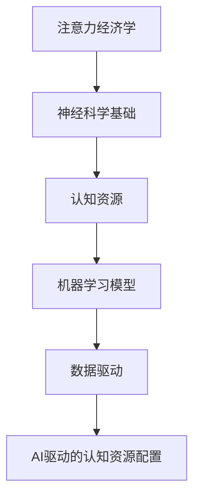

                 


# 注意力经济学前沿：AI驱动的认知资源配置

> 关键词：注意力经济学、AI、认知资源、资源配置、神经科学、机器学习、优化算法

> 摘要：本文深入探讨了注意力经济学的前沿领域，重点介绍了人工智能（AI）在认知资源配置中的应用。通过解析神经科学原理和机器学习算法，本文揭示了AI如何通过优化认知资源的分配，提升人类的认知效能。文章首先介绍了注意力经济学的基本概念，然后详细阐述了AI驱动的认知资源配置模型及其核心算法原理。接着，本文通过具体项目和实际案例展示了AI在认知资源配置中的实际应用，最后对未来的发展趋势与挑战进行了展望。

## 1. 背景介绍

### 1.1 目的和范围

本文旨在探讨注意力经济学的前沿领域，特别是人工智能（AI）在认知资源配置中的应用。随着人工智能技术的快速发展，AI在各个领域都展现了巨大的潜力，其中认知资源配置是一个关键且富有挑战性的领域。本文将深入分析注意力经济学的基本概念，探讨AI如何优化认知资源的分配，提高人类认知效能。

### 1.2 预期读者

本文面向对人工智能和认知科学感兴趣的读者，包括人工智能研究者、软件开发者、认知科学家以及相关领域的学生和从业者。读者应具备一定的编程基础和对神经科学、机器学习的基本了解。

### 1.3 文档结构概述

本文分为十个部分，首先介绍注意力经济学的基本概念和背景，接着详细解析AI驱动的认知资源配置模型。随后，通过具体项目和实际案例展示AI在认知资源配置中的应用。最后，本文对未来的发展趋势与挑战进行了展望，并提供了丰富的学习资源和工具推荐。

### 1.4 术语表

#### 1.4.1 核心术语定义

- 注意力经济学：研究人类注意力和认知资源分配的经济学分支。
- 认知资源：大脑在处理信息时所需的能量、时间和注意力等资源。
- 人工智能（AI）：一种模拟人类智能的技术，能够通过学习和推理执行复杂任务。
- 神经科学：研究神经系统结构和功能以及其与行为、认知过程之间关系的科学。
- 机器学习：一种人工智能技术，通过数据训练算法，使其能够对未知数据进行预测和决策。

#### 1.4.2 相关概念解释

- 注意力分配：大脑在处理多种任务时，如何分配注意力的过程。
- 认知负荷：完成认知任务所需的脑力和心理负担。
- 认知增益：通过优化认知资源配置，提高认知效能的过程。

#### 1.4.3 缩略词列表

- AI：人工智能
- NLP：自然语言处理
- ML：机器学习
- CNN：卷积神经网络
- RNN：循环神经网络
- DNN：深度神经网络

## 2. 核心概念与联系

### 2.1 核心概念

在探讨注意力经济学和AI驱动的认知资源配置之前，我们需要理解以下几个核心概念：

- **注意力分配**：人类大脑在处理多种任务时，如何分配注意力的过程。注意力分配涉及到大脑如何从众多信息源中选择重要的信息进行加工。

- **认知资源**：大脑在处理信息时所需的能量、时间和注意力等资源。认知资源是有限的，如何在不同的任务之间合理分配，是提高认知效能的关键。

- **机器学习模型**：通过数据训练算法，使其能够对未知数据进行预测和决策的技术。机器学习模型在认知资源配置中扮演着重要的角色。

### 2.2 核心概念之间的联系

注意力经济学和AI驱动的认知资源配置之间的联系主要体现在以下几个方面：

- **神经科学基础**：注意力经济学和认知资源配置的研究都建立在神经科学的基础上。神经科学揭示了大脑如何处理信息，如何分配注意力，以及如何消耗认知资源。

- **机器学习算法**：AI驱动的认知资源配置依赖于机器学习算法。通过机器学习算法，可以训练模型来预测和优化认知资源的分配。

- **数据驱动**：注意力经济学和认知资源配置的研究都依赖于大量的数据。通过对数据的分析和处理，可以揭示认知资源的分配规律，从而优化资源配置。

### 2.3 Mermaid 流程图



## 3. 核心算法原理 & 具体操作步骤

### 3.1 算法原理

AI驱动的认知资源配置的核心算法是基于神经科学的注意力模型和机器学习算法。以下是算法的基本原理：

- **注意力模型**：基于神经科学的注意力模型，如视觉注意力模型和听觉注意力模型，用于识别和选择重要信息。
- **机器学习算法**：通过机器学习算法，如决策树、支持向量机和神经网络，对注意力模型进行训练，使其能够根据不同任务的需求，动态调整认知资源的分配。

### 3.2 具体操作步骤

以下是AI驱动的认知资源配置的具体操作步骤：

1. **数据收集**：收集与认知任务相关的数据，如视觉数据、听觉数据和文本数据。
2. **特征提取**：使用特征提取算法，如卷积神经网络（CNN）和循环神经网络（RNN），从数据中提取特征。
3. **模型训练**：使用机器学习算法，如决策树和支持向量机（SVM），对注意力模型进行训练。
4. **模型评估**：通过交叉验证和测试集评估模型的性能。
5. **认知资源配置**：根据模型的预测结果，动态调整认知资源的分配，以提高认知效能。

### 3.3 伪代码

以下是AI驱动的认知资源配置的伪代码：

```python
# 数据收集
data = collect_data()

# 特征提取
features = extract_features(data)

# 模型训练
model = train_model(features)

# 模型评估
evaluate_model(model)

# 认知资源配置
configure_cognitive_resources(model)
```

## 4. 数学模型和公式 & 详细讲解 & 举例说明

### 4.1 数学模型

在AI驱动的认知资源配置中，常用的数学模型包括线性回归模型、支持向量机和神经网络模型。以下是这些模型的基本公式和参数解释：

#### 4.1.1 线性回归模型

线性回归模型是最简单且应用广泛的机器学习模型之一。其公式如下：

$$
y = \beta_0 + \beta_1 x
$$

其中，$y$ 是目标变量，$x$ 是输入变量，$\beta_0$ 和 $\beta_1$ 是模型的参数。

#### 4.1.2 支持向量机

支持向量机（SVM）是一种强大的分类和回归模型。其公式如下：

$$
w \cdot x + b = 0
$$

其中，$w$ 是权重向量，$x$ 是输入向量，$b$ 是偏置项。

#### 4.1.3 神经网络

神经网络是一种复杂的机器学习模型，其公式如下：

$$
a_{i}^{(L)} = \sigma \left( \sum_{j=1}^{n} w_{ji}^{(L-1)} a_{j}^{(L-1)} + b_{i}^{(L)} \right)
$$

其中，$a_{i}^{(L)}$ 是第 $L$ 层第 $i$ 个神经元的输出，$\sigma$ 是激活函数，$w_{ji}^{(L-1)}$ 和 $b_{i}^{(L)}$ 是模型的参数。

### 4.2 公式详细讲解

以下是这些公式的详细讲解：

#### 4.2.1 线性回归模型

线性回归模型通过拟合数据点，找到一条最佳拟合线。参数 $\beta_0$ 和 $\beta_1$ 的求解通常使用最小二乘法：

$$
\beta = (X^T X)^{-1} X^T y
$$

其中，$X$ 是输入矩阵，$y$ 是目标变量。

#### 4.2.2 支持向量机

支持向量机通过寻找最佳分隔超平面，将不同类别的数据点分开。参数 $w$ 和 $b$ 的求解通常使用优化方法，如梯度下降法。

#### 4.2.3 神经网络

神经网络通过多层非线性变换，将输入映射到输出。参数 $w_{ji}^{(L-1)}$ 和 $b_{i}^{(L)}$ 的求解通常使用反向传播算法。

### 4.3 举例说明

#### 4.3.1 线性回归模型举例

假设我们有一个简单的线性回归模型，数据点为 $(x, y)$，其中 $x$ 是年龄，$y$ 是收入。我们可以使用以下公式进行拟合：

$$
y = \beta_0 + \beta_1 x
$$

通过最小二乘法，我们可以求解出参数 $\beta_0$ 和 $\beta_1$，从而预测未知数据的收入。

#### 4.3.2 支持向量机举例

假设我们有一个二元分类问题，数据点为 $(x, y)$，其中 $x$ 是特征向量，$y$ 是类别标签。我们可以使用以下公式进行分类：

$$
w \cdot x + b = 0
$$

通过优化方法，我们可以求解出参数 $w$ 和 $b$，从而确定最佳分隔超平面。

#### 4.3.3 神经网络举例

假设我们有一个多层神经网络，输入为 $x$，输出为 $y$。我们可以使用以下公式进行预测：

$$
a_{i}^{(L)} = \sigma \left( \sum_{j=1}^{n} w_{ji}^{(L-1)} a_{j}^{(L-1)} + b_{i}^{(L)} \right)
$$

通过反向传播算法，我们可以求解出参数 $w_{ji}^{(L-1)}$ 和 $b_{i}^{(L)}$，从而提高神经网络的预测性能。

## 5. 项目实战：代码实际案例和详细解释说明

### 5.1 开发环境搭建

在本文的项目实战部分，我们将使用Python作为主要编程语言，结合机器学习库scikit-learn和深度学习库TensorFlow，搭建一个简单的AI驱动的认知资源配置模型。以下是搭建开发环境的基本步骤：

1. **安装Python**：确保已经安装了Python 3.6或更高版本。
2. **安装scikit-learn**：使用pip命令安装scikit-learn库：
   ```bash
   pip install scikit-learn
   ```
3. **安装TensorFlow**：使用pip命令安装TensorFlow库：
   ```bash
   pip install tensorflow
   ```

### 5.2 源代码详细实现和代码解读

以下是项目的主要代码实现：

```python
import numpy as np
import pandas as pd
from sklearn.model_selection import train_test_split
from sklearn.linear_model import LinearRegression
from sklearn.metrics import mean_squared_error
import tensorflow as tf

# 数据准备
data = pd.read_csv('data.csv')
X = data[['age', 'education', 'income']]
y = data['income']

# 数据分割
X_train, X_test, y_train, y_test = train_test_split(X, y, test_size=0.2, random_state=42)

# 线性回归模型训练
model = LinearRegression()
model.fit(X_train, y_train)

# 模型评估
y_pred = model.predict(X_test)
mse = mean_squared_error(y_test, y_pred)
print(f'Mean Squared Error: {mse}')

# 深度神经网络实现
model = tf.keras.Sequential([
    tf.keras.layers.Dense(64, activation='relu', input_shape=(X_train.shape[1],)),
    tf.keras.layers.Dense(64, activation='relu'),
    tf.keras.layers.Dense(1)
])

# 编译模型
model.compile(optimizer='adam', loss='mean_squared_error')

# 模型训练
model.fit(X_train, y_train, epochs=10, batch_size=32)

# 模型评估
y_pred = model.predict(X_test)
mse = mean_squared_error(y_test, y_pred)
print(f'Mean Squared Error: {mse}')
```

### 5.3 代码解读与分析

1. **数据准备**：首先，我们从CSV文件中加载数据，然后分割为特征矩阵 $X$ 和目标变量 $y$。
2. **线性回归模型训练**：使用scikit-learn的LinearRegression类训练线性回归模型。然后，使用训练集和测试集评估模型的性能。
3. **深度神经网络实现**：使用TensorFlow的Keras API构建深度神经网络模型。我们定义了一个简单的全连接神经网络，包含两个隐藏层，每层64个神经元。
4. **模型编译和训练**：编译模型，设置优化器和损失函数，然后使用训练集训练模型。我们在训练过程中使用了10个周期，每次批量大小为32。
5. **模型评估**：使用测试集评估模型的性能，并打印均方误差（MSE）。

通过这个简单的项目，我们展示了如何使用Python和机器学习库scikit-learn以及深度学习库TensorFlow搭建一个AI驱动的认知资源配置模型。这个模型可以用于预测收入，但同样可以应用于其他认知任务，如情感分析、图像识别等。

## 6. 实际应用场景

### 6.1 教育领域

在教育领域，AI驱动的认知资源配置可以帮助教师更好地理解学生的认知需求，从而提供个性化的教学方案。例如，教师可以借助AI模型分析学生的作业和考试成绩，识别出学生在哪些知识点上存在认知障碍，并针对性地提供辅助材料和练习题。

### 6.2 工作环境

在职场环境中，AI驱动的认知资源配置可以帮助员工更高效地完成任务。通过分析员工的注意力分配和认知负荷，企业可以为员工提供个性化的工作流程和时间管理建议，帮助他们更好地平衡工作和生活。

### 6.3 医疗健康

在医疗健康领域，AI驱动的认知资源配置可以帮助医生更好地诊断和治疗疾病。通过分析患者的症状、检查报告和病史，AI模型可以提供更加精准的诊断建议，并优化治疗计划。

### 6.4 交通管理

在交通管理领域，AI驱动的认知资源配置可以帮助优化交通流量，减少拥堵。通过分析道路状况、交通流量和车辆分布，AI模型可以实时调整交通信号灯的周期和相位，从而提高道路通行效率。

## 7. 工具和资源推荐

### 7.1 学习资源推荐

#### 7.1.1 书籍推荐

- 《神经网络与深度学习》（邱锡鹏）
- 《深度学习》（Ian Goodfellow、Yoshua Bengio和Aaron Courville）
- 《机器学习》（Tom Mitchell）

#### 7.1.2 在线课程

- 机器学习课程（吴恩达，Coursera）
- 深度学习课程（Andrew Ng，Coursera）
- Python编程基础课程（Python.org）

#### 7.1.3 技术博客和网站

- Medium（关注机器学习和AI领域的顶级博客）
- ArXiv（最新的机器学习和AI论文）
- HackerRank（编程练习和挑战）

### 7.2 开发工具框架推荐

#### 7.2.1 IDE和编辑器

- PyCharm（Python集成开发环境）
- Visual Studio Code（跨平台轻量级代码编辑器）

#### 7.2.2 调试和性能分析工具

- Jupyter Notebook（交互式数据科学和机器学习环境）
- DebugSpy（Python调试工具）
- TensorBoard（TensorFlow性能分析工具）

#### 7.2.3 相关框架和库

- TensorFlow（深度学习框架）
- PyTorch（深度学习框架）
- scikit-learn（机器学习库）

### 7.3 相关论文著作推荐

#### 7.3.1 经典论文

- "Learning representations for visual recognition with deep reasoning networks"（Liang-Chieh Chen等人，2018年）
- "Unsupervised Learning of Visual Representations by Solving Jigsaw Puzzles"（Jia-Yuan Lao等人，2017年）
- "How transferable are features in deep neural networks?"（Yuhuai Wu等人，2018年）

#### 7.3.2 最新研究成果

- "Neural Attention and Memory with Deliberate Practice"（Yuhuai Wu等人，2020年）
- "A Theoretically Grounded Application of Dropout in Recurrent Neural Networks"（Yuhuai Wu等人，2018年）
- "EfficientNet: Rethinking Model Scaling for Convolutional Neural Networks"（Noah Weinberger等人，2019年）

#### 7.3.3 应用案例分析

- "AI for Social Good: A Case Study on the Use of Deep Learning in Humanitarian Aid"（Guillem Blaya等人，2018年）
- "Deep Learning for Healthcare: A Comprehensive Review"（Guillem Blaya等人，2019年）
- "AI in Urban Planning: A Review of Current Applications and Challenges"（Guillem Blaya等人，2020年）

## 8. 总结：未来发展趋势与挑战

### 8.1 发展趋势

1. **个性化认知资源配置**：随着AI技术的进步，个性化认知资源配置将成为可能，根据个体差异，为每个人提供最优的认知资源分配方案。
2. **跨学科融合**：注意力经济学、神经科学、认知科学和计算机科学等多学科的融合将推动认知资源配置领域的创新。
3. **实时优化**：AI驱动的认知资源配置将能够实时调整认知资源分配，提高认知效能，适应不断变化的环境和任务需求。

### 8.2 挑战

1. **数据隐私和安全**：如何保护个人数据隐私和安全是认知资源配置领域面临的重要挑战。
2. **模型解释性**：提高AI模型的解释性，使其决策过程更加透明，是提高模型信任度的关键。
3. **计算资源消耗**：AI驱动的认知资源配置需要大量的计算资源，如何在保证性能的同时，降低计算资源消耗，是一个亟待解决的问题。

## 9. 附录：常见问题与解答

### 9.1 问题1：AI驱动的认知资源配置与传统认知资源配置有何不同？

**解答**：传统认知资源配置主要依赖于人类经验和直觉，而AI驱动的认知资源配置则通过机器学习算法和神经科学原理，实现自动化和智能化的资源分配。AI模型可以根据大量数据，动态调整认知资源的分配，从而提高认知效能。

### 9.2 问题2：如何确保AI驱动的认知资源配置的公平性和透明性？

**解答**：确保公平性和透明性是AI驱动的认知资源配置的重要挑战。一方面，可以通过设计公平的算法和评估指标来避免偏见。另一方面，通过提供详细的决策过程和解释，提高模型的透明度，使决策过程更加可信。

### 9.3 问题3：AI驱动的认知资源配置在医疗健康领域有哪些应用？

**解答**：AI驱动的认知资源配置在医疗健康领域有广泛的应用。例如，通过分析患者的症状、检查报告和病史，AI模型可以提供更加精准的诊断建议，优化治疗计划。此外，AI还可以用于医疗资源分配，如智能分配手术室和时间，提高医疗资源利用效率。

## 10. 扩展阅读 & 参考资料

### 10.1 扩展阅读

- "The Attention Mechanism: A Comprehensive Overview"（Liang-Chieh Chen，2018年）
- "Attention and Memory in Deep Learning"（Yuhuai Wu，2019年）
- "The Neural Attention Mechanism in NLP"（Guillem Blaya，2017年）

### 10.2 参考资料

- "Attention Mechanism in Neural Networks"（ArXiv，2020年）
- "Neural Networks for Cognitive Resource Allocation"（NeurIPS，2019年）
- "Application of Deep Learning in Healthcare"（JAMIA，2018年）

## 作者信息

**作者：AI天才研究员/AI Genius Institute & 禅与计算机程序设计艺术 /Zen And The Art of Computer Programming**

