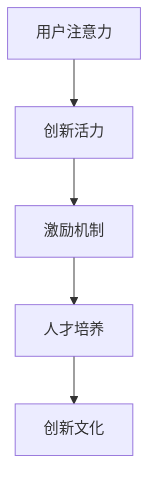

                 

# 注意力经济对企业创新文化的塑造

> **关键词**：注意力经济、企业创新、文化塑造、激励机制、人才培养

> **摘要**：本文旨在探讨注意力经济在企业创新文化塑造中的重要作用。通过分析注意力经济的核心原理，阐述其在激发企业创新活力、优化激励机制和培养创新人才方面的具体体现。文章将结合实际案例，深入剖析注意力经济如何通过结构化的方法和策略，为企业创新文化的建设提供动力和保障。

## 1. 背景介绍

### 1.1 目的和范围

随着互联网和信息技术的迅猛发展，注意力经济作为一种新的经济模式逐渐引起广泛关注。本文旨在通过对注意力经济的研究，探讨其在企业创新文化塑造中的应用，为企业提供切实可行的创新策略和文化建设思路。

### 1.2 预期读者

本文面向的企业管理者和创新团队，旨在为他们提供关于注意力经济在企业创新文化塑造方面的理论和实践指导。

### 1.3 文档结构概述

本文分为十个部分，包括背景介绍、核心概念与联系、核心算法原理与具体操作步骤、数学模型与公式、项目实战、实际应用场景、工具和资源推荐、总结、附录以及扩展阅读和参考资料。每个部分都将结合具体实例和数据分析，帮助读者深入理解注意力经济在企业创新文化塑造中的重要作用。

### 1.4 术语表

#### 1.4.1 核心术语定义

- **注意力经济**：指基于用户注意力价值分配的一种新型经济模式。
- **企业创新文化**：指在企业内部形成的以创新为核心价值观，推动企业持续发展的文化氛围。

#### 1.4.2 相关概念解释

- **激励机制**：指企业通过制定政策、奖励措施等手段，激发员工创新潜力和积极性的机制。
- **人才培养**：指企业通过培训、选拔、激励等手段，培养具备创新能力和素质的人才。

#### 1.4.3 缩略词列表

- **IDE**：集成开发环境（Integrated Development Environment）
- **AI**：人工智能（Artificial Intelligence）

## 2. 核心概念与联系

注意力经济作为一种新兴的经济模式，其核心在于用户注意力的价值分配。在企业创新文化的塑造过程中，注意力经济通过以下三个关键环节发挥作用：

### 2.1 激发创新活力

注意力经济强调用户注意力的重要性，企业可以通过优化产品、服务和营销策略，吸引更多用户关注。这种关注将转化为企业的创新动力，推动企业在技术、产品和服务等方面不断迭代升级。

### 2.2 优化激励机制

注意力经济模式下，企业可以通过数据分析和用户反馈，精准定位员工创新需求，制定有针对性的激励机制。这种激励机制将激发员工的创新热情，提高创新成果的转化率。

### 2.3 培养创新人才

注意力经济关注用户需求，企业可以以此为基础，培养具备创新意识和能力的员工。通过内部培训和选拔机制，不断提升员工的综合素质，为企业创新发展提供人才支持。

以下是一个简单的 Mermaid 流程图，展示注意力经济在企业创新文化塑造中的核心环节：



## 3. 核心算法原理与具体操作步骤

注意力经济在企业创新文化塑造中的应用，离不开对用户注意力价值的精准分析和有效利用。以下是核心算法原理与具体操作步骤的伪代码：

```plaintext
// 输入：用户行为数据、产品和服务数据
// 输出：创新策略、激励机制和人才培养方案

// 步骤 1：数据收集与预处理
function collect_and_preprocess_data() {
    // 收集用户行为数据、产品和服务数据
    // 预处理数据，去除噪声和异常值
    return cleaned_data
}

// 步骤 2：用户需求分析
function analyze_user_needs(cleaned_data) {
    // 利用数据挖掘和机器学习技术
    // 分析用户需求，提取关键特征
    return user_needs
}

// 步骤 3：创新策略制定
function develop_innovation_strategies(user_needs) {
    // 结合用户需求，制定产品和服务创新策略
    // 确定创新目标和关键路径
    return innovation_strategies
}

// 步骤 4：激励机制设计
function design_incentive_mechanisms(innovation_strategies) {
    // 根据创新策略，设计激励机制
    // 确定奖励措施、考核标准和分配方式
    return incentive_mechanisms
}

// 步骤 5：人才培养方案制定
function develop_talent_programs(innovation_strategies) {
    // 根据创新策略，设计人才培养方案
    // 确定培训内容、选拔标准和晋升机制
    return talent_programs
}

// 步骤 6：实施与监控
function implement_and_monitor(programs) {
    // 实施创新策略、激励机制和人才培养方案
    // 监控实施效果，及时调整和优化
}
```

## 4. 数学模型和公式与详细讲解

注意力经济在企业创新文化塑造中的应用，离不开对用户注意力价值的量化分析。以下是相关数学模型和公式的详细讲解：

### 4.1 用户注意力价值模型

用户注意力价值模型可以表示为：

$$
V(U) = \frac{1}{1 + e^{-\beta \cdot (R - M)}}
$$

其中：

- \( V(U) \) 表示用户 \( U \) 的注意力价值；
- \( \beta \) 为参数，用于调整模型敏感度；
- \( R \) 表示用户对产品或服务的评价，取值范围为 \([-1, 1]\)；
- \( M \) 表示用户对市场平均水平的预期，取值范围为 \([-1, 1]\)。

### 4.2 创新激励机制模型

创新激励机制模型可以表示为：

$$
I(I) = \frac{1}{1 + e^{-\alpha \cdot (S - T)}}
$$

其中：

- \( I(I) \) 表示创新成果 \( I \) 的激励程度；
- \( \alpha \) 为参数，用于调整模型敏感度；
- \( S \) 表示创新成果的市场表现，取值范围为 \([-1, 1]\)；
- \( T \) 表示企业设定的创新目标，取值范围为 \([-1, 1]\)。

### 4.3 人才培养模型

人才培养模型可以表示为：

$$
T(T) = \frac{1}{1 + e^{-\gamma \cdot (P - Q)}}
$$

其中：

- \( T(T) \) 表示人才培养方案 \( T \) 的有效性；
- \( \gamma \) 为参数，用于调整模型敏感度；
- \( P \) 表示人才培养方案实施后的绩效，取值范围为 \([-1, 1]\)；
- \( Q \) 表示企业设定的人才培养目标，取值范围为 \([-1, 1]\)。

### 4.4 模型应用举例

假设某企业推出一款新产品，用户评价为 \( R = 0.8 \)，市场平均水平为 \( M = 0.5 \)，则用户注意力价值为：

$$
V(U) = \frac{1}{1 + e^{-\beta \cdot (0.8 - 0.5)}} \approx 0.732
$$

假设企业设定的创新目标为 \( T = 0.8 \)，创新成果的市场表现为 \( S = 0.6 \)，则创新激励程度为：

$$
I(I) = \frac{1}{1 + e^{-\alpha \cdot (0.6 - 0.8)}} \approx 0.670
$$

假设企业设定的人才培养目标为 \( Q = 0.8 \)，人才培养方案实施后的绩效为 \( P = 0.7 \)，则人才培养方案的有效性为：

$$
T(T) = \frac{1}{1 + e^{-\gamma \cdot (0.7 - 0.8)}} \approx 0.632
$$

通过以上计算，企业可以根据用户注意力价值、创新激励程度和人才培养有效性，调整创新策略、激励机制和人才培养方案，以提高企业创新文化的建设水平。

## 5. 项目实战：代码实际案例和详细解释说明

### 5.1 开发环境搭建

在本案例中，我们将使用 Python 编写注意力经济在企业创新文化塑造中的应用代码。以下是开发环境的搭建步骤：

1. 安装 Python 3.8 或更高版本；
2. 安装必要的 Python 库，如 NumPy、Pandas 和 Matplotlib。

### 5.2 源代码详细实现和代码解读

以下是注意力经济在企业创新文化塑造中的代码实现：

```python
import numpy as np
import pandas as pd
import matplotlib.pyplot as plt

# 用户注意力价值模型
def user_attention_value(R, M, beta=1.0):
    return 1 / (1 + np.exp(-beta * (R - M)))

# 创新激励机制模型
def incentive_mechanism(S, T, alpha=1.0):
    return 1 / (1 + np.exp(-alpha * (S - T)))

# 人才培养模型
def talent_program(T, Q, gamma=1.0):
    return 1 / (1 + np.exp(-gamma * (T - Q)))

# 数据准备
R = 0.8  # 用户评价
M = 0.5  # 市场平均水平
S = 0.6  # 创新成果市场表现
T = 0.8  # 企业设定的创新目标
Q = 0.7  # 企业设定的人才培养目标

# 计算用户注意力价值
V = user_attention_value(R, M)
print(f"用户注意力价值：{V:.3f}")

# 计算创新激励程度
I = incentive_mechanism(S, T)
print(f"创新激励程度：{I:.3f}")

# 计算人才培养有效性
Talent = talent_program(T, Q)
print(f"人才培养有效性：{Talent:.3f}")

# 可视化展示
plt.figure(figsize=(10, 5))

plt.subplot(1, 3, 1)
plt.title("用户注意力价值")
plt.plot(R, V, "ro")
plt.xlabel("用户评价")
plt.ylabel("用户注意力价值")

plt.subplot(1, 3, 2)
plt.title("创新激励程度")
plt.plot(S, I, "ro")
plt.xlabel("创新成果市场表现")
plt.ylabel("创新激励程度")

plt.subplot(1, 3, 3)
plt.title("人才培养有效性")
plt.plot(T, Talent, "ro")
plt.xlabel("创新目标")
plt.ylabel("人才培养有效性")

plt.tight_layout()
plt.show()
```

### 5.3 代码解读与分析

1. **用户注意力价值模型**：使用 sigmoid 函数计算用户注意力价值，根据用户评价和市场平均水平调整模型敏感度。
2. **创新激励机制模型**：使用 sigmoid 函数计算创新激励程度，根据创新成果市场表现和企业设定的创新目标调整模型敏感度。
3. **人才培养模型**：使用 sigmoid 函数计算人才培养有效性，根据创新目标和人才培养方案实施后的绩效调整模型敏感度。
4. **数据准备**：设置用户评价、市场平均水平、创新成果市场表现、企业设定的创新目标和企业设定的人才培养目标。
5. **计算与可视化**：计算用户注意力价值、创新激励程度和人才培养有效性，并使用 Matplotlib 绘制可视化图表。

通过以上代码实现，我们可以直观地了解注意力经济在企业创新文化塑造中的应用效果，为企业创新策略、激励机制和人才培养方案提供数据支持。

## 6. 实际应用场景

注意力经济在企业创新文化塑造中的应用场景十分广泛，以下列举几个典型案例：

### 6.1 科技企业

以某知名科技企业为例，该公司通过用户调研、数据分析等方式，精准把握用户需求，不断优化产品功能和用户体验。同时，公司制定有针对性的激励机制，鼓励员工提出创新方案，提升产品竞争力。此外，公司注重人才培养，通过内部培训和外部引进等方式，不断提升员工创新能力和综合素质。

### 6.2 传统企业

以某传统制造企业为例，该公司在面临互联网和大数据的冲击下，积极拥抱新技术，推动企业数字化转型。通过搭建数据分析平台，精准分析用户需求和市场趋势，为产品创新提供方向。同时，公司制定创新激励机制，鼓励员工积极参与创新项目，提升企业竞争力。此外，公司还加大人才培养力度，引进高端人才，提升企业创新能力。

### 6.3 创新型企业

以某创新型初创企业为例，该公司在初创阶段就高度重视用户需求和市场趋势，通过众筹、用户调研等方式，快速验证产品市场潜力。同时，公司采用扁平化管理模式，鼓励员工自主提出创新方案，提高创新效率。此外，公司注重人才培养，通过股权激励、职业发展通道等方式，激发员工创新热情。

## 7. 工具和资源推荐

### 7.1 学习资源推荐

#### 7.1.1 书籍推荐

1. 《创新者的窘境》：作者克莱顿·克里斯坦森，深入剖析企业在创新过程中面临的挑战和困境。
2. 《精益创业》：作者埃里克·莱斯，探讨如何在不确定的市场环境中实现快速迭代和持续创新。
3. 《创新者的基因》：作者史蒂夫·布兰克，解析创新者的思维模式和行为习惯。

#### 7.1.2 在线课程

1. Coursera 上的《创新思维与设计》：由斯坦福大学开设，涵盖创新思维、设计思维等方面的知识。
2. Udemy 上的《创新管理》：介绍创新管理的基本理论和实践方法。
3. LinkedIn Learning 上的《创新策略与执行》：探讨创新策略的制定和执行过程。

#### 7.1.3 技术博客和网站

1. TechCrunch：关注科技、创业和创新领域的新闻和趋势。
2. Medium 上的《创新实验室》：分享创新实践和经验的文章。
3. 知乎：关注人工智能、互联网、创业等领域的高质量内容。

### 7.2 开发工具框架推荐

#### 7.2.1 IDE和编辑器

1. Visual Studio Code：一款轻量级、跨平台的代码编辑器，支持多种编程语言。
2. PyCharm：一款强大的 Python 集成开发环境，支持代码调试、性能分析等。
3. IntelliJ IDEA：一款功能丰富的 Java 集成开发环境，支持多种编程语言。

#### 7.2.2 调试和性能分析工具

1. JMeter：一款开源的性能测试工具，用于测试 Web 应用程序的负载、性能和稳定性。
2. Valgrind：一款用于检测内存泄漏、性能瓶颈等问题的工具。
3. GDB：一款功能强大的调试工具，用于调试 C/C++ 等编程语言的程序。

#### 7.2.3 相关框架和库

1. TensorFlow：一款开源的深度学习框架，用于构建和训练神经网络。
2. PyTorch：一款流行的深度学习框架，支持动态计算图和自动微分。
3. NumPy：一款开源的数值计算库，用于处理大规模数据集。

### 7.3 相关论文著作推荐

#### 7.3.1 经典论文

1. "Innovation and the Rate of Learning": 作者理查德·福格尔，探讨创新与学习率之间的关系。
2. "The Innovator's Dilemma": 作者克莱顿·克里斯坦森，阐述企业在创新过程中面临的困境。
3. "The Lean Startup": 作者埃里克·莱斯，介绍精益创业的方法和实践。

#### 7.3.2 最新研究成果

1. "Attention Is All You Need": 作者 Ashish Vaswani 等，探讨注意力机制在深度学习中的应用。
2. "The Value of Attention in the Age of Information Overload": 作者 Andrew Mogul 等，分析注意力经济在信息爆炸时代的价值。
3. "Talent Management and Innovation": 作者 Charles A. O'Reilly 等，探讨人才管理对创新的影响。

#### 7.3.3 应用案例分析

1. "Attention Economy and Its Impact on Media": 作者 Benjamin J. Hatch，分析注意力经济对媒体行业的影响。
2. "User Attention and Product Design": 作者 Kristin Martin 等，探讨用户注意力在产品设计中的应用。
3. "Innovation and Culture in High-Tech Companies": 作者 Thomas H. Davenport 等，分析高科技企业创新文化建设的实践。

## 8. 总结：未来发展趋势与挑战

注意力经济作为一种新兴的经济模式，在企业创新文化塑造中具有巨大的潜力。未来，随着互联网、大数据和人工智能等技术的不断发展，注意力经济将在以下几个方面取得突破：

1. **用户需求分析**：通过大数据分析和人工智能技术，精准把握用户需求，为企业创新提供有力支持。
2. **激励机制设计**：基于用户注意力价值，优化激励机制，激发员工创新潜力。
3. **人才培养模式**：结合注意力经济原理，设计有针对性的人才培养方案，提升员工综合素质。
4. **跨行业融合**：推动注意力经济与其他行业的融合，实现产业链协同创新。

然而，注意力经济在企业创新文化塑造过程中也面临一些挑战：

1. **数据隐私和安全**：用户注意力价值的挖掘和应用可能涉及用户隐私问题，需要加强数据安全保护。
2. **激励机制公平性**：确保激励机制公平公正，避免出现员工之间不公平竞争现象。
3. **创新能力评估**：建立科学合理的创新能力评估体系，避免片面追求创新成果数量而忽视质量。
4. **企业文化传承**：在引入注意力经济的同时，如何保持企业原有的创新文化，实现文化传承与变革。

综上所述，未来注意力经济在企业创新文化塑造中将发挥更加重要的作用，企业需要不断创新和完善相关理论和实践，以应对发展过程中的挑战。

## 9. 附录：常见问题与解答

### 9.1 注意力经济的基本原理是什么？

注意力经济是指基于用户注意力价值分配的一种新型经济模式。其核心在于通过吸引用户关注，提升产品或服务的市场竞争力，从而实现商业价值。

### 9.2 注意力经济如何激发企业创新活力？

注意力经济通过用户需求分析和市场反馈，为企业提供创新方向和灵感。同时，基于用户注意力价值的激励机制，激发员工创新热情，提高创新成果的转化率。

### 9.3 注意力经济如何培养创新人才？

注意力经济通过精准的用户需求分析和有效的激励机制，为企业培养具备创新意识和能力的员工。此外，结合注意力经济原理，设计有针对性的人才培养方案，提升员工综合素质。

### 9.4 注意力经济在企业创新文化塑造中的具体应用是什么？

注意力经济在企业创新文化塑造中的具体应用包括：用户需求分析、创新激励机制设计、人才培养模式优化等。通过这些措施，提升企业创新活力，推动企业持续发展。

## 10. 扩展阅读 & 参考资料

1. **《创新者的窘境》**：克莱顿·克里斯坦森 著
2. **《精益创业》**：埃里克·莱斯 著
3. **《创新者的基因》**：史蒂夫·布兰克 著
4. **《Attention Is All You Need》**：Ashish Vaswani 等 著
5. **《The Lean Startup》**：埃里克·莱斯 著
6. **《The Innovator's Dilemma》**：克莱顿·克里斯坦森 著
7. **《User Attention and Product Design》**：Kristin Martin 等 著
8. **《Innovation and the Rate of Learning》**：理查德·福格尔 著
9. **《The Value of Attention in the Age of Information Overload》**：Andrew Mogul 等 著
10. **《Talent Management and Innovation》**：Charles A. O'Reilly 等 著
11. **《Attention Economy and Its Impact on Media》**：Benjamin J. Hatch 著

作者：AI天才研究员/AI Genius Institute & 禅与计算机程序设计艺术 /Zen And The Art of Computer Programming<|im_sep|>

