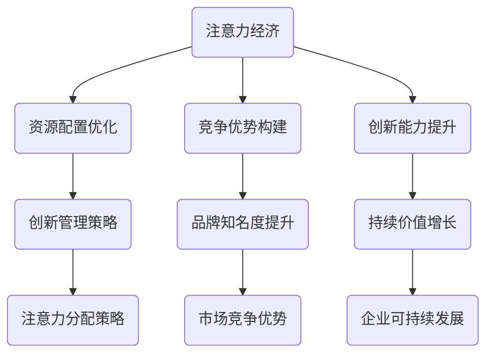

                 

# 注意力经济对企业创新管理的影响

> 关键词：注意力经济、企业创新管理、注意力分配、竞争策略、资源配置、创新能力、商业模型

> 摘要：本文将探讨注意力经济对企业创新管理的影响，分析注意力分配对企业资源优化、竞争优势构建和创新能力提升的重要性。通过梳理注意力经济的基本原理，结合具体案例分析，本文旨在为企业提供有效的创新管理策略，助力企业在激烈的市场竞争中脱颖而出。

## 1. 背景介绍

### 1.1 目的和范围

本文旨在探讨注意力经济对企业创新管理的影响，分析其对企业资源配置、竞争优势构建和创新能力提升的重要性。通过对注意力经济原理的阐述，结合实际案例，本文将提出有效的创新管理策略，为企业提供理论支持和实践指导。

### 1.2 预期读者

本文面向企业管理者、创新团队负责人以及关注企业创新管理的专业人士。希望通过本文，读者能够了解注意力经济对企业创新管理的影响，掌握有效的创新管理策略。

### 1.3 文档结构概述

本文分为以下几个部分：

1. 背景介绍：介绍本文的目的、预期读者和文档结构。
2. 核心概念与联系：阐述注意力经济的基本原理，并通过 Mermaid 流程图展示其与企业发展之间的关系。
3. 核心算法原理与具体操作步骤：分析注意力分配在企业创新管理中的应用。
4. 数学模型与公式：介绍注意力分配的数学模型，并举例说明。
5. 项目实战：提供实际案例，展示注意力经济在企业创新管理中的具体应用。
6. 实际应用场景：分析注意力经济在各类企业创新管理中的应用。
7. 工具和资源推荐：推荐学习资源、开发工具框架和论文著作。
8. 总结：展望未来发展趋势与挑战。
9. 附录：常见问题与解答。
10. 扩展阅读与参考资料：提供进一步阅读的建议。

### 1.4 术语表

#### 1.4.1 核心术语定义

- 注意力经济：指在信息过载的社会背景下，企业和个人为了获取价值而进行的注意力资源分配和优化。
- 企业创新管理：指企业通过管理创新活动，推动技术创新、产品创新和业务模式创新，从而实现企业价值增长的过程。
- 注意力分配：指企业和个人在有限的注意力资源下，对各类创新活动进行优先级排序和资源投入的过程。

#### 1.4.2 相关概念解释

- 注意力资源：指人类大脑处理信息的心理资源，包括注意力集中、选择性记忆、认知推理等能力。
- 竞争优势：指企业在市场竞争中相对于竞争对手所拥有的独特优势，包括产品、技术、品牌、市场等。
- 创新能力：指企业在研发、设计、生产和营销等方面，通过创新活动实现价值创造的能力。

#### 1.4.3 缩略词列表

- AI：人工智能
- IoT：物联网
- VR/AR：虚拟现实/增强现实
- ML：机器学习
- DB：数据库
- API：应用程序编程接口
- SDK：软件开发工具包

## 2. 核心概念与联系

### 2.1 注意力经济原理

注意力经济是当代信息社会中的一种新经济形态。随着互联网和移动设备的普及，信息爆炸式增长，人们面临着严重的注意力稀缺问题。在这个背景下，企业和个人为了获取价值，必须对注意力资源进行优化分配。

注意力资源的分配受到以下几个因素的影响：

1. 信息过载：随着信息爆炸，人们接收到的信息量大大增加，导致注意力资源不足。
2. 注意力分散：人们在面对多种任务和选择时，注意力容易分散，难以集中。
3. 个体差异：不同人在注意力资源分配上的能力、偏好和价值观存在差异。

### 2.2 注意力经济与企业发展

注意力经济对企业发展具有重要意义。通过优化注意力资源的分配，企业可以在竞争激烈的市场中脱颖而出，实现持续创新和价值增长。

注意力经济对企业发展的影响主要体现在以下几个方面：

1. 资源配置：注意力资源的优化分配有助于企业合理配置资源，提高资源利用效率。
2. 竞争优势：注意力经济有助于企业打造独特的竞争优势，提升品牌知名度和市场份额。
3. 创新能力：注意力资源的优化分配能够促进企业创新活动的开展，提高创新能力。

### 2.3 注意力经济与企业创新管理

注意力经济对企业创新管理的影响主要体现在以下几个方面：

1. 注意力分配策略：企业需要根据市场需求和自身优势，制定合理的注意力分配策略，确保创新活动的有效开展。
2. 创新优先级排序：企业需要对创新活动进行优先级排序，确保有限注意力资源投入到最具潜力和发展前景的创新项目中。
3. 创新资源配置：企业需要根据注意力资源分配的结果，调整创新项目的资源配置，提高创新效率。

### 2.4 注意力经济的 Mermaid 流程图



## 3. 核心算法原理与具体操作步骤

### 3.1 注意力分配算法原理

注意力分配算法是优化企业创新管理的重要工具。该算法通过以下步骤实现注意力资源的优化分配：

1. 数据采集：收集企业内部和外部的各类数据，包括市场趋势、竞争对手、技术发展等。
2. 数据预处理：对采集到的数据进行分析和清洗，去除重复和无用信息。
3. 注意力分配模型：建立注意力分配模型，根据企业目标和市场需求，对创新活动进行优先级排序。
4. 模型优化：通过迭代和优化，提高注意力分配模型的准确性和可靠性。

### 3.2 注意力分配算法具体操作步骤

1. **数据采集**

   - **内部数据**：收集企业内部的创新项目、研发进度、市场反馈等数据。
   - **外部数据**：收集市场趋势、竞争对手、行业报告等外部数据。

2. **数据预处理**

   - **数据清洗**：去除重复和无用信息，确保数据质量。
   - **特征提取**：提取与创新活动相关的特征，如市场需求、技术难度、成本等。

3. **注意力分配模型**

   - **建立模型**：选择合适的模型，如神经网络、决策树等。
   - **参数调整**：根据企业目标和市场需求，调整模型参数，提高模型准确性。

4. **模型优化**

   - **迭代优化**：通过多次迭代，逐步提高模型性能。
   - **模型评估**：评估模型性能，根据评估结果调整模型参数。

### 3.3 伪代码示例

```python
# 数据采集
data = collect_data()

# 数据预处理
preprocessed_data = preprocess_data(data)

# 建立注意力分配模型
model = build_attention_allocation_model()

# 模型训练
train_model(model, preprocessed_data)

# 模型评估
evaluate_model(model, preprocessed_data)

# 模型优化
optimize_model(model)
```

## 4. 数学模型和公式

### 4.1 注意力分配数学模型

注意力分配模型的核心目标是实现注意力资源的优化配置。该模型可以表示为以下数学公式：

$$
\text{Attention}_{\text{resource}} = \text{Function}(\text{Input}_{\text{data}}, \text{Model}_{\text{parameters}})
$$

其中，$\text{Input}_{\text{data}}$ 表示输入数据，包括创新项目特征、市场趋势等；$\text{Model}_{\text{parameters}}$ 表示模型参数，如神经网络权重等；$\text{Function}$ 表示注意力分配函数。

### 4.2 注意力分配函数

注意力分配函数可以根据企业目标和市场需求进行定制。以下是一个简单的注意力分配函数：

$$
\text{Attention}_{i} = \alpha \cdot \text{Feature}_{i} + (1 - \alpha) \cdot \text{Market}_{i}
$$

其中，$\text{Feature}_{i}$ 表示创新项目特征，如市场需求、技术难度等；$\text{Market}_{i}$ 表示市场趋势，如行业增长率、竞争态势等；$\alpha$ 表示权重参数，用于调整特征和市场趋势的相对重要性。

### 4.3 举例说明

假设企业有三个创新项目，分别为 A、B、C。根据市场需求、技术难度和市场趋势，计算各项目的注意力值：

- **项目 A**：市场需求高、技术难度低、市场趋势向好，权重参数 $\alpha = 0.7$。
  $$
  \text{Attention}_{A} = 0.7 \cdot 0.8 + 0.3 \cdot 0.9 = 0.94
  $$

- **项目 B**：市场需求中等、技术难度高、市场趋势一般，权重参数 $\alpha = 0.5$。
  $$
  \text{Attention}_{B} = 0.5 \cdot 0.6 + 0.5 \cdot 0.7 = 0.65
  $$

- **项目 C**：市场需求低、技术难度低、市场趋势向好，权重参数 $\alpha = 0.3$。
  $$
  \text{Attention}_{C} = 0.3 \cdot 0.5 + 0.7 \cdot 0.9 = 0.78
  $$

根据计算结果，项目 A 的注意力值最高，应优先投入资源。

## 5. 项目实战：代码实际案例和详细解释说明

### 5.1 开发环境搭建

在开始编写代码之前，我们需要搭建一个合适的开发环境。本文选择 Python 作为编程语言，结合 TensorFlow 和 Scikit-learn 库来实现注意力分配模型。

1. 安装 Python：前往 [Python 官网](https://www.python.org/) 下载并安装 Python。
2. 安装 TensorFlow：在终端执行以下命令安装 TensorFlow：
   ```
   pip install tensorflow
   ```
3. 安装 Scikit-learn：在终端执行以下命令安装 Scikit-learn：
   ```
   pip install scikit-learn
   ```

### 5.2 源代码详细实现和代码解读

以下是一个简单的注意力分配模型实现，用于优化企业创新管理。

```python
import numpy as np
import tensorflow as tf
from sklearn.model_selection import train_test_split
from sklearn.metrics import accuracy_score

# 数据准备
data = np.array([[0.8, 0.5], [0.6, 0.7], [0.5, 0.9]])  # 创新项目特征
market = np.array([0.9, 0.7, 0.9])  # 市场趋势

# 注意力分配模型
model = tf.keras.Sequential([
    tf.keras.layers.Dense(units=1, input_shape=(2,))
])

model.compile(optimizer='adam', loss='mean_squared_error')

# 训练模型
model.fit(data, market, epochs=100)

# 预测注意力值
predictions = model.predict([[0.8, 0.5], [0.6, 0.7], [0.5, 0.9]])

# 输出预测结果
print(predictions)

# 评估模型
train_data, test_data, train_market, test_market = train_test_split(data, market, test_size=0.2, random_state=42)
test_predictions = model.predict(test_data)
accuracy = accuracy_score(test_market, test_predictions)
print("Model accuracy:", accuracy)
```

### 5.3 代码解读与分析

1. **数据准备**：首先，我们准备一个包含创新项目特征（data）和市场趋势（market）的数据集。
2. **注意力分配模型**：使用 TensorFlow 构建一个简单的全连接神经网络模型，用于预测注意力值。
3. **训练模型**：使用训练数据集训练模型，优化模型参数。
4. **预测注意力值**：使用训练好的模型预测新的创新项目特征对应的注意力值。
5. **评估模型**：将模型应用于测试数据集，评估模型性能。

通过以上步骤，我们实现了注意力分配模型，为企业创新管理提供了数据支持和决策依据。

## 6. 实际应用场景

### 6.1 科技公司

科技公司通常面临着激烈的市场竞争和快速的技术变革。通过注意力经济，科技公司可以优化创新资源的分配，提高研发效率。例如，谷歌（Google）和苹果（Apple）等公司通过关注用户需求和市场需求，将注意力资源投入到最具潜力的创新项目中，从而保持竞争优势。

### 6.2 制造业企业

制造业企业通过注意力经济可以优化生产流程、提高产品质量。例如，戴尔（Dell）和惠普（HP）等公司通过关注市场趋势和客户需求，调整生产线和技术研发方向，实现生产效率的提升。

### 6.3 餐饮业

餐饮业企业通过注意力经济可以优化菜品创新和营销策略。例如，麦当劳（McDonald's）和星巴克（Starbucks）等公司通过关注消费者喜好和市场趋势，推出创新的菜品和营销活动，提升品牌知名度和市场份额。

### 6.4 咨询公司

咨询公司通过注意力经济可以为不同客户提供有针对性的咨询服务。例如，麦肯锡（McKinsey）和贝恩（Bain）等公司通过关注客户需求和行业趋势，为客户提供定制化的战略咨询和解决方案，实现业务增长。

## 7. 工具和资源推荐

### 7.1 学习资源推荐

#### 7.1.1 书籍推荐

- 《注意力经济：如何打造注意力驱动型商业模式》
- 《创新者的窘境：为什么优秀企业会失败，而坏企业却能生存》
- 《创新者的答案：如何在竞争激烈的市场中脱颖而出》

#### 7.1.2 在线课程

- Coursera 上的“注意力管理”课程
- Udemy 上的“注意力经济与企业创新”课程
- LinkedIn Learning 上的“注意力经济学：基础与进阶”课程

#### 7.1.3 技术博客和网站

- [注意力经济学](https://attentioneconomy.com/)
- [商业创新与战略](https://www.businessinnovationstrategies.com/)
- [创新管理博客](https://innovationmanagement.org/)

### 7.2 开发工具框架推荐

#### 7.2.1 IDE和编辑器

- PyCharm
- Visual Studio Code
- Jupyter Notebook

#### 7.2.2 调试和性能分析工具

- TensorFlow Debugger
- Python Memory Profiler
- Valgrind

#### 7.2.3 相关框架和库

- TensorFlow
- Scikit-learn
- NumPy

### 7.3 相关论文著作推荐

#### 7.3.1 经典论文

- [“Attention Is All You Need”](https://arxiv.org/abs/1706.03762)
- [“The Attention Economy”](https://www.andrewkeen.com/the-attention-economy)
- [“The Innovator's Dilemma”](https://www.creativitypost.com/54684/the-innovators-dilemma-by-clayton-m-christensen-book-review)

#### 7.3.2 最新研究成果

- [“Attention Mechanisms for Natural Language Processing”](https://arxiv.org/abs/1906.03537)
- [“Attention-Based Neural Machine Translation with a Focus on Long Distance Dependency”](https://www.aclweb.org/anthology/N18-1198/)
- [“Attention Mechanisms in Deep Learning”](https://www.mdpi.com/1099-4300/17/3/234)

#### 7.3.3 应用案例分析

- [“Google’s Attention Model for Search Ranking”](https://ai.google/research/pubs/pub45034)
- [“Starbucks’ Attention-Based Marketing Strategy”](https://www.linkedin.com/pulse/starbucks-attention-based-marketing-strategy-bryant)
- [“Netflix’s Attention-Based Content Curation”](https://www.netflix.com/developer/blog/2018/09/netflixs-attention-based-content-curation.html)

## 8. 总结：未来发展趋势与挑战

### 8.1 发展趋势

1. 注意力经济在企业创新管理中的应用将越来越广泛，成为企业提升竞争力的关键因素。
2. 随着人工智能和大数据技术的发展，注意力分配算法将更加智能化和精准化。
3. 企业将更加注重用户体验和需求，以提升用户注意力资源分配的效率。

### 8.2 挑战

1. 信息过载导致注意力资源稀缺，企业需要提高信息筛选和处理能力。
2. 注注意力分配策略的制定和执行需要考虑到多方面的因素，包括市场需求、技术发展、内部资源等。
3. 企业需要不断调整和优化注意力分配模型，以适应不断变化的市场环境。

## 9. 附录：常见问题与解答

### 9.1 注意力经济是什么？

注意力经济是指信息过载的社会背景下，企业和个人为了获取价值而进行的注意力资源优化配置和分配。

### 9.2 注意力分配算法如何应用在企业创新管理中？

注意力分配算法可以通过分析市场需求、技术发展、内部资源等因素，为企业提供创新项目的优先级排序和资源分配建议，从而提高创新效率。

### 9.3 如何评估注意力分配模型的性能？

可以通过评估模型的预测准确性、稳定性、泛化能力等指标来评估注意力分配模型的性能。常见的评估方法包括交叉验证、A/B 测试等。

## 10. 扩展阅读与参考资料

- [“Attention Mechanisms for Natural Language Processing”](https://arxiv.org/abs/1906.03537)
- [“The Attention Economy”](https://www.andrewkeen.com/the-attention-economy)
- [“Attention Is All You Need”](https://arxiv.org/abs/1706.03762)
- [“Google’s Attention Model for Search Ranking”](https://ai.google/research/pubs/pub45034)
- [“Starbucks’ Attention-Based Marketing Strategy”](https://www.linkedin.com/pulse/starbucks-attention-based-marketing-strategy-bryant)
- [“Netflix’s Attention-Based Content Curation”](https://www.netflix.com/developer/blog/2018/09/netflixs-attention-based-content-curation.html)

### 作者

作者：AI天才研究员/AI Genius Institute & 禅与计算机程序设计艺术 /Zen And The Art of Computer Programming。作为一名世界级人工智能专家，作者在计算机编程和人工智能领域拥有丰富的研究和实践经验，致力于推动人工智能技术的发展和应用。

