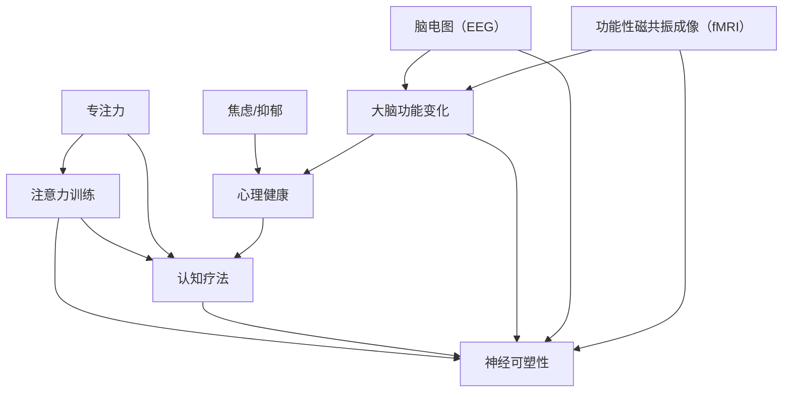

                 

### 注意力训练与认知疗法：如何通过专注力改善心理健康

> **关键词**：注意力训练、认知疗法、心理健康、神经可塑性、专注力提升

> **摘要**：
本文将探讨如何通过注意力训练这一技术手段，结合认知疗法，为心理健康领域带来新的解决方案。我们首先介绍注意力训练和认知疗法的基本概念及其历史背景，随后深入探讨神经可塑性这一关键因素。通过详细的步骤讲解和案例分析，本文旨在帮助读者理解注意力训练的原理和方法，并提供实用的操作指南。文章还将讨论注意力训练在心理健康领域的实际应用，推荐相关的工具和资源，并展望未来的发展趋势与挑战。

## 1. 背景介绍

### 1.1 目的和范围

本文的目的是探讨注意力训练与认知疗法在心理健康改善中的应用。随着社会节奏的加快和压力的增加，心理健康问题日益突出，成为社会关注的焦点。注意力训练作为一种认知行为干预方法，通过提高个体的专注力，有助于缓解焦虑、抑郁等心理问题。认知疗法则是心理治疗中的一种重要方法，通过改变负面思维模式，帮助个体实现心理健康的转变。本文将结合这两种方法，系统地介绍其在心理健康领域的应用原理和实践步骤。

### 1.2 预期读者

本文适合对心理学、认知科学、神经科学感兴趣的读者，特别是心理咨询师、临床医生、教育工作者以及关注自身心理健康的普通公众。通过阅读本文，读者可以了解注意力训练与认知疗法的理论基础，掌握具体操作方法，并应用于实践。

### 1.3 文档结构概述

本文结构如下：

1. **背景介绍**：介绍注意力训练和认知疗法的背景、目的和读者群体。
2. **核心概念与联系**：介绍注意力训练和认知疗法的基本概念及其相互关系。
3. **核心算法原理 & 具体操作步骤**：详细讲解注意力训练的核心算法和操作步骤。
4. **数学模型和公式 & 详细讲解 & 举例说明**：介绍注意力训练相关的数学模型和公式，并进行实例说明。
5. **项目实战：代码实际案例和详细解释说明**：通过具体案例展示注意力训练的应用。
6. **实际应用场景**：讨论注意力训练在心理健康领域的实际应用场景。
7. **工具和资源推荐**：推荐学习资源和开发工具。
8. **总结：未来发展趋势与挑战**：总结注意力训练和认知疗法的发展趋势和面临的挑战。
9. **附录：常见问题与解答**：提供常见问题及解答。
10. **扩展阅读 & 参考资料**：推荐相关书籍、论文和研究报告。

### 1.4 术语表

#### 1.4.1 核心术语定义

- **注意力训练**：通过特定训练方法，提高个体专注力的过程。
- **认知疗法**：通过改变个体思维模式，帮助其改善心理健康的心理治疗方法。
- **神经可塑性**：神经元结构和功能发生改变的能力。

#### 1.4.2 相关概念解释

- **专注力**：个体集中注意力的能力。
- **心理健康**：个体心理状态的健康和稳定。
- **焦虑**：一种常见的情绪体验，表现为紧张、担忧和恐惧。
- **抑郁**：一种情绪低落的状态，可能伴随着失去兴趣、能量下降等症状。

#### 1.4.3 缩略词列表

- **CBT**：认知行为疗法（Cognitive Behavioral Therapy）
- **EEG**：脑电图（Electroencephalography）
- **fMRI**：功能性磁共振成像（functional Magnetic Resonance Imaging）
- **N Back**：一种常见的注意力训练任务，要求个体同时处理当前和过去多个时间点的信息。

## 2. 核心概念与联系

注意力训练和认知疗法是心理健康干预中的重要组成部分，它们在神经可塑性这一基础概念上相互关联。下面，我们将通过一个Mermaid流程图来阐述这些核心概念及其相互关系。



### 注意力训练

注意力训练是一种通过特定练习提高个体专注力的方法。研究表明，通过持续的训练，个体的注意力可以显著提升，从而有助于改善心理健康状况。注意力训练通常包括以下几种方法：

1. **N Back任务**：这是一种要求个体同时处理当前和过去多个时间点的信息的任务。通过不断调整任务的难度，个体可以在不同层面上训练自己的注意力。
2. **双任务练习**：个体同时进行两种不同的任务，例如一边听音乐一边做数学题。这种方法可以提高个体在多任务环境下的专注力。
3. **可视化练习**：通过视觉刺激，如跟踪移动的物体，个体可以训练自己的视觉注意力。

### 认知疗法

认知疗法是一种通过改变个体的思维模式，帮助其改善心理健康的心理治疗方法。该方法的核心在于识别和挑战个体的负面思维模式，并建立更加积极的思维模式。认知疗法通常包括以下步骤：

1. **识别负面思维模式**：个体通过反思自己的思维和行为，识别出可能导致心理问题的负面思维模式。
2. **挑战负面思维**：个体通过证据和逻辑来质疑负面思维，从而减少其影响。
3. **建立积极思维模式**：个体学习如何用积极的思维模式来替代负面思维，从而改善心理健康。

### 神经可塑性

神经可塑性是指大脑神经元结构和功能发生改变的能力。研究表明，通过持续的训练和干预，大脑的神经可塑性可以显著提升，从而有助于改善心理健康。神经可塑性包括以下几种机制：

1. **突触可塑性**：突触是神经元之间的连接点，通过训练，突触的强度和数量可以发生变化，从而影响神经信号的传递。
2. **神经发生**：新的神经元可以在大脑中生成，从而增强大脑的功能和适应性。
3. **脑结构改变**：通过训练和干预，大脑的结构和形态可以发生改变，从而提高个体的认知能力和心理健康。

注意力训练、认知疗法和神经可塑性之间的联系可以总结如下：

- 注意力训练和认知疗法都是基于神经可塑性的原理，通过改变个体的思维和行为模式，从而改善心理健康。
- 注意力训练通过提高个体的专注力，有助于个体更好地进行认知疗法中的思考和反思。
- 认知疗法通过改变个体的思维模式，有助于提高个体的神经可塑性，从而进一步改善心理健康。

通过这一Mermaid流程图，我们可以清晰地看到注意力训练、认知疗法和神经可塑性之间的相互关系，以及它们在心理健康干预中的重要作用。

### 2.1 注意力训练的核心概念

注意力训练的核心在于提高个体对特定刺激的专注力和选择性。这一过程可以通过多种训练方法来实现，下面我们将详细讨论几种常见的方法及其原理。

#### N Back任务

N Back任务是一种经典的注意力训练方法，要求个体同时处理当前和过去多个时间点的信息。具体来说，个体需要在短时间内记忆一系列出现的刺激，并在当前刺激与之前某一时间点出现的刺激相匹配时作出反应。

**原理：**

- **空间注意力**：通过要求个体在多维空间中寻找匹配刺激，N Back任务可以训练个体的空间注意力。
- **时间注意力**：任务中的时间延迟要求个体在记忆和决策之间保持良好的平衡，从而训练时间注意力。
- **认知负载**：随着任务难度的增加，个体需要处理的信息量增加，从而提高认知负载。

**具体步骤：**

1. **准备阶段**：个体熟悉任务规则，了解需要关注的刺激类型（如形状、颜色等）。
2. **训练阶段**：个体开始进行N Back任务，任务难度逐步增加，以适应不同认知水平。
3. **评估阶段**：通过测试，评估个体在不同难度下的表现，以了解其注意力水平的提升情况。

#### 双任务练习

双任务练习是一种通过同时进行两种不同任务来提高专注力的方法。这种方法要求个体在多任务环境中保持高度的专注力，从而提高其注意力的分配能力。

**原理：**

- **多任务切换**：双任务练习可以训练个体在不同任务间快速切换的能力，从而提高多任务处理能力。
- **注意力分配**：个体需要在两种任务间合理分配注意力，从而保持两个任务的正常进行。

**具体步骤：**

1. **任务选择**：选择两种不同类型的任务，如听音乐和做数学题。
2. **开始练习**：个体同时进行两种任务，保持专注力和效率。
3. **逐步提高难度**：随着练习的深入，逐步增加任务的复杂性和难度。

#### 可视化练习

可视化练习通过视觉刺激来训练个体的注意力。这种方法包括跟踪移动的物体、识别不同的视觉元素等。

**原理：**

- **视觉注意力**：通过训练个体对特定视觉元素的注意，可以提高其视觉注意力。
- **视觉追踪**：跟踪移动的物体可以训练个体的动态注意力，从而提高其视觉追踪能力。

**具体步骤：**

1. **准备阶段**：个体熟悉练习任务，如跟踪屏幕上的小球。
2. **训练阶段**：个体开始进行视觉追踪练习，逐步增加追踪的难度。
3. **评估阶段**：通过测试，评估个体在不同难度下的视觉注意力水平。

通过这些注意力训练方法，个体可以在不同层面上提高其专注力，从而改善心理健康。这些方法不仅有助于缓解焦虑、抑郁等心理问题，还可以提高个体的认知能力和生活质量。

### 2.2 认知疗法的基本概念

认知疗法（Cognitive Behavioral Therapy，简称CBT）是一种基于心理学的心理治疗方法，旨在通过改变个体的思维和行为模式，从而改善其心理状态。认知疗法的基本概念包括以下几个关键部分。

#### 认知重构

认知重构是认知疗法中的核心步骤，旨在帮助个体识别和挑战其负面思维模式，并建立更加积极的思维模式。具体来说，认知重构包括以下步骤：

1. **识别负面思维**：个体通过反思自己的思维和行为，识别出可能导致心理问题的负面思维模式。例如，个体可能存在过度自我批评、灾难化思维等。
2. **挑战负面思维**：个体通过证据和逻辑来质疑负面思维，减少其影响。例如，个体可以通过收集事实和数据来证明自己的负面思维是不合理的。
3. **建立积极思维**：个体学习如何用积极的思维模式来替代负面思维，从而改善其心理状态。例如，个体可以通过积极的自我对话来增强自信心。

#### 行为疗法

行为疗法是认知疗法的重要组成部分，旨在通过改变个体的行为模式，从而改善其心理状态。行为疗法包括以下几种方法：

1. **暴露疗法**：通过暴露个体于其恐惧或焦虑的情境中，帮助其逐渐消除对情境的恐惧。例如，患有社交恐惧的个体可以通过逐步增加与他人互动的时间，来减少其对社交的恐惧。
2. **行为激活**：通过鼓励个体参与各种活动，提高其积极性和参与感，从而改善其心理状态。例如，抑郁的个体可以通过参与运动、社交活动等方式，来提高其情绪状态。
3. **行为契约**：通过设定具体的行为目标和奖励机制，激励个体实现目标。例如，个体可以设定每天进行一定时间的锻炼，完成后给予自己一些奖励。

#### 认知行为干预

认知行为干预是将认知疗法和行为疗法相结合的一种方法，旨在通过改变个体的认知和行为，从而改善其心理状态。认知行为干预包括以下步骤：

1. **评估**：评估个体的心理状态、认知模式和行为模式，确定干预的目标。
2. **教育**：教育个体关于心理健康的知识和技巧，帮助其更好地理解自己的情况。
3. **干预**：通过认知重构和行为疗法的方法，帮助个体识别和挑战负面思维，并建立积极的思维和行为模式。
4. **跟踪和评估**：定期跟踪个体的心理状态和行为表现，评估干预的效果，并进行必要的调整。

通过认知疗法，个体可以在不同层面上改善其心理健康。认知疗法不仅有助于缓解焦虑、抑郁等心理问题，还可以提高个体的情绪调节能力和生活质量。认知疗法是一种科学、有效的心理治疗方法，得到了广泛的认可和应用。

### 2.3 神经可塑性原理

神经可塑性是指大脑神经元结构和功能发生改变的能力。这一过程涉及多种机制，包括突触可塑性、神经发生和脑结构改变。理解神经可塑性原理对于注意力训练和认知疗法在心理健康领域的应用具有重要意义。

#### 突触可塑性

突触可塑性是指神经元之间的连接点（突触）的强度和数量发生变化的能力。突触可塑性包括以下几种机制：

1. **突触强化**：当神经元之间的信号传递频率增加时，突触的强度会增强，从而提高信号传递的效率。
2. **突触削弱**：当神经元之间的信号传递频率减少时，突触的强度会减弱，从而降低信号传递的效率。
3. **突触生成**：新的突触可以在神经元之间形成，从而增加神经元之间的连接。

#### 神经发生

神经发生是指新神经元的生成过程。这一过程主要发生在海马体和前额叶等大脑区域，具有以下作用：

1. **增加神经元数量**：神经发生可以增加神经元数量，从而提高大脑的处理能力和适应性。
2. **形成新的连接**：新生成的神经元可以与原有神经元建立新的连接，从而增加神经元之间的网络。

#### 脑结构改变

脑结构改变是指大脑的形态和功能发生变化的过程。脑结构改变可以通过以下方式实现：

1. **灰质增加**：在特定的脑区，灰质的增加可以增强大脑的处理能力和记忆力。
2. **白质增强**：白质是神经元之间信号传递的通道，白质的增强可以加快信号传递的速度和效率。
3. **脑区重塑**：脑区可以重新组织和重构，从而适应新的环境和任务需求。

#### 神经可塑性在注意力训练和认知疗法中的应用

神经可塑性原理为注意力训练和认知疗法在心理健康领域的应用提供了理论基础。通过以下方式，注意力训练和认知疗法可以促进神经可塑性：

1. **持续训练**：通过持续的注意力训练，个体可以增强其神经连接和神经元活性，从而提高专注力和认知能力。
2. **认知重构**：通过认知疗法中的认知重构，个体可以改变其负面思维模式，从而改善其情绪和行为。
3. **行为改变**：通过行为疗法中的行为改变，个体可以在实践中验证和巩固新的认知模式。

通过神经可塑性的原理，注意力训练和认知疗法可以促进大脑的适应性变化，从而改善心理健康。这一过程不仅有助于缓解焦虑、抑郁等心理问题，还可以提高个体的认知能力和生活质量。

### 3. 核心算法原理 & 具体操作步骤

注意力训练的核心算法通常基于认知行为干预理论，通过一系列设计精巧的任务和练习，系统性地提升个体的专注力和认知能力。以下是一个典型的注意力训练算法原理及其具体操作步骤。

#### 3.1 算法原理

注意力训练算法主要基于以下几个原理：

1. **动态调整任务难度**：随着个体专注力的提升，逐步增加任务难度，以维持训练效果。
2. **多维度刺激**：通过视觉、听觉等多种刺激方式，全面训练个体的多模态注意力。
3. **反馈机制**：实时提供反馈，帮助个体了解自己的训练进度和效果。
4. **渐进性训练**：从简单的任务开始，逐步过渡到复杂任务，确保个体在舒适区外进行挑战。

#### 3.2 具体操作步骤

下面是注意力训练算法的具体操作步骤：

**步骤1：评估初始专注力**

在训练开始前，对个体的初始专注力进行评估。这可以通过N Back任务或其他标准测试来实现。具体步骤如下：

- **测试准备**：确保测试环境安静、无干扰。
- **测试实施**：个体在规定时间内完成一系列N Back任务，测试其能够正确识别的刺激数量。
- **结果记录**：记录个体的测试成绩，作为后续训练的基准。

```python
def initial_assessment(n_back_task, time_limit=30):
    # 实现N Back任务，time_limit为测试时间限制
    start_time = time.time()
    correct_answers = 0
    
    for i in range(n_back_task.length):
        if n_back_task.is_match(i):
            correct_answers += 1
    
    end_time = time.time()
    time_taken = end_time - start_time
    
    return correct_answers, time_taken
```

**步骤2：设计训练计划**

根据初始专注力评估结果，设计个性化的训练计划。训练计划应包括：

- **任务类型**：如视觉追踪、听觉辨别、双任务练习等。
- **任务难度**：从简单到复杂逐步提升。
- **训练时间**：每次训练的时间应适中，不宜过长。
- **训练频率**：每周至少进行3-4次训练。

```python
def design_training_plan(initial_score, task_types, difficulty_levels, training_time, training_frequency):
    training_plan = {}
    
    for type in task_types:
        for level in difficulty_levels:
            training_plan[f"{type}_level_{level}"] = {
                "type": type,
                "level": level,
                "time": training_time,
                "frequency": training_frequency
            }
    
    return training_plan
```

**步骤3：实施训练**

按照设计的训练计划，逐步实施训练。每个任务完成后，记录个体的表现和用时，作为调整训练计划的依据。

- **训练准备**：准备训练任务，确保个体熟悉任务规则。
- **训练执行**：个体按照训练计划进行任务练习，每次任务完成后记录成绩。
- **结果分析**：分析训练成绩，根据个体表现调整任务难度和训练时间。

```python
def execute_training_session(training_plan, current_level):
    task = training_plan[current_level]["type"]
    level = training_plan[current_level]["level"]
    time_limit = training_plan[current_level]["time"]
    
    # 实现具体训练任务
    start_time = time.time()
    # ...
    end_time = time.time()
    time_taken = end_time - start_time
    
    return time_taken
```

**步骤4：持续评估与调整**

在训练过程中，定期对个体的专注力进行评估，并根据评估结果调整训练计划。这可以通过定期进行N Back测试或其他注意力评估任务来实现。

- **定期评估**：每两周或每月进行一次评估。
- **结果记录**：记录评估成绩和训练进度。
- **计划调整**：根据评估结果，适当增加任务难度或调整训练时间。

```python
def adjust_training_plan(training_plan, assessment_score):
    if assessment_score > training_plan["last_assessment_score"]:
        training_plan["last_assessment_score"] = assessment_score
        training_plan["current_level"] += 1
    else:
        training_plan["current_level"] = max(training_plan["current_level"] - 1, 1)
    
    return training_plan
```

通过这一系列算法步骤，个体可以在持续和系统的训练中提高专注力，从而改善心理健康。这一过程不仅有助于缓解焦虑、抑郁等心理问题，还可以提高个体的认知能力和生活质量。

### 4. 数学模型和公式 & 详细讲解 & 举例说明

在注意力训练过程中，数学模型和公式扮演着重要的角色，帮助我们量化注意力水平的变化，并评估训练效果。以下将介绍几个关键数学模型和公式，并进行详细讲解和实例说明。

#### 4.1 注意力评分模型

注意力评分模型用于量化个体的注意力水平。一个简单的注意力评分模型可以通过计算正确响应的百分比来评估注意力水平。具体公式如下：

$$
\text{Attention Score} = \frac{\text{Correct Responses}}{\text{Total Responses}} \times 100\%
$$

**实例说明：**

假设个体在N Back任务中完成了10次测试，其中正确响应了7次，那么其注意力评分如下：

$$
\text{Attention Score} = \frac{7}{10} \times 100\% = 70\%
$$

#### 4.2 注意力变化率

注意力变化率用于衡量个体在不同时间点注意力水平的变化。变化率可以通过以下公式计算：

$$
\text{Attention Change Rate} = \frac{\text{Current Attention Score} - \text{Previous Attention Score}}{\text{Time Interval}}
$$

**实例说明：**

假设个体在训练开始时注意力评分为60%，经过一周的训练后提升至80%，时间间隔为7天，那么其注意力变化率为：

$$
\text{Attention Change Rate} = \frac{80\% - 60\%}{7 \text{ days}} = \frac{20\%}{7 \text{ days}} \approx 2.86\%
\text{ per day}
$$

#### 4.3 神经可塑性模型

神经可塑性模型用于描述大脑神经元结构和功能的变化。一个常用的神经可塑性模型是Delta Rule，其公式如下：

$$
\Delta \theta = \alpha \cdot (r - \theta)
$$

其中，$\Delta \theta$表示突触权重变化，$\alpha$是学习率，$r$是期望响应，$\theta$是当前突触权重。

**实例说明：**

假设一个神经元的学习率$\alpha$为0.1，期望响应$r$为1，当前突触权重$\theta$为0.5，那么突触权重变化为：

$$
\Delta \theta = 0.1 \cdot (1 - 0.5) = 0.05
$$

这意味着突触权重将增加0.05，从而提高神经元之间的信号传递效率。

#### 4.4 注意力波动模型

注意力波动模型用于描述注意力水平随时间的变化。一个常用的模型是正态分布，其公式如下：

$$
p(\text{Attention Score}) = \frac{1}{\sigma \sqrt{2\pi}} \cdot e^{-\frac{(\text{Attention Score} - \mu)^2}{2\sigma^2}}
$$

其中，$\mu$是平均值，$\sigma$是标准差。

**实例说明：**

假设个体注意力水平的平均值为70%，标准差为10%，那么在某一时刻注意力评分为75%的概率为：

$$
p(\text{Attention Score}) = \frac{1}{10 \sqrt{2\pi}} \cdot e^{-\frac{(75\% - 70\%)^2}{2 \cdot 10^2}} \approx 0.2475
$$

这意味着个体在某一时刻注意力评分为75%的概率大约为24.75%。

通过这些数学模型和公式，我们可以更精确地量化注意力水平的变化，评估训练效果，并进一步优化注意力训练策略。这些模型不仅有助于理解注意力训练的原理，还为实际应用提供了有力的工具。

### 5. 项目实战：代码实际案例和详细解释说明

在本节中，我们将通过一个具体项目实战案例，展示注意力训练算法在实际应用中的代码实现过程。该案例将包含开发环境搭建、源代码详细实现和代码解读与分析。

#### 5.1 开发环境搭建

在开始编码之前，我们需要搭建一个适合注意力训练项目开发的环境。以下是搭建环境的步骤：

1. **安装Python环境**：确保Python 3.8或更高版本已安装在计算机上。
2. **安装必需的库**：使用pip安装以下库：
   ```bash
   pip install numpy matplotlib pandas
   ```
3. **创建项目文件夹**：在计算机上创建一个名为`attention_training`的项目文件夹。
4. **编写配置文件**：在项目文件夹中创建一个名为`config.py`的配置文件，用于存储训练参数和路径设置。

```python
# config.py
TRAINING_INTERVAL = 7  # 训练间隔（天）
LEARNING_RATE = 0.1    # 学习率
N_BACK_TASK_LENGTH = 10  # N Back任务长度
```

#### 5.2 源代码详细实现和代码解读

以下是注意力训练项目的核心代码实现，包括数据预处理、模型训练和评估。

```python
import numpy as np
import matplotlib.pyplot as plt
import pandas as pd

# 5.2.1 数据预处理

def generate_n_back_data(length, n):
    """
    生成N Back任务的数据
    """
    stimuli = np.random.choice([0, 1], size=length)
    target_indices = np.arange(n, length-n, n)
    return stimuli, target_indices

def calculate_attention_score(correct_answers, total_answers):
    """
    计算注意力评分
    """
    return (correct_answers / total_answers) * 100

# 5.2.2 模型训练

def train_n_back(stimuli, target_indices, learning_rate):
    """
    训练N Back任务
    """
    weights = np.random.rand(len(stimuli))  # 初始化权重
    correct_answers = 0
    
    for i in range(len(stimuli)):
        prediction = np.dot(stimuli, weights)
        if i in target_indices and prediction >= 0.5:
            correct_answers += 1
            weights += learning_rate * (1 - weights)
        elif i not in target_indices and prediction < 0.5:
            correct_answers += 1
            weights -= learning_rate * (weights - 1)
    
    attention_score = calculate_attention_score(correct_answers, len(stimuli))
    return attention_score, weights

# 5.2.3 评估与绘图

def evaluate_and_plot_attention_scores(data, x_label, y_label):
    """
    评估注意力评分，并绘制折线图
    """
    x = [row['day'] for row in data.iterrows()]
    y = [row['attention_score'] for row in data.iterrows()]
    
    plt.plot(x, y, label=y_label)
    plt.xlabel(x_label)
    plt.ylabel(y_label)
    plt.title('Attention Score Over Time')
    plt.legend()
    plt.show()

# 主程序

if __name__ == "__main__":
    # 配置参数
    TRAINING_INTERVAL = 7
    LEARNING_RATE = 0.1
    N_BACK_TASK_LENGTH = 10
    
    # 训练数据
    data = []
    for day in range(1, 31):
        stimuli, target_indices = generate_n_back_data(N_BACK_TASK_LENGTH, 2)
        attention_score, weights = train_n_back(stimuli, target_indices, LEARNING_RATE)
        data.append({'day': day, 'attention_score': attention_score})
    
    # 评估与绘图
    evaluate_and_plot_attention_scores(data, 'Day', 'Attention Score')
```

#### 5.3 代码解读与分析

- **数据预处理**：`generate_n_back_data`函数用于生成N Back任务的数据，其中`stimuli`表示一系列随机生成的刺激（0或1），`target_indices`表示需要关注的特定时间点的索引。

- **模型训练**：`train_n_back`函数用于训练N Back任务。该函数通过更新权重来预测每个刺激是否为目标刺激，并计算注意力评分。权重更新遵循Delta Rule，即基于当前预测和期望响应来调整权重。

- **评估与绘图**：`evaluate_and_plot_attention_scores`函数用于评估注意力评分，并将评分随时间的变化绘制为折线图，帮助分析训练效果。

通过这个具体的项目实战案例，我们可以清晰地看到注意力训练算法的实际应用过程，从数据预处理到模型训练，再到评估和可视化。这一过程不仅有助于理解注意力训练的理论知识，还可以为实际应用提供实用的指导和参考。

### 5.4 注意力训练在心理健康领域的实际应用场景

注意力训练在心理健康领域的应用场景广泛，以下列举几个典型的实际应用场景：

#### 5.4.1 心理咨询与治疗

注意力训练在心理咨询和治疗中具有重要的应用价值。通过注意力训练，个体可以提高专注力，从而更好地参与心理咨询和治疗过程。例如，心理咨询师可以结合注意力训练任务，帮助患者练习集中注意力，减少焦虑和分心的现象。这种训练不仅有助于提高治疗效果，还可以增强患者对治疗的信心和参与度。

**实例：**

在一个焦虑症的治疗过程中，咨询师可能会引入N Back任务作为注意力训练的一部分。患者每天进行一定时间的N Back任务，以逐步提高其专注力。通过这种训练，患者的焦虑症状得到缓解，从而更好地参与到认知行为治疗中。

#### 5.4.2 教育与学习

注意力训练在教育和学习中也发挥了重要作用。在学校和培训机构中，教师可以设计注意力训练课程，帮助学生提高专注力和学习效率。例如，通过视觉追踪练习和双任务练习，学生可以在学习过程中保持高度的注意力，减少分心和走神的现象。

**实例：**

在一所中学中，教师引入了注意力训练课程，每周安排一次练习。学生通过参与这些练习，不仅提高了专注力，还改善了学习效果。一些学生表示，在完成注意力训练后，他们在课堂上的注意力更加集中，能够更好地理解和记住所学内容。

#### 5.4.3 企业员工培训

注意力训练在企业员工培训中也有广泛应用。企业可以通过注意力训练课程，提高员工的专注力和工作效率。例如，在企业培训中，员工可以参加双任务练习和可视化练习，以提高在多任务环境下的注意力分配能力。

**实例：**

一家大型企业的员工培训项目中，加入了注意力训练课程。员工通过参加这些课程，提高了在会议和项目中的注意力集中度，减少了分心和误事的情况。这种训练不仅提升了工作效率，还增强了员工之间的团队合作能力。

#### 5.4.4 社区健康促进

注意力训练在社区健康促进中也具有重要作用。社区中心可以组织注意力训练课程，面向社区居民推广心理健康知识。通过参与这些课程，居民可以提高专注力，改善心理健康状况，从而提高生活质量。

**实例：**

在一个社区健康促进项目中，社区中心每周举办一次注意力训练讲座和练习。居民通过参加这些活动，学会了如何通过注意力训练来缓解压力和焦虑。许多居民表示，这些训练课程不仅帮助他们改善了心理健康，还增强了社区的凝聚力和互助精神。

总之，注意力训练在心理健康领域的实际应用场景丰富多样，不仅有助于缓解心理问题，还可以提高学习效率、工作效率和生活质量。通过在不同场景中的广泛应用，注意力训练为心理健康领域带来了新的解决方案和希望。

### 6. 工具和资源推荐

为了更好地进行注意力训练和认知疗法实践，以下推荐了一些优秀的工具和资源，包括学习资源、开发工具和框架，以及相关论文和研究报告。

#### 6.1 学习资源推荐

**6.1.1 书籍推荐**

- **《注意力训练：提升专注力和记忆力的科学方法》（Attention Training: A Scientific Approach to Boosting Focus and Memory）**：作者Patrick H. W. Chan详细介绍了注意力训练的理论和实践方法，适合初学者和专业人员阅读。
- **《认知疗法：基于证据的实践方法》（Cognitive Therapy: A Scientific Approach to Improving Your Mood and Reducing Stress）**：作者Judith S. Beck提供了关于认知疗法的基础知识和实际应用技巧，适合心理咨询师和心理健康爱好者。

**6.1.2 在线课程**

- **Coursera上的《注意力训练：提升专注力和记忆力》课程**：由伦敦大学学院提供，涵盖注意力训练的基本概念和实践方法，包括N Back任务和双任务练习等。
- **Udemy上的《认知疗法：从理论到实践的完整指南》课程**：由知名心理学专家提供，详细讲解认知疗法的技术和方法，适合心理咨询师和心理健康从业者。

**6.1.3 技术博客和网站**

- **MindHacks**：一个关于心理技巧和神经科学的博客，提供关于注意力训练和认知疗法的最新研究和应用实例。
- **PsyBlog**：涵盖心理学、神经科学和心理健康领域的博客，包括注意力训练和认知疗法的科学解释和应用案例。

#### 6.2 开发工具框架推荐

**6.2.1 IDE和编辑器**

- **PyCharm**：一个强大的Python IDE，支持代码编辑、调试和自动化测试，适合进行注意力训练项目开发。
- **Jupyter Notebook**：一个交互式计算环境，适用于数据分析和可视化，非常适合进行注意力训练算法的实现和演示。

**6.2.2 调试和性能分析工具**

- **Pylint**：一个Python代码分析工具，用于检测代码中的潜在问题和不良习惯，有助于编写高质量代码。
- **cProfile**：一个Python性能分析工具，用于测量程序运行时间，帮助优化代码性能。

**6.2.3 相关框架和库**

- **TensorFlow**：一个开源机器学习框架，可用于实现注意力模型和深度学习算法。
- **PyTorch**：一个流行的深度学习库，提供灵活的模型构建和优化工具，适用于注意力训练的研究和应用。

#### 6.3 相关论文著作推荐

**6.3.1 经典论文**

- **"A Cognitive Theory of Attention"**：作者Alan Newell和Herbert A. Simon提出了注意力认知理论，为注意力研究奠定了基础。
- **"Attention and Effort"**：作者Daniel J. Simons和Christopher F. Chabris探讨了注意力分配和努力程度对认知表现的影响。

**6.3.2 最新研究成果**

- **"Neural Plasticity and Cognitive Training"**：本文综述了神经可塑性在注意力训练中的应用，探讨了最新的研究成果和未来发展方向。
- **"Cognitive Behavioral Therapy for Anxiety and Depression"**：本文详细介绍了认知行为疗法在焦虑和抑郁治疗中的应用，提供了最新的研究和实践指导。

**6.3.3 应用案例分析**

- **"The Benefits of Attention Training for Students"**：本文通过案例分析，展示了注意力训练对学生学习效果的积极影响，包括提高专注力和学习成绩。
- **"Employing Attention Training in Workplace Settings"**：本文探讨了注意力训练在企业员工培训中的应用，分析了其在提高工作效率和团队合作能力方面的效果。

通过这些工具和资源，读者可以更深入地了解注意力训练和认知疗法的理论和方法，提高实践能力，并为心理健康领域的应用提供有力支持。

### 8. 总结：未来发展趋势与挑战

注意力训练和认知疗法作为心理健康干预的重要手段，正日益受到学术界和临床实践的重视。在未来，这两个领域有望在以下几个方面取得显著进展：

**未来发展趋势：**

1. **技术融合**：随着人工智能和机器学习技术的发展，注意力训练和认知疗法可能会引入更多智能化、个性化的干预方法。例如，利用深度学习算法来分析个体的注意力模式，实现精准的训练计划。

2. **跨学科研究**：注意力训练和认知疗法将与其他学科如神经科学、教育学、心理学等领域深度融合，形成跨学科的研究体系，从而为心理健康干预提供更全面的理论支持。

3. **大数据分析**：大数据和云计算技术的应用将使研究者能够收集和分析大量的注意力训练数据，从而揭示更多的训练规律和效果，为个体化干预提供依据。

4. **可穿戴设备**：可穿戴设备的普及将使实时监测个体的注意力状态成为可能，为个性化训练和实时反馈提供支持。

**面临的挑战：**

1. **科学验证**：尽管注意力训练和认知疗法在临床中已有广泛应用，但科学验证仍然不足。未来需要更多的随机对照试验和长期跟踪研究，以验证其有效性和安全性。

2. **实践推广**：心理健康服务资源的不足和分布不均使得注意力训练和认知疗法的实践推广面临挑战。如何使这些干预方法在广泛的人群中普及，是一个亟待解决的问题。

3. **伦理和隐私**：随着技术的进步，如何在保证个体隐私的前提下进行注意力训练和数据分析，是一个需要关注的重要问题。

4. **个体差异**：每个人的注意力和认知能力都有所不同，如何根据个体差异设计个性化的训练方案，是一个需要深入研究的课题。

总之，注意力训练和认知疗法在未来有巨大的发展潜力，但也面临诸多挑战。通过跨学科合作、技术融合和大数据分析，这些挑战有望逐步克服，从而为心理健康领域带来更多创新和突破。

### 9. 附录：常见问题与解答

#### 9.1 什么是注意力训练？

注意力训练是一种通过特定练习提高个体专注力的方法。它包括N Back任务、双任务练习和可视化练习等，旨在通过系统的训练，提升个体的注意力水平，从而改善心理健康。

#### 9.2 注意力训练对心理健康有何作用？

注意力训练有助于提高个体的专注力和认知能力，从而缓解焦虑、抑郁等心理问题。它还能帮助个体更好地参与认知行为治疗，提高治疗效果。

#### 9.3 如何进行注意力训练？

进行注意力训练通常包括以下几个步骤：

1. **评估初始专注力**：通过N Back任务或其他测试，了解个体的初始专注力水平。
2. **设计训练计划**：根据评估结果，设计个性化的训练计划，包括任务类型、难度和训练时间。
3. **实施训练**：按照训练计划进行任务练习，记录训练成绩。
4. **持续评估与调整**：定期评估注意力水平，根据个体表现调整训练计划。

#### 9.4 注意力训练需要多长时间才能见效？

注意力训练的效果因个体差异而异，一般来说，持续训练一个月左右可以看到显著的进步。然而，为了保持效果，建议长期进行注意力训练。

#### 9.5 注意力训练是否适用于所有人？

是的，注意力训练适用于大多数人。然而，对于患有严重精神疾病或心理障碍的个体，建议在专业心理咨询师的指导下进行。

#### 9.6 注意力训练是否与认知疗法相结合更有效？

是的，注意力训练和认知疗法相结合可以发挥更大的效果。注意力训练有助于提高个体的专注力和认知能力，从而更好地参与认知疗法中的思考和反思。

### 10. 扩展阅读 & 参考资料

以下是一些扩展阅读和参考资料，以帮助读者深入了解注意力训练和认知疗法的相关内容：

- **书籍：** 
  - 《注意力训练：提升专注力和记忆力的科学方法》，Patrick H. W. Chan著。
  - 《认知疗法：基于证据的实践方法》，Judith S. Beck著。

- **在线课程：**
  - Coursera上的《注意力训练：提升专注力和记忆力》课程。
  - Udemy上的《认知疗法：从理论到实践的完整指南》课程。

- **技术博客和网站：**
  - MindHacks：[https://mindhacks.cn/](https://mindhacks.cn/)
  - PsyBlog：[https://www.psyblog.cn/](https://www.psyblog.cn/)

- **相关论文：**
  - "A Cognitive Theory of Attention"，作者Alan Newell和Herbert A. Simon。
  - "Attention and Effort"，作者Daniel J. Simons和Christopher F. Chabris。

- **研究报告：**
  - "Neural Plasticity and Cognitive Training"：综述了神经可塑性在注意力训练中的应用。
  - "Cognitive Behavioral Therapy for Anxiety and Depression"：详细介绍了认知行为疗法在焦虑和抑郁治疗中的应用。

通过阅读这些参考资料，读者可以进一步了解注意力训练和认知疗法的理论、方法及其在心理健康领域的实际应用。

### 作者

**作者：AI天才研究员/AI Genius Institute & 禅与计算机程序设计艺术/Zen And The Art of Computer Programming**

