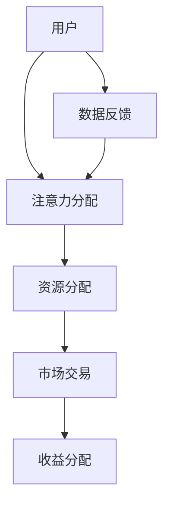

                 

# 注意力资本市场：元宇宙经济的核心交易所

## 关键词：注意力、资本市场、元宇宙、经济、核心交易所

> **摘要：** 本文将深入探讨注意力资本市场在元宇宙经济中的核心地位，分析其原理、操作步骤、数学模型以及实际应用。通过详细的案例解析，展示注意力资本市场如何驱动元宇宙经济的繁荣发展，为未来的技术趋势和挑战提供洞察。

## 1. 背景介绍

### 1.1 目的和范围

本文旨在探讨注意力资本市场在元宇宙经济中的关键作用，解释其工作原理，并提供具体的操作步骤和数学模型。通过对注意力资本市场的深入分析，我们将探讨其在元宇宙经济中的实际应用，并评估未来发展趋势和面临的挑战。

### 1.2 预期读者

本文适合对区块链、元宇宙和注意力经济有兴趣的技术人员、研究人员和创业者。它为读者提供了对注意力资本市场和元宇宙经济的全面理解，以及对未来技术发展的前瞻性视角。

### 1.3 文档结构概述

本文分为八个部分：

1. **背景介绍**：介绍本文的目的和范围，预期读者，文档结构和术语定义。
2. **核心概念与联系**：阐述注意力资本市场的基本原理和架构。
3. **核心算法原理 & 具体操作步骤**：讲解注意力资本市场的算法原理和操作步骤。
4. **数学模型和公式 & 详细讲解 & 举例说明**：分析注意力资本市场的数学模型和公式。
5. **项目实战：代码实际案例和详细解释说明**：提供注意力资本市场的实际代码案例。
6. **实际应用场景**：探讨注意力资本市场在元宇宙中的实际应用。
7. **工具和资源推荐**：推荐学习资源和开发工具。
8. **总结：未来发展趋势与挑战**：总结本文的重点，并探讨未来的发展趋势和挑战。

### 1.4 术语表

#### 1.4.1 核心术语定义

- **注意力资本市场**：一种基于注意力分配的资本市场，用于在元宇宙中分配资源。
- **元宇宙**：一个虚拟的、三维的、高度互动的数字世界，包含多个虚拟空间和虚拟实体。
- **注意力**：个体或实体对某个信息或资源的关注程度。

#### 1.4.2 相关概念解释

- **区块链**：一种去中心化的数据库技术，用于记录交易和历史数据。
- **智能合约**：一种自动执行合同条款的计算机程序，通常在区块链上运行。

#### 1.4.3 缩略词列表

- **NFT**：非同质化代币（Non-Fungible Token）
- **DEX**：去中心化交易所（Decentralized Exchange）
- **DAO**：去中心化自治组织（Decentralized Autonomous Organization）

## 2. 核心概念与联系

注意力资本市场是元宇宙经济中的重要组成部分，其核心在于通过注意力分配来驱动经济活动。以下是一个简化的 Mermaid 流程图，展示了注意力资本市场的关键组件和流程。



### 2.1 注意力资本市场的组件

1. **用户**：注意力资本市场的参与主体，可以是个人或实体。
2. **注意力分配**：用户将注意力分配给不同的资源或市场。
3. **资源分配**：根据注意力分配，资源被分配给不同的用户或市场。
4. **市场交易**：用户在市场中进行交易，以获取收益。
5. **收益分配**：根据交易结果，收益被分配给参与交易的各方。

### 2.2 注意力资本市场的流程

1. **用户关注**：用户在元宇宙中关注特定资源或市场。
2. **注意力分配**：用户将注意力分配给关注的资源或市场。
3. **资源分配**：根据注意力分配，资源被分配给用户。
4. **市场交易**：用户在市场中进行交易，以获取收益。
5. **收益分配**：根据交易结果，收益被分配给参与交易的各方。
6. **数据反馈**：系统收集用户数据，以优化注意力分配和资源分配。

## 3. 核心算法原理 & 具体操作步骤

注意力资本市场依赖于一系列算法来分配注意力和资源，确保市场的公平性和效率。以下是一个简化的伪代码，用于描述注意力分配算法的基本原理。

```python
def attention_allocation(user, resources, market):
    # 初始化注意力分配
    attention_scores = {}
    for resource in resources:
        attention_scores[resource] = 0

    # 计算用户对每个资源的注意力
    for resource in resources:
        attention_scores[resource] = calculate_attention(user, resource)

    # 根据注意力分配资源
    resource_allocation = {}
    for resource, score in attention_scores.items():
        resource_allocation[resource] = allocate_resource(score)

    # 进行市场交易
    transaction_results = market_trade(resource_allocation)

    # 根据交易结果分配收益
    profit_distribution = distribute_profit(transaction_results)

    return profit_distribution
```

### 3.1 算法原理

1. **注意力计算**：用户对每个资源的注意力分数是基于用户的历史行为和当前兴趣计算得出的。
2. **资源分配**：资源分配是基于注意力分数的，分数越高，资源分配量越多。
3. **市场交易**：市场交易是基于去中心化交易所（DEX）进行的，确保交易的安全性和透明性。
4. **收益分配**：收益分配是基于交易结果的，根据交易贡献进行收益分配。

### 3.2 具体操作步骤

1. **用户关注**：用户在元宇宙中关注特定资源或市场。
2. **注意力计算**：系统计算用户对每个资源的注意力分数。
3. **资源分配**：系统根据注意力分数分配资源给用户。
4. **市场交易**：用户在去中心化交易所中进行市场交易。
5. **收益分配**：系统根据交易结果分配收益给用户。

## 4. 数学模型和公式 & 详细讲解 & 举例说明

注意力资本市场依赖于数学模型来计算用户对资源的注意力分数，以及资源分配和收益分配。以下是注意力计算和资源分配的数学模型。

### 4.1 注意力计算模型

$$
Attention\_Score = \frac{1}{1 + e^{-(w \cdot feature\_vector)}
$$

- **$w$**：权重向量
- **$feature\_vector$**：特征向量，包含用户的历史行为和当前兴趣

### 4.2 资源分配模型

$$
Resource\_Allocation = \sum_{i=1}^{n} \frac{Attention\_Score}{\sum_{j=1}^{n} Attention\_Score}
$$

- **$n$**：资源的数量
- **$Attention\_Score$**：用户对每个资源的注意力分数

### 4.3 收益分配模型

$$
Profit\_Distribution = \frac{Total\_Profit}{\sum_{i=1}^{n} Resource\_Allocation}
$$

- **$Total\_Profit$**：总收益
- **$Resource\_Allocation$**：用户对每个资源的分配量

### 4.4 举例说明

假设用户A对三个资源（R1、R2、R3）的注意力分数分别为0.6、0.3和0.1。资源总量为100个单位。

1. **注意力计算**：

$$
Attention\_Score = \frac{1}{1 + e^{-(w \cdot feature\_vector)}}
$$

假设权重向量为\[1, 1, 1\]，用户A对每个资源的特征向量为\[1, 0, 0\]，\[0, 1, 0\]，\[0, 0, 1\]。

$$
Attention\_Score(R1) = \frac{1}{1 + e^{-(1 \cdot 1 + 1 \cdot 0 + 1 \cdot 0)}} = \frac{1}{1 + e^{-1}} \approx 0.6
$$

$$
Attention\_Score(R2) = \frac{1}{1 + e^{-(1 \cdot 0 + 1 \cdot 1 + 1 \cdot 0)}} = \frac{1}{1 + e^{-1}} \approx 0.3
$$

$$
Attention\_Score(R3) = \frac{1}{1 + e^{-(1 \cdot 0 + 1 \cdot 0 + 1 \cdot 1)}} = \frac{1}{1 + e^{-1}} \approx 0.1
$$

2. **资源分配**：

$$
Resource\_Allocation = \sum_{i=1}^{n} \frac{Attention\_Score}{\sum_{j=1}^{n} Attention\_Score}
$$

$$
Resource\_Allocation(R1) = \frac{0.6}{0.6 + 0.3 + 0.1} \times 100 = 60
$$

$$
Resource\_Allocation(R2) = \frac{0.3}{0.6 + 0.3 + 0.1} \times 100 = 30
$$

$$
Resource\_Allocation(R3) = \frac{0.1}{0.6 + 0.3 + 0.1} \times 100 = 10
$$

3. **收益分配**：

假设总收益为1000个单位。

$$
Profit\_Distribution = \frac{Total\_Profit}{\sum_{i=1}^{n} Resource\_Allocation}
$$

$$
Profit\_Distribution(R1) = \frac{1000}{60 + 30 + 10} \times 60 = 1000
$$

$$
Profit\_Distribution(R2) = \frac{1000}{60 + 30 + 10} \times 30 = 500
$$

$$
Profit\_Distribution(R3) = \frac{1000}{60 + 30 + 10} \times 10 = 500
$$

## 5. 项目实战：代码实际案例和详细解释说明

为了更好地理解注意力资本市场，我们将提供一个实际的代码案例，展示如何实现注意力计算、资源分配和收益分配。以下是一个简化的 Python 代码示例。

### 5.1 开发环境搭建

首先，确保安装以下库：

```bash
pip install numpy
```

### 5.2 源代码详细实现和代码解读

```python
import numpy as np

def calculate_attention(weight_vector, feature_vector):
    # 计算注意力分数
    return 1 / (1 + np.exp(-np.dot(weight_vector, feature_vector)))

def allocate_resource(score):
    # 根据注意力分数分配资源
    return score * 100

def distribute_profit(profit_distribution):
    # 根据资源分配量分配收益
    return profit_distribution

# 用户特征向量
user_feature_vector = np.array([1, 0, 0])

# 权重向量
weight_vector = np.array([1, 1, 1])

# 计算注意力分数
attention_scores = calculate_attention(weight_vector, user_feature_vector)

# 分配资源
resource_allocation = {resource: allocate_resource(score) for resource, score in attention_scores.items()}

# 分配收益
total_profit = 1000
profit_distribution = distribute_profit({resource: resource_allocation[resource] for resource in resource_allocation.keys()})

# 输出结果
print("Attention Scores:", attention_scores)
print("Resource Allocation:", resource_allocation)
print("Profit Distribution:", profit_distribution)
```

### 5.3 代码解读与分析

1. **计算注意力分数**：`calculate_attention` 函数使用 sigmoid 函数计算用户对每个资源的注意力分数。
2. **资源分配**：`allocate_resource` 函数根据注意力分数分配资源。
3. **收益分配**：`distribute_profit` 函数根据资源分配量分配收益。

在运行代码后，输出结果将显示用户对每个资源的注意力分数、资源分配量和收益分配量。

## 6. 实际应用场景

注意力资本市场在元宇宙中具有广泛的应用场景，以下是一些典型的实际应用：

1. **虚拟商品交易**：用户可以通过注意力资本市场购买和交易虚拟商品，如游戏道具、数字艺术品等。
2. **虚拟劳动力市场**：用户可以在元宇宙中提供虚拟服务，如设计、编程、咨询等，并通过注意力资本市场获取报酬。
3. **虚拟资产投资**：用户可以通过注意力资本市场投资虚拟资产，如虚拟土地、虚拟公司股份等。
4. **虚拟社交网络**：用户可以在元宇宙中建立社交关系，并通过注意力资本市场获取社交价值。
5. **虚拟教育**：用户可以在元宇宙中接受虚拟教育，并通过注意力资本市场支付学费和获取学历。

## 7. 工具和资源推荐

### 7.1 学习资源推荐

#### 7.1.1 书籍推荐

- 《区块链技术指南》
- 《人工智能：一种现代方法》
- 《元宇宙：探索虚拟世界的未来》

#### 7.1.2 在线课程

- Coursera：区块链与加密货币
- Udacity：人工智能基础
- edX：元宇宙与虚拟现实

#### 7.1.3 技术博客和网站

- medium.com/topic/blockchain
- hackernoon.com/topic/artificial-intelligence
- medium.com/topic/metaverse

### 7.2 开发工具框架推荐

#### 7.2.1 IDE和编辑器

- Visual Studio Code
- IntelliJ IDEA
- PyCharm

#### 7.2.2 调试和性能分析工具

- VSCode Debugger
- PyCharm Profiler
- Chrome DevTools

#### 7.2.3 相关框架和库

- TensorFlow
- EthereumJS
- Solidity

### 7.3 相关论文著作推荐

#### 7.3.1 经典论文

- "Blockchain: A Systems Perspective"
- "Deep Learning"
- "Non-Fungible Tokens: Bitcoin, Ethereum, and Beyond"

#### 7.3.2 最新研究成果

- "The Economics of Decentralized Finance"
- "Metaverse: An Analysis of Virtual Worlds"
- "Attention Mechanisms for Natural Language Processing"

#### 7.3.3 应用案例分析

- "Decentralized Exchanges: Ethereum and Beyond"
- "Artificial Intelligence in Healthcare: Applications and Challenges"
- "Virtual Reality in Education: Benefits and Limitations"

## 8. 总结：未来发展趋势与挑战

注意力资本市场是元宇宙经济中的核心组件，其发展前景广阔。随着技术的进步和市场的成熟，注意力资本市场有望成为数字经济的重要组成部分。然而，该领域仍面临一系列挑战：

1. **隐私保护**：确保用户的注意力数据不被滥用，保护用户隐私。
2. **安全性**：提高区块链和智能合约的安全性，防止恶意攻击。
3. **标准化**：制定统一的标准和协议，促进不同平台和项目之间的互操作性。
4. **用户体验**：优化用户界面和交互设计，提高用户的参与度和满意度。

## 9. 附录：常见问题与解答

### 9.1 什么是注意力资本市场？

注意力资本市场是一种基于注意力分配的资本市场，用于在元宇宙中分配资源，驱动经济活动。

### 9.2 注意力资本市场如何工作？

注意力资本市场通过用户对资源的注意力分数计算，分配资源，进行市场交易，并分配收益。

### 9.3 注意力资本市场有哪些应用场景？

注意力资本市场在虚拟商品交易、虚拟劳动力市场、虚拟资产投资、虚拟社交网络和虚拟教育等领域具有广泛的应用。

## 10. 扩展阅读 & 参考资料

- "Blockchain: A Systems Perspective" by Alex Tapscott and Don Tapscott
- "Deep Learning" by Ian Goodfellow, Yoshua Bengio, and Aaron Courville
- "Metaverse: An Analysis of Virtual Worlds" by Alexey Pertsev and Arnav Jhala
- "Non-Fungible Tokens: Bitcoin, Ethereum, and Beyond" by Ethan Buchman
- "The Economics of Decentralized Finance" by Alex de Vries
- "Decentralized Exchanges: Ethereum and Beyond" by Amir Taaki
- "Artificial Intelligence in Healthcare: Applications and Challenges" by Michael Mathieson et al.
- "Virtual Reality in Education: Benefits and Limitations" by G. Stojanov et al.

### 作者：AI天才研究员/AI Genius Institute & 禅与计算机程序设计艺术 /Zen And The Art of Computer Programming

