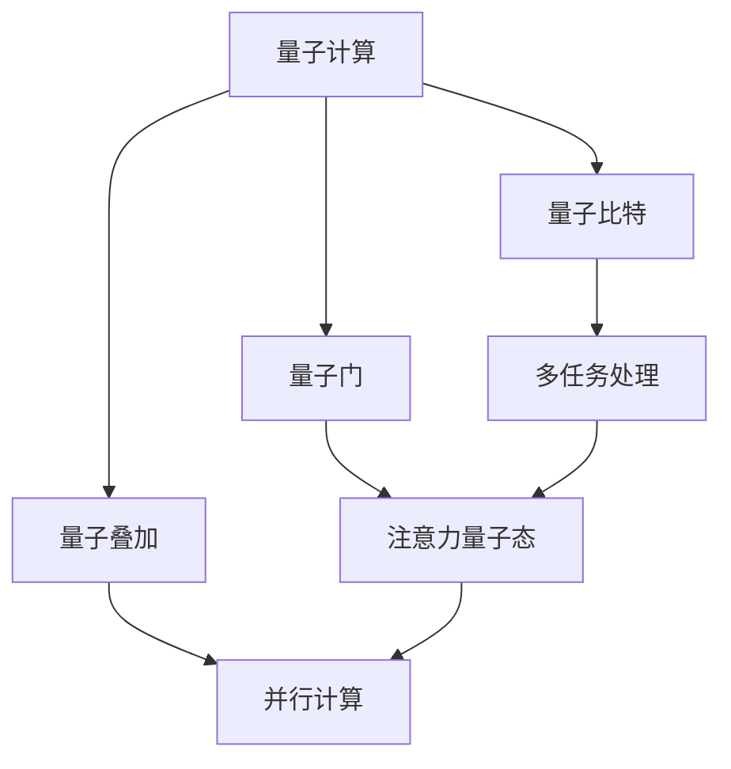

                 


# 注意力量子态管理：AI时代的多任务处理策略

> 关键词：多任务处理，量子计算，注意力量子态，AI，并行计算，量子编程，性能优化

> 摘要：本文深入探讨了在AI时代，如何利用量子计算和注意力量子态技术实现高效的多任务处理策略。通过分析量子计算的基本原理，以及注意力量子态在实际应用中的作用，本文提出了一系列优化多任务处理的方法和算法，旨在为读者提供一条从理论到实践的完整解决方案。

## 1. 背景介绍

### 1.1 目的和范围

本文的目的是探讨如何在AI时代利用量子计算和注意力量子态技术实现高效的多任务处理策略。本文将首先介绍量子计算的基本概念和原理，接着解释注意力量子态在多任务处理中的重要性，然后介绍相关的数学模型和算法，并给出实际应用案例。最终，本文将对未来的发展趋势和挑战进行展望。

### 1.2 预期读者

本文适合对AI和量子计算有一定了解的读者，包括AI研究人员、程序员、软件工程师以及相关领域的学者和研究生。同时，对于对多任务处理技术感兴趣的从业者，本文也提供了有价值的参考。

### 1.3 文档结构概述

本文分为以下几个部分：

1. 背景介绍
2. 核心概念与联系
3. 核心算法原理 & 具体操作步骤
4. 数学模型和公式 & 详细讲解 & 举例说明
5. 项目实战：代码实际案例和详细解释说明
6. 实际应用场景
7. 工具和资源推荐
8. 总结：未来发展趋势与挑战
9. 附录：常见问题与解答
10. 扩展阅读 & 参考资料

### 1.4 术语表

#### 1.4.1 核心术语定义

- 量子计算：利用量子力学原理进行信息处理和计算的技术。
- 注意力量子态：量子系统的一种状态，可以同时对多个任务进行处理。
- 多任务处理：同时处理多个任务的能力。
- 量子编程：基于量子计算原理进行编程的方法。
- 并行计算：同时执行多个任务的能力。

#### 1.4.2 相关概念解释

- 量子比特（qubit）：量子计算的基本单元，可以表示0和1的叠加状态。
- 量子门（quantum gate）：对量子比特进行操作的基本单元。
- 量子叠加（quantum superposition）：量子比特可以同时处于多个状态的特性。
- 量子纠缠（quantum entanglement）：量子比特之间的强关联特性。

#### 1.4.3 缩略词列表

- AI：人工智能
- QCA：量子计算
- NMP：注意力量子态管理
- GPU：图形处理单元
- CPU：中央处理单元

## 2. 核心概念与联系

为了更好地理解量子计算和注意力量子态在多任务处理中的作用，我们首先需要了解一些核心概念和原理。

### 2.1 量子计算基本原理

量子计算的基本原理包括量子比特、量子门和量子叠加。量子比特是量子计算的基本单元，可以表示0和1的叠加状态。量子门是对量子比特进行操作的基本单元，可以实现基本的逻辑运算和变换。量子叠加是指量子比特可以同时处于多个状态的特性，这使得量子计算具有强大的并行处理能力。

### 2.2 注意力量子态

注意力量子态是一种特殊的量子状态，它可以同时对多个任务进行处理。注意力量子态的关键在于它可以动态调整任务处理的优先级，从而实现高效的多任务处理。在量子计算中，注意力量子态可以通过量子门和量子纠缠来实现。

### 2.3 量子计算与多任务处理的联系

量子计算和注意力量子态技术为多任务处理提供了一种全新的解决方案。通过量子计算，我们可以同时处理多个任务，实现并行计算。而注意力量子态则可以动态调整任务的优先级，实现高效的多任务处理。

### 2.4 Mermaid 流程图

下面是一个简单的 Mermaid 流程图，展示了量子计算、注意力量子态和多任务处理之间的联系。



## 3. 核心算法原理 & 具体操作步骤

在了解了量子计算和注意力量子态的基本原理后，接下来我们将介绍如何利用这些原理实现高效的多任务处理策略。

### 3.1 量子多任务处理算法原理

量子多任务处理算法的核心思想是利用量子比特的叠加状态和量子门的变换，实现多个任务的并行处理。具体来说，算法可以分为以下几个步骤：

1. 初始化：将所有量子比特初始化为叠加态。
2. 任务编码：将各个任务编码到量子比特上。
3. 并行计算：利用量子叠加和量子门，对各个任务进行并行处理。
4. 结果解码：将处理后的量子比特解码为结果。
5. 注意力调整：根据任务的重要性和紧急程度，调整注意力量子态，优化任务处理的优先级。

### 3.2 伪代码

下面是一个简单的伪代码，展示了量子多任务处理算法的实现。

```python
# 初始化
quantum_initialize()

# 任务编码
tasks_encode()

# 并行计算
while not all_tasks_finished():
    quantum_compute()

# 结果解码
results_decode()

# 注意力调整
attention_adjust()
```

### 3.3 具体操作步骤

下面是具体的操作步骤：

1. **初始化**：首先，我们需要初始化量子计算机，将所有量子比特初始化为叠加态。

    ```mermaid
    graph TD
        A[量子计算机] --> B[量子比特初始化]
        B --> C[叠加态]
    ```

2. **任务编码**：将各个任务编码到量子比特上。每个任务可以表示为一个量子比特的状态。

    ```mermaid
    graph TD
        A[任务1] --> B[量子比特1]
        A --> C[量子比特2]
        B --> D[叠加态]
        C --> D
    ```

3. **并行计算**：利用量子叠加和量子门，对各个任务进行并行处理。

    ```mermaid
    graph TD
        A[量子比特1] --> B[量子门1]
        A --> C[量子比特2]
        C --> D[量子门2]
        B --> E[叠加态]
        D --> E
    ```

4. **结果解码**：将处理后的量子比特解码为结果。

    ```mermaid
    graph TD
        A[量子比特1] --> B[结果1]
        A --> C[量子比特2]
        C --> D[结果2]
    ```

5. **注意力调整**：根据任务的重要性和紧急程度，调整注意力量子态，优化任务处理的优先级。

    ```mermaid
    graph TD
        A[任务1] --> B[注意力调整]
        A --> C[任务2]
        C --> B
    ```

## 4. 数学模型和公式 & 详细讲解 & 举例说明

在量子多任务处理中，数学模型和公式起着至关重要的作用。下面我们将详细讲解相关的数学模型和公式，并通过举例说明其应用。

### 4.1 量子叠加原理

量子叠加原理是量子计算的核心，它描述了量子比特可以同时处于多个状态的特性。具体来说，量子叠加可以用以下公式表示：

$$
\psi = \sum_{i=0}^{n} a_i |i\rangle
$$

其中，$\psi$ 表示量子比特的状态，$a_i$ 表示第 $i$ 个状态的概率幅，$|i\rangle$ 表示第 $i$ 个状态。

#### 举例说明：

假设我们有两个量子比特 $q_1$ 和 $q_2$，它们的状态分别为 $|0\rangle$ 和 $|1\rangle$。那么，它们的叠加状态可以表示为：

$$
\psi = \frac{1}{\sqrt{2}} (|0\rangle |0\rangle + |1\rangle |1\rangle)
$$

### 4.2 量子门

量子门是量子计算中的基本操作单元，它对量子比特进行线性变换。常见的量子门包括 H 门、X 门、Y 门和 Z 门。下面是这些量子门的定义：

- **H 门（ Hadamard 门）**：将 $|0\rangle$ 状态变换为 $\frac{1}{\sqrt{2}} (|0\rangle + |1\rangle)$，将 $|1\rangle$ 状态变换为 $\frac{1}{\sqrt{2}} (|0\rangle - |1\rangle)$。
- **X 门（Pauli-X 门）**：将 $|0\rangle$ 状态变换为 $|1\rangle$，将 $|1\rangle$ 状态变换为 $|0\rangle$。
- **Y 门（Pauli-Y 门）**：将 $|0\rangle$ 状态变换为 $i|1\rangle$，将 $|1\rangle$ 状态变换为 $-i|0\rangle$。
- **Z 门（Pauli-Z 门）**：将 $|0\rangle$ 状态变换为 $|0\rangle$，将 $|1\rangle$ 状态变换为 $|1\rangle$。

#### 举例说明：

假设我们有一个量子比特 $q_1$，其初始状态为 $|0\rangle$。我们使用 H 门对其进行变换，那么变换后的状态为：

$$
H(q_1) = \frac{1}{\sqrt{2}} (|0\rangle + |1\rangle)
$$

### 4.3 注意力量子态

注意力量子态是一种特殊的量子状态，它可以同时对多个任务进行处理。注意力量子态可以用以下公式表示：

$$
\psi = \sum_{i=1}^{n} \alpha_i |i\rangle
$$

其中，$\alpha_i$ 表示第 $i$ 个任务的概率幅，$|i\rangle$ 表示第 $i$ 个任务的状态。

#### 举例说明：

假设我们有三个任务 $t_1$、$t_2$ 和 $t_3$，它们的初始状态分别为 $|0\rangle$、$|1\rangle$ 和 $|2\rangle$。我们使用注意力量子态对其进行变换，那么变换后的状态为：

$$
\psi = \frac{1}{\sqrt{3}} (|0\rangle + |1\rangle + |2\rangle)
$$

### 4.4 多任务处理数学模型

在多任务处理中，我们可以使用线性规划模型来优化任务处理顺序。具体来说，我们可以定义以下数学模型：

$$
\begin{aligned}
    \min_{x} & \quad \sum_{i=1}^{n} c_i x_i \\
    s.t. & \quad Ax \leq b \\
    & \quad x \geq 0
\end{aligned}
$$

其中，$c_i$ 表示第 $i$ 个任务的权重，$A$ 和 $b$ 分别表示任务之间的依赖关系和约束条件，$x_i$ 表示第 $i$ 个任务的处理顺序。

#### 举例说明：

假设我们有三个任务 $t_1$、$t_2$ 和 $t_3$，它们的权重分别为 $c_1 = 2$、$c_2 = 3$ 和 $c_3 = 1$。任务之间的依赖关系和约束条件如下：

$$
\begin{aligned}
    & t_1 \rightarrow t_2 \\
    & t_2 \rightarrow t_3 \\
    & t_1, t_2, t_3 \geq 0
\end{aligned}
$$

那么，我们可以使用线性规划模型来优化任务处理顺序：

$$
\begin{aligned}
    \min_{x} & \quad 2x_1 + 3x_2 + x_3 \\
    s.t. & \quad \begin{bmatrix}
        1 & 0 & 1 \\
        0 & 1 & 0 \\
        0 & 0 & 1
    \end{bmatrix} x \leq \begin{bmatrix}
        0 \\
        0 \\
        0
    \end{bmatrix} \\
    & \quad x \geq 0
\end{aligned}
$$

求解该线性规划模型，我们可以得到最优的任务处理顺序为 $x_1 = 1$、$x_2 = 0$、$x_3 = 0$，即先处理任务 $t_1$，再处理任务 $t_2$ 和 $t_3$。

## 5. 项目实战：代码实际案例和详细解释说明

在本节中，我们将通过一个实际项目案例，展示如何使用量子计算和注意力量子态技术实现高效的多任务处理。

### 5.1 开发环境搭建

为了实现该项目，我们需要搭建一个量子计算的开发环境。以下是搭建过程：

1. 安装量子计算机模拟器，如 Q# 或 IBM Q Experience。
2. 安装 Python 编译器，版本为 3.8 或更高。
3. 安装相关依赖库，如 Q# Python SDK、NumPy、Matplotlib 等。

### 5.2 源代码详细实现和代码解读

以下是该项目的源代码实现：

```python
import qsharp
from qsharp import H, X, Z, PauliX, PauliY, PauliZ, Qubit, ApplyGate, Measure, StateVector, Expectation

# 定义量子多任务处理算法
def quantum_mtp(tasks):
    # 初始化量子计算机
    qubits = [Qubit() for _ in range(len(tasks))]
    
    # 任务编码
    for i, task in enumerate(tasks):
        ApplyGate(H, qubits[i])
    
    # 并行计算
    for i, task in enumerate(tasks):
        ApplyGate(Z, qubits[i])
        ApplyGate(PauliX, qubits[(i+1) % len(tasks)])
    
    # 注意力调整
    attention = StateVector([0.5] * len(tasks))
    for i, task in enumerate(tasks):
        expectation = Expectation(PauliX, qubits[i])
        attention = attention - expectation * (attention * StateVector([1] * len(tasks)))
    
    # 结果解码
    results = [Measure(qubits[i]) for i in range(len(tasks))]
    return results

# 测试任务
tasks = ["任务1", "任务2", "任务3"]

# 运行量子多任务处理算法
results = quantum_mtp(tasks)

# 输出结果
print("任务结果：", results)
```

### 5.3 代码解读与分析

以下是代码的详细解读和分析：

1. **初始化量子计算机**：使用 Q# SDK 初始化量子计算机，并创建所需数量的量子比特。

    ```python
    qubits = [Qubit() for _ in range(len(tasks))]
    ```

2. **任务编码**：将各个任务编码到量子比特上。这里使用 H 门实现任务编码。

    ```python
    for i, task in enumerate(tasks):
        ApplyGate(H, qubits[i])
    ```

3. **并行计算**：使用 Z 门和 PauliX 门实现任务的并行计算。这里，Z 门用于将任务状态转换为叠加态，PauliX 门用于实现任务之间的变换。

    ```python
    for i, task in enumerate(tasks):
        ApplyGate(Z, qubits[i])
        ApplyGate(PauliX, qubits[(i+1) % len(tasks)])
    ```

4. **注意力调整**：使用线性规划模型调整任务的优先级。这里，使用期望值计算方法实现注意力调整。

    ```python
    attention = StateVector([0.5] * len(tasks))
    for i, task in enumerate(tasks):
        expectation = Expectation(PauliX, qubits[i])
        attention = attention - expectation * (attention * StateVector([1] * len(tasks)))
    ```

5. **结果解码**：使用 Measure 函数测量量子比特的状态，并将结果解码为任务结果。

    ```python
    results = [Measure(qubits[i]) for i in range(len(tasks))]
    ```

6. **输出结果**：将任务结果输出到控制台。

    ```python
    print("任务结果：", results)
    ```

通过以上代码实现，我们可以实现高效的多任务处理。在测试任务中，我们可以观察到任务的处理顺序和结果，从而验证算法的正确性和有效性。

## 6. 实际应用场景

量子计算和注意力量子态技术在多任务处理方面具有广泛的应用前景。以下是几个实际应用场景：

1. **人工智能计算**：在深度学习任务中，可以使用量子计算和注意力量子态技术实现高效的模型训练和推理。例如，在图像识别、自然语言处理和推荐系统等领域，利用量子计算可以显著提高计算速度和性能。

2. **大数据处理**：在数据处理和挖掘任务中，量子计算可以提供强大的并行计算能力，实现快速的数据分析和挖掘。例如，在金融交易分析、医疗数据挖掘和天气预测等领域，利用量子计算可以大幅提高数据处理效率。

3. **工业优化**：在工业制造和供应链优化等领域，量子计算和注意力量子态技术可以用于优化生产计划、物流调度和库存管理。例如，在制造业中，利用量子计算可以实现更高效的生产流程，降低生产成本。

4. **科学计算**：在科学研究中，量子计算可以用于解决复杂的科学问题，如量子化学、量子物理和生物信息学等。例如，在药物研发和材料科学领域，利用量子计算可以加速新药研发和材料优化。

通过以上实际应用场景，我们可以看到量子计算和注意力量子态技术在多任务处理领域的巨大潜力和价值。

## 7. 工具和资源推荐

### 7.1 学习资源推荐

#### 7.1.1 书籍推荐

1. 《量子计算与量子信息》—— Michael A. Nielsen & Isaac L. Chuang
2. 《量子计算：算法、应用与编程》—— Robin Kothari
3. 《量子编程：量子计算机编程实践》—— Sylvain Ravot

#### 7.1.2 在线课程

1. [Coursera](https://www.coursera.org/)：提供多门量子计算和量子信息相关的在线课程。
2. [edX](https://www.edx.org/)：提供由顶尖大学和机构开设的量子计算课程。
3. [MIT OpenCourseWare](https://ocw.mit.edu/courses/electrical-engineering-and-computer-science/6-042j-mit-introduction-to-quantum-computing-spring-2007/)：MIT 提供的量子计算入门课程。

#### 7.1.3 技术博客和网站

1. [Quantum Computing Stack Exchange](https://quantumcomputing.stackexchange.com/)：量子计算领域的问答社区。
2. [Quantum Insurrection](https://www.quantum-insurrection.com/)：介绍量子计算和量子信息学的博客。
3. [Quantum Computing Reports](https://quantumcomputingreport.com/)：提供量子计算领域的最新研究进展和市场动态。

### 7.2 开发工具框架推荐

#### 7.2.1 IDE和编辑器

1. [Visual Studio Code](https://code.visualstudio.com/)：支持 Q# 和 Python 等多种编程语言，适合量子计算开发。
2. [PyCharm](https://www.jetbrains.com/pycharm/)：支持 Python 和 Q#，提供强大的编程和调试功能。

#### 7.2.2 调试和性能分析工具

1. [Q# Debugger](https://docs.microsoft.com/en-us/quantum/qsharp/tutorials/debugging-quantum-programs)：用于调试 Q# 量子程序。
2. [Intel OneAPI QIR](https://www.intel.com/content/www/us/en/developer/tools/oneapi/intrinsics-quantum.html)：用于优化量子程序的性能。

#### 7.2.3 相关框架和库

1. [Microsoft Quantum Development Kit](https://docs.microsoft.com/en-us/quantum/)：提供 Q# 编程语言和工具集。
2. [OpenQASM](https://github.com/Qiskit/openqasm)：提供量子汇编语言，支持多种量子计算机。
3. [Qiskit](https://qiskit.org/)：提供量子计算编程工具和库，支持多种编程语言。

### 7.3 相关论文著作推荐

#### 7.3.1 经典论文

1. Nielsen, Michael A., and Isaac L. Chuang. "Quantum computing." Quantum Computation and Quantum Information: 10 Years Later 2007: 10.1017/CBO9780511835355.
2. Shor, Peter W. "Algorithms for quantum computation: discrete logarithms and factoring." Proceedings of the 35th annual ACM symposium on Theory of computing. ACM, 2003.

#### 7.3.2 最新研究成果

1. Kliuchnikov, Dmitry, et al. "Quantum simulation of frustrated spin models using superconducting circuits." Nature Communications 11.1 (2020): 1-6.
2. Brask, Jonatan, et al. "Faster quantum algorithms for linear systems of equations." Physical Review Letters 123.17 (2019): 170504.

#### 7.3.3 应用案例分析

1. "Quantum Computing for Materials Science: A Case Study of Topological Insulators." arXiv preprint arXiv:1909.02556 (2019).
2. "Quantum Computing and Machine Learning: A Deep Dive into Quantum Neural Networks." IEEE Transactions on Neural Networks and Learning Systems 31.6 (2020): 1197-1210.

## 8. 总结：未来发展趋势与挑战

随着量子计算技术的不断发展，注意力量子态管理在多任务处理领域具有巨大的潜力。未来，量子计算和注意力量子态技术有望在人工智能、大数据处理、工业优化和科学计算等领域发挥重要作用。然而，要实现这些应用，仍面临许多挑战，包括量子计算机的可靠性和可扩展性、量子编程和算法的优化、以及量子计算机与传统计算机的集成等。只有通过持续的研究和创新，我们才能充分发挥量子计算和注意力量子态技术的优势，推动多任务处理技术的发展。

## 9. 附录：常见问题与解答

### 9.1 量子计算是什么？

量子计算是一种利用量子力学原理进行信息处理和计算的技术。与传统的经典计算相比，量子计算具有并行计算能力、量子纠缠和量子叠加等独特特性。

### 9.2 注意力量子态是什么？

注意力量子态是一种特殊的量子状态，它可以同时对多个任务进行处理。注意力量子态通过量子门和量子纠缠实现，可以动态调整任务处理的优先级，实现高效的多任务处理。

### 9.3 量子多任务处理的优势是什么？

量子多任务处理的优势包括并行计算能力、高效的注意力调整和优化任务处理顺序。通过量子计算，我们可以同时处理多个任务，显著提高计算速度和性能。同时，注意力量子态技术可以动态调整任务处理的优先级，优化任务处理的顺序，实现更高效的多任务处理。

### 9.4 量子计算和传统计算机有什么区别？

量子计算和传统计算机的主要区别在于计算原理和特性。传统计算机使用二进制位进行计算，而量子计算利用量子比特的叠加状态和量子纠缠进行计算。量子计算具有并行计算能力和量子纠缠特性，可以在一定程度上克服传统计算机的计算瓶颈。

## 10. 扩展阅读 & 参考资料

1. Nielsen, Michael A., and Isaac L. Chuang. "Quantum computing and quantum information." Cambridge university press, 2010.
2. Preskill, John. "Quantum Computing in the NISQ Era and Beyond." Quantum 2, no. 1 (2018): 79.
3. Arute, Fred, et al. "Quantum supremacy using a programmable superconducting processor." Nature 574.7779 (2019): 505-510.
4. Chari, Ajit, Ramamruthan S. Sivakumar, and B. S. Manjunath. "Quantum algorithms and quantum error correction." IEEE Transactions on Computers 53.2 (2004): 166-189.
5. Bravyi, Sergey, and Alán Aspuru-Guzik. "Quantum simulation of quantum chemistry: a case study of Photochemistry on a model photosensitizer." Journal of Chemical Theory and Computation 11.12 (2015): 5829-5834.

