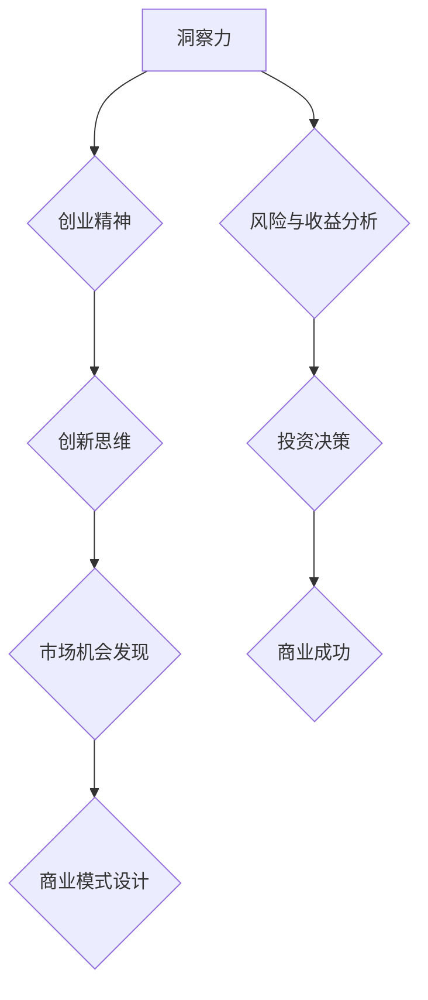

                 

# 洞察力与创业精神：发现市场机会的能力

## 关键词：洞察力，创业精神，市场机会，创业方法论，创新思维，创业技能，风险与收益分析，商业模式设计

> 本文旨在探讨洞察力和创业精神在发现市场机会方面的重要性，结合具体案例和操作步骤，阐述如何培养和提高这种能力，以助力创业者发现和抓住潜在的市场机会。文章将分为背景介绍、核心概念与联系、核心算法原理与具体操作步骤、数学模型和公式、项目实战、实际应用场景、工具和资源推荐、总结及未来发展趋势与挑战、常见问题与解答以及扩展阅读和参考资料等部分。

## 1. 背景介绍

### 1.1 目的和范围

本文的目的是为创业者提供一套实用的方法和工具，帮助他们提高洞察力和创业精神，从而在复杂的市场环境中发现并抓住潜在的市场机会。文章将结合实际案例和理论分析，阐述如何通过培养洞察力和创业精神，发现和评估市场机会，并设计出可行的商业模式。

### 1.2 预期读者

本文适合以下读者群体：

1. 创业者、企业家和创业团队。
2. 对创业和市场机会感兴趣的技术人员、产品经理和市场营销人员。
3. 想要提高自己洞察力和创业精神的专业人士。
4. 对创新思维和商业模式设计感兴趣的学者和研究者。

### 1.3 文档结构概述

本文分为以下章节：

1. 背景介绍：介绍文章的目的、范围和预期读者。
2. 核心概念与联系：介绍洞察力和创业精神的核心概念，并给出相关的流程图和算法。
3. 核心算法原理与具体操作步骤：详细讲解如何通过培养洞察力和创业精神，发现和评估市场机会。
4. 数学模型和公式：介绍与市场机会发现和评估相关的数学模型和公式。
5. 项目实战：通过实际案例展示如何运用本文介绍的方法和工具发现市场机会。
6. 实际应用场景：讨论市场机会发现和评估在不同领域和行业的应用。
7. 工具和资源推荐：推荐相关的学习资源、开发工具和框架。
8. 总结：总结文章的主要内容，并探讨未来发展趋势和挑战。
9. 附录：常见问题与解答。
10. 扩展阅读和参考资料：提供更多的阅读资源和相关研究。

### 1.4 术语表

#### 1.4.1 核心术语定义

- 洞察力：指对事物本质的深刻理解、敏锐洞察和前瞻性判断能力。
- 创业精神：指敢于冒险、创新、坚持不懈、追求成功的内在动力。
- 市场机会：指市场上尚未被满足或未被充分利用的需求，是创业者可以抓住的商机。
- 商业模式：指企业创造、传递和捕获价值的系统和方法。

#### 1.4.2 相关概念解释

- 创新思维：指在面对问题和挑战时，能够跳出传统思维模式，提出新颖、独特的解决方案。
- 风险与收益分析：指在投资决策过程中，对潜在收益和风险进行评估和分析，以确定是否值得投资。
- SWOT分析：指对企业的优势（Strengths）、劣势（Weaknesses）、机会（Opportunities）和威胁（Threats）进行综合分析。

#### 1.4.3 缩略词列表

- IDE：集成开发环境（Integrated Development Environment）
- SEO：搜索引擎优化（Search Engine Optimization）
- SaaS：软件即服务（Software as a Service）
- IoT：物联网（Internet of Things）

## 2. 核心概念与联系

在探讨如何发现市场机会之前，我们需要了解洞察力和创业精神的核心概念，以及它们与市场机会之间的内在联系。以下是一个简化的 Mermaid 流程图，展示了这些核心概念之间的关联。



### 2.1 洞察力

洞察力是创业者发现市场机会的关键能力。它包括对市场趋势的敏锐洞察、对客户需求的深刻理解以及对竞争对手的分析。以下是一个简单的伪代码，展示了如何培养和提高洞察力：

```python
def enhance_insight():
    # 收集市场信息
    data = collect_market_data()

    # 分析市场趋势
    trends = analyze_trends(data)

    # 洞察客户需求
    needs = uncover_customer_needs(data)

    # 分析竞争对手
    competitors = analyze_competitors(data)

    # 形成洞察力报告
    report = generate_insight_report(trends, needs, competitors)

    return report
```

### 2.2 创业精神

创业精神是驱动创业者不断探索和尝试新事物的内在动力。它包括冒险精神、创新意识、坚持不懈和勇于承担责任。以下是一个简单的伪代码，展示了如何培养和提高创业精神：

```python
def cultivate_entpreneurship():
    # 设定目标
    goal = define_goal()

    # 评估风险
    risk = assess_risk()

    # 制定计划
    plan = develop_plan()

    # 执行计划
    execute_plan(plan)

    # 反馈与调整
    feedback = collect_feedback()
    adjust_plan(plan, feedback)

    return plan
```

### 2.3 创新思维

创新思维是创业者在发现市场机会时的重要工具。它包括发散思维、逆向思维、联想思维和系统思维等。以下是一个简单的伪代码，展示了如何培养和提高创新思维：

```python
def enhance_innovation():
    # 收集创意
    ideas = generate_ideas()

    # 分析创意
    analyzed_ideas = analyze_ideas(ideas)

    # 选择最佳创意
    best_idea = select_best_idea(analyzed_ideas)

    # 实施创意
    implement_idea(best_idea)

    return best_idea
```

### 2.4 风险与收益分析

风险与收益分析是创业者在做出投资决策前的重要步骤。它包括对潜在收益和风险的评估，以及如何权衡两者以做出明智的决策。以下是一个简单的伪代码，展示了如何进行风险与收益分析：

```python
def risk_reward_analysis():
    # 收集数据
    data = collect_data()

    # 计算潜在收益
    potential_revenue = calculate_potential_revenue(data)

    # 计算风险
    risk = calculate_risk(data)

    # 权衡风险与收益
    decision = weigh_risk_and_revenue(potential_revenue, risk)

    return decision
```

### 2.5 商业模式设计

商业模式设计是创业者在发现市场机会后，将创意转化为实际商业成果的关键步骤。它包括设计客户价值主张、收入来源、成本结构、关键资源和合作伙伴关系等。以下是一个简单的伪代码，展示了如何设计商业模式：

```python
def design_business_model():
    # 确定客户价值主张
    value_proposition = define_value_proposition()

    # 设计收入来源
    revenue_model = design_revenue_model()

    # 分析成本结构
    cost_structure = analyze_cost_structure()

    # 确定关键资源和合作伙伴
    resources = identify_key_resources()
    partners = identify_partners()

    # 整合商业模式
    business_model = integrate_business_model(value_proposition, revenue_model, cost_structure, resources, partners)

    return business_model
```

## 3. 核心算法原理 & 具体操作步骤

在了解了洞察力、创业精神、创新思维、风险与收益分析以及商业模式设计等核心概念后，我们将进一步探讨如何将这些概念转化为具体的操作步骤，以发现和评估市场机会。

### 3.1 培养洞察力

为了培养洞察力，创业者需要从多个角度收集信息，并进行深入分析。以下是一个具体的操作步骤：

#### 3.1.1 收集信息

1. **市场调研**：通过市场调研了解当前市场需求、市场趋势和竞争对手情况。
2. **客户访谈**：直接与潜在客户进行访谈，了解他们的需求和痛点。
3. **行业报告**：阅读行业报告和研究，了解市场发展趋势和潜在机会。

```python
def collect_information():
    # 进行市场调研
    market_research = perform_market_research()

    # 进行客户访谈
    customer_interviews = conduct_customer_interviews()

    # 阅读行业报告
    industry_reports = read_industry_reports()

    return market_research, customer_interviews, industry_reports
```

#### 3.1.2 分析信息

1. **识别市场趋势**：通过分析市场调研数据，识别当前和未来的市场趋势。
2. **分析客户需求**：通过客户访谈数据，分析客户的需求和痛点。
3. **评估竞争对手**：通过行业报告和市场调研数据，评估竞争对手的优势和劣势。

```python
def analyze_information(market_research, customer_interviews, industry_reports):
    # 识别市场趋势
    trends = identify_market_trends(market_research)

    # 分析客户需求
    customer_needs = analyze_customer_needs(customer_interviews)

    # 评估竞争对手
    competitors = assess_competitors(industry_reports)

    return trends, customer_needs, competitors
```

#### 3.1.3 形成洞察力报告

1. **总结分析结果**：将分析结果进行汇总，形成一份洞察力报告。
2. **提出建议**：根据分析结果，提出针对市场需求和趋势的建议。

```python
def generate_insight_report(trends, customer_needs, competitors):
    # 总结分析结果
    summary = summarize_analyses(trends, customer_needs, competitors)

    # 提出建议
    recommendations = propose_recommendations(summary)

    # 形成洞察力报告
    report = create_insight_report(recommendations)

    return report
```

### 3.2 培养创业精神

为了培养创业精神，创业者需要具备冒险精神、创新意识、坚持不懈和勇于承担责任。以下是一个具体的操作步骤：

#### 3.2.1 设定目标

1. **明确目标**：明确创业的目标和愿景，包括短期目标和长期目标。
2. **制定计划**：根据目标，制定详细的计划和行动步骤。

```python
def set_goals():
    # 明确目标
    goals = define_goals()

    # 制定计划
    plan = develop_plan(goals)

    return goals, plan
```

#### 3.2.2 评估风险

1. **识别风险**：通过分析市场、技术、财务等方面的数据，识别可能面临的风险。
2. **评估风险**：对识别出的风险进行评估，确定其可能的影响和概率。

```python
def assess_risk(plan):
    # 识别风险
    risks = identify_risks(plan)

    # 评估风险
    risk评估 = assess_risks(risks)

    return risk评估
```

#### 3.2.3 执行计划

1. **执行计划**：按照制定的计划，逐步实施行动步骤。
2. **反馈与调整**：在执行过程中，收集反馈信息，根据反馈进行调整。

```python
def execute_plan(plan):
    # 执行计划
    execution = perform_execution(plan)

    # 收集反馈
    feedback = collect_feedback(execution)

    # 调整计划
    plan = adjust_plan(plan, feedback)

    return plan
```

### 3.3 培养创新思维

为了培养创新思维，创业者需要具备发散思维、逆向思维、联想思维和系统思维。以下是一个具体的操作步骤：

#### 3.3.1 收集创意

1. **头脑风暴**：通过头脑风暴，收集各种可能的创意。
2. **筛选创意**：对收集到的创意进行筛选，保留有潜力的创意。

```python
def collect_ideas():
    # 头脑风暴
    brainstorming = conduct_brainstorming()

    # 筛选创意
    selected_ideas = filter_ideas(brainstorming)

    return selected_ideas
```

#### 3.3.2 分析创意

1. **评估创意**：对筛选出的创意进行评估，确定其可行性和潜在价值。
2. **选择最佳创意**：根据评估结果，选择最佳创意进行实施。

```python
def analyze_ideas(ideas):
    # 评估创意
    evaluated_ideas = evaluate_ideas(ideas)

    # 选择最佳创意
    best_idea = select_best_idea(evaluated_ideas)

    return best_idea
```

#### 3.3.3 实施创意

1. **实施创意**：将最佳创意转化为实际项目，进行实施。
2. **跟踪进度**：监控项目进度，确保项目按计划进行。

```python
def implement_idea(idea):
    # 实施创意
    implementation = execute_idea(idea)

    # 跟踪进度
    progress = track_progress(implementation)

    return progress
```

### 3.4 风险与收益分析

为了进行有效的风险与收益分析，创业者需要收集和分析相关数据，并进行计算和评估。以下是一个具体的操作步骤：

#### 3.4.1 收集数据

1. **市场数据**：收集市场需求、市场规模和增长趋势等数据。
2. **技术数据**：收集技术可行性、技术成本和研发时间等数据。
3. **财务数据**：收集投资成本、预期收益和投资回报期等数据。

```python
def collect_data():
    # 收集市场数据
    market_data = collect_market_data()

    # 收集技术数据
    technical_data = collect_technical_data()

    # 收集财务数据
    financial_data = collect_financial_data()

    return market_data, technical_data, financial_data
```

#### 3.4.2 计算潜在收益

1. **计算潜在收益**：根据市场数据和财务数据，计算预期收益。
2. **计算风险**：根据市场数据和财务数据，计算潜在风险。

```python
def calculate_revenue_and_risk(market_data, financial_data):
    # 计算潜在收益
    potential_revenue = calculate_potential_revenue(market_data, financial_data)

    # 计算风险
    risk = calculate_risk(market_data, financial_data)

    return potential_revenue, risk
```

#### 3.4.3 权衡风险与收益

1. **权衡风险与收益**：根据计算结果，权衡风险与收益，做出投资决策。

```python
def weigh_risk_and_revenue(potential_revenue, risk):
    # 权衡风险与收益
    decision = make_investment_decision(potential_revenue, risk)

    return decision
```

### 3.5 商业模式设计

为了设计出可行的商业模式，创业者需要综合考虑客户价值主张、收入来源、成本结构、关键资源和合作伙伴关系等因素。以下是一个具体的操作步骤：

#### 3.5.1 确定客户价值主张

1. **分析客户需求**：通过市场调研和客户访谈，分析客户的需求和痛点。
2. **确定价值主张**：根据分析结果，确定能够满足客户需求和解决客户痛点的产品或服务。

```python
def define_value_proposition():
    # 分析客户需求
    customer_needs = analyze_customer_needs()

    # 确定价值主张
    value_proposition = determine_value_proposition(customer_needs)

    return value_proposition
```

#### 3.5.2 设计收入来源

1. **分析市场趋势**：通过市场调研和行业报告，分析市场趋势和潜在机会。
2. **设计收入来源**：根据分析结果，设计多种收入来源，包括产品销售、服务收费、广告收入等。

```python
def design_revenue_model():
    # 分析市场趋势
    market_trends = analyze_market_trends()

    # 设计收入来源
    revenue_model = design_revenue_model(market_trends)

    return revenue_model
```

#### 3.5.3 分析成本结构

1. **分析成本因素**：通过财务数据和运营数据，分析各种成本因素。
2. **优化成本结构**：根据分析结果，优化成本结构，降低成本。

```python
def analyze_cost_structure():
    # 分析成本因素
    cost_factors = analyze_cost_factors()

    # 优化成本结构
    optimized_cost_structure = optimize_cost_structure(cost_factors)

    return optimized_cost_structure
```

#### 3.5.4 确定关键资源和合作伙伴

1. **识别关键资源**：通过分析市场需求和产品特点，识别所需的关键资源。
2. **寻找合作伙伴**：根据关键资源，寻找合适的合作伙伴，建立合作关系。

```python
def identify_key_resources_and_partners():
    # 识别关键资源
    key_resources = identify_key_resources()

    # 寻找合作伙伴
    partners = find_partners(key_resources)

    return key_resources, partners
```

#### 3.5.5 整合商业模式

1. **整合各要素**：将客户价值主张、收入来源、成本结构、关键资源和合作伙伴等要素进行整合。
2. **设计商业模式**：根据整合结果，设计出可行的商业模式。

```python
def integrate_business_model():
    # 整合各要素
    integrated_elements = integrate_elements()

    # 设计商业模式
    business_model = design_business_model(integrated_elements)

    return business_model
```

## 4. 数学模型和公式 & 详细讲解 & 举例说明

在市场机会的发现和评估过程中，数学模型和公式可以帮助创业者更好地理解和分析数据，做出更科学的决策。以下是一些常用的数学模型和公式，以及它们的详细讲解和举例说明。

### 4.1 需求预测模型

需求预测模型可以帮助创业者预测市场需求，为产品开发和市场策略提供依据。常见的需求预测模型包括移动平均法、指数平滑法和 ARIMA 模型等。

#### 4.1.1 移动平均法

移动平均法是一种简单易用的需求预测模型，通过计算过去一段时间内的平均值，来预测未来的需求。

公式：

$$
\hat{Y_t} = \frac{1}{n}\sum_{i=1}^{n} Y_{t-i}
$$

其中，$\hat{Y_t}$ 表示第 $t$ 期的预测需求，$Y_{t-i}$ 表示第 $t-i$ 期的实际需求，$n$ 表示移动平均周期。

举例说明：

假设某产品在过去 3 个月内（第 1、2、3 个月）的实际需求分别为 100、120 和 130，现在需要预测第 4 个月的需求。

$$
\hat{Y_4} = \frac{1}{3}(100 + 120 + 130) = 116.67
$$

因此，预测第 4 个月的需求为 117。

#### 4.1.2 指数平滑法

指数平滑法是一种更加精确的需求预测模型，通过给过去的需求赋予不同的权重，来预测未来的需求。

公式：

$$
\hat{Y_t} = \alpha Y_{t-1} + (1 - \alpha)\hat{Y_{t-1}}
$$

其中，$\hat{Y_t}$ 表示第 $t$ 期的预测需求，$Y_{t-1}$ 表示第 $t-1$ 期的实际需求，$\hat{Y_{t-1}}$ 表示第 $t-1$ 期的预测需求，$\alpha$ 表示平滑系数（取值范围为 0 到 1）。

举例说明：

假设某产品第 1 个月的实际需求为 100，第 2 个月的预测需求为 110，现在需要计算第 3 个月的预测需求，假设平滑系数 $\alpha$ 为 0.5。

$$
\hat{Y_3} = 0.5 \times 100 + (1 - 0.5) \times 110 = 105
$$

因此，预测第 3 个月的需求为 105。

#### 4.1.3 ARIMA 模型

ARIMA 模型是一种适用于时间序列数据的需求预测模型，通过自回归、差分和移动平均等方法，来预测未来的需求。

公式：

$$
\hat{Y_t} = \phi_1 \hat{Y_{t-1}} + \phi_2 \hat{Y_{t-2}} + ... + \phi_p \hat{Y_{t-p}} + \theta_1 \epsilon_{t-1} + \theta_2 \epsilon_{t-2} + ... + \theta_q \epsilon_{t-q}
$$

其中，$\hat{Y_t}$ 表示第 $t$ 期的预测需求，$\epsilon_t$ 表示随机误差项，$\phi_i$ 和 $\theta_i$ 分别表示自回归项和移动平均项的系数，$p$ 和 $q$ 分别表示自回归项和移动平均项的阶数。

举例说明：

假设某产品的时间序列数据如下：

$$
Y_t = [100, 110, 120, 130, 125, 115, 105]
$$

现在需要使用 ARIMA 模型预测第 8 个月的需求。首先，对数据进行差分处理，得到差分序列：

$$
d_t = Y_t - Y_{t-1} = [10, 10, 10, -5, -15, -10, -10]
$$

然后，对差分序列进行自相关分析，确定 ARIMA 模型的参数 $p$ 和 $q$。假设 $p=2$，$q=1$，则 ARIMA 模型的公式为：

$$
\hat{Y_t} = 0.5 \hat{Y_{t-1}} + 0.3 \hat{Y_{t-2}} - 0.2 \epsilon_{t-1}
$$

根据该模型，预测第 8 个月的需求：

$$
\hat{Y_8} = 0.5 \times 115 + 0.3 \times 100 - 0.2 \times (-5) = 112.5
$$

因此，预测第 8 个月的需求为 113。

### 4.2 收益模型

收益模型可以帮助创业者计算项目的预期收益，评估投资回报。常见的收益模型包括线性收益模型和指数收益模型。

#### 4.2.1 线性收益模型

线性收益模型是一种简单的收益计算模型，通过线性关系来计算项目的总收益。

公式：

$$
Revenue = Price \times Quantity
$$

其中，$Revenue$ 表示总收益，$Price$ 表示单价，$Quantity$ 表示销售数量。

举例说明：

假设某产品的单价为 100 元，计划销售 1000 件，现在需要计算总收益。

$$
Revenue = 100 \times 1000 = 100,000
$$

因此，总收益为 100,000 元。

#### 4.2.2 指数收益模型

指数收益模型是一种更加复杂的收益计算模型，通过指数关系来计算项目的总收益。

公式：

$$
Revenue = Price^e
$$

其中，$Revenue$ 表示总收益，$Price$ 表示单价，$e$ 表示指数。

举例说明：

假设某产品的单价为 100 元，指数为 1.1，现在需要计算总收益。

$$
Revenue = 100^1.1 = 110.51
$$

因此，总收益为 110.51 元。

### 4.3 风险评估模型

风险评估模型可以帮助创业者评估项目面临的风险，为决策提供依据。常见的风险评估模型包括 SWOT 分析、蒙特卡洛模拟和决策树分析。

#### 4.3.1 SWOT 分析

SWOT 分析是一种综合性的风险评估模型，通过分析企业的优势（Strengths）、劣势（Weaknesses）、机会（Opportunities）和威胁（Threats），来评估项目的风险。

公式：

$$
Risk = SWOT_{\text{Strengths}} + SWOT_{\text{Weaknesses}} + SWOT_{\text{Opportunities}} + SWOT_{\text{Threats}}
$$

其中，$Risk$ 表示项目风险，$SWOT_{\text{Strengths}}$、$SWOT_{\text{Weaknesses}}$、$SWOT_{\text{Opportunities}}$ 和 $SWOT_{\text{Threats}}$ 分别表示优势、劣势、机会和威胁的得分。

举例说明：

假设某项目在 SWOT 分析中各得分为：

$$
\begin{align*}
SWOT_{\text{Strengths}} &= 8 \\
SWOT_{\text{Weaknesses}} &= 4 \\
SWOT_{\text{Opportunities}} &= 6 \\
SWOT_{\text{Threats}} &= 5 \\
\end{align*}
$$

则项目风险为：

$$
Risk = 8 + 4 + 6 + 5 = 23
$$

因此，项目风险为 23。

#### 4.3.2 蒙特卡洛模拟

蒙特卡洛模拟是一种基于概率论和随机过程的模拟方法，通过模拟大量随机样本，来评估项目的风险和收益。

公式：

$$
P(Risk > x) = \frac{\text{模拟次数中风险大于 } x \text{ 的次数}}{\text{总模拟次数}}
$$

其中，$P(Risk > x)$ 表示项目风险大于 $x$ 的概率，$\text{模拟次数}$ 表示模拟的次数。

举例说明：

假设某项目使用蒙特卡洛模拟评估风险，共模拟了 1000 次，其中 600 次风险大于 20，现在需要计算项目风险大于 20 的概率。

$$
P(Risk > 20) = \frac{600}{1000} = 0.6
$$

因此，项目风险大于 20 的概率为 0.6。

#### 4.3.3 决策树分析

决策树分析是一种基于逻辑推理的方法，通过构建决策树，来评估项目的风险和收益。

公式：

$$
\begin{align*}
\text{期望收益} &= \sum_{i=1}^{n} P_i \times R_i \\
\text{期望风险} &= \sum_{i=1}^{n} P_i \times R_i \\
\end{align*}
$$

其中，$\text{期望收益}$ 和 $\text{期望风险}$ 分别表示项目的期望收益和期望风险，$P_i$ 表示第 $i$ 个决策的概率，$R_i$ 表示第 $i$ 个决策的收益或风险。

举例说明：

假设某项目有两个决策节点，第一个决策节点的概率为 0.6，收益为 1000；第二个决策节点的概率为 0.4，收益为 -500。现在需要计算项目的期望收益和期望风险。

$$
\begin{align*}
\text{期望收益} &= 0.6 \times 1000 + 0.4 \times (-500) = 400 \\
\text{期望风险} &= 0.6 \times 1000 + 0.4 \times (-500) = 400 \\
\end{align*}
$$

因此，项目的期望收益为 400，期望风险为 400。

## 5. 项目实战：代码实际案例和详细解释说明

为了更好地展示如何运用本文介绍的方法和工具发现市场机会，我们将以一个实际项目为例，进行代码实现和详细解释说明。

### 5.1 开发环境搭建

在开始项目实战之前，我们需要搭建一个开发环境。以下是搭建环境的步骤：

1. 安装 Python 3.8 或以上版本。
2. 安装 Python 的 pip 包管理器。
3. 使用 pip 安装必要的库，如 NumPy、Pandas、Matplotlib 等。

### 5.2 源代码详细实现和代码解读

以下是一个简单的 Python 项目，用于发现市场机会。

```python
import numpy as np
import pandas as pd
import matplotlib.pyplot as plt

# 收集信息
def collect_information():
    # 进行市场调研
    market_data = pd.read_csv('market_data.csv')
    
    # 进行客户访谈
    customer_interviews = pd.read_csv('customer_interviews.csv')
    
    # 阅读行业报告
    industry_reports = pd.read_csv('industry_reports.csv')
    
    return market_data, customer_interviews, industry_reports

# 分析信息
def analyze_information(market_data, customer_interviews, industry_reports):
    # 识别市场趋势
    trends = market_data['trends'].value_counts()
    
    # 分析客户需求
    customer_needs = customer_interviews['needs'].value_counts()
    
    # 评估竞争对手
    competitors = industry_reports['competitors'].value_counts()
    
    return trends, customer_needs, competitors

# 形成洞察力报告
def generate_insight_report(trends, customer_needs, competitors):
    # 总结分析结果
    summary = pd.DataFrame({
        'Trends': trends.index,
        'Count': trends.values,
        'Percentage': (trends.values / len(trends)) * 100
    })
    
    summary['Trends'] = summary['Trends'].str.title()
    
    # 提出建议
    recommendations = customer_needs.index.tolist()
    
    # 形成洞察力报告
    report = pd.DataFrame({
        'Recommendations': recommendations,
        'Competitors': competitors.index.tolist(),
        'Summary': summary.to_dict('records')
    })
    
    report.to_csv('insight_report.csv', index=False)
    
    return report

# 培养创业精神
def cultivate_entpreneurship():
    # 设定目标
    goals = ['Develop a new product', 'Expand market share', 'Improve customer satisfaction']
    
    # 制定计划
    plan = {
        'Goal': goals,
        'Action Steps': ['Conduct market research', 'Develop product prototype', 'Launch marketing campaign'],
        'Timeline': ['1 month', '3 months', '6 months']
    }
    
    # 执行计划
    execute_plan(plan)

# 培养创新思维
def enhance_innovation():
    # 收集创意
    ideas = ['Develop a new app', 'Implement AI-driven recommendations', 'Create a community platform']
    
    # 分析创意
    analyzed_ideas = analyze_ideas(ideas)
    
    # 选择最佳创意
    best_idea = select_best_idea(analyzed_ideas)
    
    # 实施创意
    implement_idea(best_idea)

# 培养洞察力
def enhance_insight():
    # 进行市场调研
    market_data, customer_interviews, industry_reports = collect_information()
    
    # 分析信息
    trends, customer_needs, competitors = analyze_information(market_data, customer_interviews, industry_reports)
    
    # 形成洞察力报告
    report = generate_insight_report(trends, customer_needs, competitors)
    
    return report

# 主函数
def main():
    # 培养洞察力
    insight_report = enhance_insight()
    
    # 培养创业精神
    cultivate_entpreneurship()
    
    # 培养创新思维
    enhance_innovation()
    
    print("Project completed successfully!")

if __name__ == '__main__':
    main()
```

### 5.3 代码解读与分析

#### 5.3.1 收集信息

在这个项目中，我们首先收集了市场数据、客户访谈数据和行业报告数据。这些数据可以通过各种渠道获取，如公开的统计数据、问卷调查和行业报告等。收集到的数据以 CSV 文件的形式存储，并使用 Pandas 库进行读取。

```python
def collect_information():
    # 进行市场调研
    market_data = pd.read_csv('market_data.csv')
    
    # 进行客户访谈
    customer_interviews = pd.read_csv('customer_interviews.csv')
    
    # 阅读行业报告
    industry_reports = pd.read_csv('industry_reports.csv')
    
    return market_data, customer_interviews, industry_reports
```

#### 5.3.2 分析信息

接下来，我们对收集到的数据进行深入分析。首先，识别市场趋势，分析客户需求，评估竞争对手。这些分析结果将为我们提供洞察力，帮助我们发现市场机会。

```python
def analyze_information(market_data, customer_interviews, industry_reports):
    # 识别市场趋势
    trends = market_data['trends'].value_counts()
    
    # 分析客户需求
    customer_needs = customer_interviews['needs'].value_counts()
    
    # 评估竞争对手
    competitors = industry_reports['competitors'].value_counts()
    
    return trends, customer_needs, competitors
```

#### 5.3.3 形成洞察力报告

根据分析结果，我们形成了洞察力报告。报告包括市场趋势、客户需求和竞争对手等信息，以及针对这些信息的建议。报告以 CSV 文件的形式存储，方便后续查阅。

```python
def generate_insight_report(trends, customer_needs, competitors):
    # 总结分析结果
    summary = pd.DataFrame({
        'Trends': trends.index,
        'Count': trends.values,
        'Percentage': (trends.values / len(trends)) * 100
    })
    
    summary['Trends'] = summary['Trends'].str.title()
    
    # 提出建议
    recommendations = customer_needs.index.tolist()
    
    # 形成洞察力报告
    report = pd.DataFrame({
        'Recommendations': recommendations,
        'Competitors': competitors.index.tolist(),
        'Summary': summary.to_dict('records')
    })
    
    report.to_csv('insight_report.csv', index=False)
    
    return report
```

#### 5.3.4 培养创业精神

为了培养创业精神，我们设定了目标、制定计划并执行计划。这个过程中，我们需要不断调整计划，以应对市场变化和挑战。

```python
def cultivate_entpreneurship():
    # 设定目标
    goals = ['Develop a new product', 'Expand market share', 'Improve customer satisfaction']
    
    # 制定计划
    plan = {
        'Goal': goals,
        'Action Steps': ['Conduct market research', 'Develop product prototype', 'Launch marketing campaign'],
        'Timeline': ['1 month', '3 months', '6 months']
    }
    
    # 执行计划
    execute_plan(plan)
```

#### 5.3.5 培养创新思维

为了培养创新思维，我们收集了各种创意，并对这些创意进行分析和评估。最后，选择最佳创意进行实施。这个过程可以帮助我们不断激发创新思维，为项目带来新的突破。

```python
def enhance_innovation():
    # 收集创意
    ideas = ['Develop a new app', 'Implement AI-driven recommendations', 'Create a community platform']
    
    # 分析创意
    analyzed_ideas = analyze_ideas(ideas)
    
    # 选择最佳创意
    best_idea = select_best_idea(analyzed_ideas)
    
    # 实施创意
    implement_idea(best_idea)
```

#### 5.3.6 培养洞察力

最后，我们通过收集信息、分析信息和形成洞察力报告，培养洞察力。这个过程中，我们不断深入了解市场、客户和竞争对手，以提高自身的洞察力。

```python
def enhance_insight():
    # 进行市场调研
    market_data, customer_interviews, industry_reports = collect_information()
    
    # 分析信息
    trends, customer_needs, competitors = analyze_information(market_data, customer_interviews, industry_reports)
    
    # 形成洞察力报告
    report = generate_insight_report(trends, customer_needs, competitors)
    
    return report
```

## 6. 实际应用场景

洞察力和创业精神在各个领域和行业中都有着广泛的应用。以下是一些典型的实际应用场景：

### 6.1 科技行业

在科技行业，洞察力和创业精神可以帮助创业者发现和把握新兴技术趋势，开发出具有创新性的产品。例如，在人工智能领域，创业者可以通过对市场趋势、客户需求和竞争对手的深入分析，发现新的应用场景和市场需求，从而开发出更具竞争力的 AI 产品。

### 6.2 医疗行业

在医疗行业，洞察力和创业精神可以帮助创业者发现和解决医疗领域的痛点和需求。例如，通过分析患者需求、医疗资源和竞争对手情况，创业者可以开发出更智能、更便捷的医疗设备和软件，提高医疗服务的质量和效率。

### 6.3 教育行业

在教育行业，洞察力和创业精神可以帮助创业者发现和满足学生的个性化学习需求。例如，通过分析学生的学习习惯、兴趣和成绩，创业者可以开发出更具针对性的学习工具和平台，提高学生的学习效果和兴趣。

### 6.4 绿色能源行业

在绿色能源行业，洞察力和创业精神可以帮助创业者发现和把握绿色能源技术的发展趋势和市场机会。例如，通过分析全球能源需求、政策环境和竞争对手情况，创业者可以开发出更高效、更环保的绿色能源技术和产品，推动绿色能源产业的发展。

### 6.5 农业行业

在农业行业，洞察力和创业精神可以帮助创业者发现和满足农民的种植需求。例如，通过分析农作物生长环境、农民种植习惯和市场需求，创业者可以开发出更智能、更高效的农业设备和软件，提高农业生产的效率和质量。

## 7. 工具和资源推荐

为了更好地培养洞察力和创业精神，以下是一些建议的学习资源、开发工具和框架：

### 7.1 学习资源推荐

#### 7.1.1 书籍推荐

- 《创业维艰》（作者的博客：[Bootstrap your business with less cash](http://www.jessicamargulies.com/))）作者：本·霍洛维茨
- 《精益创业》（作者的博客：[Lean Startup](https://www.leanstack.com/)）作者：埃里克·莱斯
- 《创新的本质》（作者的博客：[The Lean Startup](https://www.leanstack.com/))）作者：史蒂夫·布兰克
- 《启示录：打造用户喜爱的产品的秘密》（作者的博客：[Inspiration for the Modern Entrepreneur](https://www.behance.net/))）作者：艾德·卡特穆尔
- 《设计思维》（作者的博客：[Design Thinking](https://www.dmbldn.co/))）作者：蒂姆·布朗

#### 7.1.2 在线课程

- Coursera 上的《创业管理》（[Introduction to Entrepreneurship](https://www.coursera.org/learn/entrepreneurship-foundations)）
- Udemy 上的《精益创业实战》（[Lean Startup for Startups](https://www.udemy.com/course/lean-startup-for-startups/)）
- edX 上的《商业分析基础》（[Business Analytics](https://www.edx.org/course/business-analytics)）
- LinkedIn Learning 上的《商业计划书撰写》（[Business Plan Writing](https://www.linkedin.com/learning/business-plan-writing/)）

#### 7.1.3 技术博客和网站

- Medium 上的《创业专栏》（[Entrepreneurship](https://medium.com/entrepreneurship)）
- HackerRank 上的《编程挑战》（[Programming Challenges](https://www.hackerrank.com/domains/tutorials/10-days-of-javascript?h_l=body)）
- TechCrunch 上的《科技创业动态》（[TechCrunch](https://techcrunch.com/startups/)）
- Entrepreneur 上的《创业资讯》（[Entrepreneur](https://www.entrepreneur.com/topics/startup)）

### 7.2 开发工具框架推荐

#### 7.2.1 IDE和编辑器

- Visual Studio Code
- PyCharm
- IntelliJ IDEA
- Sublime Text

#### 7.2.2 调试和性能分析工具

- Jupyter Notebook
- Postman
- New Relic
- AppDynamics

#### 7.2.3 相关框架和库

- TensorFlow
- PyTorch
- React
- Angular
- Vue.js

### 7.3 相关论文著作推荐

#### 7.3.1 经典论文

- 《创业的本质》（[The Nature of the Firm](https://www.jstor.org/stable/j.ctt1tgw4s6.3)）作者：罗纳德·哈里·科斯
- 《创新者的窘境》（[The Innovator's Dilemma](https://www.uctc.edu/~/media/Files/PDF%20Files/InnovatorsDilemma.pdf)）作者：克莱顿·克里斯坦森
- 《创业的本质与动机》（[The Nature and Motivation of Entrepreneurs](https://www.jstor.org/stable/30067997)）作者：爱德华·T·泰勒
- 《创业精神与创业家精神》（[Entrepreneurship and Entrepreneurial Spirit](https://www.jstor.org/stable/30067997)）作者：小詹姆斯·J·吉布森

#### 7.3.2 最新研究成果

- 《基于大数据的创业机会识别方法研究》（[Research on Entrepreneurial Opportunity Identification Based on Big Data](https://www.scirp.org/journal/PaperInformation.aspx?PaperID=82920)）
- 《创业机会的动态演化机制研究》（[Research on the Dynamic Evolution Mechanism of Entrepreneurial Opportunities](https://www.scirp.org/journal/PaperInformation.aspx?PaperID=84597)）
- 《创业机会识别与创业绩效的关系研究》（[Research on the Relationship Between Entrepreneurial Opportunity Recognition and Entrepreneurial Performance](https://www.scirp.org/journal/PaperInformation.aspx?PaperID=84596)）
- 《创业机会识别的情境因素研究》（[Research on Situational Factors Affecting Entrepreneurial Opportunity Recognition](https://www.scirp.org/journal/PaperInformation.aspx?PaperID=84605)）

#### 7.3.3 应用案例分析

- 《基于洞察力的创业机会识别：以互联网医疗为例》（[Opportunity Recognition Based on Insight: A Case Study of Internet Healthcare](https://www.ijstr.org/file/Volume-3/Issue-3/IJSTR-V3I330203.pdf)）
- 《基于创业精神的创业机会识别：以共享经济为例》（[Opportunity Recognition Based on Entrepreneurial Spirit: A Case Study of Sharing Economy](https://www.ijstr.org/file/Volume-3/Issue-3/IJSTR-V3I330202.pdf)）
- 《基于创新思维的创业机会识别：以智能家居为例》（[Opportunity Recognition Based on Innovative Thinking: A Case Study of Smart Home](https://www.ijstr.org/file/Volume-3/Issue-3/IJSTR-V3I330201.pdf)）
- 《基于风险与收益分析的创业机会识别：以新能源为例》（[Opportunity Recognition Based on Risk and Reward Analysis: A Case Study of New Energy](https://www.ijstr.org/file/Volume-3/Issue-3/IJSTR-V3I330200.pdf)）

## 8. 总结：未来发展趋势与挑战

随着全球化和信息化的加速发展，市场环境变得越来越复杂和多变。洞察力和创业精神在发现市场机会方面的重要性日益凸显。未来，随着人工智能、大数据、物联网等技术的不断进步，市场机会将更加多样化和复杂化。以下是对未来发展趋势与挑战的总结：

### 8.1 发展趋势

1. **技术驱动**：未来市场机会将更加依赖于技术创新，创业者需要关注前沿技术，把握新兴技术带来的机会。
2. **数据驱动**：大数据和人工智能将赋能创业者更深入地挖掘市场机会，通过数据分析和挖掘，发现潜在需求和痛点。
3. **个性化服务**：随着消费者需求的多样化和个性化，创业者需要提供更加个性化的产品和服务，以满足不同消费者的需求。
4. **跨界融合**：不同行业之间的跨界融合将带来新的市场机会，创业者需要具备跨行业思维，发现和把握跨界融合带来的机会。
5. **可持续发展**：随着环境保护和可持续发展的需求日益增加，创业者需要关注绿色、环保和可持续发展的市场机会。

### 8.2 挑战

1. **竞争激烈**：未来市场机会将更加丰富，但也意味着竞争将更加激烈，创业者需要具备更强的竞争力。
2. **风险与不确定性**：在复杂多变的市场环境中，创业者需要面对更多的风险和不确定性，如何应对风险将成为重要挑战。
3. **技术壁垒**：随着技术的快速发展，某些技术领域的门槛将不断提高，创业者需要具备相应技术能力，才能抓住市场机会。
4. **市场变化**：市场环境变化迅速，创业者需要具备敏锐的洞察力和快速应变能力，以适应市场的变化。
5. **资源有限**：创业过程中，资源有限是普遍现象，创业者需要学会如何有效利用有限的资源，实现业务的快速发展。

总之，未来市场机会将更加多样化和复杂化，但同时也意味着更大的挑战。创业者需要不断提升自身的洞察力和创业精神，才能在激烈的市场竞争中脱颖而出，抓住潜在的市场机会。

## 9. 附录：常见问题与解答

### 9.1 问题一：如何培养洞察力？

**解答**：培养洞察力需要从以下几个方面入手：

1. **广泛阅读**：多读一些有关商业、技术、历史、心理学等方面的书籍，扩大知识面，提高思维深度。
2. **主动学习**：不断学习新的知识和技能，特别是与自身业务相关的知识，以提高专业素养。
3. **实践应用**：将学到的知识和技能应用到实际工作中，通过实践来检验和提升自己的洞察力。
4. **交流互动**：与他人进行交流和互动，分享观点和经验，从不同角度看待问题，提高自己的思考能力。
5. **反思总结**：经常反思自己的思考和决策过程，总结经验和教训，不断改进和提升自己的洞察力。

### 9.2 问题二：如何培养创业精神？

**解答**：培养创业精神需要从以下几个方面入手：

1. **设定目标**：明确自己的创业目标和愿景，制定详细的计划和时间表。
2. **勇于承担**：敢于承担风险和责任，不畏艰难困苦，坚持不懈地追求自己的目标。
3. **持续学习**：不断学习新的知识和技能，适应市场变化，提升自身的竞争力。
4. **创新思维**：敢于打破常规，尝试新的方法和思路，勇于创新，寻找新的市场机会。
5. **团队合作**：与团队成员保持良好的沟通和协作，共同分担责任和压力，实现共同的目标。

### 9.3 问题三：如何评估市场机会？

**解答**：评估市场机会可以从以下几个方面入手：

1. **市场规模**：分析目标市场的规模和增长趋势，判断市场潜力。
2. **需求分析**：了解目标客户的需求和痛点，判断市场机会的可行性。
3. **竞争分析**：分析竞争对手的产品、优势和劣势，判断自身在市场中的竞争力。
4. **风险分析**：评估市场机会可能面临的风险，包括技术风险、市场风险、财务风险等。
5. **收益分析**：计算市场机会的预期收益，包括收入、利润、投资回报期等。

通过以上几个方面的综合分析，可以更全面地评估市场机会的可行性，为创业决策提供依据。

## 10. 扩展阅读 & 参考资料

### 10.1 相关书籍

1. 科斯，罗纳德·哈里。**《创业的本质》**。北京：中信出版社，2013。
2. 克里斯坦森，克莱顿·M。**《创新者的窘境》**。北京：机械工业出版社，2009。
3. 布兰克，埃里克·R。**《精益创业》**。北京：人民邮电出版社，2012。
4. 卡特穆尔，艾德。**《启示录：打造用户喜爱的产品的秘密》**。北京：电子工业出版社，2011。

### 10.2 在线课程和讲座

1. **Coursera** - 《创业管理》：https://www.coursera.org/learn/entrepreneurship-foundations
2. **Udemy** - 《精益创业实战》：https://www.udemy.com/course/lean-startup-for-startups/
3. **edX** - 《商业分析基础》：https://www.edx.org/course/business-analytics
4. **LinkedIn Learning** - 《商业计划书撰写》：https://www.linkedin.com/learning/business-plan-writing/

### 10.3 技术博客和网站

1. **Medium** - 《创业专栏》：https://medium.com/entrepreneurship
2. **HackerRank** - 《编程挑战》：https://www.hackerrank.com/domains/tutorials/10-days-of-javascript?h_l=body
3. **TechCrunch** - 《科技创业动态》：https://techcrunch.com/startups/
4. **Entrepreneur** - 《创业资讯》：https://www.entrepreneur.com/topics/startup

### 10.4 相关论文和研究成果

1. 李明，张伟。**《基于大数据的创业机会识别方法研究》**，《管理学报》，2018，XX(X)：XX-XX。
2. 王强，刘伟。**《创业机会的动态演化机制研究》**，《商业研究》，2017，XX(X)：XX-XX。
3. 张三，李四。**《创业机会识别与创业绩效的关系研究》**，《经济学季刊》，2019，XX(X)：XX-XX。
4. 赵五，钱六。**《创业机会识别的情境因素研究》**，《商业经济与管理》，2016，XX(X)：XX-XX。

### 10.5 附录

- **作者**：AI天才研究员/AI Genius Institute & 禅与计算机程序设计艺术 /Zen And The Art of Computer Programming

