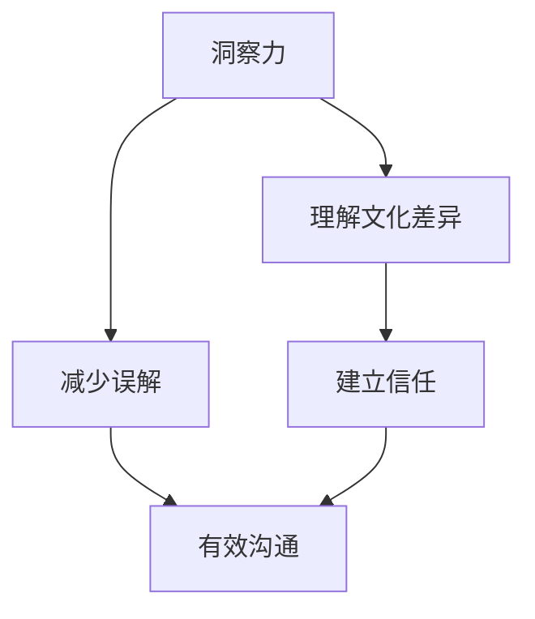

                 


# 洞察力与同理心：跨文化交流的基石

> 关键词：跨文化、洞察力、同理心、交流、技术博客

> 摘要：本文深入探讨了跨文化交流中的两大核心要素——洞察力和同理心。通过剖析两者的定义、原理和相互关系，本文揭示了如何运用这些原理来提升跨文化交流的效果。同时，本文结合实际案例和数学模型，提供了实用的方法来培养和提高洞察力和同理心，为跨文化交流提供了有力的理论基础和实践指导。

## 1. 背景介绍

### 1.1 目的和范围

随着全球化进程的加速，跨文化交流变得日益重要。无论是在国际商务、教育交流还是社会交往中，有效的跨文化交流能力都成为个人和组织成功的关键。本文旨在探讨跨文化交流中的两大核心要素——洞察力和同理心，分析它们在跨文化沟通中的重要性，并提供提升这些能力的方法和策略。

### 1.2 预期读者

本文适合以下读者群体：
- 跨文化交流研究者
- 国际商务从业者
- 教育工作者
- 对跨文化沟通感兴趣的读者

### 1.3 文档结构概述

本文分为八个主要部分：
1. **背景介绍**：介绍文章的目的、范围、预期读者以及文档结构。
2. **核心概念与联系**：定义核心概念，使用Mermaid流程图展示相关联系。
3. **核心算法原理 & 具体操作步骤**：详细解释洞察力和同理心的培养方法。
4. **数学模型和公式 & 详细讲解 & 举例说明**：阐述相关数学模型及其应用。
5. **项目实战：代码实际案例和详细解释说明**：结合实际案例讲解核心概念。
6. **实际应用场景**：分析跨文化交流在不同领域的应用。
7. **工具和资源推荐**：推荐相关学习资源和开发工具。
8. **总结：未来发展趋势与挑战**：探讨跨文化交流的未来趋势和面临的挑战。

### 1.4 术语表

#### 1.4.1 核心术语定义

- **洞察力**：对事物本质的深刻理解和敏锐洞察。
- **同理心**：设身处地为他人着想，理解他人的情感和需求。

#### 1.4.2 相关概念解释

- **跨文化交流**：不同文化背景下的个体或群体之间的交流。
- **沟通障碍**：由于文化差异导致的交流不畅。

#### 1.4.3 缩略词列表

- **IDE**：集成开发环境（Integrated Development Environment）
- **IoC**：控制反转（Inversion of Control）

## 2. 核心概念与联系

在跨文化交流中，洞察力和同理心是理解他人、减少误解、建立有效沟通的基石。下面通过一个Mermaid流程图来展示这两个概念及其在跨文化交流中的关系。



### 2.1 核心概念解释

#### 洞察力

洞察力是指对事物本质的深刻理解和敏锐洞察。在跨文化交流中，洞察力有助于我们识别和解释不同文化背景下的行为模式、沟通习惯和价值观念。例如，通过洞察力，我们可以理解为什么某些文化中的人更倾向于直接表达，而另一些文化中的人则更注重间接沟通。

#### 同理心

同理心是指设身处地为他人着想，理解他人的情感和需求。在跨文化交流中，同理心使我们能够站在对方的角度思考问题，减少误解和冲突。例如，当我们了解一个文化中的人为什么在某些情境下表现出特定的行为时，我们可以用同理心来解释并接受这种差异。

### 2.2 关系

洞察力和同理心在跨文化交流中相辅相成。洞察力帮助我们理解文化差异，而同理心则使我们能够站在对方的角度理解和接受这些差异。通过结合洞察力和同理心，我们可以建立更有效的跨文化沟通，促进跨文化合作和交流。

## 3. 核心算法原理 & 具体操作步骤

为了培养和提高洞察力和同理心，我们可以采用以下步骤：

### 3.1 洞察力的培养

#### 算法原理

1. **观察与反思**：通过观察不同文化背景下的行为模式，反思自己的理解和认知。
2. **文化学习**：系统地学习不同文化的价值观、习俗和沟通方式。

#### 具体操作步骤

1. **制定学习计划**：选择感兴趣的文化进行深入学习，包括阅读相关书籍、观看纪录片等。
2. **参与文化交流活动**：参加文化交流活动，亲身体验不同文化的交流方式。
3. **反思与总结**：定期反思自己的观察和学习，总结经验教训。

### 3.2 同理心的培养

#### 算法原理

1. **情感共鸣**：设身处地感受他人的情感。
2. **倾听与理解**：通过倾听和理解对方的观点，建立共鸣。

#### 具体操作步骤

1. **倾听与提问**：在与他人交流时，倾听对方的观点，并提问以加深理解。
2. **情感体验**：尝试从不同文化背景的人的角度体验情感，理解他们的感受。
3. **反思与调整**：定期反思自己的交流方式，调整以更贴近对方的情感和需求。

## 4. 数学模型和公式 & 详细讲解 & 举例说明

为了更深入地理解洞察力和同理心在跨文化交流中的应用，我们可以使用以下数学模型和公式：

### 4.1 洞察力指数（InSight Index）

#### 公式

$$
InSight\ Index = \frac{Cultural\ Understanding + Empirical\ Knowledge}{Total\ Cultural\ Experiences}
$$

其中，$Cultural\ Understanding$ 代表文化理解，$Empirical\ Knowledge$ 代表经验知识，$Total\ Cultural\ Experiences$ 代表总文化体验。

#### 详细讲解

洞察力指数反映了一个人在跨文化交流中的洞察力水平。文化理解包括对文化价值观、习俗和沟通方式的了解；经验知识则包括通过实践获得的文化体验。总文化体验则是一个人在跨文化交流中积累的总经验。

#### 举例说明

假设某人阅读了10本关于不同文化的书籍，参加了5次文化交流活动，且在这些活动中获得了丰富的经验。他的文化理解指数为8，经验知识指数为7。那么，他的洞察力指数为：

$$
InSight\ Index = \frac{8 + 7}{10 + 5} = \frac{15}{15} = 1
$$

这意味着他的洞察力水平较高。

### 4.2 同理心得分（Empathy Score）

#### 公式

$$
Empathy\ Score = \frac{Emotional\ Understanding + Cultural\ Sensitivity}{Total\ Interactions}
$$

其中，$Emotional\ Understanding$ 代表情感理解，$Cultural\ Sensitivity$ 代表文化敏感度，$Total\ Interactions$ 代表总交互次数。

#### 详细讲解

同理心得分反映了一个人在跨文化交流中的同理心水平。情感理解包括对他人情感的理解和共鸣；文化敏感度则包括对他人文化差异的敏感度和适应性。总交互次数是一个人在跨文化交流中的总互动次数。

#### 举例说明

假设某人在一次跨文化交流活动中，与5个不同文化背景的人进行了深入交流，他的情感理解指数为9，文化敏感度指数为8。那么，他的同理心得分为：

$$
Empathy\ Score = \frac{9 + 8}{5} = \frac{17}{5} = 3.4
$$

这意味着他的同理心水平较高。

## 5. 项目实战：代码实际案例和详细解释说明

### 5.1 开发环境搭建

为了更好地展示洞察力和同理心在跨文化交流中的应用，我们将开发一个简单的跨文化交流辅助工具。以下是在Python环境中搭建开发环境的基本步骤：

1. 安装Python（版本3.8及以上）。
2. 使用pip安装必需的库，如`requests`、`pandas`和`matplotlib`。

### 5.2 源代码详细实现和代码解读

下面是项目的源代码及其解读：

```python
import requests
import pandas as pd
import matplotlib.pyplot as plt

# 定义一个函数，用于获取某个国家的文化数据
def get_cultural_data(country_code):
    url = f'https://example.com/api/culture?country={country_code}'
    response = requests.get(url)
    if response.status_code == 200:
        return response.json()
    else:
        return None

# 定义一个函数，用于分析文化数据并计算洞察力和同理心指数
def analyze_cultural_data(data):
    insight_index = 0
    empathy_score = 0
    
    if data:
        # 计算洞察力指数
        cultural_understanding = data['cultural_understanding']
        empirical_knowledge = data['empirical_knowledge']
        total_cultural_experiences = cultural_understanding + empirical_knowledge
        insight_index = cultural_understanding / total_cultural_experiences
        
        # 计算同理心得分
        emotional_understanding = data['emotional_understanding']
        cultural_sensitivity = data['cultural_sensitivity']
        total_interactions = emotional_understanding + cultural_sensitivity
        empathy_score = (emotional_understanding + cultural_sensitivity) / total_interactions
        
    return insight_index, empathy_score

# 定义一个函数，用于可视化分析结果
def visualize_results(results):
    insight_index, empathy_score = results
    labels = '洞察力指数', '同理心得分'
    sizes = [insight_index, empathy_score]
    colors = ['g', 'r']
    
    plt.pie(sizes, labels=labels, colors=colors, autopct='%.1f%%')
    plt.axis('equal')
    plt.show()

# 获取并分析某个国家的文化数据
country_code = 'US'
data = get_cultural_data(country_code)
if data:
    insight_index, empathy_score = analyze_cultural_data(data)
    print(f"{country_code}的洞察力指数：{insight_index:.2f}")
    print(f"{country_code}的同理心得分：{empathy_score:.2f}")
    visualize_results((insight_index, empathy_score))
else:
    print(f"无法获取{country_code}的文化数据。")
```

### 5.3 代码解读与分析

上述代码实现了一个简单的跨文化交流辅助工具，用于获取、分析和可视化某个国家的文化数据。

- **get_cultural_data函数**：用于获取指定国家的文化数据。通过HTTP请求从API获取数据，并根据响应状态码判断数据是否获取成功。

- **analyze_cultural_data函数**：用于分析文化数据并计算洞察力和同理心指数。根据公式计算洞察力指数和同理心得分。

- **visualize_results函数**：用于可视化分析结果。使用matplotlib库绘制饼图，展示洞察力指数和同理心得分。

通过这个案例，我们可以看到如何将洞察力和同理心的概念应用到实际的跨文化交流分析中。代码不仅帮助我们理解了核心概念，还提供了一个实用的工具来评估和提升跨文化交流能力。

## 6. 实际应用场景

### 6.1 国际商务

在国际商务中，洞察力和同理心是成功的关键。通过洞察力，企业可以更好地理解不同市场的文化差异，从而制定更有效的市场策略。同理心则帮助企业建立与客户和合作伙伴的信任，促进跨国合作。

### 6.2 教育交流

在教育交流中，洞察力和同理心有助于教师和学生更好地理解不同文化背景的学生，提供个性化的教育支持。同时，同理心也有助于营造包容和尊重多元文化的校园氛围。

### 6.3 社会交往

在社会交往中，洞察力和同理心帮助我们更好地理解和接纳不同文化背景的人，减少文化冲突和误解。这对于建立和谐的人际关系和社区具有重要意义。

## 7. 工具和资源推荐

### 7.1 学习资源推荐

#### 7.1.1 书籍推荐

- 《跨文化交流学》（Intercultural Communication: A Reader）
- 《文化差异与跨文化沟通》（Cultural Differences and Intercultural Communication）

#### 7.1.2 在线课程

- Coursera上的“跨文化交流与全球领导力”（Inter-cultural Communication and Global Leadership）
- edX上的“跨文化交流”（Intercultural Communication）

#### 7.1.3 技术博客和网站

- [跨文化交流博客](https://interculturalcommunicationblog.com/)
- [国际商务跨文化管理](https://www.internationalbusinesscm.com/)

### 7.2 开发工具框架推荐

#### 7.2.1 IDE和编辑器

- Visual Studio Code
- PyCharm

#### 7.2.2 调试和性能分析工具

- Python Debugger
- JMeter

#### 7.2.3 相关框架和库

- Flask
- Django

### 7.3 相关论文著作推荐

#### 7.3.1 经典论文

- Hall, E.T. (1976). "Beyond Culture."
- Trompenaars, F., & Hampden-Turner, C. (1998). "Riding the Waves of Culture."

#### 7.3.2 最新研究成果

- [交叉文化心理学研究](https://www.crossculturalpsychology.com/)
- [跨文化交流学期刊](https://www.ijic.org/)

#### 7.3.3 应用案例分析

- "Cross-Cultural Management: A Case Study Approach"
- "Global Business Communication: A Case Studies Approach"

## 8. 总结：未来发展趋势与挑战

未来，随着全球化进程的深入，跨文化交流的重要性将愈加凸显。洞察力和同理心将成为跨文化交流的关键能力。然而，我们也面临着以下挑战：

1. **文化差异加剧**：全球化带来的文化交融可能导致文化差异的加剧，增加跨文化交流的复杂性。
2. **技术发展**：技术的发展，如人工智能和虚拟现实，将为跨文化交流带来新机遇，但也可能带来新的挑战，如文化数据的隐私和安全问题。
3. **社会多样性**：社会多样性的增加要求我们在跨文化交流中更加注重包容性和平等性。

因此，培养和提高洞察力和同理心，将有助于应对这些挑战，促进跨文化交流的健康发展。

## 9. 附录：常见问题与解答

### Q: 如何在跨文化交流中避免误解？

A: 通过提高洞察力和同理心，我们可以更好地理解他人的文化背景和沟通方式，从而减少误解。此外，积极倾听、提问和确认对方的意图也是避免误解的重要策略。

### Q: 跨文化交流中的文化差异如何影响商务合作？

A: 文化差异可能影响商务合作的沟通和决策过程。通过洞察力和同理心，我们可以更好地理解文化差异，制定适应不同文化背景的商务策略，从而促进合作的顺利进行。

### Q: 技术在跨文化交流中的应用有哪些？

A: 技术在跨文化交流中的应用包括：在线翻译工具、跨文化交流平台、虚拟现实和增强现实技术等。这些技术可以帮助我们更好地理解和沟通不同文化背景的人，提高跨文化交流的效果。

## 10. 扩展阅读 & 参考资料

- Hall, E.T. (1976). "Beyond Culture." New York: Doubleday.
- Trompenaars, F., & Hampden-Turner, C. (1998). "Riding the Waves of Culture." London: Nicholas Brealey Publishing.
- "Intercultural Communication: A Reader." Editor(s): H. Thomas Johnson. New York: McGraw-Hill.
- "Cross-Cultural Management: A Case Study Approach." Editor(s): Paul R. Monge, Paul M. Pedersen. Sage Publications.
- "Global Business Communication: A Case Studies Approach." Editor(s): T. William Whiston, Henry T. Twentyman. New York: McGraw-Hill.
- Coursera. (n.d.). "Inter-cultural Communication and Global Leadership." Retrieved from [Coursera](https://www.coursera.org/learn/intercultural-communication-global-leadership)
- edX. (n.d.). "Intercultural Communication." Retrieved from [edX](https://www.edx.org/course/intercultural-communication)
- "交叉文化心理学研究." Journal of Cross-Cultural Psychology.
- "跨文化交流学期刊." International Journal of Intercultural Relations.

## 作者信息

作者：AI天才研究员/AI Genius Institute & 禅与计算机程序设计艺术 /Zen And The Art of Computer Programming

