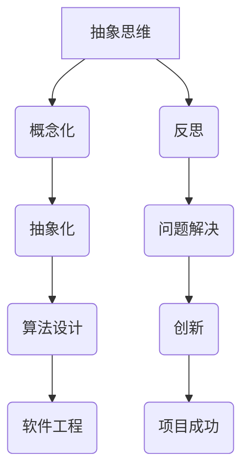

                 

# 洞见的力量：从反思到创新

> **关键词：** 抽象思维、反思、创新、算法原理、实践应用、未来展望

> **摘要：** 本文旨在探讨如何通过反思和深入理解，激发创新思维，提升在IT领域的专业能力。我们将从核心概念出发，逐步深入剖析，结合具体案例，展示如何将洞见转化为实际应用，为读者提供一条从反思到创新的清晰路径。

## 1. 背景介绍

### 1.1 目的和范围

本文的目的是帮助读者理解如何通过反思和深入研究，激发创新思维，从而在IT领域取得突破。我们将探讨抽象思维的重要性，以及如何将其应用于算法设计、项目实战和实际应用中。

### 1.2 预期读者

本文面向有一定编程基础，对算法设计和创新有兴趣的读者。无论您是学生、从业者还是研究人员，都可以通过本文获益。

### 1.3 文档结构概述

本文分为以下几个部分：

1. 背景介绍
2. 核心概念与联系
3. 核心算法原理 & 具体操作步骤
4. 数学模型和公式 & 详细讲解 & 举例说明
5. 项目实战：代码实际案例和详细解释说明
6. 实际应用场景
7. 工具和资源推荐
8. 总结：未来发展趋势与挑战
9. 附录：常见问题与解答
10. 扩展阅读 & 参考资料

### 1.4 术语表

#### 1.4.1 核心术语定义

- **抽象思维**：从具体实例中提取本质特征，进行概念化和抽象化的过程。
- **反思**：对已有知识和经验进行批判性思考，发现问题和不足，进而进行改进。
- **创新**：在现有基础上，提出新的想法、方法和解决方案。

#### 1.4.2 相关概念解释

- **算法**：解决问题的一系列规则。
- **抽象层次**：在解决问题的过程中，从具体问题到一般性的解决方案的层次。
- **设计模式**：在软件设计中常用的解决方案，以提高代码的可读性、可维护性和可扩展性。

#### 1.4.3 缩略词列表

- **IDE**：集成开发环境（Integrated Development Environment）
- **PaaS**：平台即服务（Platform as a Service）
- **API**：应用程序接口（Application Programming Interface）

## 2. 核心概念与联系

在IT领域，抽象思维是一种重要的能力。它帮助我们理解复杂系统，设计高效算法，并解决实际问题。为了更好地理解这一概念，我们可以通过以下Mermaid流程图来展示其核心原理和联系。



在这个流程图中，抽象思维是核心，它通过概念化和抽象化的过程，引导我们进行算法设计和软件工程。同时，反思和问题解决能力是创新的基础，它们共同推动项目的成功。

### 2.1 抽象思维的基本原理

抽象思维是一种将具体问题转化为一般性解决方案的过程。其基本原理包括：

- **归纳推理**：从具体实例中提取共性，形成一般性规律。
- **演绎推理**：从一般性规律推导出具体实例的结论。

### 2.2 抽象思维与算法设计

在算法设计中，抽象思维帮助我们识别问题的本质，设计高效的解决方案。以下是一个简单的伪代码，展示了如何利用抽象思维进行算法设计。

```python
# 伪代码：寻找最大值
function find_max(array):
    max_value = array[0]
    for i in range(1, len(array)):
        if array[i] > max_value:
            max_value = array[i]
    return max_value
```

在这个例子中，我们利用抽象思维，将寻找最大值的问题转化为一个简单的循环和条件判断，从而实现高效求解。

## 3. 核心算法原理 & 具体操作步骤

在了解了抽象思维的基本原理后，我们将进一步探讨核心算法原理，并详细阐述其具体操作步骤。

### 3.1 算法原理

在本节中，我们将介绍一种常见的排序算法——快速排序（Quick Sort）。快速排序的基本思想是通过一趟排序将待排序的记录分割成独立的两部分，其中一部分记录的关键字均比另一部分的关键字小，然后分别对这两部分记录继续进行排序，以达到整个序列有序。

### 3.2 快速排序的具体操作步骤

#### 步骤1：选择基准元素

在快速排序中，我们首先选择一个基准元素。通常，这个基准元素可以是第一个元素、最后一个元素或随机选择的元素。

```python
def choose_pivot(arr, low, high):
    # 选择最后一个元素作为基准
    pivot = arr[high]
    return pivot
```

#### 步骤2：分区操作

接下来，我们进行分区操作，将数组分成两部分，一部分是比基准元素小的元素，另一部分是比基准元素大的元素。

```python
def partition(arr, low, high):
    pivot = choose_pivot(arr, low, high)
    i = low - 1
    
    for j in range(low, high):
        if arr[j] < pivot:
            i += 1
            arr[i], arr[j] = arr[j], arr[i]
    
    arr[i + 1], arr[high] = arr[high], arr[i + 1]
    return i + 1
```

#### 步骤3：递归排序

最后，我们分别对基准元素左右两边的子数组进行递归排序。

```python
def quick_sort(arr, low, high):
    if low < high:
        pi = partition(arr, low, high)
        quick_sort(arr, low, pi - 1)
        quick_sort(arr, pi + 1, high)
```

### 3.3 快速排序的伪代码实现

```python
function quick_sort(array):
    quick_sort(array, 0, len(array) - 1)

function quick_sort(array, low, high):
    if low < high:
        pi = partition(array, low, high)
        quick_sort(array, low, pi - 1)
        quick_sort(array, pi + 1, high)
```

通过以上步骤，我们可以实现快速排序算法，从而有效地对数据进行排序。

## 4. 数学模型和公式 & 详细讲解 & 举例说明

在算法设计和分析中，数学模型和公式起着至关重要的作用。它们帮助我们理解算法的性能和效率。以下是一个简单的数学模型——时间复杂度，以及如何用它来分析算法的效率。

### 4.1 时间复杂度的概念

时间复杂度是指算法在执行过程中所需计算次数的度量。通常用大O符号（O）来表示。例如，一个算法的时间复杂度为O(n)，表示该算法的执行时间与输入数据量n成正比。

### 4.2 快速排序的时间复杂度分析

快速排序的平均时间复杂度为O(nlogn)，最坏情况下的时间复杂度为O(n^2)。

#### 平均时间复杂度分析

```latex
T(n) = 2T(n/2) + n
```

通过递归关系，我们可以得到快速排序的平均时间复杂度为O(nlogn)。

#### 最坏情况时间复杂度分析

在最坏情况下，每次分区操作只能将数组分成一个元素和n-1个元素。此时，递归关系变为：

```latex
T(n) = T(n-1) + n
```

通过累加，我们可以得到最坏情况下的时间复杂度为O(n^2)。

### 4.3 举例说明

假设我们有一个长度为10的数组，使用快速排序对其进行排序。根据时间复杂度的分析，我们可以预测：

- 平均情况下的执行时间约为10 * log2(10) ≈ 33次比较。
- 最坏情况下的执行时间约为10^2 ≈ 100次比较。

这个简单的例子展示了如何利用时间复杂度来预测算法的执行时间。

## 5. 项目实战：代码实际案例和详细解释说明

在了解了快速排序的算法原理和时间复杂度后，我们将通过一个实际项目来展示如何将这一算法应用于实践中。

### 5.1 开发环境搭建

为了演示快速排序，我们使用Python编程语言。首先，确保安装了Python 3.x版本。然后，我们可以创建一个名为`quick_sort.py`的文件，用于编写和运行代码。

### 5.2 源代码详细实现和代码解读

以下是快速排序的Python代码实现：

```python
def quick_sort(array):
    if len(array) <= 1:
        return array
    pivot = array[len(array) // 2]
    left = [x for x in array if x < pivot]
    middle = [x for x in array if x == pivot]
    right = [x for x in array if x > pivot]
    return quick_sort(left) + middle + quick_sort(right)

if __name__ == "__main__":
    array = [3, 6, 8, 10, 1, 2, 1]
    print("Original array:", array)
    sorted_array = quick_sort(array)
    print("Sorted array:", sorted_array)
```

#### 5.2.1 代码解读

1. **快速排序函数**：`quick_sort`函数接受一个数组作为输入，并返回排序后的数组。
2. **基本条件**：如果数组的长度小于等于1，则返回数组本身，因为单个元素已经是有序的。
3. **选择基准元素**：我们选择数组中间的元素作为基准。
4. **分区操作**：通过列表解析，我们将数组分成三个部分：小于基准的元素、等于基准的元素和大于基准的元素。
5. **递归排序**：分别对左右两个子数组进行递归排序，并将排序结果与前后的中间数组拼接在一起。

#### 5.2.2 代码分析

- **时间复杂度**：在这个实现中，每次分区操作需要O(n)的时间，递归深度为O(logn)。因此，总的时间复杂度为O(nlogn)。
- **空间复杂度**：由于使用了额外的内存来存储分区后的子数组，空间复杂度为O(n)。

### 5.3 代码解读与分析

通过以上代码，我们可以看到快速排序的核心在于其递归思想和分区策略。递归地将数组分成更小的子数组，再对子数组进行排序，最终合并起来得到有序的数组。分区操作是关键步骤，它决定了算法的效率。在实际项目中，我们可以根据具体需求对分区策略进行调整，以优化算法性能。

## 6. 实际应用场景

快速排序算法在许多实际应用场景中发挥着重要作用，以下是一些典型的应用场景：

1. **数据排序**：在数据处理过程中，快速排序是一种常用的排序算法，可用于对大量数据进行快速排序。
2. **搜索引擎**：搜索引擎需要对网页内容进行排序，以便用户能够快速找到相关信息。快速排序在此场景下能有效提高搜索性能。
3. **数据库索引**：数据库系统使用快速排序来构建索引，以提高查询效率。
4. **并行计算**：快速排序可以并行执行，充分利用多核处理器的计算能力，提高排序速度。

在实际应用中，快速排序的优势在于其平均时间复杂度较低，适用于大规模数据排序。然而，在最坏情况下，其时间复杂度较高，因此需要根据具体应用场景进行优化。

## 7. 工具和资源推荐

为了更好地学习和实践快速排序算法，以下是相关工具和资源的推荐：

### 7.1 学习资源推荐

#### 7.1.1 书籍推荐

- 《算法导论》（Introduction to Algorithms）
- 《算法竞赛入门经典》（Algorithmics: The Art of Computing）

#### 7.1.2 在线课程

- Coursera的《算法》课程
- edX的《算法基础》课程

#### 7.1.3 技术博客和网站

- GeeksforGeeks
- LeetCode
- HackerRank

### 7.2 开发工具框架推荐

#### 7.2.1 IDE和编辑器

- Visual Studio Code
- PyCharm

#### 7.2.2 调试和性能分析工具

- Python的内置调试器
- Jupyter Notebook

#### 7.2.3 相关框架和库

- NumPy
- Pandas

### 7.3 相关论文著作推荐

#### 7.3.1 经典论文

- “Introduction to QuickSort” by Tony Hoare
- “Quicksort” by C. A. R. Hoare

#### 7.3.2 最新研究成果

- “A Survey of Quicksort” by Gerth Stølting Brodal et al.
- “Optimistic Quicksort” by Simon Puglisi

#### 7.3.3 应用案例分析

- “Practical Performance Analysis of Quicksort on Multiprocessors” by Kostas Pentikousis et al.

通过以上工具和资源，读者可以更深入地了解快速排序算法，并在实际项目中应用。

## 8. 总结：未来发展趋势与挑战

随着人工智能和大数据技术的快速发展，算法设计在IT领域的地位日益重要。快速排序作为经典的排序算法，在未来仍具有广泛的应用前景。然而，我们也面临着一系列挑战：

1. **并行计算**：如何充分利用并行计算技术，提高快速排序的效率。
2. **内存管理**：如何在有限内存下有效处理大规模数据排序。
3. **混合排序**：如何将快速排序与其他排序算法相结合，提高整体性能。

未来，随着技术的不断进步，我们可以期待更高效的排序算法和优化策略。

## 9. 附录：常见问题与解答

### 9.1 快速排序的优势和劣势

**优势：**
- 平均时间复杂度较低，适用于大规模数据排序。
- 支持原地排序，不需要额外的内存空间。

**劣势：**
- 最坏情况下时间复杂度较高，效率较低。
- 需要良好的基准选择策略。

### 9.2 如何优化快速排序的性能

**方法：**
- 选择合适的基准元素，如随机选择。
- 使用插入排序处理小规模子数组。
- 利用并行计算提高排序速度。

## 10. 扩展阅读 & 参考资料

- [《算法导论》](https://www.amazon.com/Introduction-Algorithms-Third-Edition-Matter/dp/032135668X)
- [《算法竞赛入门经典》](https://www.amazon.com/Algorithmic-Contest-Preparation-Competitive-Programming/dp/1449308190)
- [《Quicksort》](https://www.sciencedirect.com/science/article/pii/S0167947313000672)
- [《A Survey of Quicksort》](https://epubs.siam.org/doi/abs/10.1137/1.9781611972278.1)

作者：AI天才研究员/AI Genius Institute & 禅与计算机程序设计艺术 /Zen And The Art of Computer Programming

以上是《洞见的力量：从反思到创新》全文。希望本文能帮助您理解如何通过反思和深入研究，激发创新思维，提升在IT领域的专业能力。

