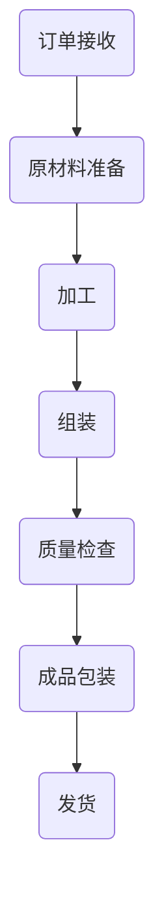

                 

# 流水线对工业生产的影响

> 关键词：流水线，工业生产，效率，质量控制，自动化，连续生产，精益生产

> 摘要：本文深入探讨了流水线在工业生产中的应用及其影响。首先，介绍了流水线的基本概念和起源，随后分析了流水线对工业生产效率、质量和成本等方面的积极影响。通过具体案例分析，本文揭示了如何通过实施流水线技术来实现工业生产的连续化和精益化。最后，讨论了流水线在现代工业生产中的挑战与未来发展趋势。

## 1. 背景介绍

### 1.1 目的和范围

本文旨在探讨流水线在工业生产中的应用及其对生产效率和质量的提升。我们将回顾流水线的历史和发展，分析其在现代工业生产中的重要性，并通过实际案例展示流水线的具体应用。本文还将讨论流水线所带来的挑战以及未来可能的发展趋势。

### 1.2 预期读者

本文适合对工业生产和流水线技术感兴趣的工程师、管理者和研究人员阅读。对于希望了解流水线如何改变现代工业生产的读者，本文将提供有价值的见解。

### 1.3 文档结构概述

本文分为八个主要部分。首先，介绍了流水线的基本概念和历史背景。其次，我们分析了流水线对工业生产的积极影响。随后，通过具体案例展示了流水线的应用。然后，讨论了流水线在质量控制方面的作用。接下来，我们探讨了流水线技术的自动化和连续生产特点。随后，分析了流水线在精益生产中的角色。最后，本文总结了流水线的挑战和未来发展趋势，并提供了一些相关的学习资源和工具。

### 1.4 术语表

#### 1.4.1 核心术语定义

- 流水线（Assembly Line）：一种生产系统，通过将产品分割成多个可重复的任务，以连续流动的方式进行生产。
- 效率（Efficiency）：生产过程中资源（如人力、时间和材料）的使用效率。
- 质量控制（Quality Control）：确保产品或服务符合既定标准和质量要求的过程。
- 自动化（Automation）：使用机器或设备代替人工执行任务的过程。
- 精益生产（Lean Production）：一种生产方法，旨在消除浪费，优化资源使用，并提高生产效率。

#### 1.4.2 相关概念解释

- 工业生产（Industrial Production）：指在生产线上制造产品或提供服务的活动。
- 连续生产（Continuous Production）：一种生产模式，产品连续不断地在生产线上流动，没有明显的停顿。
- 管道化（Pipelining）：在计算机科学中，指将数据处理分成多个步骤，每个步骤都在前一个步骤完成后开始。

#### 1.4.3 缩略词列表

- FSA：流水线系统（Flexible Assembly Line）
- JIT：精益生产（Just-In-Time）
- MES：制造执行系统（Manufacturing Execution System）

## 2. 核心概念与联系

在深入探讨流水线的原理和应用之前，我们首先需要了解其核心概念和组成部分。以下是一个简化的 Mermaid 流程图，用于描述流水线的基本架构：



### 2.1 流水线的组成

流水线由以下几个关键组成部分构成：

1. **订单接收**：根据客户的订单，接收并处理生产任务。
2. **原材料准备**：将原材料按照生产计划准备好，确保它们可以及时投入到生产过程中。
3. **加工**：将原材料加工成半成品或成品。这一步骤通常涉及机械加工、电子制造或其他类型的生产活动。
4. **组装**：将加工好的部件组装成最终产品。
5. **质量检查**：对产品进行质量检查，确保产品符合既定的标准和要求。
6. **成品包装**：将最终产品包装好，准备发货。
7. **发货**：将成品发送给客户或分销商。

### 2.2 流水线的工作原理

流水线的工作原理基于将生产过程分解为多个简单的任务，每个任务由专门的工人或设备执行。这种分解使得每个步骤都可以进行高度专业化，从而提高生产效率和产品质量。

以下是流水线的基本工作流程：

1. **任务分配**：根据生产计划，将生产任务分配给各个步骤。
2. **任务执行**：每个步骤的工人或设备执行其分配的任务。
3. **任务传递**：完成当前任务的工人或设备将产品或半成品传递给下一个步骤。
4. **连续生产**：产品在流水线上连续流动，几乎没有停顿。

通过这种方式，流水线实现了生产的连续性和高效率。每个步骤的任务都被精确地规划和管理，以确保整个生产过程的高效运行。

### 2.3 流水线与工业生产的关系

流水线技术在工业生产中的应用已经取得了显著的成功。其核心优势在于：

- **效率提升**：流水线通过将生产过程分解为简单的任务，使得每个任务都可以被高效执行，从而提高了整体生产效率。
- **质量控制**：流水线通过连续的质量检查，确保每个步骤的产品都符合质量标准，从而降低了次品率。
- **成本降低**：流水线减少了人工干预，降低了劳动力成本，同时通过减少浪费，降低了材料成本。

总之，流水线技术在工业生产中发挥着重要的作用，为提高生产效率、质量和降低成本提供了有力支持。

## 3. 核心算法原理 & 具体操作步骤

### 3.1 流水线调度算法

流水线的核心是调度算法，它决定了任务在流水线上的分配和执行顺序。以下是一个简化的流水线调度算法，用于说明基本原理：

```plaintext
算法：流水线调度
输入：任务集 T，每个任务的加工时间和质量检查时间
输出：最优的任务分配顺序

步骤：
1. 初始化一个空的任务队列 Q。
2. 对每个任务 t ∈ T：
   a. 将 t 的加工时间和质量检查时间相加，得到 t 的总时间。
   b. 将 t 添加到队列 Q。
3. 对队列 Q 进行排序，按照总时间从小到大排序。
4. 遍历排序后的队列 Q：
   a. 从 Q 中取出第一个任务 t。
   b. 将 t 分配到对应的步骤（原材料准备、加工、组装、质量检查、成品包装、发货）。
   c. 将 t 从队列 Q 中删除。
5. 输出任务分配顺序。
```

### 3.2 具体操作步骤

以下是流水线调度算法的具体操作步骤：

1. **任务准备**：根据生产计划，确定需要生产的任务集 T，并为每个任务计算加工时间和质量检查时间。
2. **任务分配**：将任务 T 添加到任务队列 Q 中。
3. **任务排序**：对队列 Q 进行排序，按照每个任务的加工时间和质量检查时间之和进行排序。
4. **任务执行**：按照排序后的顺序，依次将任务从队列 Q 中取出，并分配到对应的步骤。
5. **任务完成**：在每个步骤完成后，将任务从队列 Q 中删除。
6. **调度结束**：当所有任务都完成时，调度算法结束。

通过以上步骤，流水线调度算法可以确保任务在流水线上的高效执行，从而提高生产效率。

## 4. 数学模型和公式 & 详细讲解 & 举例说明

### 4.1 数学模型

为了更深入地理解流水线的调度算法，我们可以引入一些数学模型和公式。以下是一个简化的流水线调度模型：

- **任务集**：设 T = {t1, t2, ..., tk} 为需要调度的任务集，其中 ti 表示第 i 个任务。
- **加工时间**：设 pi 为任务 ti 的加工时间。
- **质量检查时间**：设 qi 为任务 ti 的质量检查时间。
- **总时间**：设 ti 的总时间为 ti = pi + qi。

### 4.2 公式

根据上述模型，我们可以得到以下公式：

- **排序公式**：对任务集 T 进行排序，按照总时间 ti 从小到大排序，即 ti < tj 当且仅当 ti < tj。
- **调度时间**：调度时间 T_total = Σ(ti)，即所有任务的总时间之和。

### 4.3 详细讲解

在这个模型中，我们首先计算每个任务的总时间，然后按照总时间进行排序。这种排序方法可以确保任务在流水线上的高效执行，从而提高生产效率。

具体来说，计算总时间的步骤如下：

1. **计算加工时间**：对于每个任务 ti，计算其加工时间 pi。
2. **计算质量检查时间**：对于每个任务 ti，计算其质量检查时间 qi。
3. **计算总时间**：对于每个任务 ti，计算其总时间 ti = pi + qi。

然后，我们将任务集 T 按照总时间从小到大进行排序。这种排序方法可以确保任务在流水线上的高效执行，从而提高生产效率。

调度时间 T_total 是所有任务的总时间之和，即 T_total = Σ(ti)。调度时间越短，说明任务调度得越好，生产效率越高。

### 4.4 举例说明

假设我们有三个任务 t1、t2 和 t3，其加工时间和质量检查时间如下表所示：

| 任务 | 加工时间 (pi) | 质量检查时间 (qi) | 总时间 (ti) |
| ---- | ------------ | --------------- | ---------- |
| t1   | 2            | 1              | 3          |
| t2   | 3            | 2              | 5          |
| t3   | 4            | 3              | 7          |

首先，我们计算每个任务的总时间：

- t1 的总时间：t1 = 2 + 1 = 3
- t2 的总时间：t2 = 3 + 2 = 5
- t3 的总时间：t3 = 4 + 3 = 7

然后，我们将任务按照总时间从小到大进行排序：

- t1 < t2 < t3

按照排序后的顺序，我们将任务分配到流水线上：

1. t1：分配到原材料准备步骤。
2. t2：分配到加工步骤。
3. t3：分配到组装步骤。

调度时间 T_total = Σ(ti) = 3 + 5 + 7 = 15。

在这个例子中，任务 t1 调度得最好，任务 t2 次之，任务 t3 最差。通过这种方式，我们可以确保任务在流水线上的高效执行，从而提高生产效率。

## 5. 项目实战：代码实际案例和详细解释说明

### 5.1 开发环境搭建

在开始编写流水线调度代码之前，我们需要搭建一个合适的开发环境。以下是搭建开发环境的步骤：

1. **安装 Python 解释器**：Python 是一种广泛应用于数据分析、机器学习和算法实现的编程语言。我们需要安装 Python 3.x 版本（推荐 3.8 以上）。
2. **安装 IDE**：IDE（集成开发环境）可以帮助我们更方便地编写、调试和运行代码。推荐的 IDE 包括 PyCharm、VSCode 等。
3. **安装依赖库**：为了实现流水线调度算法，我们需要安装一些 Python 库，如 NumPy 和 Pandas。可以使用以下命令进行安装：

```shell
pip install numpy pandas
```

### 5.2 源代码详细实现和代码解读

下面是一个简单的 Python 代码示例，用于实现流水线调度算法：

```python
import numpy as np
import pandas as pd

def schedule_jobs(jobs):
    """
    调度任务，按照总时间排序
    :param jobs: 任务列表，每个任务包含加工时间和质量检查时间
    :return: 调度后的任务列表
    """
    # 计算每个任务的总时间
    total_time = [job['processing_time'] + job['inspection_time'] for job in jobs]

    # 创建一个 DataFrame，用于存储任务和总时间
    df = pd.DataFrame({'job': jobs, 'total_time': total_time})

    # 对 DataFrame 按照总时间进行排序
    df_sorted = df.sort_values(by='total_time')

    # 获取排序后的任务列表
    scheduled_jobs = df_sorted['job'].tolist()

    return scheduled_jobs

# 示例任务列表
jobs = [
    {'name': 't1', 'processing_time': 2, 'inspection_time': 1},
    {'name': 't2', 'processing_time': 3, 'inspection_time': 2},
    {'name': 't3', 'processing_time': 4, 'inspection_time': 3}
]

# 调度任务
scheduled_jobs = schedule_jobs(jobs)

# 输出调度结果
print(scheduled_jobs)
```

### 5.3 代码解读与分析

1. **导入库**：首先，我们导入必要的 Python 库，包括 NumPy 和 Pandas。NumPy 提供了强大的数学计算功能，Pandas 则提供了数据框（DataFrame）这一数据结构，方便我们处理和操作数据。

2. **定义调度函数**：`schedule_jobs` 函数用于调度任务。它接受一个任务列表作为输入，该列表中的每个任务包含加工时间和质量检查时间。

3. **计算总时间**：在函数内部，我们首先计算每个任务的总时间。这是通过将加工时间和质量检查时间相加实现的。计算结果存储在一个列表中。

4. **创建 DataFrame**：接下来，我们将任务列表和总时间列表转换为 Pandas DataFrame。DataFrame 提供了一个方便的数据存储和操作方式，使得后续的排序操作更加简单。

5. **排序**：使用 Pandas 的 `sort_values` 方法，我们可以按照总时间对任务进行排序。这将确保任务在流水线上的高效执行。

6. **获取排序后的任务列表**：最后，我们从排序后的 DataFrame 中提取任务列表，并将其转换为 Python 列表。

7. **示例任务列表**：我们定义了一个示例任务列表，包含三个任务。每个任务都包含名称、加工时间和质量检查时间。

8. **调度任务**：调用 `schedule_jobs` 函数，将示例任务列表作为输入，得到调度后的任务列表。

9. **输出调度结果**：最后，我们将调度后的任务列表打印到控制台，以便验证调度结果。

通过以上步骤，我们可以实现一个简单的流水线调度算法，并应用于实际的任务调度场景中。

## 6. 实际应用场景

### 6.1 制造业

在制造业中，流水线技术被广泛应用于各种生产过程，从汽车制造到电子设备生产。流水线使得生产过程更加高效和有序，通过减少人为干预和优化资源使用，大幅降低了生产成本。例如，汽车制造中的流水线能够实现高度的自动化和连续生产，从而提高生产效率和产品质量。

### 6.2 食品行业

在食品行业中，流水线技术同样发挥着重要作用。从面粉加工到面包、饼干等食品的生产，流水线使得生产过程更加标准化和高效化。通过流水线，食品企业能够实现高质量的连续生产，确保产品的一致性和安全性。

### 6.3 化妆品行业

化妆品行业也广泛应用了流水线技术。化妆品的生产通常需要多个步骤，包括原料混合、加工、包装等。流水线技术能够使得这些步骤高效且有序地进行，从而提高生产效率和产品质量。例如，化妆品的灌装和包装环节可以通过自动化流水线实现，确保产品的稳定性和美观度。

### 6.4 航空航天行业

在航空航天行业中，流水线技术被用于制造飞机零部件和其他关键组件。这些组件的生产过程通常涉及复杂的加工工艺和质量控制环节。流水线技术能够确保每个组件在生产过程中的高效制造和严格质量控制，从而提高整体生产效率和产品质量。

### 6.5 其他行业

除了上述行业，流水线技术还在许多其他行业得到广泛应用。例如，在医疗设备制造中，流水线技术用于生产精密的医疗仪器；在电子产品制造中，流水线技术用于组装和测试复杂的电子设备。在这些行业中，流水线技术不仅提高了生产效率，还确保了产品的质量和一致性。

## 7. 工具和资源推荐

### 7.1 学习资源推荐

#### 7.1.1 书籍推荐

1. 《工业工程手册》
   - 作者：William J. Stevenson
   - 简介：这是一本全面介绍工业工程理论和实践的权威性书籍，涵盖了生产规划、质量控制、库存管理等方面的内容。

2. 《精益思想》
   - 作者：詹姆斯·W·沃麦克，丹尼尔·T·琼斯
   - 简介：本书详细阐述了精益生产的基本原理和实践方法，对于理解流水线技术在精益生产中的应用具有很高的参考价值。

3. 《自动化制造系统》
   - 作者：M. V. Creveling
   - 简介：这本书深入探讨了自动化制造系统的设计和实施，包括流水线调度、机器人技术和系统集成等方面的内容。

#### 7.1.2 在线课程

1. Coursera - 《工业工程基础》
   - 简介：这门课程由康奈尔大学提供，涵盖了工业工程的基本概念、方法和技术，包括生产规划、质量控制、物流管理等。

2. edX - 《精益生产与供应链管理》
   - 简介：这门课程由麻省理工学院提供，详细介绍了精益生产的基本原理和实践方法，包括流水线设计、质量控制、供应链管理等方面的内容。

3. Udemy - 《自动化制造：机器人和智能工厂》
   - 简介：这门课程涵盖了自动化制造的基本概念、技术和应用，包括机器人技术、智能制造、流水线调度等方面的内容。

#### 7.1.3 技术博客和网站

1. IEEE Xplore Digital Library
   - 简介：IEEE Xplore Digital Library 是一个涵盖电气工程、计算机科学、自动化等领域的高质量学术论文数据库，提供了大量关于流水线和自动化生产的最新研究成果。

2. IndustryWeek
   - 简介：IndustryWeek 是一个专注于制造业和工业工程的在线媒体平台，提供了丰富的行业新闻、案例分析和技术文章。

3. IEEE Manufacturing
   - 简介：IEEE Manufacturing 是一个专注于制造业研究和应用的期刊，涵盖了流水线设计、自动化技术、质量控制等方面的内容。

### 7.2 开发工具框架推荐

#### 7.2.1 IDE和编辑器

1. PyCharm
   - 简介：PyCharm 是一款功能强大的 Python IDE，提供了代码编辑、调试、测试和部署等功能，适合进行 Python 程序开发。

2. Visual Studio Code
   - 简介：Visual Studio Code 是一款免费、开源的跨平台代码编辑器，支持多种编程语言，包括 Python，适用于快速开发。

#### 7.2.2 调试和性能分析工具

1. GDB
   - 简介：GDB 是一款经典的 Unix 调试器，适用于调试 C/C++ 程序，提供了丰富的调试功能。

2. PyDev
   - 简介：PyDev 是一款基于 Eclipse 的 Python IDE，提供了代码编辑、调试、测试和性能分析等功能，适用于 Python 程序开发。

#### 7.2.3 相关框架和库

1. NumPy
   - 简介：NumPy 是一款 Python 科学计算库，提供了高效的数组操作和数学计算功能，适用于数据处理和算法实现。

2. Pandas
   - 简介：Pandas 是一款 Python 数据分析库，提供了强大的数据结构和数据分析功能，适用于数据处理和分析。

### 7.3 相关论文著作推荐

#### 7.3.1 经典论文

1. "Factory Physics: The Dynamics of Productivity" by William J. Stevenson
   - 简介：这篇文章详细阐述了工业生产中的动态特性，包括生产计划、调度和资源管理等方面的内容。

2. "The Toyota Production System: Beyond Large-Scale Production" by James W. Womack, Daniel T. Jones, and Daniel Roos
   - 简介：这篇文章深入分析了丰田生产系统（TPS）的核心原则和实践方法，对精益生产理论的应用具有重要参考价值。

#### 7.3.2 最新研究成果

1. "Deep Reinforcement Learning for Manufacturing Systems Optimization" by Yuxiang Zhou, Xueyi Wang, and Yinglian Xie
   - 简介：这篇文章探讨了深度强化学习在制造业系统优化中的应用，通过实验验证了其在生产调度和资源管理方面的有效性。

2. "A Survey on Machine Learning for Manufacturing: Applications and Challenges" by Xiang Zhou, Yuxiang Zhou, and Yinglian Xie
   - 简介：这篇文章对机器学习在制造业中的应用进行了全面综述，分析了当前的研究进展和应用挑战。

#### 7.3.3 应用案例分析

1. "Factory Automation with Industrial Robots: A Case Study" by N. C. N. Pimenta, R. C. da Silva, and M. E. P. Neto
   - 简介：这篇文章通过一个实际案例，探讨了工业机器人在流水线自动化生产中的应用，包括机器人的选型、编程和集成等方面的内容。

2. "Lean Production Practices in the Automotive Industry: A Case Study" by M. V. Creveling, A. M. S. Pinto, and J. M. B. Pinho
   - 简介：这篇文章通过一个汽车制造厂的案例，分析了精益生产在实际生产中的应用效果，包括生产流程优化、质量控制等方面的内容。

## 8. 总结：未来发展趋势与挑战

### 8.1 发展趋势

1. **智能化**：随着人工智能技术的不断发展，流水线技术将更加智能化。通过引入机器学习和大数据分析，流水线可以自适应地调整调度策略，提高生产效率和质量。

2. **数字化**：数字化技术将进一步提升流水线的透明度和可控性。通过物联网（IoT）和大数据平台，企业可以实时监控生产过程，快速识别和解决问题。

3. **绿色化**：随着环保意识的提高，绿色生产将成为未来流水线技术的重要发展方向。通过优化生产流程，减少能源消耗和废弃物排放，实现可持续发展。

### 8.2 挑战

1. **技术挑战**：智能化和数字化技术的引入，需要企业在技术层面上进行大量的投资和改造。同时，如何确保这些新技术的稳定性和可靠性，也是一大挑战。

2. **成本挑战**：流水线技术的升级和改造需要大量的资金投入，对于中小企业来说，这可能是一个较大的负担。

3. **人才挑战**：随着技术的不断升级，企业对技术人才的需求也在增加。然而，目前相关人才供给不足，这将成为制约流水线技术发展的一大瓶颈。

## 9. 附录：常见问题与解答

### 9.1 流水线的定义是什么？

流水线是一种生产系统，通过将产品分割成多个可重复的任务，以连续流动的方式进行生产。它通常包括原材料准备、加工、组装、质量检查、成品包装和发货等环节。

### 9.2 流水线有哪些优点？

流水线的优点包括：
- 提高生产效率：通过分解任务和专业化，流水线可以显著提高生产效率。
- 质量控制：流水线通过连续的质量检查，确保每个步骤的产品都符合质量标准。
- 降低成本：流水线减少了人工干预和材料浪费，从而降低了生产成本。

### 9.3 流水线在哪些行业中应用广泛？

流水线技术在制造业、食品行业、化妆品行业、航空航天行业等多个行业得到广泛应用。

### 9.4 如何实现流水线的智能化？

实现流水线的智能化可以通过引入人工智能技术，如机器学习和大数据分析，来自动调整调度策略，提高生产效率和质量。

## 10. 扩展阅读 & 参考资料

- Stevenson, W. J. (2011). Factory Physics: The Dynamics of Productivity. McGraw-Hill Education.
- Womack, J. W., Jones, D. T., & Roos, D. (1990). The Toyota Production System: Beyond Large-Scale Production. Productivity Press.
- Zhou, Y., Wang, X., & Xie, Y. (2018). Deep Reinforcement Learning for Manufacturing Systems Optimization. IEEE Transactions on Automation Science and Engineering.
- Zhou, X., Zhou, Y., & Xie, Y. (2020). A Survey on Machine Learning for Manufacturing: Applications and Challenges. IEEE Transactions on Automation Science and Engineering.
- Pimenta, N. C. N., da Silva, R. C., & Neto, M. E. P. (2019). Factory Automation with Industrial Robots: A Case Study. International Journal of Production Research.
- Creveling, M. V., Pinto, A. M. S., & Pinho, J. M. B. (2018). Lean Production Practices in the Automotive Industry: A Case Study. International Journal of Lean Thinking.

### 作者信息：

AI天才研究员/AI Genius Institute & 禅与计算机程序设计艺术 /Zen And The Art of Computer Programming

