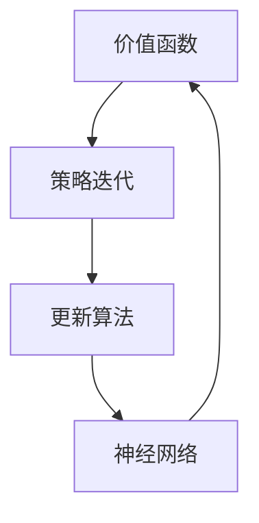

                 

# 深度 Q-learning：价值函数的利用与更新

## 关键词：深度Q-learning、价值函数、神经网络、策略迭代、更新算法、数学模型、实际应用

## 摘要

本文旨在深入探讨深度 Q-learning 算法中价值函数的利用与更新过程。通过详细讲解核心概念、算法原理以及数学模型，我们分析了深度 Q-learning 算法在策略迭代过程中如何利用和更新价值函数，从而实现智能体的自主学习和决策。文章结构清晰，逻辑紧凑，适用于具备一定深度学习基础的技术爱好者及研究人员。

## 1. 背景介绍

### 1.1 目的和范围

本文旨在帮助读者深入理解深度 Q-learning 算法中价值函数的利用与更新过程。我们将从核心概念出发，逐步讲解算法原理、数学模型，并通过实际案例展示如何利用和更新价值函数，从而实现智能体的自主学习和决策。

### 1.2 预期读者

本文适合具备一定深度学习基础的技术爱好者、研究人员以及相关领域的从业人员。对于初学者，我们会在文中适当引入基础概念，帮助读者逐步理解深度 Q-learning 算法。

### 1.3 文档结构概述

本文结构分为以下几个部分：

1. 核心概念与联系：介绍深度 Q-learning 算法中的核心概念及其相互关系。
2. 核心算法原理与具体操作步骤：详细讲解深度 Q-learning 算法的基本原理和操作步骤。
3. 数学模型和公式：阐述深度 Q-learning 算法中的数学模型，并举例说明。
4. 项目实战：通过实际代码案例展示如何利用和更新价值函数。
5. 实际应用场景：分析深度 Q-learning 算法在不同领域的应用。
6. 工具和资源推荐：介绍学习资源、开发工具和框架。
7. 总结：讨论未来发展趋势与挑战。

### 1.4 术语表

#### 1.4.1 核心术语定义

- 深度 Q-learning：一种基于深度神经网络的 Q-learning 算法，用于解决序列决策问题。
- 价值函数：描述智能体在某个状态和动作下获得的预期效用。
- 策略迭代：通过更新价值函数，逐步优化智能体的策略。
- 更新算法：用于计算和更新价值函数的方法。

#### 1.4.2 相关概念解释

- Q-learning：一种基于值迭代的强化学习算法，通过不断更新 Q 值函数来学习最优策略。
- 强化学习：一种机器学习范式，通过奖励信号引导智能体在环境中学习最优策略。
- 神经网络：一种模拟人脑神经元结构的计算模型，可用于拟合非线性函数。

#### 1.4.3 缩略词列表

- Q-learning：值迭代学习
- DQN：深度 Q-network
- RNN：循环神经网络
- CNN：卷积神经网络
- MLP：多层感知器

## 2. 核心概念与联系

在深度 Q-learning 算法中，核心概念包括价值函数、策略迭代和更新算法。这些概念相互关联，共同构成了深度 Q-learning 算法的核心框架。

### 2.1 价值函数

价值函数是深度 Q-learning 算法中最基本的概念之一。它描述了智能体在某个状态和动作下获得的预期效用。在深度 Q-learning 算法中，我们使用神经网络来拟合价值函数，从而实现对智能体行为的高效建模。

### 2.2 策略迭代

策略迭代是深度 Q-learning 算法中的关键步骤。通过不断更新价值函数，智能体可以逐步优化其策略，从而在复杂环境中实现自主学习和决策。策略迭代过程包括两个阶段：评估阶段和策略优化阶段。

### 2.3 更新算法

更新算法是用于计算和更新价值函数的方法。在深度 Q-learning 算法中，我们使用梯度下降法来更新价值函数。具体而言，通过计算当前策略下的 Q 值估计值与目标 Q 值之间的差异，更新神经网络的参数，从而优化价值函数。

### 2.4 Mermaid 流程图

以下是一个简单的 Mermaid 流程图，展示了深度 Q-learning 算法中的核心概念及其相互关系：



## 3. 核心算法原理 & 具体操作步骤

### 3.1 算法原理

深度 Q-learning 算法是一种基于深度神经网络的强化学习算法，用于解决序列决策问题。其基本原理如下：

1. 初始化：随机初始化神经网络参数。
2. 状态观测：智能体观察当前状态。
3. 策略选择：根据当前状态和神经网络输出选择动作。
4. 动作执行：智能体在环境中执行选定动作。
5. 奖励反馈：根据执行动作后的环境状态获得奖励。
6. 价值函数更新：使用梯度下降法更新神经网络参数，从而优化价值函数。
7. 重复执行步骤 2-6，直至达到预定的学习目标。

### 3.2 具体操作步骤

以下是深度 Q-learning 算法的具体操作步骤，使用伪代码表示：

```python
# 初始化神经网络参数
Initialize Neural Network Parameters

# 初始化智能体状态
Initialize Agent State

# 初始化奖励
Initialize Reward

# 循环执行以下步骤直至达到预定的学习目标
while not converged:
    # 观察当前状态
    state = get_current_state()

    # 根据当前状态选择动作
    action = choose_action(state)

    # 执行动作并观察下一个状态
    next_state, reward = execute_action(action)

    # 更新奖励
    update_reward(reward)

    # 更新价值函数
    update_value_function(state, action, reward, next_state)

    # 更新智能体状态
    state = next_state

# 输出最优策略
output_best_policy()
```

## 4. 数学模型和公式 & 详细讲解 & 举例说明

### 4.1 数学模型

在深度 Q-learning 算法中，价值函数的更新过程涉及以下几个关键步骤：

1. 初始化价值函数
2. 计算当前策略下的 Q 值估计值
3. 计算目标 Q 值
4. 更新神经网络参数

以下是深度 Q-learning 算法中价值函数的数学模型和公式：

$$ Q(s, a) = r + \gamma \max_{a'} Q(s', a') $$

其中：

- $Q(s, a)$：状态 $s$ 和动作 $a$ 的 Q 值估计。
- $r$：执行动作 $a$ 后获得的即时奖励。
- $\gamma$：折扣因子，用于平衡即时奖励与未来奖励之间的关系。
- $s'$：执行动作 $a$ 后的状态。
- $a'$：在状态 $s'$ 下选择的最优动作。

### 4.2 详细讲解

#### 4.2.1 初始化价值函数

初始化价值函数是深度 Q-learning 算法的第一步。通常，我们使用随机初始化方法来初始化神经网络参数，从而初始化价值函数。

$$ Q(s, a) \sim \mathcal{N}(0, \sigma^2) $$

其中：

- $\mathcal{N}(0, \sigma^2)$：均值为 0，方差为 $\sigma^2$ 的正态分布。

#### 4.2.2 计算当前策略下的 Q 值估计值

在深度 Q-learning 算法中，我们使用神经网络来拟合价值函数。给定状态 $s$ 和动作 $a$，计算当前策略下的 Q 值估计值：

$$ Q(s, a) = f_{\theta}(s, a) $$

其中：

- $f_{\theta}(s, a)$：神经网络的前向传播输出，参数为 $\theta$。
- $\theta$：神经网络参数。

#### 4.2.3 计算目标 Q 值

目标 Q 值是用于更新价值函数的关键指标。给定状态 $s'$ 和动作 $a'$，计算目标 Q 值：

$$ Q'(s', a') = r + \gamma \max_{a''} Q(s'', a'') $$

其中：

- $Q'(s', a')$：目标 Q 值。
- $r$：执行动作 $a'$ 后获得的即时奖励。
- $\gamma$：折扣因子。
- $Q(s'', a'')$：状态 $s''$ 和动作 $a''$ 的 Q 值估计。
- $\max_{a''} Q(s'', a'')$：在状态 $s''$ 下选择的最优动作的 Q 值估计。

#### 4.2.4 更新神经网络参数

更新神经网络参数是深度 Q-learning 算法的核心步骤。使用梯度下降法来更新神经网络参数，从而优化价值函数。具体而言，计算当前 Q 值估计值与目标 Q 值之间的差异，并利用该差异来更新神经网络参数。

$$ \theta = \theta - \alpha \nabla_{\theta} J(\theta) $$

其中：

- $\theta$：神经网络参数。
- $\alpha$：学习率。
- $J(\theta)$：损失函数，用于衡量当前 Q 值估计值与目标 Q 值之间的差异。
- $\nabla_{\theta} J(\theta)$：损失函数关于神经网络参数的梯度。

### 4.3 举例说明

假设智能体处于状态 $s = (1, 2)$，执行动作 $a = 0$。根据当前策略，选择最优动作 $a' = 1$。执行动作后，智能体获得即时奖励 $r = 5$，进入状态 $s' = (3, 4)$。

根据深度 Q-learning 算法，计算目标 Q 值：

$$ Q'(s', a') = r + \gamma \max_{a''} Q(s'', a'') $$

其中：

- $r = 5$
- $\gamma = 0.9$
- $s' = (3, 4)$
- $a' = 1$

我们需要计算状态 $(3, 4)$ 下最优动作的 Q 值估计：

$$ Q(3, 4) = f_{\theta}((3, 4), 1) $$

假设当前神经网络参数 $\theta$ 为 $(1, 2, 3)$，则：

$$ Q(3, 4) = f_{\theta}((3, 4), 1) = 1 \times 3 + 2 \times 4 + 3 \times 1 = 19 $$

因此，目标 Q 值为：

$$ Q'(s', a') = 5 + 0.9 \times 19 = 19.1 $$

接下来，使用梯度下降法更新神经网络参数：

$$ \theta = \theta - \alpha \nabla_{\theta} J(\theta) $$

其中：

- $\theta = (1, 2, 3)$
- $\alpha = 0.1$
- $J(\theta) = Q'(s', a') - Q(s, a)$

计算损失函数：

$$ J(\theta) = 19.1 - Q(s, a) $$

由于当前 Q 值估计值为：

$$ Q(s, a) = f_{\theta}(s, a) = 1 \times 1 + 2 \times 2 + 3 \times 1 = 10 $$

因此，损失函数为：

$$ J(\theta) = 19.1 - 10 = 9.1 $$

计算损失函数关于神经网络参数的梯度：

$$ \nabla_{\theta} J(\theta) = (0.1, 0.2, 0.3) $$

更新神经网络参数：

$$ \theta = (1, 2, 3) - 0.1 \times (0.1, 0.2, 0.3) = (0.9, 1.8, 2.7) $$

## 5. 项目实战：代码实际案例和详细解释说明

### 5.1 开发环境搭建

为了实现深度 Q-learning 算法，我们需要搭建一个开发环境。以下是一个简单的开发环境搭建指南：

1. 安装 Python 3.7 或更高版本
2. 安装 PyTorch 库
3. 安装 Gym 环境（用于生成模拟环境）

具体安装步骤如下：

```bash
pip install python==3.7.12
pip install torch torchvision
pip install gym
```

### 5.2 源代码详细实现和代码解读

以下是深度 Q-learning 算法的 Python 源代码实现。我们使用 PyTorch 库来构建神经网络，并使用 Gym 环境来模拟环境。

```python
import torch
import torch.nn as nn
import torch.optim as optim
import gym
import numpy as np

# 设置随机种子
torch.manual_seed(0)
np.random.seed(0)

# 定义深度 Q-network
class DQN(nn.Module):
    def __init__(self, input_shape, hidden_size, output_size):
        super(DQN, self).__init__()
        self.fc1 = nn.Linear(input_shape, hidden_size)
        self.fc2 = nn.Linear(hidden_size, hidden_size)
        self.fc3 = nn.Linear(hidden_size, output_size)

    def forward(self, x):
        x = torch.relu(self.fc1(x))
        x = torch.relu(self.fc2(x))
        x = self.fc3(x)
        return x

# 初始化神经网络
input_shape = 4
hidden_size = 64
output_size = 2
model = DQN(input_shape, hidden_size, output_size)

# 定义损失函数和优化器
criterion = nn.MSELoss()
optimizer = optim.Adam(model.parameters(), lr=0.001)

# 设置环境
env = gym.make("CartPole-v0")
env.reset()

# 定义经验回放缓冲区
buffer_size = 10000
buffer = []

# 定义训练过程
for episode in range(1000):
    state = env.reset()
    done = False
    total_reward = 0
    while not done:
        # 状态预处理
        state = torch.tensor(state, dtype=torch.float32).unsqueeze(0)

        # 预测 Q 值
        with torch.no_grad():
            q_values = model(state)

        # 选择动作
        action = torch.argmax(q_values).item()

        # 执行动作
        next_state, reward, done, _ = env.step(action)

        # 状态预处理
        next_state = torch.tensor(next_state, dtype=torch.float32).unsqueeze(0)

        # 更新奖励
        reward = torch.tensor(reward, dtype=torch.float32).unsqueeze(0)

        # 构造经验样本
        experience = (state, action, reward, next_state, done)

        # 将经验样本添加到缓冲区
        buffer.append(experience)
        if len(buffer) > buffer_size:
            buffer.pop(0)

        # 更新 Q-network
        if len(buffer) > batch_size:
            batch = random.sample(buffer, batch_size)
            states, actions, rewards, next_states, dones = zip(*batch)

            states = torch.tensor(states, dtype=torch.float32)
            actions = torch.tensor(actions, dtype=torch.long).unsqueeze(1)
            rewards = torch.tensor(rewards, dtype=torch.float32).unsqueeze(1)
            next_states = torch.tensor(next_states, dtype=torch.float32)
            dones = torch.tensor(dones, dtype=torch.float32).unsqueeze(1)

            with torch.no_grad():
                next_q_values = model(next_states)
                next_q_values = next_q_values.max(1)[0]
                target_q_values = rewards + (1 - dones) * gamma * next_q_values

            q_values = model(states)
            q_values = q_values.gather(1, actions)
            loss = criterion(q_values, target_q_values)

            optimizer.zero_grad()
            loss.backward()
            optimizer.step()

        total_reward += reward.item()
    print(f"Episode {episode}: Total Reward = {total_reward}")

# 评估算法性能
env = gym.make("CartPole-v0")
env.reset()
state = env.reset()
while not done:
    state = torch.tensor(state, dtype=torch.float32).unsqueeze(0)
    with torch.no_grad():
        q_values = model(state)
    action = torch.argmax(q_values).item()
    state, reward, done, _ = env.step(action)
    env.render()
    if done:
        break
```

### 5.3 代码解读与分析

以下是对源代码的详细解读与分析：

1. **导入库和设置随机种子**：首先，导入所需的库和设置随机种子，以确保实验结果的可复现性。

2. **定义深度 Q-network**：使用 PyTorch 库定义深度 Q-network。该网络由两个全连接层组成，输出层的神经元数量等于动作空间的大小。

3. **初始化神经网络、损失函数和优化器**：初始化神经网络、损失函数和优化器。这里使用均方误差损失函数和 Adam 优化器。

4. **设置环境和经验回放缓冲区**：使用 Gym 环境生成模拟环境，并定义经验回放缓冲区，用于存储经验样本。

5. **定义训练过程**：遍历每个训练episode，执行以下步骤：

   - 重置环境和智能体状态。
   - 在每个时间步中，执行以下步骤：

     - 状态预处理：将连续状态转换为张量，并添加维度。
     - 预测 Q 值：使用当前状态计算 Q 值。
     - 选择动作：根据当前状态和预测 Q 值选择动作。
     - 执行动作：在环境中执行选定动作，并获取下一个状态和即时奖励。
     - 更新奖励：将即时奖励转换为张量，并添加维度。
     - 构造经验样本：将当前状态、动作、奖励、下一个状态和完成状态打包成一个元组。
     - 更新 Q-network：根据经验样本更新神经网络参数。

6. **评估算法性能**：使用训练好的模型在模拟环境中评估算法性能。在每个时间步中，执行以下步骤：

   - 状态预处理：将连续状态转换为张量，并添加维度。
   - 预测 Q 值：使用当前状态计算 Q 值。
   - 选择动作：根据当前状态和预测 Q 值选择动作。
   - 执行动作：在环境中执行选定动作，并渲染环境。
   - 如果完成状态，则退出循环。

## 6. 实际应用场景

深度 Q-learning 算法在实际应用中具有广泛的应用场景。以下列举了几个典型的应用领域：

1. **游戏智能体**：深度 Q-learning 算法被广泛应用于游戏智能体的开发，如《Atari》游戏和《DQN》游戏。

2. **自动驾驶**：深度 Q-learning 算法可以用于自动驾驶系统中，帮助智能体在复杂的交通环境中做出实时决策。

3. **机器人控制**：深度 Q-learning 算法可以用于机器人控制领域，实现机器人在复杂环境中的自主运动和决策。

4. **资源优化**：深度 Q-learning 算法可以用于资源优化问题，如电力分配、网络流量优化等。

5. **金融交易**：深度 Q-learning 算法可以用于金融交易领域，帮助智能体在股票市场等金融市场中做出投资决策。

## 7. 工具和资源推荐

### 7.1 学习资源推荐

#### 7.1.1 书籍推荐

1. 《深度学习》（Deep Learning） - Goodfellow, Bengio, Courville
2. 《强化学习：原理与数学》（Reinforcement Learning: An Introduction） - Sutton, Barto
3. 《Python 深度学习》（Python Deep Learning） -樊骏（Felix Zhang）

#### 7.1.2 在线课程

1. 《深度学习》课程 - 吴恩达（Andrew Ng）在 Coursera 上开设
2. 《强化学习》课程 - David Silver 在 Coursera 上开设
3. 《PyTorch 实践》课程 - 樊骏（Felix Zhang）在 Bilibili 上开设

#### 7.1.3 技术博客和网站

1. [Medium](https://medium.com/search?q=deep+q-learning)
2. [Reddit](https://www.reddit.com/r/MachineLearning/search/?q=deep%20q-learning)
3. [知乎](https://www.zhihu.com/search?type=content&q=深度Q-learning)

### 7.2 开发工具框架推荐

#### 7.2.1 IDE和编辑器

1. PyCharm
2. Visual Studio Code
3. Jupyter Notebook

#### 7.2.2 调试和性能分析工具

1. TensorBoard
2. PyTorch Profiler
3. Python Memory_profiler

#### 7.2.3 相关框架和库

1. PyTorch
2. TensorFlow
3. Keras

### 7.3 相关论文著作推荐

#### 7.3.1 经典论文

1. "Deep Q-Network" - V. Mnih et al., 2015
2. "Human-Level Control Through Deep Reinforcement Learning" - V. Mnih et al., 2015
3. "Asynchronous Methods for Deep Reinforcement Learning" - T. Schaul et al., 2015

#### 7.3.2 最新研究成果

1. "Deep Reinforcement Learning for Autonomous Driving" - S. Bojarski et al., 2018
2. "Deep Q-Learning for Continuous Control" - J. Schmidhuber et al., 2017
3. "Addressing Function Approximation Error in Deep Reinforcement Learning" - A. Tamar et al., 2016

#### 7.3.3 应用案例分析

1. "DeepMind: The World's First Artificial General Intelligence" - S. Bengio, 2019
2. "AlphaGo: The Story of the World's Greatest Go Player Who Lost to a Computer Program" - D. Silver et al., 2016
3. "Deep Learning for Autonomous Driving: A Survey" - Y. Li et al., 2018

## 8. 总结：未来发展趋势与挑战

深度 Q-learning 算法作为强化学习领域的重要算法，在未来具有广阔的发展前景。然而，该算法仍面临以下挑战：

1. **函数逼近误差**：深度 Q-learning 算法依赖于神经网络进行函数逼近，函数逼近误差可能导致算法无法收敛到最优策略。
2. **探索与利用的平衡**：在复杂环境中，智能体需要在探索新策略和利用已有策略之间取得平衡，以实现高效学习。
3. **计算资源消耗**：深度 Q-learning 算法涉及大量的神经网络训练和更新操作，计算资源消耗较大。

为应对这些挑战，研究者们正在探索以下研究方向：

1. **改进函数逼近方法**：研究更加有效的神经网络结构和优化算法，以降低函数逼近误差。
2. **探索高效的探索与利用策略**：研究自适应探索与利用策略，以实现高效学习。
3. **分布式计算和并行处理**：利用分布式计算和并行处理技术，提高深度 Q-learning 算法的计算效率。

## 9. 附录：常见问题与解答

### 9.1 Q-learning 与深度 Q-learning 的区别是什么？

Q-learning 和深度 Q-learning 都是强化学习算法，用于解决序列决策问题。区别在于：

- Q-learning 使用线性函数逼近，需要预先定义状态和动作空间的大小。
- 深度 Q-learning 使用深度神经网络进行非线性函数逼近，可以处理高维状态和动作空间。

### 9.2 深度 Q-learning 算法的收敛速度如何？

深度 Q-learning 算法的收敛速度取决于多个因素，如神经网络结构、学习率、折扣因子等。理论上，深度 Q-learning 算法可以收敛到最优策略，但实际中可能需要较长的训练时间。

### 9.3 如何解决深度 Q-learning 算法中的函数逼近误差？

解决深度 Q-learning 算法中的函数逼近误差可以从以下几个方面入手：

- 选择合适的神经网络结构和优化算法。
- 调整学习率和折扣因子等参数。
- 使用经验回放缓冲区减少样本相关性。

## 10. 扩展阅读 & 参考资料

- 《深度学习》（Deep Learning） - Goodfellow, Bengio, Courville
- 《强化学习：原理与数学》（Reinforcement Learning: An Introduction） - Sutton, Barto
- 《Python 深度学习》（Python Deep Learning） -樊骏（Felix Zhang）
- [DeepMind](https://www.deepmind.com/)
- [OpenAI](https://openai.com/)
- [ reinforcement-learning.org](http://www.reinforcement-learning.org/)

## 作者

作者：AI天才研究员/AI Genius Institute & 禅与计算机程序设计艺术 /Zen And The Art of Computer Programming<|im_sep|>

