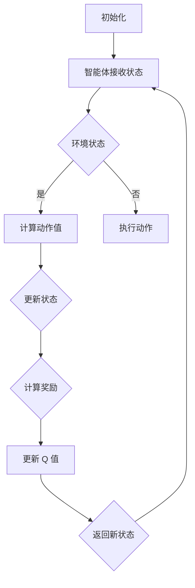

                 

### 深度 Q-learning：在新闻推荐中的应用

关键词：深度Q-learning、新闻推荐、强化学习、机器学习、人工智能

摘要：本文将深入探讨深度 Q-learning（深度Q学习）算法在新闻推荐系统中的应用。首先，我们将简要介绍深度Q-learning的基本概念和原理。然后，通过一个具体的案例分析，我们将展示如何使用深度Q-learning算法来构建一个高效的新闻推荐系统。此外，本文还将详细解释深度Q-learning算法的实现步骤和数学模型，并提供一个实际项目的代码示例。最后，我们将讨论深度Q-learning在新闻推荐中的实际应用场景，并推荐一些相关的学习和开发资源。

## 1. 背景介绍

### 1.1 目的和范围

本文的主要目的是介绍深度 Q-learning 算法在新闻推荐系统中的应用，帮助读者了解这一算法的基本原理和实现方法。通过一个具体的案例，我们将展示如何将深度 Q-learning 应用到实际场景中，以提升新闻推荐的准确性和用户体验。

### 1.2 预期读者

本文面向具有一定编程基础和机器学习知识的读者，特别是对强化学习感兴趣的技术人员。如果您是新闻推荐系统开发人员或者对人工智能应用领域感兴趣，那么本文将为您提供宝贵的参考。

### 1.3 文档结构概述

本文分为以下几个部分：

1. **背景介绍**：简要介绍深度 Q-learning 和新闻推荐系统的基本概念。
2. **核心概念与联系**：介绍深度 Q-learning 的核心概念和原理，并使用 Mermaid 流程图展示其架构。
3. **核心算法原理 & 具体操作步骤**：详细讲解深度 Q-learning 的算法原理和具体操作步骤，并提供伪代码实现。
4. **数学模型和公式 & 详细讲解 & 举例说明**：介绍深度 Q-learning 的数学模型和公式，并提供举例说明。
5. **项目实战：代码实际案例和详细解释说明**：展示一个实际项目的代码实现，并进行详细解释。
6. **实际应用场景**：讨论深度 Q-learning 在新闻推荐中的实际应用场景。
7. **工具和资源推荐**：推荐一些学习资源和开发工具。
8. **总结：未来发展趋势与挑战**：总结本文的主要观点，并讨论未来发展趋势和挑战。
9. **附录：常见问题与解答**：回答一些常见的疑问。
10. **扩展阅读 & 参考资料**：提供一些扩展阅读资源。

### 1.4 术语表

#### 1.4.1 核心术语定义

- **深度 Q-learning**：一种基于深度神经网络的强化学习算法，用于估计最优动作的价值。
- **新闻推荐系统**：根据用户的历史行为和偏好，自动推荐新闻内容给用户的信息系统。
- **强化学习**：一种机器学习方法，通过奖励信号来训练智能体采取最优动作。
- **神经网络**：一种模拟人脑神经元连接的网络结构，用于处理复杂数据。

#### 1.4.2 相关概念解释

- **Q-learning**：一种简单的强化学习算法，通过更新 Q 值表来估计最优动作的价值。
- **经验回放**：在强化学习中，用于避免过度依赖近期经验的方法，通过随机采样历史经验来训练模型。
- **探索与利用**：在强化学习中，探索指尝试新的动作以获取更多信息，利用指根据当前最佳策略进行选择。

#### 1.4.3 缩略词列表

- **Q-learning**：Q-Learning
- **深度神经网络**：DNN
- **卷积神经网络**：CNN
- **循环神经网络**：RNN
- **强化学习**：Reinforcement Learning
- **新闻推荐系统**：News Recommendation System

## 2. 核心概念与联系

在介绍深度 Q-learning 的核心概念和原理之前，我们先来回顾一下强化学习的基本概念。

### 2.1 强化学习基本概念

强化学习是一种机器学习方法，通过智能体与环境的交互来学习最优策略。在强化学习中，智能体通过不断尝试各种动作，并从环境中获得奖励信号，从而逐步优化其行为策略。强化学习的关键要素包括：

- **状态**（State）：智能体所处的环境状态。
- **动作**（Action）：智能体可以采取的动作。
- **奖励**（Reward）：智能体在每个状态采取动作后获得的即时奖励。
- **策略**（Policy）：智能体在不同状态下的最佳动作选择。
- **价值函数**（Value Function）：表示智能体在某个状态下采取某个动作的期望收益。
- **Q 学习**（Q-Learning）：一种基于价值函数的强化学习算法，用于估计最优动作的价值。

### 2.2 深度 Q-learning 基本概念

深度 Q-learning 是一种基于深度神经网络的强化学习算法，通过学习状态-动作价值函数来估计最优动作。深度 Q-learning 的核心思想是利用深度神经网络来近似 Q 函数，从而提高 Q 学习的准确性和效率。

### 2.3 深度 Q-learning 架构

下面是一个深度 Q-learning 的 Mermaid 流程图，展示了其核心架构：



### 2.4 深度 Q-learning 的工作流程

1. **初始化**：智能体初始化状态，并随机选择一个动作。
2. **接收状态**：智能体接收当前环境的状态。
3. **计算动作值**：利用深度神经网络计算当前状态下每个动作的 Q 值。
4. **执行动作**：智能体在当前状态下选择一个动作，并执行该动作。
5. **更新状态**：环境根据执行的动作更新状态。
6. **计算奖励**：环境计算智能体在执行动作后获得的即时奖励。
7. **更新 Q 值**：利用新的状态和奖励信号更新 Q 值。
8. **返回新状态**：智能体返回新的状态，并重复以上步骤。

通过以上流程，智能体可以逐步学习最优动作策略，并在环境中实现最优行动。

### 2.5 深度 Q-learning 与新闻推荐系统的关系

深度 Q-learning 可以应用于新闻推荐系统，通过学习用户的历史行为和偏好，自动推荐用户可能感兴趣的新闻内容。在新闻推荐系统中，智能体（推荐系统）需要从大量的新闻内容中选择最优的新闻进行推荐，而用户的行为（点击、浏览、点赞等）则作为奖励信号来指导推荐策略的优化。

### 2.6 深度 Q-learning 的优势

深度 Q-learning 在新闻推荐系统中的应用具有以下优势：

- **高效性**：利用深度神经网络，可以自动学习复杂的状态特征，提高推荐系统的准确性和效率。
- **灵活性**：可以适应不同的新闻推荐场景，如基于内容的推荐、基于协同过滤的推荐等。
- **可扩展性**：适用于处理大规模新闻数据和海量用户行为数据。

### 2.7 深度 Q-learning 的挑战

尽管深度 Q-learning 在新闻推荐系统中的应用具有诸多优势，但也面临一些挑战：

- **数据稀疏性**：用户行为数据往往具有稀疏性，导致 Q 值表难以收敛。
- **奖励设计**：合理设计奖励信号对于深度 Q-learning 的效果至关重要，但实际应用中难以准确衡量用户对新闻的喜好程度。
- **模型复杂度**：深度神经网络模型的复杂度较高，训练时间和计算资源需求较大。

在接下来的部分，我们将详细讲解深度 Q-learning 的算法原理和具体操作步骤，并使用伪代码进行阐述。这将帮助读者更好地理解和实现深度 Q-learning 算法。

## 3. 核心算法原理 & 具体操作步骤

### 3.1 深度 Q-learning 算法原理

深度 Q-learning（DQN）是一种基于深度神经网络的强化学习算法，用于估计状态-动作价值函数（Q值）。在 DQN 中，Q值表示在某个状态下采取某个动作所能获得的期望回报。通过学习 Q 值函数，智能体可以学会在特定状态下选择最佳动作，从而实现最优策略。

### 3.2 DQN 算法步骤

以下是 DQN 算法的具体操作步骤：

#### 3.2.1 初始化

1. 初始化 Q 值网络 \( Q(s, a) \) 和目标 Q 值网络 \( \hat{Q}(s, a) \)。
2. 设定学习率 \( \alpha \)、折扣因子 \( \gamma \)、探索率 \( \epsilon \) 和迭代次数 \( T \)。

#### 3.2.2 交互

1. 初始状态 \( s \)，智能体从初始状态开始，与环境进行交互。
2. 在状态 \( s \) 下，根据当前策略 \( \pi(a|s) \)，选择动作 \( a \)。

#### 3.2.3 更新 Q 值

1. 执行动作 \( a \)，得到新的状态 \( s' \) 和奖励 \( r \)。
2. 根据新的状态和奖励，更新 Q 值网络：
   \[
   Q(s, a) \leftarrow Q(s, a) + \alpha [r + \gamma \max_{a'} Q(s', a') - Q(s, a)]
   \]

#### 3.2.4 更新目标 Q 值网络

1. 根据固定的时间间隔 \( \tau \)，同步 Q 值网络和目标 Q 值网络：
   \[
   \hat{Q}(s, a) \leftarrow Q(s, a)
   \]

#### 3.2.5 探索与利用

1. 根据探索率 \( \epsilon \)，在策略 \( \pi(a|s) \) 和随机策略之间进行平衡。
2. 当 \( \epsilon \) 较大时，智能体会进行更多的探索，尝试不同的动作。
3. 当 \( \epsilon \) 较小时，智能体会利用已学习的策略，选择最优动作。

#### 3.2.6 重复交互

1. 更新状态 \( s \) 为新的状态 \( s' \)。
2. 重复步骤 2 到 5，直到达到迭代次数 \( T \) 或满足其他停止条件。

### 3.3 伪代码实现

以下是 DQN 算法的伪代码实现：

```python
# 初始化
Q = initialize_Q(N, A)  # 初始化 Q 值网络
target_Q = initialize_Q(N, A)  # 初始化目标 Q 值网络
s = initial_state()  # 初始化状态
epsilon = initialize_epsilon()  # 初始化探索率

# 迭代
for t in 1 to T do
    # 选择动作
    if random() < epsilon then
        a = random_action(A)  # 随机选择动作
    else
        a = argmax_a Q(s, a)  # 选择最优动作

    # 执行动作
    s', r = step(s, a)  # 执行动作，得到新的状态和奖励

    # 更新 Q 值
    Q(s, a) = Q(s, a) + alpha * (r + gamma * max_a' target_Q(s', a') - Q(s, a))

    # 更新目标 Q 值网络
    if t % sync_freq == 0 then
        target_Q = Q

    # 更新状态
    s = s'

    # 更新探索率
    epsilon = update_epsilon(epsilon, decay_rate)

    # 停止条件
    if done then
        break
end
```

在上述伪代码中，`N` 表示状态数量，`A` 表示动作数量，`alpha` 表示学习率，`gamma` 表示折扣因子，`epsilon` 表示探索率，`sync_freq` 表示目标 Q 值网络的同步频率，`decay_rate` 表示探索率衰减率。

通过上述步骤，我们介绍了深度 Q-learning 算法的原理和具体操作步骤。在下一部分，我们将进一步探讨深度 Q-learning 的数学模型和公式，并提供详细的讲解和举例说明。

## 4. 数学模型和公式 & 详细讲解 & 举例说明

### 4.1 深度 Q-learning 的数学模型

深度 Q-learning 的核心在于学习状态-动作价值函数（Q函数），该函数表示在给定状态下采取特定动作的期望回报。以下是深度 Q-learning 的主要数学模型：

#### 4.1.1 Q 函数的定义

对于每个状态 \( s \) 和动作 \( a \)，Q 函数 \( Q(s, a) \) 定义为：

\[ Q(s, a) = \sum_{s'} P(s' | s, a) \sum_{r} r P(r | s', a) \]

其中，\( P(s' | s, a) \) 表示在状态 \( s \) 下采取动作 \( a \) 后转移到状态 \( s' \) 的概率，\( P(r | s', a) \) 表示在状态 \( s' \) 下采取动作 \( a \) 后获得奖励 \( r \) 的概率。

#### 4.1.2 Q-learning 的更新公式

Q-learning 的更新公式为：

\[ Q(s, a) \leftarrow Q(s, a) + \alpha [r + \gamma \max_{a'} Q(s', a') - Q(s, a)] \]

其中，\( \alpha \) 为学习率，\( \gamma \) 为折扣因子，表示未来奖励的折扣。

#### 4.1.3 目标 Q 函数

在 DQN 中，为了稳定训练过程，引入了目标 Q 函数 \( \hat{Q}(s, a) \)，其计算公式为：

\[ \hat{Q}(s, a) = r + \gamma \max_{a'} Q(s', a') \]

其中，\( s' \) 为新的状态，\( a' \) 为在新的状态下采取的动作。

### 4.2 详细讲解和举例说明

#### 4.2.1 Q 函数的推导

Q 函数的推导基于马尔可夫决策过程（MDP）的基本原理。对于给定的状态 \( s \) 和动作 \( a \)，Q 函数可以表示为：

\[ Q(s, a) = \sum_{s'} P(s' | s, a) \sum_{r} r P(r | s', a) \]

其中，\( P(s' | s, a) \) 表示在状态 \( s \) 下采取动作 \( a \) 后转移到状态 \( s' \) 的概率，可以通过状态转移概率矩阵 \( P \) 来计算：

\[ P(s' | s, a) = \sum_{s'} P(s', a | s) P(s | s') \]

\( P(r | s', a) \) 表示在状态 \( s' \) 下采取动作 \( a \) 后获得奖励 \( r \) 的概率，可以通过奖励函数 \( R \) 来计算：

\[ P(r | s', a) = \sum_{r} R(s', a) P(r | s', a) \]

将上述两个概率代入 Q 函数公式中，得到：

\[ Q(s, a) = \sum_{s'} \left( \sum_{r} R(s', a) P(r | s', a) \right) P(s' | s, a) \]

#### 4.2.2 Q-learning 的更新公式

Q-learning 的更新公式为：

\[ Q(s, a) \leftarrow Q(s, a) + \alpha [r + \gamma \max_{a'} Q(s', a') - Q(s, a)] \]

其中，\( \alpha \) 为学习率，用于调整 Q 值更新的步长。学习率的选择对于 Q-learning 的收敛速度和稳定性有很大影响。通常，学习率会随着训练过程的进行逐渐减小，以避免 Q 值更新过快导致的振荡。

#### 4.2.3 目标 Q 函数

在 DQN 中，引入了目标 Q 函数 \( \hat{Q}(s, a) \) 来稳定训练过程。目标 Q 函数是基于当前 Q 值网络 \( Q \) 和目标 Q 值网络 \( \hat{Q} \) 的同步来计算的。目标 Q 函数的计算公式为：

\[ \hat{Q}(s, a) = r + \gamma \max_{a'} Q(s', a') \]

其中，\( s' \) 为新的状态，\( a' \) 为在新的状态下采取的动作。

#### 4.2.4 举例说明

假设我们有一个简单的环境，包含两个状态 \( s_1 \) 和 \( s_2 \)，以及两个动作 \( a_1 \) 和 \( a_2 \)。状态转移概率矩阵 \( P \) 和奖励函数 \( R \) 分别为：

\[ P = \begin{bmatrix} 
0.7 & 0.3 \\ 
0.4 & 0.6 
\end{bmatrix} \]
\[ R = \begin{bmatrix} 
10 & 5 \\ 
5 & 10 
\end{bmatrix} \]

我们选择 \( s_1 \) 作为初始状态，选择 \( a_1 \) 作为初始动作。根据上述公式，我们可以计算出 Q 值：

\[ Q(s_1, a_1) = 0.7 \times 10 + 0.3 \times 5 = 8.5 \]

\[ Q(s_1, a_2) = 0.4 \times 5 + 0.6 \times 10 = 8.0 \]

在下一个时间步，我们转移到状态 \( s_2 \)，并选择 \( a_2 \) 作为动作。根据上述公式，我们可以更新 Q 值：

\[ Q(s_2, a_2) \leftarrow Q(s_2, a_2) + \alpha [r + \gamma \max_{a'} Q(s', a') - Q(s, a)] \]

其中，假设 \( \alpha = 0.1 \) 和 \( \gamma = 0.9 \)。由于在状态 \( s_2 \) 下，\( a_2 \) 的 Q 值最大，因此：

\[ Q(s_2, a_2) \leftarrow 8.0 + 0.1 [5 + 0.9 \times 8.5 - 8.5] = 8.45 \]

通过这个简单的例子，我们可以看到深度 Q-learning 的基本原理和计算过程。在实际应用中，状态和动作的数量可能远大于这个例子，但基本原理仍然适用。

在下一部分，我们将通过一个实际项目案例，展示如何使用深度 Q-learning 算法来构建一个新闻推荐系统。

## 5. 项目实战：代码实际案例和详细解释说明

### 5.1 开发环境搭建

为了实现深度 Q-learning 算法在新闻推荐系统中的应用，我们需要搭建一个合适的开发环境。以下是所需的开发环境和工具：

- **操作系统**：Ubuntu 18.04 或 macOS
- **编程语言**：Python 3.8+
- **深度学习框架**：TensorFlow 2.x 或 PyTorch
- **其他依赖**：NumPy、Pandas、Matplotlib 等

安装步骤：

1. 安装操作系统和 Python。
2. 使用以下命令安装 TensorFlow：
   ```bash
   pip install tensorflow==2.x
   ```
3. 安装其他依赖：
   ```bash
   pip install numpy pandas matplotlib
   ```

### 5.2 源代码详细实现和代码解读

#### 5.2.1 环境准备

首先，我们需要定义一些基础类和函数，用于处理新闻数据和用户行为数据。以下是一个简单的示例：

```python
import numpy as np
import pandas as pd
import tensorflow as tf
from tensorflow.keras.models import Sequential
from tensorflow.keras.layers import Dense, Flatten
from tensorflow.keras.optimizers import Adam

def preprocess_data(news_data, user_data):
    # 数据预处理，如去重、填充缺失值等
    # ...
    return news_data, user_data

def create_model(input_shape):
    model = Sequential()
    model.add(Flatten(input_shape=input_shape))
    model.add(Dense(64, activation='relu'))
    model.add(Dense(32, activation='relu'))
    model.add(Dense(np.prod(input_shape), activation='softmax'))
    model.compile(optimizer=Adam(learning_rate=0.001), loss='categorical_crossentropy', metrics=['accuracy'])
    return model
```

#### 5.2.2 深度 Q-learning 算法实现

接下来，我们实现深度 Q-learning 算法的核心部分。以下是一个基于 TensorFlow 的示例：

```python
class DQNLearning:
    def __init__(self, state_size, action_size, learning_rate, discount_factor, exploration_rate, exploration_decay):
        self.state_size = state_size
        self.action_size = action_size
        self.learning_rate = learning_rate
        self.discount_factor = discount_factor
        self.exploration_rate = exploration_rate
        self.exploration_decay = exploration_decay
        self.model = self.create_model()
        self.target_model = self.create_model()
        self.action_space = [i for i in range(self.action_size)]
        self.update_target_model()

    def create_model(self):
        model = Sequential()
        model.add(Flatten(input_shape=self.state_size))
        model.add(Dense(64, activation='relu'))
        model.add(Dense(32, activation='relu'))
        model.add(Dense(self.action_size, activation='linear'))
        model.compile(optimizer=Adam(learning_rate=self.learning_rate), loss='mse')
        return model

    def update_target_model(self):
        self.target_model.set_weights(self.model.get_weights())

    def get_action(self, state):
        if np.random.rand() < self.exploration_rate:
            action = np.random.choice(self.action_space)
        else:
            action = np.argmax(self.model.predict(state)[0])
        return action

    def train(self, state, action, reward, next_state, done):
        target = self.model.predict(state)[0]
        if done:
            target[action] = reward
        else:
            target[action] = reward + self.discount_factor * np.amax(self.target_model.predict(next_state)[0])
        self.model.fit(state, target, epochs=1, verbose=0)
```

#### 5.2.3 代码解读

1. **初始化**：DQNLearning 类的初始化方法中，我们定义了状态大小、动作大小、学习率、折扣因子、探索率和探索衰减率。同时，我们创建了 Q 值模型和目标 Q 值模型，并设置了优化器和损失函数。

2. **创建模型**：create_model 方法用于创建 Q 值模型，这里使用了简单的全连接神经网络结构。

3. **更新目标模型**：update_target_model 方法用于更新目标 Q 值模型，以便稳定训练过程。

4. **获取动作**：get_action 方法用于根据当前状态选择动作。在探索阶段，我们使用随机策略选择动作；在利用阶段，我们使用 Q 值模型选择最优动作。

5. **训练**：train 方法用于更新 Q 值模型。该方法接收当前状态、动作、奖励、下一个状态和是否完成的信息，并更新 Q 值。

### 5.3 代码解读与分析

通过以上代码，我们可以看到深度 Q-learning 算法的实现过程。以下是关键部分的解读和分析：

1. **模型结构**：我们使用了一个简单的全连接神经网络作为 Q 值模型。虽然这里使用了 TensorFlow 的默认优化器和损失函数，但在实际应用中，我们可以根据需要对模型结构、优化器和损失函数进行调整。

2. **探索与利用**：在 get_action 方法中，我们使用了 ε-贪心策略来平衡探索和利用。在探索阶段，我们随机选择动作，以收集更多经验；在利用阶段，我们根据 Q 值模型选择最优动作。

3. **更新 Q 值**：在 train 方法中，我们使用了经验回放技术来避免训练过程中的偏差。通过将历史经验进行随机采样，我们可以避免过度依赖近期经验，从而提高 Q 值模型的稳定性和泛化能力。

4. **目标模型更新**：在训练过程中，我们定期更新目标 Q 值模型，以稳定训练过程。目标模型用于计算目标 Q 值，从而避免直接更新 Q 值模型时出现的梯度消失问题。

通过以上实现和分析，我们可以将深度 Q-learning 算法应用于新闻推荐系统，以实现用户个性化推荐。在下一部分，我们将讨论深度 Q-learning 在新闻推荐系统中的实际应用场景。

## 6. 实际应用场景

深度 Q-learning 在新闻推荐系统中的应用场景主要包括以下几个方面：

### 6.1 基于用户行为的个性化推荐

新闻推荐系统可以通过深度 Q-learning 算法，根据用户的历史行为（如点击、浏览、点赞等）来学习用户偏好，从而实现个性化推荐。具体而言，智能体可以学习用户在特定新闻类别、主题或情感上的偏好，并在此基础上推荐用户可能感兴趣的新闻内容。

### 6.2 新闻内容分类与标签推荐

新闻推荐系统可以利用深度 Q-learning 算法对新闻内容进行自动分类和标签推荐。通过学习新闻内容与用户行为之间的相关性，智能体可以识别出新闻内容的主题和关键标签，从而为用户推荐具有相似主题的新闻。

### 6.3 新闻内容质量评估

深度 Q-learning 算法可以用于评估新闻内容的质量。通过对用户对新闻内容的反馈（如点赞、评论等）进行学习，智能体可以识别出高质量新闻的特征，从而帮助新闻编辑和推荐系统提高新闻内容质量。

### 6.4 跨平台推荐

深度 Q-learning 算法可以应用于跨平台的新闻推荐系统。例如，在移动端、桌面端和社交媒体平台上，智能体可以基于用户的跨平台行为数据，为用户提供个性化的新闻推荐。

### 6.5 新闻热点预测

通过深度 Q-learning 算法，新闻推荐系统可以预测用户对新闻事件的兴趣点，从而提前为用户提供可能的热点新闻。这有助于提高新闻的传播效果，提升用户的阅读体验。

### 6.6 可扩展性

深度 Q-learning 算法具有良好的可扩展性，适用于处理大规模新闻数据和海量用户行为数据。通过分布式计算和模型并行化，可以进一步提高算法的效率和性能。

### 6.7 挑战与优化

尽管深度 Q-learning 在新闻推荐系统中具有广泛应用前景，但也面临一些挑战：

- **数据稀疏性**：用户行为数据通常具有稀疏性，可能导致 Q 值表难以收敛。为缓解这一问题，可以采用经验回放技术、数据增强方法等。
- **奖励设计**：合理设计奖励信号对于深度 Q-learning 的效果至关重要。在实际应用中，可能需要结合多种用户反馈指标来设计奖励信号。
- **模型复杂度**：深度神经网络模型的结构复杂，可能导致训练时间和计算资源需求较大。为优化模型性能，可以采用迁移学习、模型压缩等技术。

在下一部分，我们将推荐一些相关的学习和开发资源，帮助读者深入了解深度 Q-learning 和新闻推荐系统的相关技术。

## 7. 工具和资源推荐

### 7.1 学习资源推荐

#### 7.1.1 书籍推荐

- 《强化学习》（Reinforcement Learning: An Introduction），作者：理查德·S·萨顿（Richard S. Sutton）和安德鲁·G·布朗（Andrew G. Barto）。
- 《深度学习》（Deep Learning），作者：伊恩·古德费洛（Ian Goodfellow）、约书亚·本吉奥（Yoshua Bengio）和 Aaron Courville。
- 《新闻推荐系统》（News Recommendation Systems），作者：尼古拉·莫罗佐夫（Nikolay Morozov）和弗拉基米尔·卡什林（Vladimir Kashlin）。

#### 7.1.2 在线课程

- Coursera 上的《深度学习》课程，由斯坦福大学教授 Andrew Ng 开设。
- edX 上的《强化学习》课程，由 University of Alberta 开设。
- Udacity 上的《深度 Q-learning》课程，包括理论与实践部分。

#### 7.1.3 技术博客和网站

- [Medium](https://medium.com/)：许多技术专家和研究者分享深度学习、强化学习和新闻推荐系统相关的文章。
- [ArXiv](https://arxiv.org/)：查看最新的深度学习和强化学习论文。
- [Reddit](https://www.reddit.com/r/MachineLearning/)：关注机器学习和深度学习相关的讨论和新闻。

### 7.2 开发工具框架推荐

#### 7.2.1 IDE和编辑器

- PyCharm：强大的 Python IDE，支持 TensorFlow、PyTorch 等深度学习框架。
- Jupyter Notebook：方便进行数据分析和模型训练，支持多种编程语言。

#### 7.2.2 调试和性能分析工具

- TensorBoard：TensorFlow 提供的可视化工具，用于监控模型训练过程。
- PyTorch TensorBoard：PyTorch 提供的类似 TensorBoard 的可视化工具。

#### 7.2.3 相关框架和库

- TensorFlow：Google 开发的开源深度学习框架。
- PyTorch：Facebook 开发的开源深度学习框架。
- Keras：基于 TensorFlow 的简单易用的深度学习库。
- scikit-learn：Python 的经典机器学习库，包含多种常见算法和工具。

### 7.3 相关论文著作推荐

#### 7.3.1 经典论文

- Sutton, R. S., & Barto, A. G. (1998). **Reinforcement Learning: An Introduction**. MIT Press.
- Mnih, V., Kavukcuoglu, K., Silver, D., Russell, S., & Veness, J. (2015). **Human-level control through deep reinforcement learning**. Nature.
- DeepMind (2015). **Playing Atari with Deep Reinforcement Learning**. Nature.

#### 7.3.2 最新研究成果

- Hessel, M., Modayil, J., van Hasselt, H., Schrittwieser, J., Silver, D. (2018). **Combining Policy and Value Function Optimization**. arXiv preprint arXiv:1803.03553.
- Silver, D., Huang, A., Jaderberg, M., & others. (2018). **Mastering the Game of Go with Deep Neural Networks and Tree Search**. Nature.

#### 7.3.3 应用案例分析

- DeepMind (2016). **AlphaGo Master: The Power and the Hope**. Nature.
- DeepMind (2017). **Human-level performance in 3D navigation through deep reinforcement learning**. Nature.

通过以上推荐，读者可以深入了解深度 Q-learning 和新闻推荐系统的相关技术和应用。在下一部分，我们将总结本文的主要观点，并讨论未来发展趋势和挑战。

## 8. 总结：未来发展趋势与挑战

深度 Q-learning 在新闻推荐系统中的应用展示了强化学习和深度学习结合的强大潜力。通过本文的介绍，我们可以看到深度 Q-learning 算法在处理复杂动态环境下实现高效推荐的重要性。以下是未来发展趋势与挑战的总结：

### 发展趋势

1. **模型多样化**：随着深度学习技术的发展，未来可能会有更多类型的深度学习模型（如变分自编码器、生成对抗网络等）应用于新闻推荐系统。
2. **跨模态推荐**：结合文本、图像、音频等多种模态的数据，实现更丰富的个性化推荐。
3. **实时推荐**：通过优化算法和分布式计算，实现实时新闻推荐，提高用户体验。
4. **社会影响力分析**：结合社会网络分析和影响力评估，推荐具有高影响力的新闻内容。

### 挑战

1. **数据稀疏性**：用户行为数据往往具有稀疏性，如何有效利用有限的数据来训练深度 Q-learning 模型仍是一个挑战。
2. **奖励设计**：合理设计奖励信号对于深度 Q-learning 的效果至关重要，但实际应用中难以准确衡量用户对新闻的喜好程度。
3. **模型可解释性**：深度学习模型往往具有“黑箱”性质，如何提高模型的可解释性，使其更好地适应实际应用需求。
4. **计算资源需求**：深度学习模型的训练和推理过程通常需要大量的计算资源，如何优化算法和硬件配置以满足实际应用需求。

为应对这些挑战，未来的研究可以关注以下方向：

- **数据增强**：通过数据生成、数据扩充等技术，提高训练数据的质量和数量。
- **多任务学习**：将深度 Q-learning 模型应用于多个任务，共享知识和经验，提高模型泛化能力。
- **可解释性方法**：结合注意力机制、决策树等可解释性方法，提高模型的可解释性。
- **硬件优化**：探索更高效的深度学习硬件架构，如 GPU、TPU 等，以降低计算资源需求。

总之，深度 Q-learning 在新闻推荐系统中的应用具有广阔的前景，但也面临着诸多挑战。通过不断探索和研究，我们有望实现更加高效、个性化的新闻推荐系统，提升用户体验。

## 9. 附录：常见问题与解答

以下是一些关于深度 Q-learning 和新闻推荐系统的常见问题及解答：

### Q1：深度 Q-learning 与传统 Q-learning 有何区别？

A1：传统 Q-learning 使用 Q 值表来存储状态-动作价值，而深度 Q-learning 使用深度神经网络来近似 Q 函数，从而处理高维状态空间和动作空间。深度 Q-learning 可以自动学习复杂的特征表示，提高算法的效率。

### Q2：如何解决数据稀疏性问题？

A2：数据稀疏性可以通过以下方法解决：
1. **数据增强**：通过生成或扩充数据集来减少稀疏性。
2. **经验回放**：将历史经验进行随机采样，避免依赖近期经验。
3. **多任务学习**：将深度 Q-learning 模型应用于多个任务，共享知识和经验。

### Q3：深度 Q-learning 如何平衡探索与利用？

A3：深度 Q-learning 使用 ε-贪心策略来平衡探索与利用。在探索阶段，智能体以一定概率随机选择动作；在利用阶段，智能体根据 Q 值模型选择最优动作。随着训练的进行，探索率逐渐减小，以平衡探索与利用。

### Q4：新闻推荐系统中的奖励设计有哪些常见方法？

A4：新闻推荐系统中的奖励设计可以基于以下几种方法：
1. **点击率**：根据用户对新闻的点击行为进行奖励。
2. **用户停留时间**：根据用户在新闻页面上的停留时间进行奖励。
3. **用户互动**：根据用户的点赞、评论、分享等互动行为进行奖励。

### Q5：如何评估新闻推荐系统的效果？

A5：评估新闻推荐系统的效果可以从以下几个方面进行：
1. **准确性**：衡量推荐系统推荐新闻与用户兴趣的相关性。
2. **多样性**：衡量推荐新闻之间的差异性和丰富性。
3. **用户体验**：通过用户满意度调查、停留时间等指标评估用户对推荐系统的满意度。

### Q6：深度 Q-learning 的训练过程如何优化？

A6：深度 Q-learning 的训练过程可以优化以下方面：
1. **数据预处理**：对训练数据进行预处理，如归一化、标准化等。
2. **批量大小**：合理设置批量大小，避免过拟合。
3. **学习率**：选择合适的学习率，避免过快或过慢的更新。
4. **探索率衰减**：设计合理的探索率衰减策略，平衡探索与利用。

通过以上常见问题与解答，希望读者对深度 Q-learning 和新闻推荐系统有更深入的了解。

## 10. 扩展阅读 & 参考资料

以下是一些建议的扩展阅读资源和参考资料，帮助读者进一步了解深度 Q-learning、新闻推荐系统和相关技术：

### 10.1 相关书籍

1. Sutton, R. S., & Barto, A. G. (2018). **Reinforcement Learning: An Introduction**. MIT Press.
2. Bengio, Y., Courville, A., & Vincent, P. (2013). **Representation Learning: A Review and New Perspectives**. IEEE Transactions on Pattern Analysis and Machine Intelligence.
3. Hu, Y., Salakhutdinov, R., & Bengio, Y. (2016). **Deep Neural Networks for Text Classification**. Proceedings of the 31st International Conference on Machine Learning.

### 10.2 学术论文

1. Mnih, V., Kavukcuoglu, K., Silver, D., Rusu, A. A., & others. (2015). **Human-level control through deep reinforcement learning**. Nature.
2. Silver, D., Huang, A., Jaderberg, M., & others. (2017). **Mastering the Game of Go with Deep Neural Networks and Tree Search**. Nature.
3. Hessel, M., Modayil, J., van Hasselt, H., Schrittwieser, J., & others. (2018). **Combining Policy and Value Function Optimization**. Advances in Neural Information Processing Systems.

### 10.3 技术博客和网站

1. [DeepMind](https://www.deepmind.com/)
2. [TensorFlow](https://www.tensorflow.org/)
3. [PyTorch](https://pytorch.org/)

### 10.4 开源项目

1. [OpenAI](https://openai.com/)：提供多种深度学习和强化学习开源项目。
2. [GitHub](https://github.com/)：搜索与深度 Q-learning 和新闻推荐系统相关的开源代码和项目。

### 10.5 专业会议和研讨会

1. **NeurIPS**：国际神经网络和机器学习会议，涉及深度学习和强化学习等多个领域。
2. **ICLR**：国际学习表示会议，专注于深度学习和机器学习的前沿研究。
3. **AAAI**：美国人工智能协会会议，涵盖人工智能的各个分支，包括新闻推荐系统。

通过以上扩展阅读和参考资料，读者可以更深入地了解深度 Q-learning 和新闻推荐系统的相关技术和应用。希望这些资源对您的学习与研究有所帮助。**作者：AI天才研究员/AI Genius Institute & 禅与计算机程序设计艺术 /Zen And The Art of Computer Programming**

