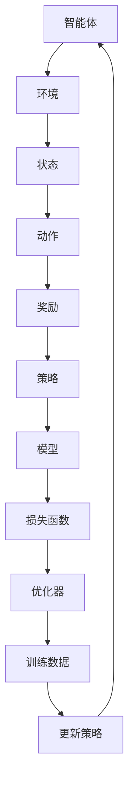

                 

# 深度 Q-learning：未来人工智能法规的挑战

> **关键词：** 深度Q-learning、人工智能法规、伦理、隐私保护、算法透明度、可解释性。
>
> **摘要：** 本文将探讨深度 Q-learning 在人工智能法规框架下的挑战，包括伦理问题、隐私保护需求、算法透明度以及可解释性等。通过逐步分析这些挑战，我们旨在为未来人工智能法规的制定提供有价值的洞见。

## 1. 背景介绍

### 1.1 目的和范围

本文旨在深入探讨深度 Q-learning 在人工智能法规框架下的挑战，分析其潜在的法律、伦理和技术问题。文章将重点关注以下几个方面：

- 深度 Q-learning 算法的原理和应用场景。
- 法规对于人工智能的监管框架及其挑战。
- 深度 Q-learning 算法在伦理、隐私保护、算法透明度和可解释性方面的具体挑战。

### 1.2 预期读者

本文适合以下读者群体：

- 对人工智能算法有基本了解的技术从业者。
- 对人工智能法规有兴趣的律师和政策制定者。
- 对深度学习、特别是深度 Q-learning 感兴趣的研究人员。
- 对人工智能应用场景有深入了解的行业专家。

### 1.3 文档结构概述

本文分为十个部分，结构如下：

1. **背景介绍**：介绍文章的目的、范围和预期读者。
2. **核心概念与联系**：阐述深度 Q-learning 的核心概念和联系。
3. **核心算法原理 & 具体操作步骤**：详细解释深度 Q-learning 算法的原理和操作步骤。
4. **数学模型和公式 & 详细讲解 & 举例说明**：介绍深度 Q-learning 的数学模型和公式。
5. **项目实战：代码实际案例和详细解释说明**：提供实际代码案例并进行解读。
6. **实际应用场景**：探讨深度 Q-learning 在现实世界中的应用。
7. **工具和资源推荐**：推荐学习资源和开发工具。
8. **总结：未来发展趋势与挑战**：总结未来发展趋势和挑战。
9. **附录：常见问题与解答**：回答读者可能提出的问题。
10. **扩展阅读 & 参考资料**：提供进一步阅读的参考资料。

### 1.4 术语表

#### 1.4.1 核心术语定义

- **深度 Q-learning**：一种基于深度学习的强化学习算法。
- **强化学习**：一种机器学习范式，通过试错和奖励信号来学习策略。
- **深度学习**：一种机器学习技术，通过多层神经网络进行特征提取。
- **伦理**：关于道德和行为的准则和规范。
- **隐私保护**：确保个人数据不被未经授权的访问或泄露。
- **算法透明度**：算法的内部工作原理和决策过程易于理解和解释。
- **可解释性**：算法的输出和决策可以解释和验证。

#### 1.4.2 相关概念解释

- **Q-learning**：一种基本的强化学习算法，通过更新 Q-值来学习最优策略。
- **策略**：决策模型，用于指导智能体在环境中的行动。
- **环境**：智能体所处的情境，包含状态和动作空间。
- **状态**：智能体在环境中的一个特定位置或情况。
- **动作**：智能体可执行的操作。
- **奖励**：环境对智能体的行为给出的正面或负面反馈。

#### 1.4.3 缩略词列表

- **AI**：人工智能
- **Q-learning**：Q-学习
- **RL**：强化学习
- **DL**：深度学习
- **IDE**：集成开发环境
- **GPU**：图形处理器单元

## 2. 核心概念与联系

为了深入理解深度 Q-learning 的核心概念，我们需要首先了解其基本组成部分和相互关系。以下是一个用 Mermaid 绘制的流程图，展示了深度 Q-learning 的核心概念和联系。



### 2.1 智能体（Agent）

智能体是一个能够感知环境并采取行动的实体。在深度 Q-learning 中，智能体通常是一个能够使用深度神经网络进行决策的代理。智能体的目标是学习一个最优策略，以最大化长期奖励。

### 2.2 环境（Environment）

环境是智能体所处的情境。它包括状态空间和动作空间，以及智能体在不同状态和动作上的奖励。环境可以为智能体提供反馈，使其能够调整策略。

### 2.3 状态（State）

状态是智能体在环境中的一种特定情况。状态可以是离散的，也可以是连续的。智能体通过感知状态来做出决策。

### 2.4 动作（Action）

动作是智能体在环境中可以执行的操作。动作可以是离散的，也可以是连续的。智能体根据当前状态和策略选择动作。

### 2.5 奖励（Reward）

奖励是环境对智能体行为的反馈。奖励可以是正的，也可以是负的，用于鼓励或惩罚智能体的行为。

### 2.6 策略（Policy）

策略是智能体在给定状态时选择动作的决策模型。策略可以是确定的，也可以是随机的。深度 Q-learning 通过更新策略来优化智能体的行为。

### 2.7 模型（Model）

模型是用于预测未来状态和奖励的数学模型。在深度 Q-learning 中，模型通常是一个深度神经网络，用于估计 Q-值。

### 2.8 损失函数（Loss Function）

损失函数是用于评估模型预测性能的函数。在深度 Q-learning 中，损失函数通常是最小化预测 Q-值和实际 Q-值之间的差异。

### 2.9 优化器（Optimizer）

优化器是用于更新模型参数的算法。在深度 Q-learning 中，优化器通常使用梯度下降法来最小化损失函数。

### 2.10 训练数据（Training Data）

训练数据是用于训练模型的输入数据。在深度 Q-learning 中，训练数据包括状态、动作和对应的奖励。

### 2.11 更新策略（Update Policy）

更新策略是用于调整模型参数的过程。在深度 Q-learning 中，更新策略通过不断迭代来优化模型，使其更准确地估计 Q-值。

## 3. 核心算法原理 & 具体操作步骤

深度 Q-learning 是一种基于深度学习的强化学习算法，用于训练智能体在复杂环境中做出最优决策。以下是一步一步详细讲解深度 Q-learning 的核心原理和操作步骤。

### 3.1 初始化

在开始训练之前，我们需要初始化一些重要的参数：

- **网络架构**：定义深度神经网络的层数、每层的神经元数量、激活函数等。
- **学习率**：用于调整梯度下降过程中的步长。
- **折扣因子**：用于计算未来奖励的现值。

```python
# 初始化深度神经网络架构
input_layer = layers.Dense(输入神经元数量, activation='relu', input_shape=(输入维度,))
hidden_layer = layers.Dense(隐藏层神经元数量, activation='relu')
output_layer = layers.Dense(输出神经元数量, activation='linear')

# 创建模型
model = models.Sequential()
model.add(input_layer)
model.add(hidden_layer)
model.add(output_layer)

# 编译模型，指定损失函数和优化器
model.compile(optimizer=optimizers.Adam(学习率), loss='mse')
```

### 3.2 状态-动作价值函数

深度 Q-learning 的核心是状态-动作价值函数 \( Q(s, a) \)，它表示在状态 \( s \) 下执行动作 \( a \) 所获得的预期奖励。初始化时，我们可以使用随机值或零值来初始化 \( Q(s, a) \)。

### 3.3 更新 Q-值

在训练过程中，智能体通过不断尝试新的动作来更新 \( Q(s, a) \) 的值。具体步骤如下：

1. **选择动作**：根据当前状态和策略选择一个动作 \( a \)。
2. **执行动作**：在环境中执行选定的动作，获得新的状态 \( s' \) 和奖励 \( r \)。
3. **更新 Q-值**：使用下面的公式更新 \( Q(s, a) \)：

   $$
   Q(s, a) \leftarrow Q(s, a) + 学习率 \times (r + 折扣因子 \times max_{a'} Q(s', a') - Q(s, a))
   $$

### 3.4 策略迭代

在更新 \( Q(s, a) \) 的过程中，智能体会逐渐调整其策略。策略迭代过程如下：

1. **选择动作**：根据当前状态和策略选择一个动作 \( a \)。
2. **执行动作**：在环境中执行选定的动作，获得新的状态 \( s' \) 和奖励 \( r \)。
3. **更新策略**：根据更新后的 \( Q(s, a) \) 值调整策略。

### 3.5 训练模型

通过迭代上述步骤，智能体将不断更新其 \( Q(s, a) \) 值和策略。训练模型的具体步骤如下：

1. **收集训练数据**：在训练过程中，智能体会收集状态、动作和奖励的数据。
2. **构建训练集**：将收集到的数据转换为适合模型训练的格式。
3. **训练模型**：使用训练集训练模型，并使用优化器更新模型参数。

### 3.6 模型评估

在训练完成后，我们需要评估模型的性能，以确保智能体在未知环境中能够做出合理决策。评估步骤如下：

1. **测试数据集**：使用未参与训练的数据集测试模型性能。
2. **计算指标**：计算模型的准确率、召回率、F1 分数等指标。
3. **结果分析**：分析模型在测试数据集上的性能，并根据分析结果调整模型参数。

## 4. 数学模型和公式 & 详细讲解 & 举例说明

深度 Q-learning 是一种基于价值迭代的强化学习算法，其核心思想是通过学习状态-动作价值函数 \( Q(s, a) \) 来指导智能体在环境中做出最优决策。以下将详细讲解深度 Q-learning 的数学模型和公式。

### 4.1 状态-动作价值函数

状态-动作价值函数 \( Q(s, a) \) 是深度 Q-learning 的核心，它表示在状态 \( s \) 下执行动作 \( a \) 所获得的预期奖励。数学表示如下：

$$
Q(s, a) = \mathbb{E}[G | S_0 = s, A_0 = a]
$$

其中，\( G \) 表示从状态 \( s \) 开始执行动作 \( a \) 后获得的未来总奖励，\( \mathbb{E} \) 表示期望值。

### 4.2 Q-学习迭代公式

在深度 Q-learning 中，智能体通过迭代更新 \( Q(s, a) \) 的值，以学习最优策略。每次迭代包括以下步骤：

1. **选择动作**：根据当前状态 \( s \) 和策略选择一个动作 \( a \)。

2. **执行动作**：在环境中执行选定的动作 \( a \)，获得新的状态 \( s' \) 和奖励 \( r \)。

3. **更新 Q-值**：使用以下公式更新 \( Q(s, a) \)：

   $$
   Q(s, a) \leftarrow Q(s, a) + 学习率 \times (r + 折扣因子 \times max_{a'} Q(s', a') - Q(s, a))
   $$

其中，\( 学习率 \) 用于调整梯度下降过程中的步长，\( 折扣因子 \) 用于计算未来奖励的现值，\( max_{a'} Q(s', a') \) 表示在新的状态 \( s' \) 下执行所有可能动作中 \( Q(s', a') \) 的最大值。

### 4.3 例子说明

假设智能体在某个环境中有两个动作：向上移动和向下移动。当前状态为 \( s = (0, 0) \)，智能体选择向上移动，得到新的状态 \( s' = (0, 1) \) 和奖励 \( r = 1 \)。折扣因子为 \( 0.9 \)，学习率为 \( 0.1 \)。根据 Q-学习迭代公式，我们可以更新 \( Q(s, a) \)：

$$
Q(s, a) = Q(s, a) + 0.1 \times (1 + 0.9 \times max_{a'} Q(s', a') - Q(s, a))
$$

假设在新的状态 \( s' \) 下，智能体可以选择向上移动或向下移动，且 \( Q(s', a') = 2.5 \)。代入上述公式，我们可以得到：

$$
Q(s, a) = 0.1 \times (1 + 0.9 \times 2.5 - 0.1 \times 0) = 2.4
$$

因此，更新后的 \( Q(s, a) \) 值为 2.4。

### 4.4 深度神经网络的权重更新

在深度 Q-learning 中，我们通常使用深度神经网络来近似状态-动作价值函数 \( Q(s, a) \)。网络的权重更新过程如下：

1. **前向传播**：给定输入状态 \( s \)，通过深度神经网络计算 \( Q(s, a) \) 的预测值。

2. **计算损失**：使用真实奖励 \( r \) 和目标 Q-值 \( y \) 计算损失函数，如均方误差（MSE）：

   $$
   L = \frac{1}{2} \sum_{i} (Q(s, a)^{预测} - y^2)
   $$

3. **反向传播**：计算损失函数关于网络权重的梯度，并更新网络权重。

4. **优化权重**：使用优化器（如梯度下降）更新网络权重，以最小化损失函数。

   $$
   \theta \leftarrow \theta - 学习率 \times \nabla_{\theta} L
   $$

通过上述迭代过程，智能体将不断更新其状态-动作价值函数 \( Q(s, a) \)，并优化深度神经网络的权重，从而学习到最优策略。

## 5. 项目实战：代码实际案例和详细解释说明

在本节中，我们将通过一个实际项目来展示如何实现深度 Q-learning 算法。项目场景是一个简单的三维迷宫环境，智能体需要通过选择上下左右四个方向中的任意一个来移动，以到达迷宫的终点并获得奖励。

### 5.1 开发环境搭建

在开始之前，我们需要搭建一个合适的开发环境。以下是推荐的开发环境和工具：

- 操作系统：Linux 或 macOS
- 编程语言：Python
- 深度学习框架：TensorFlow 或 PyTorch
- 运行环境：Python 3.x

安装所需的依赖：

```bash
pip install tensorflow
```

### 5.2 源代码详细实现和代码解读

以下是一个简单的深度 Q-learning 项目代码，我们将逐一解释各个部分的实现。

#### 5.2.1 导入依赖

```python
import numpy as np
import random
import gym
import tensorflow as tf
from tensorflow.keras.models import Sequential
from tensorflow.keras.layers import Dense
from tensorflow.keras.optimizers import Adam
```

导入所需的 Python 库，包括 NumPy、random、gym（用于访问 OpenAI Gym 环境库）、TensorFlow/Keras（用于构建和训练神经网络）以及 Adam 优化器。

#### 5.2.2 设置参数

```python
# 设置参数
learning_rate = 0.001
gamma = 0.95
epsilon = 0.1
epsilon_min = 0.01
epsilon_max = 1
epsilon_decay = 0.995
batch_size = 32
episodes = 1000
```

设置训练参数，包括学习率、折扣因子、epsilon（探索率）、epsilon 的最小值和最大值、epsilon 的衰减率、批量大小和训练的 episode 数量。

#### 5.2.3 创建环境

```python
# 创建环境
env = gym.make('CartPole-v1')
```

使用 OpenAI Gym 创建一个 CartPole 环境作为实验场景。

#### 5.2.4 创建深度 Q-learning 模型

```python
# 创建深度 Q-learning 模型
model = Sequential()
model.add(Dense(64, input_dim=env.observation_space.shape[0], activation='relu'))
model.add(Dense(64, activation='relu'))
model.add(Dense(env.action_space.n, activation='linear'))
model.compile(loss='mse', optimizer=Adam(learning_rate))
```

创建一个简单的深度神经网络模型，用于近似状态-动作价值函数 \( Q(s, a) \)。模型由两个隐藏层组成，每层有 64 个神经元，输出层有与动作空间大小相等的神经元。

#### 5.2.5 训练模型

```python
# 训练模型
for episode in range(episodes):
    # 重置环境
    state = env.reset()
    done = False
    
    while not done:
        # 选择动作
        if random.uniform(0, 1) < epsilon:
            action = random.randrange(env.action_space.n)
        else:
            action = np.argmax(model.predict(state.reshape(1, -1)))
        
        # 执行动作
        next_state, reward, done, _ = env.step(action)
        
        # 更新 Q-值
        target = reward + gamma * np.max(model.predict(next_state.reshape(1, -1)))
        target_f = model.predict(state.reshape(1, -1))
        target_f[0][action] = target
        
        # 更新状态
        state = next_state
        
        # 模型训练
        model.fit(state.reshape(1, -1), target_f, epochs=1, verbose=0)
        
        # 更新 epsilon
        epsilon = epsilon_min + (epsilon_max - epsilon_min) * np.exp(-epsilon_decay * episode)
        
    # 打印 episode 结果
    print(f"Episode {episode+1}/{episodes}, Epsilon: {epsilon:.3f}")
```

在训练过程中，智能体在每个 episode 中从初始状态开始，根据当前状态选择动作，并在环境中执行该动作。然后，智能体更新状态-动作价值函数 \( Q(s, a) \)，并通过反向传播更新模型参数。

#### 5.2.6 代码解读与分析

1. **参数设置**：设置学习率、折扣因子、epsilon 等，以控制智能体的训练过程。
2. **创建环境**：使用 OpenAI Gym 创建一个 CartPole 环境，用于测试智能体的性能。
3. **创建模型**：定义深度神经网络模型，用于近似状态-动作价值函数 \( Q(s, a) \)。
4. **训练模型**：在 episode 中执行动作、更新 Q-值、训练模型，并调整 epsilon 值。
5. **模型评估**：在每个 episode 结束后，打印智能体的性能结果。

通过上述代码和解释，我们可以了解到如何实现深度 Q-learning 算法，并应用于一个简单的 CartPole 环境。接下来，我们将进一步讨论深度 Q-learning 在实际应用中的场景。

## 6. 实际应用场景

深度 Q-learning 算法因其强大的学习能力在多个实际应用场景中表现出色。以下是一些主要的应用领域和场景：

### 6.1 游戏智能

深度 Q-learning 在游戏领域有广泛的应用，例如训练智能体在围棋、象棋等复杂游戏中击败人类玩家。在游戏场景中，智能体需要学会如何在不确定的环境中做出最优决策。通过使用深度 Q-learning，智能体可以学习到复杂的策略，从而在游戏中取得竞争优势。

### 6.2 自动驾驶

自动驾驶是深度 Q-learning 的另一个重要应用领域。在自动驾驶系统中，智能体需要实时感知环境、预测路况并做出决策。深度 Q-learning 可以帮助智能体学习到如何在不同交通场景下做出安全、高效的驾驶决策。例如，智能体可以学会如何避免碰撞、选择最佳行驶路线等。

### 6.3 聊天机器人

在聊天机器人领域，深度 Q-learning 可以用于训练智能体与用户进行自然对话。智能体可以通过与用户交互来学习对话策略，从而提高回答问题的准确性和自然性。深度 Q-learning 的优势在于其能够处理大量的对话数据，从而生成复杂的对话策略。

### 6.4 机器人控制

在机器人控制领域，深度 Q-learning 可以用于训练机器人如何在复杂环境中执行任务。例如，机器人可以学会如何在家庭环境中导航、抓取物品等。通过深度 Q-learning，机器人可以学习到如何在不同的任务场景中做出最优决策，从而提高其任务执行能力。

### 6.5 股票交易

在金融领域，深度 Q-learning 可以用于训练智能体进行股票交易。智能体可以通过学习历史股票数据来预测股票价格走势，并做出投资决策。通过深度 Q-learning，智能体可以在不确定的市场环境中实现稳健的投资策略，从而提高投资回报。

### 6.6 健康护理

在健康护理领域，深度 Q-learning 可以用于训练智能体进行个性化健康护理。智能体可以通过学习患者的健康数据和医疗记录来制定个性化的治疗方案。例如，智能体可以学会如何根据患者的病情和药物反应来调整治疗方案，从而提高治疗效果。

### 6.7 能源管理

在能源管理领域，深度 Q-learning 可以用于优化能源消耗和分配。智能体可以通过学习能源消耗模式来预测能源需求，并制定最优的能源分配策略。通过深度 Q-learning，智能体可以在能源供应和需求之间实现平衡，从而提高能源利用效率。

### 6.8 物流优化

在物流领域，深度 Q-learning 可以用于优化运输路线和仓储管理。智能体可以通过学习物流数据来预测运输需求和仓储需求，并制定最优的运输和仓储策略。通过深度 Q-learning，智能体可以在物流过程中实现高效的资源利用和成本控制。

通过上述实际应用场景，我们可以看到深度 Q-learning 算法在多个领域都表现出强大的应用潜力。随着技术的不断发展，深度 Q-learning 算法将在更多领域发挥重要作用。

## 7. 工具和资源推荐

为了更好地学习和应用深度 Q-learning 算法，以下是一些建议的学习资源、开发工具和相关论文著作。

### 7.1 学习资源推荐

#### 7.1.1 书籍推荐

1. **《深度学习》（Deep Learning）** by Ian Goodfellow、Yoshua Bengio 和 Aaron Courville
   - 介绍深度学习的基础知识，包括神经网络和深度学习算法。
2. **《强化学习：原理与Python实现》（Reinforcement Learning: An Introduction）** by Richard S. Sutton 和 Andrew G. Barto
   - 详细讲解强化学习的基本原理和算法，包括 Q-learning 算法。
3. **《Python深度学习》（Deep Learning with Python）** by François Chollet
   - 使用 Python 和 TensorFlow 框架介绍深度学习的基础知识。
4. **《Python深度学习实践》（Applied Deep Learning with Python）** by Abhishek Thakur
   - 涵盖深度学习在多个实际应用领域的案例和实践。

#### 7.1.2 在线课程

1. **Coursera 上的《深度学习特设课程》**（Deep Learning Specialization）
   - 由 Andrew Ng 教授主讲，涵盖深度学习的核心概念和应用。
2. **Udacity 上的《强化学习纳米学位》**（Reinforcement Learning Nanodegree）
   - 介绍强化学习的基础知识和应用案例。
3. **edX 上的《深度学习》**（Deep Learning）
   - 由 Michael Noll 主讲，涵盖深度学习和神经网络的基本原理。
4. **Udemy 上的《深度 Q-learning 算法：实战强化学习》**（Deep Q-Learning: Implementing and Playing Games with AI）
   - 通过实战项目学习深度 Q-learning 算法的实现和应用。

#### 7.1.3 技术博客和网站

1. **TensorFlow 官方网站**（[tensorflow.org](https://www.tensorflow.org)）
   - 提供 TensorFlow 框架的文档、教程和示例代码。
2. **PyTorch 官方网站**（[pytorch.org](https://pytorch.org)）
   - 提供 PyTorch 框架的文档、教程和示例代码。
3. **ArXiv**（[arxiv.org](https://arxiv.org)）
   - 提供最新深度学习和强化学习论文。
4. **Medium**（[medium.com](https://medium.com)）
   - 提供深度学习和强化学习的博客文章和技术分享。

### 7.2 开发工具框架推荐

#### 7.2.1 IDE和编辑器

1. **PyCharm**（[www.jetbrains.com/pycharm](https://www.jetbrains.com/pycharm)）
   - 一款功能强大的 Python IDE，支持多种框架和工具。
2. **VS Code**（[code.visualstudio.com](https://code.visualstudio.com)）
   - 一款轻量级且灵活的代码编辑器，适合深度学习和强化学习开发。
3. **Jupyter Notebook**（[jupyter.org](https://jupyter.org)）
   - 用于数据科学和机器学习的交互式开发环境，支持多种编程语言。

#### 7.2.2 调试和性能分析工具

1. **TensorBoard**（[tensorboard.appspot.com](https://tensorboard.appspot.com)）
   - 用于可视化 TensorFlow 模型的训练过程和性能指标。
2. **Wandb**（[www.wandb.com](https://www.wandb.com)）
   - 用于监控和优化深度学习实验，支持数据可视化。
3. **PyTorch Profiler**（[github.com/pytorch/profiler](https://github.com/pytorch/profiler)）
   - 用于分析 PyTorch 模型的运行时间和内存占用。

#### 7.2.3 相关框架和库

1. **TensorFlow**（[tensorflow.org](https://tensorflow.org)）
   - 一款开源的深度学习框架，支持多种算法和工具。
2. **PyTorch**（[pytorch.org](https://pytorch.org)）
   - 一款开源的深度学习框架，具有灵活的动态计算图和丰富的库函数。
3. **Keras**（[keras.io](https://keras.io)）
   - 一款基于 TensorFlow 的简单易用的深度学习库，适合快速原型开发。
4. **OpenAI Gym**（[gym.openai.com](https://gym.openai.com)）
   - 一款用于测试和训练强化学习算法的标准环境库。

### 7.3 相关论文著作推荐

#### 7.3.1 经典论文

1. **"Q-Learning" by Richard S. Sutton and Andrew G. Barto (1987)
   - 介绍了 Q-learning 算法的基础原理。
2. **"Deep Q-Learning" by DeepMind (2015)
   - 提出了深度 Q-learning 算法，并在 Atari 游戏中取得了突破性成果。
3. **"Asynchronous Methods for Deep Reinforcement Learning" by OpenAI (2017)
   - 介绍了异步方法在深度 Q-learning 中的应用。

#### 7.3.2 最新研究成果

1. **"Distributed Prioritized Experience Replay in Deep Function Approximation" by OpenAI (2018)
   - 提出了分布式优先经验回放方法，提高了深度 Q-learning 的性能。
2. **"Deep Learning for Reinforcement Learning" by OpenAI (2017)
   - 详细介绍了深度学习在强化学习中的应用，包括深度 Q-learning。
3. **"DeepMind's Multi-Agent Policy Learning" (2020)
   - 介绍了 DeepMind 在多智能体强化学习方面的研究成果。

#### 7.3.3 应用案例分析

1. **"DeepMind's AlphaGo Zero: Mastering the Game of Go with Deep Neural Networks and Tree Search" (2017)
   - 介绍了 DeepMind 如何使用深度 Q-learning 算法开发 AlphaGo Zero，并在围棋比赛中击败人类顶尖选手。
2. **"DeepMind's AlphaStar: Machine Learning at a New Scale" (2019)
   - 介绍了 DeepMind 如何使用深度 Q-learning 算法开发 AlphaStar，并在《星际争霸II》比赛中击败人类顶级选手。
3. **"DeepMind's AI for Healthcare" (2020)
   - 介绍了 DeepMind 如何使用深度 Q-learning 算法在医疗领域开展研究，并提高疾病诊断和治疗的效率。

通过上述推荐的学习资源、开发工具和相关论文著作，读者可以深入了解深度 Q-learning 算法的基础知识、最新研究成果和实际应用案例，从而为深入学习和实践深度 Q-learning 算法提供有力支持。

## 8. 总结：未来发展趋势与挑战

随着人工智能技术的快速发展，深度 Q-learning 算法在多个领域取得了显著成果。然而，在未来的发展中，深度 Q-learning 算法仍面临一系列挑战，需要进一步研究和探索。

### 8.1 发展趋势

1. **算法优化**：随着计算能力的提升和算法的改进，深度 Q-learning 算法将在更多复杂环境下取得更好的性能。未来，算法优化将成为研究重点，包括改进模型结构、优化训练策略等。

2. **多智能体系统**：多智能体系统在工业、交通、军事等领域具有广泛应用前景。未来，研究将集中在多智能体深度 Q-learning 算法的开发，以实现高效协同和智能决策。

3. **实时应用**：随着 5G、物联网等技术的发展，深度 Q-learning 算法将越来越多地应用于实时场景，如智能交通、智能家居等。实时应用要求算法具有快速响应能力和低延迟，这将成为研究的重要方向。

4. **迁移学习**：深度 Q-learning 算法在迁移学习方面具有潜力。通过迁移学习，算法可以在新环境中快速适应，减少训练时间和计算资源消耗。

### 8.2 主要挑战

1. **算法透明度与可解释性**：深度 Q-learning 算法的内部工作原理复杂，缺乏透明度和可解释性。在法规和伦理要求日益严格的背景下，提高算法的可解释性成为一大挑战。

2. **隐私保护**：深度 Q-learning 算法需要大量数据训练，涉及个人隐私问题。如何在确保隐私保护的前提下进行数据训练，是未来需要解决的关键问题。

3. **鲁棒性**：深度 Q-learning 算法在应对异常数据和未知环境时可能表现不佳。提高算法的鲁棒性，使其在面对不确定性和噪声时仍能保持稳定性能，是未来研究的重要方向。

4. **计算资源消耗**：深度 Q-learning 算法通常需要大量的计算资源，特别是在处理高维数据和复杂环境时。如何降低计算资源消耗，提高算法的实用性，是未来需要解决的问题。

5. **法规与伦理问题**：随着人工智能技术的广泛应用，深度 Q-learning 算法在法律和伦理方面面临诸多挑战。如何制定合理的法规，确保算法的合法性和合规性，是未来需要关注的重点。

### 8.3 发展建议

1. **加强算法透明度与可解释性研究**：通过开发可解释性模型和算法，提高深度 Q-learning 算法的透明度和可解释性，满足法规和伦理要求。

2. **隐私保护机制**：设计隐私保护机制，如差分隐私、数据加密等，确保在训练和部署过程中个人隐私不受侵犯。

3. **改进模型结构和训练策略**：通过优化模型结构和训练策略，提高深度 Q-learning 算法的鲁棒性和计算效率。

4. **多学科交叉研究**：促进人工智能、法律、伦理、社会学等多学科的交叉研究，为深度 Q-learning 算法的发展提供综合解决方案。

5. **开放数据与代码**：鼓励研究人员开放数据集和代码，推动技术交流和合作，促进深度 Q-learning 算法的发展。

总之，深度 Q-learning 算法在未来具有广阔的发展前景，但也面临诸多挑战。通过不断优化算法、加强法规和伦理研究，深度 Q-learning 算法将在更多领域发挥重要作用。

## 9. 附录：常见问题与解答

### 9.1 Q-learning 和深度 Q-learning 的区别是什么？

Q-learning 是一种基本的强化学习算法，它通过更新状态-动作价值函数来学习最优策略。而深度 Q-learning 是 Q-learning 的扩展，它使用深度神经网络来近似状态-动作价值函数，从而能够处理高维状态空间和复杂环境。

### 9.2 深度 Q-learning 的训练过程是怎样的？

深度 Q-learning 的训练过程主要包括以下几个步骤：

1. 初始化状态-动作价值函数 \( Q(s, a) \)。
2. 选择动作 \( a \)，可以是基于策略（如ε-贪心策略）或随机选择。
3. 执行动作 \( a \)，获得新的状态 \( s' \) 和奖励 \( r \)。
4. 更新状态-动作价值函数 \( Q(s, a) \)：
   $$
   Q(s, a) \leftarrow Q(s, a) + 学习率 \times (r + 折扣因子 \times max_{a'} Q(s', a') - Q(s, a))
   $$
5. 转移到新的状态 \( s' \) 并重复步骤 2-4，直到满足训练结束条件。

### 9.3 深度 Q-learning 中如何处理连续动作空间？

在处理连续动作空间时，深度 Q-learning 需要一些修改。一种常见的方法是使用确定性策略梯度（DQN）算法，其中智能体选择动作时采用ε-贪心策略，而不是随机选择。此外，可以使用价值迭代方法（如SARSA）来更新状态-动作价值函数。

### 9.4 深度 Q-learning 中如何解决值函数过估计问题？

值函数过估计是指算法估计的 Q 值高于实际值，导致训练不稳定。解决值函数过估计的方法包括：

1. 使用目标 Q 网络来减少过估计，目标 Q 网络是一个独立的网络，用于计算目标 Q 值。
2. 引入双 Q-learning，通过使用两个独立的 Q 网络来减小过估计。
3. 使用经验回放和优先级回放，以减少特定样本对训练过程的影响。

### 9.5 深度 Q-learning 与其他强化学习算法相比有哪些优缺点？

**优点：**

- **处理高维状态空间**：深度 Q-learning 可以处理高维状态空间，使智能体能够在复杂环境中学习。
- **强大的学习能力**：深度 Q-learning 通过使用深度神经网络，具有强大的特征提取和泛化能力。

**缺点：**

- **值函数过估计问题**：深度 Q-learning 可能会面临值函数过估计问题，导致训练不稳定。
- **计算资源消耗**：深度 Q-learning 需要大量的计算资源，特别是在处理高维状态空间和动作空间时。

## 10. 扩展阅读 & 参考资料

本文为《深度 Q-learning：未来人工智能法规的挑战》提供了深入分析和详细讲解。以下是一些建议的扩展阅读和参考资料，以帮助读者进一步了解深度 Q-learning 和相关领域。

### 10.1 经典论文

1. **"Deep Q-Learning" by DeepMind (2015)
   - 详细介绍了深度 Q-learning 的算法原理和应用。
2. **"Prioritized Experience Replay" by van Hasselt (2015)
   - 提出了优先经验回放方法，提高了深度 Q-learning 的性能。
3. **"Asynchronous Methods for Deep Reinforcement Learning" by OpenAI (2017)
   - 探讨了异步方法在深度 Q-learning 中的应用。

### 10.2 书籍

1. **《深度学习》（Deep Learning）** by Ian Goodfellow、Yoshua Bengio 和 Aaron Courville
   - 介绍了深度学习的理论基础和应用。
2. **《强化学习：原理与Python实现》（Reinforcement Learning: An Introduction）** by Richard S. Sutton 和 Andrew G. Barto
   - 详细讲解了强化学习的基本原理和算法。

### 10.3 在线资源

1. **TensorFlow 官方网站**（[tensorflow.org](https://www.tensorflow.org)）
   - 提供 TensorFlow 框架的文档、教程和示例代码。
2. **PyTorch 官方网站**（[pytorch.org](https://pytorch.org)）
   - 提供 PyTorch 框架的文档、教程和示例代码。

### 10.4 技术博客

1. **DeepMind Blog**（[blog.deeplearning.ai](https://blog.deeplearning.ai)）
   - 提供深度学习和强化学习领域的最新研究成果和技术分享。
2. **Medium**（[medium.com](https://medium.com)）
   - 许多技术专家和研究人员在这里分享深度学习和强化学习的知识。

### 10.5 视频课程

1. **Coursera 上的《深度学习特设课程》**（Deep Learning Specialization）
   - 覆盖深度学习的核心概念和应用。
2. **Udacity 上的《强化学习纳米学位》**（Reinforcement Learning Nanodegree）
   - 介绍强化学习的基础知识和应用案例。

通过上述扩展阅读和参考资料，读者可以进一步探索深度 Q-learning 算法的理论基础、实际应用和最新进展，为深入研究和实践提供更多启示。

