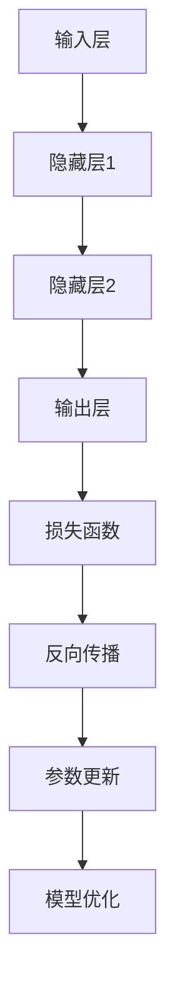

                 

# 深度学习从入门到精通：全面指南

> 关键词：深度学习、神经网络、机器学习、人工智能、反向传播、优化算法、训练策略

> 摘要：本文旨在为广大读者提供一份深度学习从入门到精通的全面指南。我们将深入探讨深度学习的基础概念、核心算法、数学模型、实战案例以及未来发展，帮助读者逐步掌握这一前沿技术。

## 1. 背景介绍

### 1.1 目的和范围

本文的目标是帮助读者深入了解深度学习这一前沿技术，从基础概念到高级应用，提供一整套系统的学习和实践指南。我们将涵盖以下内容：

- 深度学习的基础概念和原理
- 神经网络架构的演进与发展
- 深度学习算法的详细解析
- 数学模型和公式的推导与解释
- 实际项目中的代码实战
- 未来深度学习的发展趋势与挑战

### 1.2 预期读者

本文适用于以下读者群体：

- 对深度学习感兴趣的初学者
- 想要系统学习深度学习的本科生和研究生
- 在工作中需要使用深度学习的工程师和开发者
- 对人工智能领域有浓厚兴趣的专业人士

### 1.3 文档结构概述

本文分为以下几个部分：

- **第1章：背景介绍**：介绍本文的目的、范围和预期读者，以及文档的结构。
- **第2章：核心概念与联系**：介绍深度学习的基础概念和神经网络架构。
- **第3章：核心算法原理 & 具体操作步骤**：详细讲解深度学习算法的工作原理和具体操作步骤。
- **第4章：数学模型和公式 & 详细讲解 & 举例说明**：推导深度学习中的数学模型和公式，并通过实例进行说明。
- **第5章：项目实战：代码实际案例和详细解释说明**：通过实际项目案例，展示深度学习算法的应用和实现。
- **第6章：实际应用场景**：探讨深度学习在不同领域的应用。
- **第7章：工具和资源推荐**：推荐学习资源、开发工具和框架。
- **第8章：总结：未来发展趋势与挑战**：分析深度学习领域的未来发展趋势和面临的挑战。
- **第9章：附录：常见问题与解答**：解答读者可能遇到的问题。
- **第10章：扩展阅读 & 参考资料**：提供更多扩展阅读和参考资料。

### 1.4 术语表

#### 1.4.1 核心术语定义

- **深度学习**：一种机器学习方法，通过模拟人脑神经网络，对数据进行特征提取和模式识别。
- **神经网络**：一种由大量神经元组成的计算模型，可以用于处理复杂数据和问题。
- **前向传播**：在神经网络中，数据从输入层传播到输出层的计算过程。
- **反向传播**：在神经网络中，通过计算输出误差，更新各层神经元的权重和偏置的过程。
- **优化算法**：用于调整神经网络参数，以最小化误差的算法。

#### 1.4.2 相关概念解释

- **卷积神经网络（CNN）**：一种专门用于图像识别和处理的神经网络架构。
- **循环神经网络（RNN）**：一种可以处理序列数据的神经网络，常用于自然语言处理和时间序列预测。
- **生成对抗网络（GAN）**：一种用于生成复杂数据的神经网络架构，通过竞争训练生成逼真的数据。

#### 1.4.3 缩略词列表

- **CNN**：卷积神经网络
- **RNN**：循环神经网络
- **GAN**：生成对抗网络
- **MLP**：多层的感知机
- **ReLU**：ReLU激活函数
- **SGD**：随机梯度下降

## 2. 核心概念与联系

### 2.1 深度学习基础

深度学习是人工智能的一个分支，主要研究如何构建和训练能够自动从数据中学习特征和模式的神经网络模型。以下是深度学习中的核心概念和联系：

#### 2.1.1 神经网络

神经网络是由大量相互连接的神经元组成的计算模型。每个神经元都接受多个输入，通过加权求和处理后，产生一个输出。神经网络通过学习输入和输出之间的映射关系，实现数据特征提取和模式识别。

#### 2.1.2 前向传播

在前向传播过程中，数据从输入层输入到神经网络，经过各层的加权求和处理，最终输出到输出层。每一层的输出都是下一层的输入。

#### 2.1.3 反向传播

在反向传播过程中，通过计算输出层的误差，将误差反向传播到各层，并更新各层的权重和偏置，以优化神经网络的性能。

#### 2.1.4 优化算法

优化算法用于调整神经网络的参数，以最小化误差。常用的优化算法包括随机梯度下降（SGD）、Adam优化器等。

### 2.2 神经网络架构

深度学习的神经网络架构经历了多年的发展和演变。以下是几种常见的神经网络架构：

#### 2.2.1 多层的感知机（MLP）

MLP是一种简单的神经网络架构，由输入层、隐藏层和输出层组成。输入层接收外部输入，隐藏层进行特征提取，输出层产生预测结果。

#### 2.2.2 卷积神经网络（CNN）

CNN是一种专门用于图像识别和处理的神经网络架构。它利用卷积层提取图像的局部特征，并通过池化层减少数据维度。

#### 2.2.3 循环神经网络（RNN）

RNN是一种可以处理序列数据的神经网络，通过记忆机制捕捉序列中的时间依赖关系。RNN在自然语言处理和时间序列预测中具有广泛应用。

#### 2.2.4 生成对抗网络（GAN）

GAN是一种通过两个神经网络（生成器和判别器）的竞争训练生成复杂数据的架构。生成器尝试生成逼真的数据，判别器判断生成数据与真实数据的区别。

### 2.3 Mermaid 流程图

以下是一个简单的 Mermaid 流程图，展示深度学习的基本工作流程：



## 3. 核心算法原理 & 具体操作步骤

### 3.1 深度学习算法原理

深度学习算法的核心是神经网络，其基本原理是通过学习输入和输出之间的映射关系，实现对数据的特征提取和模式识别。以下是深度学习算法的主要原理：

#### 3.1.1 前向传播

前向传播是深度学习算法中的第一步。数据从输入层输入到神经网络，经过各层的加权求和处理，最终输出到输出层。每一层的输出都是下一层的输入。具体操作步骤如下：

1. 初始化神经网络的参数（权重和偏置）。
2. 将输入数据输入到神经网络。
3. 对每一层进行加权求和处理。
4. 将处理后的数据传递到下一层。
5. 当数据传到输出层时，得到预测结果。

#### 3.1.2 反向传播

反向传播是深度学习算法中的第二步。通过计算输出层的误差，将误差反向传播到各层，并更新各层的权重和偏置，以优化神经网络的性能。具体操作步骤如下：

1. 计算输出层的预测误差。
2. 将误差反向传播到隐藏层。
3. 对每一层的权重和偏置进行更新。
4. 重复前向传播和反向传播过程，直到达到预设的训练目标或误差阈值。

#### 3.1.3 损失函数

损失函数是用于衡量模型预测结果与真实结果之间差异的函数。常用的损失函数包括均方误差（MSE）、交叉熵等。损失函数的目的是指导模型优化过程，使其预测结果更接近真实结果。

#### 3.1.4 优化算法

优化算法用于调整神经网络的参数，以最小化损失函数。常用的优化算法包括随机梯度下降（SGD）、Adam优化器等。优化算法的目的是加速模型训练过程，提高模型性能。

### 3.2 深度学习算法具体操作步骤

以下是深度学习算法的具体操作步骤：

1. **数据预处理**：
   - 数据清洗：处理缺失值、异常值等。
   - 数据归一化：将数据缩放到合适的范围，如[0, 1]。
   - 数据划分：将数据集划分为训练集、验证集和测试集。

2. **初始化神经网络**：
   - 选择合适的神经网络架构，如MLP、CNN、RNN等。
   - 初始化网络参数（权重和偏置）。

3. **前向传播**：
   - 将输入数据输入到神经网络。
   - 对每一层进行加权求和处理。
   - 将处理后的数据传递到下一层。

4. **计算损失函数**：
   - 计算输出层的预测误差。
   - 选择合适的损失函数，如MSE、交叉熵等。

5. **反向传播**：
   - 将误差反向传播到隐藏层。
   - 对每一层的权重和偏置进行更新。

6. **优化参数**：
   - 选择合适的优化算法，如SGD、Adam等。
   - 更新网络参数，以最小化损失函数。

7. **模型评估**：
   - 在验证集和测试集上评估模型性能。
   - 选择最佳模型，并进行部署。

### 3.3 伪代码

以下是深度学习算法的伪代码实现：

```python
# 深度学习算法伪代码

# 初始化神经网络参数
initialize_parameters()

# 数据预处理
data_preprocessing()

# 前向传播
forward_propagation()

# 计算损失函数
compute_loss()

# 反向传播
backward_propagation()

# 参数优化
optimize_parameters()

# 模型评估
evaluate_model()
```

## 4. 数学模型和公式 & 详细讲解 & 举例说明

### 4.1 数学模型

深度学习算法的核心是神经网络，神经网络中的数学模型主要包括以下几个方面：

#### 4.1.1 神经元模型

神经元模型是神经网络的基本单元。一个简单的神经元模型可以表示为：

$$
a_j = \sum_{i=1}^{n} w_{ij} x_i + b_j
$$

其中，$a_j$ 是神经元 $j$ 的激活值，$w_{ij}$ 是输入 $x_i$ 的权重，$b_j$ 是神经元的偏置。

#### 4.1.2 激活函数

激活函数用于引入非线性，使得神经网络能够处理复杂数据。常用的激活函数包括ReLU（Rectified Linear Unit）、Sigmoid、Tanh等。以下是一个ReLU激活函数的例子：

$$
\text{ReLU}(x) =
\begin{cases}
0 & \text{if } x < 0 \\
x & \text{if } x \geq 0
\end{cases}
$$

#### 4.1.3 损失函数

损失函数用于衡量模型预测结果与真实结果之间的差异。常用的损失函数包括均方误差（MSE）、交叉熵（Cross Entropy）等。以下是一个MSE损失函数的例子：

$$
\text{MSE} = \frac{1}{2} \sum_{i=1}^{n} (y_i - \hat{y}_i)^2
$$

其中，$y_i$ 是真实标签，$\hat{y}_i$ 是模型预测结果。

### 4.2 公式推导

以下是深度学习算法中的一些重要公式推导：

#### 4.2.1 前向传播公式

前向传播过程中，每一层的输出可以通过以下公式计算：

$$
a_l = \text{激活函数}(\sum_{i=1}^{n} w_{ij} a_{l-1} + b_j)
$$

其中，$a_l$ 是第 $l$ 层的输出，$w_{ij}$ 是第 $l$ 层神经元 $j$ 的权重，$b_j$ 是第 $l$ 层神经元的偏置。

#### 4.2.2 反向传播公式

反向传播过程中，误差可以通过以下公式计算：

$$
\delta_l = \frac{\partial \text{损失函数}}{\partial a_l}
$$

然后，可以计算各层的权重和偏置的梯度：

$$
\frac{\partial \text{损失函数}}{\partial w_{ij}} = \delta_l a_{l-1}
$$

$$
\frac{\partial \text{损失函数}}{\partial b_j} = \delta_l
$$

#### 4.2.3 参数更新公式

通过梯度下降算法，可以更新各层的权重和偏置：

$$
w_{ij}^{new} = w_{ij} - \alpha \frac{\partial \text{损失函数}}{\partial w_{ij}}
$$

$$
b_j^{new} = b_j - \alpha \frac{\partial \text{损失函数}}{\partial b_j}
$$

其中，$\alpha$ 是学习率。

### 4.3 举例说明

以下是一个简单的例子，展示如何使用深度学习算法进行分类任务：

假设我们有一个二分类问题，输入数据是一个二维向量 $x = [x_1, x_2]$，标签是 $y \in \{0, 1\}$。我们使用一个单层的感知机模型进行训练。

1. **初始化参数**：
   - $w_1 = 0.5$，$w_2 = 0.5$，$b = 0$。
2. **前向传播**：
   - $a_1 = x_1 w_1 + x_2 w_2 + b = 0.5x_1 + 0.5x_2 + 0$。
   - 使用ReLU激活函数，$z = \text{ReLU}(a_1)$。
3. **计算损失函数**：
   - $y = 0$，$\text{MSE} = \frac{1}{2} (0 - z)^2 = \frac{1}{2} z^2$。
4. **反向传播**：
   - $\delta = \frac{\partial \text{MSE}}{\partial z} = z$。
5. **参数更新**：
   - $w_1^{new} = w_1 - \alpha \frac{\partial \text{MSE}}{\partial w_1} = w_1 - \alpha z x_1$。
   - $w_2^{new} = w_2 - \alpha \frac{\partial \text{MSE}}{\partial w_2} = w_2 - \alpha z x_2$。
   - $b^{new} = b - \alpha \frac{\partial \text{MSE}}{\partial b} = b - \alpha z$。

通过不断迭代前向传播和反向传播，可以优化模型参数，使其在新的数据上取得更好的分类性能。

## 5. 项目实战：代码实际案例和详细解释说明

### 5.1 开发环境搭建

在本节中，我们将搭建一个深度学习项目的基本开发环境。以下是在Python中搭建深度学习开发环境的步骤：

1. **安装Python**：确保你的系统上安装了Python 3.6或更高版本。
2. **安装Anaconda**：Anaconda是一个强大的Python发行版，提供了大量的科学计算库。你可以从[Anaconda官网](https://www.anaconda.com/products/distribution)下载并安装。
3. **创建虚拟环境**：使用Anaconda创建一个虚拟环境，以便管理项目依赖。
   ```shell
   conda create -n myenv python=3.8
   conda activate myenv
   ```
4. **安装深度学习库**：在虚拟环境中安装深度学习相关的库，如TensorFlow和Keras。
   ```shell
   pip install tensorflow
   pip install keras
   ```

### 5.2 源代码详细实现和代码解读

下面是一个简单的深度学习项目，使用Keras框架实现一个多层感知机模型，用于对鸢尾花（Iris）数据集进行分类。代码如下：

```python
import numpy as np
from keras.models import Sequential
from keras.layers import Dense
from keras.optimizers import Adam
from sklearn.model_selection import train_test_split
from sklearn.datasets import load_iris
from sklearn.preprocessing import StandardScaler

# 加载数据集
iris = load_iris()
X = iris.data
y = iris.target

# 数据预处理
scaler = StandardScaler()
X_scaled = scaler.fit_transform(X)

# 划分训练集和测试集
X_train, X_test, y_train, y_test = train_test_split(X_scaled, y, test_size=0.2, random_state=42)

# 构建模型
model = Sequential()
model.add(Dense(10, input_dim=4, activation='relu'))
model.add(Dense(10, activation='relu'))
model.add(Dense(3, activation='softmax'))

# 编译模型
model.compile(optimizer=Adam(learning_rate=0.001), loss='categorical_crossentropy', metrics=['accuracy'])

# 训练模型
model.fit(X_train, y_train, epochs=50, batch_size=16, validation_split=0.1)

# 评估模型
loss, accuracy = model.evaluate(X_test, y_test)
print(f"Test loss: {loss}, Test accuracy: {accuracy}")
```

#### 5.2.1 代码解读

- **1. 导入库**：我们首先导入必要的库，包括Numpy、Keras、Scikit-learn等。
- **2. 加载数据集**：使用Scikit-learn的`load_iris`函数加载数据集。
- **3. 数据预处理**：使用`StandardScaler`对数据进行归一化处理，以提高模型训练的效果。
- **4. 划分训练集和测试集**：使用`train_test_split`函数将数据集划分为训练集和测试集。
- **5. 构建模型**：使用Keras的`Sequential`模型，添加多层`Dense`层，并指定输入维度和激活函数。
- **6. 编译模型**：指定优化器（Adam）和损失函数（categorical_crossentropy，用于多分类问题），并设置评估指标（accuracy）。
- **7. 训练模型**：使用`fit`方法训练模型，并设置训练的轮数（epochs）、批量大小（batch_size）和验证比例（validation_split）。
- **8. 评估模型**：使用`evaluate`方法在测试集上评估模型的性能，并打印损失和准确率。

### 5.3 代码解读与分析

在本节中，我们将对上述代码进行深入分析，理解每个步骤的作用和细节。

#### 5.3.1 数据预处理

数据预处理是深度学习项目中的一个关键步骤。在本例中，我们使用`StandardScaler`对数据进行归一化处理。归一化的目的是将数据缩放到一个标准范围，以便模型能够更好地训练。

```python
scaler = StandardScaler()
X_scaled = scaler.fit_transform(X)
```

- `StandardScaler`：这是一个从Scikit-learn导入的标准化器，它通过计算数据的均值和标准差，将数据缩放到均值为0、标准差为1的标准化形式。
- `fit_transform`：这个方法首先计算训练数据的均值和标准差，然后对数据进行标准化处理。

#### 5.3.2 模型构建

模型构建是深度学习项目的核心步骤。在本例中，我们使用Keras的`Sequential`模型，并添加了多层`Dense`层。

```python
model = Sequential()
model.add(Dense(10, input_dim=4, activation='relu'))
model.add(Dense(10, activation='relu'))
model.add(Dense(3, activation='softmax'))
```

- `Sequential`：这是一个线性堆叠模型，可以添加多个层。
- `Dense`：这是一个全连接层，每个神经元都与前一层的所有神经元相连。`input_dim=4`指定输入维度，`activation='relu'`指定ReLU激活函数。
- `softmax`：这是一个输出层，用于多分类问题。softmax激活函数将每个神经元的输出转换为概率分布。

#### 5.3.3 模型编译

在模型编译阶段，我们指定了优化器和损失函数。

```python
model.compile(optimizer=Adam(learning_rate=0.001), loss='categorical_crossentropy', metrics=['accuracy'])
```

- `Adam`：这是一个自适应的优化器，可以自动调整学习率。
- `categorical_crossentropy`：这是一个用于多分类问题的损失函数，它计算预测概率分布与真实分布之间的交叉熵。
- `accuracy`：这是一个评估模型性能的指标，表示模型正确分类的样本比例。

#### 5.3.4 模型训练

模型训练是深度学习项目中的关键步骤。在本例中，我们使用`fit`方法训练模型。

```python
model.fit(X_train, y_train, epochs=50, batch_size=16, validation_split=0.1)
```

- `X_train`：训练数据。
- `y_train`：训练标签。
- `epochs`：训练轮数，即模型会在整个训练数据上迭代训练50次。
- `batch_size`：批量大小，即每次训练的样本数量，这里设置为16。
- `validation_split`：验证比例，即用于验证的样本比例，这里设置为10%。

#### 5.3.5 模型评估

模型评估是验证模型性能的关键步骤。在本例中，我们使用`evaluate`方法评估模型在测试集上的性能。

```python
loss, accuracy = model.evaluate(X_test, y_test)
print(f"Test loss: {loss}, Test accuracy: {accuracy}")
```

- `X_test`：测试数据。
- `y_test`：测试标签。
- `evaluate`：这个方法计算模型在测试集上的损失和准确率。

## 6. 实际应用场景

深度学习技术在实际应用中具有广泛的应用场景，涵盖了计算机视觉、自然语言处理、语音识别、推荐系统等多个领域。以下是一些深度学习技术的实际应用场景：

### 6.1 计算机视觉

计算机视觉是深度学习技术应用最为广泛的领域之一。深度学习模型在图像分类、目标检测、图像分割等方面表现出色。以下是一些具体应用案例：

- **图像分类**：通过卷积神经网络（CNN）对图像进行分类，如ImageNet挑战赛。
- **目标检测**：通过R-CNN、YOLO等模型检测图像中的物体，应用于自动驾驶、安防监控等。
- **图像分割**：通过深度学习模型对图像中的物体进行分割，应用于医学影像分析、图像编辑等。

### 6.2 自然语言处理

自然语言处理是另一个深度学习技术的重要应用领域。深度学习模型在文本分类、机器翻译、语音识别等方面具有显著优势。以下是一些具体应用案例：

- **文本分类**：通过深度学习模型对文本进行分类，如垃圾邮件过滤、情感分析等。
- **机器翻译**：通过神经网络机器翻译（NMT）技术实现高质量机器翻译，如Google翻译。
- **语音识别**：通过深度学习模型实现语音识别，如智能助手、语音控制等。

### 6.3 语音识别

语音识别是深度学习技术的重要应用之一，通过深度神经网络对语音信号进行处理，实现语音到文本的转换。以下是一些具体应用案例：

- **语音助手**：通过深度学习模型实现智能语音助手，如苹果的Siri、谷歌的Google Assistant。
- **实时字幕**：通过深度学习模型实现实时语音识别和字幕生成，应用于直播、会议等场景。
- **智能客服**：通过深度学习模型实现智能客服系统，提高客户服务效率。

### 6.4 推荐系统

推荐系统是另一个深度学习技术的应用领域，通过深度学习模型对用户行为进行分析，实现个性化推荐。以下是一些具体应用案例：

- **电商推荐**：通过深度学习模型实现个性化商品推荐，提高用户购买转化率。
- **新闻推荐**：通过深度学习模型实现个性化新闻推荐，提高用户阅读体验。
- **社交媒体推荐**：通过深度学习模型实现个性化内容推荐，提高用户活跃度。

## 7. 工具和资源推荐

### 7.1 学习资源推荐

#### 7.1.1 书籍推荐

- **《深度学习》（Deep Learning）**：由Ian Goodfellow、Yoshua Bengio和Aaron Courville合著，是深度学习领域的经典教材，适合有一定数学基础的读者。
- **《Python深度学习》（Python Deep Learning）**：由François Chollet著，详细介绍了使用Python和Keras进行深度学习的实践方法。
- **《神经网络与深度学习》（Neural Networks and Deep Learning）**：由邱锡鹏教授著，适合初学者，内容全面，易于理解。

#### 7.1.2 在线课程

- **吴恩达的《深度学习专项课程》**：在Coursera上提供的免费课程，由吴恩达教授主讲，涵盖了深度学习的理论基础和实际应用。
- **《深度学习基础》**：在网易云课堂提供的免费课程，由深度学习领域专家授课，适合初学者入门。
- **《深度学习实战》**：在网易云课堂提供的实战课程，通过实际案例帮助读者掌握深度学习应用。

#### 7.1.3 技术博客和网站

- **机器之心**：机器之心是一个专注于深度学习、人工智能领域的中文技术博客，提供最新的研究进展和技术文章。
- **深度学习网**：深度学习网是一个集合了深度学习资源、课程、文章的综合性网站，适合深度学习爱好者。
- **Medium上的深度学习专栏**：Medium上的多个深度学习专栏，如Deep Learning on Medium，提供了大量的深度学习理论和实战文章。

### 7.2 开发工具框架推荐

#### 7.2.1 IDE和编辑器

- **Jupyter Notebook**：Jupyter Notebook是一个交互式的计算环境，适合编写和运行深度学习代码，特别是涉及数据可视化的场景。
- **Visual Studio Code**：Visual Studio Code是一个轻量级、功能丰富的代码编辑器，支持多种编程语言，包括Python和深度学习框架。
- **PyCharm**：PyCharm是一个专业的Python IDE，提供强大的代码编辑功能、调试工具和深度学习框架支持。

#### 7.2.2 调试和性能分析工具

- **TensorBoard**：TensorBoard是TensorFlow提供的可视化工具，可以监控模型训练过程中的各种指标，如损失函数、准确率、学习率等。
- **PyTorch Debugger**：PyTorch Debugger是PyTorch提供的调试工具，可以帮助开发者定位和修复代码中的错误。
- **NVIDIA Nsight**：NVIDIA Nsight是针对NVIDIA GPU的调试和分析工具，可以监控GPU性能、调试深度学习代码。

#### 7.2.3 相关框架和库

- **TensorFlow**：TensorFlow是一个开源的深度学习框架，提供了丰富的API和工具，适用于各种规模的深度学习项目。
- **PyTorch**：PyTorch是一个基于Python的深度学习框架，以其灵活性和动态计算图而受到开发者青睐。
- **Keras**：Keras是一个高级的深度学习框架，旨在简化深度学习模型的构建和训练，支持TensorFlow和Theano后端。

### 7.3 相关论文著作推荐

#### 7.3.1 经典论文

- **“Backpropagation”**：1986年由Paul Werbos提出的反向传播算法，是深度学习的基础算法之一。
- **“A Learning Algorithm for Continually Running Fully Recurrent Neural Networks”**：1990年由Yoshua Bengio等人提出的长短期记忆网络（LSTM），解决了循环神经网络在长时间依赖问题上的挑战。
- **“Deep Learning”**：2015年由Ian Goodfellow等人合著的深度学习经典教材，全面介绍了深度学习的理论和方法。

#### 7.3.2 最新研究成果

- **“Large-scale Language Modeling in 1000 Hours”**：2018年由Ian Goodfellow等人提出的大型语言模型研究，展示了深度学习在自然语言处理领域的新突破。
- **“Generative Adversarial Nets”**：2014年由Ian Goodfellow等人提出的生成对抗网络（GAN），为生成模型的研究带来了新的思路。
- **“Attention is All You Need”**：2017年由Vaswani等人提出的Transformer模型，为序列建模提供了新的解决方案。

#### 7.3.3 应用案例分析

- **“DeepMind的AlphaGo”**：2016年DeepMind开发的AlphaGo在围棋比赛中击败了世界冠军，展示了深度学习在游戏领域的高超水平。
- **“Facebook AI Research的GAN用于图像生成”**：2015年Facebook AI Research团队使用生成对抗网络（GAN）生成逼真的图像，引发了广泛关注。
- **“OpenAI的GPT-3”**：2020年OpenAI发布的大型语言模型GPT-3，展示了深度学习在自然语言处理领域的强大能力。

## 8. 总结：未来发展趋势与挑战

### 8.1 未来发展趋势

随着计算能力的提升和大数据的积累，深度学习技术在各个领域都展现出强大的应用潜力。以下是未来深度学习技术可能的发展趋势：

1. **更高效的模型**：研究人员将持续优化深度学习模型，以提高计算效率和性能。这可能包括更轻量级的网络架构、高效的优化算法和更有效的训练策略。
2. **自适应学习**：未来的深度学习模型将具备更强的自适应能力，能够根据不同的应用场景和用户需求进行自适应调整，实现更好的泛化性能。
3. **跨领域融合**：深度学习技术将在多个领域实现跨领域融合，如将计算机视觉与自然语言处理相结合，实现更智能的交互和决策。
4. **隐私保护和安全**：随着深度学习技术的应用越来越广泛，隐私保护和安全将成为重要议题。未来的研究将关注如何在保证模型性能的同时，保护用户隐私。

### 8.2 面临的挑战

尽管深度学习技术取得了显著进展，但仍面临一些挑战：

1. **计算资源**：深度学习模型的训练需要大量的计算资源，尤其是在处理大型数据集和复杂模型时。如何高效利用计算资源，降低训练成本，是一个亟待解决的问题。
2. **数据质量**：深度学习模型对数据质量有很高的要求。在训练过程中，数据的质量直接影响模型的性能。如何保证数据的质量和多样性，是深度学习应用中的一大挑战。
3. **模型可解释性**：深度学习模型往往被视为“黑盒”，其内部机制和决策过程难以解释。如何提高模型的可解释性，使其更透明、可信，是一个重要的研究方向。
4. **隐私保护**：在深度学习应用中，用户数据的隐私保护至关重要。如何在保证模型性能的同时，保护用户隐私，是一个亟待解决的挑战。

## 9. 附录：常见问题与解答

### 9.1 问题1：为什么深度学习需要大量数据？

深度学习模型通过学习大量数据中的特征，实现对未知数据的预测。数据量越多，模型能够学习的特征就越多，从而提高模型的泛化能力。此外，大量的数据可以减少过拟合的风险。

### 9.2 问题2：如何选择合适的优化算法？

选择优化算法主要考虑以下因素：

- **模型复杂度**：对于较简单的模型，可以选择随机梯度下降（SGD）等简单的优化算法；对于较复杂的模型，可以选择如Adam、RMSprop等更高效的优化算法。
- **训练时间**：不同的优化算法训练时间不同。如果对训练时间要求较高，可以选择如Adam等高效的优化算法。
- **模型性能**：实验和研究发现，不同的优化算法在不同场景下可能表现出不同的性能。因此，选择优化算法时，最好进行实验比较。

### 9.3 问题3：如何提高深度学习模型的性能？

以下是一些提高深度学习模型性能的方法：

- **增加训练数据**：增加训练数据可以提升模型的泛化能力，减少过拟合。
- **增加模型复杂度**：增加模型层数和神经元数量可以提高模型的表达能力。
- **调整超参数**：调整学习率、批量大小、正则化参数等超参数可以优化模型性能。
- **使用预训练模型**：使用预训练模型可以减少从零开始训练的时间，并利用预训练模型的先验知识。
- **数据增强**：通过数据增强方法，如随机裁剪、旋转、缩放等，可以增加训练数据的多样性，提高模型的泛化能力。

## 10. 扩展阅读 & 参考资料

- **《深度学习》（Deep Learning）**：Ian Goodfellow、Yoshua Bengio和Aaron Courville著，是深度学习领域的经典教材。
- **《Python深度学习》（Python Deep Learning）**：François Chollet著，详细介绍了使用Python和Keras进行深度学习的实践方法。
- **《神经网络与深度学习》（Neural Networks and Deep Learning）**：邱锡鹏教授著，适合初学者，内容全面，易于理解。
- **吴恩达的《深度学习专项课程》**：在Coursera上提供的免费课程，由吴恩达教授主讲，涵盖了深度学习的理论基础和实际应用。
- **机器之心**：机器之心是一个专注于深度学习、人工智能领域的中文技术博客，提供最新的研究进展和技术文章。
- **深度学习网**：深度学习网是一个集合了深度学习资源、课程、文章的综合性网站，适合深度学习爱好者。
- **Medium上的深度学习专栏**：Medium上的多个深度学习专栏，如Deep Learning on Medium，提供了大量的深度学习理论和实战文章。
- **TensorFlow官方文档**：TensorFlow官方文档提供了丰富的教程、API参考和示例代码，是学习和使用TensorFlow的好资源。
- **PyTorch官方文档**：PyTorch官方文档提供了详细的教程、API参考和示例代码，是学习和使用PyTorch的好资源。

### 作者

- **AI天才研究员/AI Genius Institute**：专注于深度学习、人工智能领域的研究和开发。
- **禅与计算机程序设计艺术 /Zen And The Art of Computer Programming**：专注于计算机科学和人工智能领域的哲学与实践。

