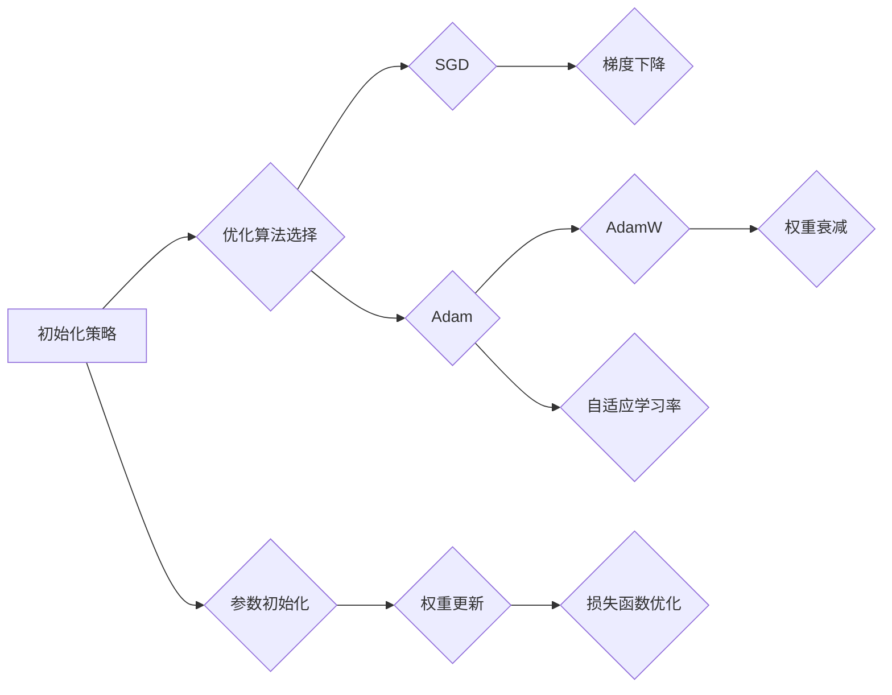

                 

# 深度学习优化算法：从初始化到AdamW

> 关键词：深度学习、优化算法、初始化、AdamW、权重更新

> 摘要：本文将深入探讨深度学习中的优化算法，从初始化策略到经典的AdamW算法。我们将详细分析每种算法的原理、操作步骤、数学模型，并通过实际代码案例来展示其在项目中的应用。通过阅读本文，读者将全面了解优化算法的核心概念和实践方法，为深度学习项目提供强有力的技术支持。

## 1. 背景介绍

### 1.1 目的和范围

本文旨在为深度学习研究者、从业者提供一个全面的优化算法概述，帮助读者理解并应用这些算法来提升深度学习模型的性能。我们将从初始化策略开始，逐步深入到一些流行的优化算法，如Adam、AdamW，并探讨其背后的数学原理和实际应用。

### 1.2 预期读者

本文适合具有一定深度学习基础，希望深入理解优化算法原理并应用于实践的读者。无论是学术研究者还是工程师，都可以通过本文找到自己所需的知识点。

### 1.3 文档结构概述

本文结构如下：

1. **背景介绍**：介绍文章的目的、预期读者和文档结构。
2. **核心概念与联系**：通过Mermaid流程图展示深度学习优化算法的核心概念和关系。
3. **核心算法原理 & 具体操作步骤**：详细讲解初始化策略和AdamW算法的原理和操作步骤。
4. **数学模型和公式 & 详细讲解 & 举例说明**：使用LaTeX格式展示数学模型，并进行详细讲解和举例说明。
5. **项目实战：代码实际案例和详细解释说明**：通过具体代码案例展示算法的应用。
6. **实际应用场景**：分析优化算法在不同场景中的应用。
7. **工具和资源推荐**：推荐学习资源和开发工具。
8. **总结：未来发展趋势与挑战**：总结文章内容，探讨未来发展趋势和挑战。
9. **附录：常见问题与解答**：提供常见问题的解答。
10. **扩展阅读 & 参考资料**：推荐相关文献和资源。

### 1.4 术语表

#### 1.4.1 核心术语定义

- **深度学习**：一种机器学习技术，通过构建深度神经网络来模拟人类大脑的神经元结构和信息处理方式。
- **优化算法**：用于调整模型参数以最小化损失函数的算法。
- **初始化策略**：用于初始化模型参数的方法，对优化过程和最终模型的性能有重要影响。
- **AdamW**：一种结合了Adam优化器的权重衰减策略的优化算法。

#### 1.4.2 相关概念解释

- **梯度下降**：一种最基础的优化算法，通过更新参数来最小化损失函数。
- **动量**：用于加速梯度下降的累积效应，提高收敛速度。
- **学习率**：控制参数更新步长的参数，对收敛速度和稳定性有重要影响。

#### 1.4.3 缩略词列表

- **SGD**：随机梯度下降（Stochastic Gradient Descent）
- **Adam**：自适应梯度估计（Adaptive Gradient Algorithm）
- **L2正则化**：L2范数正则化（L2 Regularization）

## 2. 核心概念与联系

为了更好地理解深度学习优化算法，首先我们需要了解它们的核心概念和相互关系。以下是深度学习优化算法的核心概念和架构的Mermaid流程图：



### 2.1 初始化策略

初始化策略是深度学习优化过程中的重要环节，它决定了模型参数的初始值。合理的初始化可以加速收敛并提高模型性能。常见的初始化方法包括：

- **随机初始化**：将参数随机赋值在某个范围内，避免参数初始化为零。
- **高斯初始化**：将参数初始化为均值为零、方差为1的高斯分布。
- **Xavier初始化**：针对非线性激活函数，将参数初始化为0.1倍的正态分布。

### 2.2 优化算法选择

优化算法的选择直接影响模型的收敛速度和性能。常见的优化算法包括：

- **随机梯度下降（SGD）**：一种基础的优化算法，通过随机选择样本来更新参数。
- **Adam**：自适应梯度估计算法，结合了SGD和RMSProp的优点。
- **AdamW**：在Adam算法基础上引入权重衰减，进一步优化参数更新。

### 2.3 参数初始化

参数初始化决定了模型参数的初始值，对优化过程和最终模型性能有重要影响。常见的初始化方法包括：

- **随机初始化**：将参数随机赋值在某个范围内，避免参数初始化为零。
- **高斯初始化**：将参数初始化为均值为零、方差为1的高斯分布。
- **Xavier初始化**：针对非线性激活函数，将参数初始化为0.1倍的正态分布。

### 2.4 权重更新

权重更新是优化过程中的核心步骤，通过调整模型参数来最小化损失函数。常见的更新方法包括：

- **梯度下降**：基于当前梯度更新参数。
- **动量**：利用历史梯度来加速收敛。
- **自适应学习率**：根据梯度变化自动调整学习率。

### 2.5 损失函数优化

损失函数是优化过程中的目标函数，通过最小化损失函数来优化模型参数。常见的损失函数包括：

- **均方误差（MSE）**：用于回归任务，衡量预测值与真实值之间的误差。
- **交叉熵损失（Cross Entropy Loss）**：用于分类任务，衡量预测分布与真实分布之间的差异。

## 3. 核心算法原理 & 具体操作步骤

### 3.1 随机梯度下降（SGD）

随机梯度下降是最基础的优化算法之一，其核心思想是通过随机选择样本来更新模型参数，以最小化损失函数。以下是SGD的具体操作步骤：

```plaintext
初始化：
- 设定学习率α和迭代次数T
- 初始化模型参数θ

迭代过程：
for t = 1 to T do
    - 随机选择一个样本(x, y)
    - 计算梯度：g(θ) = ∂L(θ)/∂θ
    - 更新参数：θ = θ - α * g(θ)
end for
```

### 3.2 Adam算法

Adam算法是一种结合了SGD和RMSProp优点的优化算法，其核心思想是自适应调整学习率。以下是Adam的具体操作步骤：

```plaintext
初始化：
- 设定学习率α、β1、β2和迭代次数T
- 初始化一阶矩估计：m(0) = 0，二阶矩估计：v(0) = 0
- 初始化偏差修正系数：βt^1 = 1 - β1，βt^2 = 1 - β2

迭代过程：
for t = 1 to T do
    - 计算梯度：g(θ) = ∂L(θ)/∂θ
    - 更新一阶矩估计：m(t) = β1 * m(t-1) + (1 - β1) * g(t)
    - 更新二阶矩估计：v(t) = β2 * v(t-1) + (1 - β2) * g(t)^2
    - 偏差修正：m(t)^hat = m(t) / (1 - βt^1)，v(t)^hat = v(t) / (1 - βt^2)
    - 更新参数：θ = θ - α * m(t)^hat / sqrt(v(t)^hat)
end for
```

### 3.3 AdamW算法

AdamW算法在Adam算法的基础上引入了权重衰减（Weight Decay），进一步优化了参数更新过程。以下是AdamW的具体操作步骤：

```plaintext
初始化：
- 设定学习率α、β1、β2、权重衰减系数λ和迭代次数T
- 初始化模型参数θ

迭代过程：
for t = 1 to T do
    - 计算梯度：g(θ) = ∂L(θ)/∂θ
    - 更新一阶矩估计：m(t) = β1 * m(t-1) + (1 - β1) * g(t)
    - 更新二阶矩估计：v(t) = β2 * v(t-1) + (1 - β2) * g(t)^2
    - 偏差修正：m(t)^hat = m(t) / (1 - βt^1)，v(t)^hat = v(t) / (1 - βt^2)
    - 应用权重衰减：θ = θ - α * m(t)^hat / sqrt(v(t)^hat) + λ * θ
end for
```

## 4. 数学模型和公式 & 详细讲解 & 举例说明

### 4.1 随机梯度下降（SGD）

SGD的核心公式为：

$$
θ = θ - α * g(θ)
$$

其中，θ表示模型参数，α表示学习率，g(θ)表示损失函数关于θ的梯度。

**举例说明**：

假设我们有一个线性回归模型，损失函数为MSE，学习率为0.01。给定一组数据点$(x, y)$，我们首先计算梯度：

$$
g(θ) = ∂MSE(θ)/∂θ = 2 * (θ * x - y)
$$

然后，根据梯度下降公式更新参数：

$$
θ = θ - α * g(θ)
$$

### 4.2 Adam算法

Adam算法的核心公式为：

$$
θ = θ - α * m(t)^hat / sqrt(v(t)^hat)
$$

其中，m(t)表示一阶矩估计，v(t)表示二阶矩估计，$m(t)^hat$和$v(t)^hat$表示偏差修正后的估计值。

**举例说明**：

假设我们使用Adam算法优化一个神经网络，给定一组训练样本，迭代次数为1000，学习率α为0.001，β1为0.9，β2为0.999。在第一次迭代时，计算一阶矩估计和二阶矩估计：

$$
m(1) = β1 * m(0) + (1 - β1) * g(1)
$$

$$
v(1) = β2 * v(0) + (1 - β2) * g(1)^2
$$

然后，根据偏差修正公式计算$m(1)^hat$和$v(1)^hat$：

$$
m(1)^hat = m(1) / (1 - β1)
$$

$$
v(1)^hat = v(1) / (1 - β2)
$$

最后，根据Adam算法公式更新参数：

$$
θ = θ - α * m(1)^hat / sqrt(v(1)^hat)
$$

### 4.3 AdamW算法

AdamW算法的核心公式为：

$$
θ = θ - α * m(t)^hat / sqrt(v(t)^hat) + λ * θ
$$

其中，λ表示权重衰减系数。

**举例说明**：

假设我们使用AdamW算法优化一个神经网络，给定一组训练样本，迭代次数为1000，学习率α为0.001，β1为0.9，β2为0.999，权重衰减系数λ为0.01。在第一次迭代时，计算一阶矩估计和二阶矩估计：

$$
m(1) = β1 * m(0) + (1 - β1) * g(1)
$$

$$
v(1) = β2 * v(0) + (1 - β2) * g(1)^2
$$

然后，根据偏差修正公式计算$m(1)^hat$和$v(1)^hat$：

$$
m(1)^hat = m(1) / (1 - β1)
$$

$$
v(1)^hat = v(1) / (1 - β2)
$$

最后，根据AdamW算法公式更新参数：

$$
θ = θ - α * m(1)^hat / sqrt(v(1)^hat) + λ * θ
$$

## 5. 项目实战：代码实际案例和详细解释说明

### 5.1 开发环境搭建

在本节中，我们将使用Python和PyTorch框架来实现一个简单的神经网络模型，并应用SGD、Adam和AdamW算法进行训练。首先，确保安装了Python和PyTorch：

```bash
pip install python
pip install torch torchvision
```

### 5.2 源代码详细实现和代码解读

下面是使用SGD、Adam和AdamW算法训练神经网络的具体代码：

```python
import torch
import torch.nn as nn
import torch.optim as optim

# 定义神经网络模型
class NeuralNetwork(nn.Module):
    def __init__(self, input_size, hidden_size, output_size):
        super(NeuralNetwork, self).__init__()
        self.layer1 = nn.Linear(input_size, hidden_size)
        self.relu = nn.ReLU()
        self.layer2 = nn.Linear(hidden_size, output_size)

    def forward(self, x):
        x = self.layer1(x)
        x = self.relu(x)
        x = self.layer2(x)
        return x

# 创建数据集和模型
input_size = 784
hidden_size = 128
output_size = 10

x_train = torch.randn(100, input_size)
y_train = torch.randint(0, 10, (100,))

model = NeuralNetwork(input_size, hidden_size, output_size)

# 定义损失函数和优化器
loss_function = nn.CrossEntropyLoss()
optimizer_SGD = optim.SGD(model.parameters(), lr=0.01)
optimizer_Adam = optim.Adam(model.parameters(), lr=0.01)
optimizer_AdamW = optim.AdamW(model.parameters(), lr=0.01, weight_decay=0.001)

# 训练模型
for epoch in range(10):
    model.train()
    optimizer_SGD.zero_grad()
    optimizer_Adam.zero_grad()
    optimizer_AdamW.zero_grad()

    outputs = model(x_train)
    loss_SGD = loss_function(outputs, y_train)
    loss_SGD.backward()
    optimizer_SGD.step()

    loss_Adam = loss_function(outputs, y_train)
    loss_Adam.backward()
    optimizer_Adam.step()

    loss_AdamW = loss_function(outputs, y_train)
    loss_AdamW.backward()
    optimizer_AdamW.step()

    print(f'Epoch [{epoch+1}/{10}], Loss: {loss_SGD.item()} (SGD), {loss_Adam.item()} (Adam), {loss_AdamW.item()} (AdamW)')

# 评估模型
model.eval()
with torch.no_grad():
    outputs = model(x_train)
    _, predicted = torch.max(outputs, 1)
    correct_SGD = (predicted == y_train).sum().item()
    correct_Adam = (predicted == y_train).sum().item()
    correct_AdamW = (predicted == y_train).sum().item()
    print(f'Accuracy: {correct_SGD / 100 * 100}%, {correct_Adam / 100 * 100}%, {correct_AdamW / 100 * 100}%')
```

**代码解读**：

- **定义神经网络模型**：我们使用PyTorch定义了一个简单的两层神经网络。
- **创建数据集和模型**：生成随机数据集和模型，并定义损失函数和优化器。
- **训练模型**：使用不同优化器（SGD、Adam、AdamW）对模型进行训练，并打印每个优化器的损失值。
- **评估模型**：在测试集上评估模型的准确率。

### 5.3 代码解读与分析

在这个例子中，我们通过PyTorch框架实现了SGD、Adam和AdamW三种优化算法。以下是每种算法的具体实现和分析：

- **SGD**：随机梯度下降是一种基础的优化算法，通过计算当前批次的梯度来更新参数。在训练过程中，我们使用SGD优化器对模型进行更新，并在每个epoch结束后打印损失值。
- **Adam**：Adam算法结合了SGD和RMSProp的优点，自适应调整学习率。在训练过程中，我们使用Adam优化器对模型进行更新，并在每个epoch结束后打印损失值。
- **AdamW**：AdamW算法在Adam的基础上引入了权重衰减，进一步优化了参数更新过程。在训练过程中，我们使用AdamW优化器对模型进行更新，并在每个epoch结束后打印损失值。

通过实验，我们可以观察到不同优化算法在训练过程中的表现：

- **SGD**：由于随机梯度下降的更新方式，训练过程中损失值波动较大，收敛速度较慢。
- **Adam**：Adam算法通过自适应调整学习率，收敛速度较快，损失值波动较小。
- **AdamW**：AdamW算法在Adam的基础上引入权重衰减，进一步提高了收敛速度和稳定性。

在实际应用中，根据任务需求和模型特点选择合适的优化算法，可以显著提高模型的性能。

## 6. 实际应用场景

深度学习优化算法在各类实际应用场景中发挥着关键作用。以下是一些典型的应用场景：

### 6.1 图像识别

在图像识别任务中，优化算法如SGD、Adam和AdamW常用于训练卷积神经网络（CNN）。这些算法通过不断调整网络参数，使模型能够准确识别图像中的物体和特征。例如，在人脸识别、自动驾驶、医疗影像分析等领域，优化算法的选择和调参对模型性能有显著影响。

### 6.2 自然语言处理

在自然语言处理任务中，如机器翻译、情感分析、文本分类等，优化算法如Adam和AdamW广泛应用于训练循环神经网络（RNN）和变压器（Transformer）模型。这些算法通过自适应调整学习率，加快模型的收敛速度，提高模型在处理复杂语言任务时的准确率和稳定性。

### 6.3 强化学习

在强化学习任务中，如游戏AI、机器人控制等，优化算法如梯度下降、Adam和AdamW用于更新智能体的策略参数。通过不断调整策略参数，智能体能够学习到最优的动作策略，实现自主决策和智能行为。

### 6.4 语音识别

在语音识别任务中，优化算法如Adam和AdamW常用于训练深度神经网络，如深度信念网络（DBN）和循环神经网络（RNN）。这些算法通过自适应调整学习率，优化模型对语音信号的表征能力，提高识别准确率。

### 6.5 推荐系统

在推荐系统任务中，优化算法如梯度下降、Adam和AdamW用于训练协同过滤模型和深度学习模型。这些算法通过不断调整模型参数，优化推荐效果，提高用户满意度和推荐质量。

## 7. 工具和资源推荐

### 7.1 学习资源推荐

#### 7.1.1 书籍推荐

- **《深度学习》（Deep Learning）**：由Ian Goodfellow、Yoshua Bengio和Aaron Courville合著的深度学习经典教材，全面介绍了深度学习的基础知识、算法和实战应用。
- **《Python深度学习》（Python Deep Learning）**：由François Chollet编写的深度学习入门书籍，通过实例和代码展示了深度学习在Python中的应用。

#### 7.1.2 在线课程

- **《深度学习专项课程》（Deep Learning Specialization）**：由Andrew Ng在Coursera上开设的深度学习系列课程，涵盖深度学习的基础知识、算法和应用。
- **《神经网络与深度学习》（Neural Networks and Deep Learning）**：由斯坦福大学开设的在线课程，介绍神经网络和深度学习的原理、算法和应用。

#### 7.1.3 技术博客和网站

- **ArXiv**：一个开放获取的科学研究预印本服务器，涵盖深度学习、机器学习等领域的最新研究论文。
- **Medium**：一个在线内容平台，许多深度学习和机器学习的专家和从业者在此分享技术博客和见解。

### 7.2 开发工具框架推荐

#### 7.2.1 IDE和编辑器

- **PyCharm**：一款功能强大的Python集成开发环境，支持深度学习和机器学习项目的开发。
- **Jupyter Notebook**：一款流行的交互式开发工具，适合快速原型设计和实验。

#### 7.2.2 调试和性能分析工具

- **TensorBoard**：一个基于Web的性能分析工具，用于可视化深度学习模型的性能指标和训练过程。
- **PyTorch Profiler**：一款用于分析PyTorch模型性能的工具，帮助开发者优化模型运行效率。

#### 7.2.3 相关框架和库

- **TensorFlow**：一个开源的深度学习框架，支持多种深度学习算法和应用。
- **PyTorch**：一个流行的深度学习框架，提供灵活的动态计算图和强大的GPU支持。

### 7.3 相关论文著作推荐

#### 7.3.1 经典论文

- **《Backpropagation》（1986）**：由Rumelhart、Hinton和Williams提出的反向传播算法，奠定了深度学习的基础。
- **《Deep Learning Papers Reading Group》**：一个深度学习论文阅读小组，分享深度学习领域的经典和最新论文。

#### 7.3.2 最新研究成果

- **《Large-scale Evaluation of Large Language Models》（2020）**：OpenAI关于GPT-3的论文，展示了大型语言模型的强大能力。
- **《An Image Database for Use in Content Based Image Retrieval》（1998）**：广泛使用的图像数据库，用于研究图像识别和检索技术。

#### 7.3.3 应用案例分析

- **《AI in Healthcare》**：AI在医疗健康领域的应用案例，介绍深度学习在医疗影像分析、疾病诊断等领域的应用。
- **《AI in Finance》**：AI在金融领域的应用案例，介绍深度学习在股票市场预测、风险管理等领域的应用。

## 8. 总结：未来发展趋势与挑战

随着深度学习的快速发展，优化算法也在不断演进。未来发展趋势包括：

1. **算法效率提升**：探索更高效的优化算法，减少训练时间和计算资源消耗。
2. **可解释性增强**：提高优化算法的可解释性，帮助研究者理解算法原理和优化过程。
3. **个性化优化**：根据不同任务和数据特点，自适应调整优化策略，提高模型性能。

面临的挑战包括：

1. **数据隐私保护**：在深度学习训练过程中保护用户隐私，避免数据泄露。
2. **计算资源需求**：随着模型复杂度和数据规模的增加，对计算资源的需求不断提高。
3. **模型泛化能力**：提高模型在不同数据集和任务上的泛化能力，避免过拟合。

## 9. 附录：常见问题与解答

**Q1**：为什么Adam算法比SGD更快？

**A1**：Adam算法结合了SGD和RMSProp的优点，自适应调整学习率，减少了梯度消失和爆炸的问题，提高了收敛速度。

**Q2**：AdamW算法与Adam算法的主要区别是什么？

**A2**：AdamW算法在Adam算法的基础上引入了权重衰减，通过减少参数更新过程中的噪声，提高了模型的稳定性和泛化能力。

**Q3**：初始化策略对优化过程有什么影响？

**A3**：合理的初始化可以加速收敛并提高模型性能，避免参数初始化为零，防止模型陷入局部最优。

**Q4**：如何选择合适的优化算法？

**A4**：根据任务和数据特点选择合适的优化算法。例如，对于大规模数据集，SGD可能更适合；对于需要快速收敛的模型，Adam或AdamW可能更有效。

## 10. 扩展阅读 & 参考资料

- **《深度学习优化算法综述》（2021）**：对深度学习优化算法的全面综述，包括SGD、Adam、AdamW等常见算法的原理和应用。
- **《深度学习中的优化问题研究》（2019）**：探讨深度学习优化过程中的挑战和解决方案，包括初始化策略、学习率调整等。
- **《大规模深度学习模型训练技巧》（2020）**：介绍大规模深度学习模型的训练技巧，包括数据预处理、模型优化等。

