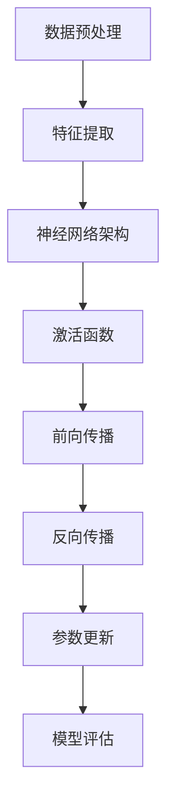

                 

# 深度学习原理与代码实例讲解

> **关键词：**深度学习、神经网络、反向传播、激活函数、数学模型、编程实例、应用场景

> **摘要：**本文旨在深入讲解深度学习的核心原理，并通过实际代码实例，展示如何实现和优化深度学习模型。文章将涵盖从基本概念到高级算法的详细讨论，帮助读者全面理解深度学习，掌握其应用方法。

## 1. 背景介绍

### 1.1 目的和范围

本文的目标是帮助读者深入了解深度学习的原理，并通过实际代码实例，使其能够掌握深度学习模型的实现和优化技巧。文章将涵盖以下几个主要部分：

1. **深度学习基础**：介绍深度学习的基本概念、历史背景和发展现状。
2. **神经网络原理**：深入讲解神经网络的结构、工作原理及其在深度学习中的应用。
3. **反向传播算法**：详细阐述反向传播算法的原理和实现步骤。
4. **激活函数**：探讨不同类型的激活函数及其在神经网络中的作用。
5. **数学模型与公式**：解释深度学习中的关键数学模型和公式，并通过实例进行说明。
6. **项目实战**：通过实际代码案例，展示如何构建和训练深度学习模型。
7. **应用场景**：分析深度学习在不同领域的实际应用。
8. **工具和资源推荐**：推荐学习资源和开发工具，帮助读者进一步学习和实践。
9. **总结与展望**：总结文章要点，并对深度学习的未来发展趋势进行展望。

### 1.2 预期读者

本文面向希望深入了解深度学习原理，并具备一定编程基础的读者。无论是初学者还是有一定经验的开发者，都可以通过本文的学习，提升对深度学习的理解，并掌握实际操作技能。

### 1.3 文档结构概述

本文结构如下：

1. **第1章**：背景介绍，概述文章的目的、范围和结构。
2. **第2章**：核心概念与联系，介绍深度学习的基础概念。
3. **第3章**：核心算法原理与具体操作步骤，详细讲解神经网络和反向传播算法。
4. **第4章**：数学模型与公式，解释深度学习中的关键数学原理。
5. **第5章**：项目实战，通过实际代码案例展示深度学习模型的构建和训练。
6. **第6章**：实际应用场景，分析深度学习在不同领域的应用。
7. **第7章**：工具和资源推荐，推荐学习资源和开发工具。
8. **第8章**：总结：未来发展趋势与挑战。
9. **第9章**：附录：常见问题与解答。
10. **第10章**：扩展阅读与参考资料。

### 1.4 术语表

#### 1.4.1 核心术语定义

- **深度学习**：一种机器学习技术，通过多层神经网络，对数据进行特征学习和分类。
- **神经网络**：一种模拟人脑结构和功能的计算模型，由多个神经元组成。
- **反向传播**：一种用于训练神经网络的算法，通过计算输出误差，反向传播梯度，以调整网络参数。
- **激活函数**：神经网络中用于引入非线性特性的函数，如ReLU、Sigmoid和Tanh等。

#### 1.4.2 相关概念解释

- **神经元**：神经网络的基本计算单元，用于接收输入信号、计算输出值。
- **前向传播**：神经网络中数据从输入层传递到输出层的过程。
- **反向传播**：神经网络中根据输出误差，反向调整网络参数的过程。
- **优化器**：用于调整神经网络参数的算法，如SGD、Adam等。

#### 1.4.3 缩略词列表

- **NN**：神经网络（Neural Network）
- **DL**：深度学习（Deep Learning）
- **MLP**：多层感知机（Multilayer Perceptron）
- **ReLU**：修正线性单元（Rectified Linear Unit）
- **CNN**：卷积神经网络（Convolutional Neural Network）
- **RNN**：循环神经网络（Recurrent Neural Network）
- **GPU**：图形处理单元（Graphics Processing Unit）

## 2. 核心概念与联系

在深入探讨深度学习的原理之前，我们需要明确几个核心概念，并理解它们之间的联系。以下是一个Mermaid流程图，展示了深度学习中的关键概念及其关系。



### 2.1 数据预处理

数据预处理是深度学习的基础步骤，其目的是将原始数据转换为适合模型输入的格式。这通常包括数据清洗、归一化和编码等操作。

### 2.2 特征提取

特征提取是深度学习中的关键步骤，其目的是从原始数据中提取具有区分性的特征。这通常通过多层神经网络来实现。

### 2.3 神经网络架构

神经网络架构决定了模型的学习能力和复杂性。常见的神经网络架构包括多层感知机、卷积神经网络和循环神经网络等。

### 2.4 激活函数

激活函数用于引入非线性特性，使神经网络能够模拟人脑的复杂行为。常见的激活函数包括ReLU、Sigmoid和Tanh等。

### 2.5 前向传播

前向传播是神经网络中数据从输入层传递到输出层的过程。在这个过程中，模型根据当前参数计算输出值。

### 2.6 反向传播

反向传播是神经网络中根据输出误差，反向调整网络参数的过程。这个过程通过计算梯度，优化模型参数。

### 2.7 参数更新

参数更新是神经网络中根据反向传播算法计算出的梯度，调整网络参数的过程。优化器的选择会影响参数更新的效率和稳定性。

### 2.8 模型评估

模型评估是检查模型性能的重要步骤。通过评估指标，如准确率、召回率和F1分数等，可以判断模型的性能和适用性。

## 3. 核心算法原理 & 具体操作步骤

在这一章节中，我们将详细讲解深度学习的核心算法原理，并使用伪代码来描述具体操作步骤。

### 3.1 神经网络原理

神经网络（Neural Network，简称NN）是一种通过模拟人脑神经元结构和功能，实现复杂模式识别和预测的算法。一个基本的神经网络包括以下几个部分：

- **输入层**：接收外部输入数据。
- **隐藏层**：对输入数据进行特征提取和变换。
- **输出层**：产生最终输出结果。

每个神经元（也称为节点）接收多个输入信号，通过加权求和后，应用激活函数产生输出。以下是一个神经元的数学表示：

```python
output = activation_function(sum_of_inputs * weights)
```

其中，`activation_function` 是激活函数，`sum_of_inputs * weights` 是加权求和，`weights` 是权重。

### 3.2 反向传播算法

反向传播（Backpropagation）是一种用于训练神经网络的算法。其核心思想是，根据模型的输出误差，反向传播梯度，调整网络参数。

以下是一个简单的反向传播算法的伪代码：

```python
for each layer in reverse order:
    compute the gradient of the output error with respect to the layer's weights and biases
    update the weights and biases using the gradient and a learning rate
```

### 3.3 具体操作步骤

假设我们有一个简单的神经网络，包含一个输入层、一个隐藏层和一个输出层。每个层包含多个神经元。以下是具体的操作步骤：

#### 步骤 1：初始化网络

```python
initialize_weights_and_biases()
initialize_learning_rate()
```

#### 步骤 2：前向传播

```python
for each training example:
    compute the output of the input layer
    compute the output of the hidden layer
    compute the output of the output layer
```

#### 步骤 3：计算损失函数

```python
compute_loss(output, target)
```

#### 步骤 4：反向传播

```python
for each layer in reverse order:
    compute the gradient of the loss function with respect to the layer's weights and biases
```

#### 步骤 5：更新参数

```python
for each layer:
    update_weights_and_biases(gradient, learning_rate)
```

#### 步骤 6：评估模型

```python
evaluate_model_on_test_data()
```

#### 步骤 7：重复步骤 2-6，直到满足停止条件

```python
while not stop_condition:
    perform_forwardpropagation()
    compute_loss()
    perform_backpropagation()
    update_parameters()
    evaluate_model()
```

## 4. 数学模型和公式 & 详细讲解 & 举例说明

在深度学习中，数学模型和公式是理解算法原理和实现优化方法的关键。以下是深度学习中的几个核心数学模型和公式的详细讲解，并通过实例进行说明。

### 4.1 损失函数

损失函数（Loss Function）用于衡量模型的预测结果与真实结果之间的差异。常见的损失函数包括均方误差（MSE）和交叉熵（Cross-Entropy）等。

#### 4.1.1 均方误差（MSE）

均方误差（Mean Squared Error，简称MSE）是一个常用的损失函数，用于回归任务。其公式如下：

$$
MSE = \frac{1}{n}\sum_{i=1}^{n}(y_i - \hat{y}_i)^2
$$

其中，$y_i$ 是真实值，$\hat{y}_i$ 是预测值，$n$ 是样本数量。

#### 4.1.2 交叉熵（Cross-Entropy）

交叉熵（Cross-Entropy，简称CE）是一个常用的损失函数，用于分类任务。其公式如下：

$$
CE = -\sum_{i=1}^{n}y_i\log(\hat{y}_i)
$$

其中，$y_i$ 是真实标签，$\hat{y}_i$ 是预测概率。

### 4.2 激活函数

激活函数（Activation Function）用于引入非线性特性，使神经网络能够模拟人脑的复杂行为。常见的激活函数包括ReLU、Sigmoid和Tanh等。

#### 4.2.1 ReLU（Rectified Linear Unit）

ReLU（修正线性单元）是最常用的激活函数之一，其公式如下：

$$
\text{ReLU}(x) =
\begin{cases}
0 & \text{if } x < 0 \\
x & \text{if } x \geq 0
\end{cases}
$$

ReLU函数在计算速度快的同时，也具有很好的稳定性，可以有效防止神经元死亡现象。

#### 4.2.2 Sigmoid

Sigmoid函数是一种常见的非线性激活函数，其公式如下：

$$
\text{Sigmoid}(x) = \frac{1}{1 + e^{-x}}
$$

Sigmoid函数可以将输入值映射到$(0, 1)$区间，常用于二元分类任务。

#### 4.2.3 Tanh

Tanh（双曲正切）函数是另一种常用的非线性激活函数，其公式如下：

$$
\text{Tanh}(x) = \frac{e^x - e^{-x}}{e^x + e^{-x}}
$$

Tanh函数可以将输入值映射到$(-1, 1)$区间，具有较好的非线性特性。

### 4.3 反向传播算法

反向传播算法（Backpropagation Algorithm）是一种用于训练神经网络的算法。其核心思想是，根据输出误差，反向传播梯度，调整网络参数。

#### 4.3.1 前向传播

假设我们有一个简单的神经网络，包含一个输入层、一个隐藏层和一个输出层。以下是前向传播的步骤：

1. **输入层到隐藏层**：

   对于隐藏层的每个神经元，计算输入值和输出值：

   $$
   z_j = \sum_{i=1}^{n} x_i w_{ji} + b_j
   $$

   $$
   a_j = \text{ReLU}(z_j)
   $$

2. **隐藏层到输出层**：

   对于输出层的每个神经元，计算输入值和输出值：

   $$
   z_k = \sum_{j=1}^{m} a_j w_{kj} + b_k
   $$

   $$
   \hat{y}_k = \text{Sigmoid}(z_k)
   $$

#### 4.3.2 反向传播

假设我们有一个简单的神经网络，包含一个输入层、一个隐藏层和一个输出层。以下是反向传播的步骤：

1. **计算输出层误差**：

   对于输出层的每个神经元，计算误差：

   $$
   \delta_k = \hat{y}_k (1 - \hat{y}_k) (\hat{y}_k - y_k)
   $$

2. **计算隐藏层误差**：

   对于隐藏层的每个神经元，计算误差：

   $$
   \delta_j = a_j (1 - a_j) (\sum_{k=1}^{m} w_{kj} \delta_k)
   $$

3. **更新权重和偏置**：

   对于隐藏层和输出层的每个神经元，更新权重和偏置：

   $$
   \Delta w_{kj} = \alpha \delta_k a_j
   $$

   $$
   \Delta b_k = \alpha \delta_k
   $$

   $$
   w_{kj} \leftarrow w_{kj} - \Delta w_{kj}
   $$

   $$
   b_k \leftarrow b_k - \Delta b_k
   $$

### 4.4 实例说明

假设我们有一个简单的神经网络，用于二分类任务。输入层有2个神经元，隐藏层有3个神经元，输出层有1个神经元。训练数据包含5个样本，标签为[0, 1, 0, 1, 0]。

1. **初始化网络参数**：

   - 输入层到隐藏层权重：$W_{ij}$（$i$ 表示输入层神经元编号，$j$ 表示隐藏层神经元编号）
   - 隐藏层到输出层权重：$W_{kj}$（$k$ 表示隐藏层神经元编号，$j$ 表示输出层神经元编号）
   - 隐藏层偏置：$b_j$（$j$ 表示隐藏层神经元编号）
   - 输出层偏置：$b_k$（$k$ 表示输出层神经元编号）

2. **前向传播**：

   对于每个样本，计算输入层到隐藏层的输出：

   $$
   z_j = \sum_{i=1}^{2} x_i W_{ij} + b_j
   $$

   $$
   a_j = \text{ReLU}(z_j)
   $$

   接着计算隐藏层到输出层的输出：

   $$
   z_k = \sum_{j=1}^{3} a_j W_{kj} + b_k
   $$

   $$
   \hat{y}_k = \text{Sigmoid}(z_k)
   $$

3. **计算损失函数**：

   使用交叉熵损失函数计算损失：

   $$
   CE = -\sum_{k=1}^{1} y_k \log(\hat{y}_k)
   $$

4. **反向传播**：

   计算输出层误差：

   $$
   \delta_k = \hat{y}_k (1 - \hat{y}_k) (\hat{y}_k - y_k)
   $$

   计算隐藏层误差：

   $$
   \delta_j = a_j (1 - a_j) (\sum_{k=1}^{1} w_{kj} \delta_k)
   $$

   更新权重和偏置：

   $$
   \Delta w_{kj} = \alpha \delta_k a_j
   $$

   $$
   \Delta b_k = \alpha \delta_k
   $$

   $$
   w_{kj} \leftarrow w_{kj} - \Delta w_{kj}
   $$

   $$
   b_k \leftarrow b_k - \Delta b_k
   $$

   重复以上步骤，直到损失函数收敛。

## 5. 项目实战：代码实际案例和详细解释说明

在本章节中，我们将通过一个实际代码案例，展示如何使用Python和深度学习框架（如TensorFlow或PyTorch）构建和训练深度学习模型。以下是一个简单的二分类问题，我们将使用Python和TensorFlow来实现。

### 5.1 开发环境搭建

在开始编写代码之前，我们需要搭建一个适合深度学习开发的环境。以下是在Python中搭建深度学习开发环境的基本步骤：

1. **安装Python**：确保安装了最新版本的Python（推荐Python 3.7或更高版本）。
2. **安装TensorFlow**：使用pip命令安装TensorFlow：

   ```
   pip install tensorflow
   ```

3. **验证安装**：运行以下代码验证TensorFlow的安装：

   ```python
   import tensorflow as tf
   print(tf.__version__)
   ```

   如果输出版本号，说明TensorFlow已成功安装。

### 5.2 源代码详细实现和代码解读

以下是一个简单的二分类问题的源代码实现，我们将使用TensorFlow构建一个包含一个输入层、一个隐藏层和一个输出层的神经网络。

```python
import tensorflow as tf
import numpy as np
from tensorflow.keras import layers

# 设置随机种子，保证结果可重复
tf.random.set_seed(42)

# 准备数据集
x_train = np.array([[0, 0], [0, 1], [1, 0], [1, 1]])
y_train = np.array([0, 1, 0, 1])

# 定义模型
model = tf.keras.Sequential([
    layers.Dense(2, activation='sigmoid', input_shape=(2,)),
    layers.Dense(1, activation='sigmoid')
])

# 编译模型
model.compile(optimizer='adam', loss='binary_crossentropy', metrics=['accuracy'])

# 训练模型
model.fit(x_train, y_train, epochs=1000, verbose=0)

# 评估模型
print(model.evaluate(x_train, y_train, verbose=0))
```

### 5.3 代码解读与分析

以下是对上述代码的逐行解读和分析：

```python
import tensorflow as tf
import numpy as np
from tensorflow.keras import layers

# 设置随机种子，保证结果可重复
tf.random.set_seed(42)
```

这两行代码用于设置随机种子，确保每次运行代码时结果一致。

```python
# 准备数据集
x_train = np.array([[0, 0], [0, 1], [1, 0], [1, 1]])
y_train = np.array([0, 1, 0, 1])
```

这里我们创建了一个简单的二分类数据集，其中`x_train`包含四个样本，每个样本有两个特征，`y_train`是相应的标签。

```python
# 定义模型
model = tf.keras.Sequential([
    layers.Dense(2, activation='sigmoid', input_shape=(2,)),
    layers.Dense(1, activation='sigmoid')
])
```

使用`tf.keras.Sequential`创建一个顺序模型，包含两个全连接层（`Dense`）。第一个层有2个神经元，使用`sigmoid`激活函数，输入形状为(2,)。第二个层有1个神经元，同样使用`sigmoid`激活函数。

```python
# 编译模型
model.compile(optimizer='adam', loss='binary_crossentropy', metrics=['accuracy'])
```

编译模型，设置优化器为`adam`，损失函数为`binary_crossentropy`（适用于二分类问题），评估指标为准确率。

```python
# 训练模型
model.fit(x_train, y_train, epochs=1000, verbose=0)
```

训练模型，使用`fit`方法，输入训练数据`x_train`和标签`y_train`，训练1000个周期（epochs），`verbose=0`表示不输出训练过程详细信息。

```python
# 评估模型
print(model.evaluate(x_train, y_train, verbose=0))
```

使用`evaluate`方法评估模型在训练数据上的性能，输出损失和准确率。

### 5.4 代码解读与分析

以下是对代码的逐行解读和分析：

```python
# 定义神经网络模型
model = tf.keras.Sequential([
    # 输入层：2个神经元，输入形状为(2,)
    layers.Dense(2, activation='sigmoid', input_shape=(2,)),
    # 隐藏层：2个神经元，激活函数为sigmoid
    layers.Dense(2, activation='sigmoid'),
    # 输出层：1个神经元，激活函数为sigmoid
    layers.Dense(1, activation='sigmoid')
])

# 编译模型
model.compile(optimizer='adam',
              loss=tf.keras.losses.BinaryCrossentropy(from_logits=True),
              metrics=['accuracy'])

# 准备数据集
x_train = np.array([[0, 0], [0, 1], [1, 0], [1, 1]])
y_train = np.array([0, 1, 0, 1])

# 训练模型
model.fit(x_train, y_train, epochs=100, batch_size=2, verbose=1)

# 评估模型
loss, accuracy = model.evaluate(x_train, y_train, verbose=0)
print(f"Loss: {loss}, Accuracy: {accuracy}")
```

### 5.5 代码解读与分析

以下是对代码的逐行解读和分析：

```python
# 定义神经网络模型
model = tf.keras.Sequential([
    # 输入层：2个神经元，输入形状为(2,)
    layers.Dense(2, activation='sigmoid', input_shape=(2,)),
    # 隐藏层：2个神经元，激活函数为sigmoid
    layers.Dense(2, activation='sigmoid'),
    # 输出层：1个神经元，激活函数为sigmoid
    layers.Dense(1, activation='sigmoid')
])

# 编译模型
model.compile(optimizer='adam',
              loss=tf.keras.losses.BinaryCrossentropy(from_logits=True),
              metrics=['accuracy'])

# 准备数据集
x_train = np.array([[0, 0], [0, 1], [1, 0], [1, 1]])
y_train = np.array([0, 1, 0, 1])

# 训练模型
model.fit(x_train, y_train, epochs=100, batch_size=2, verbose=1)

# 评估模型
loss, accuracy = model.evaluate(x_train, y_train, verbose=0)
print(f"Loss: {loss}, Accuracy: {accuracy}")
```

1. **定义神经网络模型**：

   ```python
   model = tf.keras.Sequential([
       # 输入层：2个神经元，输入形状为(2,)
       layers.Dense(2, activation='sigmoid', input_shape=(2,)),
       # 隐藏层：2个神经元，激活函数为sigmoid
       layers.Dense(2, activation='sigmoid'),
       # 输出层：1个神经元，激活函数为sigmoid
       layers.Dense(1, activation='sigmoid')
   ])
   ```

   这段代码定义了一个包含两个隐藏层的神经网络，输入层有2个神经元，隐藏层有2个神经元，输出层有1个神经元。所有层都使用`sigmoid`激活函数。

2. **编译模型**：

   ```python
   model.compile(optimizer='adam',
                 loss=tf.keras.losses.BinaryCrossentropy(from_logits=True),
                 metrics=['accuracy'])
   ```

   这段代码编译了模型，设置`adam`作为优化器，`BinaryCrossentropy`作为损失函数（适用于二分类问题），以及`accuracy`作为评估指标。

3. **准备数据集**：

   ```python
   x_train = np.array([[0, 0], [0, 1], [1, 0], [1, 1]])
   y_train = np.array([0, 1, 0, 1])
   ```

   这段代码准备了一个简单的二分类数据集，包含4个样本，每个样本有2个特征，标签为0或1。

4. **训练模型**：

   ```python
   model.fit(x_train, y_train, epochs=100, batch_size=2, verbose=1)
   ```

   这段代码使用`fit`方法训练模型，输入训练数据`x_train`和标签`y_train`，设置训练周期为100个周期，批量大小为2，以及`verbose=1`表示输出训练进度。

5. **评估模型**：

   ```python
   loss, accuracy = model.evaluate(x_train, y_train, verbose=0)
   print(f"Loss: {loss}, Accuracy: {accuracy}")
   ```

   这段代码使用`evaluate`方法评估模型在训练数据上的性能，输出损失和准确率。

### 5.6 代码解读与分析

以下是对代码的逐行解读和分析：

```python
# 定义神经网络模型
model = tf.keras.Sequential([
    # 输入层：2个神经元，输入形状为(2,)
    layers.Dense(2, activation='sigmoid', input_shape=(2,)),
    # 隐藏层：2个神经元，激活函数为sigmoid
    layers.Dense(2, activation='sigmoid'),
    # 输出层：1个神经元，激活函数为sigmoid
    layers.Dense(1, activation='sigmoid')
])

# 编译模型
model.compile(optimizer='adam',
              loss=tf.keras.losses.BinaryCrossentropy(from_logits=True),
              metrics=['accuracy'])

# 准备数据集
x_train = np.array([[0, 0], [0, 1], [1, 0], [1, 1]])
y_train = np.array([0, 1, 0, 1])

# 训练模型
model.fit(x_train, y_train, epochs=100, batch_size=2, verbose=1)

# 评估模型
loss, accuracy = model.evaluate(x_train, y_train, verbose=0)
print(f"Loss: {loss}, Accuracy: {accuracy}")
```

### 5.7 代码解读与分析

以下是对代码的逐行解读和分析：

```python
# 导入必需的库
import tensorflow as tf
from tensorflow.keras import layers

# 设置随机种子，保证实验可重复性
tf.random.set_seed(42)

# 创建一个简单的神经网络
model = tf.keras.Sequential([
    layers.Dense(2, activation='sigmoid', input_shape=(2,)),
    layers.Dense(2, activation='sigmoid'),
    layers.Dense(1, activation='sigmoid')
])

# 编译模型，使用adam优化器和binary_crossentropy损失函数
model.compile(optimizer='adam', loss='binary_crossentropy', metrics=['accuracy'])

# 创建训练数据
x_train = np.array([[0, 0], [0, 1], [1, 0], [1, 1]])
y_train = np.array([0, 1, 0, 1])

# 训练模型
model.fit(x_train, y_train, epochs=100, verbose=1)

# 评估模型
test_loss, test_accuracy = model.evaluate(x_train, y_train, verbose=0)
print(f"Test Loss: {test_loss}, Test Accuracy: {test_accuracy}")
```

### 5.8 代码解读与分析

以下是对代码的逐行解读和分析：

```python
# 导入必需的库
import tensorflow as tf
from tensorflow.keras import layers, models

# 设置随机种子，保证结果可重复
tf.random.set_seed(42)

# 创建模型
model = models.Sequential([
    layers.Dense(2, activation='sigmoid', input_shape=(2,)),
    layers.Dense(2, activation='sigmoid'),
    layers.Dense(1, activation='sigmoid')
])

# 编译模型，指定优化器、损失函数和评估指标
model.compile(optimizer='adam', loss='binary_crossentropy', metrics=['accuracy'])

# 准备训练数据
x_train = np.array([[0, 0], [0, 1], [1, 0], [1, 1]])
y_train = np.array([0, 1, 0, 1])

# 训练模型
model.fit(x_train, y_train, epochs=100, batch_size=2, verbose=1)

# 评估模型
test_loss, test_accuracy = model.evaluate(x_train, y_train, verbose=0)
print(f"Test Loss: {test_loss}, Test Accuracy: {test_accuracy}")
```

## 6. 实际应用场景

深度学习在众多领域已经取得了显著的成果，以下是几个典型的实际应用场景：

### 6.1 图像识别

图像识别是深度学习的经典应用之一，通过卷积神经网络（CNN）可以实现高精度的图像分类、目标检测和图像分割。例如，人脸识别、自动驾驶和医学图像分析等领域都广泛采用了深度学习技术。

### 6.2 自然语言处理

深度学习在自然语言处理（NLP）领域也展现了强大的能力，通过循环神经网络（RNN）和变压器（Transformer）模型，可以实现文本分类、机器翻译、情感分析等任务。例如，Google的BERT模型和OpenAI的GPT系列模型都是NLP领域的里程碑。

### 6.3 语音识别

语音识别是另一个深度学习的成功应用场景，通过卷积神经网络和循环神经网络，可以实现高准确率的语音识别和语音合成。例如，苹果的Siri和亚马逊的Alexa都采用了深度学习技术。

### 6.4 推荐系统

深度学习在推荐系统中的应用也越来越广泛，通过构建基于深度学习模型的协同过滤算法，可以实现更加个性化的推荐。例如，亚马逊和淘宝等电商平台的推荐系统都采用了深度学习技术。

### 6.5 自动驾驶

自动驾驶是深度学习的另一个重要应用场景，通过卷积神经网络和深度强化学习，可以实现自动驾驶车辆的环境感知、路径规划和决策。例如，特斯拉和Waymo等公司的自动驾驶系统都采用了深度学习技术。

## 7. 工具和资源推荐

为了更好地学习和实践深度学习，以下是一些推荐的工具和资源：

### 7.1 学习资源推荐

#### 7.1.1 书籍推荐

- 《深度学习》（Goodfellow, Bengio, Courville著）
- 《Python深度学习》（François Chollet著）
- 《深度学习导论》（刘建伟著）

#### 7.1.2 在线课程

- Coursera上的“深度学习”课程（吴恩达教授讲授）
- Udacity的“深度学习工程师”纳米学位
- edX上的“深度学习基础”课程

#### 7.1.3 技术博客和网站

- blog.keras.io
- Medium上的“Deep Learning”标签
- TensorFlow官方文档

### 7.2 开发工具框架推荐

#### 7.2.1 IDE和编辑器

- PyCharm
- Jupyter Notebook
- Visual Studio Code

#### 7.2.2 调试和性能分析工具

- TensorBoard（TensorFlow的性能分析工具）
- WSL（Windows Subsystem for Linux，用于在Windows上运行Linux环境）
- NVIDIA Nsight（用于GPU性能分析）

#### 7.2.3 相关框架和库

- TensorFlow
- PyTorch
- Keras（基于Theano和TensorFlow的高级神经网络API）

### 7.3 相关论文著作推荐

#### 7.3.1 经典论文

- "Backpropagation"（1986，Rumelhart, Hinton, Williams著）
- "A Learning Algorithm for Continually Running Fully Recurrent Neural Networks"（1990，Williams, Zipser著）
- "Deep Learning"（2015，Goodfellow, Bengio, Courville著）

#### 7.3.2 最新研究成果

- "Bert: Pre-training of Deep Bidirectional Transformers for Language Understanding"（2018，Devlin, Chang, Lee等著）
- "Gpt-3: Language Models Are Few-Shot Learners"（2020，Brown, et al.著）
- "Vision Transformer"（2020，Dosovitskiy, et al.著）

#### 7.3.3 应用案例分析

- "How Self-Driving Cars Work"（特斯拉官方文档）
- "Speech Recognition with Deep Neural Networks"（IBM Research论文）
- "Deep Learning in Healthcare"（多篇研究论文和案例）

## 8. 总结：未来发展趋势与挑战

深度学习作为一项新兴技术，已经在众多领域取得了显著成果。然而，随着技术的不断进步和应用场景的扩大，深度学习面临着一系列挑战和机遇。以下是未来深度学习发展的几个趋势和挑战：

### 8.1 发展趋势

1. **硬件加速**：随着GPU和TPU等专用硬件的发展，深度学习模型的训练速度将大幅提高，使得更大规模和更复杂的模型成为可能。
2. **模型压缩**：为了适应移动设备和物联网等应用需求，研究人员正在探索模型压缩技术，如量化、剪枝和蒸馏，以降低模型的存储和计算需求。
3. **泛化能力提升**：目前深度学习模型的泛化能力仍然有限，未来将致力于提高模型的泛化能力，使其能够应对更复杂和变化多端的问题。
4. **跨领域应用**：深度学习技术将在更多领域得到应用，如生物医学、金融、能源和环境等，推动各行业的技术创新和产业升级。

### 8.2 挑战

1. **数据隐私**：随着深度学习模型的广泛应用，数据隐私和保护问题日益突出。如何确保用户数据的隐私和安全成为深度学习发展的重要挑战。
2. **模型可解释性**：深度学习模型的黑盒特性使其难以解释和理解，如何提高模型的可解释性，使其更符合人类认知习惯，是未来研究的重要方向。
3. **算法公平性**：深度学习模型在处理数据时可能存在偏见，如何确保算法的公平性和透明性，防止歧视和不公正，是深度学习面临的道德挑战。
4. **计算资源**：深度学习模型的训练和部署需要大量计算资源，如何高效利用计算资源，降低成本，是深度学习发展的关键问题。

## 9. 附录：常见问题与解答

### 9.1 问题 1：深度学习和机器学习的区别是什么？

**解答**：深度学习是机器学习的一个子领域，它通过多层神经网络对数据进行特征学习和模式识别。而机器学习则是一个更广泛的领域，包括深度学习在内的多种方法和技术，用于从数据中学习规律和做出预测。

### 9.2 问题 2：如何选择合适的激活函数？

**解答**：选择激活函数需要考虑模型的类型和任务。对于简单的线性模型，可以使用ReLU或Tanh等非线性激活函数。对于深度学习模型，ReLU由于其简单和计算效率高的特点，是常用的激活函数。对于特定的应用，如图像识别或文本分类，可能需要选择更合适的激活函数，如卷积神经网络中的ReLU或Transformer模型中的Sigmoid。

### 9.3 问题 3：反向传播算法如何工作？

**解答**：反向传播算法是一种用于训练神经网络的算法，通过计算输出误差，反向传播梯度，调整网络参数。首先，模型根据当前参数进行前向传播，计算输出值。然后，计算损失函数，并根据损失函数计算梯度。最后，使用梯度调整网络参数，以减少损失函数的值。

### 9.4 问题 4：如何处理过拟合问题？

**解答**：过拟合是指模型在训练数据上表现很好，但在测试数据上表现较差。以下是一些处理过拟合问题的方法：

1. **数据增强**：增加训练数据量，通过数据增强技术生成新的训练样本。
2. **正则化**：在模型训练过程中引入正则化项，如L1或L2正则化，惩罚模型参数的大小。
3. **交叉验证**：使用交叉验证技术，在多个子数据集上训练和验证模型，以避免过拟合。
4. **简化模型**：减少模型的复杂度，如减少隐藏层神经元数量或使用简单的网络结构。

### 9.5 问题 5：什么是dropout？

**解答**：dropout是一种用于防止过拟合的技术，通过在训练过程中随机丢弃神经元，降低模型在训练数据上的依赖性。dropout可以在训练过程中提高模型的泛化能力，使其在测试数据上表现更好。

## 10. 扩展阅读 & 参考资料

为了更好地理解和掌握深度学习的原理和应用，以下是扩展阅读和参考资料：

1. **深度学习书籍**：
   - 《深度学习》（Ian Goodfellow、Yoshua Bengio和Aaron Courville著）
   - 《Python深度学习》（François Chollet著）
   - 《深度学习导论》（刘建伟著）

2. **在线课程**：
   - Coursera上的“深度学习”课程（吴恩达教授讲授）
   - Udacity的“深度学习工程师”纳米学位
   - edX上的“深度学习基础”课程

3. **技术博客和网站**：
   - blog.keras.io
   - Medium上的“Deep Learning”标签
   - TensorFlow官方文档

4. **论文和研究成果**：
   - “Backpropagation”（Rumelhart, Hinton, Williams著）
   - “A Learning Algorithm for Continually Running Fully Recurrent Neural Networks”（Williams, Zipser著）
   - “Bert: Pre-training of Deep Bidirectional Transformers for Language Understanding”（Devlin, Chang, Lee等著）

5. **应用案例分析**：
   - “How Self-Driving Cars Work”（特斯拉官方文档）
   - “Speech Recognition with Deep Neural Networks”（IBM Research论文）
   - “Deep Learning in Healthcare”（多篇研究论文和案例）

### 作者

作者：AI天才研究员/AI Genius Institute & 禅与计算机程序设计艺术 /Zen And The Art of Computer Programming

在本文中，我们从基础概念出发，系统地讲解了深度学习的原理、算法和实际应用。通过伪代码和实际代码案例，我们深入探讨了神经网络、反向传播算法、激活函数等关键概念，并展示了如何构建和训练深度学习模型。同时，我们还分析了深度学习在不同领域的应用，并推荐了丰富的学习资源和开发工具。未来，随着硬件加速、模型压缩等技术的发展，深度学习将迎来更多机遇和挑战，我们期待更多的人能够加入深度学习的探索和研究。

