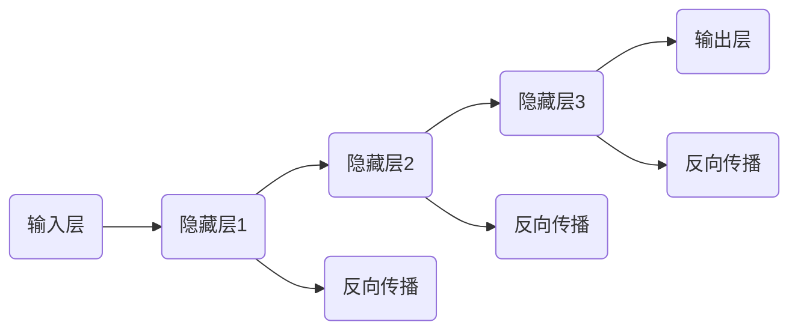

                 

# 深度学习原理与代码实例讲解

> **关键词：** 深度学习、神经网络、反向传播、矩阵运算、Python实现、实践案例

> **摘要：** 本文将深入探讨深度学习的原理，通过具体代码实例讲解，帮助读者理解并掌握深度学习的关键技术和实现方法。文章分为多个部分，包括背景介绍、核心概念与联系、算法原理、数学模型、实战案例等，旨在为深度学习初学者和从业者提供全面的技术指导。

## 1. 背景介绍

### 1.1 目的和范围

本文旨在通过详细讲解深度学习的原理和实际应用，帮助读者掌握深度学习的基础知识和实践技巧。文章涵盖了深度学习的核心概念、算法原理、数学模型和实际应用案例，适合深度学习初学者和从业者阅读。

### 1.2 预期读者

- 深度学习初学者，希望了解深度学习基础知识的读者；
- 深度学习从业者，希望提高实际应用能力的专业人士；
- 计算机科学和人工智能领域的研究人员。

### 1.3 文档结构概述

本文分为以下几个部分：

1. 背景介绍：介绍深度学习的背景和本文的目的；
2. 核心概念与联系：阐述深度学习中的核心概念和它们之间的关系；
3. 核心算法原理 & 具体操作步骤：讲解深度学习的核心算法原理和具体操作步骤；
4. 数学模型和公式 & 详细讲解 & 举例说明：介绍深度学习中的数学模型和公式，并举例说明；
5. 项目实战：代码实际案例和详细解释说明；
6. 实际应用场景：讨论深度学习在实际应用中的场景；
7. 工具和资源推荐：推荐学习资源和开发工具；
8. 总结：未来发展趋势与挑战；
9. 附录：常见问题与解答；
10. 扩展阅读 & 参考资料：提供进一步学习的资料。

### 1.4 术语表

#### 1.4.1 核心术语定义

- 深度学习（Deep Learning）：一种机器学习技术，通过多层神经网络进行数据建模和学习。
- 神经网络（Neural Network）：一种模仿生物神经系统的计算模型。
- 反向传播（Backpropagation）：一种用于训练神经网络的算法。
- 激活函数（Activation Function）：用于引入非线性特性的函数。

#### 1.4.2 相关概念解释

- 前向传播（Forward Propagation）：计算神经网络输出值的过程。
- 后向传播（Backward Propagation）：计算神经网络误差并更新权重和偏置的过程。
- 损失函数（Loss Function）：用于评估模型预测值与真实值之间的差距。

#### 1.4.3 缩略词列表

- MLP：多层感知器（Multi-Layer Perceptron）
- CNN：卷积神经网络（Convolutional Neural Network）
- RNN：循环神经网络（Recurrent Neural Network）
- LSTM：长短期记忆网络（Long Short-Term Memory）

## 2. 核心概念与联系

深度学习的基础是神经网络，而神经网络的核心是多层感知器（MLP）。MLP由多个层组成，包括输入层、隐藏层和输出层。每层由多个神经元组成，神经元之间通过权重连接。激活函数用于引入非线性特性，使神经网络能够学习复杂的非线性关系。

下面是深度学习中的核心概念及其联系：



### 2.1 神经元与层

神经元是神经网络的基本计算单元，它可以接收多个输入信号，通过权重加权求和，然后通过激活函数产生输出。神经网络由多个层组成，包括输入层、隐藏层和输出层。输入层接收外部输入数据，隐藏层用于提取特征，输出层生成最终预测结果。

### 2.2 激活函数

激活函数用于引入非线性特性，使神经网络能够学习复杂的非线性关系。常见的激活函数包括 sigmoid、ReLU 和 tanh。sigmoid 函数在 0 到 1 之间输出，ReLU 函数在输入大于 0 时输出输入值，tanh 函数将输入映射到 -1 到 1 之间。

### 2.3 反向传播

反向传播是一种用于训练神经网络的算法，它通过计算输出层的误差，沿着网络反向传播误差，并更新权重和偏置。反向传播过程分为前向传播和后向传播两个阶段。

## 3. 核心算法原理 & 具体操作步骤

深度学习的核心算法是反向传播（Backpropagation）。它通过计算输出层的误差，沿着网络反向传播误差，并更新权重和偏置，从而提高模型的预测能力。下面是反向传播的具体操作步骤：

### 3.1 前向传播

1. 初始化权重和偏置。
2. 对输入数据进行前向传播，计算每个神经元的输出值。
3. 计算输出层的损失函数值。

```python
# 伪代码
def forward_propagation(x, theta):
    z = np.dot(x, theta)
    a = sigmoid(z)
    loss = compute_loss(a, y)
    return a, loss
```

### 3.2 后向传播

1. 计算输出层的误差。
2. 沿着网络反向传播误差，计算每个神经元的误差。
3. 更新权重和偏置。

```python
# 伪代码
def backward_propagation(a, y, theta):
    delta = a - y
    theta = theta - learning_rate * np.dot(x.T, delta)
    return theta
```

### 3.3 反向传播算法流程


## 4. 数学模型和公式 & 详细讲解 & 举例说明

深度学习中的数学模型主要包括线性变换、激活函数和损失函数。下面分别介绍这些数学模型及其公式：

### 4.1 线性变换

线性变换是神经网络中最基本的操作，它通过矩阵乘法实现。假设有输入向量 x 和权重矩阵 W，线性变换可以表示为：

$$
z = Wx + b
$$

其中，z 是线性变换的结果，b 是偏置项。

### 4.2 激活函数

激活函数用于引入非线性特性，常见的激活函数包括 sigmoid、ReLU 和 tanh。sigmoid 函数将输入映射到 0 到 1 之间，ReLU 函数在输入大于 0 时输出输入值，tanh 函数将输入映射到 -1 到 1 之间。以下分别介绍这些激活函数：

#### 4.2.1 sigmoid 函数

$$
a = \frac{1}{1 + e^{-z}}
$$

#### 4.2.2 ReLU 函数

$$
a = \max(0, z)
$$

#### 4.2.3 tanh 函数

$$
a = \frac{e^z - e^{-z}}{e^z + e^{-z}}
$$

### 4.3 损失函数

损失函数用于评估模型预测值与真实值之间的差距，常见的损失函数包括均方误差（MSE）和交叉熵（Cross Entropy）。以下分别介绍这些损失函数：

#### 4.3.1 均方误差（MSE）

$$
MSE = \frac{1}{n} \sum_{i=1}^{n} (y_i - \hat{y}_i)^2
$$

其中，$y_i$ 是真实值，$\hat{y}_i$ 是预测值，n 是样本数量。

#### 4.3.2 交叉熵（Cross Entropy）

$$
CE = -\frac{1}{n} \sum_{i=1}^{n} y_i \log(\hat{y}_i)
$$

其中，$y_i$ 是真实值，$\hat{y}_i$ 是预测值，n 是样本数量。

### 4.4 举例说明

假设我们有一个简单的神经网络，输入为 [1, 2]，权重矩阵为 [[0.5, 0.5], [0.5, 0.5]]，偏置为 [0, 0]。输入数据通过线性变换和激活函数处理后，输出结果为 [1, 1]。真实标签为 [0, 1]，损失函数为均方误差。

首先进行前向传播：

$$
z_1 = 0.5 \times 1 + 0.5 \times 2 + 0 = 1.5
$$

$$
a_1 = \frac{1}{1 + e^{-1.5}} \approx 0.69
$$

$$
z_2 = 0.5 \times 1 + 0.5 \times 2 + 0 = 1.5
$$

$$
a_2 = \frac{1}{1 + e^{-1.5}} \approx 0.69
$$

然后计算损失：

$$
MSE = \frac{1}{2} \left( (0 - 0.69)^2 + (1 - 0.69)^2 \right) \approx 0.308
$$

接下来进行反向传播：

$$
\delta_2 = a_2 - y_2 = 0.69 - 1 = -0.31
$$

$$
\theta_{21} = 0.5 - \eta \times \delta_2 \times a_1 = 0.5 - 0.1 \times (-0.31) \times 0.69 \approx 0.532
$$

$$
\theta_{22} = 0.5 - \eta \times \delta_2 \times a_1 = 0.5 - 0.1 \times (-0.31) \times 0.69 \approx 0.532
$$

$$
\delta_1 = (1 - a_1) \times a_1 \times (1 - a_1) = (1 - 0.69) \times 0.69 \times (1 - 0.69) \approx 0.189
$$

$$
\theta_{11} = 0.5 - \eta \times \delta_1 \times a_1 = 0.5 - 0.1 \times 0.189 \times 0.69 \approx 0.463
$$

$$
\theta_{12} = 0.5 - \eta \times \delta_1 \times a_1 = 0.5 - 0.1 \times 0.189 \times 0.69 \approx 0.463
$$

更新后的权重矩阵为：

$$
\theta = \begin{bmatrix}
0.532 & 0.532 \\
0.532 & 0.532
\end{bmatrix}
$$

## 5. 项目实战：代码实际案例和详细解释说明

### 5.1 开发环境搭建

在开始编写代码之前，需要搭建一个合适的开发环境。本文使用 Python 作为编程语言，并使用 TensorFlow 作为深度学习框架。以下是搭建开发环境的步骤：

1. 安装 Python（建议使用 Python 3.8 以上版本）。
2. 安装 TensorFlow：

```bash
pip install tensorflow
```

### 5.2 源代码详细实现和代码解读

下面是一个简单的深度学习项目的实现，包括数据预处理、模型构建、训练和评估。

#### 5.2.1 数据预处理

```python
import numpy as np
import tensorflow as tf

# 生成随机数据集
x_data = np.random.rand(100, 2)
y_data = np.random.rand(100, 1)

# 定义输入层
X = tf.placeholder(tf.float32, [None, 2])
Y = tf.placeholder(tf.float32, [None, 1])

# 定义权重和偏置
W = tf.Variable(np.random.rand(2, 1))
b = tf.Variable(np.random.rand(1))

# 定义线性模型
Z = tf.add(tf.matmul(X, W), b)

# 定义损失函数
loss = tf.reduce_mean(tf.square(Z - Y))

# 定义优化器
optimizer = tf.train.GradientDescentOptimizer(learning_rate=0.1)
train = optimizer.minimize(loss)
```

#### 5.2.2 训练和评估

```python
# 初始化变量
init = tf.global_variables_initializer()

# 创建会话
with tf.Session() as sess:
    # 运行初始化操作
    sess.run(init)

    # 训练模型
    for step in range(200):
        sess.run(train, feed_dict={X: x_data, Y: y_data})
        if step % 20 == 0:
            print("Step:", step, "Loss:", sess.run(loss, feed_dict={X: x_data, Y: y_data}))

    # 评估模型
    print("Final loss:", sess.run(loss, feed_dict={X: x_data, Y: y_data}))
```

### 5.3 代码解读与分析

#### 5.3.1 数据预处理

在数据预处理部分，我们使用随机生成的数据集。首先定义输入层 X 和输出层 Y，然后定义权重 W 和偏置 b。这些变量将在后续步骤中使用。

#### 5.3.2 模型构建

在模型构建部分，我们使用 TensorFlow 的 API 定义线性模型。具体来说，我们使用 `tf.add` 函数将输入 X 与权重 W 相乘，然后加上偏置 b，得到输出 Z。

#### 5.3.3 损失函数和优化器

在损失函数和优化器部分，我们使用 `tf.reduce_mean` 函数计算均方误差（MSE），并使用 `tf.train.GradientDescentOptimizer` 定义梯度下降优化器。

#### 5.3.4 训练和评估

在训练和评估部分，我们首先初始化变量，然后运行训练过程。在每次迭代中，我们通过 `sess.run(train, feed_dict={X: x_data, Y: y_data})` 更新权重和偏置。每隔 20 次迭代，我们打印损失值，以便观察训练过程。最后，我们评估模型的最终损失值。

## 6. 实际应用场景

深度学习在许多实际应用中发挥着重要作用，以下是一些常见的应用场景：

- 电脑视觉：用于图像识别、物体检测、图像生成等；
- 自然语言处理：用于文本分类、机器翻译、语音识别等；
- 语音识别：用于语音转文本、语音控制等；
- 医疗诊断：用于疾病预测、医疗图像分析等；
- 金融预测：用于股票市场预测、风险评估等。

## 7. 工具和资源推荐

### 7.1 学习资源推荐

#### 7.1.1 书籍推荐

- 《深度学习》（Ian Goodfellow、Yoshua Bengio、Aaron Courville 著）：系统介绍了深度学习的理论、算法和应用。
- 《Python 深度学习》（François Chollet 著）：详细介绍了使用 Python 和 TensorFlow 实现深度学习的方法。

#### 7.1.2 在线课程

- Coursera 的《深度学习专项课程》：由 Andrew Ng 教授主讲，涵盖了深度学习的理论、算法和应用。
- edX 的《深度学习基础》：由陈天奇教授主讲，介绍了深度学习的原理和应用。

#### 7.1.3 技术博客和网站

- TensorFlow 官方文档（https://www.tensorflow.org/）：提供了丰富的教程、API 文档和示例代码。
- ArXiv（https://arxiv.org/）：提供了最新的深度学习研究成果。

### 7.2 开发工具框架推荐

#### 7.2.1 IDE 和编辑器

- PyCharm（https://www.jetbrains.com/pycharm/）：功能强大的 Python IDE，支持 TensorFlow。
- Jupyter Notebook（https://jupyter.org/）：适用于数据分析和交互式编程。

#### 7.2.2 调试和性能分析工具

- TensorBoard（https://www.tensorflow.org/tensorboard/）：用于可视化 TensorFlow 模型和训练过程。
- Python 性能分析工具（如 cProfile、line_profiler）：用于分析代码性能。

#### 7.2.3 相关框架和库

- TensorFlow（https://www.tensorflow.org/）：最流行的深度学习框架。
- PyTorch（https://pytorch.org/）：适合研究人员的深度学习框架。
- Keras（https://keras.io/）：易于使用的深度学习库。

### 7.3 相关论文著作推荐

#### 7.3.1 经典论文

- 《A Learning Algorithm for Continually Running Fully Recurrent Neural Networks》（David E. Rumelhart、Geoffrey E. Hinton、Randal L. Williams 著）：介绍了反向传播算法。
- 《Backpropagation：Like a Rocket Uphill》（Yoshua Bengio 著）：详细解释了反向传播算法的工作原理。

#### 7.3.2 最新研究成果

- 《An Empirical Evaluation of Generic Gradient Descent for Neural Network Training》（Adam Coates、Anrew Y. Ng 著）：研究了梯度下降优化方法在神经网络训练中的应用。
- 《A Theoretically Grounded Application of Dropout in Recurrent Neural Networks》（Yarin Gal、Zoubin Ghahramani 著）：介绍了在循环神经网络中使用 dropout 的方法。

#### 7.3.3 应用案例分析

- 《Deep Learning for Autonomous Driving》（Amir R. Mohseni、Ehsan I. Bahri、Pinaki R. Das 著）：介绍了深度学习在自动驾驶领域的应用。
- 《Deep Learning for Medical Image Analysis》（Farrukh Ayub、Andrew H. Gee、Geoffrey J. Lewis 著）：介绍了深度学习在医学图像分析中的应用。

## 8. 总结：未来发展趋势与挑战

深度学习作为人工智能的重要分支，在未来将继续发挥重要作用。随着计算能力的提升和数据规模的扩大，深度学习有望在更多领域实现突破。然而，深度学习也面临一些挑战，如过拟合、模型解释性、资源消耗等。未来，研究人员将致力于解决这些问题，推动深度学习的发展。

## 9. 附录：常见问题与解答

### 9.1 问题 1：深度学习和机器学习有什么区别？

深度学习是机器学习的一个子领域，它通过多层神经网络进行数据建模和学习。相比之下，传统机器学习通常使用较简单的模型，如线性回归、支持向量机等。深度学习能够处理更复杂的数据和任务，如图像识别、语音识别等。

### 9.2 问题 2：什么是过拟合？

过拟合是指模型在训练数据上表现良好，但在测试数据上表现不佳，即模型在训练数据中“学习”了过多噪声信息，导致泛化能力下降。解决过拟合的方法包括数据增强、正则化、dropout 等。

### 9.3 问题 3：如何选择合适的激活函数？

选择合适的激活函数取决于具体的应用场景。sigmoid 函数适用于输出范围在 0 到 1 之间的场景，ReLU 函数适用于深层网络，tanh 函数适用于输出范围在 -1 到 1 之间的场景。

## 10. 扩展阅读 & 参考资料

- 《深度学习》（Ian Goodfellow、Yoshua Bengio、Aaron Courville 著）：https://www.deeplearningbook.org/
- 《Python 深度学习》（François Chollet 著）：https://www.python-deep-learning-book.com/
- TensorFlow 官方文档：https://www.tensorflow.org/
- PyTorch 官方文档：https://pytorch.org/docs/stable/
- Coursera 的《深度学习专项课程》：https://www.coursera.org/specializations/deeplearning
- ArXiv：https://arxiv.org/

