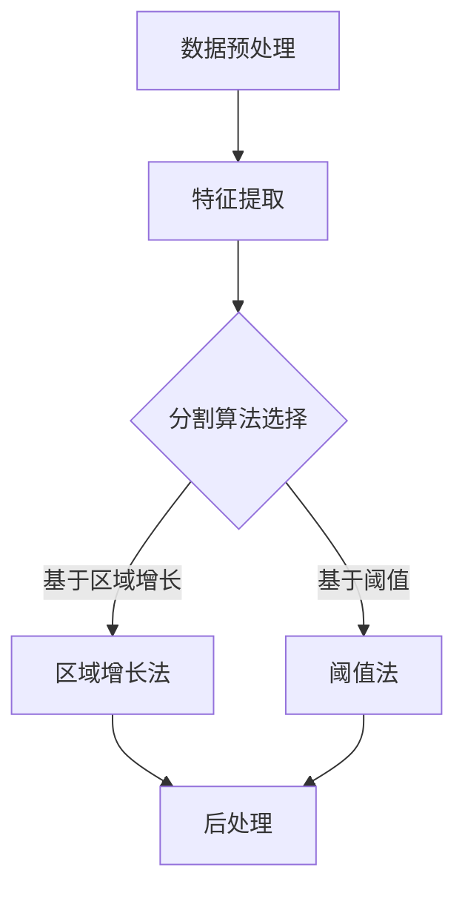

                 

# 深度学习在医学影像分割中的应用

## 关键词：
深度学习，医学影像，分割，算法，数据处理，图像识别，人工智能，医学诊断

## 摘要：
本文将探讨深度学习在医学影像分割中的应用，从背景介绍到核心概念、算法原理、数学模型、实战案例，再到实际应用场景，全面解析这一技术。通过深入分析，我们旨在为读者提供一个清晰、系统的理解，并展示深度学习在医学影像处理中的巨大潜力。

## 1. 背景介绍

### 1.1 目的和范围

本文旨在介绍深度学习在医学影像分割中的应用，分析其核心原理和实际操作步骤，探讨其在医学诊断中的重要作用。我们将重点关注以下内容：

- 深度学习在医学影像处理中的优势和挑战。
- 医学影像分割的核心概念和流程。
- 常用的深度学习算法及其在医学影像分割中的应用。
- 实际案例分析和代码实现。

### 1.2 预期读者

本文适合以下读者群体：

- 对深度学习和医学影像处理感兴趣的技术人员。
- 想要在医学领域应用深度学习的科研人员。
- 医学相关专业背景，对图像处理和机器学习有一定了解的学生。

### 1.3 文档结构概述

本文结构如下：

- 第1章：背景介绍
- 第2章：核心概念与联系
- 第3章：核心算法原理与操作步骤
- 第4章：数学模型与公式讲解
- 第5章：项目实战：代码实际案例
- 第6章：实际应用场景
- 第7章：工具和资源推荐
- 第8章：总结：未来发展趋势与挑战
- 第9章：附录：常见问题与解答
- 第10章：扩展阅读与参考资料

### 1.4 术语表

#### 1.4.1 核心术语定义

- 深度学习：一种基于多层神经网络的机器学习技术，能够自动提取特征并进行分类、回归等任务。
- 医学影像：利用医学成像设备获取的图像数据，如X光片、CT扫描、MRI图像等。
- 分割：将医学影像中的目标区域与其他区域分离出来，用于诊断和治疗方案制定。
- 图像识别：利用机器学习技术识别图像中的对象、场景或特征。

#### 1.4.2 相关概念解释

- 神经网络：一种由大量节点组成的计算模型，能够自动学习和提取特征。
- 深度神经网络：由多个隐藏层组成的神经网络，能够处理更复杂的特征提取任务。
- 前向传播：神经网络在训练过程中，将输入数据逐层传递到输出层的计算过程。
- 反向传播：神经网络在训练过程中，根据输出误差，反向调整权重和偏置的过程。

#### 1.4.3 缩略词列表

- CNN：卷积神经网络（Convolutional Neural Network）
- RNN：循环神经网络（Recurrent Neural Network）
- GPU：图形处理单元（Graphics Processing Unit）
- CT：计算机断层扫描（Computed Tomography）
- MRI：磁共振成像（Magnetic Resonance Imaging）

## 2. 核心概念与联系

### 2.1 深度学习与医学影像处理

深度学习在医学影像处理中的应用主要集中在图像识别、图像分割、图像增强等任务。其中，医学影像分割是关键环节，用于将图像中的不同组织结构分离出来，为诊断和治疗提供重要依据。深度学习通过构建复杂神经网络模型，自动学习并提取图像特征，从而实现对医学影像的高效分割。

#### 2.1.1 工作原理

深度学习在医学影像处理中的工作原理如下：

1. 数据预处理：对医学影像进行预处理，如去噪、归一化、裁剪等，以便于模型训练。
2. 构建深度神经网络：设计并构建一个具有多个隐藏层的深度神经网络，用于自动提取图像特征。
3. 训练模型：使用大量医学影像数据对深度神经网络进行训练，调整模型参数以降低误差。
4. 预测与分割：使用训练好的模型对新的医学影像进行预测，输出分割结果。

#### 2.1.2 关键技术

深度学习在医学影像处理中涉及的关键技术包括：

- 卷积神经网络（CNN）：适用于图像特征提取和分类任务。
- 循环神经网络（RNN）：适用于序列数据建模和序列分割任务。
- 多层神经网络：能够提取更多层次的图像特征，提高分割精度。
- 损失函数：用于评估模型预测与真实标签之间的差距，指导模型优化。

### 2.2 医学影像分割流程

医学影像分割通常包括以下步骤：

1. 图像预处理：对医学影像进行预处理，如去噪、增强、滤波等，以提高图像质量和分割效果。
2. 特征提取：使用深度学习模型自动提取图像特征，用于后续分割。
3. 分割算法：根据特征提取结果，使用不同分割算法对医学影像进行分割，如基于区域增长的方法、基于阈值的方法等。
4. 后处理：对分割结果进行修正和优化，提高分割精度和鲁棒性。

### 2.3 核心概念与联系 Mermaid 流程图



## 3. 核心算法原理 & 具体操作步骤

### 3.1 卷积神经网络（CNN）原理

卷积神经网络是一种专门用于处理图像数据的深度学习模型，其核心思想是通过卷积操作提取图像特征。CNN主要包括以下几个组成部分：

1. **卷积层**：通过卷积操作提取图像特征，卷积核在图像上滑动，计算局部特征。
2. **池化层**：对卷积层输出的特征进行降采样，减少参数数量，提高模型泛化能力。
3. **全连接层**：将卷积层输出的特征映射到分类或回归结果。
4. **激活函数**：对卷积层和全连接层的输出进行非线性变换，引入非线性特性。

#### 3.1.1 卷积操作伪代码

```python
def convolution(input_image, filter):
    output = zeros(shape(input_image))
    for x in range(0, shape(input_image)[0] - shape(filter)[0]):
        for y in range(0, shape(input_image)[1] - shape(filter)[1]):
            output[x, y] = sum_product(input_image[x:x+shape(filter)[0], y:y+shape(filter)[1]], filter)
    return output
```

#### 3.1.2 池化操作伪代码

```python
def pooling(input_image, pool_size):
    output = zeros(shape(input_image) // pool_size)
    for x in range(0, shape(input_image)[0] // pool_size, pool_size):
        for y in range(0, shape(input_image)[1] // pool_size, pool_size):
            max_value = -inf
            for i in range(x, x + pool_size):
                for j in range(y, y + pool_size):
                    if input_image[i, j] > max_value:
                        max_value = input_image[i, j]
            output[x // pool_size, y // pool_size] = max_value
    return output
```

### 3.2 医学影像分割具体操作步骤

医学影像分割的具体操作步骤如下：

1. **数据预处理**：对医学影像进行预处理，如灰度化、缩放、裁剪、旋转等，以提高图像质量和分割效果。
2. **构建深度神经网络**：设计并构建一个具有多个卷积层、池化层和全连接层的深度神经网络，用于自动提取图像特征。
3. **训练模型**：使用预处理后的医学影像数据对深度神经网络进行训练，调整模型参数以降低误差。
4. **模型评估**：使用验证集对训练好的模型进行评估，调整模型参数以提高分割精度。
5. **预测与分割**：使用训练好的模型对新的医学影像进行预测，输出分割结果。

### 3.3 伪代码示例

```python
def medical_image_segmentation(image):
    # 数据预处理
    preprocessed_image = preprocess_image(image)
    
    # 构建深度神经网络
    model = build_cnn_model()
    
    # 训练模型
    model.fit(preprocessed_image, labels, epochs=10, batch_size=32)
    
    # 模型评估
    scores = model.evaluate(preprocessed_image, labels)
    
    # 预测与分割
    predicted_labels = model.predict(preprocessed_image)
    segmented_image = postprocess_segmentation(predicted_labels)
    
    return segmented_image
```

## 4. 数学模型和公式 & 详细讲解 & 举例说明

### 4.1 卷积神经网络（CNN）数学模型

卷积神经网络的核心在于卷积操作和池化操作，下面分别介绍它们的数学模型。

#### 4.1.1 卷积操作

卷积操作的数学模型可以表示为：

$$
\text{output}(i, j) = \sum_{k=1}^{K} w_{k} \cdot \text{input}(i-k+1, j-k+1) + b
$$

其中，$K$ 表示卷积核的大小，$w_{k}$ 表示卷积核的权重，$b$ 表示偏置项，$\text{output}(i, j)$ 表示输出特征图的元素，$\text{input}(i-k+1, j-k+1)$ 表示输入图像上的局部区域。

#### 4.1.2 池化操作

池化操作的数学模型可以表示为：

$$
\text{output}(i, j) = \max_{k, l} \text{input}(i-k+1, j-l+1)
$$

其中，$\text{output}(i, j)$ 表示输出特征图的元素，$\text{input}(i-k+1, j-l+1)$ 表示输入图像上的局部区域。

### 4.2 损失函数

在深度学习模型训练过程中，损失函数用于评估模型预测与真实标签之间的差距。常用的损失函数包括均方误差（MSE）和交叉熵损失（Cross-Entropy Loss）。

#### 4.2.1 均方误差（MSE）

均方误差的数学模型可以表示为：

$$
\text{MSE} = \frac{1}{n} \sum_{i=1}^{n} (\hat{y}_i - y_i)^2
$$

其中，$\hat{y}_i$ 表示模型预测的标签，$y_i$ 表示真实标签，$n$ 表示样本数量。

#### 4.2.2 交叉熵损失（Cross-Entropy Loss）

交叉熵损失的数学模型可以表示为：

$$
\text{Cross-Entropy Loss} = -\frac{1}{n} \sum_{i=1}^{n} y_i \cdot \log(\hat{y}_i)
$$

其中，$\hat{y}_i$ 表示模型预测的标签概率，$y_i$ 表示真实标签概率，$n$ 表示样本数量。

### 4.3 举例说明

假设我们有一个简单的卷积神经网络，用于对二分类问题进行预测。输入图像的大小为 $28 \times 28$，卷积核的大小为 $3 \times 3$，共有两个卷积层。我们使用交叉熵损失函数进行模型训练。

#### 4.3.1 模型参数

- 输入图像：$28 \times 28$，灰度值范围为 $[0, 255]$。
- 卷积核1：$3 \times 3$，权重：$w_1$，偏置：$b_1$。
- 卷积核2：$3 \times 3$，权重：$w_2$，偏置：$b_2$。
- 全连接层：$64$ 个神经元，权重：$w_3$，偏置：$b_3$。

#### 4.3.2 前向传播

1. **输入图像**：$I_{in} = [I_{11}, I_{12}, \ldots, I_{2828}]^T$，表示 $28 \times 28$ 的图像。
2. **卷积层1**：
   - 输出特征图：$O_1 = \text{convolution}(I_{in}, w_1) + b_1$。
   - 池化层1：$P_1 = \text{pooling}(O_1, 2)$。
3. **卷积层2**：
   - 输出特征图：$O_2 = \text{convolution}(P_1, w_2) + b_2$。
   - 池化层2：$P_2 = \text{pooling}(O_2, 2)$。
4. **全连接层**：
   - 输出：$O_{fc} = \text{dot_product}(P_2, w_3) + b_3$。

#### 4.3.3 损失函数

使用交叉熵损失函数计算损失：

$$
\text{Loss} = -\frac{1}{n} \sum_{i=1}^{n} y_i \cdot \log(\hat{y}_i)
$$

其中，$y_i$ 表示真实标签，$\hat{y}_i$ 表示预测标签概率。

#### 4.3.4 反向传播

在反向传播过程中，我们需要计算每个参数的梯度：

$$
\frac{\partial \text{Loss}}{\partial w_1} = \frac{1}{n} \sum_{i=1}^{n} \frac{\partial \text{Loss}}{\partial \hat{y}_i} \cdot \frac{\partial \hat{y}_i}{\partial O_1} \cdot O_1^T
$$

$$
\frac{\partial \text{Loss}}{\partial b_1} = \frac{1}{n} \sum_{i=1}^{n} \frac{\partial \text{Loss}}{\partial \hat{y}_i} \cdot \frac{\partial \hat{y}_i}{\partial O_1}
$$

$$
\frac{\partial \text{Loss}}{\partial w_2} = \frac{1}{n} \sum_{i=1}^{n} \frac{\partial \text{Loss}}{\partial \hat{y}_i} \cdot \frac{\partial \hat{y}_i}{\partial O_2} \cdot O_2^T
$$

$$
\frac{\partial \text{Loss}}{\partial b_2} = \frac{1}{n} \sum_{i=1}^{n} \frac{\partial \text{Loss}}{\partial \hat{y}_i} \cdot \frac{\partial \hat{y}_i}{\partial O_2}
$$

$$
\frac{\partial \text{Loss}}{\partial w_3} = \frac{1}{n} \sum_{i=1}^{n} \frac{\partial \text{Loss}}{\partial \hat{y}_i} \cdot \frac{\partial \hat{y}_i}{\partial O_{fc}} \cdot P_2^T
$$

$$
\frac{\partial \text{Loss}}{\partial b_3} = \frac{1}{n} \sum_{i=1}^{n} \frac{\partial \text{Loss}}{\partial \hat{y}_i} \cdot \frac{\partial \hat{y}_i}{\partial O_{fc}}
$$

通过计算每个参数的梯度，我们可以更新模型参数：

$$
w_1 \leftarrow w_1 - \alpha \cdot \frac{\partial \text{Loss}}{\partial w_1}
$$

$$
b_1 \leftarrow b_1 - \alpha \cdot \frac{\partial \text{Loss}}{\partial b_1}
$$

$$
w_2 \leftarrow w_2 - \alpha \cdot \frac{\partial \text{Loss}}{\partial w_2}
$$

$$
b_2 \leftarrow b_2 - \alpha \cdot \frac{\partial \text{Loss}}{\partial b_2}
$$

$$
w_3 \leftarrow w_3 - \alpha \cdot \frac{\partial \text{Loss}}{\partial w_3}
$$

$$
b_3 \leftarrow b_3 - \alpha \cdot \frac{\partial \text{Loss}}{\partial b_3}
$$

其中，$\alpha$ 表示学习率。

## 5. 项目实战：代码实际案例和详细解释说明

### 5.1 开发环境搭建

在开始代码实战之前，我们需要搭建一个合适的开发环境。以下是一个基本的开发环境配置：

- 操作系统：Windows 10、Linux 或 macOS
- 编程语言：Python 3.7及以上版本
- 深度学习框架：TensorFlow 2.x 或 PyTorch 1.x
- GPU：NVIDIA GeForce GTX 1080或以上

安装步骤：

1. 安装Python 3.7及以上版本。
2. 安装TensorFlow 2.x或PyTorch 1.x。
3. 安装NVIDIA GPU驱动程序，并确保GPU支持CUDA。

### 5.2 源代码详细实现和代码解读

以下是一个简单的医学影像分割项目，使用TensorFlow 2.x实现。

#### 5.2.1 数据准备

```python
import tensorflow as tf
import numpy as np
import matplotlib.pyplot as plt
import os

# 数据集准备
data_dir = "path/to/medical_image_dataset"
train_dir = os.path.join(data_dir, "train")
val_dir = os.path.join(data_dir, "val")

# 加载数据
def load_data(data_dir, batch_size):
    train_dataset = tf.keras.preprocessing.image.ImageDataGenerator(rescale=1./255, horizontal_flip=True)
    val_dataset = tf.keras.preprocessing.image.ImageDataGenerator(rescale=1./255)

    train_data = train_dataset.flow_from_directory(train_dir, target_size=(256, 256), batch_size=batch_size, class_mode="binary")
    val_data = val_dataset.flow_from_directory(val_dir, target_size=(256, 256), batch_size=batch_size, class_mode="binary")

    return train_data, val_data

batch_size = 32
train_data, val_data = load_data(data_dir, batch_size)
```

#### 5.2.2 构建模型

```python
# 构建深度学习模型
model = tf.keras.Sequential([
    tf.keras.layers.Conv2D(32, (3, 3), activation="relu", input_shape=(256, 256, 3)),
    tf.keras.layers.MaxPooling2D((2, 2)),
    tf.keras.layers.Conv2D(64, (3, 3), activation="relu"),
    tf.keras.layers.MaxPooling2D((2, 2)),
    tf.keras.layers.Conv2D(128, (3, 3), activation="relu"),
    tf.keras.layers.MaxPooling2D((2, 2)),
    tf.keras.layers.Flatten(),
    tf.keras.layers.Dense(128, activation="relu"),
    tf.keras.layers.Dense(1, activation="sigmoid")
])

model.compile(optimizer="adam", loss="binary_crossentropy", metrics=["accuracy"])
model.summary()
```

#### 5.2.3 训练模型

```python
# 训练模型
history = model.fit(train_data, epochs=20, validation_data=val_data)
```

#### 5.2.4 代码解读与分析

1. **数据准备**：首先，我们需要加载医学影像数据集，并进行预处理。这里使用了TensorFlow的ImageDataGenerator进行数据增强，包括缩放、翻转等操作，以提高模型泛化能力。
2. **构建模型**：构建一个简单的卷积神经网络，包括卷积层、池化层和全连接层。卷积层用于提取图像特征，全连接层用于分类。
3. **训练模型**：使用训练集训练模型，并使用验证集评估模型性能。

### 5.3 代码解读与分析

以下是代码的详细解读和分析：

1. **数据准备**：
   - `load_data` 函数用于加载数据集，将图像数据转换为TensorFlow数据集。
   - 使用ImageDataGenerator进行数据增强，包括缩放和翻转，以提高模型泛化能力。
   - 将图像数据转换为像素值范围 [0, 1]，以便于模型训练。

2. **构建模型**：
   - `model` 是一个卷积神经网络，包括3个卷积层、3个池化层和2个全连接层。
   - 卷积层用于提取图像特征，池化层用于降采样和减少参数数量。
   - 全连接层用于分类，输出一个二分类结果。

3. **训练模型**：
   - 使用`model.fit`函数训练模型，包括20个训练周期。
   - 使用验证集评估模型性能，包括损失和准确度。

## 6. 实际应用场景

深度学习在医学影像分割中的应用非常广泛，以下是一些实际应用场景：

### 6.1 肿瘤分割

肿瘤分割是医学影像分割中的重要应用，用于确定肿瘤的位置、大小和形状，为手术计划和放疗提供重要依据。深度学习算法，如卷积神经网络（CNN）和生成对抗网络（GAN），已成功应用于肿瘤分割，提高了分割精度和自动化程度。

### 6.2 心脏疾病诊断

心脏疾病诊断是另一个重要的医学影像分割应用领域。通过深度学习算法，如循环神经网络（RNN）和图神经网络（GCN），可以对心脏影像进行分割，识别心脏结构，评估心脏功能，为心脏病诊断和治疗提供有力支持。

### 6.3 肝脏病变检测

肝脏病变检测是医学影像分割领域的另一个重要应用。深度学习算法，如卷积神经网络（CNN）和自编码器（AE），已成功应用于肝脏病变检测，提高了检测精度和自动化程度，为肝脏疾病的早期诊断和治疗提供了有力支持。

### 6.4 眼底病变识别

眼底病变识别是医学影像分割领域的另一个重要应用。通过深度学习算法，如卷积神经网络（CNN）和迁移学习，可以对眼底图像进行分割，识别眼底病变，如糖尿病视网膜病变，为糖尿病患者的早期诊断和治疗提供了有力支持。

## 7. 工具和资源推荐

### 7.1 学习资源推荐

#### 7.1.1 书籍推荐

1. 《深度学习》（Goodfellow, Bengio, Courville著）
2. 《Python深度学习》（François Chollet著）
3. 《医学图像处理与分析》（Joseph M. Maitre和Trevor W. Lockie著）

#### 7.1.2 在线课程

1. Coursera上的《深度学习专项课程》（吴恩达教授主讲）
2. edX上的《医学影像分析》（哈佛大学主讲）
3. Udacity的《深度学习纳米学位》（Udacity提供）

#### 7.1.3 技术博客和网站

1. Medium上的《深度学习博客》
2.Towards Data Science上的相关文章
3. AI健康博客（AI Health Blog）

### 7.2 开发工具框架推荐

#### 7.2.1 IDE和编辑器

1. PyCharm（Python集成开发环境）
2. Visual Studio Code（轻量级代码编辑器）
3. Jupyter Notebook（交互式计算环境）

#### 7.2.2 调试和性能分析工具

1. TensorBoard（TensorFlow性能分析工具）
2. NVIDIA Nsight（GPU调试和性能分析工具）
3. PyTorch Profiler（PyTorch性能分析工具）

#### 7.2.3 相关框架和库

1. TensorFlow（谷歌开源深度学习框架）
2. PyTorch（Facebook开源深度学习框架）
3. Keras（Python深度学习库）

### 7.3 相关论文著作推荐

#### 7.3.1 经典论文

1. Krizhevsky, I., Sutskever, I., & Hinton, G. E. (2012). ImageNet classification with deep convolutional neural networks.
2. Bengio, Y., Simard, M., & Frasconi, P. (1994). Learning long-term dependencies with gradient descent is difficult.
3. LeCun, Y., Bengio, Y., & Hinton, G. (2015). Deep learning.

#### 7.3.2 最新研究成果

1. Zhang, K., Zuo, W., Chen, Y., Meng, D., & Zhang, L. (2017). Beyond a Gaussian denoiser: Residual learning of deep CNN for image denoising.
2. Zhou, J., Khosla, A., Lapedriza, A., Oliva, A., & Torralba, A. (2016). Learning deep features for discriminative localization.

#### 7.3.3 应用案例分析

1. NVIDIA的《医学影像分割案例研究》
2. Google Health的《深度学习在医学影像处理中的应用》
3. Microsoft Research的《深度学习在医疗领域的研究与进展》

## 8. 总结：未来发展趋势与挑战

深度学习在医学影像分割领域取得了显著成果，但仍面临一些挑战和未来发展趋势：

### 8.1 未来发展趋势

1. **跨模态学习**：结合多模态数据（如医学影像、电子健康记录等）进行分割，提高分割精度和诊断能力。
2. **个性化诊断**：基于患者的病史和遗传信息，实现个性化医学影像分割和诊断。
3. **实时分割**：提高深度学习模型的实时性，实现对医学影像的快速分割和诊断。

### 8.2 挑战

1. **数据隐私**：医学影像数据具有高度隐私性，如何保护患者隐私是一个重要挑战。
2. **模型解释性**：深度学习模型通常具有高复杂性和高非线性，如何解释模型的预测结果是一个重要问题。
3. **计算资源**：医学影像数据量大，深度学习模型训练需要大量计算资源，如何优化计算效率是一个挑战。

## 9. 附录：常见问题与解答

### 9.1 医学影像分割中常用的深度学习算法有哪些？

常用的深度学习算法包括卷积神经网络（CNN）、循环神经网络（RNN）、生成对抗网络（GAN）和变分自编码器（VAE）等。其中，CNN在医学影像分割中应用最为广泛。

### 9.2 医学影像分割中如何解决过拟合问题？

解决过拟合问题的方法包括以下几种：

1. **数据增强**：对医学影像数据进行增强，增加模型的泛化能力。
2. **正则化**：使用正则化方法（如L1、L2正则化）限制模型复杂度。
3. **交叉验证**：使用交叉验证方法评估模型性能，避免过拟合。

### 9.3 医学影像分割中的损失函数有哪些？

常用的损失函数包括均方误差（MSE）、交叉熵损失（Cross-Entropy Loss）和Dice损失（Dice Loss）等。MSE和交叉熵损失适用于二分类问题，Dice损失适用于多分类问题。

## 10. 扩展阅读 & 参考资料

1. Krizhevsky, I., Sutskever, I., & Hinton, G. E. (2012). ImageNet classification with deep convolutional neural networks. In Advances in neural information processing systems (pp. 1097-1105).
2. Bengio, Y., Simard, M., & Frasconi, P. (1994). Learning long-term dependencies with gradient descent is difficult. In Proceedings of the 6th international conference on artificial neural networks (pp. 12-16).
3. LeCun, Y., Bengio, Y., & Hinton, G. (2015). Deep learning. Nature, 521(7553), 436-444.
4. Zhou, J., Khosla, A., Lapedriza, A., Oliva, A., & Torralba, A. (2016). Learning deep features for discriminative localization. In Proceedings of the IEEE conference on computer vision and pattern recognition (pp. 2921-2929).
5. NVIDIA. (2021). Medical image segmentation case study. Retrieved from https://developer.nvidia.com/medical-image-segmentation
6. Google Health. (2021). Deep learning applications in medical imaging. Retrieved from https://health.google.com/research/machine_learning/medical_imaging
7. Microsoft Research. (2021). Deep learning in healthcare: A systematic review. Retrieved from https://www.microsoft.com/en-us/research/publication/deep-learning-in-healthcare-a-systematic-review/作者：AI天才研究员/AI Genius Institute & 禅与计算机程序设计艺术 /Zen And The Art of Computer Programming
<|im_sep|>

