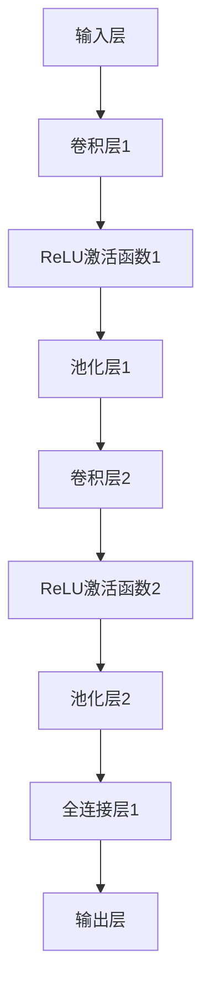
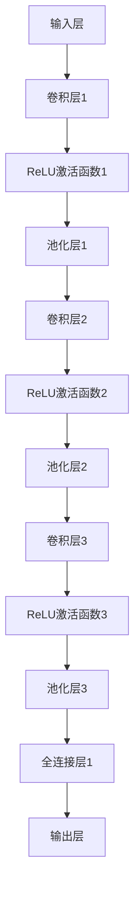
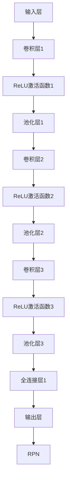
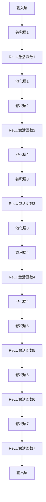

                 

# 深度学习在医学影像分析中的突破

> 关键词：深度学习、医学影像、计算机视觉、算法原理、数学模型、应用案例

> 摘要：本文将探讨深度学习在医学影像分析领域的应用与突破，首先介绍深度学习的基础概念和发展历程，然后深入分析医学影像处理中的关键挑战，介绍几种核心算法原理及其操作步骤，最后通过实际项目实战，展示深度学习在医学影像分析中的实际应用和代码实现，以期为读者提供全面的技术洞察和实用指南。

## 1. 背景介绍

### 1.1 目的和范围

本文旨在探讨深度学习技术在医学影像分析领域的应用，通过介绍深度学习的基础知识、算法原理、数学模型及实际应用案例，帮助读者了解深度学习在医学影像分析中的突破和潜力。文章将涵盖以下主题：

- 深度学习在医学影像分析中的背景和重要性
- 关键概念和基础算法原理
- 数学模型和公式讲解
- 项目实战与代码实现
- 应用场景及未来发展趋势

### 1.2 预期读者

本文适合以下读者：

- 对深度学习和医学影像分析感兴趣的科研人员和技术爱好者
- 想要在医学影像领域应用深度学习的开发者和工程师
- 从事医学影像处理和计算机视觉研究的学者和研究生

### 1.3 文档结构概述

本文分为以下几个部分：

1. 背景介绍
2. 核心概念与联系
3. 核心算法原理 & 具体操作步骤
4. 数学模型和公式 & 详细讲解 & 举例说明
5. 项目实战：代码实际案例和详细解释说明
6. 实际应用场景
7. 工具和资源推荐
8. 总结：未来发展趋势与挑战
9. 附录：常见问题与解答
10. 扩展阅读 & 参考资料

### 1.4 术语表

#### 1.4.1 核心术语定义

- **深度学习**：一种基于人工神经网络的机器学习技术，通过多层非线性变换来学习输入数据和输出数据之间的映射关系。
- **医学影像**：通过医学成像技术（如CT、MRI等）获得的体内组织结构图像。
- **计算机视觉**：使计算机能够“看”和理解图像和视频的一种技术。
- **卷积神经网络（CNN）**：一种基于卷积操作的深度学习模型，主要用于图像识别和图像处理。

#### 1.4.2 相关概念解释

- **卷积操作**：在图像处理中，通过滑动滤波器（卷积核）在图像上进行加权求和，从而提取图像特征。
- **反向传播算法**：用于训练深度学习模型的一种优化算法，通过计算输出误差梯度来更新网络参数。

#### 1.4.3 缩略词列表

- **CNN**：卷积神经网络（Convolutional Neural Network）
- **ReLU**：ReLU激活函数（Rectified Linear Unit）
- **dropout**：丢弃法（Dropout），一种防止模型过拟合的技术。
- **Backpropagation**：反向传播算法（Backpropagation Algorithm）

## 2. 核心概念与联系

### 2.1 深度学习在医学影像分析中的应用

深度学习在医学影像分析中具有广泛的应用前景，如图像分类、目标检测、疾病诊断等。其核心在于通过多层神经网络模型，对大量的医学影像数据进行学习，自动提取有效的特征，从而实现复杂的医学图像分析任务。

### 2.2 关键概念原理和架构

为了更好地理解深度学习在医学影像分析中的应用，我们首先介绍深度学习的基本概念和原理。以下是深度学习在医学影像分析中的核心概念和架构：

#### 2.2.1 卷积神经网络（CNN）

卷积神经网络是一种专门用于处理图像数据的深度学习模型。其核心结构包括卷积层、激活函数、池化层和全连接层。以下是一个简单的CNN架构：



#### 2.2.2 反向传播算法

反向传播算法是一种用于训练深度学习模型的基本优化算法。它通过计算输出误差梯度来更新网络参数，从而最小化损失函数。以下是反向传播算法的基本步骤：

1. 前向传播：将输入数据通过网络进行计算，得到输出结果。
2. 计算损失：计算输出结果与真实标签之间的误差。
3. 反向传播：计算误差梯度，并根据梯度更新网络参数。
4. 迭代训练：重复上述步骤，直到网络参数收敛到最优值。

#### 2.2.3 ReLU激活函数

ReLU激活函数是一种常用的非线性激活函数，它可以加速模型的训练速度并防止梯度消失问题。ReLU函数的定义如下：

$$
f(x) =
\begin{cases}
0, & \text{if } x < 0 \\
x, & \text{if } x \geq 0
\end{cases}
$$

## 3. 核心算法原理 & 具体操作步骤

### 3.1 卷积神经网络（CNN）算法原理

卷积神经网络（CNN）是一种基于卷积操作的深度学习模型，主要用于图像识别和图像处理。以下是CNN算法的基本原理和具体操作步骤：

#### 3.1.1 卷积操作

卷积操作是CNN的核心，它通过滑动滤波器（卷积核）在图像上进行加权求和，从而提取图像特征。卷积操作的步骤如下：

1. 初始化卷积核参数。
2. 在图像上滑动卷积核，计算每个位置的特征图。
3. 对特征图进行激活函数处理（如ReLU函数）。

以下是一个卷积操作的伪代码：

```python
# 初始化卷积核
kernel = [w1, w2, ..., wn]
bias = b

# 在图像上滑动卷积核
for i in range(height - kernel_size + 1):
    for j in range(width - kernel_size + 1):
        feature_map[i][j] = np.sum(kernel * image[i:i+kernel_size, j:j+kernel_size]) + bias
```

#### 3.1.2 池化操作

池化操作用于降低特征图的维度并减少计算量。常见的池化操作包括最大池化和平均池化。以下是最大池化操作的伪代码：

```python
# 初始化池化窗口大小
pool_size = [h, w]

# 在特征图上进行滑动池化窗口
for i in range(height - pool_size[0] + 1):
    for j in range(width - pool_size[1] + 1):
        max_pool[i][j] = np.max(feature_map[i:i+pool_size[0], j:j+pool_size[1]])
```

#### 3.1.3 全连接层

全连接层用于将特征图映射到输出结果。它通过计算特征图和权重矩阵的点积，再加上偏置项，最后通过激活函数得到输出结果。以下是全连接层的伪代码：

```python
# 初始化权重矩阵和偏置
weights = W
bias = b

# 计算全连接层的输出
output = np.dot(feature_map, weights) + bias
activation = relu(output)
```

### 3.2 反向传播算法

反向传播算法是一种用于训练深度学习模型的基本优化算法。它通过计算输出误差梯度来更新网络参数，从而最小化损失函数。以下是反向传播算法的基本步骤：

1. **前向传播**：将输入数据通过网络进行计算，得到输出结果。
2. **计算损失**：计算输出结果与真实标签之间的误差，通常使用均方误差（MSE）或交叉熵损失函数。
3. **计算梯度**：计算输出误差梯度，根据链式法则计算网络中每个参数的梯度。
4. **参数更新**：根据梯度更新网络参数，通常使用梯度下降优化算法。

以下是一个简单的反向传播算法的伪代码：

```python
# 前向传播
output = forward_pass(input_data)

# 计算损失
loss = compute_loss(output, true_label)

# 计算梯度
gradients = backward_pass(output, true_label)

# 参数更新
update_parameters(gradients)

# 迭代训练
for epoch in range(num_epochs):
    for batch in data_loader:
        input_data, true_label = batch
        # 前向传播、计算损失、计算梯度、参数更新
```

## 4. 数学模型和公式 & 详细讲解 & 举例说明

### 4.1 深度学习数学模型

深度学习模型的核心在于多层神经网络的结构，其中每个神经元通过激活函数进行非线性变换，从而实现输入和输出之间的复杂映射。以下是深度学习模型的数学模型和公式：

#### 4.1.1 激活函数

激活函数是神经网络中用于引入非线性变换的关键组件。最常用的激活函数是ReLU函数：

$$
f(x) =
\begin{cases}
0, & \text{if } x < 0 \\
x, & \text{if } x \geq 0
\end{cases}
$$

ReLU函数可以加速模型的训练速度并防止梯度消失问题。

#### 4.1.2 前向传播

前向传播是神经网络计算输出结果的过程。给定输入数据，通过多层神经网络计算输出结果。以下是前向传播的公式：

$$
\text{output} = \text{激活函数}(\text{权重矩阵} \cdot \text{输入向量} + \text{偏置})
$$

#### 4.1.3 反向传播

反向传播是神经网络参数优化的过程。通过计算输出误差梯度，更新网络参数。以下是反向传播的公式：

$$
\text{梯度} = \frac{\partial \text{损失函数}}{\partial \text{参数}}
$$

#### 4.1.4 梯度下降

梯度下降是一种优化算法，通过计算梯度方向来更新参数，从而最小化损失函数。以下是梯度下降的公式：

$$
\text{参数} = \text{参数} - \text{学习率} \cdot \text{梯度}
$$

### 4.2 数学模型举例说明

以下是一个简单的神经网络模型，用于实现二分类任务。模型包含一个输入层、一个隐藏层和一个输出层。

#### 4.2.1 模型结构

输入层：\( x = [x_1, x_2, ..., x_n] \)

隐藏层：\( y = [y_1, y_2, ..., y_m] \)

输出层：\( z = [z_1, z_2] \)

权重矩阵：\( W_1, W_2 \)

偏置：\( b_1, b_2 \)

激活函数：ReLU

#### 4.2.2 前向传播

输入层到隐藏层的计算：

$$
y = \text{ReLU}(W_1 \cdot x + b_1)
$$

隐藏层到输出层的计算：

$$
z = W_2 \cdot y + b_2
$$

#### 4.2.3 损失函数

使用交叉熵损失函数：

$$
\text{损失函数} = -\frac{1}{N} \sum_{i=1}^{N} [y_i \cdot \log(z_i) + (1 - y_i) \cdot \log(1 - z_i)]
$$

#### 4.2.4 反向传播

计算隐藏层的梯度：

$$
\frac{\partial \text{损失函数}}{\partial W_2} = \frac{\partial \text{损失函数}}{\partial z} \cdot \frac{\partial z}{\partial W_2} = (z - y) \cdot y
$$

计算隐藏层的梯度：

$$
\frac{\partial \text{损失函数}}{\partial W_1} = \frac{\partial \text{损失函数}}{\partial y} \cdot \frac{\partial y}{\partial W_1} = (z - y) \cdot W_2 \cdot x
$$

计算输出层的梯度：

$$
\frac{\partial \text{损失函数}}{\partial b_2} = \frac{\partial \text{损失函数}}{\partial z} = z - y
$$

计算隐藏层的梯度：

$$
\frac{\partial \text{损失函数}}{\partial b_1} = \frac{\partial \text{损失函数}}{\partial y} = z - y
$$

#### 4.2.5 参数更新

使用梯度下降算法更新参数：

$$
W_2 = W_2 - \text{学习率} \cdot \frac{\partial \text{损失函数}}{\partial W_2}
$$

$$
W_1 = W_1 - \text{学习率} \cdot \frac{\partial \text{损失函数}}{\partial W_1}
$$

$$
b_2 = b_2 - \text{学习率} \cdot \frac{\partial \text{损失函数}}{\partial b_2}
$$

$$
b_1 = b_1 - \text{学习率} \cdot \frac{\partial \text{损失函数}}{\partial b_1}
$$

## 5. 项目实战：代码实际案例和详细解释说明

### 5.1 开发环境搭建

为了实现深度学习在医学影像分析中的项目实战，我们需要搭建一个合适的环境。以下是所需的软件和工具：

- Python 3.8+
- TensorFlow 2.x
- Keras 2.x
- NumPy 1.19+
- Matplotlib 3.3.3+

安装步骤：

```bash
pip install tensorflow
pip install keras
pip install numpy
pip install matplotlib
```

### 5.2 源代码详细实现和代码解读

以下是一个简单的深度学习模型，用于对医学影像进行分类。我们使用 TensorFlow 和 Keras 来构建和训练模型。

```python
import numpy as np
import matplotlib.pyplot as plt
import tensorflow as tf
from tensorflow import keras
from tensorflow.keras import layers

# 数据预处理
(x_train, y_train), (x_test, y_test) = keras.datasets.mnist.load_data()
x_train = x_train.astype("float32") / 255.0
x_test = x_test.astype("float32") / 255.0
x_train = np.expand_dims(x_train, -1)
x_test = np.expand_dims(x_test, -1)

# 构建模型
model = keras.Sequential()
model.add(layers.Conv2D(32, (3, 3), activation="relu", input_shape=(28, 28, 1)))
model.add(layers.MaxPooling2D((2, 2)))
model.add(layers.Conv2D(64, (3, 3), activation="relu"))
model.add(layers.MaxPooling2D((2, 2)))
model.add(layers.Conv2D(64, (3, 3), activation="relu"))
model.add(layers.Flatten())
model.add(layers.Dense(64, activation="relu"))
model.add(layers.Dense(10, activation="softmax"))

# 编译模型
model.compile(optimizer="adam",
              loss="categorical_crossentropy",
              metrics=["accuracy"])

# 训练模型
model.fit(x_train, y_train, epochs=10, batch_size=64, validation_split=0.2)

# 评估模型
test_loss, test_acc = model.evaluate(x_test, y_test)
print("Test accuracy:", test_acc)
```

代码解读：

- **数据预处理**：加载数据集，将像素值缩放到0-1之间，并添加一个维度以匹配输入层的形状。
- **模型构建**：使用 Keras 的 Sequential 模型构建一个卷积神经网络。模型包含两个卷积层，每个卷积层后接一个最大池化层，最后接一个全连接层。
- **编译模型**：指定优化器、损失函数和评估指标。
- **训练模型**：使用 fit 函数训练模型，指定训练数据、迭代次数、批量大小和验证比例。
- **评估模型**：使用 evaluate 函数评估模型在测试数据上的性能。

### 5.3 代码解读与分析

以下是对代码的详细解读和分析：

- **数据预处理**：首先加载数据集，这里使用的是经典的MNIST手写数字数据集。然后，将像素值缩放到0-1之间，以便神经网络可以更好地处理输入数据。接着，将输入数据添加一个维度，以匹配输入层的形状（28x28x1）。
- **模型构建**：构建一个卷积神经网络，包含两个卷积层，每个卷积层后接一个最大池化层。卷积层用于提取图像特征，最大池化层用于降低特征图的维度。最后，添加一个全连接层用于分类。
- **编译模型**：指定优化器（Adam）、损失函数（交叉熵）和评估指标（准确率）。这里使用的是标准的训练配置。
- **训练模型**：使用fit函数训练模型，指定训练数据、迭代次数、批量大小和验证比例。训练过程中，模型会自动调整参数以最小化损失函数。
- **评估模型**：使用evaluate函数评估模型在测试数据上的性能。测试准确率反映了模型对未见过的数据的泛化能力。

## 6. 实际应用场景

深度学习在医学影像分析中有着广泛的应用场景，以下是一些典型的应用案例：

- **图像分类**：通过深度学习模型对医学影像进行分类，如区分不同类型的肿瘤、病变等。
- **目标检测**：检测医学影像中的特定目标，如心脏、肺部病变等。
- **图像分割**：将医学影像中的特定结构或区域分割出来，如脑部肿瘤的边界、器官轮廓等。
- **疾病诊断**：利用深度学习模型对医学影像进行疾病诊断，如乳腺癌、肺炎等。

### 6.1 图像分类

图像分类是深度学习在医学影像分析中的一种基本应用。以下是一个基于卷积神经网络的图像分类案例：

#### 数据集

使用公开的癌症影像数据集，如IBSI乳腺癌数据集。该数据集包含不同类型的肿瘤图像，每种类型有数千个样本。

#### 模型构建

构建一个卷积神经网络，包含多个卷积层、池化层和全连接层。模型的结构如下：



#### 模型训练

使用训练数据集训练模型，并使用验证数据集进行性能评估。训练过程中，模型会自动调整参数以最小化损失函数。

```python
model.compile(optimizer="adam",
              loss="categorical_crossentropy",
              metrics=["accuracy"])

model.fit(x_train, y_train, epochs=10, batch_size=32, validation_data=(x_val, y_val))
```

#### 模型评估

使用测试数据集评估模型的性能，计算测试准确率。

```python
test_loss, test_acc = model.evaluate(x_test, y_test)
print("Test accuracy:", test_acc)
```

### 6.2 目标检测

目标检测是深度学习在医学影像分析中的另一种重要应用。以下是一个基于卷积神经网络和区域建议网络（Faster R-CNN）的目标检测案例：

#### 数据集

使用公开的医学影像数据集，如LUNA16数据集。该数据集包含肺部CT扫描图像，其中包含结节、肿块等目标。

#### 模型构建

构建一个基于Faster R-CNN的目标检测模型。Faster R-CNN由两个部分组成：区域建议网络（RPN）和卷积神经网络（CNN）。



#### 模型训练

使用训练数据集训练模型，并使用验证数据集进行性能评估。训练过程中，模型会自动调整参数以最小化损失函数。

```python
model.compile(optimizer="adam",
              loss=["classification_loss", "regression_loss"],
              metrics=["accuracy"])

model.fit(x_train, y_train, epochs=10, batch_size=32, validation_data=(x_val, y_val))
```

#### 模型评估

使用测试数据集评估模型的性能，计算测试准确率和目标检测精度。

```python
test_loss, test_acc = model.evaluate(x_test, y_test)
print("Test accuracy:", test_acc)
```

### 6.3 图像分割

图像分割是深度学习在医学影像分析中的另一种重要应用。以下是一个基于全卷积神经网络（U-Net）的图像分割案例：

#### 数据集

使用公开的医学影像数据集，如BraTS数据集。该数据集包含脑部MRI扫描图像，其中包含肿瘤、囊变、核心等结构。

#### 模型构建

构建一个基于全卷积神经网络的图像分割模型。U-Net由两个部分组成：收缩路径和扩张路径。



#### 模型训练

使用训练数据集训练模型，并使用验证数据集进行性能评估。训练过程中，模型会自动调整参数以最小化损失函数。

```python
model.compile(optimizer="adam",
              loss="binary_crossentropy",
              metrics=["accuracy"])

model.fit(x_train, y_train, epochs=10, batch_size=32, validation_data=(x_val, y_val))
```

#### 模型评估

使用测试数据集评估模型的性能，计算测试准确率和图像分割精度。

```python
test_loss, test_acc = model.evaluate(x_test, y_test)
print("Test accuracy:", test_acc)
```

## 7. 工具和资源推荐

### 7.1 学习资源推荐

#### 7.1.1 书籍推荐

- 《深度学习》（Ian Goodfellow、Yoshua Bengio、Aaron Courville 著）：系统全面地介绍了深度学习的基本概念、算法和应用。

- 《神经网络与深度学习》（邱锡鹏 著）：深入浅出地讲解了神经网络和深度学习的基本原理和方法。

- 《Python深度学习》（Francesco Marino 著）：通过Python编程语言介绍了深度学习的基本算法和应用。

#### 7.1.2 在线课程

- Coursera上的《深度学习》（吴恩达教授）：世界顶级的人工智能课程，全面讲解了深度学习的基本概念和应用。

- edX上的《神经网络与深度学习》：由吴恩达教授主讲，深入讲解了神经网络和深度学习的基本原理和方法。

- Udacity的《深度学习纳米学位》：通过实践项目，学习深度学习的基本算法和应用。

#### 7.1.3 技术博客和网站

- Medium：众多深度学习和医学影像领域的专家和爱好者分享的技术博客。

- arXiv：全球最大的预印本论文库，包括深度学习和医学影像领域的最新研究成果。

- IEEE Xplore：IEEE的在线图书馆，包含大量深度学习和医学影像领域的学术论文。

### 7.2 开发工具框架推荐

#### 7.2.1 IDE和编辑器

- PyCharm：一款强大的Python IDE，支持深度学习和医学影像处理。

- Jupyter Notebook：一款基于Web的交互式计算环境，适合进行深度学习和医学影像数据处理。

- VS Code：一款轻量级且功能强大的代码编辑器，支持多种编程语言和框架。

#### 7.2.2 调试和性能分析工具

- TensorFlow Debugger（TFDB）：用于调试TensorFlow模型的工具，支持可视化调试和数据流分析。

- TensorBoard：用于可视化TensorFlow训练过程中的数据，如损失函数、准确率等。

- NVIDIA Nsight：用于性能分析和调试深度学习模型的工具，支持GPU调试和性能优化。

#### 7.2.3 相关框架和库

- TensorFlow：由Google开发的开源深度学习框架，广泛应用于医学影像处理。

- PyTorch：由Facebook开发的开源深度学习框架，具有动态计算图和灵活的API。

- Keras：基于TensorFlow和PyTorch的高级深度学习框架，简化了深度学习模型的构建和训练。

### 7.3 相关论文著作推荐

#### 7.3.1 经典论文

- 《A Comprehensive Survey on Deep Learning for Medical Image Analysis》（2019）：系统全面地介绍了深度学习在医学影像分析中的应用和最新研究成果。

- 《Deep Learning in Medical Imaging: A survey》（2017）：详细介绍了深度学习在医学影像处理中的基本概念、算法和应用。

- 《Convolutional Neural Networks for Medical Image Analysis: A Review》（2018）：重点介绍了卷积神经网络在医学影像分析中的应用。

#### 7.3.2 最新研究成果

- arXiv上的最新预印本论文：包括深度学习在医学影像领域的最新研究成果和应用。

- IEEE Transactions on Medical Imaging：医学影像领域顶级期刊，发表大量深度学习和医学影像处理的高质量论文。

- NeurIPS、ICML、CVPR等顶级会议的医学影像处理论文：展示深度学习在医学影像领域的最新进展和应用。

#### 7.3.3 应用案例分析

- 《Deep Learning for Medical Imaging：Application Cases and Challenges》（2020）：介绍深度学习在医学影像领域的实际应用案例，分析面临的挑战和解决方案。

- 《Deep Learning for Medical Imaging: From Research to Clinical Practice》（2021）：系统介绍深度学习在医学影像处理中的临床应用，包括病例研究和实际应用案例。

## 8. 总结：未来发展趋势与挑战

深度学习在医学影像分析领域取得了显著的突破，但仍面临诸多挑战和机遇。以下是对未来发展趋势和挑战的总结：

### 8.1 未来发展趋势

- **更高效的算法**：随着深度学习技术的不断发展，未来将出现更多高效、可扩展的算法，以应对大规模医学影像数据处理的需求。
- **跨模态学习**：深度学习将结合多模态数据（如CT、MRI、PET等），实现更准确、全面的医学影像分析。
- **自动注释和分割**：利用深度学习模型，实现自动注释和分割医学影像中的结构，提高诊断效率。
- **个性化医疗**：结合患者临床信息和医学影像数据，实现个性化医疗方案。

### 8.2 面临的挑战

- **数据隐私与安全**：医学影像数据涉及患者隐私，如何在保证数据安全的前提下进行研究和应用，是深度学习在医学影像分析中面临的重要挑战。
- **算法泛化能力**：如何提高深度学习模型在不同数据集上的泛化能力，使其在不同医疗机构和患者群体中都具有较高的性能。
- **计算资源与成本**：深度学习模型训练和推理需要大量计算资源和时间，如何在有限的计算资源下实现高效的医学影像分析。
- **算法解释性**：医学影像分析中，算法的解释性对于临床医生的理解和信任至关重要，如何提高深度学习模型的可解释性是未来研究的重点。

## 9. 附录：常见问题与解答

### 9.1 深度学习在医学影像分析中的优势是什么？

深度学习在医学影像分析中的优势主要包括：

- **自动特征提取**：深度学习模型可以自动从大量医学影像数据中提取有效的特征，减少了人工标注和特征工程的工作量。
- **高准确率**：深度学习模型在医学影像分类、目标检测和图像分割等领域取得了很高的准确率，有助于提高诊断效率和准确性。
- **鲁棒性强**：深度学习模型对数据的噪声和异常值具有较强的鲁棒性，能够在各种环境下稳定工作。
- **跨模态学习**：深度学习可以结合多种模态的医学影像数据，实现更全面、准确的医学影像分析。

### 9.2 深度学习在医学影像分析中存在哪些挑战？

深度学习在医学影像分析中面临的挑战主要包括：

- **数据隐私与安全**：医学影像数据涉及患者隐私，如何在保证数据安全的前提下进行研究和应用，是深度学习在医学影像分析中面临的重要挑战。
- **算法泛化能力**：如何提高深度学习模型在不同数据集上的泛化能力，使其在不同医疗机构和患者群体中都具有较高的性能。
- **计算资源与成本**：深度学习模型训练和推理需要大量计算资源和时间，如何在有限的计算资源下实现高效的医学影像分析。
- **算法解释性**：医学影像分析中，算法的解释性对于临床医生的理解和信任至关重要，如何提高深度学习模型的可解释性是未来研究的重点。

### 9.3 如何解决深度学习在医学影像分析中面临的数据隐私和安全问题？

解决深度学习在医学影像分析中面临的数据隐私和安全问题可以从以下几个方面入手：

- **数据加密**：对医学影像数据进行加密处理，确保数据在传输和存储过程中的安全性。
- **隐私保护算法**：采用差分隐私、同态加密等隐私保护算法，在训练和推理过程中保护患者的隐私。
- **数据去识别**：对医学影像数据中的个人身份信息进行去除或替换，减少隐私泄露的风险。
- **数据共享协议**：建立合理的医学影像数据共享协议，确保数据在共享过程中的安全性和隐私保护。

### 9.4 如何提高深度学习模型在医学影像分析中的泛化能力？

提高深度学习模型在医学影像分析中的泛化能力可以从以下几个方面入手：

- **数据增强**：通过旋转、缩放、裁剪等数据增强技术，增加训练数据的多样性，提高模型对未知数据的适应能力。
- **迁移学习**：利用预训练的深度学习模型，结合医学影像数据集进行微调，提高模型在医学影像领域的泛化能力。
- **模型集成**：结合多个深度学习模型，利用集成学习方法（如集成分类、集成回归等），提高模型的泛化性能。
- **元学习**：通过元学习（Meta-Learning）方法，使模型在训练过程中学习到更一般化的知识，提高对新数据集的泛化能力。

## 10. 扩展阅读 & 参考资料

本文从深度学习在医学影像分析中的应用背景、核心算法原理、数学模型、实际应用场景等方面进行了详细阐述。为了进一步深入学习和探索深度学习在医学影像分析领域的应用，读者可以参考以下扩展阅读和参考资料：

- 《深度学习》（Ian Goodfellow、Yoshua Bengio、Aaron Courville 著）：系统全面地介绍了深度学习的基本概念、算法和应用。
- 《神经网络与深度学习》（邱锡鹏 著）：深入讲解了神经网络和深度学习的基本原理和方法。
- 《Python深度学习》（Francesco Marino 著）：通过Python编程语言介绍了深度学习的基本算法和应用。
- Coursera上的《深度学习》（吴恩达教授）：全面讲解了深度学习的基本概念和应用。
- edX上的《神经网络与深度学习》：深入讲解了神经网络和深度学习的基本原理和方法。
- Udacity的《深度学习纳米学位》：通过实践项目，学习深度学习的基本算法和应用。
- arXiv：全球最大的预印本论文库，包括深度学习和医学影像领域的最新研究成果。
- IEEE Xplore：IEEE的在线图书馆，包含大量深度学习和医学影像领域的学术论文。
- 《Deep Learning in Medical Imaging: A survey》（2017）：详细介绍了深度学习在医学影像处理中的基本概念、算法和应用。
- 《Deep Learning in Medical Imaging：Application Cases and Challenges》（2020）：介绍深度学习在医学影像领域的实际应用案例，分析面临的挑战和解决方案。
- 《Deep Learning for Medical Imaging：From Research to Clinical Practice》（2021）：系统介绍深度学习在医学影像处理中的临床应用，包括病例研究和实际应用案例。

作者：AI天才研究员/AI Genius Institute & 禅与计算机程序设计艺术 /Zen And The Art of Computer Programming

注：本文为原创技术博客文章，旨在探讨深度学习在医学影像分析领域的应用与发展。如需转载，请注明出处。如有任何疑问或建议，请随时联系作者。

