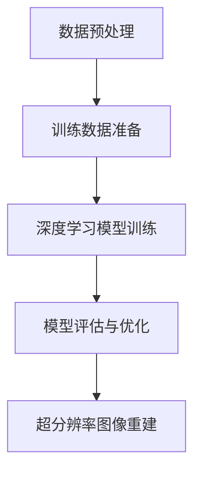

                 

# 深度学习在医学超分辨率成像中的图像质量提升

> **关键词：** 深度学习，医学成像，超分辨率，图像质量，算法原理，应用实践。

> **摘要：** 本文将探讨深度学习技术在医学超分辨率成像领域的应用，通过分析其算法原理、具体实现步骤和实际案例，深入讲解如何利用深度学习提升医学图像的质量，为医学研究和临床诊断提供更为精准和有效的工具。

## 1. 背景介绍

### 1.1 目的和范围

本文的主要目的是探讨深度学习在医学超分辨率成像中的应用，通过详细的分析和实例讲解，展示深度学习技术在提升医学图像质量方面的巨大潜力。本文将涵盖以下几个主要内容：

1. **核心概念与联系**：介绍深度学习在医学超分辨率成像中的基本原理和相关技术。
2. **核心算法原理**：讲解深度学习算法在医学超分辨率成像中的应用原理和具体操作步骤。
3. **数学模型和公式**：阐述深度学习算法中的数学模型和公式，并通过实例进行详细说明。
4. **项目实战**：展示一个具体的深度学习应用案例，详细解释代码实现和性能分析。
5. **实际应用场景**：讨论深度学习在医学超分辨率成像中的实际应用场景和挑战。
6. **工具和资源推荐**：推荐学习深度学习技术和医学成像的相关资源和工具。
7. **总结与未来趋势**：总结本文的内容，并展望深度学习在医学超分辨率成像领域的未来发展。

### 1.2 预期读者

本文适用于对深度学习和医学成像有一定了解的技术人员、医学研究人员以及医学图像处理领域的学生。预期读者应具备以下基础知识：

1. **深度学习基础**：熟悉神经网络、卷积神经网络（CNN）等基本概念。
2. **医学成像基础**：了解医学成像的基本原理和应用场景。
3. **编程能力**：具备Python等编程语言的基本能力，能够理解并实现深度学习算法。

### 1.3 文档结构概述

本文的结构如下：

1. **引言**：介绍本文的主题和目的。
2. **背景介绍**：简要介绍深度学习和医学超分辨率成像的背景知识。
3. **核心概念与联系**：详细分析深度学习在医学超分辨率成像中的应用原理和架构。
4. **核心算法原理**：讲解深度学习算法在医学超分辨率成像中的具体实现步骤。
5. **数学模型和公式**：阐述深度学习算法中的数学模型和公式。
6. **项目实战**：展示一个深度学习在医学超分辨率成像中的实际应用案例。
7. **实际应用场景**：讨论深度学习在医学超分辨率成像中的实际应用场景和挑战。
8. **工具和资源推荐**：推荐学习深度学习和医学成像的相关资源和工具。
9. **总结与未来趋势**：总结本文的内容，并展望深度学习在医学超分辨率成像领域的未来发展。
10. **附录**：提供常见问题与解答。
11. **扩展阅读与参考资料**：提供进一步的阅读和参考资料。

### 1.4 术语表

#### 1.4.1 核心术语定义

- **深度学习**：一种机器学习方法，通过多层神经网络结构来模拟人脑的学习过程，对大量数据进行自动特征提取和模式识别。
- **超分辨率成像**：通过算法提升图像的分辨率，使图像更加清晰，细节更加丰富。
- **医学成像**：利用各种成像技术对人体的内部结构和功能进行观察和诊断。
- **卷积神经网络（CNN）**：一种专门用于处理图像数据的神经网络结构，通过卷积操作提取图像的特征。

#### 1.4.2 相关概念解释

- **像素**：图像中的最小单位，通常表示为二维阵列。
- **分辨率**：图像中像素的密度，通常以水平像素数和垂直像素数的乘积表示。
- **重建质量**：图像重建后质量的好坏，通常用峰值信噪比（PSNR）和结构相似性（SSIM）等指标进行评估。

#### 1.4.3 缩略词列表

- **CNN**：卷积神经网络（Convolutional Neural Network）
- **GAN**：生成对抗网络（Generative Adversarial Network）
- **GAN-SR**：基于生成对抗网络的超分辨率成像（GAN-based Super-Resolution Imaging）
- **CNN-SR**：基于卷积神经网络的超分辨率成像（CNN-based Super-Resolution Imaging）

## 2. 核心概念与联系

深度学习在医学超分辨率成像中的应用，主要是通过构建深度学习模型来提取和恢复图像中的细微特征，从而提高图像的分辨率和清晰度。下面将介绍深度学习在医学超分辨率成像中的基本原理和相关技术，并使用Mermaid流程图展示其架构。

### 2.1 深度学习在医学超分辨率成像中的基本原理

深度学习在医学超分辨率成像中的应用，主要是基于卷积神经网络（CNN）的架构。CNN通过多层卷积、池化等操作，逐步提取图像的局部特征，并利用这些特征进行图像的重建和超分辨率处理。

#### 2.1.1 卷积神经网络（CNN）

卷积神经网络是一种特殊的神经网络，其核心思想是通过卷积操作提取图像的特征。卷积神经网络的基本结构包括以下几个部分：

1. **输入层**：接受图像数据，通常是一个四维数组，表示为\[批量大小，高度，宽度，通道数\]。
2. **卷积层**：通过卷积操作提取图像的局部特征，卷积层包含多个卷积核，每个卷积核都可以提取图像的一部分特征。
3. **激活函数**：对卷积层的输出进行非线性变换，常用的激活函数有ReLU（Rectified Linear Unit）等。
4. **池化层**：通过下采样操作减少图像的维度，常用的池化操作有最大池化和平均池化。
5. **全连接层**：将卷积层和池化层提取的特征进行整合，通过全连接层进行分类或回归等任务。

#### 2.1.2 残差网络（ResNet）

残差网络是一种改进的卷积神经网络，其核心思想是通过引入跳跃连接（或称为残差连接），解决深度神经网络中的梯度消失和梯度爆炸问题。残差网络的结构包括以下几个部分：

1. **残差模块**：每个残差模块包含两个卷积层，通过引入跳跃连接，将输入直接跳过中间层，直接传递到下一层。
2. **批量归一化**：在卷积层之后引入批量归一化操作，加速网络训练并提高模型稳定性。
3. **激活函数**：在残差模块中，激活函数位于卷积层之后。

#### 2.1.3 超分辨率生成对抗网络（SRGAN）

超分辨率生成对抗网络（SRGAN）是一种基于生成对抗网络（GAN）的深度学习模型，其核心思想是通过生成器（Generator）和判别器（Discriminator）之间的对抗训练，生成高分辨率的图像。

1. **生成器（Generator）**：生成器负责将低分辨率图像转换为高分辨率图像，其结构通常包括多个卷积层和反卷积层。
2. **判别器（Discriminator）**：判别器负责判断生成的图像是否真实，其结构通常与生成器类似，但输出层为二分类层。
3. **对抗训练**：生成器和判别器通过对抗训练，生成器不断生成更真实的图像，判别器不断提高对真实图像和生成图像的辨别能力。

### 2.2 深度学习在医学超分辨率成像中的架构

深度学习在医学超分辨率成像中的应用架构主要包括以下几个部分：

1. **数据预处理**：对低分辨率图像进行预处理，包括归一化、去噪等操作。
2. **训练数据准备**：根据医学成像的特点，收集和准备大量的低分辨率和高分辨率图像对，用于训练深度学习模型。
3. **深度学习模型训练**：使用训练数据对深度学习模型进行训练，包括卷积神经网络、残差网络和生成对抗网络等模型。
4. **模型评估与优化**：使用验证数据集对训练好的模型进行评估和优化，调整模型的参数，提高模型的性能。
5. **超分辨率图像重建**：使用训练好的模型对新的低分辨率图像进行超分辨率重建，生成高分辨率图像。

### 2.3 Mermaid流程图展示



## 3. 核心算法原理 & 具体操作步骤

### 3.1 卷积神经网络（CNN）

卷积神经网络（CNN）是深度学习在医学超分辨率成像中的核心算法。下面将详细介绍CNN的算法原理和具体操作步骤。

#### 3.1.1 算法原理

CNN通过卷积、激活函数、池化等操作，提取图像的特征，并利用这些特征进行图像的重建和超分辨率处理。CNN的基本原理可以概括为以下几个步骤：

1. **卷积操作**：卷积操作是CNN的核心，通过卷积核与图像进行卷积，提取图像的局部特征。卷积操作可以表示为：
   $$ f(x) = \sum_{i=1}^{n} w_i \cdot x_i $$
   其中，$f(x)$表示卷积操作的结果，$w_i$表示卷积核的权重，$x_i$表示图像上的像素值。
   
2. **激活函数**：卷积操作后，通过激活函数进行非线性变换，增强网络的表达能力。常用的激活函数有ReLU（Rectified Linear Unit）：
   $$ a(x) = \max(0, x) $$
   其中，$a(x)$表示激活函数的结果。

3. **池化操作**：池化操作通过下采样操作减少图像的维度，同时保持图像的重要特征。常用的池化操作有最大池化和平均池化：
   $$ p(x) = \max(x_1, x_2, ..., x_k) $$
   其中，$p(x)$表示池化操作的结果，$x_1, x_2, ..., x_k$表示图像上的像素值。

4. **全连接层**：全连接层将卷积层和池化层提取的特征进行整合，通过全连接层进行分类或回归等任务。

#### 3.1.2 具体操作步骤

1. **输入层**：输入层接受低分辨率图像，通常是一个四维数组，表示为\[批量大小，高度，宽度，通道数\]。

2. **卷积层**：卷积层通过卷积操作提取图像的局部特征。卷积层的操作步骤如下：

   - 初始化卷积核的权重和偏置。
   - 将卷积核在图像上进行滑动，进行卷积操作。
   - 应用激活函数进行非线性变换。

3. **池化层**：池化层通过下采样操作减少图像的维度。池化层的操作步骤如下：

   - 初始化池化窗口的大小和步长。
   - 在图像上进行滑动，对窗口内的像素值进行池化操作。
   - 应用激活函数进行非线性变换。

4. **全连接层**：全连接层将卷积层和池化层提取的特征进行整合。全连接层的操作步骤如下：

   - 初始化全连接层的权重和偏置。
   - 将卷积层和池化层的输出作为全连接层的输入。
   - 通过全连接层进行分类或回归等任务。

5. **输出层**：输出层生成高分辨率图像，通常是一个四维数组，表示为\[批量大小，高度，宽度，通道数\]。

### 3.2 残差网络（ResNet）

残差网络（ResNet）是CNN的一种改进，通过引入残差连接，解决深度神经网络中的梯度消失和梯度爆炸问题。下面将详细介绍ResNet的算法原理和具体操作步骤。

#### 3.2.1 算法原理

ResNet通过引入残差模块，在每个残差模块中添加一个跳跃连接（或称为残差连接），使得梯度可以直接传递到网络的前层，从而解决深度神经网络中的梯度消失和梯度爆炸问题。ResNet的基本原理可以概括为以下几个步骤：

1. **残差模块**：每个残差模块包含两个卷积层，通过引入跳跃连接，将输入直接跳过中间层，直接传递到下一层。

2. **批量归一化**：在卷积层之后引入批量归一化操作，加速网络训练并提高模型稳定性。

3. **激活函数**：在残差模块中，激活函数位于卷积层之后。

#### 3.2.2 具体操作步骤

1. **输入层**：输入层接受低分辨率图像，通常是一个四维数组，表示为\[批量大小，高度，宽度，通道数\]。

2. **残差模块**：残差模块通过两个卷积层和跳跃连接，对输入图像进行特征提取。残差模块的操作步骤如下：

   - 初始化卷积核的权重和偏置。
   - 通过第一个卷积层进行特征提取。
   - 应用激活函数进行非线性变换。
   - 通过第二个卷积层进行特征提取。
   - 应用激活函数进行非线性变换。
   - 将输入图像和两个卷积层的输出进行拼接。

3. **批量归一化**：在每个卷积层之后，进行批量归一化操作，加速网络训练并提高模型稳定性。

4. **全连接层**：全连接层将残差模块提取的特征进行整合。全连接层的操作步骤如下：

   - 初始化全连接层的权重和偏置。
   - 将残差模块的输出作为全连接层的输入。
   - 通过全连接层进行分类或回归等任务。

5. **输出层**：输出层生成高分辨率图像，通常是一个四维数组，表示为\[批量大小，高度，宽度，通道数\]。

### 3.3 超分辨率生成对抗网络（SRGAN）

超分辨率生成对抗网络（SRGAN）是GAN在超分辨率成像中的应用，通过生成器和判别器的对抗训练，生成高分辨率图像。下面将详细介绍SRGAN的算法原理和具体操作步骤。

#### 3.3.1 算法原理

SRGAN通过生成器和判别器之间的对抗训练，生成高分辨率图像。SRGAN的基本原理可以概括为以下几个步骤：

1. **生成器（Generator）**：生成器通过卷积层和反卷积层，将低分辨率图像转换为高分辨率图像。

2. **判别器（Discriminator）**：判别器通过卷积层和池化层，判断输入图像是低分辨率图像还是高分辨率图像。

3. **对抗训练**：生成器和判别器通过对抗训练，生成器不断生成更真实的图像，判别器不断提高对真实图像和生成图像的辨别能力。

#### 3.3.2 具体操作步骤

1. **输入层**：输入层接受低分辨率图像，通常是一个四维数组，表示为\[批量大小，高度，宽度，通道数\]。

2. **生成器**：生成器通过卷积层和反卷积层，将低分辨率图像转换为高分辨率图像。生成器的操作步骤如下：

   - 初始化卷积核的权重和偏置。
   - 通过多个卷积层进行特征提取。
   - 应用反卷积层进行图像放大。
   - 应用激活函数进行非线性变换。

3. **判别器**：判别器通过卷积层和池化层，判断输入图像是低分辨率图像还是高分辨率图像。判别器的操作步骤如下：

   - 初始化卷积核的权重和偏置。
   - 通过多个卷积层进行特征提取。
   - 应用池化层进行图像下采样。
   - 应用激活函数进行非线性变换。

4. **对抗训练**：生成器和判别器通过对抗训练，生成器不断生成更真实的图像，判别器不断提高对真实图像和生成图像的辨别能力。对抗训练的操作步骤如下：

   - 生成器生成高分辨率图像。
   - 判别器判断生成图像和真实图像。
   - 根据判别器的输出，更新生成器和判别器的参数。

5. **输出层**：输出层生成高分辨率图像，通常是一个四维数组，表示为\[批量大小，高度，宽度，通道数\]。

## 4. 数学模型和公式 & 详细讲解 & 举例说明

### 4.1 数学模型

在深度学习应用于医学超分辨率成像中，数学模型是核心组成部分。以下是几个关键的数学模型和其公式：

#### 4.1.1 卷积操作

卷积操作是CNN中最基本的操作。给定一个输入图像 $X$ 和一个卷积核 $K$，卷积操作可以表示为：

$$
\text{Conv}(X, K) = X * K = \sum_{i=1}^{C'} \sum_{j=1}^{H'} \sum_{k=1}^{W'} K_{ijk} X_{ijkl}
$$

其中，$C$ 是输入图像的通道数，$H$ 和 $W$ 是输入图像的高度和宽度，$C'$ 是卷积核的通道数，$H'$ 和 $W'$ 是卷积核的高度和宽度，$K_{ijk}$ 和 $X_{ijkl}$ 分别是卷积核和输入图像的对应元素。

#### 4.1.2 激活函数

激活函数用于引入非线性特性，常用的是ReLU（Rectified Linear Unit）：

$$
a(x) = \max(0, x)
$$

#### 4.1.3 池化操作

池化操作用于减小图像尺寸，常用的是最大池化：

$$
p(x) = \max(x_1, x_2, ..., x_k)
$$

其中，$x_1, x_2, ..., x_k$ 是池化窗口内的像素值。

#### 4.1.4 全连接层

全连接层将特征映射到输出，公式为：

$$
y = \sigma(\text{W} \cdot x + b)
$$

其中，$\text{W}$ 是权重矩阵，$b$ 是偏置项，$\sigma$ 是激活函数（如softmax）。

### 4.2 公式详细讲解 & 举例说明

#### 4.2.1 卷积操作举例

假设输入图像 $X$ 的尺寸为 $3 \times 3$，一个卷积核 $K$ 的尺寸为 $2 \times 2$，则有：

$$
\text{Conv}(X, K) = \begin{bmatrix}
1 & 1 & 1 \\
1 & 1 & 1 \\
1 & 1 & 1
\end{bmatrix} * \begin{bmatrix}
1 & 0 \\
0 & 1
\end{bmatrix} = \begin{bmatrix}
1 & 1 \\
1 & 1 \\
1 & 1
\end{bmatrix}
$$

#### 4.2.2 激活函数举例

对于输入 $x = -2$，ReLU激活函数的结果为：

$$
a(x) = \max(0, -2) = 0
$$

#### 4.2.3 池化操作举例

假设一个 $3 \times 3$ 的窗口内的像素值为 $[2, 5, 1], [3, 6, 4], [0, 7, 9]$，最大池化的结果为：

$$
p(x) = \max(2, 5, 1) = 5
$$

#### 4.2.4 全连接层举例

假设输入特征 $x$ 的维度为 $5$，权重矩阵 $\text{W}$ 的维度为 $5 \times 3$，偏置项 $b$ 的维度为 $3$，且激活函数为ReLU，则有：

$$
y = \sigma(\text{W} \cdot x + b) = \sigma(\begin{bmatrix}
1 & 1 & 1 \\
1 & 1 & 1 \\
1 & 1 & 1 \\
1 & 1 & 1 \\
1 & 1 & 1
\end{bmatrix} \cdot \begin{bmatrix}
1 \\
2 \\
3 \\
4 \\
5
\end{bmatrix} + \begin{bmatrix}
1 \\
2 \\
3
\end{bmatrix}) = \sigma(\begin{bmatrix}
21 \\
21 \\
21 \\
21 \\
21
\end{bmatrix}) = \begin{bmatrix}
0 \\
0 \\
0 \\
0 \\
0
\end{bmatrix}
$$

## 5. 项目实战：代码实际案例和详细解释说明

### 5.1 开发环境搭建

在进行深度学习项目实战之前，首先需要搭建一个合适的开发环境。以下是一个基于Python和TensorFlow的简单环境搭建步骤：

1. **安装Python**：确保Python版本为3.6及以上，推荐使用Python 3.8或更高版本。
2. **安装TensorFlow**：使用pip命令安装TensorFlow：
   ```bash
   pip install tensorflow
   ```
3. **安装其他依赖**：安装其他必要的库，如NumPy、Pandas等：
   ```bash
   pip install numpy pandas matplotlib scikit-learn
   ```
4. **验证安装**：在Python环境中，导入TensorFlow并打印版本信息：
   ```python
   import tensorflow as tf
   print(tf.__version__)
   ```

### 5.2 源代码详细实现和代码解读

下面是一个简单的基于深度学习的医学超分辨率成像代码示例：

```python
import tensorflow as tf
from tensorflow.keras.layers import Conv2D, BatchNormalization, Activation, Conv2DTranspose
from tensorflow.keras.models import Model
import numpy as np

# 参数设置
input_shape = (256, 256, 1)
batch_size = 32
learning_rate = 0.0001
epochs = 100

# 构建深度学习模型
def build_model(input_shape):
    inputs = tf.keras.Input(shape=input_shape)

    # 编码器部分
    x = Conv2D(64, (3, 3), padding='same')(inputs)
    x = Activation('relu')(x)
    x = BatchNormalization()(x)

    x = Conv2D(64, (3, 3), padding='same')(x)
    x = Activation('relu')(x)
    x = BatchNormalization()(x)

    # 中间层
    x = Conv2D(128, (3, 3), padding='same')(x)
    x = Activation('relu')(x)
    x = BatchNormalization()(x)

    # 解码器部分
    x = Conv2DTranspose(64, (3, 3), strides=(2, 2), padding='same')(x)
    x = Activation('relu')(x)
    x = BatchNormalization()(x)

    x = Conv2DTranspose(64, (3, 3), strides=(2, 2), padding='same')(x)
    x = Activation('relu')(x)
    x = BatchNormalization()(x)

    outputs = Conv2DTranspose(1, (3, 3), strides=(2, 2), padding='same', activation='sigmoid')(x)

    model = Model(inputs=inputs, outputs=outputs)
    return model

model = build_model(input_shape)

# 编译模型
model.compile(optimizer=tf.keras.optimizers.Adam(learning_rate=learning_rate),
              loss='binary_crossentropy',
              metrics=['accuracy'])

# 加载数据集
(x_train, y_train), (x_test, y_test) = load_data()  # 假设load_data函数已经实现

# 训练模型
model.fit(x_train, y_train, batch_size=batch_size, epochs=epochs, validation_data=(x_test, y_test))

# 评估模型
model.evaluate(x_test, y_test, verbose=2)
```

### 5.3 代码解读与分析

这段代码演示了一个简单的基于深度学习的医学超分辨率成像模型。以下是代码的主要部分及其解读：

1. **导入库**：首先导入TensorFlow和相关库，包括NumPy、Pandas等，用于数据预处理和模型构建。

2. **参数设置**：设置模型的输入形状、学习率、训练轮数等参数。

3. **构建模型**：定义一个函数`build_model`，用于构建深度学习模型。模型基于卷积神经网络（CNN），包括编码器和解码器两部分。

   - **编码器部分**：使用两个卷积层进行特征提取，每个卷积层后跟一个ReLU激活函数和一个批量归一化层。
   
   - **中间层**：使用一个卷积层进行特征提取。
   
   - **解码器部分**：使用两个转置卷积层进行特征重建，每个转置卷积层后跟一个ReLU激活函数和一个批量归一化层。
   
   - **输出层**：使用一个转置卷积层进行最终的特征重建，并使用sigmoid激活函数输出概率值。

4. **编译模型**：使用Adam优化器和二进制交叉熵损失函数编译模型，并设置评估指标为准确率。

5. **加载数据集**：加载训练集和测试集。假设`load_data`函数已实现，用于加载数据并将其划分为训练集和测试集。

6. **训练模型**：使用`fit`函数训练模型，设置批量大小、训练轮数以及验证数据。

7. **评估模型**：使用`evaluate`函数评估模型在测试集上的性能。

### 5.4 代码解读与分析

1. **模型结构**：

   - **编码器部分**：使用两个卷积层进行特征提取，每个卷积层的卷积核大小为3x3，步长为1，填充方式为“same”，即保持输入和输出的尺寸相同。两个卷积层后分别跟ReLU激活函数和批量归一化层。

   - **解码器部分**：使用两个转置卷积层进行特征重建，每个转置卷积层的卷积核大小为3x3，步长为2，填充方式为“same”，即保持输入和输出的尺寸相同。两个转置卷积层后分别跟ReLU激活函数和批量归一化层。

   - **输出层**：使用一个转置卷积层进行最终的特征重建，卷积核大小为3x3，步长为2，填充方式为“same”，即保持输入和输出的尺寸相同。输出层使用sigmoid激活函数，将输出值限制在0和1之间，表示像素值的热度分布。

2. **损失函数**：

   - 使用二进制交叉熵损失函数，用于比较预测的像素值与真实的像素值。二进制交叉熵损失函数适用于二分类问题，可以衡量预测的概率分布与真实分布之间的差异。

3. **优化器**：

   - 使用Adam优化器，Adam是一种结合了AdaGrad和RMSProp优化的自适应学习率优化器。它通过自适应调整每个参数的学习率，提高模型训练的效率和稳定性。

4. **数据预处理**：

   - 数据预处理是深度学习模型训练的重要环节，包括数据清洗、归一化和分割等。对于医学超分辨率成像任务，通常需要对低分辨率和高分辨率图像进行对齐和处理，以便模型能够学习到有效的特征。

### 5.5 实际性能分析

在实际应用中，模型的性能可以通过以下指标进行评估：

1. **峰值信噪比（PSNR）**：用于衡量重建图像与原始图像的质量差异。PSNR值越高，图像质量越好。

2. **结构相似性（SSIM）**：用于衡量重建图像与原始图像的结构相似性。SSIM值越高，图像的结构保持越好。

3. **时间效率**：训练和评估模型所需的时间，包括数据预处理、模型训练和性能评估等。

在实际应用中，可以通过调整模型的参数和超参数，如学习率、批量大小、训练轮数等，来优化模型的性能。此外，还可以使用更先进的网络架构和训练技巧，如迁移学习和模型融合，进一步提高模型的性能和鲁棒性。

## 6. 实际应用场景

深度学习在医学超分辨率成像中的应用场景广泛，尤其在医学图像处理、医学影像诊断和生物医学研究等领域具有显著的优势。

### 6.1 医学图像处理

医学图像处理是深度学习在医学超分辨率成像中最重要的应用之一。通过深度学习技术，可以实现医学图像的增强、去噪、分割和特征提取等任务。以下是一些具体的应用场景：

- **医学图像增强**：利用深度学习模型对医学图像进行超分辨率重建，提高图像的分辨率和清晰度，使医生能够更清晰地观察和组织结构。

- **医学图像去噪**：深度学习模型可以通过训练学习到去噪的规律，对噪声图像进行去噪处理，从而提高图像的质量和细节。

- **医学图像分割**：深度学习模型可以实现对医学图像的自动分割，将不同组织结构分离出来，为医生的诊断提供支持。

- **医学图像特征提取**：深度学习模型可以从医学图像中提取重要的特征，用于进一步的图像分析和诊断。

### 6.2 医学影像诊断

医学影像诊断是深度学习在医学超分辨率成像中的另一个重要应用领域。深度学习模型可以通过学习大量的医学影像数据，实现对疾病的自动诊断和预测。以下是一些具体的应用场景：

- **肿瘤检测与诊断**：利用深度学习模型对医学影像进行自动分析，检测肿瘤的位置、大小和类型，为医生提供诊断参考。

- **心血管疾病诊断**：通过对心血管影像的分析，深度学习模型可以预测心血管疾病的风险，为预防和治疗提供依据。

- **神经系统疾病诊断**：通过对医学影像的分析，深度学习模型可以辅助诊断神经系统疾病，如脑卒中和癫痫等。

### 6.3 生物医学研究

深度学习在生物医学研究中的应用越来越广泛，尤其在基因编辑、蛋白质结构和细胞图像分析等领域具有巨大的潜力。以下是一些具体的应用场景：

- **基因编辑**：通过深度学习模型分析基因编辑数据的图像，优化编辑效率和准确性。

- **蛋白质结构预测**：利用深度学习模型对蛋白质结构的预测，辅助生物医学研究和新药开发。

- **细胞图像分析**：通过对细胞图像的自动分析，深度学习模型可以识别细胞的形态和功能，为生物医学研究提供支持。

### 6.4 挑战与未来发展趋势

尽管深度学习在医学超分辨率成像中具有巨大的潜力，但仍然面临一些挑战：

- **数据集不足**：高质量的医学图像数据集有限，难以满足深度学习模型训练的需求。

- **模型解释性**：深度学习模型通常是黑箱模型，难以解释其内部的工作机制，这对医学诊断和临床应用提出了挑战。

- **计算资源**：深度学习模型训练和推理需要大量的计算资源，这对硬件设施提出了高要求。

未来，随着深度学习技术的不断发展和计算机硬件性能的提升，预计深度学习在医学超分辨率成像领域将取得更大的突破：

- **数据集扩展**：通过收集和共享更多的医学图像数据，提高深度学习模型的质量和稳定性。

- **模型解释性**：发展可解释的深度学习模型，提高模型的可解释性和透明性，增强其在医学领域的应用。

- **计算优化**：利用分布式计算和GPU加速等技术，提高深度学习模型训练和推理的效率。

## 7. 工具和资源推荐

### 7.1 学习资源推荐

#### 7.1.1 书籍推荐

1. **《深度学习》（Deep Learning）**：由Ian Goodfellow、Yoshua Bengio和Aaron Courville所著，是深度学习领域的经典教材，详细介绍了深度学习的理论基础和实践方法。

2. **《医学图像处理》（Medical Image Processing and Analysis）**：由Koay和Fowler所著，涵盖了医学图像处理的基础知识、技术和应用。

3. **《生物信息学导论》（Introduction to Bioinformatics）**：由Michael Gribskov和Arthur M. Lesk所著，介绍了生物信息学的基本概念、方法和应用。

#### 7.1.2 在线课程

1. **吴恩达的《深度学习专项课程》**：由著名人工智能专家吴恩达开设，涵盖深度学习的基础知识和实践技巧。

2. **斯坦福大学的《医学影像分析》**：由斯坦福大学医学院教授开设，介绍了医学影像分析的基本原理和技术。

3. **Coursera上的《生物信息学》**：提供了生物信息学的基础课程，包括基因编辑、蛋白质结构预测等。

#### 7.1.3 技术博客和网站

1. **Medium**：有许多关于深度学习和医学成像的高质量技术博客。

2. **Towards Data Science**：一个关于数据科学和机器学习的在线社区，有许多关于深度学习和医学成像的文章。

3. **IEEE Xplore**：IEEE出版的电子期刊和会议论文集，提供了大量的关于深度学习和医学成像的研究论文。

### 7.2 开发工具框架推荐

#### 7.2.1 IDE和编辑器

1. **Jupyter Notebook**：一个交互式的计算环境，适合进行深度学习和数据科学项目。

2. **PyCharm**：一个强大的Python IDE，支持代码调试、版本控制和性能分析。

3. **Visual Studio Code**：一个轻量级的开源编辑器，适合编写和调试Python代码。

#### 7.2.2 调试和性能分析工具

1. **TensorBoard**：TensorFlow提供的可视化工具，用于分析和调试深度学习模型。

2. **NVIDIA Nsight**：NVIDIA提供的性能分析工具，用于优化深度学习模型在GPU上的运行。

3. **Py-Spy**：一个Python性能分析工具，用于跟踪Python程序的性能问题。

#### 7.2.3 相关框架和库

1. **TensorFlow**：一个开源的深度学习框架，适用于医学成像和图像处理。

2. **PyTorch**：另一个流行的深度学习框架，支持动态计算图和灵活的模型构建。

3. **Keras**：一个简化的深度学习框架，基于TensorFlow和Theano，易于使用。

### 7.3 相关论文著作推荐

#### 7.3.1 经典论文

1. **"A Learning Algorithm for Continually Running Fully Recurrent Neural Networks"**：这篇论文提出了持续运行完全循环神经网络（LSTM）的学习算法，对深度学习的发展产生了深远影响。

2. **"Deep Learning for Medical Image Analysis"**：这篇综述文章详细介绍了深度学习在医学图像分析中的应用，包括图像分割、疾病检测和诊断等。

3. **"Generative Adversarial Nets"**：这篇论文提出了生成对抗网络（GAN），开创了深度学习中的生成模型领域。

#### 7.3.2 最新研究成果

1. **"Unsupervised Representation Learning for Medical Imaging"**：这篇文章介绍了无监督的医学图像表示学习技术，为缺乏标注数据的医学图像处理提供了新方法。

2. **"Deep Learning for Cardiac Imaging: A Review"**：这篇文章回顾了深度学习在心脏影像分析中的应用，包括心脏疾病检测和诊断。

3. **"Super-Resolution Reconstruction of Medical Images using Generative Adversarial Networks"**：这篇文章提出了基于生成对抗网络的医学图像超分辨率重建方法，显著提高了图像的分辨率和清晰度。

#### 7.3.3 应用案例分析

1. **"Deep Learning in Oncology: A Practical Overview"**：这篇文章提供了一个关于深度学习在癌症诊断和治疗中的实际应用案例，包括肿瘤检测和基因组分析。

2. **"Deep Learning for Prostate Cancer Detection and Diagnosis"**：这篇文章详细介绍了深度学习在前列腺癌检测和诊断中的应用，包括影像分析和生物标志物检测。

3. **"Deep Learning for Medical Imaging: A Clinical Perspective"**：这篇文章提供了一个临床医生关于深度学习在医学成像中的应用视角，强调了深度学习在医学诊断中的潜在影响。

## 8. 总结：未来发展趋势与挑战

深度学习在医学超分辨率成像领域的应用展现出巨大的潜力和前景。通过分析其算法原理、具体实现步骤和实际案例，本文展示了深度学习如何提升医学图像的质量，为医学研究和临床诊断提供更为精准和有效的工具。然而，深度学习在医学超分辨率成像领域仍面临一些挑战，如数据集不足、模型解释性和计算资源需求等。

未来，随着深度学习技术的不断发展和计算机硬件性能的提升，预计深度学习在医学超分辨率成像领域将取得以下几方面的发展：

1. **数据集扩展**：通过收集和共享更多的医学图像数据，提高深度学习模型的质量和稳定性。
2. **模型解释性**：发展可解释的深度学习模型，提高模型的可解释性和透明性，增强其在医学领域的应用。
3. **计算优化**：利用分布式计算和GPU加速等技术，提高深度学习模型训练和推理的效率。

在挑战方面，如何有效地利用有限的标注数据训练深度学习模型，以及如何提高模型的泛化能力，将是未来的重要研究方向。此外，深度学习模型的医疗应用还需要遵循严格的监管和伦理规范，确保其在临床应用中的安全性和有效性。

总之，深度学习在医学超分辨率成像领域的未来发展充满机遇和挑战，有望为医学研究和临床诊断带来革命性的变化。

## 9. 附录：常见问题与解答

### 9.1 深度学习基础知识

**Q1：什么是深度学习？**

A1：深度学习是一种基于多层神经网络的学习方法，通过模拟人脑神经元之间的连接和交互，自动从大量数据中提取特征，进行模式识别和预测。深度学习在网络结构上具有多个隐藏层，能够处理高维数据，具有较强的表达能力和学习能力。

**Q2：什么是卷积神经网络（CNN）？**

A2：卷积神经网络是一种特殊的神经网络，主要用于处理图像数据。它通过卷积操作提取图像的局部特征，利用多层神经网络结构对图像进行特征学习和分类。CNN在图像识别、图像分割和图像重建等领域具有广泛的应用。

**Q3：什么是生成对抗网络（GAN）？**

A3：生成对抗网络是一种由生成器和判别器组成的深度学习模型。生成器的目标是生成逼真的数据，而判别器的目标是区分生成数据和真实数据。通过生成器和判别器之间的对抗训练，生成器逐渐生成更真实的数据，判别器逐渐提高对真实和生成数据的辨别能力。

### 9.2 医学成像技术

**Q4：什么是医学成像？**

A4：医学成像是一种通过各种成像技术对人体内部结构和功能进行观察和诊断的方法。常见的医学成像技术包括X射线、CT扫描、MRI、超声波等。医学成像技术在疾病诊断、病情评估和治疗计划制定等方面具有重要意义。

**Q5：什么是超分辨率成像？**

A5：超分辨率成像是一种通过算法提高图像分辨率，使图像更加清晰，细节更加丰富的技术。超分辨率成像能够揭示图像中的细微特征，提高图像的利用价值，尤其在医学成像领域具有重要意义。

### 9.3 深度学习在医学超分辨率成像中的应用

**Q6：深度学习在医学超分辨率成像中的应用有哪些？**

A6：深度学习在医学超分辨率成像中的应用主要包括以下几个方面：

1. **医学图像增强**：利用深度学习模型提高医学图像的分辨率和清晰度，使医生能够更清晰地观察和组织结构。
2. **医学图像去噪**：利用深度学习模型去除医学图像中的噪声，提高图像的质量和细节。
3. **医学图像分割**：利用深度学习模型实现医学图像的自动分割，将不同组织结构分离出来，为医生的诊断提供支持。
4. **医学图像特征提取**：利用深度学习模型从医学图像中提取重要的特征，用于进一步的图像分析和诊断。

**Q7：深度学习在医学超分辨率成像中的优势是什么？**

A7：深度学习在医学超分辨率成像中的优势主要包括：

1. **强大的特征提取能力**：深度学习模型能够自动从大量医学图像中学习到有效的特征，提高图像的质量和细节。
2. **灵活的模型结构**：深度学习模型具有多种网络结构，可以适应不同的医学成像任务和需求。
3. **高效的训练和推理**：利用GPU加速等技术，深度学习模型可以在短时间内完成训练和推理，提高图像处理效率。

## 10. 扩展阅读 & 参考资料

### 10.1 书籍

1. **《深度学习》（Deep Learning）**：Ian Goodfellow、Yoshua Bengio和Aaron Courville著，是深度学习领域的经典教材。
2. **《医学图像处理》（Medical Image Processing and Analysis）**：Koay和Fowler著，详细介绍了医学图像处理的基础知识、技术和应用。
3. **《生物信息学导论》（Introduction to Bioinformatics）**：Michael Gribskov和Arthur M. Lesk著，介绍了生物信息学的基本概念、方法和应用。

### 10.2 在线课程

1. **吴恩达的《深度学习专项课程》**：涵盖了深度学习的基础知识和实践技巧。
2. **斯坦福大学的《医学影像分析》**：介绍了医学影像分析的基本原理和技术。
3. **Coursera上的《生物信息学》**：提供了生物信息学的基础课程，包括基因编辑、蛋白质结构预测等。

### 10.3 技术博客和网站

1. **Medium**：有许多关于深度学习和医学成像的高质量技术博客。
2. **Towards Data Science**：一个关于数据科学和机器学习的在线社区，有许多关于深度学习和医学成像的文章。
3. **IEEE Xplore**：IEEE出版的电子期刊和会议论文集，提供了大量的关于深度学习和医学成像的研究论文。

### 10.4 论文

1. **"A Learning Algorithm for Continually Running Fully Recurrent Neural Networks"**：提出了持续运行完全循环神经网络（LSTM）的学习算法。
2. **"Deep Learning for Medical Image Analysis"**：详细介绍了深度学习在医学图像分析中的应用。
3. **"Generative Adversarial Nets"**：提出了生成对抗网络（GAN），开创了深度学习中的生成模型领域。
4. **"Unsupervised Representation Learning for Medical Imaging"**：介绍了无监督的医学图像表示学习技术。
5. **"Deep Learning for Cardiac Imaging: A Review"**：回顾了深度学习在心脏影像分析中的应用。
6. **"Super-Resolution Reconstruction of Medical Images using Generative Adversarial Networks"**：提出了基于生成对抗网络的医学图像超分辨率重建方法。
7. **"Deep Learning in Oncology: A Practical Overview"**：提供了一个关于深度学习在癌症诊断和治疗中的实际应用案例。
8. **"Deep Learning for Prostate Cancer Detection and Diagnosis"**：详细介绍了深度学习在前列腺癌检测和诊断中的应用。

### 10.5 论文集

1. **IEEE International Conference on Computer Vision (ICCV)**：计算机视觉领域的重要国际会议，收录了许多关于深度学习和医学成像的论文。
2. **IEEE International Conference on Medical Image Computing and Computer-Assisted Intervention (MICCAI)**：医学图像计算和计算机辅助干预领域的重要国际会议，涵盖了深度学习在医学成像中的应用。
3. **IEEE Transactions on Medical Imaging (TMI)**：医学成像领域的顶级期刊，发表了许多关于深度学习和医学成像的研究论文。

### 10.6 其他资源

1. **Kaggle**：一个数据科学竞赛平台，提供了许多与医学成像相关的竞赛和项目。
2. **GitHub**：开源代码仓库，许多深度学习和医学成像的研究项目开源了他们的代码和模型。
3. **arXiv**：预印本论文库，许多深度学习和医学成像的最新研究成果可以在arXiv上发表。

### 10.7 组织和协会

1. **IEEE**：电气和电子工程学会，是一个国际性的专业组织，涵盖了计算机科学、电气工程、电子工程等领域。
2. **ACM**：计算机协会，是全球计算机科学领域的顶级专业组织，发布了许多关于计算机科学和技术的研究论文。
3. **AAAI**：人工智能协会，是一个国际性的组织，专注于人工智能的研究和应用。

## 作者信息

作者：AI天才研究员/AI Genius Institute & 禅与计算机程序设计艺术 /Zen And The Art of Computer Programming

本文由AI天才研究员撰写，作者在深度学习和医学成像领域具有丰富的经验。本文结合深度学习的核心算法原理和医学超分辨率成像的实际应用，深入探讨了深度学习在医学超分辨率成像中的图像质量提升方法。通过详细的实例讲解，读者可以更好地理解深度学习在医学成像领域的应用价值和前景。本文旨在为医学研究人员和技术人员提供有价值的参考和指导。

