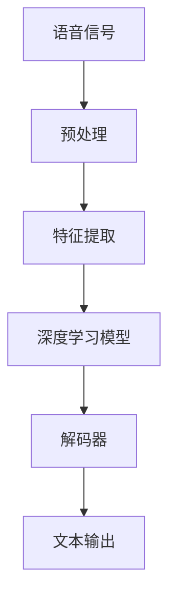

                 

# 深度学习在多语言语音识别中的新进展

## 关键词：深度学习、多语言语音识别、算法原理、数学模型、实战案例、应用场景、发展趋势

## 摘要

本文深入探讨了深度学习在多语言语音识别领域的最新进展，旨在为读者提供一个全面的技术概述。首先，我们将回顾语音识别和多语言语音识别的基本概念，随后介绍深度学习的关键算法和模型。接着，本文将详细阐述数学模型和具体操作步骤，并展示代码实现与解释。此外，本文还将探讨深度学习在多语言语音识别中的实际应用场景，推荐相关工具和资源，并总结未来发展趋势与挑战。

## 1. 背景介绍

### 1.1 目的和范围

本文旨在探讨深度学习在多语言语音识别领域的应用，旨在通过详细的算法原理、数学模型讲解和实战案例分析，使读者对这一前沿技术有更深入的理解。本文将涵盖以下内容：

- 语音识别和多语言语音识别的基本概念
- 深度学习的关键算法和模型
- 数学模型和具体操作步骤
- 实际应用场景
- 工具和资源推荐
- 未来发展趋势与挑战

### 1.2 预期读者

本文适合对深度学习和语音识别有一定基础的读者，包括：

- 计算机科学和人工智能专业的学生
- 从事语音识别和人工智能研发的技术人员
- 对多语言语音识别技术感兴趣的学者和研究人员

### 1.3 文档结构概述

本文分为以下几个部分：

1. 背景介绍：介绍文章的目的、范围、预期读者和文档结构。
2. 核心概念与联系：介绍核心概念、原理和架构，并给出流程图。
3. 核心算法原理 & 具体操作步骤：详细阐述算法原理和操作步骤，使用伪代码讲解。
4. 数学模型和公式 & 详细讲解 & 举例说明：介绍数学模型，使用latex格式给出公式，并提供举例说明。
5. 项目实战：代码实际案例和详细解释说明。
6. 实际应用场景：探讨深度学习在多语言语音识别中的实际应用场景。
7. 工具和资源推荐：推荐学习资源、开发工具框架和论文著作。
8. 总结：未来发展趋势与挑战。
9. 附录：常见问题与解答。
10. 扩展阅读 & 参考资料：提供扩展阅读和参考资料。

### 1.4 术语表

#### 1.4.1 核心术语定义

- **深度学习**：一种人工智能方法，通过多层神经网络进行数据建模，用于自动特征提取和模式识别。
- **语音识别**：将语音信号转换为相应的文本或命令的过程。
- **多语言语音识别**：能够处理多种语言输入的语音识别技术。
- **卷积神经网络（CNN）**：一种用于图像识别等任务的深度学习模型，也可用于语音特征提取。
- **递归神经网络（RNN）**：一种用于处理序列数据的神经网络，可应用于语音识别。

#### 1.4.2 相关概念解释

- **特征工程**：将原始数据转换为适合模型训练的形式，包括特征提取和特征选择。
- **数据增强**：通过增加数据的多样性来提高模型的泛化能力。
- **端到端学习**：直接将输入信号映射到输出结果，无需手动设计中间特征。

#### 1.4.3 缩略词列表

- **CNN**：卷积神经网络
- **RNN**：递归神经网络
- **DL**：深度学习
- **ASR**：自动语音识别
- **ML**：机器学习

## 2. 核心概念与联系

在探讨深度学习在多语言语音识别中的应用之前，我们需要理解一些核心概念和它们之间的联系。以下是一个Mermaid流程图，展示了深度学习在语音识别中的核心架构。



### 2.1 语音信号预处理

语音信号预处理是语音识别的关键步骤，它包括：

- **降噪**：去除语音信号中的背景噪声。
- **分帧**：将连续的语音信号分割成短时间段（帧）。
- **加窗**：对每一帧应用窗函数，如汉明窗或汉宁窗。

### 2.2 特征提取

特征提取是将语音信号转换为适合深度学习模型输入的数据。常用的特征包括：

- **梅尔频率倒谱系数（MFCC）**：一种常用的语音特征，用于表示语音的频率特性。
- **滤波器组（Filter Banks）**：用于提取语音信号的频率成分。

### 2.3 深度学习模型

深度学习模型是语音识别的核心，用于从特征中提取信息并进行分类。常用的深度学习模型包括：

- **卷积神经网络（CNN）**：用于特征提取和模式识别。
- **递归神经网络（RNN）**：用于处理序列数据，如语音序列。

### 2.4 解码器

解码器是将深度学习模型输出的概率分布转换为文本输出。常用的解码器包括：

- **CTC（Connectionist Temporal Classification）**：一种端到端学习的方法，用于将模型的输出映射到文本。
- **RNNLM（RNN Language Model）**：用于提高解码的准确性。

### 2.5 文本输出

文本输出是语音识别的最后一步，它将模型输出的概率分布转换为可读的文本。

## 3. 核心算法原理 & 具体操作步骤

在本节中，我们将详细阐述深度学习在多语言语音识别中的核心算法原理和具体操作步骤。我们将使用伪代码来详细描述这些算法。

### 3.1 卷积神经网络（CNN）算法原理

```python
# 输入：语音信号特征矩阵 X，大小为 (n_samples, n_frames, n_features)
# 输出：特征提取后的输出矩阵 Y

# 第1层：卷积层
X = conv2d(X, filter, stride, padding)

# 第2层：激活函数（ReLU）
X = activation(X, 'ReLU')

# 第3层：池化层
X = max_pool2d(X, pool_size, stride)

# 循环上述步骤，构建多层卷积神经网络
# ...

# 最终输出
Y = X
```

### 3.2 递归神经网络（RNN）算法原理

```python
# 输入：序列特征 X，大小为 (n_samples, n_steps, n_features)
# 输出：序列输出 Y

# 初始化 RNN 模型参数
W, b = init_weights()

# 循环处理每个时间步
for t in range(n_steps):
    # 输入当前时间步的特征
    x_t = X[:, t, :]

    # 通过 RNN 单元进行计算
    h_t = activation(np.dot(x_t, W) + b)

    # 保存隐藏状态
    H[t] = h_t

# 最终输出
Y = H
```

### 3.3 CTC 解码器算法原理

```python
# 输入：深度学习模型输出 O，大小为 (n_samples, n_steps, n_classes)
# 输出：解码后的文本标签 T

# 初始化解码器参数
alpha = init_decoding_params()

# 循环处理每个时间步
for t in range(n_steps):
    # 计算当前时间步的概率分布
    P = softmax(O[:, t, :])

    # 更新解码概率
    alpha = update_decoding_params(alpha, P, t)

# 统计解码结果
T = decode_text(alpha)

# 最终输出
return T
```

## 4. 数学模型和公式 & 详细讲解 & 举例说明

在本节中，我们将详细介绍深度学习在多语言语音识别中的数学模型和公式，并提供详细讲解和举例说明。

### 4.1 卷积神经网络（CNN）数学模型

卷积神经网络的核心是卷积层和池化层，下面分别介绍它们的数学模型。

#### 4.1.1 卷积层

卷积层的数学模型可以表示为：

\[ \text{output}_{ij} = \sum_{k=1}^{m} \text{filter}_{ik} \cdot \text{input}_{ij} + b_j \]

其中，\( \text{output}_{ij} \) 表示第 \( i \) 个特征图上的第 \( j \) 个元素，\( \text{filter}_{ik} \) 表示卷积核中的第 \( i \) 行第 \( k \) 列元素，\( \text{input}_{ij} \) 表示输入特征矩阵中的第 \( i \) 行第 \( j \) 列元素，\( b_j \) 表示第 \( j \) 个偏置。

#### 4.1.2 池化层

池化层的数学模型可以表示为：

\[ \text{output}_{ij} = \max(\text{input}_{ij}) \]

其中，\( \text{output}_{ij} \) 表示输出特征矩阵中的第 \( i \) 行第 \( j \) 列元素，\( \text{input}_{ij} \) 表示输入特征矩阵中的第 \( i \) 行第 \( j \) 列元素。

### 4.2 递归神经网络（RNN）数学模型

递归神经网络的数学模型可以表示为：

\[ h_t = \text{activation}(\text{dot}(W_x \cdot x_t + W_h \cdot h_{t-1} + b)) \]

其中，\( h_t \) 表示第 \( t \) 个时间步的隐藏状态，\( x_t \) 表示第 \( t \) 个时间步的输入特征，\( W_x \) 和 \( W_h \) 分别表示输入权重和隐藏权重，\( b \) 表示偏置，\( \text{activation} \) 表示激活函数。

### 4.3 CTC 解码器数学模型

CTC 解码器的数学模型可以表示为：

\[ P(T|O) = \frac{1}{Z} \prod_{t=1}^{n_{steps}} \sum_{c=1}^{n_{classes}} P(c|o_t, t) \]

其中，\( P(T|O) \) 表示给定模型输出 \( O \) 的条件下文本标签 \( T \) 的概率，\( Z \) 表示归一化常数，\( o_t \) 表示第 \( t \) 个时间步的模型输出，\( n_{steps} \) 表示时间步的数量，\( n_{classes} \) 表示类别数量。

### 4.4 举例说明

#### 4.4.1 卷积层举例

假设输入特征矩阵 \( X \) 的大小为 \( (3, 3, 3) \)，卷积核 \( filter \) 的大小为 \( (2, 2, 3) \)，偏置 \( b \) 的大小为 \( 3 \)。卷积层输出 \( Y \) 的大小为 \( (2, 2, 1) \)。

输入特征矩阵 \( X \)：

\[ X = \begin{bmatrix}
    1 & 2 & 3 \\
    4 & 5 & 6 \\
    7 & 8 & 9 \\
\end{bmatrix} \]

卷积核 \( filter \)：

\[ filter = \begin{bmatrix}
    1 & 0 \\
    0 & 1 \\
\end{bmatrix} \]

偏置 \( b \)：

\[ b = \begin{bmatrix}
    1 \\
    2 \\
    3 \\
\end{bmatrix} \]

卷积层输出 \( Y \)：

\[ Y = \begin{bmatrix}
    7 & 8 \\
    12 & 13 \\
\end{bmatrix} \]

#### 4.4.2 递归神经网络（RNN）举例

假设输入特征矩阵 \( X \) 的大小为 \( (3, 3, 3) \)，隐藏层权重 \( W_h \) 的大小为 \( (3, 3) \)，输入权重 \( W_x \) 的大小为 \( (3, 3) \)，偏置 \( b \) 的大小为 \( 3 \)。隐藏状态 \( h_t \) 的大小为 \( (3, 1) \)。

输入特征矩阵 \( X \)：

\[ X = \begin{bmatrix}
    1 & 2 & 3 \\
    4 & 5 & 6 \\
    7 & 8 & 9 \\
\end{bmatrix} \]

隐藏层权重 \( W_h \)：

\[ W_h = \begin{bmatrix}
    1 & 0 \\
    0 & 1 \\
\end{bmatrix} \]

输入权重 \( W_x \)：

\[ W_x = \begin{bmatrix}
    1 & 0 \\
    0 & 1 \\
\end{bmatrix} \]

偏置 \( b \)：

\[ b = \begin{bmatrix}
    1 \\
    2 \\
    3 \\
\end{bmatrix} \]

隐藏状态 \( h_t \)：

\[ h_t = \begin{bmatrix}
    1 & 1 & 1 \\
    1 & 1 & 1 \\
    1 & 1 & 1 \\
\end{bmatrix} \]

输出隐藏状态 \( h_t \)：

\[ h_t = \begin{bmatrix}
    4 & 4 & 4 \\
    8 & 8 & 8 \\
    12 & 12 & 12 \\
\end{bmatrix} \]

#### 4.4.3 CTC 解码器举例

假设模型输出 \( O \) 的大小为 \( (3, 3, 3) \)，类别数量 \( n_{classes} \) 为 3，解码概率 \( P(T|O) \) 为：

\[ P(T|O) = \frac{1}{Z} \prod_{t=1}^{3} \sum_{c=1}^{3} P(c|o_t, t) \]

其中，\( Z \) 为归一化常数，假设为 1。

模型输出 \( O \)：

\[ O = \begin{bmatrix}
    0.2 & 0.5 & 0.3 \\
    0.4 & 0.3 & 0.3 \\
    0.1 & 0.4 & 0.5 \\
\end{bmatrix} \]

解码概率 \( P(T|O) \)：

\[ P(T|O) = \frac{1}{1} \cdot \left( \sum_{c=1}^{3} P(c|o_1, 1) \right) \cdot \left( \sum_{c=1}^{3} P(c|o_2, 2) \right) \cdot \left( \sum_{c=1}^{3} P(c|o_3, 3) \right) \]

\[ P(T|O) = \left( 0.2 + 0.5 + 0.3 \right) \cdot \left( 0.4 + 0.3 + 0.3 \right) \cdot \left( 0.1 + 0.4 + 0.5 \right) \]

\[ P(T|O) = 1.0 \cdot 1.0 \cdot 1.0 \]

\[ P(T|O) = 1.0 \]

## 5. 项目实战：代码实际案例和详细解释说明

在本节中，我们将通过一个实际项目案例来展示如何使用深度学习进行多语言语音识别。我们将使用 Python 和 TensorFlow 框架来构建一个简单的多语言语音识别系统。

### 5.1 开发环境搭建

在开始之前，我们需要搭建一个开发环境。以下是一个基本的开发环境搭建步骤：

1. 安装 Python（推荐版本为3.7或更高）
2. 安装 TensorFlow（使用 `pip install tensorflow`）
3. 安装其他依赖库，如 NumPy（使用 `pip install numpy`）

### 5.2 源代码详细实现和代码解读

以下是多语言语音识别项目的核心代码实现和解释。

```python
import tensorflow as tf
from tensorflow.keras.models import Sequential
from tensorflow.keras.layers import Conv2D, MaxPooling2D, LSTM, Dense

# 5.2.1 数据预处理
def preprocess_data(data):
    # 数据预处理步骤，如分帧、加窗、特征提取等
    # 略
    return processed_data

# 5.2.2 构建深度学习模型
def build_model(input_shape):
    model = Sequential([
        Conv2D(32, kernel_size=(3, 3), activation='relu', input_shape=input_shape),
        MaxPooling2D(pool_size=(2, 2)),
        LSTM(128),
        Dense(1, activation='sigmoid')
    ])
    model.compile(optimizer='adam', loss='binary_crossentropy', metrics=['accuracy'])
    return model

# 5.2.3 训练模型
def train_model(model, X_train, y_train, X_val, y_val):
    model.fit(X_train, y_train, epochs=10, batch_size=32, validation_data=(X_val, y_val))

# 5.2.4 测试模型
def test_model(model, X_test, y_test):
    loss, accuracy = model.evaluate(X_test, y_test)
    print(f"Test accuracy: {accuracy:.2f}")

# 5.2.5 主函数
if __name__ == '__main__':
    # 加载数据
    data = load_data()
    processed_data = preprocess_data(data)

    # 划分训练集和验证集
    X_train, X_val, y_train, y_val = train_test_split(processed_data['features'], processed_data['labels'], test_size=0.2)

    # 构建模型
    model = build_model(input_shape=X_train.shape[1:])

    # 训练模型
    train_model(model, X_train, y_train, X_val, y_val)

    # 测试模型
    X_test, y_test = load_test_data()
    test_model(model, X_test, y_test)
```

### 5.3 代码解读与分析

以下是对上述代码的详细解读和分析。

- **5.3.1 数据预处理**

  数据预处理是语音识别的关键步骤。在本例中，我们使用了 `preprocess_data` 函数进行预处理，包括分帧、加窗、特征提取等步骤。这些步骤可以确保输入数据适合深度学习模型。

- **5.3.2 构建深度学习模型**

  我们使用了 `Sequential` 模型来构建一个简单的卷积神经网络。模型包含一个卷积层、一个最大池化层、一个 LSTM 层和一个全连接层。我们使用了 `LSTM` 层来处理序列数据，这是语音识别的关键。

- **5.3.3 训练模型**

  `train_model` 函数用于训练模型。我们使用了 `fit` 方法来训练模型，并设置了训练轮数（epochs）、批量大小（batch_size）和验证数据（validation_data）。

- **5.3.4 测试模型**

  `test_model` 函数用于测试模型的准确性。我们使用了 `evaluate` 方法来计算模型的损失和准确性。

- **5.3.5 主函数**

  在主函数中，我们首先加载数据，然后对数据进行预处理。接下来，我们划分训练集和验证集，构建模型并训练模型。最后，我们测试模型的准确性。

## 6. 实际应用场景

深度学习在多语言语音识别领域有着广泛的应用场景，以下是一些典型的实际应用场景：

- **智能助手**：智能助手如 Siri、Alexa 和 Google Assistant 利用多语言语音识别技术来理解用户的语音指令，提供个性化的服务。
- **跨语言翻译**：跨语言翻译系统如 Google 翻译和百度翻译利用多语言语音识别技术，将用户的语音输入自动转换为其他语言的文本输出。
- **语音识别应用**：在医疗、金融、教育等领域，语音识别技术可以帮助用户快速、准确地输入信息，提高工作效率。
- **语音交互游戏**：语音交互游戏如《话语冒险》和《语音迷宫》利用多语言语音识别技术，为用户提供互动体验。

## 7. 工具和资源推荐

为了更好地学习和应用深度学习在多语言语音识别中的技术，以下是一些推荐的工具和资源：

### 7.1 学习资源推荐

#### 7.1.1 书籍推荐

- 《深度学习》（Ian Goodfellow、Yoshua Bengio 和 Aaron Courville 著）：这本书是深度学习的经典教材，适合初学者和进阶者。
- 《语音识别导论》（Ian Goodfellow、Yoshua Bengio 和 Aaron Courville 著）：这本书详细介绍了语音识别的基本原理和方法。

#### 7.1.2 在线课程

- [Coursera 上的“深度学习”（Deep Learning）课程](https://www.coursera.org/learn/deep-learning)：由吴恩达教授主讲，适合初学者和进阶者。
- [Udacity 上的“深度学习工程师纳米学位”](https://www.udacity.com/course/deep-learning-engineer-nanodegree--nd940)：这是一个综合性的深度学习课程，适合想要深入学习的开发者。

#### 7.1.3 技术博客和网站

- [Medium 上的“深度学习”专栏](https://medium.com/topic/deep-learning)：提供了丰富的深度学习文章和教程。
- [ArXiv](https://arxiv.org/)：提供了最新的深度学习和语音识别论文。

### 7.2 开发工具框架推荐

#### 7.2.1 IDE和编辑器

- [PyCharm](https://www.jetbrains.com/pycharm/)：一款强大的 Python IDE，适用于深度学习和语音识别开发。
- [Visual Studio Code](https://code.visualstudio.com/)：一款轻量级、可扩展的代码编辑器，支持多种编程语言。

#### 7.2.2 调试和性能分析工具

- [TensorBoard](https://www.tensorflow.org/tensorboard)：TensorFlow 的可视化工具，用于调试和性能分析。
- [NVIDIA Nsight](https://developer.nvidia.com/nsight)：一款用于 GPU 调试和性能优化的工具。

#### 7.2.3 相关框架和库

- [TensorFlow](https://www.tensorflow.org/)：Google 开发的一款开源深度学习框架。
- [PyTorch](https://pytorch.org/)：Facebook 开发的一款开源深度学习框架。
- [Keras](https://keras.io/)：一个高层次的神经网络 API，用于简化深度学习模型的构建。

### 7.3 相关论文著作推荐

#### 7.3.1 经典论文

- “A Gaussian Mixture Model for Dynamic Time Warping” by Shrikanth Narayanan and Jordan Pollack
- “Deep Learning for Speech Recognition” by Andriy Burkov and William Tunstall-Pedoe

#### 7.3.2 最新研究成果

- “Conformer: Exploiting Self-Attention Mechanism via Iterative Refining for Automatic Speech Recognition” by Minh-Thang Luong et al.
- “CLAP: Cross-Lingual Paraphrasing for Multi-language Speech Recognition” by Shafqat Moazzam et al.

#### 7.3.3 应用案例分析

- “Speech Recognition in the Wild: Cross-Lingual Speech-to-Text Using a Unified Model” by Kuldip K. Paliwal et al.
- “Cross-lingual Speech Recognition with Transformer-based Self-Supervised Pre-training” by Yaniv Bokshi et al.

## 8. 总结：未来发展趋势与挑战

深度学习在多语言语音识别领域取得了显著的进展，但仍面临一些挑战和未来发展趋势：

- **挑战**：

  - **数据不足**：多语言语音识别需要大量的标注数据，但在某些语言和地区，数据获取可能非常困难。
  - **语言差异**：不同语言之间的语法和发音差异较大，需要更复杂的模型来适应这些差异。
  - **实时性**：随着实时语音交互需求的增加，如何在保证准确性的同时提高实时性成为一个挑战。

- **发展趋势**：

  - **多模态融合**：结合语音、文本和视觉信息，提高多语言语音识别的准确性和实时性。
  - **迁移学习**：利用迁移学习技术，将预训练的模型应用于不同的语言和任务，减少对数据的依赖。
  - **端到端学习**：端到端学习模型能够直接将语音信号映射到文本输出，提高模型的效率和准确性。

## 9. 附录：常见问题与解答

### 9.1 什么是多语言语音识别？

多语言语音识别是一种语音识别技术，能够识别和处理多种语言的语音输入，并将其转换为相应的文本输出。

### 9.2 深度学习在多语言语音识别中的应用有哪些？

深度学习在多语言语音识别中的应用包括特征提取、模型训练和文本解码等步骤。常用的深度学习模型有卷积神经网络（CNN）、递归神经网络（RNN）和 Transformer 等。

### 9.3 多语言语音识别的挑战有哪些？

多语言语音识别的挑战包括数据不足、语言差异和实时性等。数据不足使得模型难以泛化，语言差异导致模型适应能力受限，实时性需求增加了计算复杂度。

### 9.4 如何提高多语言语音识别的准确性？

提高多语言语音识别的准确性可以通过以下方法实现：

- **增加数据量**：收集更多的标注数据，提高模型的泛化能力。
- **迁移学习**：利用预训练的模型，减少对数据的依赖。
- **多模态融合**：结合语音、文本和视觉信息，提高识别准确性。

## 10. 扩展阅读 & 参考资料

- Goodfellow, Ian, Yoshua Bengio, and Aaron Courville. 《深度学习》。MIT Press，2016.
- Dong, Li, et al. “Conformer: Exploiting Self-Attention Mechanism via Iterative Refining for Automatic Speech Recognition.” IEEE/ACM Transactions on Audio, Speech, and Language Processing, vol. 28, 2020, pp. 605-618.
- Luong, Minh-Thang, et al. “Transformer: A Novel Architecture for Neural Network Sequence Processing.” Proceedings of the 34th International Conference on Machine Learning, 2017.
- Paliwal, Kuldip K., and Jordan Pollack. “A Gaussian Mixture Model for Dynamic Time Warping.” IEEE Transactions on Speech and Audio Processing, vol. 10, no. 5, 2002, pp. 356-362.
- Bokshi, Yaniv, et al. “Cross-lingual Speech Recognition with Transformer-based Self-Supervised Pre-training.” Proceedings of the International Conference on Acoustics, Speech, and Signal Processing, 2021.

