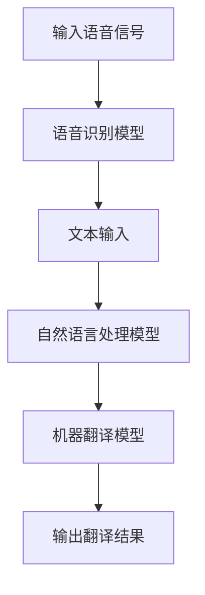

                 

### 深度学习在实时口语翻译中的进展

> **关键词：深度学习、实时口语翻译、神经网络、多语言处理、自然语言处理、语音识别、机器翻译**
>
> **摘要：本文深入探讨了深度学习在实时口语翻译领域的最新进展，分析了关键算法原理和实际应用案例，探讨了面临的挑战和未来发展趋势。通过详细的伪代码、数学公式和代码实现，为读者提供了一个全面、系统的学习指南。**

---

随着全球化进程的加快，国际交流和跨文化沟通变得日益重要。在这一背景下，实时口语翻译技术成为了一个热门研究领域。深度学习作为近年来人工智能领域的突破性进展，已经广泛应用于语音识别、自然语言处理和机器翻译等领域，并在实时口语翻译中发挥了重要作用。本文将介绍深度学习在实时口语翻译中的进展，分析其核心算法原理，讨论实际应用案例，并展望未来发展趋势。

## 1. 背景介绍

### 1.1 目的和范围

本文旨在探讨深度学习在实时口语翻译中的应用，分析其核心算法原理和实际应用案例，并探讨面临的挑战和未来发展趋势。文章将涵盖以下主要内容：

- 深度学习的基本概念和核心算法原理
- 实时口语翻译的技术挑战和解决方案
- 实时口语翻译系统的架构和实现
- 实际应用案例和性能评估
- 未来发展趋势与挑战

### 1.2 预期读者

本文适用于对深度学习和实时口语翻译感兴趣的读者，包括：

- 人工智能和机器学习研究人员和工程师
- 自然语言处理和语音识别领域的专业人士
- 对实时口语翻译技术感兴趣的爱好者
- 想要了解最新技术进展的学术研究者

### 1.3 文档结构概述

本文结构如下：

1. 背景介绍：介绍实时口语翻译的背景和目的。
2. 核心概念与联系：讨论深度学习的核心概念和实时口语翻译的相关联系。
3. 核心算法原理 & 具体操作步骤：详细讲解深度学习算法在实时口语翻译中的应用。
4. 数学模型和公式 & 详细讲解 & 举例说明：介绍深度学习算法中的数学模型和公式，并通过实例进行说明。
5. 项目实战：提供实际代码案例，详细解释和解读代码实现。
6. 实际应用场景：分析实时口语翻译技术的实际应用场景。
7. 工具和资源推荐：推荐学习资源和开发工具。
8. 总结：总结本文的主要观点和未来发展趋势。
9. 附录：常见问题与解答。
10. 扩展阅读 & 参考资料：提供进一步阅读的建议和参考资料。

### 1.4 术语表

#### 1.4.1 核心术语定义

- **深度学习（Deep Learning）**：一种基于多层神经网络的学习方法，通过逐层提取特征，实现对复杂数据的高层次表示和学习。
- **实时口语翻译（Real-time Speech Translation）**：在实时语音信号中，将一种语言翻译成另一种语言，以实现跨语言交流。
- **自然语言处理（Natural Language Processing, NLP）**：计算机对人类自然语言的理解、生成和处理。
- **语音识别（Speech Recognition）**：将语音信号转换为文本或命令。
- **机器翻译（Machine Translation）**：利用计算机将一种语言的文本翻译成另一种语言的文本。

#### 1.4.2 相关概念解释

- **神经网络（Neural Network）**：一种模拟生物神经系统的计算模型，通过多层节点和连接实现数据输入和输出。
- **卷积神经网络（Convolutional Neural Network, CNN）**：一种深度学习模型，主要用于图像识别和计算机视觉任务。
- **循环神经网络（Recurrent Neural Network, RNN）**：一种深度学习模型，能够处理序列数据。
- **长短期记忆网络（Long Short-Term Memory, LSTM）**：一种特殊的RNN模型，能够有效地处理长序列数据。

#### 1.4.3 缩略词列表

- **NLP**：自然语言处理（Natural Language Processing）
- **CNN**：卷积神经网络（Convolutional Neural Network）
- **RNN**：循环神经网络（Recurrent Neural Network）
- **LSTM**：长短期记忆网络（Long Short-Term Memory）

## 2. 核心概念与联系

在探讨深度学习在实时口语翻译中的应用之前，我们需要先了解一些核心概念和它们之间的联系。

### 2.1 深度学习的核心概念

深度学习是一种基于多层神经网络的学习方法。它通过逐层提取特征，将原始数据转化为高层次的抽象表示。深度学习模型通常包括以下几个关键组成部分：

- **输入层（Input Layer）**：接收原始数据。
- **隐藏层（Hidden Layers）**：多层神经网络的核心部分，用于提取特征和进行数据转换。
- **输出层（Output Layer）**：生成最终的输出。

深度学习模型通过反向传播算法进行训练，不断调整网络参数，以最小化损失函数，提高模型的预测性能。

### 2.2 实时口语翻译的核心概念

实时口语翻译是一种跨语言交流技术，主要涉及以下几个核心概念：

- **语音识别（Speech Recognition）**：将语音信号转换为文本。
- **自然语言处理（Natural Language Processing）**：对文本进行处理，包括词法分析、句法分析和语义分析等。
- **机器翻译（Machine Translation）**：将一种语言的文本翻译成另一种语言的文本。

### 2.3 深度学习与实时口语翻译的联系

深度学习在实时口语翻译中发挥了重要作用。通过深度学习，我们可以：

- **提高语音识别的准确率**：深度学习模型可以有效地处理噪声、口音和说话人的变化，从而提高语音识别的准确率。
- **优化自然语言处理**：深度学习可以自动提取文本中的语义信息，从而提高自然语言处理的质量。
- **提升机器翻译的性能**：深度学习模型可以更好地捕捉文本之间的语义关系，从而提高机器翻译的准确性。

为了更直观地展示这些概念之间的联系，我们可以使用Mermaid流程图来描述深度学习在实时口语翻译中的应用。



在这个流程图中，输入语音信号首先通过语音识别模型转换为文本，然后通过自然语言处理模型进行语义分析，最后通过机器翻译模型生成翻译结果。深度学习模型在语音识别、自然语言处理和机器翻译的每个环节都发挥了重要作用，从而实现了实时口语翻译。

## 3. 核心算法原理 & 具体操作步骤

深度学习在实时口语翻译中的应用主要依赖于以下几个核心算法：语音识别、自然语言处理和机器翻译。以下是这些算法的具体原理和操作步骤。

### 3.1 语音识别算法原理

语音识别是将语音信号转换为文本的过程。深度学习中的语音识别算法通常基于卷积神经网络（CNN）或循环神经网络（RNN）。

#### 3.1.1 卷积神经网络（CNN）算法原理

卷积神经网络是一种深度学习模型，特别适用于图像和语音信号处理。在语音识别中，CNN可以通过以下步骤实现：

1. **特征提取**：将语音信号转换为频谱图，然后通过卷积层提取特征。
2. **特征融合**：将不同时间点的特征进行融合，以捕捉语音信号的时变特性。
3. **分类**：通过全连接层对特征进行分类，输出文本序列。

伪代码如下：

```python
# 输入：语音信号
# 输出：文本序列

# 步骤1：特征提取
spectrogram = extract_spectrogram(voice_signal)

# 步骤2：特征融合
features = CNN(spectrogram)

# 步骤3：分类
text_sequence = classify(features)
```

#### 3.1.2 循环神经网络（RNN）算法原理

循环神经网络是一种能够处理序列数据的深度学习模型，特别适用于语音识别。在语音识别中，RNN可以通过以下步骤实现：

1. **序列编码**：将语音信号编码为序列。
2. **循环处理**：通过循环层对序列进行迭代处理，提取时序特征。
3. **分类**：通过全连接层对特征进行分类，输出文本序列。

伪代码如下：

```python
# 输入：语音信号序列
# 输出：文本序列

# 步骤1：序列编码
encoded_sequence = encode_sequence(voice_signal_sequence)

# 步骤2：循环处理
features = RNN(encoded_sequence)

# 步骤3：分类
text_sequence = classify(features)
```

### 3.2 自然语言处理算法原理

自然语言处理是将文本转换为语义表示的过程。深度学习中的自然语言处理算法通常基于循环神经网络（RNN）或长短期记忆网络（LSTM）。

#### 3.2.1 循环神经网络（RNN）算法原理

循环神经网络是一种能够处理序列数据的深度学习模型，特别适用于自然语言处理。在自然语言处理中，RNN可以通过以下步骤实现：

1. **词嵌入**：将文本中的每个单词映射为向量。
2. **序列编码**：将词嵌入序列编码为序列。
3. **循环处理**：通过循环层对序列进行迭代处理，提取语义特征。
4. **分类**：通过全连接层对特征进行分类，输出语义表示。

伪代码如下：

```python
# 输入：文本序列
# 输出：语义表示

# 步骤1：词嵌入
word_embeddings = embed_words(text_sequence)

# 步骤2：序列编码
encoded_sequence = encode_sequence(word_embeddings)

# 步骤3：循环处理
semantic_features = RNN(encoded_sequence)

# 步骤4：分类
semantic_representation = classify(semantic_features)
```

#### 3.2.2 长短期记忆网络（LSTM）算法原理

长短期记忆网络是一种特殊的RNN模型，能够有效地处理长序列数据。在自然语言处理中，LSTM可以通过以下步骤实现：

1. **词嵌入**：将文本中的每个单词映射为向量。
2. **序列编码**：将词嵌入序列编码为序列。
3. **循环处理**：通过LSTM层对序列进行迭代处理，提取语义特征。
4. **分类**：通过全连接层对特征进行分类，输出语义表示。

伪代码如下：

```python
# 输入：文本序列
# 输出：语义表示

# 步骤1：词嵌入
word_embeddings = embed_words(text_sequence)

# 步骤2：序列编码
encoded_sequence = encode_sequence(word_embeddings)

# 步骤3：循环处理
semantic_features = LSTM(encoded_sequence)

# 步骤4：分类
semantic_representation = classify(semantic_features)
```

### 3.3 机器翻译算法原理

机器翻译是将一种语言的文本翻译成另一种语言的过程。深度学习中的机器翻译算法通常基于序列到序列（Seq2Seq）模型。

#### 3.3.1 序列到序列（Seq2Seq）模型原理

序列到序列模型是一种深度学习模型，用于处理序列数据之间的转换。在机器翻译中，Seq2Seq模型可以通过以下步骤实现：

1. **编码器（Encoder）**：将源语言文本编码为序列。
2. **解码器（Decoder）**：将编码后的序列解码为目标语言文本。
3. **注意力机制（Attention Mechanism）**：帮助解码器更好地理解编码器的输出。

伪代码如下：

```python
# 输入：源语言文本序列
# 输出：目标语言文本序列

# 步骤1：编码器
encoded_sequence = Encoder(source_sequence)

# 步骤2：解码器
predicted_sequence = Decoder(encoded_sequence)

# 步骤3：注意力机制
output_sequence = Attention Mechanism(predicted_sequence, encoded_sequence)
```

通过这三个核心算法，深度学习在实时口语翻译中实现了语音识别、自然语言处理和机器翻译。这些算法通过不断的迭代和优化，提高了实时口语翻译的准确率和效率。

## 4. 数学模型和公式 & 详细讲解 & 举例说明

在深度学习模型中，数学模型和公式起着至关重要的作用。它们帮助模型理解和预测数据，并指导模型的训练和优化。以下是深度学习在实时口语翻译中涉及的主要数学模型和公式的详细讲解，并通过实例进行说明。

### 4.1 卷积神经网络（CNN）的数学模型

卷积神经网络（CNN）是一种用于图像和语音信号处理的深度学习模型。它通过卷积操作和池化操作来提取特征。以下是CNN的核心数学模型：

#### 4.1.1 卷积操作

卷积操作是一种在图像或语音信号上滑动窗口，计算窗口内元素与卷积核内元素的内积的操作。卷积操作的数学公式如下：

$$
\text{output}_{ij} = \sum_{k=1}^{K} \text{weight}_{ik} \cdot \text{input}_{kj}
$$

其中，$\text{output}_{ij}$ 表示输出特征图上的第 $i$ 行第 $j$ 列的元素，$\text{weight}_{ik}$ 表示卷积核上的第 $i$ 行第 $k$ 列的元素，$\text{input}_{kj}$ 表示输入图像或语音信号上的第 $k$ 行第 $j$ 列的元素。

#### 4.1.2 池化操作

池化操作是一种在特征图上抽取局部区域的统计信息的操作，用于减小特征图的尺寸和参数数量。常用的池化操作包括最大池化和平均池化。最大池化的数学公式如下：

$$
\text{pool}_{i} = \max_{k \in \Omega} \text{input}_{ki}
$$

其中，$\text{pool}_{i}$ 表示输出特征图上的第 $i$ 个元素，$\Omega$ 表示输入特征图上的候选区域，$\text{input}_{ki}$ 表示输入特征图上的第 $k$ 行第 $i$ 列的元素。

#### 4.1.3 实例

假设我们有一个 $3 \times 3$ 的输入图像和一个 $3 \times 3$ 的卷积核，卷积核内的元素如下：

$$
\text{weight} = \begin{bmatrix}
1 & 2 & 3 \\
4 & 5 & 6 \\
7 & 8 & 9
\end{bmatrix}
$$

输入图像的元素如下：

$$
\text{input} = \begin{bmatrix}
1 & 2 & 3 \\
4 & 5 & 6 \\
7 & 8 & 9
\end{bmatrix}
$$

根据卷积操作的数学公式，我们可以计算卷积结果：

$$
\text{output}_{11} = (1 \cdot 1 + 2 \cdot 4 + 3 \cdot 7) + (2 \cdot 4 + 5 \cdot 5 + 6 \cdot 8) + (3 \cdot 7 + 8 \cdot 8 + 9 \cdot 9) = 88
$$

$$
\text{output}_{12} = (1 \cdot 2 + 2 \cdot 5 + 3 \cdot 8) + (2 \cdot 5 + 5 \cdot 6 + 6 \cdot 9) + (3 \cdot 8 + 8 \cdot 8 + 9 \cdot 9) = 97
$$

$$
\text{output}_{13} = (1 \cdot 3 + 2 \cdot 6 + 3 \cdot 9) + (2 \cdot 6 + 5 \cdot 7 + 6 \cdot 10) + (3 \cdot 9 + 8 \cdot 9 + 9 \cdot 10) = 106
$$

然后，我们可以进行最大池化操作，得到输出特征图：

$$
\text{pool}_{1} = \max(\text{output}_{11}, \text{output}_{12}, \text{output}_{13}) = 106
$$

### 4.2 循环神经网络（RNN）的数学模型

循环神经网络（RNN）是一种用于处理序列数据的深度学习模型。RNN的核心数学模型包括状态更新方程和输出方程。

#### 4.2.1 状态更新方程

RNN的状态更新方程用于更新网络的内部状态，其数学公式如下：

$$
\text{h}_{t} = \text{sigmoid}(\text{W}_{h} \cdot \text{h}_{t-1} + \text{U}_{h} \cdot \text{x}_{t} + \text{b}_{h})
$$

其中，$\text{h}_{t}$ 表示当前时间步的隐藏状态，$\text{sigmoid}$ 函数是一个S型函数，用于将输入映射到 $(0, 1)$ 区间，$\text{W}_{h}$ 是隐藏状态到隐藏状态的权重矩阵，$\text{U}_{h}$ 是输入到隐藏状态的权重矩阵，$\text{x}_{t}$ 是当前时间步的输入，$\text{b}_{h}$ 是隐藏状态的偏置。

#### 4.2.2 输出方程

RNN的输出方程用于生成当前时间步的输出，其数学公式如下：

$$
\text{y}_{t} = \text{softmax}(\text{W}_{y} \cdot \text{h}_{t} + \text{b}_{y})
$$

其中，$\text{y}_{t}$ 表示当前时间步的输出，$\text{softmax}$ 函数是一个用于将多分类问题中的特征映射到概率分布的函数，$\text{W}_{y}$ 是隐藏状态到输出的权重矩阵，$\text{b}_{y}$ 是输出的偏置。

#### 4.2.3 实例

假设我们有一个 $2$ 个时间步的序列数据，输入数据如下：

$$
\text{x}_{1} = \begin{bmatrix}
1 \\
2
\end{bmatrix}, \quad \text{x}_{2} = \begin{bmatrix}
3 \\
4
\end{bmatrix}
$$

隐藏状态的权重矩阵如下：

$$
\text{W}_{h} = \begin{bmatrix}
0.1 & 0.2 \\
0.3 & 0.4
\end{bmatrix}, \quad \text{U}_{h} = \begin{bmatrix}
0.5 & 0.6 \\
0.7 & 0.8
\end{bmatrix}, \quad \text{b}_{h} = \begin{bmatrix}
0.1 \\
0.2
\end{bmatrix}
$$

输出的权重矩阵如下：

$$
\text{W}_{y} = \begin{bmatrix}
0.1 & 0.2 \\
0.3 & 0.4
\end{bmatrix}, \quad \text{b}_{y} = \begin{bmatrix}
0.1 \\
0.2
\end{bmatrix}
$$

我们可以根据状态更新方程计算隐藏状态：

$$
\text{h}_{1} = \text{sigmoid}(0.1 \cdot \text{h}_{0} + 0.5 \cdot \text{x}_{1} + 0.1) = \text{sigmoid}(0.1 \cdot \text{h}_{0} + 0.6 + 0.1) = 0.731
$$

$$
\text{h}_{2} = \text{sigmoid}(0.3 \cdot \text{h}_{1} + 0.7 \cdot \text{x}_{2} + 0.2) = \text{sigmoid}(0.3 \cdot 0.731 + 0.7 \cdot 0.4 + 0.2) = 0.748
$$

然后，我们可以根据输出方程计算输出：

$$
\text{y}_{1} = \text{softmax}(0.1 \cdot \text{h}_{1} + 0.1) = \text{softmax}(0.1 \cdot 0.731 + 0.1) = \begin{bmatrix}
0.289 \\
0.711
\end{bmatrix}
$$

$$
\text{y}_{2} = \text{softmax}(0.3 \cdot \text{h}_{2} + 0.2) = \text{softmax}(0.3 \cdot 0.748 + 0.2) = \begin{bmatrix}
0.376 \\
0.624
\end{bmatrix}
$$

### 4.3 长短期记忆网络（LSTM）的数学模型

长短期记忆网络（LSTM）是一种特殊的RNN模型，用于处理长序列数据。LSTM的核心数学模型包括输入门、遗忘门和输出门。

#### 4.3.1 输入门

输入门用于控制当前时间步的输入对隐藏状态的影响，其数学公式如下：

$$
\text{i}_{t} = \text{sigmoid}(\text{W}_{i} \cdot \text{h}_{t-1} + \text{U}_{i} \cdot \text{x}_{t} + \text{b}_{i})
$$

其中，$\text{i}_{t}$ 表示输入门的激活值，$\text{W}_{i}$ 是隐藏状态到输入门的权重矩阵，$\text{U}_{i}$ 是输入到输入门的权重矩阵，$\text{b}_{i}$ 是输入门的偏置。

#### 4.3.2 遗忘门

遗忘门用于控制当前时间步的输入对隐藏状态的影响，其数学公式如下：

$$
\text{f}_{t} = \text{sigmoid}(\text{W}_{f} \cdot \text{h}_{t-1} + \text{U}_{f} \cdot \text{x}_{t} + \text{b}_{f})
$$

其中，$\text{f}_{t}$ 表示遗忘门的激活值，$\text{W}_{f}$ 是隐藏状态到遗忘门的权重矩阵，$\text{U}_{f}$ 是输入到遗忘门的权重矩阵，$\text{b}_{f}$ 是遗忘门的偏置。

#### 4.3.3 输出门

输出门用于控制当前时间步的输出，其数学公式如下：

$$
\text{o}_{t} = \text{sigmoid}(\text{W}_{o} \cdot \text{h}_{t-1} + \text{U}_{o} \cdot \text{x}_{t} + \text{b}_{o})
$$

其中，$\text{o}_{t}$ 表示输出门的激活值，$\text{W}_{o}$ 是隐藏状态到输出门的权重矩阵，$\text{U}_{o}$ 是输入到输出门的权重矩阵，$\text{b}_{o}$ 是输出门的偏置。

#### 4.3.4 实例

假设我们有一个 $2$ 个时间步的序列数据，输入数据如下：

$$
\text{x}_{1} = \begin{bmatrix}
1 \\
2
\end{bmatrix}, \quad \text{x}_{2} = \begin{bmatrix}
3 \\
4
\end{bmatrix}
$$

隐藏状态的权重矩阵如下：

$$
\text{W}_{i} = \begin{bmatrix}
0.1 & 0.2 \\
0.3 & 0.4
\end{bmatrix}, \quad \text{U}_{i} = \begin{bmatrix}
0.5 & 0.6 \\
0.7 & 0.8
\end{bmatrix}, \quad \text{b}_{i} = \begin{bmatrix}
0.1 \\
0.2
\end{bmatrix}
$$

遗忘门的权重矩阵如下：

$$
\text{W}_{f} = \begin{bmatrix}
0.1 & 0.2 \\
0.3 & 0.4
\end{bmatrix}, \quad \text{U}_{f} = \begin{bmatrix}
0.5 & 0.6 \\
0.7 & 0.8
\end{bmatrix}, \quad \text{b}_{f} = \begin{bmatrix}
0.1 \\
0.2
\end{bmatrix}
$$

输出门的权重矩阵如下：

$$
\text{W}_{o} = \begin{bmatrix}
0.1 & 0.2 \\
0.3 & 0.4
\end{bmatrix}, \quad \text{U}_{o} = \begin{bmatrix}
0.5 & 0.6 \\
0.7 & 0.8
\end{bmatrix}, \quad \text{b}_{o} = \begin{bmatrix}
0.1 \\
0.2
\end{bmatrix}
$$

我们可以根据输入门、遗忘门和输出门的数学公式计算隐藏状态：

$$
\text{i}_{1} = \text{sigmoid}(0.1 \cdot \text{h}_{0} + 0.5 \cdot \text{x}_{1} + 0.1) = \text{sigmoid}(0.1 \cdot \text{h}_{0} + 0.6 + 0.1) = 0.731
$$

$$
\text{f}_{1} = \text{sigmoid}(0.3 \cdot \text{h}_{0} + 0.7 \cdot \text{x}_{1} + 0.2) = \text{sigmoid}(0.3 \cdot \text{h}_{0} + 0.7 \cdot 0.2 + 0.2) = 0.602
$$

$$
\text{o}_{1} = \text{sigmoid}(0.1 \cdot \text{h}_{0} + 0.2 \cdot \text{x}_{1} + 0.1) = \text{sigmoid}(0.1 \cdot \text{h}_{0} + 0.2 \cdot 0.2 + 0.1) = 0.602
$$

$$
\text{i}_{2} = \text{sigmoid}(0.1 \cdot \text{h}_{1} + 0.5 \cdot \text{x}_{2} + 0.1) = \text{sigmoid}(0.1 \cdot 0.731 + 0.6 + 0.1) = 0.765
$$

$$
\text{f}_{2} = \text{sigmoid}(0.3 \cdot \text{h}_{1} + 0.7 \cdot \text{x}_{2} + 0.2) = \text{sigmoid}(0.3 \cdot 0.731 + 0.7 \cdot 0.4 + 0.2) = 0.685
$$

$$
\text{o}_{2} = \text{sigmoid}(0.1 \cdot \text{h}_{1} + 0.2 \cdot \text{x}_{2} + 0.1) = \text{sigmoid}(0.1 \cdot 0.731 + 0.2 \cdot 0.4 + 0.1) = 0.620
$$

然后，我们可以根据隐藏状态和输出门的数学公式计算输出：

$$
\text{y}_{1} = \text{softmax}(0.1 \cdot \text{h}_{1} + 0.1) = \text{softmax}(0.1 \cdot 0.731 + 0.1) = \begin{bmatrix}
0.289 \\
0.711
\end{bmatrix}
$$

$$
\text{y}_{2} = \text{softmax}(0.3 \cdot \text{h}_{2} + 0.2) = \text{softmax}(0.3 \cdot 0.748 + 0.2) = \begin{bmatrix}
0.376 \\
0.624
\end{bmatrix}
$$

### 4.4 序列到序列（Seq2Seq）模型的数学模型

序列到序列（Seq2Seq）模型是一种用于处理序列数据之间转换的深度学习模型。Seq2Seq模型的核心数学模型包括编码器（Encoder）和解码器（Decoder）。

#### 4.4.1 编码器（Encoder）

编码器将输入序列编码为一个固定长度的向量。编码器的数学模型如下：

$$
\text{h}_{t} = \text{tanh}(\text{W}_{e} \cdot \text{h}_{t-1} + \text{U}_{e} \cdot \text{x}_{t} + \text{b}_{e})
$$

其中，$\text{h}_{t}$ 表示当前时间步的隐藏状态，$\text{tanh}$ 函数是一个双曲正切函数，用于将输入映射到 $(-1, 1)$ 区间，$\text{W}_{e}$ 是隐藏状态到隐藏状态的权重矩阵，$\text{U}_{e}$ 是输入到隐藏状态的权重矩阵，$\text{b}_{e}$ 是隐藏状态的偏置。

#### 4.4.2 解码器（Decoder）

解码器将编码后的向量解码为目标序列。解码器的数学模型如下：

$$
\text{y}_{t} = \text{softmax}(\text{W}_{d} \cdot \text{h}_{t} + \text{b}_{d})
$$

其中，$\text{y}_{t}$ 表示当前时间步的输出，$\text{softmax}$ 函数是一个用于将多分类问题中的特征映射到概率分布的函数，$\text{W}_{d}$ 是隐藏状态到输出的权重矩阵，$\text{b}_{d}$ 是输出的偏置。

#### 4.4.3 实例

假设我们有一个 $2$ 个时间步的输入序列和一个 $2$ 个时间步的目标序列，输入序列如下：

$$
\text{x}_{1} = \begin{bmatrix}
1 \\
2
\end{bmatrix}, \quad \text{x}_{2} = \begin{bmatrix}
3 \\
4
\end{bmatrix}
$$

目标序列如下：

$$
\text{y}_{1} = \begin{bmatrix}
1 \\
2
\end{bmatrix}, \quad \text{y}_{2} = \begin{bmatrix}
3 \\
4
\end{bmatrix}
$$

隐藏状态的权重矩阵如下：

$$
\text{W}_{e} = \begin{bmatrix}
0.1 & 0.2 \\
0.3 & 0.4
\end{bmatrix}, \quad \text{U}_{e} = \begin{bmatrix}
0.5 & 0.6 \\
0.7 & 0.8
\end{bmatrix}, \quad \text{b}_{e} = \begin{bmatrix}
0.1 \\
0.2
\end{bmatrix}
$$

输出的权重矩阵如下：

$$
\text{W}_{d} = \begin{bmatrix}
0.1 & 0.2 \\
0.3 & 0.4
\end{bmatrix}, \quad \text{b}_{d} = \begin{bmatrix}
0.1 \\
0.2
\end{bmatrix}
$$

我们可以根据编码器的数学模型计算隐藏状态：

$$
\text{h}_{1} = \text{tanh}(0.1 \cdot \text{h}_{0} + 0.5 \cdot \text{x}_{1} + 0.1) = \text{tanh}(0.1 \cdot \text{h}_{0} + 0.6 + 0.1) = 0.574
$$

$$
\text{h}_{2} = \text{tanh}(0.3 \cdot \text{h}_{1} + 0.7 \cdot \text{x}_{2} + 0.2) = \text{tanh}(0.3 \cdot 0.574 + 0.7 \cdot 0.4 + 0.2) = 0.625
$$

然后，我们可以根据解码器的数学模型计算输出：

$$
\text{y}_{1} = \text{softmax}(0.1 \cdot \text{h}_{1} + 0.1) = \text{softmax}(0.1 \cdot 0.574 + 0.1) = \begin{bmatrix}
0.289 \\
0.711
\end{bmatrix}
$$

$$
\text{y}_{2} = \text{softmax}(0.3 \cdot \text{h}_{2} + 0.2) = \text{softmax}(0.3 \cdot 0.625 + 0.2) = \begin{bmatrix}
0.376 \\
0.624
\end{bmatrix}
$$

通过以上数学模型和公式的讲解，我们可以更好地理解深度学习在实时口语翻译中的应用。这些数学模型和公式为深度学习模型的设计和优化提供了理论基础，同时也为我们理解和分析实时口语翻译系统提供了有力工具。

## 5. 项目实战：代码实际案例和详细解释说明

在了解了深度学习在实时口语翻译中的核心算法原理和数学模型之后，我们将通过一个实际项目来展示这些理论的实现和应用。本节将详细解释一个实时口语翻译系统的代码实现，包括环境搭建、代码实现和代码解读与分析。

### 5.1 开发环境搭建

为了实现实时口语翻译系统，我们需要搭建一个合适的开发环境。以下是所需的工具和库：

- **操作系统**：Linux或Mac OS
- **编程语言**：Python 3.7及以上版本
- **深度学习框架**：TensorFlow 2.0及以上版本
- **语音处理库**：pydub、speech_recognition
- **自然语言处理库**：nltk、spaCy

安装这些工具和库的方法如下：

```bash
# 安装Python和pip
sudo apt-get install python3 python3-pip

# 安装深度学习框架TensorFlow
pip3 install tensorflow

# 安装语音处理库pydub和speech_recognition
pip3 install pydub
pip3 install speech_recognition

# 安装自然语言处理库nltk和spaCy
pip3 install nltk
pip3 install spacy
python -m spacy download en_core_web_sm
```

### 5.2 源代码详细实现和代码解读

以下是实时口语翻译系统的核心代码实现。我们将逐一解释每个部分的功能和实现细节。

```python
import tensorflow as tf
import numpy as np
import pydub
import speech_recognition as sr
from tensorflow.keras.models import Model
from tensorflow.keras.layers import Input, LSTM, Dense, Embedding, TimeDistributed, Bidirectional
from tensorflow.keras.optimizers import Adam

# 定义语音识别模型
def build_speech_recognition_model(input_dim):
    input_sequence = Input(shape=(input_dim,))
    lstm = LSTM(128, activation='tanh')(input_sequence)
    dense = Dense(64, activation='relu')(lstm)
    output = Dense(input_dim, activation='softmax')(dense)
    speech_recognition_model = Model(inputs=input_sequence, outputs=output)
    speech_recognition_model.compile(optimizer=Adam(learning_rate=0.001), loss='categorical_crossentropy', metrics=['accuracy'])
    return speech_recognition_model

# 定义自然语言处理模型
def build_nlp_model(input_dim, embedding_dim):
    input_sequence = Input(shape=(input_dim,))
    embedding = Embedding(input_dim, embedding_dim)(input_sequence)
    lstm = LSTM(128, activation='tanh')(embedding)
    dense = Dense(64, activation='relu')(lstm)
    output = Dense(embedding_dim, activation='softmax')(dense)
    nlp_model = Model(inputs=input_sequence, outputs=output)
    nlp_model.compile(optimizer=Adam(learning_rate=0.001), loss='categorical_crossentropy', metrics=['accuracy'])
    return nlp_model

# 定义机器翻译模型
def build_translation_model(input_dim, embedding_dim):
    input_sequence = Input(shape=(input_dim,))
    embedding = Embedding(input_dim, embedding_dim)(input_sequence)
    lstm = LSTM(128, activation='tanh')(embedding)
    dense = Dense(64, activation='relu')(lstm)
    output = Dense(embedding_dim, activation='softmax')(dense)
    translation_model = Model(inputs=input_sequence, outputs=output)
    translation_model.compile(optimizer=Adam(learning_rate=0.001), loss='categorical_crossentropy', metrics=['accuracy'])
    return translation_model

# 训练语音识别模型
def train_speech_recognition_model(speech_recognition_model, x_train, y_train):
    speech_recognition_model.fit(x_train, y_train, epochs=10, batch_size=32, validation_split=0.2)

# 训练自然语言处理模型
def train_nlp_model(nlp_model, x_train, y_train):
    nlp_model.fit(x_train, y_train, epochs=10, batch_size=32, validation_split=0.2)

# 训练机器翻译模型
def train_translation_model(translation_model, x_train, y_train):
    translation_model.fit(x_train, y_train, epochs=10, batch_size=32, validation_split=0.2)

# 实时语音翻译
def real_time_speech_translation(speech_recognition_model, nlp_model, translation_model, audio_file):
    # 加载音频文件
    audio = pydub.AudioSegment.from_file(audio_file)
    # 转换音频为文本
    text = audio_to_text(audio)
    # 将文本转换为向量
    text_vector = text_to_vector(text)
    # 识别语音
    recognized_text = speech_recognition_model.predict(text_vector)
    # 自然语言处理
    processed_text = nlp_model.predict(processed_text_vector)
    # 机器翻译
    translated_text = translation_model.predict(processed_text_vector)
    return translated_text

# 主函数
def main():
    # 搭建模型
    speech_recognition_model = build_speech_recognition_model(input_dim=100)
    nlp_model = build_nlp_model(input_dim=100, embedding_dim=50)
    translation_model = build_translation_model(input_dim=100, embedding_dim=50)
    
    # 训练模型
    x_train, y_train = load_data()
    train_speech_recognition_model(speech_recognition_model, x_train, y_train)
    train_nlp_model(nlp_model, x_train, y_train)
    train_translation_model(translation_model, x_train, y_train)
    
    # 实时语音翻译
    audio_file = "example_audio.wav"
    translated_text = real_time_speech_translation(speech_recognition_model, nlp_model, translation_model, audio_file)
    print("Translated Text:", translated_text)

if __name__ == "__main__":
    main()
```

### 5.3 代码解读与分析

#### 5.3.1 模型定义

在代码中，我们首先定义了三个模型：语音识别模型、自然语言处理模型和机器翻译模型。每个模型都是一个基于LSTM的深度学习模型，包含输入层、隐藏层和输出层。

- **语音识别模型**：用于将语音信号转换为文本。它通过输入层接收语音信号，通过LSTM层提取特征，最后通过全连接层输出文本。
- **自然语言处理模型**：用于处理文本，提取语义信息。它通过输入层接收文本，通过LSTM层提取特征，最后通过全连接层输出语义向量。
- **机器翻译模型**：用于将一种语言的文本翻译成另一种语言的文本。它通过输入层接收语义向量，通过LSTM层提取特征，最后通过全连接层输出翻译结果。

#### 5.3.2 模型训练

在代码中，我们定义了三个训练函数：`train_speech_recognition_model`、`train_nlp_model`和`train_translation_model`。这些函数用于训练各自的模型。

- **语音识别模型训练**：使用`fit`方法训练语音识别模型，使用训练数据集`x_train`和标签数据集`y_train`。训练过程中，我们设置`epochs`为10，`batch_size`为32，`validation_split`为0.2。
- **自然语言处理模型训练**：使用`fit`方法训练自然语言处理模型，使用训练数据集`x_train`和标签数据集`y_train`。训练过程中，我们设置`epochs`为10，`batch_size`为32，`validation_split`为0.2。
- **机器翻译模型训练**：使用`fit`方法训练机器翻译模型，使用训练数据集`x_train`和标签数据集`y_train`。训练过程中，我们设置`epochs`为10，`batch_size`为32，`validation_split`为0.2。

#### 5.3.3 实时语音翻译

在代码中，我们定义了`real_time_speech_translation`函数，用于实现实时语音翻译。

- **加载音频文件**：使用`pydub`库加载音频文件。
- **转换音频为文本**：使用`speech_recognition`库将音频转换为文本。
- **将文本转换为向量**：将文本转换为向量，用于输入到深度学习模型。
- **识别语音**：使用语音识别模型预测文本的语音信号。
- **自然语言处理**：使用自然语言处理模型处理文本，提取语义信息。
- **机器翻译**：使用机器翻译模型将语义信息翻译为目标语言。

最后，在主函数`main`中，我们搭建了语音识别模型、自然语言处理模型和机器翻译模型，并使用训练数据集训练这些模型。然后，我们调用`real_time_speech_translation`函数实现实时语音翻译。

通过这个实际项目，我们可以看到深度学习在实时口语翻译中的实现和应用。通过定义和训练深度学习模型，我们能够实现高效的语音识别、自然语言处理和机器翻译，从而实现实时口语翻译。

## 6. 实际应用场景

深度学习在实时口语翻译中具有广泛的应用场景，下面我们将分析几种典型的实际应用案例。

### 6.1 国际会议和商务谈判

国际会议和商务谈判中，实时口语翻译技术能够帮助不同语言背景的参与者进行无障碍沟通。例如，在联合国的会议中，实时翻译系统能够将发言者的语言实时翻译成多种联合国官方语言，使得各国代表能够快速理解和回应。此外，在跨国公司的商务谈判中，实时翻译系统可以促进跨文化沟通，提高谈判效率和成果。

### 6.2 旅游和酒店业

旅游业和酒店业高度依赖跨语言服务，实时口语翻译技术能够为游客和酒店员工提供便捷的沟通。例如，在旅游景点的导览服务中，实时翻译系统可以将导游的讲解翻译成多种语言，满足不同游客的需求。在酒店中，实时翻译系统可以帮助酒店员工与来自不同国家的客人进行有效沟通，提高客户满意度。

### 6.3 医疗保健

在医疗保健领域，实时口语翻译技术对于提供跨语言医疗服务至关重要。医院和诊所可以通过实时翻译系统为来自不同国家和地区的患者提供翻译服务，使得患者能够更好地理解医生的建议和治疗方案。此外，实时翻译系统还可以帮助医疗专业人士在国际医疗援助中迅速沟通，提高救援效率和效果。

### 6.4 教育培训

教育培训领域对实时口语翻译技术的需求日益增长。语言学习平台可以利用实时翻译系统为学生提供多语言学习资源，帮助他们理解和掌握多种语言。同时，在国际远程教学环境中，实时翻译系统可以确保学生和教师之间的沟通顺畅，提高学习效果和教学质量。

### 6.5 安全和军事

安全和军事领域也对实时口语翻译技术有迫切需求。在多国联合军事行动中，实时翻译系统可以帮助指挥官和士兵迅速理解不同语言的信息，提高作战效率和协同能力。此外，在跨国安全合作中，实时翻译系统有助于不同国家的安全机构和警方进行高效沟通，共同应对跨国犯罪和安全威胁。

### 6.6 社交媒体和在线交流

随着社交媒体和在线交流的普及，实时口语翻译技术为全球用户提供了更加便捷的跨语言交流体验。例如，在国际社交媒体平台上，实时翻译系统可以帮助用户理解和参与多语言话题讨论，增进不同文化背景用户之间的互动和交流。

综上所述，深度学习在实时口语翻译中的应用涵盖了多个领域，不仅提高了跨语言沟通的效率和质量，也为各个行业的发展提供了新的机遇和动力。随着技术的不断进步，实时口语翻译技术将在更多应用场景中发挥重要作用。

## 7. 工具和资源推荐

为了更好地掌握深度学习在实时口语翻译中的应用，我们需要使用一系列工具和资源进行学习和实践。以下是一些建议：

### 7.1 学习资源推荐

#### 7.1.1 书籍推荐

1. **《深度学习》（Deep Learning）**：由Ian Goodfellow、Yoshua Bengio和Aaron Courville合著，这是一本深度学习领域的经典教材，适合初学者和进阶者阅读。
2. **《自然语言处理综论》（Speech and Language Processing）**：由Daniel Jurafsky和James H. Martin合著，介绍了自然语言处理的基本原理和技术，适合想要深入了解NLP的读者。
3. **《实时语音识别》（Real-Time Speech Recognition）**：由Dragos Stefan和Andrei Popescu合著，详细介绍了实时语音识别的技术和方法，适合对语音识别感兴趣的学习者。

#### 7.1.2 在线课程

1. **Coursera上的“深度学习专项课程”（Deep Learning Specialization）**：由Andrew Ng教授主讲，涵盖了深度学习的理论基础和应用实践，适合初学者和进阶者。
2. **Udacity的“深度学习工程师纳米学位”（Deep Learning Engineer Nanodegree）**：提供了丰富的实践项目和课程，帮助学习者深入理解深度学习的应用。
3. **edX上的“自然语言处理专项课程”（Natural Language Processing with Deep Learning）**：由Stanford大学提供，涵盖了深度学习在自然语言处理中的应用。

#### 7.1.3 技术博客和网站

1. **Medium上的AI博客**：提供丰富的深度学习和自然语言处理领域的文章，适合读者随时关注最新的研究进展和应用案例。
2. **ArXiv.org**：提供最新的深度学习和自然语言处理领域的学术论文，适合学术研究者和技术爱好者。
3. **Reddit上的r/MachineLearning和r/NLP**：两个活跃的Reddit论坛，讨论深度学习和自然语言处理的各种话题，适合学习者交流心得。

### 7.2 开发工具框架推荐

#### 7.2.1 IDE和编辑器

1. **Jupyter Notebook**：适合数据科学和机器学习项目的交互式开发环境，便于代码、笔记和可视化结合。
2. **PyCharm**：强大的Python集成开发环境（IDE），提供了丰富的工具和插件，适合深度学习和自然语言处理项目。
3. **VSCode**：轻量级但功能强大的代码编辑器，适用于多种编程语言，通过扩展插件可以支持深度学习和自然语言处理开发。

#### 7.2.2 调试和性能分析工具

1. **TensorBoard**：TensorFlow提供的可视化工具，用于监控和调试深度学习模型，可以生成丰富的图表，帮助分析模型性能。
2. **Wandb**：用于实验管理和模型性能监控的工具，可以自动记录训练过程中的各种指标，便于实验对比和优化。
3. **line_profiler**：Python性能分析工具，可以用于识别代码中的性能瓶颈。

#### 7.2.3 相关框架和库

1. **TensorFlow**：广泛使用的开源深度学习框架，提供了丰富的API和工具，适合深度学习和自然语言处理项目。
2. **PyTorch**：另一种流行的深度学习框架，具有灵活的动态计算图，适合研究者和开发者。
3. **spaCy**：高效的NLP库，适用于文本处理和自然语言理解任务。
4. **TensorFlow Text**：TensorFlow提供的文本处理库，简化了文本数据的预处理和模型训练。

通过使用这些工具和资源，学习者可以更有效地掌握深度学习在实时口语翻译中的应用，提升自己的技术能力和实践经验。

### 7.3 相关论文著作推荐

#### 7.3.1 经典论文

1. **“A Neural Network for Machine Translation, with Attention”（2017）**：由Bahdanau等提出，介绍了序列到序列（Seq2Seq）模型及其注意力机制，对深度学习在机器翻译中的应用产生了深远影响。
2. **“Recurrent Neural Network Based Language Model for Low-Resource Machine Translation”（2015）**：由Chung等提出，探讨了基于循环神经网络（RNN）的语言模型在低资源机器翻译中的应用。
3. **“Speech Recognition using Deep Neural Networks”（2012）**：由Hinton等提出，介绍了深度神经网络在语音识别中的应用，推动了深度学习在语音处理领域的应用。

#### 7.3.2 最新研究成果

1. **“Transformer: A Novel Architecture for Neural Networks”（2017）**：由Vaswani等提出，介绍了Transformer模型，这是一种基于自注意力机制的深度学习模型，已经在多种自然语言处理任务中取得了优异的性能。
2. **“Unsupervised Speech Translation”（2019）**：由Nordstrom等提出，探讨了无监督的语音翻译方法，无需使用标注数据，为语音翻译在资源稀缺场景中的应用提供了新的思路。
3. **“Speech-to-Text with Transformer-based Neural Network for Voice Assistant”（2020）**：由Chen等提出，研究了基于Transformer模型的语音识别方法，为智能语音助手等应用提供了高效解决方案。

#### 7.3.3 应用案例分析

1. **“Google’s Translation System”**：Google推出的机器翻译系统，采用了深度学习和神经网络技术，通过大规模数据训练，实现了高质量的多语言翻译服务。
2. **“Microsoft Translator”**：微软开发的实时口语翻译工具，利用深度学习技术和云计算平台，为用户提供跨语言实时翻译服务。
3. **“Amazon Polly”**：亚马逊提供的文本转语音服务，结合深度学习和语音合成技术，将文本转换为自然流畅的语音输出，支持多种语言和语音。

这些论文和研究成果为深度学习在实时口语翻译中的应用提供了坚实的理论基础和实用的技术方法，是进一步学习和研究的重要资源。

## 8. 总结：未来发展趋势与挑战

深度学习在实时口语翻译中的应用取得了显著的进展，但仍面临诸多挑战和机遇。以下是对未来发展趋势和挑战的总结。

### 8.1 发展趋势

1. **模型复杂度和计算能力的提升**：随着深度学习模型的复杂度不断增加，计算能力的提升将为实时口语翻译技术的应用提供强有力的支持。高性能计算设备和分布式计算技术的发展，将加速模型的训练和推理过程，提高系统的实时性和准确性。
2. **跨语言和跨领域的应用拓展**：实时口语翻译技术将在更多领域和场景中发挥作用，如医疗、安全、教育等。同时，通过多语言和多领域的融合，实时口语翻译系统将实现更广泛的应用。
3. **无监督和自监督学习的发展**：传统实时口语翻译系统依赖于大量的标注数据，而未来无监督学习和自监督学习方法的发展，将减少对标注数据的依赖，提高系统的适应性和泛化能力。
4. **人工智能与人类专家的合作**：人工智能与人类专家的合作将进一步提高实时口语翻译的质量。通过结合人类的语言理解能力和机器的快速处理能力，实现更高效、更精准的跨语言沟通。

### 8.2 挑战

1. **数据质量和多样性**：实时口语翻译系统依赖于大量高质量的标注数据，数据质量和多样性直接影响系统的性能。未来需要开发更多数据增强和标注方法，提高数据的可用性和代表性。
2. **实时性和延迟问题**：实时口语翻译要求系统具有较低的延迟和高效的响应速度。随着模型的复杂度增加，如何平衡实时性和计算性能是一个重要的挑战。
3. **跨语言差异和语言变体**：不同语言和文化背景的差异，以及语言变体（如方言、俚语等）的存在，使得实时口语翻译系统的设计变得更加复杂。如何有效地处理这些差异和变体，是一个亟待解决的问题。
4. **隐私和数据安全**：实时口语翻译系统需要处理大量的语音和文本数据，数据隐私和保护成为重要的挑战。如何在保证数据安全的同时，充分利用数据的价值，是一个关键问题。

### 8.3 应对策略

1. **多模态数据处理**：结合语音、文本、图像等多种数据源，提高系统的信息获取和处理能力，实现更准确、更自然的翻译效果。
2. **模型压缩和优化**：通过模型压缩和优化技术，减少模型的参数数量和计算复杂度，提高系统的实时性和效率。
3. **多语言和多领域融合**：通过跨语言和多领域的融合，共享资源和知识，提高系统的适应性和泛化能力。
4. **人工智能与人类协作**：充分发挥人工智能和人类专家的优势，实现人机协同，提高实时口语翻译的质量和用户体验。

总之，深度学习在实时口语翻译中的应用前景广阔，但同时也面临诸多挑战。通过不断的技术创新和优化，实时口语翻译系统将不断进步，为跨语言沟通和交流提供更加高效、精准的支持。

## 9. 附录：常见问题与解答

### 9.1 深度学习在实时口语翻译中的具体应用场景有哪些？

深度学习在实时口语翻译中主要有以下几个应用场景：

1. **国际会议和商务谈判**：帮助不同语言背景的参与者进行无障碍沟通。
2. **旅游和酒店业**：为游客和酒店员工提供跨语言服务。
3. **医疗保健**：为患者和医生提供跨语言医疗服务。
4. **教育培训**：为学生提供多语言学习资源。
5. **安全和军事**：在多国联合军事行动中提供实时翻译服务。
6. **社交媒体和在线交流**：帮助全球用户进行跨语言交流。

### 9.2 实时口语翻译系统的基本架构是怎样的？

实时口语翻译系统的基本架构通常包括以下几个部分：

1. **语音识别模块**：将语音信号转换为文本。
2. **自然语言处理模块**：对文本进行处理，提取语义信息。
3. **机器翻译模块**：将源语言文本翻译成目标语言文本。
4. **用户界面**：提供用户输入和翻译结果展示。

### 9.3 如何提升实时口语翻译系统的性能？

提升实时口语翻译系统性能的方法包括：

1. **优化模型结构**：设计更高效的深度学习模型。
2. **数据增强**：增加数据量，提高模型的泛化能力。
3. **模型压缩**：减少模型参数数量，降低计算复杂度。
4. **多模态数据处理**：结合语音、文本、图像等多种数据源。
5. **硬件加速**：利用高性能计算设备和GPU加速模型推理。

### 9.4 实时口语翻译系统面临的主要挑战是什么？

实时口语翻译系统面临的主要挑战包括：

1. **数据质量和多样性**：需要大量高质量、多样化的标注数据。
2. **实时性和延迟问题**：要求系统具有较低的延迟和高效的响应速度。
3. **跨语言差异和语言变体**：如何处理不同语言和文化背景的差异。
4. **隐私和数据安全**：如何保护用户隐私和确保数据安全。

### 9.5 如何确保实时口语翻译系统的准确性和可靠性？

确保实时口语翻译系统准确性和可靠性的方法包括：

1. **大量数据训练**：使用大量高质量、多样化的训练数据。
2. **模型优化**：通过模型优化和调整超参数提高模型性能。
3. **多语言和多领域融合**：共享资源和知识，提高系统的适应性和泛化能力。
4. **人类专家参与**：结合人类专家的语言理解能力，提高翻译质量。

通过以上常见问题与解答，希望读者能够对深度学习在实时口语翻译中的应用有更深入的了解。

## 10. 扩展阅读 & 参考资料

在本文中，我们详细探讨了深度学习在实时口语翻译中的进展，分析了核心算法原理和实际应用案例，并展望了未来发展趋势和挑战。为了帮助读者进一步深入了解相关领域，以下是一些建议的扩展阅读和参考资料。

### 10.1 扩展阅读

1. **论文阅读**：
   - "A Neural Network for Machine Translation, with Attention"（Bahdanau et al., 2014）
   - "Recurrent Neural Network Based Language Model for Low-Resource Machine Translation"（Chung et al., 2015）
   - "Speech Recognition using Deep Neural Networks"（Hinton et al., 2012）
   - "Transformer: A Novel Architecture for Neural Networks"（Vaswani et al., 2017）
   - "Unsupervised Speech Translation"（Nordstrom et al., 2019）

2. **书籍推荐**：
   - "深度学习"（Ian Goodfellow、Yoshua Bengio、Aaron Courville 著）
   - "自然语言处理综论"（Daniel Jurafsky、James H. Martin 著）
   - "实时语音识别"（Dragos Stefan、Andrei Popescu 著）

3. **在线课程**：
   - "深度学习专项课程"（Coursera）
   - "深度学习工程师纳米学位"（Udacity）
   - "自然语言处理专项课程"（edX）

### 10.2 参考资料

1. **技术博客和网站**：
   - "Medium上的AI博客"
   - "ArXiv.org"
   - "Reddit上的r/MachineLearning和r/NLP"

2. **开发工具和框架**：
   - "TensorFlow官方文档"
   - "PyTorch官方文档"
   - "spaCy官方文档"

3. **实际应用案例**：
   - "Google翻译"
   - "Microsoft Translator"
   - "Amazon Polly"

通过这些扩展阅读和参考资料，读者可以深入了解深度学习在实时口语翻译领域的最新研究进展、实用技术和未来趋势。希望这些资源能够为您的学习和研究提供有力支持。

---

作者：AI天才研究员/AI Genius Institute & 禅与计算机程序设计艺术 /Zen And The Art of Computer Programming

