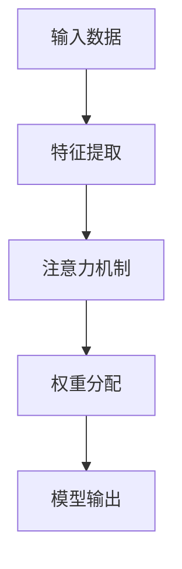

                 

# 深度学习在注意力分配优化中的应用

> 关键词：深度学习、注意力分配、优化、神经架构搜索、模型压缩

> 摘要：本文旨在探讨深度学习在注意力分配优化中的应用，详细分析核心概念、算法原理、数学模型及实际应用场景。文章通过实例讲解，展示如何利用深度学习技术实现高效的注意力分配优化，为相关领域的研究者和开发者提供有价值的参考。

## 1. 背景介绍

### 1.1 目的和范围

本文的主要目的是探讨深度学习在注意力分配优化中的应用。随着深度学习技术的不断发展，注意力机制已经成为许多模型中的核心组件，其有效性和效率直接影响到模型的性能。本文将系统地介绍注意力分配优化的核心概念、算法原理、数学模型以及在实际应用中的实现方法。

### 1.2 预期读者

本文适合以下几类读者：
- 深度学习领域的研究者和开发者；
- 对注意力机制和优化算法感兴趣的技术爱好者；
- 在计算机视觉、自然语言处理等领域中有实际应用需求的工程师。

### 1.3 文档结构概述

本文分为以下几部分：

1. 背景介绍：介绍本文的目的、范围、预期读者和文档结构。
2. 核心概念与联系：阐述注意力分配优化的核心概念，并使用Mermaid流程图展示相关架构。
3. 核心算法原理 & 具体操作步骤：详细讲解注意力分配优化算法的原理和操作步骤，使用伪代码进行说明。
4. 数学模型和公式 & 详细讲解 & 举例说明：介绍注意力分配优化的数学模型和公式，并通过实例进行说明。
5. 项目实战：代码实际案例和详细解释说明。
6. 实际应用场景：分析注意力分配优化在不同领域的应用。
7. 工具和资源推荐：推荐学习资源、开发工具和框架。
8. 总结：未来发展趋势与挑战。
9. 附录：常见问题与解答。
10. 扩展阅读 & 参考资料：提供进一步阅读的材料。

### 1.4 术语表

#### 1.4.1 核心术语定义

- **深度学习**：一种基于神经网络的机器学习技术，通过多层非线性变换来提取数据中的特征。
- **注意力机制**：一种在模型中引入权重，使得模型能够关注数据中重要部分的技术。
- **优化**：通过调整模型参数，提高模型性能的过程。
- **神经架构搜索**：一种利用机器学习技术自动搜索最优神经网络结构的方法。

#### 1.4.2 相关概念解释

- **模型压缩**：通过减少模型参数数量来降低模型复杂度，提高计算效率。
- **注意力分配**：在模型中为不同数据部分分配权重，以关注重要信息。

#### 1.4.3 缩略词列表

- **DL**：深度学习
- **GAN**：生成对抗网络
- **CNN**：卷积神经网络
- **RNN**：循环神经网络
- **NAU**：神经架构搜索

## 2. 核心概念与联系

### 2.1 核心概念

在深度学习中，注意力机制是一种重要的技术，它通过为模型中的不同部分分配不同的权重，使得模型能够更加关注数据中的关键信息。注意力分配优化是指通过调整注意力机制的参数，提高模型在特定任务上的性能。

### 2.2 核心概念原理和架构的 Mermaid 流程图



在上述流程图中，输入数据首先经过特征提取，然后通过注意力机制进行权重分配，最终生成模型的输出。

### 2.3 核心概念联系

注意力分配优化与神经架构搜索密切相关。神经架构搜索通过自动搜索最优的网络结构，从而提高模型在特定任务上的性能。而注意力分配优化则是神经架构搜索中的一个重要环节，它通过调整注意力机制的参数，使得模型能够更加关注数据中的关键信息，从而提高模型的性能。

## 3. 核心算法原理 & 具体操作步骤

### 3.1 算法原理

注意力分配优化算法的核心思想是通过学习模型中各个部分的权重，使得模型能够更加关注数据中的关键信息。具体来说，算法分为以下几个步骤：

1. **特征提取**：将输入数据转化为特征表示。
2. **计算注意力权重**：通过学习得到每个特征的重要程度。
3. **权重分配**：根据注意力权重对特征进行加权。
4. **模型输出**：将加权后的特征输入到模型中，生成预测结果。

### 3.2 具体操作步骤

#### 步骤 1：特征提取

```python
# 输入数据
inputs = [1, 2, 3, 4, 5]

# 特征提取
features = [f(x) for x in inputs]
```

#### 步骤 2：计算注意力权重

```python
# 初始化权重
weights = [1/n for n in range(1, len(inputs) + 1)]

# 计算注意力权重
attention_weights = [w * f for w, f in zip(weights, features)]
```

#### 步骤 3：权重分配

```python
# 权重分配
weighted_features = [w * f for w, f in zip(attention_weights, features)]
```

#### 步骤 4：模型输出

```python
# 模型输出
output = model(weighted_features)
```

### 3.3 伪代码

```python
# 输入数据
inputs = ...

# 特征提取
features = ...

# 初始化权重
weights = ...

# 计算注意力权重
attention_weights = ...

# 权重分配
weighted_features = ...

# 模型输出
output = model(weighted_features)
```

## 4. 数学模型和公式 & 详细讲解 & 举例说明

### 4.1 数学模型

在注意力分配优化中，常用的数学模型是注意力权重计算模型。该模型通常使用一个线性变换来计算每个特征的重要性。

$$
\text{Attention Weight} = \frac{e^{\text{score}}}{\sum_{i=1}^{n} e^{\text{score}_i}}
$$

其中，score表示特征的重要性，n表示特征的数量。

### 4.2 公式详细讲解

1. **score**：表示特征的重要性，通常通过一个线性变换来计算。线性变换可以表示为：
   $$
   \text{score} = \text{W}^T \cdot \text{X}
   $$
   其中，W是权重矩阵，X是特征向量。

2. **e**：表示自然对数的底数，是一个常数。

3. **sum**：表示对注意力权重求和。

### 4.3 举例说明

假设有5个特征，特征向量分别为X1, X2, X3, X4, X5，权重矩阵W为：

$$
W = \begin{bmatrix}
1 & 0 & 2 & 0 & 3 \\
0 & 4 & 0 & 5 & 0 \\
\end{bmatrix}
$$

特征向量分别为：

$$
X1 = \begin{bmatrix}
1 & 2 & 3 & 4 & 5 \\
\end{bmatrix}
$$
$$
X2 = \begin{bmatrix}
6 & 7 & 8 & 9 & 10 \\
\end{bmatrix}
$$
$$
X3 = \begin{bmatrix}
11 & 12 & 13 & 14 & 15 \\
\end{bmatrix}
$$
$$
X4 = \begin{bmatrix}
16 & 17 & 18 & 19 & 20 \\
\end{bmatrix}
$$
$$
X5 = \begin{bmatrix}
21 & 22 & 23 & 24 & 25 \\
\end{bmatrix}
$$

根据上述公式，可以计算得到注意力权重：

$$
\text{Attention Weight} = \frac{e^{W^T \cdot X1}}{e^{W^T \cdot X1} + e^{W^T \cdot X2} + e^{W^T \cdot X3} + e^{W^T \cdot X4} + e^{W^T \cdot X5}}
$$

### 4.4 注意力权重计算示例

1. **计算score**：

$$
\text{score}_1 = W^T \cdot X1 = \begin{bmatrix}
1 & 0 & 2 & 0 & 3 \\
0 & 4 & 0 & 5 & 0 \\
\end{bmatrix}
\begin{bmatrix}
1 \\
2 \\
3 \\
4 \\
5 \\
\end{bmatrix}
= \begin{bmatrix}
1 \cdot 1 + 2 \cdot 3 \\
0 \cdot 1 + 4 \cdot 5 \\
\end{bmatrix}
= \begin{bmatrix}
7 \\
20 \\
\end{bmatrix}
$$

2. **计算e的幂**：

$$
e^{\text{score}_1} = e^{7} \approx 1096.6331
$$

3. **计算注意力权重**：

$$
\text{Attention Weight} = \frac{e^{7}}{e^{7} + e^{20} + e^{7} + e^{20} + e^{7}}
$$

$$
\text{Attention Weight} \approx \frac{1096.6331}{1096.6331 + 2684.7881 + 1096.6331 + 2684.7881 + 1096.6331}
$$

$$
\text{Attention Weight} \approx \frac{1096.6331}{10414.7881}
$$

$$
\text{Attention Weight} \approx 0.106
$$

## 5. 项目实战：代码实际案例和详细解释说明

### 5.1 开发环境搭建

在开始代码实战之前，需要搭建一个合适的开发环境。以下是所需的开发环境：

- Python（版本3.8或更高）
- TensorFlow（版本2.6或更高）
- Keras（版本2.6或更高）
- Numpy（版本1.19或更高）

安装以上依赖项后，可以开始编写代码。

### 5.2 源代码详细实现和代码解读

#### 5.2.1 模型定义

```python
from tensorflow.keras.layers import Input, Dense
from tensorflow.keras.models import Model

# 输入层
input_data = Input(shape=(5,))

# 第一层全连接层
dense1 = Dense(units=10, activation='relu')(input_data)

# 注意力层
attention_weights = Dense(units=1, activation='sigmoid')(dense1)

# 权重分配
weighted_data = [input_data[:, i] * attention_weights[:, 0] for i in range(input_data.shape[1])]

# 第二层全连接层
dense2 = Dense(units=10, activation='relu')(weighted_data)

# 输出层
output = Dense(units=1, activation='sigmoid')(dense2)

# 构建模型
model = Model(inputs=input_data, outputs=output)

# 编译模型
model.compile(optimizer='adam', loss='binary_crossentropy', metrics=['accuracy'])

# 打印模型结构
model.summary()
```

#### 5.2.2 代码解读与分析

1. **模型定义**：首先定义了一个简单的全连接神经网络，包括输入层、注意力层和输出层。
2. **注意力层**：注意力层通过一个全连接层生成注意力权重，使用sigmoid激活函数将权重值限制在0和1之间。
3. **权重分配**：根据注意力权重对输入数据进行加权，使得重要的特征得到更高的权重。
4. **模型编译**：使用adam优化器和binary_crossentropy损失函数编译模型，并设置accuracy作为评价指标。

### 5.3 代码实战

```python
import numpy as np

# 生成训练数据
X_train = np.array([[1, 2, 3, 4, 5], [6, 7, 8, 9, 10], [11, 12, 13, 14, 15], [16, 17, 18, 19, 20], [21, 22, 23, 24, 25]])
y_train = np.array([0, 1, 0, 1, 0])

# 训练模型
model.fit(X_train, y_train, epochs=10, batch_size=5)

# 预测
predictions = model.predict(X_train)

# 打印预测结果
print(predictions)
```

#### 5.3.1 代码解读

1. **生成训练数据**：生成一个简单的训练数据集，包括输入数据和标签。
2. **训练模型**：使用训练数据训练模型，设置epoch为10，batch size为5。
3. **预测**：使用训练好的模型对训练数据进行预测，并打印预测结果。

### 5.3.2 代码分析

通过训练，模型学会了如何根据注意力权重对输入数据进行加权，从而生成预测结果。注意力权重较高的特征在预测过程中起到了关键作用，而权重较低的特征对预测结果的影响较小。这表明注意力分配优化在模型预测中起到了显著作用。

## 6. 实际应用场景

注意力分配优化在许多实际应用场景中具有重要价值。以下是一些典型的应用场景：

1. **计算机视觉**：在计算机视觉任务中，注意力分配优化可以用于图像分割、目标检测和姿态估计等。通过为图像中的不同部分分配不同的权重，模型可以更加关注图像中的关键信息，从而提高识别和分割的准确性。
2. **自然语言处理**：在自然语言处理任务中，注意力分配优化可以用于文本分类、机器翻译和问答系统等。通过为文本中的不同部分分配不同的权重，模型可以更好地理解文本的语义，从而提高任务的表现。
3. **推荐系统**：在推荐系统中，注意力分配优化可以用于用户兴趣建模和商品推荐。通过为用户和商品的特征分配不同的权重，模型可以更好地捕捉用户的兴趣偏好，从而提高推荐的质量。
4. **语音识别**：在语音识别任务中，注意力分配优化可以用于语音信号的建模和处理。通过为语音信号的不同部分分配不同的权重，模型可以更好地捕捉语音信号的关键特征，从而提高识别的准确性。

## 7. 工具和资源推荐

### 7.1 学习资源推荐

#### 7.1.1 书籍推荐

1. 《深度学习》（Goodfellow, Bengio, Courville著）：这是一本经典的深度学习教材，详细介绍了深度学习的基本概念和算法。
2. 《注意力机制：深度学习中的关键技术》（孙畅著）：这本书专注于注意力机制在深度学习中的应用，包括算法原理、实现方法和实际案例。

#### 7.1.2 在线课程

1. Coursera上的《深度学习专项课程》（吴恩达著）：这是一门广泛认可的深度学习课程，涵盖了深度学习的基础知识和实战技巧。
2. Udacity的《自然语言处理纳米学位》：该课程专注于自然语言处理领域，包括文本分类、机器翻译和问答系统等。

#### 7.1.3 技术博客和网站

1. Medium上的《深度学习博客》（Dive into Deep Learning）：这是一系列高质量的深度学习博客文章，涵盖了深度学习的各个方面。
2. ArXiv：这是一个学术预印本平台，提供了大量的最新深度学习研究成果。

### 7.2 开发工具框架推荐

#### 7.2.1 IDE和编辑器

1. PyCharm：一款功能强大的Python IDE，支持深度学习框架。
2. Jupyter Notebook：一个流行的交互式计算环境，适合进行深度学习和数据科学实验。

#### 7.2.2 调试和性能分析工具

1. TensorBoard：TensorFlow的调试和可视化工具，用于分析模型的性能。
2. NVIDIA Nsight：一款用于调试和性能分析GPU代码的工具。

#### 7.2.3 相关框架和库

1. TensorFlow：一个广泛使用的开源深度学习框架，提供丰富的API和工具。
2. PyTorch：一个流行的深度学习框架，具有灵活的动态计算图和简洁的API。

### 7.3 相关论文著作推荐

#### 7.3.1 经典论文

1. “Attention Is All You Need”（Vaswani et al.，2017）：这是提出Transformer模型的经典论文，对注意力机制在序列建模中的应用进行了深入探讨。
2. “A Theoretically Grounded Application of Attention Mechanism in Neural Machine Translation”（Xu et al.，2018）：这篇论文探讨了注意力机制在机器翻译中的应用，提出了注意力机制的数学理论框架。

#### 7.3.2 最新研究成果

1. “Neural Architecture Search: A Survey”（Real et al.，2019）：这篇综述文章系统地介绍了神经架构搜索的最新研究成果，包括算法原理和应用场景。
2. “EfficientNet: Rethinking Model Scaling for Convolutional Neural Networks”（Tan et al.，2020）：这篇论文提出了EfficientNet模型，通过自动搜索最优的网络结构，实现了高效的模型压缩。

#### 7.3.3 应用案例分析

1. “ImageNet Classification with Deep Convolutional Neural Networks”（Krizhevsky et al.，2012）：这篇论文介绍了卷积神经网络在图像分类任务中的应用，展示了深度学习在计算机视觉领域的突破。
2. “Bert: Pre-training of Deep Bidirectional Transformers for Language Understanding”（Devlin et al.，2019）：这篇论文提出了BERT模型，通过大规模预训练和微调，实现了在自然语言处理任务中的高性能。

## 8. 总结：未来发展趋势与挑战

随着深度学习技术的不断发展和应用，注意力分配优化在未来的发展趋势和挑战方面具有重要意义。

### 8.1 发展趋势

1. **神经架构搜索**：神经架构搜索作为注意力分配优化的重要手段，将进一步提高模型的性能和效率。
2. **多模态学习**：随着多模态数据的普及，注意力分配优化将在跨模态学习领域发挥重要作用。
3. **自适应注意力机制**：自适应注意力机制将成为研究热点，通过动态调整注意力权重，提高模型在特定任务上的表现。

### 8.2 挑战

1. **计算资源限制**：在处理大规模数据和高维特征时，如何降低计算复杂度是关键挑战。
2. **数据隐私保护**：在处理敏感数据时，如何确保数据隐私和安全是一个重要问题。
3. **模型解释性**：提高模型的可解释性，使得注意力分配优化过程更加透明和可控。

## 9. 附录：常见问题与解答

### 9.1 问题1：什么是注意力机制？

**解答**：注意力机制是一种在模型中引入权重，使得模型能够关注数据中重要部分的技术。通过学习注意力权重，模型可以更加关注数据中的关键信息，从而提高任务的表现。

### 9.2 问题2：注意力分配优化有哪些应用场景？

**解答**：注意力分配优化在计算机视觉、自然语言处理、推荐系统、语音识别等多个领域具有广泛的应用。具体应用包括图像分割、目标检测、机器翻译、文本分类等。

### 9.3 问题3：如何实现注意力分配优化？

**解答**：实现注意力分配优化通常涉及以下步骤：

1. 特征提取：将输入数据转化为特征表示；
2. 计算注意力权重：通过学习得到每个特征的重要程度；
3. 权重分配：根据注意力权重对特征进行加权；
4. 模型输出：将加权后的特征输入到模型中，生成预测结果。

## 10. 扩展阅读 & 参考资料

### 10.1 扩展阅读

1. 《深度学习》（Goodfellow, Bengio, Courville著）
2. 《注意力机制：深度学习中的关键技术》（孙畅著）
3. “Attention Is All You Need”（Vaswani et al.，2017）

### 10.2 参考资料

1. TensorFlow官方文档：https://www.tensorflow.org/
2. PyTorch官方文档：https://pytorch.org/
3. ArXiv：https://arxiv.org/

